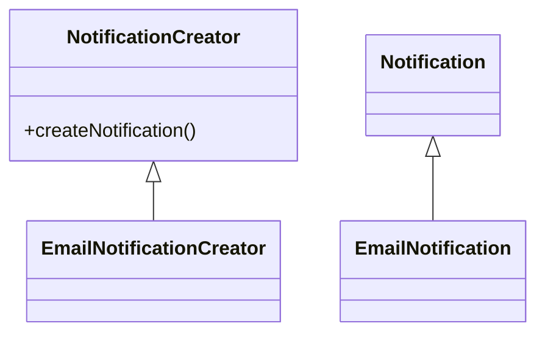
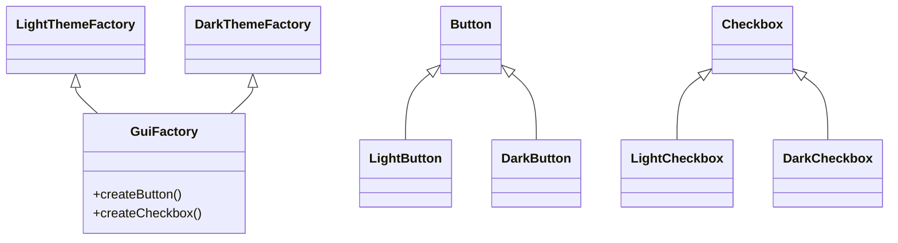

# Creational Design Patterns — Mini Book (Java)

> Kısa açıklama: Bu mini kitap, creational (oluşturucu) tasarım desenlerini hızlıca öğrenmen için hazırlanmış, her desen için "Amaç, Problem, Çözüm, Yapı, Örnek, Ne Zaman Kullanılır, Artılar / Eksiler" şablonunu takip eder.

---

**Yazar:** Tunahan Can  
**Versiyon:** 1.0  
**Dil:** Türkçe  
**Repo:** Bu dosya proje kökünde `BOOK.md` olarak bulunur.

[](./) [](LICENSE)

---

İçindekiler

1. Factory Method
2. Abstract Factory
3. Builder
4. Prototype
5. Singleton

---

Kullanım Notu

- Bu dosya hem düz Markdown olarak okunabilir hem de MkDocs veya GitBook gibi araçlarla statik siteye dönüştürülebilir.
- Her desen için "Örnek" bölümünde proje içindeki Java dosyalarına (örn. `src/main/java/com/can/creational/...`) referans verilir.

---

Nasıl yayınlanır (hızlı kılavuz)

MkDocs (statik site)

```bash
python3 -m pip install --user mkdocs mkdocs-material mkdocs-include-markdown-plugin
mkdocs new . --no-input || true
# mkdocs.yml dosyanızı güncelleyin (ör. material teması) ve docs/ altına bu BOOK.md'i taşıyın veya include edin
mkdocs serve
```

Pandoc (PDF / ePub)

```bash
brew install pandoc
# MacTeX/TeX Live gerekebilir
pandoc BOOK.md -o design-patterns.pdf --pdf-engine=pdflatex
```

---

Şablon: Her desen için takip edilecek yapı

- Amaç (Intent)
- Problem (Problem)
- Çözüm (Solution) — kısa açıklama, gerekli roller (sınıflar/arayüzler)
- Yapı (Structure) — UML / mermaid diyagramı veya kısa class listesi
- Örnek (Example) — projedeki sınıf yollarına referans ve kısa kod snippet (gerekirse include)
- Ne zaman kullanılır? (When to use)
- Artılar / Eksiler (Pros / Cons)

---

## 1) Factory Method

### Amaç
Nesne oluşturma işini alt sınıflara devretmek; hangi sınıfın yaratılacağına çalışma zamanında karar vermek.

### Problem
Farklı türde nesneler yaratılması gereken kodda `new` kullanımı dağıldığında, yeni bir ürün türü eklendiğinde değişimin merkezileştirilmesi zorlaşır.

### Çözüm
Create (factory) metodu soyutlayıp, alt sınıfların somut ürünleri üretmesine izin ver.

### Yapı
Merak edilen roller:
- Creator (örn. `NotificationCreator`) — fabrika metodu içerir.
- ConcreteCreator (örn. `EmailNotificationCreator`) — somut ürünleri üretir.
- Product (örn. `Notification`) — yaratılan nesnelerin ortak arayüzü.

Mermaid (basit sınıf diyagramı)



### Örnek
Projede ilgili dosya: `src/main/java/com/can/creational/factorymethod/FactoryMethodDemo.java` (örnek sınıflar: `NotificationCreator`, `EmailNotification`, `SmsNotification`, `PushNotification`).

> İpucu: MkDocs ile `include-markdown` plugin kullanırsan, örnek kod parçalarını doğrudan kaynak dosyalardan çekip sayfada gösterebilirsin.

### Ne zaman kullanılır?
- Nesne oluşturma mantarını merkezileştirmek istediğinde.
- Altta yatan sınıfın kararı alt sınıflara bırakılmalıysa.

### Artılar / Eksiler
- Artı: Yeni ürün türleri için Creator alt sınıfları eklemek kolay.
- Eksi: Çok sayıda alt sınıf oluşturabilir; basit durumlarda aşırı karmaşık olabilir.

---

## 2) Abstract Factory

### Amaç
Birbiriyle ilişkili ürün ailelerini, somut sınıflara bağlanmadan üretmek.

### Problem
Uyumlu ürün setleri (örn. UI tema bileşenleri) farklı somut sınıflarla temsil edildiğinde, tüm birleşenlerin birlikte değiştirilmesi zorlaşır.

### Çözüm
Bir `AbstractFactory` arayüzü tanımla; somut fabrikalar (örn. `LightThemeFactory`, `DarkThemeFactory`) uyumlu ürünleri üretir.

### Yapı
- AbstractFactory (`GuiFactory`) — `createButton()`, `createCheckbox()` metodları.
- ConcreteFactory (`LightThemeFactory`, `DarkThemeFactory`).
- AbstractProduct (örn. `Button`, `Checkbox`).
- ConcreteProduct (örn. `LightButton`, `DarkButton`).

Mermaid örneği:



### Örnek
Projede ilgili dosya: `src/main/java/com/can/creational/abstractfactory/AbstractFactoryDemo.java`.

### Ne zaman kullanılır?
- Bir uygulamanın birbirleriyle uyumlu ürün ailelerini birlikte değiştirme ihtiyacı olduğunda.

### Artılar / Eksiler
- Artı: Ürün aileleri arası tutarlılık sağlar.
- Eksi: Yeni ürün türü eklemek zor olabilir (factory ve tüm concrete product sınıfları güncellenmeli).

---

## 3) Builder

### Amaç
Karmaşık nesneleri adım adım inşa etmek; okunabilir ve yönetilebilir kod ile çok sayıda opsiyonel parametreyi ele almak.

### Problem
Çok sayıda opsiyonel parametreye sahip bir sınıfın yapıcıları (constructors) ile yönetilmesi zorlaşır (constructor parametre patlaması).

### Çözüm
Bir `Builder` sınıfı tanımla; adım adım gerekli alanları set edip son olarak `build()` çağır.

### Yapı
- Product (`Report`)
- Builder (`Report.Builder`) — zincirlenebilir setter metodları ve `build()`.

### Örnek
Projede ilgili dosya: `src/main/java/com/can/creational/builder/BuilderDemo.java`.

### Ne zaman kullanılır?
- Eğer nesnenin oluşturulması birden fazla adım gerektiriyorsa veya birçok opsiyonel alan varsa.

### Artılar / Eksiler
- Artı: Okunaklı API ve immutability ile uyumlu tasarım.
- Eksi: Çok küçük ve basit nesneler için aşırı olabilir.

---

## 4) Prototype

### Amaç
Mevcut bir nesnenin klonunu oluşturarak yeni nesneler türetmek.

### Problem
Nesne oluşturmanın maliyetli olduğu veya konfigürasyonun karmaşık olduğu durumlarda her seferinde yeniden inşa etmek pahalıdır.

### Çözüm
Bir `Prototype` arayüzü ile `clone()`/`copy()` metodunu tanımla; hazır örneklerden çoğalt.

### Yapı
- Prototype arayüzü (örn. `Prototype`)
- ConcretePrototype (örn. `Resume`) — kopyalama mantığı içerir.

### Örnek
Projede ilgili dosya: `src/main/java/com/can/creational/prototype/PrototypeDemo.java`.

### Ne zaman kullanılır?
- Nesne oluşturma pahalıysa veya çok sayıda benzer nesne üretilecekse.

### Artılar / Eksiler
- Artı: Hızlı türetme, karmaşık konfigürasyonların tekrar kullanılabilmesi.
- Eksi: Derin/kopya problemi (deep vs shallow copy) yönetimi gerekir.

---

## 5) Singleton

### Amaç
Uygulama boyunca tek bir instance gerektiğinde bu durumu garanti altına almak.

### Problem
Global erişim gereken ancak birden fazla örnek istenmeyen kaynaklar (config, cache) için sınır koymak.

### Çözüm
Singleton deseni: instance'ı kontrollü şekilde yarat ve herkese aynı referansı sağla. Thread-safety için double-checked locking veya enum tabanlı yaklaşımlar tercih edilebilir.

### Yapı
- Singleton sınıfı (örn. `AppConfig`) — özel constructor, static erişim metodu.

### Örnek
Projede ilgili dosya: `src/main/java/com/can/creational/singleton/SingletonDemo.java`.

### Ne zaman kullanılır?
- Konfigürasyon, uygulama geneli cache, log yönetimi gibi tekil paylaşılacak kaynaklar olduğunda.

### Artılar / Eksiler
- Artı: Basit global erişim.
- Eksi: Test edilebilirliği ve bağımlılık yönetimi zorlaşabilir; dikkatli kullanılmalı.

---

Ek bölümler

Contributing

- Fork > Feature branch > Pull request
- Kod örnekleri için JUnit testleri ekle (zorunlu değil ama önerilir)

License

- Bu repo için uygun gördüğün lisansı kök dizine (LICENSE) ekle. Örnek: CC BY-SA 4.0 veya MIT.

---

Son not

Bu şablon, kitabını hem okuyucu dostu bir statik siteye hem de PDF/ePub çıktısına kolayca dönüştürebilmen için düzenlendi. İstersen ben MkDocs yapılandırması (`mkdocs.yml`) ve `docs/` dizinine bölümlere ayrılmış Markdown dosyaları oluşturarak devam edebilirim — hangisini istersin?
