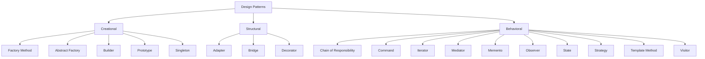
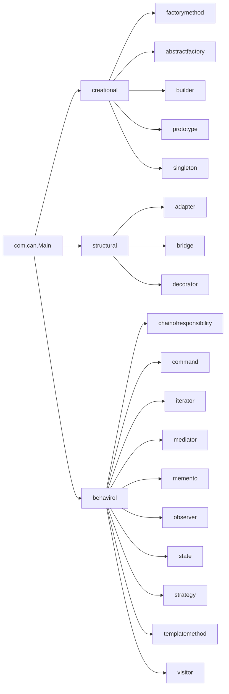
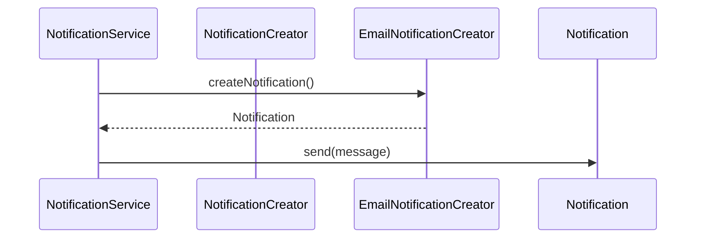
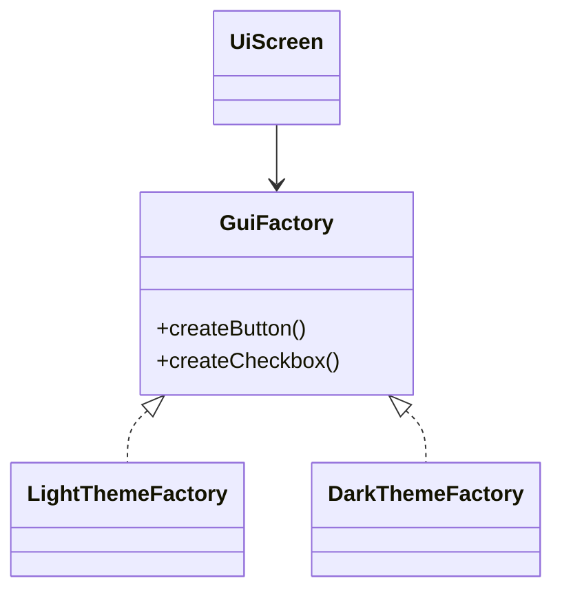
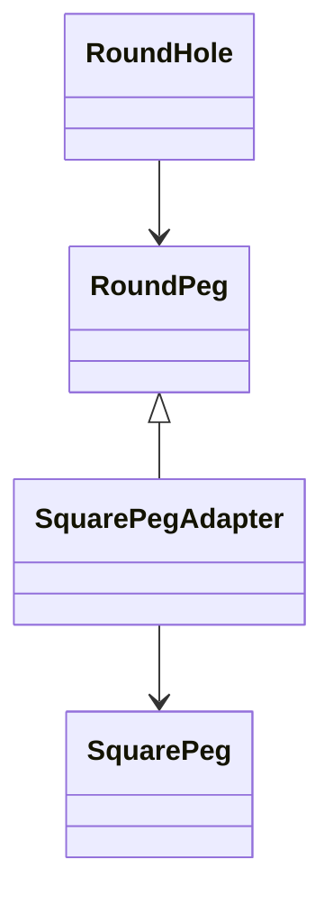
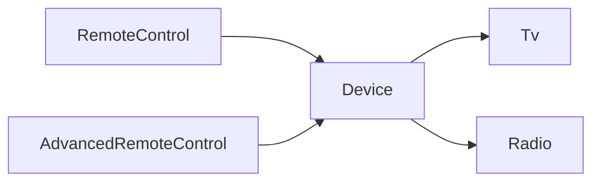
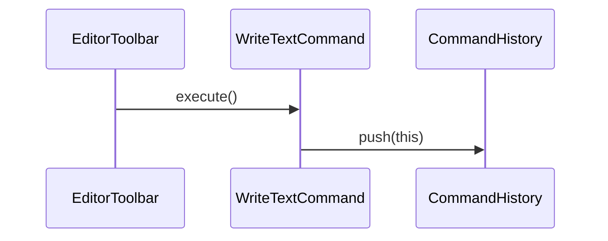
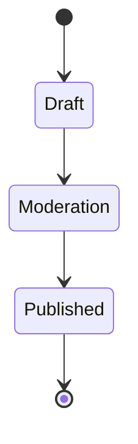
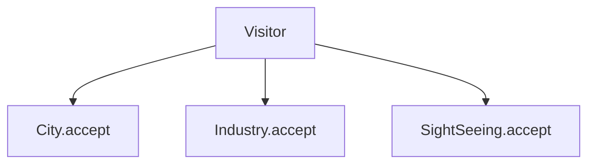
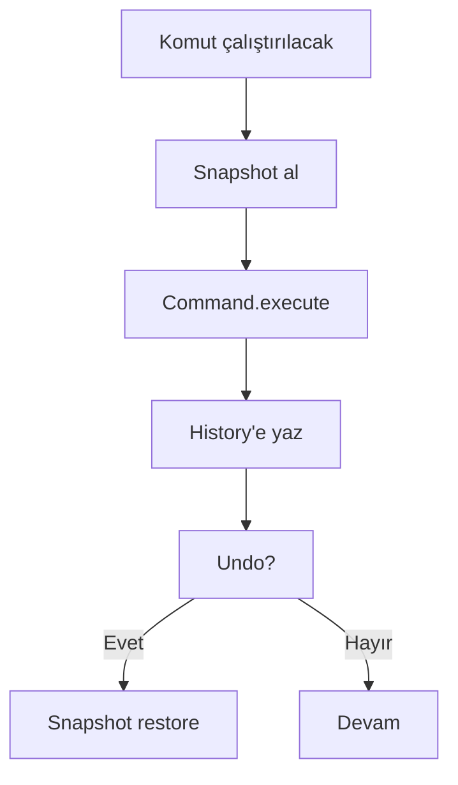

# Design Patterns Kitabı (Java Projesi)

Bu doküman, repodaki örnekleri bir **yazılım mühendisi gözüyle** anlatır: problemi neden yaşadığımızı, pattern’in neyi optimize ettiğini, maliyetlerini ve projedeki gerçek sınıf karşılıklarını birlikte ele alır.

---

## 1) Mühendislik Perspektifi: Neden Pattern Kullanırız?

Design pattern, “kod şablonu” değil; tekrarlanan tasarım kararlarını isimlendiren bir **iletişim protokolüdür**.

Pratikte kazandırdıkları:
- **Ortak dil:** “Burada Strategy var” dediğiniz anda ekip aynı soyut modele bakar.
- **Değişim izolasyonu:** Değişecek kısmı (algoritma, durum, üretim yolu) sabit kalan kısımdan ayırır.
- **Test edilebilirlik:** Bağımlılık noktaları netleştiği için birim testte sahte/stub nesnelerle doğrulama kolaylaşır.
- **Teknik borç kontrolü:** Koşul dallanmalarının ve “God class” yapıların büyümesini sınırlar.

> **Not:** Pattern seçimi “daha fazla soyutlama” anlamına gelir. Her soyutlama bir bakım maliyeti taşır. Bu yüzden pattern’i sadece açık bir değişim ihtiyacı veya tekrar eden bir problem varsa uygulamak gerekir.

---

## 2) Pattern Aileleri ve Karar Haritası

- **Creational:** Nesnenin *nasıl üretildiğini* soyutlar.
- **Structural:** Bileşenlerin *nasıl bağlandığını* düzenler.
- **Behavioral:** Nesnelerin *nasıl iletişim kurduğunu* tanımlar.



ASCII fallback:

```text
Design Patterns
├─ Creational: üretim kararları
├─ Structural: kompozisyon ve bağımlılık yapısı
└─ Behavioral: işbirliği ve sorumluluk akışı
```

### 2.1 Hızlı seçim matrisi

| İhtiyaç | Pattern | Neden |
|---|---|---|
| Aynı türde farklı nesne üretimleri | Factory Method | Üretim kararını alt sınıfa bırakır |
| Birbiriyle uyumlu ürün ailesi | Abstract Factory | Tutarlı tema/platform ürünlerini birlikte üretir |
| Karmaşık tek nesne kurulum akışı | Builder | Adım adım, okunabilir ve güvenli kurulum |
| Mevcut API uyumsuzluğu | Adapter | Mevcut kodu kırmadan dönüştürür |
| Algoritmayı runtime’da değiştirme | Strategy | if/else zinciri yerine seçilebilir davranış |
| Duruma göre davranış geçişi | State | Durum makinesi modelini nesnelere taşır |
| Geri alma (undo) ihtiyacı | Command + Memento | Komutu ve geçmişi ayrıştırır |

---

## 3) Paket Yapısı (Projeyle Eşleştirme)

- `src/main/java/com/can/creational/`
- `src/main/java/com/can/structural/`
- `src/main/java/com/can/behavirol/`



---

## 4) Patternler (Teknik ve Uygulamalı Anlatım)

Her başlıkta şu şablon izlenir: **Problem → Çözüm fikri → Trade-off → Projedeki karşılık → Diyagram**.

### A) Creational

#### A.1 Factory Method

**Problem:** Üretilecek nesne tipi runtime’da seçiliyor (Email/SMS/Push), ama istemci sınıfı hangi somut sınıfı ürettiğini bilmemeli.

**Çözüm:** `NotificationCreator#createNotification()` üretimi alt sınıflara delege eder.

**Trade-off:** Sınıf sayısı artar; buna karşılık üretim kararı merkezden ayrılır.

**Projedeki sınıflar:**
- `.../factorymethod/NotificationCreator.java`
- `.../factorymethod/EmailNotificationCreator.java`
- `.../factorymethod/SmsNotificationCreator.java`
- `.../factorymethod/PushNotificationCreator.java`
- `.../factorymethod/NotificationService.java`



#### A.2 Abstract Factory

**Problem:** Birbiriyle uyumlu UI bileşenlerini (Button + Checkbox) tema bazında birlikte üretmek gerekir.

**Çözüm:** `GuiFactory` aile üretim arayüzüdür; `LightThemeFactory` ve `DarkThemeFactory` somut ailelerdir.

**Trade-off:** Yeni ürün tipi eklendiğinde tüm factory’ler güncellenir.



#### A.3 Builder

**Problem:** Çok sayıda opsiyonel alan içeren nesnelerde constructor patlaması.

**Çözüm:** `Report.Builder` ile adım adım kurulum, en sonda `build()`.

```mermaid
flowchart LR
    A[Builder.title()] --> B[Builder.author()]
    B --> C[Builder.content()]
    C --> D[build()]
    D --> E[Immutable Report]
```

#### A.4 Prototype

**Problem:** Maliyeti yüksek nesnelerden sık kopya üretme.

**Çözüm:** `copy()` ile mevcut örnekten yeni nesne üret.

```mermaid
flowchart TD
    R[Registry Prototype] -->|copy()| C1[Candidate A]
    R -->|copy()| C2[Candidate B]
```

#### A.5 Singleton

**Problem:** Uygulama genelinde tek konfigürasyon kaynağı.

**Çözüm:** `AppConfig.getInstance()` ile tek örnek erişimi.

**Dikkat:** Global state testlerde bağımlılık yaratabilir.

---

### B) Structural

#### B.1 Adapter

**Problem:** `RoundHole`, `SquarePeg` ile doğrudan uyumlu değil.

**Çözüm:** `SquarePegAdapter`, `RoundPeg` gibi davranır ve kare veriyi dönüştürür.



#### B.2 Bridge

**Problem:** Kumanda çeşitleri ve cihaz çeşitleri ayrı eksenlerde büyüyor.

**Çözüm:** `RemoteControl` (abstraction) + `Device` (implementation) ayrımı.



#### B.3 Decorator

**Problem:** Bildirim kanal kombinasyonları (email+sms+slack...) kalıtımla patlar.

**Çözüm:** Davranışı katmanlı şekilde sar.


---

### C) Behavioral

#### C.1 Chain of Responsibility

**Problem:** İstek doğrulama adımları ardışık ve bağımsız olmalı.

**Çözüm:** Handler zinciri (`Authentication -> Authorization -> Processing`).


#### C.2 Command

**Problem:** UI aksiyonları soyutlanmalı ve geçmişe yazılmalı.

**Çözüm:** Her aksiyon bir `Command`; toolbar sadece `execute()` çağırır.



#### C.3 Iterator

**Problem:** Sosyal ağ verisine yapıyı ifşa etmeden dolaşım.

**Çözüm:** `ProfileIterator` ile gezinti sözleşmesi.

#### C.4 Mediator

**Problem:** UI bileşenleri birbirini doğrudan bilirse coupling artar.

**Çözüm:** Tüm etkileşim `AuthenticationDialog` üzerinden akar.

#### C.5 Memento

**Problem:** İç durumu dışarı açmadan geri alma.

**Çözüm:** `TextEditor` snapshot üretir, `EditorHistory` saklar.

#### C.6 Observer

**Problem:** Mağaza olaylarını birden fazla müşteriye yayınlama.

**Çözüm:** `Store` subscriber listesi tutar, olayda notify eder.

#### C.7 State

**Problem:** Belgenin davranışı mevcut durumuna bağlı (Draft/Moderation/Published).

**Çözüm:** Her durum ayrı sınıf; geçişler explicit.



#### C.8 Strategy

**Problem:** Hesaplama algoritmasını koşullu yapılarla yönetmek karmaşıklaşıyor.

**Çözüm:** `CalculatorContext`, seçilen `CalculationStrategy`ye delegasyon yapar.

#### C.9 Template Method

**Problem:** Süreç iskeleti aynı, adımlar kaynak türüne göre değişiyor.

**Çözüm:** `DocumentMiningTemplate` akışı sabitler; PDF/CSV miner adımları özelleştirir.

#### C.10 Visitor

**Problem:** GeoNode türlerine yeni operasyon eklemek istiyoruz, ama her sınıfı sık değiştirmek istemiyoruz.

**Çözüm:** Operasyonları ziyaretçi sınıflarında toplarız (`RiskAuditVisitor`, `XmlExportVisitor`).



---

## 5) Pattern Geçişleri ve Evrim Kararları

### 5.1 Factory Method → Abstract Factory
- Başlangıçta tek ürün varyasyonu varsa Factory Method yeterli.
- Ürünler birlikte değişmeye başladıysa (tema, platform, marka), Abstract Factory’e geç.

### 5.2 Strategy vs State karar kuralı
- **Seçim dışarıdan yapılıyorsa:** Strategy.
- **Geçişler nesnenin iç yaşam döngüsündeyse:** State.

### 5.3 Command + Memento birlikte kullanım



---

## 6) Kod Kalitesi İçin Uygulama Notları

- Pattern’i “önce” değil, **tekrar eden tasarım baskısı** görüldüğünde uygula.
- Her pattern için birim testte en az bir “negatif/kenar durum” senaryosu bulundur.
- `if/else` kaldırma uğruna gereksiz soyutlama ekleme.
- Paket adları ve sınıf adları pattern niyetini açık ifade etmeli.

---

## 7) Yayınlama (Markdown → HTML/PDF)

### HTML
```bash
pandoc BOOK.md -s -o book.html --toc --metadata title="Design Patterns Kitabı"
```

### PDF
```bash
pandoc BOOK.md \
  --from gfm \
  --pdf-engine=xelatex \
  --toc \
  -V geometry:margin=2.2cm \
  -V colorlinks=true \
  -o book.pdf
```

---

## 8) Son Söz

Bu projedeki örnekler, pattern’leri “kitap tanımı” seviyesinden çıkarıp günlük mühendislik kararlarına bağlar.
En doğru pattern; en şık görünen değil, değişim maliyetini en düşük tutandır.
