# Design Patterns Kitabı (Java Projesi)

Bu doküman, projedeki pattern örneklerini ilişki odaklı olarak açıklar. Her pattern altında Mermaid diyagramı, Mermaid desteklenmeyen ortamlar için ASCII/tablo fallback’i ve doğrudan proje dosya yolları verilir.

---

## 1) Giriş

Design Pattern; tekrar eden tasarım problemlerini, rol bazlı ve yeniden kullanılabilir bir yaklaşımla çözmek için kullanılan isimli tasarım şablonudur.

---

## 2) Pattern Aileleri

- **Creational**: Nesne oluşturma süreçlerine odaklanır.
- **Structural**: Sınıf/nesne kompozisyonuna odaklanır.
- **Behavioral**: Nesneler arası iletişim ve sorumluluk dağılımına odaklanır.

### 2.1 Aile haritası (Creational / Structural / Behavioral)

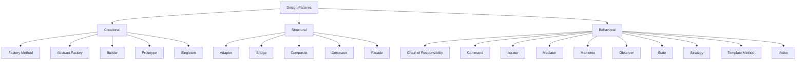

ASCII fallback:

```text
Design Patterns
├─ Creational: Factory Method, Abstract Factory, Builder, Prototype, Singleton
├─ Structural: Adapter, Bridge, Composite, Decorator, Facade
└─ Behavioral: CoR, Command, Iterator, Mediator, Memento, Observer, State, Strategy, Template Method, Visitor
```

Bu projedeki karşılığı:
- `src/main/java/com/can/creational/`
- `src/main/java/com/can/structural/`
- `src/main/java/com/can/behavirol/`

### 2.2 “Benzer amaç, farklı yaklaşım” matrisi

| Karşılaştırma | Ortak amaç | Ayrım noktası | Bu projedeki sınıflar |
|---|---|---|---|
| Factory Method vs Abstract Factory vs Builder | Esnek nesne üretimi | FM tek ürün üretimini alt sınıfa bırakır; AF ürün ailelerini birlikte üretir; Builder tek bir karmaşık ürünü adım adım kurar | `NotificationCreator` / `GuiFactory` / `Report.Builder` |
| Strategy vs State | Davranışı runtime’da değiştirme | Strategy dışarıdan algoritma seçimi; State iç durum geçişine bağlı davranış | `CalculationStrategy` / `DocumentState` |
| Adapter vs Bridge | Arayüz uyumu ve bağımlılık azaltma | Adapter mevcut uyumsuz API’yi sarar; Bridge iki ekseni baştan ayırır (abstraction-implementation) | `SquarePegAdapter` / `RemoteControl` + `Device` |
| Composite vs Decorator | Recursive kompozisyon kullanımı | Composite birden çok çocuğun sonucunu toplar; Decorator tek çocuğa davranış ekler | `Box` + `OrderComponent` / `Notifier` + Decorator stack |

ASCII fallback:

```text
FM: tek ürün tipi varyasyonu
AF: ilişkili ürün ailesi varyasyonu
Builder: tek karmaşık ürünün kurulum varyasyonu

Strategy: algoritmayı seç
State: duruma göre davranışı değiştir

Adapter: mevcut sistemi uydur
Bridge: sistemi baştan iki eksende ayır
```

Bu projedeki karşılığı:
- `src/main/java/com/can/creational/factorymethod/`
- `src/main/java/com/can/creational/abstractfactory/`
- `src/main/java/com/can/creational/builder/`
- `src/main/java/com/can/behavirol/strategy/`
- `src/main/java/com/can/behavirol/state/`
- `src/main/java/com/can/structural/adapter/`
- `src/main/java/com/can/structural/bridge/`
- `src/main/java/com/can/structural/composite/`
- `src/main/java/com/can/structural/decorator/`
- `src/main/java/com/can/structural/facade/`

### 2.3 Kod tabanında paket bazlı ilişki grafiği

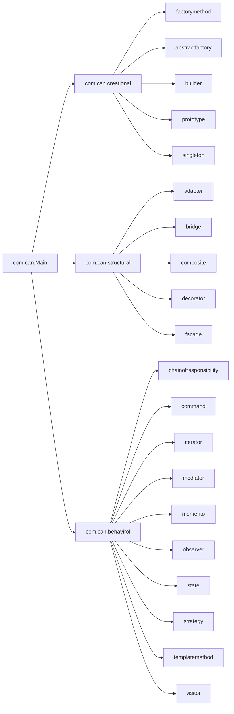

ASCII fallback:

```text
com.can
├─ Main
├─ creational (factorymethod, abstractfactory, builder, prototype, singleton)
├─ structural (adapter, bridge, composite, decorator, facade)
└─ behavirol (chainofresponsibility, command, iterator, mediator, memento, observer, state, strategy, templatemethod, visitor)
```

Bu projedeki karşılığı:
- `src/main/java/com/can/Main.java`
- `src/main/java/com/can/creational/**`
- `src/main/java/com/can/structural/**`
- `src/main/java/com/can/behavirol/**`

---

## A) Creational Patterns

## A.1 Factory Method

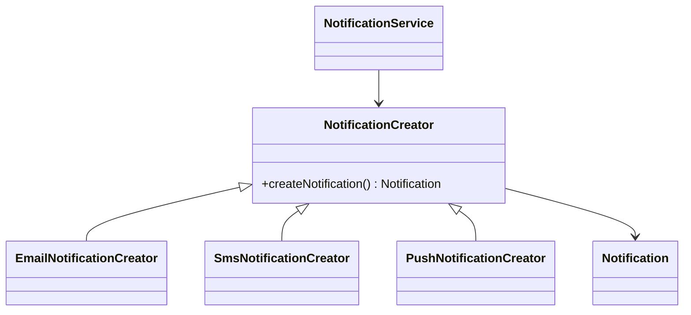

ASCII fallback:

```text
NotificationService -> NotificationCreator -> Notification
                        ^ Email/Sms/PushNotificationCreator
```

Bu projedeki karşılığı:
- `src/main/java/com/can/creational/factorymethod/NotificationCreator.java`
- `src/main/java/com/can/creational/factorymethod/NotificationService.java`
- `src/main/java/com/can/creational/factorymethod/EmailNotificationCreator.java`
- `src/main/java/com/can/creational/factorymethod/SmsNotificationCreator.java`
- `src/main/java/com/can/creational/factorymethod/PushNotificationCreator.java`

## A.2 Abstract Factory

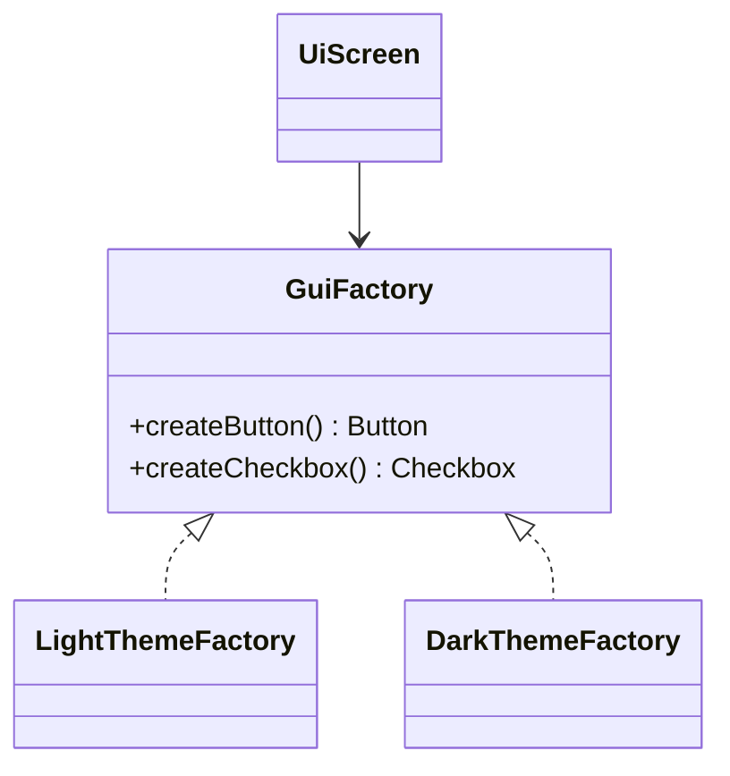

ASCII fallback:

```text
UiScreen -> GuiFactory
             |- LightThemeFactory
             |- DarkThemeFactory
```

Bu projedeki karşılığı:
- `src/main/java/com/can/creational/abstractfactory/GuiFactory.java`
- `src/main/java/com/can/creational/abstractfactory/LightThemeFactory.java`
- `src/main/java/com/can/creational/abstractfactory/DarkThemeFactory.java`
- `src/main/java/com/can/creational/abstractfactory/UiScreen.java`

## A.3 Builder

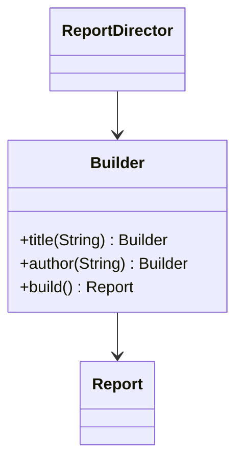

ASCII fallback:

```text
ReportDirector -> Report.Builder -> Report
```

Bu projedeki karşılığı:
- `src/main/java/com/can/creational/builder/Report.java`
- `src/main/java/com/can/creational/builder/ReportDirector.java`
- `src/main/java/com/can/creational/builder/BuilderDemo.java`

## A.4 Prototype

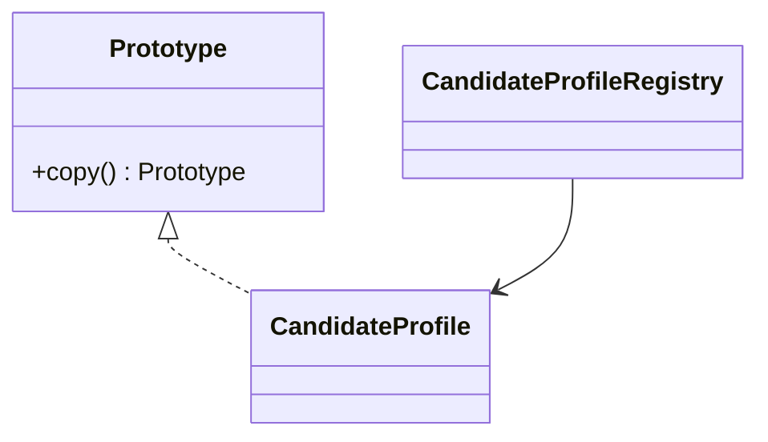

ASCII fallback:

```text
CandidateProfile implements Prototype
Registry -> CandidateProfile (clone/copy)
```

Bu projedeki karşılığı:
- `src/main/java/com/can/creational/prototype/Prototype.java`
- `src/main/java/com/can/creational/prototype/CandidateProfile.java`
- `src/main/java/com/can/creational/prototype/CandidateProfileRegistry.java`

## A.5 Singleton

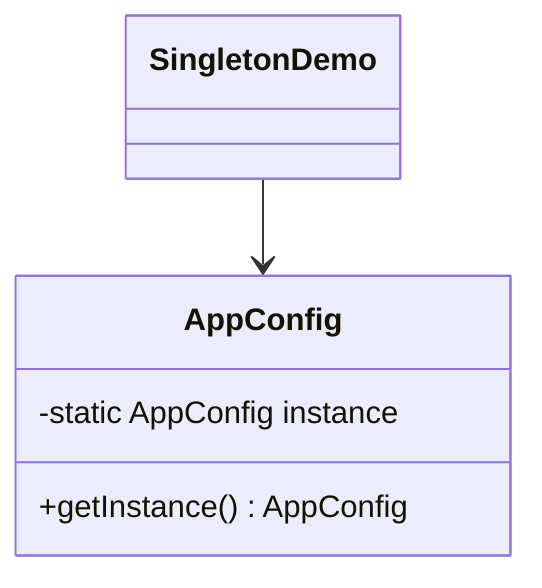

ASCII fallback:

```text
SingletonDemo -> AppConfig.getInstance() -> same AppConfig object
```

Bu projedeki karşılığı:
- `src/main/java/com/can/creational/singleton/AppConfig.java`
- `src/main/java/com/can/creational/singleton/SingletonDemo.java`

---

## B) Structural Patterns

## B.1 Adapter

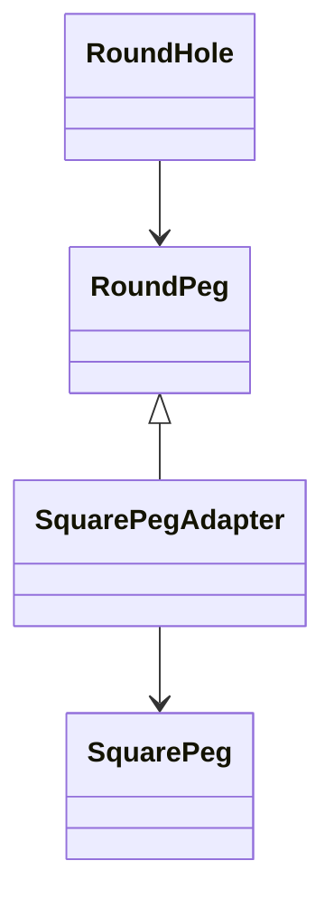

ASCII fallback:

```text
RoundHole accepts RoundPeg
SquarePegAdapter extends RoundPeg and wraps SquarePeg
```

Bu projedeki karşılığı:
- `src/main/java/com/can/structural/adapter/RoundHole.java`
- `src/main/java/com/can/structural/adapter/RoundPeg.java`
- `src/main/java/com/can/structural/adapter/SquarePeg.java`
- `src/main/java/com/can/structural/adapter/SquarePegAdapter.java`

## B.2 Bridge

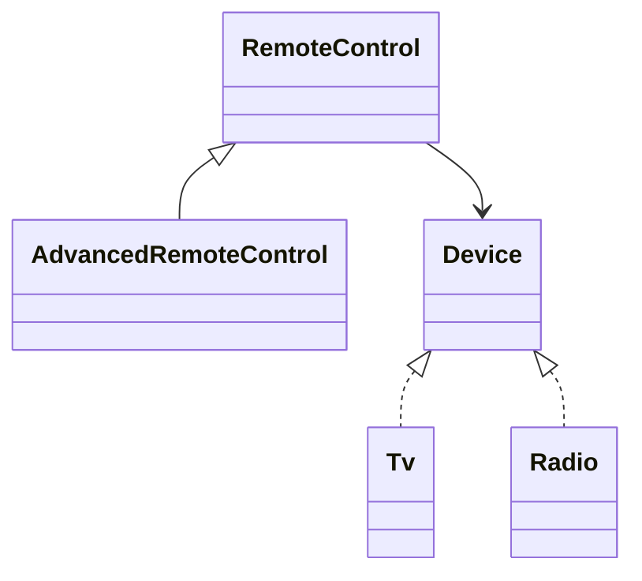

ASCII fallback:

```text
RemoteControl --has--> Device
Device implementations: Tv, Radio
AdvancedRemoteControl extends RemoteControl
```

Bu projedeki karşılığı:
- `src/main/java/com/can/structural/bridge/RemoteControl.java`
- `src/main/java/com/can/structural/bridge/AdvancedRemoteControl.java`
- `src/main/java/com/can/structural/bridge/Device.java`
- `src/main/java/com/can/structural/bridge/Tv.java`
- `src/main/java/com/can/structural/bridge/Radio.java`


## B.3 Decorator

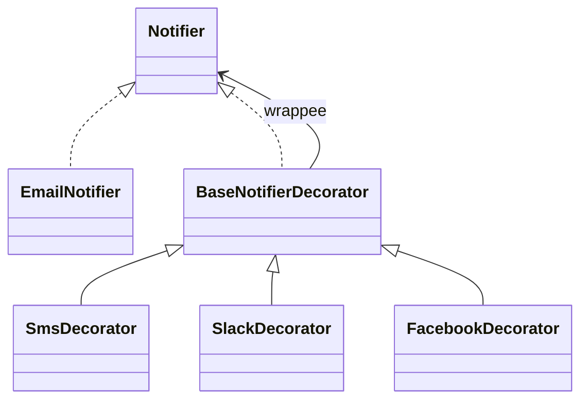

ASCII fallback:

```text
Notifier
├─ EmailNotifier (base behavior)
└─ BaseNotifierDecorator (wraps Notifier)
   ├─ SmsDecorator
   ├─ SlackDecorator
   └─ FacebookDecorator
```

Bu projedeki karşılığı:
- `src/main/java/com/can/structural/decorator/Notifier.java`
- `src/main/java/com/can/structural/decorator/EmailNotifier.java`
- `src/main/java/com/can/structural/decorator/BaseNotifierDecorator.java`
- `src/main/java/com/can/structural/decorator/SmsDecorator.java`
- `src/main/java/com/can/structural/decorator/SlackDecorator.java`
- `src/main/java/com/can/structural/decorator/FacebookDecorator.java`
- `src/main/java/com/can/structural/decorator/DecoratorPatternDemo.java`

---

## C) Behavioral Patterns

## C.1 Chain of Responsibility

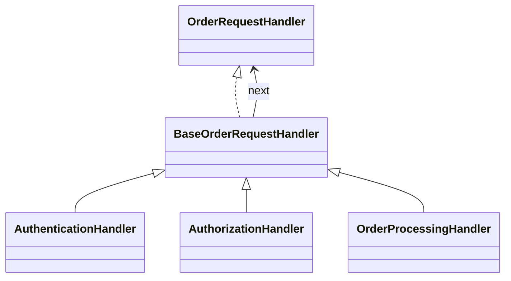

ASCII fallback:

```text
Authentication -> Authorization -> ... -> OrderProcessing
(each handler calls next)
```

Bu projedeki karşılığı:
- `src/main/java/com/can/behavirol/chainofresponsibility/OrderRequestHandler.java`
- `src/main/java/com/can/behavirol/chainofresponsibility/BaseOrderRequestHandler.java`
- `src/main/java/com/can/behavirol/chainofresponsibility/AuthenticationHandler.java`
- `src/main/java/com/can/behavirol/chainofresponsibility/AuthorizationHandler.java`
- `src/main/java/com/can/behavirol/chainofresponsibility/OrderProcessingHandler.java`

## C.2 Command

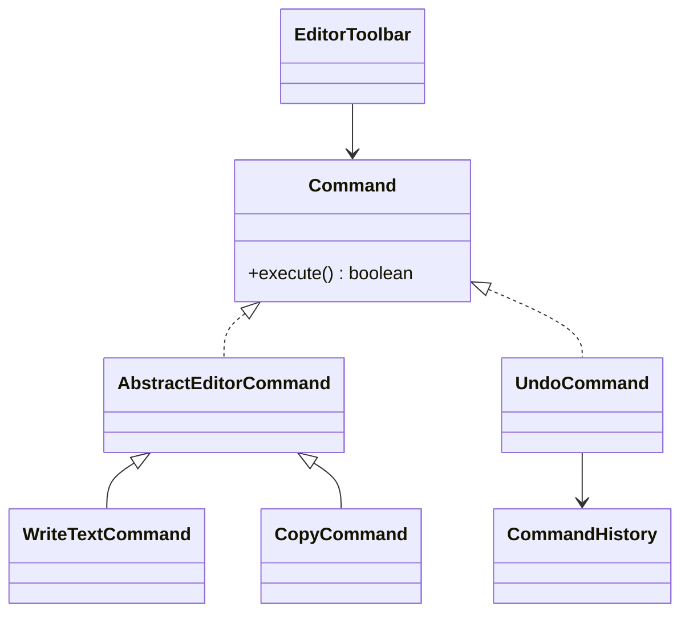

ASCII fallback:

```text
EditorToolbar -> Command.execute()
History keeps executed commands, UndoCommand pops and restores
```

Bu projedeki karşılığı:
- `src/main/java/com/can/behavirol/command/Command.java`
- `src/main/java/com/can/behavirol/command/AbstractEditorCommand.java`
- `src/main/java/com/can/behavirol/command/WriteTextCommand.java`
- `src/main/java/com/can/behavirol/command/CopyCommand.java`
- `src/main/java/com/can/behavirol/command/UndoCommand.java`
- `src/main/java/com/can/behavirol/command/CommandHistory.java`

## C.3 Iterator

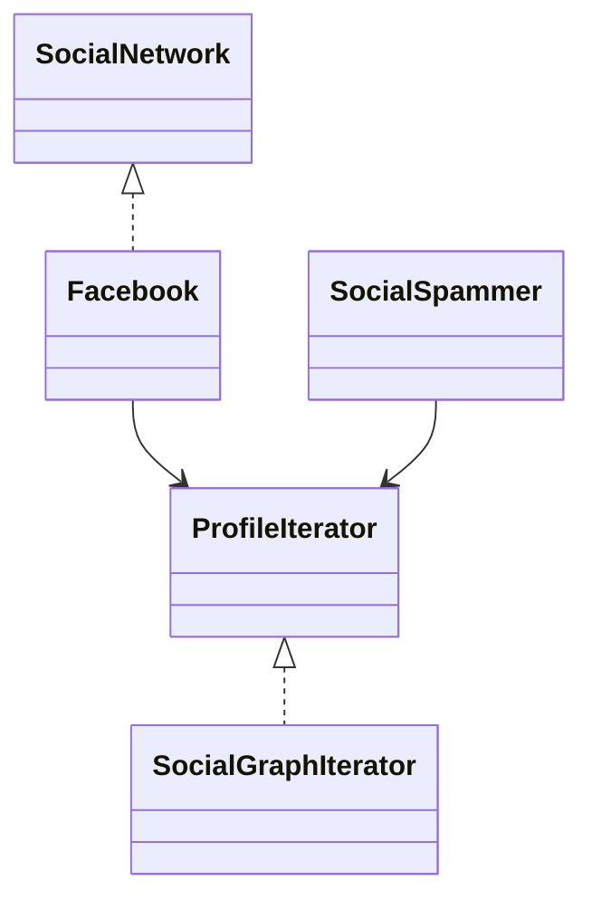

ASCII fallback:

```text
SocialSpammer uses ProfileIterator
Facebook creates SocialGraphIterator instances
```

Bu projedeki karşılığı:
- `src/main/java/com/can/behavirol/iterator/SocialNetwork.java`
- `src/main/java/com/can/behavirol/iterator/Facebook.java`
- `src/main/java/com/can/behavirol/iterator/ProfileIterator.java`
- `src/main/java/com/can/behavirol/iterator/SocialGraphIterator.java`
- `src/main/java/com/can/behavirol/iterator/SocialSpammer.java`

## C.4 Mediator

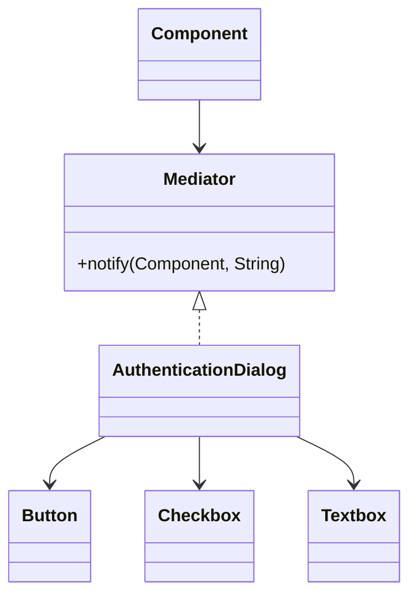

ASCII fallback:

```text
UI components -> Mediator.notify(...)
AuthenticationDialog coordinates component collaboration
```

Bu projedeki karşılığı:
- `src/main/java/com/can/behavirol/mediator/Mediator.java`
- `src/main/java/com/can/behavirol/mediator/AuthenticationDialog.java`
- `src/main/java/com/can/behavirol/mediator/Component.java`
- `src/main/java/com/can/behavirol/mediator/Button.java`
- `src/main/java/com/can/behavirol/mediator/Checkbox.java`
- `src/main/java/com/can/behavirol/mediator/Textbox.java`

## C.5 Memento

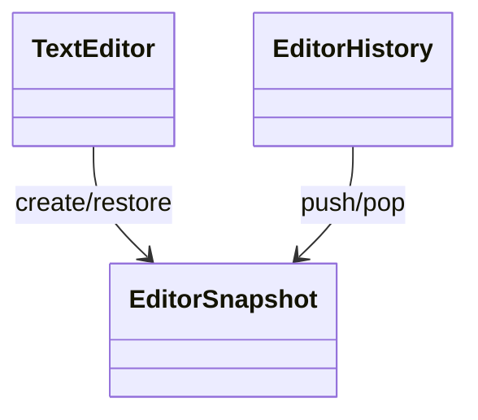

ASCII fallback:

```text
TextEditor creates snapshot
EditorHistory stores snapshots for undo
```

Bu projedeki karşılığı:
- `src/main/java/com/can/behavirol/memento/TextEditor.java`
- `src/main/java/com/can/behavirol/memento/EditorHistory.java`

## C.6 Observer

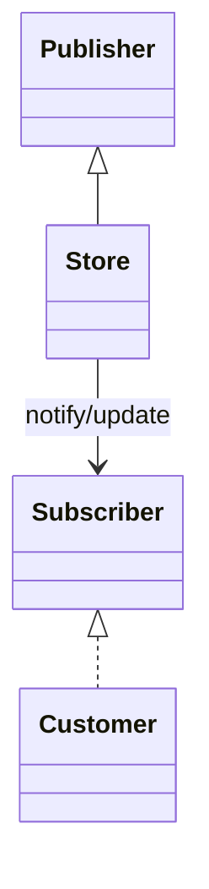

ASCII fallback:

```text
Store maintains subscribers
Customer receives update notifications
```

Bu projedeki karşılığı:
- `src/main/java/com/can/behavirol/observer/Publisher.java`
- `src/main/java/com/can/behavirol/observer/Subscriber.java`
- `src/main/java/com/can/behavirol/observer/Store.java`
- `src/main/java/com/can/behavirol/observer/Customer.java`

## C.7 State

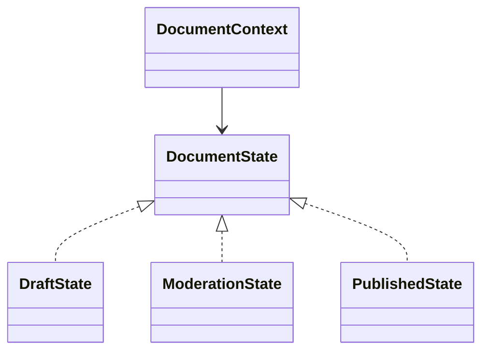

ASCII fallback:

```text
DocumentContext holds current DocumentState
State transitions: Draft -> Moderation -> Published
```

Bu projedeki karşılığı:
- `src/main/java/com/can/behavirol/state/DocumentContext.java`
- `src/main/java/com/can/behavirol/state/DocumentState.java`
- `src/main/java/com/can/behavirol/state/DraftState.java`
- `src/main/java/com/can/behavirol/state/ModerationState.java`
- `src/main/java/com/can/behavirol/state/PublishedState.java`

## C.8 Strategy

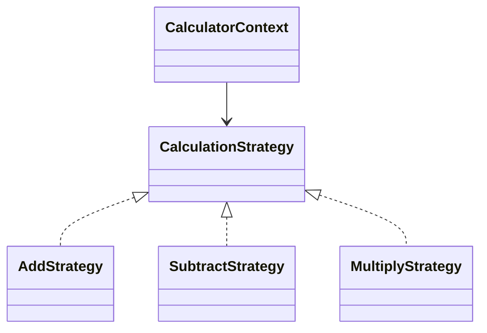

ASCII fallback:

```text
CalculatorContext delegates to selected CalculationStrategy
(Add / Subtract / Multiply)
```

Bu projedeki karşılığı:
- `src/main/java/com/can/behavirol/strategy/CalculationStrategy.java`
- `src/main/java/com/can/behavirol/strategy/AddStrategy.java`
- `src/main/java/com/can/behavirol/strategy/SubtractStrategy.java`
- `src/main/java/com/can/behavirol/strategy/MultiplyStrategy.java`
- `src/main/java/com/can/behavirol/strategy/CalculatorContext.java`

## C.9 Template Method

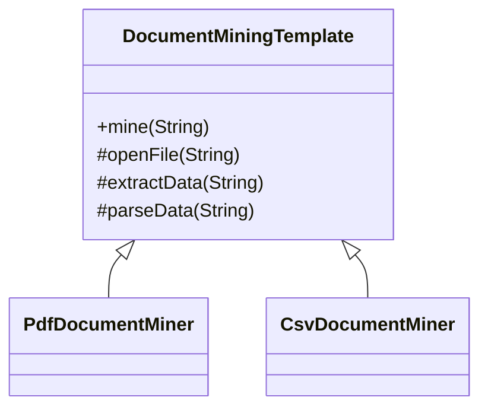

ASCII fallback:

```text
Template defines fixed workflow
PdfDocumentMiner/CsvDocumentMiner override steps
```

Bu projedeki karşılığı:
- `src/main/java/com/can/behavirol/templatemethod/DocumentMiningTemplate.java`
- `src/main/java/com/can/behavirol/templatemethod/PdfDocumentMiner.java`
- `src/main/java/com/can/behavirol/templatemethod/CsvDocumentMiner.java`

## C.10 Visitor

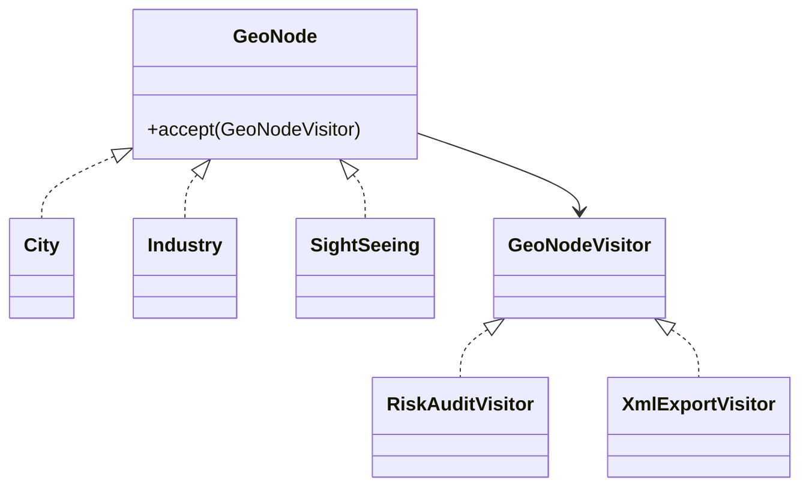

ASCII fallback:

```text
GeoNode.accept(visitor)
Visitors: RiskAuditVisitor, XmlExportVisitor
Elements: City, Industry, SightSeeing
```

Bu projedeki karşılığı:
- `src/main/java/com/can/behavirol/visitor/GeoNode.java`
- `src/main/java/com/can/behavirol/visitor/GeoNodeVisitor.java`
- `src/main/java/com/can/behavirol/visitor/RiskAuditVisitor.java`
- `src/main/java/com/can/behavirol/visitor/XmlExportVisitor.java`
- `src/main/java/com/can/behavirol/visitor/City.java`
- `src/main/java/com/can/behavirol/visitor/Industry.java`
- `src/main/java/com/can/behavirol/visitor/SightSeeing.java`

---

## 3) Patternler arası geçiş senaryoları

### 3.1 Factory Method → Abstract Factory evrimi
- Başlangıç: Sadece tek ürün varyasyonu vardır (ör. `NotificationCreator` ile kanal seçimi).
- Kırılma noktası: Birlikte değişmesi gereken çoklu ürün ailesi oluşur (ör. `Button` + `Checkbox` + diğer UI bileşenleri).
- Evrim: Üretim sorumluluğu tek ürün creator’larından, aile üreten `GuiFactory` yapısına taşınır.

Kısa karar tablosu:

| Sinyal | Öneri |
|---|---|
| Tek ürün tipi, çok kanal | Factory Method |
| Birlikte tutarlı değişen ürün grupları | Abstract Factory |

### 3.2 Command + Memento birlikte kullanım
- `Command` operasyonu tetiklemeden önce `Memento` snapshot alır.
- Komut geçmişi (`CommandHistory`) ile memento geçmişi (`EditorHistory`) birlikte ilerler.
- Undo sırasında ilgili komutun ters etkisi veya snapshot restore çalışır.

ASCII fallback:

```text
Execute Command:
1) snapshot al (Memento)
2) command execute
3) history'e yaz
Undo:
1) history'den command çek
2) snapshot restore
```

Bu projedeki karşılığı:
- `src/main/java/com/can/behavirol/command/CommandHistory.java`
- `src/main/java/com/can/behavirol/memento/EditorHistory.java`
- `src/main/java/com/can/behavirol/memento/TextEditor.java`

### 3.3 State + Strategy ayrım karar ağacı

```mermaid
flowchart TD
    Q1[Davranış değişimi iç durum geçişlerine mi bağlı?] -->|Evet| ST[State seç]
    Q1 -->|Hayır| Q2[Algoritma dışarıdan seçilip değiştirilecek mi?]
    Q2 -->|Evet| SG[Strategy seç]
    Q2 -->|Hayır| Q3[Basit if/else yeterli olabilir]
```

ASCII fallback:

```text
if (durum geçişi merkezdeyse) -> State
else if (algoritma seçimi merkezdeyse) -> Strategy
else -> sade koşullu akış
```

Bu projedeki karşılığı:
- `src/main/java/com/can/behavirol/state/DocumentState.java`
- `src/main/java/com/can/behavirol/state/DocumentContext.java`
- `src/main/java/com/can/behavirol/strategy/CalculationStrategy.java`
- `src/main/java/com/can/behavirol/strategy/CalculatorContext.java`

---

## 4) Hızlı seçim özeti

- **Nesne üretimi esnekliği:** Factory Method / Abstract Factory / Builder
- **Uyumsuz API entegrasyonu:** Adapter
- **İki eksenli varyasyonu ayırma:** Bridge
- **İş akışı adımlarını zincirleme:** Chain of Responsibility
- **Undo/redo ve komut nesneleştirme:** Command (+ Memento)
- **Duruma göre davranış:** State
- **Algoritma değişimi:** Strategy

---

## 5) Yayınlama

Bu bölüm, `BOOK.md` içeriğini farklı formatlarda yayınlamak için pratik bir akış sunar.

### 5.1 Markdown okuma
- Birincil kaynak dosya `BOOK.md` olmalıdır; türetilmiş çıktıların (HTML/PDF) elle düzenlenmesi önerilmez.
- Mermaid diyagramı olan ortamlarda doğrudan Markdown preview kullanılabilir.
- Mermaid desteklenmeyen ortamlarda her diyagramın altındaki ASCII fallback esas alınır.

### 5.2 HTML üretimi
- **MkDocs Material** yaklaşımı:
  1. `BOOK.md` içerik yapısını bölüm başlıklarıyla koru.
  2. Gerekirse `docs/` altına taşıyıp `mkdocs.yml` ile gezinme menüsü oluştur.
  3. Mermaid için tema/eklenti uyumunu kontrol et.
- **Pandoc HTML** yaklaşımı:
  - Tek komutla çıktı almak için örnek:

```bash
pandoc BOOK.md -s -o book.html --toc --metadata title="Design Patterns Kitabı"
```

### 5.3 PDF üretimi
- Önerilen yol: **Pandoc + uygun PDF engine** (`xelatex`, `lualatex` veya kurum standardı bir engine).
- Türkçe karakter ve tipografi için `xelatex` genellikle daha sorunsuzdur.
- Örnek:

```bash
pandoc BOOK.md \
  --from gfm \
  --pdf-engine=xelatex \
  --toc \
  -V geometry:margin=2.2cm \
  -V colorlinks=true \
  -o book.pdf
```

---

## 6) PDF uyumluluğu için diyagram ve görsel kural seti

### 6.1 Mermaid render stratejisi
- PDF hattında Mermaid doğrudan düzgün render olmuyorsa diyagramları önceden SVG/PNG olarak üret.
- Önerilen öncelik: **SVG** (vektörel, net baskı) → gerekiyorsa **yüksek çözünürlüklü PNG**.
- Her Mermaid bloğu için en az bir metin tabanlı fallback (ASCII/tablo) korunmalıdır.
- Kritik diyagramlarda `BOOK.md` içinde şu sıra korunur:
  1. Mermaid kaynak bloğu
  2. (Gerekirse) görsel referansı
  3. ASCII/tablo fallback

### 6.2 Görsellerin göreli path düzeni
- Tüm görseller göreli path ile referanslanmalıdır (örn. `assets/diagrams/state-flow.svg`).
- Mutlak path (`/tmp/...`, `C:\...`) kullanılmamalıdır.
- Önerilen klasör düzeni:
  - `assets/diagrams/` → diyagram çıktıları
  - `assets/images/` → ekran görüntüleri ve diğer görseller
- Dosya adlandırma kısa, açıklayıcı ve kebab-case olmalıdır (örn. `factory-method-sequence.svg`).

### 6.3 Tablo/şema genişlik sınırları
- PDF taşmasını önlemek için geniş tablolar 4–5 sütunla sınırlandırılmalı; gerekirse tablo ikiye bölünmelidir.
- Satır içi kod/parça metinler çok uzunsa satır kırılımı olan ifadeler tercih edilmelidir.
- Diyagramlarda çok uzun node metinleri yerine kısa etiket + açıklama notu yaklaşımı kullanılmalıdır.
- Hedef: A4 tek sütun düzende yatay kaydırma gerektirmeyen içerik.

---

## 7) Kitap stil rehberi

### 7.1 Kapak
- Kapakta şu bilgiler net yer almalı:
  - Kitap adı
  - Alt başlık (opsiyonel)
  - Yazar/ekip
  - Sürüm ve tarih
- Kapak sade olmalı; tek vurgu rengi ve tutarlı tipografi tercih edilmelidir.

### 7.2 İçindekiler
- İçindekiler otomatik üretilmeli (Pandoc `--toc` veya MkDocs nav).
- En fazla H3 seviyesine kadar listelenmesi okunabilirlik için idealdir.
- Başlık metinleri kısa ve eylem odaklı olmalıdır.

### 7.3 Bölüm ayraçları
- Ana bölümler arasında yatay çizgi (`---`) veya yeni sayfa mantığı kullanılmalıdır.
- Her ana bölüm girişinde 1–2 cümlelik amaç paragrafı bulunmalıdır.
- Uzun bölümlerde alt başlıklar arasına kısa “özet kutusu” eklemek okunabilirliği artırır.

### 7.4 Tipografi önerileri
- Gövde metin: okunaklı serif veya sans-serif bir yazı tipi, tutarlı satır aralığı.
- Kod blokları: monospace font, yeterli kontrast, satır taşmasını önleyen düzen.
- Vurgu kullanımı:
  - Kavram adı: **kalın**
  - Dosya yolu/komut: `inline code`
  - Uzun teknik not: callout blok

### 7.5 Başlık seviyeleri
- H1: Doküman başlığı için tek kullanım.
- H2: Ana bölüm (ör. “Yayınlama”, “Stil Rehberi”).
- H3: Alt konu (ör. “PDF üretimi”, “Kapak”).
- H4 ve altı yalnızca zorunluysa kullanılmalı; mümkünse içerik H2/H3 içinde sadeleştirilmelidir.

### 7.6 Callout blokları
- Önemli not, uyarı, ipucu gibi içerikler callout ile ayrılmalıdır.
- Markdown taşınabilirliği için blok alıntı tabanlı sade bir format tercih edilir:

```markdown
> **Not:** Bu bölümdeki komutlar örnektir, proje standardına göre güncellenebilir.
```

- HTML tabanlı zengin callout yalnızca görsel katkı netse kullanılmalıdır; aynı yerde Markdown fallback korunmalıdır.

### 7.7 Kod bloğu standartları (Java)
- Kod bloklarında dil etiketi zorunludur: ` ```java `.
- Örnekler tek sorumluluğa odaklanmalı, gereksiz boilerplate azaltılmalıdır.
- Sınıf/metot isimleri proje içi adlandırmayla tutarlı olmalıdır.
- Gerekirse kod bloğu öncesinde kısa bağlam, sonrasında beklenen çıktı/etki açıklaması verilmelidir.

---

## 8) Kod ve açıklama senkronizasyonu bakım kuralları

### 8.1 Yeni pattern eklendiğinde `BOOK.md` güncelleme checklist’i
1. Pattern ailesini doğru bölümde ekle (Creational/Structural/Behavioral).
2. Pattern başlığını ve kısa problem tanımını yaz.
3. Mermaid diyagramını ekle.
4. Mermaid olmayan ortam için ASCII/tablo fallback ekle.
5. “Bu projedeki karşılığı” altında ilgili Java dosya yollarını listele.
6. Gerekliyse “Patternler arası geçiş senaryoları” bölümüne ilişki notu ekle.
7. “Hızlı seçim özeti” kısmında karar etkisi varsa maddeyi güncelle.

### 8.2 `explain/*.md` ile `BOOK.md` tutarlılık kontrol adımları
- Başlık eşleşmesi:
  - `explain/` altındaki pattern doküman adı ve `BOOK.md` başlığı aynı kavramı temsil etmeli.
- Rol/sınıf eşleşmesi:
  - Açıklanan ana sınıf/arayüz isimleri Java kodu ve `BOOK.md` arasında aynı olmalı.
- Diyagram eşleşmesi:
  - Diyagramdaki ilişkiler ile koddaki bağımlılıklar çelişmemeli.
- Dosya yolu doğruluğu:
  - `BOOK.md` içindeki path’ler gerçekten mevcut dosyalara işaret etmeli.
- Son kontrol:
  - Pattern üzerinde kod değiştiyse ilgili `explain/*.md` ve `BOOK.md` aynı PR içinde güncellenmeli.

### 8.3 HTML blok kullanım ilkesi (opsiyonel)
- `BOOK.md` içinde HTML blokları yalnızca aşağıdaki durumlarda kullanılmalıdır:
  - Saf Markdown ile sağlanamayacak anlamlı bir görsel/yerleşim faydası varsa.
  - Çıktı alınan hedefte (HTML/PDF) tutarlı render edilebiliyorsa.
- Her HTML blok yanında veya hemen altında saf Markdown fallback’i bulunmalıdır.
- Fallback, içeriğin anlamını kaybetmeden okunabilirliği korumalıdır.
