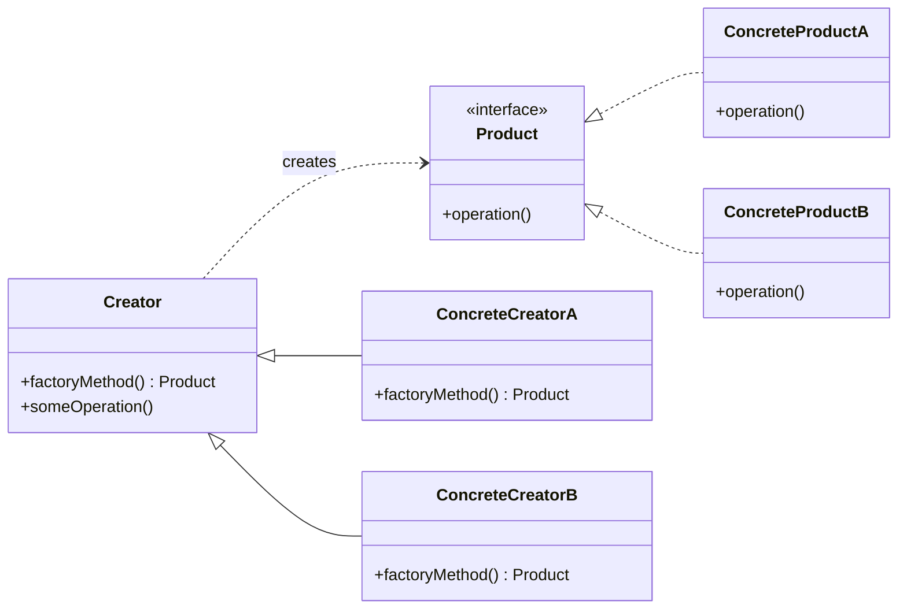
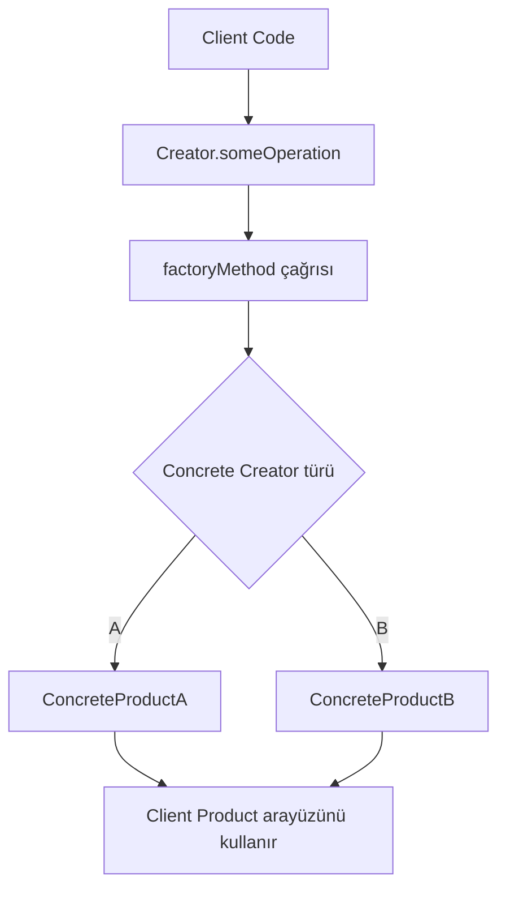
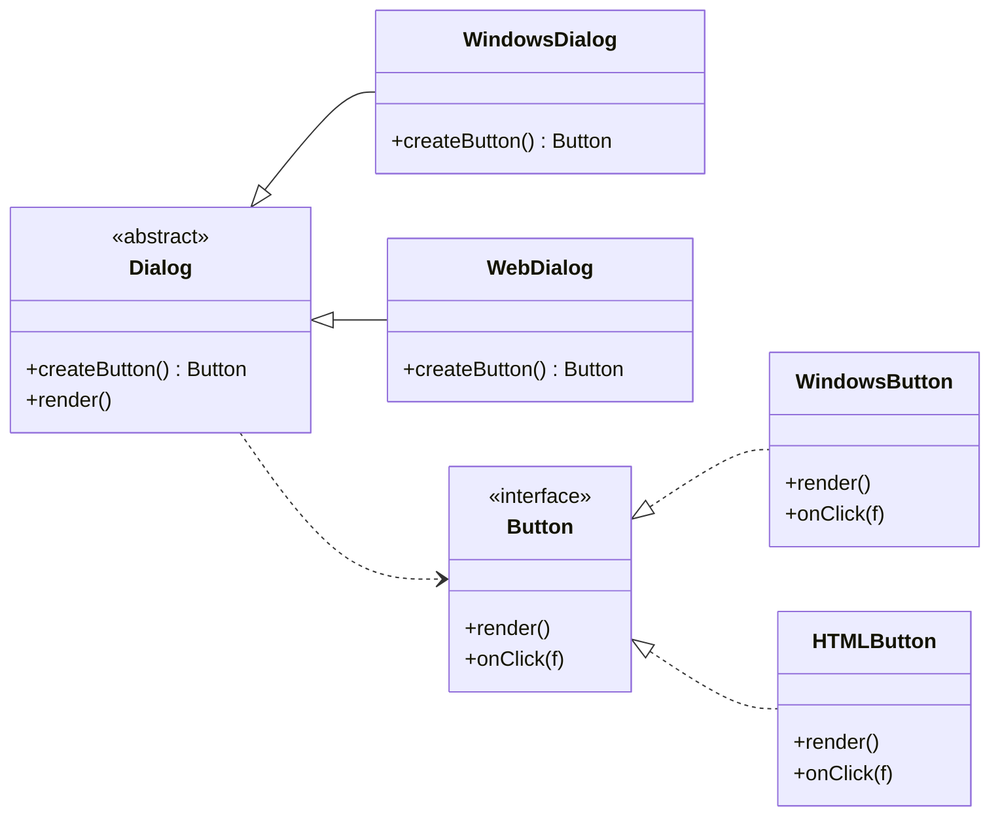
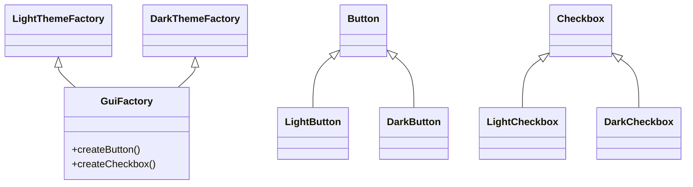

# Creational Design Patterns — Mini Book (Java)

> Kısa açıklama: Bu mini kitap, creational (oluşturucu) tasarım desenlerini hızlıca öğrenmen için hazırlanmış, her desen için "Amaç, Problem, Çözüm, Yapı, Örnek, Ne Zaman Kullanılır, Artılar / Eksiler" şablonunu takip eder.

---

**Yazar:** Tunahan Can  
**Versiyon:** 1.0  
**Dil:** Türkçe  
**Repo:** Bu dosya proje kökünde `BOOK.md` olarak bulunur.

[](./) [](LICENSE)

---

İçindekiler

1. Factory Method
2. Abstract Factory
3. Builder
4. Prototype
5. Singleton

---

Kullanım Notu

- Bu dosya hem düz Markdown olarak okunabilir hem de MkDocs veya GitBook gibi araçlarla statik siteye dönüştürülebilir.
- Her desen için "Örnek" bölümünde proje içindeki Java dosyalarına (örn. `src/main/java/com/can/creational/...`) referans verilir.

---

Nasıl yayınlanır (hızlı kılavuz)

MkDocs (statik site)

```bash
python3 -m pip install --user mkdocs mkdocs-material mkdocs-include-markdown-plugin
mkdocs new . --no-input || true
# mkdocs.yml dosyanızı güncelleyin (ör. material teması) ve docs/ altına bu BOOK.md'i taşıyın veya include edin
mkdocs serve
```

Pandoc (PDF / ePub)

```bash
brew install pandoc
# MacTeX/TeX Live gerekebilir
pandoc BOOK.md -o design-patterns.pdf --pdf-engine=pdflatex
```

---

Şablon: Her desen için takip edilecek yapı

- Amaç (Intent)
- Problem (Problem)
- Çözüm (Solution) — kısa açıklama, gerekli roller (sınıflar/arayüzler)
- Yapı (Structure) — UML / mermaid diyagramı veya kısa class listesi
- Örnek (Example) — projedeki sınıf yollarına referans ve kısa kod snippet (gerekirse include)
- Ne zaman kullanılır? (When to use)
- Artılar / Eksiler (Pros / Cons)

---

## 1) Factory Method

> Diğer adı: **Virtual Constructor (Sanal Kurucu)**

### Niyet (Intent)
Factory Method, üst sınıfta nesne üretmek için bir arayüz (fabrika metodu) tanımlar; ancak alt sınıfların hangi somut türü üreteceğini değiştirmesine izin verir.

### Problem (Neden ihtiyaç var?)
Bir lojistik uygulaması geliştirdiğini düşün. İlk sürüm yalnızca **Truck (kamyon)** ile taşıma yapıyor olsun. Kod tabanı büyüdükçe iş mantığının büyük bir kısmı `Truck` sınıfına sıkı bağlı hale gelir.

Sonra deniz taşımacılığı talebi gelir ve **Ship (gemi)** desteği istenir. Bu durumda:
- Kodun birçok yerinde geçen doğrudan `new Truck()` kullanımları tek tek değişmelidir.
- `if/else` veya `switch` blokları ürün türüne göre büyür.
- Gelecekte yeni bir ürün (ör. `Train`) eklendiğinde aynı sorun tekrar eder.

Sonuç: Somut sınıflara bağımlı, değişime kapalı ve bakım maliyeti yüksek bir mimari.

### Çözüm (Factory Method yaklaşımı)
Doğrudan nesne üretimini (`new`) istemci kodundan çıkarıp **fabrika metoduna** taşı.

- İstemci, somut sınıfı değil ortak ürün arayüzünü bilir.
- Üretimin nasıl yapılacağı alt sınıflarda özelleştirilir.
- Yeni ürün eklemek için mevcut istemciyi bozmadan yeni creator eklenir.

> Önemli: Factory Method nesneleri hâlâ `new` ile üretir; fark, bu işlemin merkezi ve genişletilebilir bir noktaya taşınmasıdır.

### Yapı (Structure)

Roller:
1. **Product**: Tüm ürünlerin uyguladığı ortak arayüz.
2. **Concrete Product**: Ürünün somut implementasyonları.
3. **Creator**: Factory method’u tanımlayan üst sınıf.
4. **Concrete Creator**: Factory method’u override ederek somut ürünü dönen sınıf.

#### Şema 1 — Sınıf Diyagramı



#### Şema 2 — Akış Diyagramı (İstemci perspektifi)



#### Şema 3 — Dialog/Button örneği (platform bazlı)



### Ayrıntılı Türkçe Açıklama (makalenin çekirdek içeriği)

- **Creator’ın asıl görevi sadece üretim değildir.**
  Çoğu zaman creator sınıfı ürünleri kullanan asıl iş mantığını taşır. Factory method, bu iş mantığını somut ürün bağımlılıklarından ayırır.

- **Alt sınıflar, ürün türünü değiştirir.**
  Base creator içinde tanımlı factory method’u override ederek farklı concrete product döndürürler.

- **Ortak arayüz zorunludur.**
  Farklı ürünler döndürülebilir; ancak istemci tarafında birlikte kullanılabilmeleri için ortak bir Product arayüzünü uygulamaları gerekir.

- **Factory method her zaman yeni nesne döndürmek zorunda değildir.**
  Önbellek, object pool veya paylaşılan kaynaklardan da nesne döndürebilir.

### Pseudocode’un Türkçe karşılığı (Dialog örneği)

Temel fikir: `Dialog` sınıfı `render()` içinde bir `Button` ister; ama butonun Windows mı yoksa Web mi olacağını `createButton()` karar verir.

```text
Dialog.render()
  -> createButton()
  -> button.onClick(...)
  -> button.render()

WindowsDialog.createButton() -> WindowsButton
WebDialog.createButton()     -> HTMLButton
```

### Uygulanabilirlik (Ne zaman kullanılır?)

1. **Önceden hangi somut türün gerektiğini bilmiyorsan**
   Ürün üretimini soyutlayıp sonradan genişletmek istediğinde.

2. **Framework/library kullanıcılarına genişleme noktası vermek istiyorsan**
   Kullanıcılar creator alt sınıfını override ederek kendi ürününü sisteme takabilir.

3. **Kaynak tasarrufu için nesne tekrar kullanımı gerekiyorsa**
   Constructor bunu yapamaz (her zaman yeni döndürür), ama factory method mevcut örnek döndürebilir.

### Nasıl uygulanır? (Adım adım)

1. Ürünler için ortak arayüz belirle.
2. Creator içine boş/soyut bir factory method ekle.
3. Kod tabanındaki doğrudan constructor çağrılarını tek tek bu metoda taşı.
4. Gerekirse geçici bir parametreyle ürün türünü seç.
5. Ürün türleri için concrete creator sınıfları üret ve factory method’u override et.
6. Base factory method boş kaldıysa abstract yap; anlamlı default varsa bırak.

### Projedeki örnek (Kod)

Dosya: `src/main/java/com/can/creational/factorymethod/FactoryMethodDemo.java`

- `Notification` = Product
- `EmailNotification`, `SmsNotification`, `PushNotification` = Concrete Product
- `NotificationCreator` = Creator
- `EmailNotificationCreator`, `SmsNotificationCreator`, `PushNotificationCreator` = Concrete Creator

### Verilen örneğin kod karşılığı (Dialog/Button - Java)

Aşağıdaki kod, makaledeki pseudocode’un Java karşılığıdır:

```java
interface Button {
    void render();
    void onClick(Runnable action);
}

class WindowsButton implements Button {
    @Override
    public void render() {
        System.out.println("Render Windows button");
    }

    @Override
    public void onClick(Runnable action) {
        System.out.println("Bind native OS click event");
        action.run();
    }
}

class HtmlButton implements Button {
    @Override
    public void render() {
        System.out.println("Render HTML button");
    }

    @Override
    public void onClick(Runnable action) {
        System.out.println("Bind browser click event");
        action.run();
    }
}

abstract class Dialog {
    public abstract Button createButton();

    public void render() {
        Button okButton = createButton();
        okButton.onClick(() -> System.out.println("Dialog closed"));
        okButton.render();
    }
}

class WindowsDialog extends Dialog {
    @Override
    public Button createButton() {
        return new WindowsButton();
    }
}

class WebDialog extends Dialog {
    @Override
    public Button createButton() {
        return new HtmlButton();
    }
}
```

### Unit test yaklaşımı (bu repo için)

Factory Method örneği için testler `@Nested` yapısıyla gruplandırılmıştır:
- Product implementasyon doğrulaması
- Creator’ın doğru product üretmesi
- Creator iş akışının (`notifyUser`) beklenen çıktıyı üretmesi

Test dosyası:
`src/test/java/com/can/creational/factorymethod/FactoryMethodDemoTest.java`

### Artılar / Eksiler

**Artılar**
- Gevşek bağlılık (client, somut sınıf bilmez)
- Açık/Kapalı Prensibi’ne daha uygun genişleme
- Üretim sorumluluğunun tek noktada toplanması

**Eksiler**
- Sınıf sayısı artar (özellikle çok ürün türünde)
- Yanlış kurguda gereksiz soyutlama maliyeti doğurabilir

---

## 2) Abstract Factory

### Amaç
Birbiriyle ilişkili ürün ailelerini, somut sınıflara bağlanmadan üretmek.

### Problem
Uyumlu ürün setleri (örn. UI tema bileşenleri) farklı somut sınıflarla temsil edildiğinde, tüm birleşenlerin birlikte değiştirilmesi zorlaşır.

### Çözüm
Bir `AbstractFactory` arayüzü tanımla; somut fabrikalar (örn. `LightThemeFactory`, `DarkThemeFactory`) uyumlu ürünleri üretir.

### Yapı
- AbstractFactory (`GuiFactory`) — `createButton()`, `createCheckbox()` metodları.
- ConcreteFactory (`LightThemeFactory`, `DarkThemeFactory`).
- AbstractProduct (örn. `Button`, `Checkbox`).
- ConcreteProduct (örn. `LightButton`, `DarkButton`).

Mermaid örneği:



### Örnek
Projede ilgili dosya: `src/main/java/com/can/creational/abstractfactory/AbstractFactoryDemo.java`.

### Ne zaman kullanılır?
- Bir uygulamanın birbirleriyle uyumlu ürün ailelerini birlikte değiştirme ihtiyacı olduğunda.

### Artılar / Eksiler
- Artı: Ürün aileleri arası tutarlılık sağlar.
- Eksi: Yeni ürün türü eklemek zor olabilir (factory ve tüm concrete product sınıfları güncellenmeli).

---

## 3) Builder

### Amaç
Karmaşık nesneleri adım adım inşa etmek; okunabilir ve yönetilebilir kod ile çok sayıda opsiyonel parametreyi ele almak.

### Problem
Çok sayıda opsiyonel parametreye sahip bir sınıfın yapıcıları (constructors) ile yönetilmesi zorlaşır (constructor parametre patlaması).

### Çözüm
Bir `Builder` sınıfı tanımla; adım adım gerekli alanları set edip son olarak `build()` çağır.

### Yapı
- Product (`Report`)
- Builder (`Report.Builder`) — zincirlenebilir setter metodları ve `build()`.

### Örnek
Projede ilgili dosya: `src/main/java/com/can/creational/builder/BuilderDemo.java`.

### Ne zaman kullanılır?
- Eğer nesnenin oluşturulması birden fazla adım gerektiriyorsa veya birçok opsiyonel alan varsa.

### Artılar / Eksiler
- Artı: Okunaklı API ve immutability ile uyumlu tasarım.
- Eksi: Çok küçük ve basit nesneler için aşırı olabilir.

---

## 4) Prototype

### Amaç
Mevcut bir nesnenin klonunu oluşturarak yeni nesneler türetmek.

### Problem
Nesne oluşturmanın maliyetli olduğu veya konfigürasyonun karmaşık olduğu durumlarda her seferinde yeniden inşa etmek pahalıdır.

### Çözüm
Bir `Prototype` arayüzü ile `clone()`/`copy()` metodunu tanımla; hazır örneklerden çoğalt.

### Yapı
- Prototype arayüzü (örn. `Prototype`)
- ConcretePrototype (örn. `Resume`) — kopyalama mantığı içerir.

### Örnek
Projede ilgili dosya: `src/main/java/com/can/creational/prototype/PrototypeDemo.java`.

### Ne zaman kullanılır?
- Nesne oluşturma pahalıysa veya çok sayıda benzer nesne üretilecekse.

### Artılar / Eksiler
- Artı: Hızlı türetme, karmaşık konfigürasyonların tekrar kullanılabilmesi.
- Eksi: Derin/kopya problemi (deep vs shallow copy) yönetimi gerekir.

---

## 5) Singleton

### Amaç
Uygulama boyunca tek bir instance gerektiğinde bu durumu garanti altına almak.

### Problem
Global erişim gereken ancak birden fazla örnek istenmeyen kaynaklar (config, cache) için sınır koymak.

### Çözüm
Singleton deseni: instance'ı kontrollü şekilde yarat ve herkese aynı referansı sağla. Thread-safety için double-checked locking veya enum tabanlı yaklaşımlar tercih edilebilir.

### Yapı
- Singleton sınıfı (örn. `AppConfig`) — özel constructor, static erişim metodu.

### Örnek
Projede ilgili dosya: `src/main/java/com/can/creational/singleton/SingletonDemo.java`.

### Ne zaman kullanılır?
- Konfigürasyon, uygulama geneli cache, log yönetimi gibi tekil paylaşılacak kaynaklar olduğunda.

### Artılar / Eksiler
- Artı: Basit global erişim.
- Eksi: Test edilebilirliği ve bağımlılık yönetimi zorlaşabilir; dikkatli kullanılmalı.

---

Ek bölümler

Contributing

- Fork > Feature branch > Pull request
- Kod örnekleri için JUnit testleri ekle (zorunlu değil ama önerilir)

License

- Bu repo için uygun gördüğün lisansı kök dizine (LICENSE) ekle. Örnek: CC BY-SA 4.0 veya MIT.

---

Son not

Bu şablon, kitabını hem okuyucu dostu bir statik siteye hem de PDF/ePub çıktısına kolayca dönüştürebilmen için düzenlendi. İstersen ben MkDocs yapılandırması (`mkdocs.yml`) ve `docs/` dizinine bölümlere ayrılmış Markdown dosyaları oluşturarak devam edebilirim — hangisini istersin?
