<section class="cover">
  <div class="cover-kicker">KODU OKU · KARARI ANLA · TESTLE KANITLA</div>
  <h1>Java ile Tasarım Desenleri</h1>
  <p class="cover-subtitle">22 GoF desenini ezberlemek için değil, doğru tasarım baskısını görünce tanımak için uygulamalı saha rehberi</p>
  <div class="cover-rule"></div>
  <div class="cover-metrics">
    <span><strong>5</strong> oluşturucu</span>
    <span><strong>7</strong> yapısal</span>
    <span><strong>10</strong> davranışsal</span>
  </div>
  <p class="cover-note">Java 21 · JUnit 5 · Mermaid diyagramları · Üretim sertleştirme notları</p>
</section>

# Kitabı kullanma rehberi

Bu kitap bir “pattern kataloğu” olmanın ötesinde, repodaki çalışan kodu **tasarım kararı → sınıf işbirliği → test kanıtı** zinciriyle okumak için hazırlandı. Her bölüm aynı öğrenme ritmini izler:

1. Önce pattern’in çözmeye çalıştığı **değişim eksenini** bulursun.
2. Sonra repodaki sınıfların pattern rollerine nasıl oturduğunu görürsün.
3. Bir çağrıyı baştan sona izleyerek soyut tanımı çalışan koda bağlarsın.
4. `@Nested` test gruplarıyla hangi sözleşmenin korunduğunu okursun.
5. Son olarak pattern’in bedelini, sınırlarını ve production ortamında eksik kalan parçaları tartarsın.

> **Ana fikir:** Pattern, kopyalanacak bir kod kalıbı değil; tekrar eden bir tasarım baskısına verilmiş, adı olan bir karardır.

Bu repoda GoF kataloğundaki 23 desenin 22’si bulunur. Davranışsal ailedeki **Interpreter** örneği bu çalışmanın kapsamında değildir. Aşağıdaki bütün anlatımlar yalnızca repoda gerçekten bulunan örneklerle eşleştirilmiştir.

## Hızlı başlangıç

Proje Java 21 hedefler. Önce Maven’in doğru JDK ile çalıştığını doğrula:

```bash
java -version
mvn -version
```

macOS ve Homebrew JDK 21 için gerekirse:

```bash
export JAVA_HOME="$(brew --prefix openjdk@21)/libexec/openjdk.jdk/Contents/Home"
export PATH="$(brew --prefix openjdk@21)/bin:$PATH"
```

Bütün örnekleri sırayla çalıştır:

```bash
mvn compile exec:java -Dexec.mainClass=com.can.Main
```

Örnek kataloğunu ve geçerli seçimleri gör:

```bash
mvn compile exec:java -Dexec.mainClass=com.can.Main -Dexec.args=--list
```

Yalnızca bir aileyi ya da tek bir deseni çalıştır:

```bash
mvn compile exec:java -Dexec.mainClass=com.can.Main -Dexec.args=structural
mvn compile exec:java -Dexec.mainClass=com.can.Main -Dexec.args=factory-method
```

`PatternCatalog`, 22 demoyu tek composition root altında toplar. `all`,
`creational`, `structural`, `behavioral` veya listelenen bir pattern slug'ı
seçilebilir. Bu katalog, desenlerin kendi domain koduna altyapı sorumluluğu
yüklemeden örnekleri gruplar ve tek tek çalıştırılabilir hâle getirir.
Türkçe aile adları da büyük/küçük harften bağımsız kabul edilir. `--help` ve
`--list` başarıyla kataloğu gösterirken, bilinmeyen seçim ve fazla argüman
process seviyesinde `2` kullanım hatası kodu üretir.

Öğrenme sözleşmelerini testlerle doğrula:

```bash
mvn test
```

Yalnızca bir pattern’in testini çalıştırmak için:

```bash
mvn -Dtest=AdapterPatternDemoTest test
```

## Repo içinde önerilen okuma döngüsü

Bir pattern’i yalnız açıklamasından okumak yerine üç dosya türü arasında gidip gel:

```text
explain/<pattern>.md
        │  “Neden ve hangi bedelle?”
        ▼
<Pattern>Demo.java + domain sınıfları
        │  “Kim, kime, ne zaman çağrı yapıyor?”
        ▼
<Pattern>DemoTest.java
           “Hangi davranış gerçekten kanıtlanıyor?”
```

Önerilen uygulama:

- İlk turda yalnız “30 saniyelik kart”, diyagram ve hafıza cümlesini oku.
- İkinci turda demo yerine önce domain sınıflarını incele.
- Üçüncü turda test adlarını bir gereksinim listesi gibi oku.
- Son turda “production hardening” bölümünden bir madde seçip kendin uygula.

> **Paket adı notu:** Davranışsal örnekler mevcut kodda `com.can.behavirol` altında duruyor. İngilizce doğru yazım `behavioral` olsa da bu kitap, çalışan paket ve import yollarıyla birebir eşleşmek için mevcut adı korur. Yeniden adlandırma ayrı ve kırıcı olabilecek bir refactoring’dir.

## Örnekleri üç katmanda okumak

Her bölümdeki örnek haritası, kodu “eski/yeni” diye değil öğretme amacıyla
gruplar:

| Katman | Ne gösterir? | Okurken sorulacak soru |
|---|---|---|
| Temel örnek | Pattern’in minimum katılımcıları ve ana çağrı zinciri | “Desenin niyeti hangi işbirliğinde ortaya çıkıyor?” |
| Güçlendirilmiş örnek | Daha gerçekçi invariant, hata durumu veya ikinci değişim ekseni | “İlk örneğin sakladığı hangi tasarım baskısı görünür oldu?” |
| Production sınırı | Bilinçli olarak demo dışında bırakılan operasyonel yükümlülük | “Bu kod canlı sisteme girmeden önce neyin sahibi belirlenmeli?” |

Amaç temel örneği çöpe atmak değildir. Küçük örnek mekanizmayı görünür kılar;
güçlendirilmiş örnek mekanizmanın gerçek bir gereksinim altında neden var
olduğunu gösterir; production notu ise eğitim koduyla ürün garantisini birbirine
karıştırmayı önler.

## Çalıştırılabilir katalog nasıl gruplanıyor?

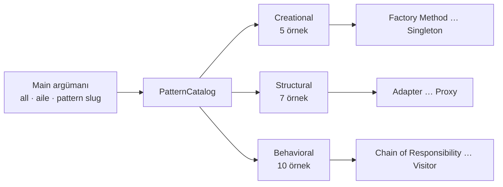
```mermaid
flowchart LR
    CLI["Main argümanı<br/>all · aile · pattern slug"] --> Catalog[PatternCatalog]
    Catalog --> C["Creational<br/>5 örnek"]
    Catalog --> S["Structural<br/>7 örnek"]
    Catalog --> B["Behavioral<br/>10 örnek"]
    C --> C1["Factory Method … Singleton"]
    S --> S1["Adapter … Proxy"]
    B --> B1["Chain of Responsibility … Visitor"]
```

`Main`, 22 somut demo importunu ve sırasını taşımak yerine seçim davranışını
`PatternCatalog` üzerinden yürütür. Katalog metadata ile çalıştırılabilir
davranışı yan yana tutar; benzersiz slug, aile dağılımı ve değiştirilemez
envanter sözleşmeleri `PatternCatalogTest` içinde ayrıca doğrulanır.

## Kısa terminoloji

Kod içindeki rol adlarıyla birebir bağ kurmak için bazı İngilizce terimler korunur:

| Terim | Bu kitaptaki anlamı |
|---|---|
| Product / concrete product | Ürün sözleşmesi / onun somut uygulaması |
| Client | Pattern katılımcılarını kullanan istemci kod |
| Runtime | Programın çalışma zamanı |
| Snapshot | Belirli bir andaki durum görüntüsü |
| Wrapper | Başka bir nesneyi sararak çağrıyı yöneten nesne |
| Trade-off | Bir kazanç için kabul edilen tasarım bedeli |
| Exact assertion | Sonucun yalnız bir parçasını değil, tamamını doğrulayan test beklentisi |
| Production hardening | Öğrenme demosunu gerçek sistem koşullarına hazırlayan doğrulama, güvenlik ve dayanıklılık adımları |

# Pattern’i ezberlemeden seçmek

Bir pattern adına bakarak değil, değişimin nereden geldiğine bakarak başla.

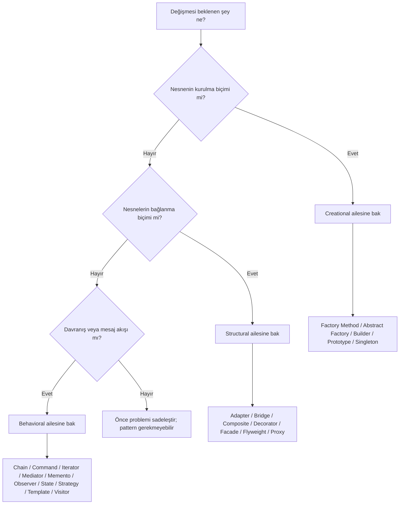
```mermaid
flowchart TD
    A[Değişmesi beklenen şey ne?] --> B{Nesnenin kurulma biçimi mi?}
    B -->|Evet| C[Creational ailesine bak]
    B -->|Hayır| D{Nesnelerin bağlanma biçimi mi?}
    D -->|Evet| E[Structural ailesine bak]
    D -->|Hayır| F{Davranış veya mesaj akışı mı?}
    F -->|Evet| G[Behavioral ailesine bak]
    F -->|Hayır| H[Önce problemi sadeleştir; pattern gerekmeyebilir]

    C --> C1[Factory Method / Abstract Factory / Builder / Prototype / Singleton]
    E --> E1[Adapter / Bridge / Composite / Decorator / Facade / Flyweight / Proxy]
    G --> G1[Chain / Command / Iterator / Mediator / Memento / Observer / State / Strategy / Template / Visitor]
```

## Üç soru filtresi

Bir pattern eklemeden önce şu üç soruya somut cevap ver:

1. **Değişim baskısı:** Hangi kararın yakın zamanda birden fazla varyanta dönüşmesini bekliyorum?
2. **Sınır:** Bu kararı hangi sınıflardan izole etmek istiyorum?
3. **Vergi:** Yeni interface, sınıf ve dolaylı çağrı maliyetini hangi gerçek kazanç karşılıyor?

Üçüncü soruya cevap veremiyorsan, pattern muhtemelen erken soyutlamadır.

## Pattern ailelerinin asıl görevi

| Aile | Koruduğu karar | Tipik kod kokusu | Ana soru |
|---|---|---|---|
| Creational | Hangi nesnenin, hangi veri ve sırayla üretildiği | `new` kararlarının her yere yayılması, constructor patlaması | “Üretim değişince kimler etkileniyor?” |
| Structural | Nesnelerin hangi biçimde bağlandığı ve göründüğü | Uyumsuz API, kombinasyon sınıfları, karmaşık alt sistem | “Bağlantı şekli değişince istemci kırılıyor mu?” |
| Behavioral | Sorumluluğun, algoritmanın ve mesajın kimler arasında aktığı | Uzayan koşullar, sıkı bağlı iş akışı, dağınık event yönetimi | “Davranış değişince hangi nesneler birbirini bilmek zorunda?” |

# 22 pattern atlası

Bu tablo bir seçim kısayoludur; bölüm anlatımlarının yerine geçmez.

## Creational — üretim kararları

| Pattern | Değişen eksen | Bu repodaki hikâye | Ana giriş noktası |
|---|---|---|---|
| [Factory Method](#chapter-factory-method) | Üretilecek somut notification | Kanal creator’ları ve sıralı `NotificationJob` işleri | `NotificationCreator` |
| [Abstract Factory](#chapter-abstract-factory) | Birbiriyle uyumlu UI ürün ailesi | Light/Dark/High Contrast button + checkbox | `GuiFactory` |
| [Builder](#chapter-builder) | Çok alanlı nesnenin kurulum adımları | Rapor reçeteleri ve immutable varyant türetme | `Report.Builder` |
| [Prototype](#chapter-prototype) | Önceden hazırlanmış örnekten kopyalama | Deep-copy aday profili ve template registry | `CandidateProfile#copy` |
| [Singleton](#chapter-singleton) | Instance yaşam döngüsü ve erişimi | Global config, enjekte edilen API client | `AppConfig#getInstance` |

## Structural — bağlanma ve görünüm kararları

| Pattern | Değişen eksen | Bu repodaki hikâye | Ana giriş noktası |
|---|---|---|---|
| [Adapter](#chapter-adapter) | Uyumsuz API’nin hedef tipe çevrilmesi | Geometri ve legacy kargo birim/model dönüşümü | `ShippingService` |
| [Bridge](#chapter-bridge) | Abstraction ve implementation’ın bağımsız varyasyonları | Kumanda × cihaz, mute ve kanal preset’i | `RemoteControl` + `Device` |
| [Composite](#chapter-composite) | Tekil ve bileşik nesnenin aynı sözleşmeyle kullanılması | Exact para hesabı yapan güvenli kutu ağacı | `OrderComponent` |
| [Decorator](#chapter-decorator) | Davranışların runtime’da katmanlanması | Öncelik etiketi ve bildirim kanalı zincirleri | `Notifier` |
| [Facade](#chapter-facade) | Karmaşık alt sistemin istemciye sunulan yüzeyi | Typed video formatı ve dönüşüm orkestrasyonu | `VideoConverterFacade` |
| [Flyweight](#chapter-flyweight) | Çok sayıdaki nesnede ortak intrinsic state | Yapısal anahtarla paylaşılan ağaç türleri | `TreeFactory` |
| [Proxy](#chapter-proxy) | Aynı interface arkasındaki erişim politikası | Immutable ve hedefli temizlenebilen YouTube cache’i | `CachedYouTubeClass` |

## Behavioral — sorumluluk ve işbirliği kararları

| Pattern | Değişen eksen | Bu repodaki hikâye | Ana giriş noktası |
|---|---|---|---|
| [Chain of Responsibility](#chapter-chain-of-responsibility) | İsteği işleyecek ardışık kontroller | Typed sonuçlu sipariş güvenlik/işleme pipeline’ı | `OrderRequestHandler` |
| [Command](#chapter-command) | Bir eylemin nesne olarak taşınması ve geçmişi | Editör toolbar’ı, güvenli undo ve macro | `Command` |
| [Iterator](#chapter-iterator) | Koleksiyon yapısını açmadan dolaşma | Sosyal graph ve lazy şirket filtresi | `ProfileIterator` |
| [Mediator](#chapter-mediator) | Bileşenler arası iletişim merkezi | Gateway enjekte edilen login/register diyaloğu | `AuthenticationDialog` |
| [Memento](#chapter-memento) | Encapsulation bozmadan snapshot/restore | Ardışık undo protokollü editör geçmişi | `EditorHistory` |
| [Observer](#chapter-observer) | Bir olayı dinleyicilere yayma | Yaşam döngüsü handle’lı stok aboneliği | `Publisher` / `Store` |
| [State](#chapter-state) | İç duruma bağlı davranış ve geçiş | Moderation reject içeren belge yaşam döngüsü | `DocumentState` |
| [Strategy](#chapter-strategy) | Seçilebilir algoritma | Hesap makinesi ve teslimat fiyatlama | `DeliveryStrategy` |
| [Template Method](#chapter-template-method) | Sabit akış, değiştirilebilir adımlar | Cleanup garantili PDF/CSV document mining | `DocumentMiningTemplate` |
| [Visitor](#chapter-visitor) | Stabil tipe yeni operasyon ekleme | Güvenli XML, risk analizi ve typed geo özeti | `GeoNodeVisitor` |

# Kod incelemesi: temel örnekten güçlendirilmiş örneğe

Kod incelemesinde amaç sınıf sayısını artırmak değildi. Her desende önce mevcut
örneğin öğretmekte zorlandığı tek bir gerçek tasarım baskısı seçildi; sonra o
baskı küçük bir API, açık bir invariant ve doğrudan testle görünür kılındı.
Aşağıdaki harita, değişikliklerin neden yapıldığını topluca gösterir.

## Creational kod inceleme haritası

| Pattern | Temel örnek | Güçlendirilen nokta | Bilinçli production sınırı |
|---|---|---|---|
| Factory Method | Tek kanal bildirimi | Creator/channel tutarlılığı ve sıralı `NotificationJob` batch’i | Retry, outbox, idempotency |
| Abstract Factory | Light/Dark UI | Tam `HIGH_CONTRAST` ürün ailesi ve fail-fast factory | Design token, WCAG ölçümü |
| Builder | Fluent rapor kurulumu | `toBuilder()`, tutarlı section ve incident doğrulaması | Çapraz alan kuralları, localization |
| Prototype | Profil `copy()` çağrısı | Registry snapshot’ı, deep copy ve defensive accessor | Duplicate ID, cyclic graph, concurrency |
| Singleton | Lazy `AppConfig` | Dar `ApiClientConfig` sözleşmesiyle constructor injection | Reload, secret yönetimi, dağıtık scope |

## Structural kod inceleme haritası

| Pattern | Temel örnek | Güçlendirilen nokta | Bilinçli production sınırı |
|---|---|---|---|
| Adapter | Kare çivi–yuvarlak delik | Kargo model/birim dönüşümü: gram→kg, kuruş→TL, saat→gün | Provider timeout, retry, auth, SLA |
| Bridge | Kumanda × cihaz | Mute, preset workflow’u, null ve cihaz sınırları | Capability modeli, ağ I/O, concurrency |
| Composite | Ürün/kutu toplamı | `BigDecimal`, immutable child görünümü ve cycle koruması | Ownership, depth limiti, persistence |
| Decorator | Çok kanallı bildirim | Bütün kanallara ulaşan `PriorityDecorator` ve fail-fast graph | Kısmi başarı, retry, PII, SDK lifecycle |
| Facade | String tabanlı conversion | `VideoFormat`, açık format hatası ve dependency injection | Gerçek media I/O, path/MIME, cancel |
| Flyweight | Paylaşılan `TreeType` | Yapısal key, thread-safe havuz ve doğru sayaç scope’u | Eviction, kapasite ve resource lifecycle |
| Proxy | YouTube cache | Immutable snapshot, concurrent map ve hedefli invalidation | TTL, tenant, stampede, dağıtık cache |

## Behavioral kod inceleme haritası

| Pattern | Temel örnek | Güçlendirilen nokta | Bilinçli production sınırı |
|---|---|---|---|
| Chain of Responsibility | Boolean handler sonucu | `PROCESSED/REJECTED/DUPLICATE` ve sonuç nedeni | Gerçek idempotency/rate-limit/cache |
| Command | Toolbar ve tek undo | Invocation backup stack’i, macro ters-undo ve telafi | Redo, bounded/persistent history, transaction |
| Iterator | Friends/coworkers dolaşımı | Lazy buffered `CompanyProfileIterator` composition’ı | Pagination, retry, versioned snapshot |
| Mediator | Auth form koordinasyonu | Enjekte edilen `AuthenticationGateway` ile yan etki sınırı | Typed event, gerçek auth ve secret lifecycle |
| Memento | Snapshot + düşük seviye stack | Precondition-safe `EditorHistory#undo` ile caretaker protokolü | Redo, diff/bounded history, persistence |
| Observer | Store/subscriber bildirimi | Duplicate-safe kayıt, snapshot iteration ve ref-counted `Subscription` sahipliği | Async isolation, retry, DLQ, thread safety |
| State | Draft→Moderation→Published | Admin ve gerekçe kontrollü reject→Draft geçişi | Mutator sınırı, locking ve kalıcı audit |
| Strategy | Aritmetik işlemler | Typed shipment/quote ve overflow-safe `long` fiyatlama | Currency, config, eligibility, versioning |
| Template Method | PDF/CSV sabit akış | `finally` ile cleanup; primary/suppressed hata politikası | AutoCloseable, streaming parser |
| Visitor | XML + risk notları | Fail-fast elementler, XML escaping ve typed `GeoSummaryVisitor` | Serializer, schema, root ve lifecycle |

# En çok karıştırılan desenler

Pattern’ler çoğu zaman aynı mekanizmayı kullanır; onları ayıran şey mekanizma değil **niyettir**.

## Factory Method, Abstract Factory ve Builder

| Soru | Factory Method | Abstract Factory | Builder |
|---|---|---|---|
| Ana amaç | Tek product sözleşmesi için hangi concrete türün üretileceğini seçmek | Bir varyanta ait uyumlu product türlerini birlikte üretmek | Tek karmaşık product’ı adım adım kurmak |
| Sonuç | Genellikle bir product | Birbiriyle ilişkili product ailesi | Aynı product’ın farklı konfigürasyonları |
| Değişim | Concrete product | Aile/tema/platform | Kurulum adımları ve opsiyoneller |
| Bu repo | Notification türü | Light/Dark UI | `Report` |

Hafıza kuralı:

- “**Hangisini üreteceğim?**” → Factory Method
- “**Hangi uyumlu takımı üreteceğim?**” → Abstract Factory
- “**Bunu hangi adımlarla kuracağım?**” → Builder

## Adapter, Bridge, Decorator, Proxy ve Facade

Hepsi composition veya wrapping kullanabilir; hedefleri farklıdır.

| Pattern | Niyeti | Interface etkisi | Zamanlama |
|---|---|---|---|
| Adapter | Uyumsuz interface’i beklenene çevirmek | Değiştirir/çevirir | Çoğunlukla entegrasyon anında |
| Bridge | İki varyasyon eksenini ayırmak | Abstraction ile implementation arasında sabit köprü | Tasarımın başında |
| Decorator | Aynı sözleşmeye davranış eklemek | Korur | Runtime composition |
| Proxy | Aynı sözleşmede erişimi kontrol etmek | Korur | Çağrı öncesi/sonrası politika |
| Facade | Alt sisteme daha basit bir yüz sunmak | Yeni, daha dar bir yüz verir | İstemci sınırında |

## Strategy, State ve Template Method

| Pattern | Davranışı kim seçer? | Ana teknik | Tipik işaret |
|---|---|---|---|
| Strategy | Client/composition root | Composition ve delegasyon | Aynı iş için değiştirilebilir algoritmalar |
| State | Context’in yaşam döngüsü ve state nesneleri | Composition + explicit transition | Aynı çağrı, mevcut duruma göre farklı sonuç |
| Template Method | Base class akış sırasını sabitler | Kalıtım ve hook/primitive operation | İskelet aynı, bazı adımlar farklı |

Kısa kural: dışarıdan algoritma seçimi **Strategy**, davranışın mevcut duruma bağlanması ve geçişlerle evrilmesi **State**, sabit iskelet üzerinde alt sınıf adımları **Template Method**.

## Command ve Memento

- Command, “**ne yapılacağını**” nesneleştirir.
- Memento, “**hangi duruma dönüleceğini**” snapshot olarak saklar.
- Undo sistemi ikisini birlikte kullanabilir; fakat bu repodaki örnekler iki fikri ayrı ayrı öğretir.

## Observer ve Mediator

- Observer’da publisher abonelik listesini yönetebilir; fakat concrete subscriber’ın davranışını bilmeden olayı ortak sözleşme üzerinden yayınlar.
- Mediator’da etkileşim kuralları merkezde toplanır; concrete mediator bileşenlerin protokolünü bilir.
- Observer dağıtımı yaygınlaştırır, Mediator iletişimi merkezileştirir.

## Chain of Responsibility ve Decorator

İkisi de zincir görünebilir:

- Chain’de her halka isteği reddedebilir, işleyebilir, dönüştürebilir veya sonrakine bırakabilir.
- Decorator’da her halka aynı operation’a ek davranış katar ve sonucu aynı sözleşmede döndürür.

# Testleri bir gereksinim dokümanı gibi okumak

Bu projedeki testler `@Nested` ile davranış bağlamlarına ayrılır. Amaç yalnız yeşil sonuç almak değil, test raporunu okunabilir bir tasarım sözleşmesine çevirmektir.

Örnek düşünme biçimi:

```java
@Nested
@DisplayName("Aynı intrinsic state tekrar istendiğinde")
class IdentityReuse {

    @Test
    @DisplayName("factory aynı flyweight örneğini döndürür")
    void reusesTheSameInstance() {
        // Arrange
        TreeFactory factory = new TreeFactory();

        // Act
        TreeType first = factory.getTreeType("Oak", "Green", "Rough");
        TreeType second = factory.getTreeType("Oak", "Green", "Rough");

        // Assert
        assertSame(first, second);
    }
}
```

Bu test üç şeyi aynı anda anlatır:

1. Test edilen iş kuralını doğal dilde adlandırır.
2. Pattern’in özünü bir implementation detayı yerine observable sözleşmeyle gösterir.
3. Hata olduğunda raporda “hangi bağlamın” kırıldığını görünür kılar.

## İyi pattern testi için kontrol listesi

- Pattern’in ayırt edici davranışını test ediyor mu?
- Sadece demo `stdout` çıktısına değil, domain API’sine bakıyor mu?
- Happy path yanında sınır veya başarısızlık davranışı var mı?
- Aynı test birden fazla bağımsız nedeni yüzünden kırılacak kadar geniş mi?
- `contains` yerine mümkün olduğunda exact sonuç, sıra, identity veya çağrı sayısı doğrulanıyor mu?
- Test adı implementation’ı değil iş sonucunu mu anlatıyor?
- Bilinen demo kısıtı, geçmesini beklemediğimiz bir “wishlist testi” yerine dokümanda mı tutuluyor?

# Demo kodu ile production kodunu ayırmak

Bu repo öğrenme amaçlıdır. Basitlik, pattern’in iskeletini görünür kılar; fakat bu basitliği production garantisi sanmamak gerekir.

| Konu | Demo için makul | Production’da ayrıca düşün |
|---|---|---|
| Input | Sabit ve kontrollü örnek veri | Null/blank/range doğrulaması, hata modeli |
| Concurrency | Tek thread | Thread-safety, visibility, contention |
| Cache | Sınırsız map ve manuel reset | TTL, capacity, eviction, stampede, stale data |
| Para | `double` ile basit örnek | Minor unit veya `BigDecimal`, currency |
| Snapshot | Küçük immutable alanlar | Deep copy, bellek bütçesi, ownership |
| Event | Senkron callback | Failure isolation, retry, backpressure, ordering |
| Güvenlik | Akışı gösterecek basit kontrol | Gerçek auth, secret hashing, XSS/SQL güvenliği |
| Dosya/XML | String simülasyonu | Resource cleanup, encoding, escaping, schema |

> Bölümlerdeki “production hardening” notları, örneğin kötü olduğu anlamına gelmez. Tam tersine, pattern iskeleti ile gerçek sistem yükümlülüklerini bilinçli biçimde ayırır.

# Dört haftalık çalışma rotası

## 1. hafta — üretim kararları

- Factory Method ve Abstract Factory’yi arka arkaya oku.
- Builder’da default değer ve immutable snapshot testlerini çalıştır.
- Prototype’ta shallow/deep copy farkını bir mutation deneyiyle gör.
- Singleton bölümünde classloader scope ile process-wide iddia arasındaki farkı yazılı olarak açıkla.

Hafta çıktısı: “nesne üretimi” adı altında aslında beş farklı tasarım niyeti bulunduğunu ayırt edebilmek.

## 2. hafta — yapısal niyet

- Adapter–Bridge farkını aynı cümlede açıklamaya çalış.
- Composite fiyat ağacına üçüncü seviye kutu ekle.
- Decorator stack sırasını exact assertion ile izle.
- Facade ve Proxy’de istemcinin hangi karmaşıklıktan korunduğunu karşılaştır.
- Flyweight’ta context sayısı ile unique type sayısını ayrı ölç.

Hafta çıktısı: aynı composition tekniğinin beş farklı niyet için kullanılabileceğini görmek.

## 3. hafta — davranış seçimi ve akış

- Strategy–State–Template Method üçlüsünü birlikte çalış.
- Chain’de handler sırasını değiştirip sonucu gözlemle.
- Command ve Memento’nun undo sorumluluklarını karşılaştır.
- Iterator ile koleksiyonun iç yapısını açmadan iki bağımsız cursor oluştur.

Hafta çıktısı: “if/else azaltmak” ile “sorumluluğu doğru yere taşımak” arasındaki farkı kurmak.

## 4. hafta — olaylar ve yeni operasyonlar

- Observer’ın senkron dağıtım bedelini incele.
- Mediator’da event protokolünü enum’a dönüştürmeyi tasarla.
- Visitor’ın yeni operasyon ekleme avantajını, yeni element ekleme bedeliyle birlikte test et.
- Her aileden bir pattern seçip production hardening maddelerinden birini uygula.

Hafta çıktısı: pattern seçimini isim ezberinden çıkarıp trade-off değerlendirmesine dönüştürmek.

# Kendi kendine değerlendirme

Bir pattern’i gerçekten anladığını söylemeden önce şu soruları cevaplayabilmelisin:

1. Patternsiz tasarımda hangi değişiklik birden fazla sınıfı kırıyordu?
2. Eklenen indirection hangi kararı izole etti?
3. Repodaki her katılımcının rolü nedir?
4. Pattern’in özünü hangi tek test en iyi kanıtlıyor?
5. Hangi koşulda bu pattern gereksiz soyutlama olur?
6. En çok benzediği pattern’den niyet olarak nasıl ayrılır?
7. Demo kodunu production’a taşımadan önce ilk üç sertleştirme adımın ne olur?

# Kitabı yeniden üretmek

Pattern Markdown’ları güncellendikten sonra birleşik kitabı üret:

```bash
./scripts/build-book.sh
```

İçerik ve test yapısını doğrula:

```bash
node scripts/validate-learning-content.mjs
```

Node.js 22+, yerel Chrome/Chromium, internet bağlantısı ve macOS’taki
Swift/PDFKit araçlarıyla görsel PDF’i yeniden oluştur:

```bash
node scripts/render-book.mjs
```

Birleşik Markdown çıktısı `BOOK.md`, görsel olarak doğrulanacak PDF çıktısı ise `docs/design-patterns-java.pdf` dosyasıdır.
PDFKit adımı tıklanabilir bölüm bağlantılarını denetler ve 22 bölümlük yer imi ağacını ekler.
İçerik validator'ı kanonik 22 pattern sırasını, manifest/katalog/atlas
eşleşmesini ve Markdown fence yapısını kontrol eder. Mermaid sözdiziminin tam
parse/render doğrulaması PDF üretim aşamasında gerçekleştirilir.

---

<div class="part-divider">
  <span>UYGULAMALI PATTERN BÖLÜMLERİ</span>
  <strong>Her bölüm: niyet → kod → test → trade-off</strong>
</div>


<!-- generated-chapter:01 slug:factory-method source:src/main/java/com/can/creational/factorymethod/explain/factorymethod.md -->
<div class="chapter-break"></div>

<h2 id="chapter-factory-method">Factory Method</h2>

Factory Method, nesne oluşturma kararını ortak iş akışından ayıran yaratıcı tasarım kalıbıdır. Bu bölümdeki örnek, e-posta, SMS ve push bildirimlerini aynı gönderim akışında buluşturur.

### 30 saniyelik kart

| Soru | Cevap |
|---|---|
| **Niyet** | Üst sınıf ortak akışı korurken üretilecek somut ürünü alt sınıfa seçtirmek |
| **Değişen eksen** | Hangi `Notification` implementasyonunun oluşturulacağı |
| **Sabit kalan** | `notifyUser(request)` ile bildirimin oluşturulup gönderilmesi |
| **Bedel** | Her yeni ürün varyantı için product ve creator sınıfları eklenir |
| **Bu repodaki factory method** | `NotificationCreator#createNotification()` |

> Kısa tanım: **Akış aynı kalır, sahneye çıkacak ürün creator tarafından seçilir.**

### Örnek haritası: temel → güçlendirilmiş → production

| Katman | Gerçek kod karşılığı | Ne öğretiyor? |
|---|---|---|
| **Temel örnek** | `NotificationCreator`, üç concrete creator ve üç `Notification` | Ortak `notifyUser` akışı değişmeden concrete product seçimi alt sınıfa bırakılır |
| **Güçlendirilmiş örnek** | `NotificationService`, `NotificationJob` ve `sendAll(List<NotificationJob>)` | Built-in creator metadata'sı wiring aşamasında, gerçekten üretilen product ise her gönderimde seçilen kanala karşı doğrulanır |
| **Production sınırı** | `NotificationSender` portunun arkasındaki henüz uygulanmamış altyapı | Retry, timeout, idempotency, outbox, rate limit ve hassas veri maskeleme factory'nin değil teslimat katmanının kararıdır |

`FactoryMethodDemo` bu haritayı iki başlıkla çalıştırır: önce tek EMAIL gönderimi, sonra SMS ve PUSH işlerinden oluşan küçük bir batch.

### Akılda kalıcı analoji: aynı servis, farklı usta

Bir restoranda garsonun servis akışı değişmez:

1. Siparişi alır.
2. Doğru ustaya iletir.
3. Hazırlanan ürünü müşteriye götürür.

Pizza ustası pizza, pastacı pasta üretir. Garson ürünün hazırlanma ayrıntısını bilmez.
Bu örnekte `NotificationCreator` usta rolündedir; `createNotification()` hangi bildirimin üretileceğini belirler.

Bu bir **kavramsal benzetmedir**; restoran yazılımlarının içeride mutlaka GoF Factory Method kullandığını iddia etmez.

### Pattern olmasaydı problem nasıl görünürdü?

Üretim ve gönderim kararı tek serviste toplanabilirdi:

```java
void send(NotificationChannel channel, NotificationRequest request) {
    Notification notification;

    if (channel == NotificationChannel.EMAIL) {
        notification = new EmailNotification(sender);
    } else if (channel == NotificationChannel.SMS) {
        notification = new SmsNotification(sender);
    } else {
        notification = new PushNotification(sender);
    }

    notification.send(request);
}
```

İlk bakışta kısa olan bu kod, kanal sayısı arttıkça şu sorunları büyütür:

- Servis bütün concrete product constructor'larını bilir.
- Üretim politikası ile kullanım akışı aynı yerde değişir.
- Her yeni ürün için koşullu blok açılır.
- Üretim öncesi telemetry, feature flag veya farklı bağımlılık kuralları tek metoda yığılır.
- Bir ürünün oluşturulmasını özelleştirmek için servis değiştirilir.

Sorun `new` anahtar sözcüğü değil, **değişme nedenleri farklı olan üretim kararı ile iş akışının birbirine bağlanmasıdır**.

### Çözüm ve sınırı

`NotificationCreator`, ortak akış ile tek üretim noktası ve opsiyonel kanal metadata'sı tanımlar:

```java
protected NotificationCreator(NotificationSender sender) {
    this.sender = requireNonNull(sender); // eski custom creator'lar
    this.declaredChannel = null;
}

protected NotificationCreator(NotificationSender sender, NotificationChannel channel) {
    this.sender = requireNonNull(sender);
    this.declaredChannel = requireNonNull(channel); // built-in creator metadata'sı
}

public NotificationChannel channel() {
    if (declaredChannel != null) {
        return declaredChannel;             // product üretmez
    }
    return createNotification().channel();  // yalnız explicit legacy fallback çağrısı
}

public abstract Notification createNotification();

public void notifyUser(NotificationRequest request) {
    createValidateAndSend(null, request);
}
```

`notifyUser()` ortak algoritma, `createNotification()` ise alt sınıfların doldurduğu değişim noktasıdır.
Built-in creator'lar ikinci constructor'a sabit enum metadata'sı verir; `channel()` bu nedenle product oluşturmadan cevap verir.
Eski/custom creator'lar mevcut `protected NotificationCreator(NotificationSender)` constructor'ıyla kaynak uyumlu kalır.
Bu creator'larda explicit `channel()` çağrısı product'tan fallback kanal çıkarabilir; fakat `notifyUser()` ve `NotificationService` bu fallback'i çağırmaz.

Gönderim sırasında tek bir product oluşturulur; kanal aynı instance'dan okunur ve aynı instance gönderilir:

```java
Notification notification = requireNonNull(createNotification()); // tam bir kez
NotificationChannel actual = requireNonNull(notification.channel());

if (selectedChannel != null && actual != selectedChannel) {
    throw new IllegalStateException("Seçilen kanal ile product uyuşmuyor");
}

notification.send(request);
```

```java
public Notification createNotification() {
    return new EmailNotification(sender());
}
```

Factory Method şunları çözmez:

- Kanalın runtime'da nasıl seçileceğini tek başına belirlemez.
- Uyumlu birden fazla ürün ailesini birlikte üretmez.
- Oluşturulan nesnenin yaşam döngüsünü otomatik yönetmez.
- Retry, timeout veya kalıcı teslimat garantisini kendiliğinden sağlamaz.

Bu repoda runtime seçim için ayrıca `NotificationService` içindeki kanal→creator map'i kullanılır; dolayısıyla örnek küçük bir registry/router da içerir.
Constructor, açık built-in metadata ile map anahtarı uyuşmazlığını product üretmeden yakalar; legacy creator'ın gerçek product kanalı dispatch sırasında seçilen anahtarla doğrulanır.

### Repo sınıfları ve pattern rolleri

| Sınıf / API | Rol | Sorumluluk |
|---|---|---|
| `Notification` | Product | Kanalını ve `send(request)` kontratını tanımlar |
| `EmailNotification` | Concrete Product | E-posta payload'ı oluşturur |
| `SmsNotification` | Concrete Product | SMS payload'ı oluşturur |
| `PushNotification` | Concrete Product | Push payload'ı oluşturur |
| `NotificationCreator` | Creator | Ortak tek-üretim `notifyUser` akışını, factory method'u ve opsiyonel kanal metadata'sını tanımlar |
| `EmailNotificationCreator` | Concrete Creator | `EmailNotification` üretir |
| `SmsNotificationCreator` | Concrete Creator | `SmsNotification` üretir |
| `PushNotificationCreator` | Concrete Creator | `PushNotification` üretir |
| `NotificationSender` | Çıkış portu | Formatlanmış payload'ı gönderir |
| `ConsoleNotificationSender` | Concrete port | Payload'ı konsola yazar |
| `AbstractMessageNotification` | Ortak product tabanı | `formatPayload` sonucunu sender'a verir |
| `NotificationRequest` | Değer nesnesi | Recipient, title ve message verisini taşır |
| `NotificationService` | Router / client orkestrasyonu | Kanalı kayıtlı creator ile eşler |
| `NotificationJob` | Batch değer nesnesi | Bir kanal ile o kanala özel isteği tek, doğrulanmış işte gruplar |
| `NotificationService#sendAll` | Güçlendirilmiş client akışı | İşleri giriş sırasıyla mevcut `send` yoluna aktarır |
| `FactoryMethodDemo` | Demo client | Tek gönderim ile sıralı iş listesini yan yana çalıştırır |

### Yapı diyagramı

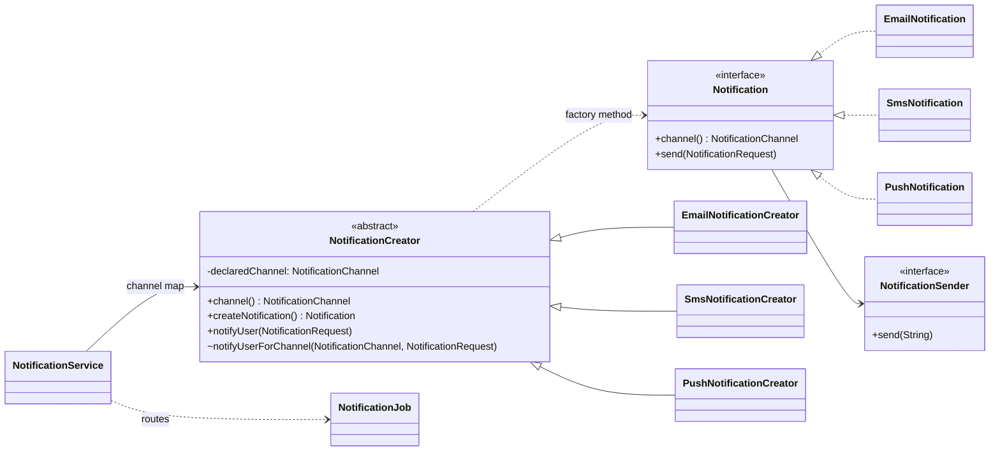
```mermaid
classDiagram
    direction LR

    class Notification {
        <<interface>>
        +channel() NotificationChannel
        +send(NotificationRequest)
    }

    class NotificationCreator {
        <<abstract>>
        -declaredChannel: NotificationChannel
        +channel() NotificationChannel
        +createNotification() Notification
        +notifyUser(NotificationRequest)
        ~notifyUserForChannel(NotificationChannel, NotificationRequest)
    }

    class NotificationSender {
        <<interface>>
        +send(String)
    }

    NotificationCreator <|-- EmailNotificationCreator
    NotificationCreator <|-- SmsNotificationCreator
    NotificationCreator <|-- PushNotificationCreator
    Notification <|.. EmailNotification
    Notification <|.. SmsNotification
    Notification <|.. PushNotification
    NotificationCreator ..> Notification : factory method
    Notification --> NotificationSender
    NotificationService --> NotificationCreator : channel map
    NotificationService ..> NotificationJob : routes
```

### Çalışma zamanı akışı

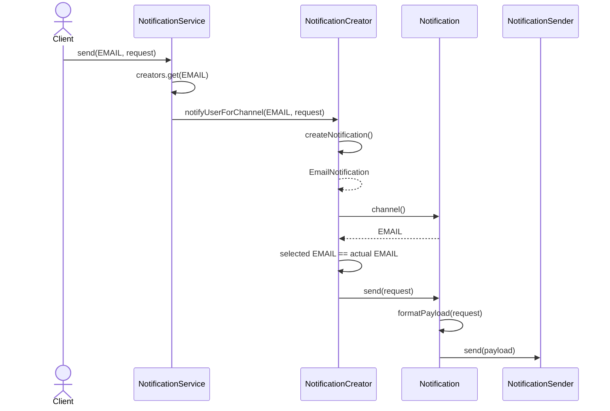
```mermaid
sequenceDiagram
    actor Client
    participant Service as NotificationService
    participant Creator as NotificationCreator
    participant Product as Notification
    participant Sender as NotificationSender

    Client->>Service: send(EMAIL, request)
    Service->>Service: creators.get(EMAIL)
    Service->>Creator: notifyUserForChannel(EMAIL, request)
    Creator->>Creator: createNotification()
    Creator-->>Creator: EmailNotification
    Creator->>Product: channel()
    Product-->>Creator: EMAIL
    Creator->>Creator: selected EMAIL == actual EMAIL
    Creator->>Product: send(request)
    Product->>Product: formatPayload(request)
    Product->>Sender: send(payload)
```

### Kodu adım adım okuma

#### 1. İstek daha oluşturulurken doğrulanır

`NotificationRequest` bir record'dur. Compact constructor null veya blank recipient, title ve message değerlerini reddeder.
Geçerli değerlerin çevre boşluklarını bir kez `trim()` ile temizler; product'lar normalize edilmiş değer görür.

#### 2. Gönderme mekanizması product'tan ayrılır

`NotificationSender` sayesinde bildirim formatı konsola bağımlı değildir; testler payload'ı `InMemoryNotificationSender` ile gözlemler.

#### 3. Product yalnız kendi kanal formatını bilir

`EmailNotification`, `SmsNotification` ve `PushNotification` aynı `send` akışını miras alır; değişen bölüm protected `formatPayload(request)` metodudur.

#### 4. Creator bağımlılığı product'a aktarır

Her concrete creator, constructor'da aldığı sender'ı `sender()` üzerinden yeni product'a verir ve aynı constructor'da sabit kanal metadata'sını tanımlar.
Metadata okumak product üretmez.
Creator, null sender/product/request ile kendi beyanından farklı product'ı erken reddeder; `notifyUser()` product'ı tam bir kez oluşturur.

#### 5. Service doğru creator'ı bulur

`NotificationService`, map'i `Map.copyOf` ile snapshot'a çevirir.
Built-in creator'ın açık metadata'sı varsa map anahtarıyla uyuşması constructor'da denetlenir; legacy creator için wiring sırasında product üretilmez.
Kayıt bulunamazsa anlamlı bir `IllegalArgumentException` üretir.
Her `send(channel, request)` çağrısı seçilen kanalı creator'a geçirir; creator tek product üretir, gerçek kanalı o instance'dan okur ve uyuşursa yine aynı instance'ı gönderir.

#### 6. Composition root somut tipleri bilir

`FactoryMethodDemo` üç creator'ı oluşturup map'e koyar. Concrete sınıflardan habersiz olması gereken yer bütün uygulama değil, ortak iş akışıdır.

#### 7. Gerçekçi batch aynı güvenli yolu tekrar kullanır

`NotificationJob`, kanal ve isteği null olmayacak biçimde gruplar.
`sendAll` yeni bir üretim algoritması yazmaz; liste snapshot'ını alır ve her işi mevcut `send(channel, request)` metoduna geçirir.
Sıra korunur, fakat bir iş hata verirse kalan işlerin devamı, rollback veya retry davranışı özellikle tanımlanmamıştır.

### Testlerin anlattığı kontratlar

`FactoryMethodDemoTest` testleri şu hikâyeyi korur:

| `@Nested` grup | Korunan davranış |
|---|---|
| `CreatorContract` | Her creator’ın doğru product/kanalı üretmesi; `notifyUser()`ın factory method ürününü göndermesi; metadata okumanın product oluşturmaması; tek çağrıda tek üretim; yanlış kanallı product’ın reddi ve yalnız eski factory method’u uygulayan custom creator’ın uyumluluğu |
| `PayloadFormatting` | Aynı normalize edilmiş isteğin EMAIL, SMS ve PUSH tarafından kendi kanal formatına çevrilmesi |
| `RequestValidation` | Null/blank istek alanlarının erken reddi ve geçerli recipient/title/message değerlerinin trim edilmesi |
| `ServiceRouting` | Seçilen creator’a tek yönlendirme; registry map’inin immutable snapshot olması; metadata-key wiring kontrolü; stateful legacy creator’da üretilen aynı instance’ın doğrulanıp gönderilmesi ve kayıtsız kanalın açık hata vermesi |
| `BatchDispatch` | Farklı kanallardaki işlerin mevcut güvenli `send` yoluyla ve verilen sırada gönderilmesi |

Testler aynı pakette olduğu için protected metotlara erişebilir; yine de public davranışı doğrulamak tercih edilir.

### Ne zaman kullanılır?

- Ürün varyantları düzenli olarak artıyorsa.
- Ortak kullanım algoritması sabit, oluşturma biçimi değişkense.
- Alt sınıfların üretim anına farklı bağımlılıklar veya politikalar eklemesi gerekiyorsa.
- Concrete product bilgisini ortak servisten çıkarmak istiyorsan.
- Framework bir hook metodunu override ederek nesne üretmeni bekliyorsa.

### Ne zaman kullanma?

- Tek ürün varsa ve ikinci varyant için gerçek bir değişim sinyali yoksa.
- Basit bir constructor injection yeterliyse.
- İhtiyaç yalnız bir değere göre kısa bir nesne seçmekse; küçük bir map veya Simple Factory daha açık olabilir.
- Birbiriyle ilişkili birçok ürün aynı varyantta birlikte oluşturulacaksa; Abstract Factory daha uygundur.

### Artılar ve bedeller

| Artı | Bedel |
|---|---|
| Üretim kararı ortak akıştan ayrılır | Product başına creator sınıfı oluşabilir |
| Yeni varyantlar lokal sınıflarla eklenir | Composition root yine concrete tipleri bilmelidir |
| Test double creator/sender yazmak kolaydır | Akışı takip etmek yeni başlayan için daha uzundur |
| Creator üretim politikası için extension point olur | Yanlış kullanılırsa yalnız `new` saklayan anlamsız katman olur |

### Production hardening

Güçlendirilmiş örnek aşağıdaki ilk üç korumayı artık uygular:

- Creator ve sender constructor'larında `Objects.requireNonNull`.
- `NotificationService` için null channel/request davranışı.
- Built-in creator metadata'sı ile map anahtarının wiring aşamasında tutarlılık kontrolü.
- Seçilen kanal ile tek seferde üretilen gerçek product kanalının dispatch anında kontrolü.

Gerçek teslimat sisteminde hâlâ açıkça tasarlanması gerekenler:

- Retry, timeout ve idempotency politikasının sender katmanında ele alınması.
- Batch'in fail-fast mı best-effort mü olduğu; partial success sonucunun nasıl raporlanacağı.
- Transactional outbox veya kalıcı kuyruk ile process çökmesine karşı teslimat.
- Hassas recipient veya message verisinin loglarda maskelenmesi.
- Kanal bazlı metric ve tracing.
- Enum değişmeden plugin eklemek gerekiyorsa string/type-safe registry tasarımı.

“Yeni kanal eklemek için mevcut hiçbir kod değişmez” doğru değildir; product ve creator yanında enum ile kurulum map'i de güncellenir.
Asıl kazanım, `NotificationService#send` algoritmasının dallarla büyümemesidir.

#### Compatibility notu

- `protected NotificationCreator(NotificationSender)` korunur; yalnız eski factory method'u uygulayan subclass kaynak uyumlu kalır.
- Built-in creator'lar yan etkisiz metadata için yeni iki parametreli constructor'ı kullanır.
- Legacy `channel()` fallback'i explicit çağrıda product oluşturabilir; gönderim yolu bunu kullanmadığından bir `notifyUser` çağrısı bir product üretir.
- Service artık legacy creator'ı wiring sırasında çalıştırmaz; gerçek product kanalını request anında seçilen map anahtarıyla doğrular.

### Benzer pattern'lerle karşılaştırma

| Pattern | Temel soru | Bu örnekten farkı |
|---|---|---|
| Simple Factory | Parametreye göre hangi nesneyi döndüreyim? | Genellikle tek fonksiyon/switch kullanır, kalıtım hook'u şart değildir |
| Abstract Factory | Hangi uyumlu ürün ailesini üreteyim? | Bir factory birden fazla ilişkili product türü üretir |
| Builder | Karmaşık tek nesneyi hangi adımlarla kurayım? | Ürün varyantından çok kurulum adımlarına odaklanır |
| Strategy | Çalışma zamanında hangi davranışı kullanayım? | Var olan davranışı seçer; Factory Method nesne üretir |
| Template Method | Algoritmanın hangi adımı değişsin? | Buradaki `notifyUser` zaten factory method kullanan template benzeri akıştır |

### Yaygın hatalar

1. Her `createX()` metoduna Factory Method demek; kalıbın ayırt edici yanı override edilebilir üretim kararıdır.
2. Creator oluşturup ortak operasyonu kullanmamak, her yerde doğrudan `createNotification()` çağırmak.
3. Product'ın kanal bilgisi ile registry anahtarını farklı bırakmak.
4. Null bağımlılıkları üretimden çok sonra NPE olarak görmek.
5. Composition root'taki concrete bağımlılığı “kalıp başarısız” sanmak.
6. Simple Factory için yeterli probleme gereksiz subclass hiyerarşisi kurmak.
7. Gerçek bir kütüphane yalnız `Factory` adlı sınıf içeriyor diye GoF Factory Method kullandığını varsaymak.

### Üç kademeli alıştırma

#### Seviye 1 — yeni varyant

`IN_APP` kanalı, `InAppNotification` ve creator'ını ekle; product tipi, kanal ve payload testlerini yaz.

#### Seviye 2 — batch sonucu

`sendAll` için `SENT/FAILED` sonucu ve hata nedeni taşıyan bir rapor tasarla.
Fail-fast ile best-effort seçeneklerini ayrı testlerle göster.

#### Seviye 3 — runtime eklenti

Enum'a bağımlı olmayan bir `NotificationChannelKey` ve registry tasarla; runtime eklenti sınırını tartış.

### Tek cümlelik hafıza çengeli

> **Factory Method: ortak akış siparişi verir, hangi somut ürünün doğacağını alt sınıftaki üretim hook'u seçer.**


<!-- generated-chapter:02 slug:abstract-factory source:src/main/java/com/can/creational/abstractfactory/explain/abstractfactory.md -->
<div class="chapter-break"></div>

<h2 id="chapter-abstract-factory">Abstract Factory</h2>

Abstract Factory, birlikte kullanılması gereken ürünleri uyumlu bir aile olarak üretir; bu repoda `Button` ile `Checkbox` LIGHT, DARK ve erişilebilir HIGH_CONTRAST temaları için birlikte oluşturulur.

### 30 saniyelik kart

| Soru | Cevap |
|---|---|
| **Niyet** | Concrete sınıfları göstermeden uyumlu ürün ailesi üretmek |
| **Değişen eksen** | Tema ailesi: LIGHT, DARK veya HIGH_CONTRAST |
| **Sabit kalan** | Client'ın `Button` ve `Checkbox` sözleşmeleriyle çalışması |
| **Bedel** | Yeni ürün türü bütün concrete factory'leri etkiler |
| **Bu repodaki abstract factory** | `GuiFactory` |

> Kısa tanım: **Bir tema seç; o temaya ait bütün parçalar aynı kutudan çıksın.**

### Örnek haritası: temel → güçlendirilmiş → production

| Katman | Gerçek kod karşılığı | Ne öğretiyor? |
|---|---|---|
| **Temel örnek** | `LightThemeFactory`, `DarkThemeFactory` ve `UiScreen` | Client concrete bileşenleri bilmeden aynı temadaki button + checkbox ailesini kullanır |
| **Güçlendirilmiş örnek** | `HighContrastThemeFactory`, `HighContrastButton`, `HighContrastCheckbox` | Yeni bir erişilebilirlik ailesi eklenirken `GuiFactory` ve `UiScreen` değişmez; yalnız varyantlar ile composition seçimi genişler |
| **Production sınırı** | `GuiFactoryProvider` + `UiScreen` fail-fast kontrollerinin ötesi | Gerçek component toolkit, design-token doğrulaması, WCAG testleri ve runtime theme cache bu metin tabanlı demoda uygulanmaz |

`AbstractFactoryDemo`, standart LIGHT/DARK ailelerini “temel”, HIGH_CONTRAST ailesini “daha gerçekçi” başlığı altında render eder.

### Akılda kalıcı analoji: takım forma seti

Bir futbol takımının forma, şort ve çorabı aynı kulübün renklerini taşımalıdır; parçalar birlikte seçilir.

`LightThemeFactory` açık, `DarkThemeFactory` koyu takımı hazırlar; `HighContrastThemeFactory` ise erişilebilirlik için iki parçayı aynı görsel dilde üretir.
`UiScreen` concrete sınıfları bilmeden seti kullanır.

Bu bir **kavramsal benzetmedir**; forma üretim sistemlerinin mutlaka Abstract Factory kullandığı anlamına gelmez.

### Pattern olmasaydı problem nasıl görünürdü?

Client bütün concrete ürünleri seçebilirdi:

```java
Button button;
Checkbox checkbox;

if (theme == Theme.DARK) {
    button = new DarkButton();
    checkbox = new DarkCheckbox();
} else {
    button = new LightButton();
    checkbox = new LightCheckbox();
}
```

Bu seçim farklı ekranlara kopyalandığında:

- Her client tema kararını tekrarlar.
- `DarkButton + LightCheckbox` gibi tutarsız kombinasyonlar mümkün olur.
- Yeni tema bütün seçim noktalarını değiştirir.
- Ürünlerin birlikte değiştiği bilgisi tek bir sözleşmede görünmez.

Asıl sorun, **ürünlerin aile halinde değiştiği bilgisinin tasarımda temsil edilmemesidir**.

### Çözüm ve sınırı

`GuiFactory` aynı ailede üretilmesi gereken ürün türlerini tek kontratta toplar:

```java
public interface GuiFactory {
    Button createButton();
    Checkbox createCheckbox();
}
```

Her concrete factory aynı varyanta ait product'ları döndürür:

```java
public final class DarkThemeFactory implements GuiFactory {
    public Button createButton() {
        return new DarkButton();
    }

    public Checkbox createCheckbox() {
        return new DarkCheckbox();
    }
}
```

Kalıbın sınırı önemlidir:

- Factory implementasyonunun uyumlu ürün döndürmesini Java tip sistemi otomatik kanıtlamaz.
- Tema seçimini Abstract Factory tek başına çözmez.
- Ürünlerin çalışma zamanı davranışını yönetmez; yalnız oluşturur.

`GuiFactoryProvider`, `Theme` değerini factory'ye çeviren yararlı ama kalıp için zorunlu olmayan bir composition helper'dır.

### Repo sınıfları ve pattern rolleri

| Sınıf / API | Rol | Sorumluluk |
|---|---|---|
| `Button` | Abstract Product A | `render()` kontratını tanımlar |
| `Checkbox` | Abstract Product B | `render()` kontratını tanımlar |
| `LightButton` | Concrete Product A1 | Açık tema butonunu render eder |
| `DarkButton` | Concrete Product A2 | Koyu tema butonunu render eder |
| `LightCheckbox` | Concrete Product B1 | Açık tema checkbox'ını render eder |
| `DarkCheckbox` | Concrete Product B2 | Koyu tema checkbox'ını render eder |
| `HighContrastButton` | Concrete Product A3 | Kalın çerçeveli erişilebilir butonu render eder |
| `HighContrastCheckbox` | Concrete Product B3 | Büyük işaretli erişilebilir checkbox'ı render eder |
| `GuiFactory` | Abstract Factory | İki ürün türünün üretim sözleşmesini tanımlar |
| `LightThemeFactory` | Concrete Factory 1 | Açık tema ailesini üretir |
| `DarkThemeFactory` | Concrete Factory 2 | Koyu tema ailesini üretir |
| `HighContrastThemeFactory` | Concrete Factory 3 | HIGH_CONTRAST ailesini eksiksiz üretir |
| `Theme` | Varyant anahtarı | LIGHT, DARK ve HIGH_CONTRAST seçeneklerini taşır |
| `GuiFactoryProvider` | Factory seçici | Temayı concrete factory ile eşler |
| `UiScreen` | Client | Factory'den ürünleri alır ve abstract API ile kullanır |
| `AbstractFactoryDemo` | Demo / composition root | Üç temayı kurup sonucu yazdırır |

### Yapı diyagramı

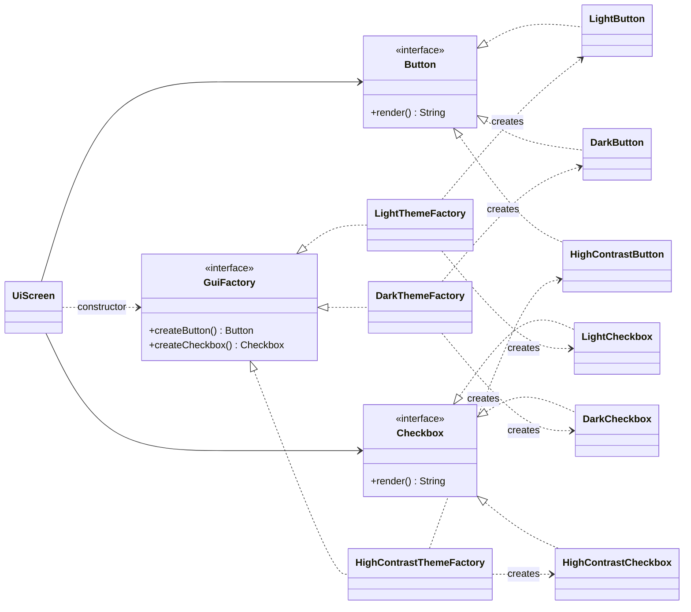
```mermaid
classDiagram
    direction LR
    class GuiFactory {
        <<interface>>
        +createButton() Button
        +createCheckbox() Checkbox
    }
    class Button {
        <<interface>>
        +render() String
    }
    class Checkbox {
        <<interface>>
        +render() String
    }
    GuiFactory <|.. LightThemeFactory
    GuiFactory <|.. DarkThemeFactory
    GuiFactory <|.. HighContrastThemeFactory
    Button <|.. LightButton
    Button <|.. DarkButton
    Button <|.. HighContrastButton
    Checkbox <|.. LightCheckbox
    Checkbox <|.. DarkCheckbox
    Checkbox <|.. HighContrastCheckbox
    LightThemeFactory ..> LightButton : creates
    LightThemeFactory ..> LightCheckbox : creates
    DarkThemeFactory ..> DarkButton : creates
    DarkThemeFactory ..> DarkCheckbox : creates
    HighContrastThemeFactory ..> HighContrastButton : creates
    HighContrastThemeFactory ..> HighContrastCheckbox : creates
    UiScreen --> Button
    UiScreen --> Checkbox
    UiScreen ..> GuiFactory : constructor
```

### Çalışma zamanı akışı

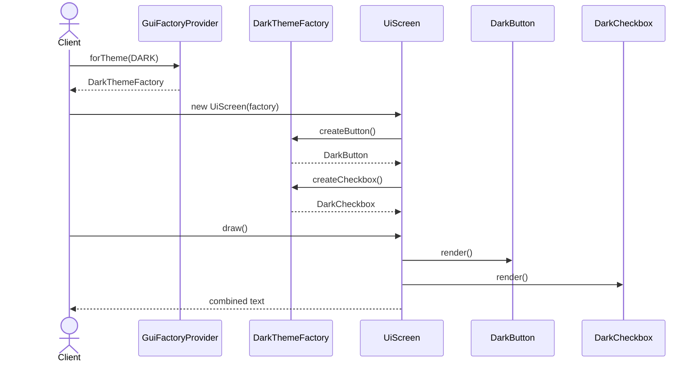
```mermaid
sequenceDiagram
    actor Client
    participant Provider as GuiFactoryProvider
    participant Factory as DarkThemeFactory
    participant Screen as UiScreen
    participant Button as DarkButton
    participant Checkbox as DarkCheckbox

    Client->>Provider: forTheme(DARK)
    Provider-->>Client: DarkThemeFactory
    Client->>Screen: new UiScreen(factory)
    Screen->>Factory: createButton()
    Factory-->>Screen: DarkButton
    Screen->>Factory: createCheckbox()
    Factory-->>Screen: DarkCheckbox
    Client->>Screen: draw()
    Screen->>Button: render()
    Screen->>Checkbox: render()
    Screen-->>Client: combined text
```

### Kodu adım adım okuma

#### 1. Product sözleşmeleri küçük tutulur

`Button` ve `Checkbox` yalnız `render()` tanımlar; client tema ayrıntısına değil bu davranışa bağımlıdır.

#### 2. Her aile bütün ürün türlerini tamamlar

Light factory iki light, dark factory iki dark ve high-contrast factory iki erişilebilir product üretir; uyum kuralı concrete implementasyonda görünür.

#### 3. Provider varyant seçimini merkezileştirir

`GuiFactoryProvider.forTheme(theme)` switch ile seçim yapar; yeni temada enum ve provider güncellenir.
Null tema `Objects.requireNonNull` ile `"theme cannot be null"` mesajıyla composition sınırında reddedilir.

#### 4. Client ürünleri constructor'da oluşturur

`UiScreen` factory'yi saklamaz; constructor'da iki abstract product'ı saklar.
Aynı screen sonradan tema değiştirmez; yeni factory ile yeni screen kurulur.
Null factory veya null product yarım kurulmuş bir ekran üretmeden açık mesajla reddedilir.

#### 5. Draw aşaması concrete sınıfları görmez

`draw()` iki `render()` sonucunu birleştirir; fake factory client bağımsızlığını gösterir.

### Testlerin anlattığı kontratlar

`AbstractFactoryDemoTest` şu davranışları görünür kılar:

| `@Nested` grup | Korunan davranış |
|---|---|
| `FactorySelection` | Provider’ın LIGHT, DARK ve HIGH_CONTRAST değerlerini doğru concrete factory’ye çözmesi; null temanın composition sınırında açıkça reddedilmesi |
| `CompatibleProductFamilies` | Her concrete factory’nin aynı aileye ait doğru Button + Checkbox tiplerini ve uyumlu render metinlerini üretmesi |
| `ClientComposition` | `UiScreen`in yalnız `GuiFactory` sözleşmesiyle tam aileyi çizmesi; fake factory ile concrete bağımsızlığın ve her factory metodunun birer kez çağrıldığının gözlenmesi |
| `InvalidFamilyProtection` | Null factory veya null product döndüren eksik family’nin yarım kurulmuş client oluşturmadan reddedilmesi |

### İki değişim eksenini ayır

#### Yeni aile eklemek: repodaki HIGH_CONTRAST

- `Theme.HIGH_CONTRAST`, `HighContrastButton`, `HighContrastCheckbox` ve `HighContrastThemeFactory` birlikte eklenmiştir.
- Provider eşlemesi güncellenir; mevcut factory sözleşmesi değişmez.
- `UiScreen` yeni aileyi öğrenmeden çalışır; test yeni ailenin iki ürününü birlikte doğrular.

Compatibility ayrıntısı: `GuiFactory` ve `UiScreen` kaynak API'si değişmese de public enum'a yeni constant eklemek her caller için risksiz değildir.
`Theme` üzerinde `default` yazmadan exhaustive switch expression kullanan dış kod yeniden derlendiğinde yeni case'i eklemek zorundadır; eski binary de yeni değerle karşılaşırsa kendi default/exhaustiveness davranışına gider.
Bu nedenle enum varyantı eklemek release note ve downstream switch taraması gerektirir.

#### Yeni ürün türü eklemek: örneğin Slider

- `Slider`, tema başına concrete slider ve `GuiFactory#createSlider()` eklenir.
- Bütün factory'ler ve Slider kullanan client güncellenir.

Yeni **aile** eklemek kolay, yeni **ürün türü** eklemek bilinçli olarak pahalıdır.

### Ne zaman kullanılır?

- Ürünler aynı tema, platform, tenant veya vendor varyantıyla birlikte değişiyorsa.
- Yanlış product kombinasyonu iş kuralını bozuyorsa.
- Client'ların concrete sınıflardan bağımsız olması gerekiyorsa.

### Ne zaman kullanma?

- Yalnız tek ürün türü varsa.
- Ürünler birbirinden bağımsız değişiyorsa.
- İki küçük varyant stabilse ve doğrudan constructor injection daha açıksa.
- Yeni ürün türleri, yeni ailelerden çok daha sık ekleniyorsa.

### Artılar ve bedeller

| Artı | Bedel |
|---|---|
| Aile seçimi tek yerde görünür | Sınıf sayısı artar |
| Client concrete product'lardan ayrılır | Yeni product türü bütün factory'leri kırar |
| Uyumlu set üretmek kolaylaşır | Uyum tip sistemiyle garanti edilmez |
| Aileyi fake factory ile test etmek kolaydır | Provider yeni ailelerde güncellenir |

### Production hardening

Güçlendirilmiş örnek şu composition korumalarını artık uygular:

- `forTheme` için `Objects.requireNonNull(theme, "theme cannot be null")`.
- `UiScreen` constructor'ında factory null kontrolü.
- Factory'nin null product döndürmesini erken reddetme.

Production tasarımında ayrıca:

- Render metni yerine gerçek component modeli veya view abstraction.
- Provider switch'i büyürse kayıt tabanlı factory resolver.
- Config parsing/fallback ve bilinmeyen tema politikası.
- HIGH_CONTRAST adının tek başına erişilebilirlik kanıtı olmadığını kabul eden WCAG contrast, focus-state, screen-reader ve kullanıcı testi.
- Renk, spacing ve typography değerleri için version'lanmış design-token kaynağı.

Yanlış kombinasyon compile-time'da kesin engellenmez; tutarlılığı factory kodu ve contract testleri korur.
Generic family marker ek güvence sağlayabilir, fakat API karmaşıklığını artırır.

### Benzer pattern'lerle karşılaştırma

| Pattern | Üretim odağı | Abstract Factory'den farkı |
|---|---|---|
| Factory Method | Bir product varyantını override edilen metotla üretmek | Birden çok ilişkili product türünü set olarak hedeflemez |
| Simple Factory | Parametreyi tek bir seçim fonksiyonuna vermek | `GuiFactoryProvider` buna benzer; asıl aile kontratı `GuiFactory`dir |
| Builder | Tek karmaşık product'ı adım adım kurmak | Ürün ailesi yerine kurulum sürecine odaklanır |
| Prototype | Var olan örneği kopyalamak | Aileyi constructor'larla üretmek zorunda değildir |
| Dependency Injection | Nesne grafiğini dışarıdan sağlamak | Abstract Factory, DI içinde kullanılabilen özel bir üretim tasarımıdır |

### Yaygın hatalar

1. Yalnız tek `createButton()` içeren factory'yi ürün ailesi sanmak.
2. Concrete factory içinde farklı ailelerden product döndürmek.
3. Provider'ı kalıbın kendisiyle karıştırmak.
4. Client içinde tekrar `instanceof DarkButton` kontrolü yapmak.
5. Yeni product eklemenin bütün family implementasyonlarını etkileyeceğini hesaba katmamak.

### Üç kademeli alıştırma

#### Seviye 1 — yeni aile

`SOLARIZED` için iki ürünü ve factory'yi ekle; provider, family ve screen testlerini tamamla.
HIGH_CONTRAST uygulamasını değişiklik kontrol listesi olarak kullan.

#### Seviye 2 — yeni ürün türü

`TextField`ı iki aileye ekle; neden bütün factory'leri etkilediğini karar kaydıyla açıkla.

#### Seviye 3 — type-safe aile

Yanlış eşleşmeyi generic marker ile engelle; sağladığı güvenceyi API karmaşıklığıyla karşılaştır.

### Tek cümlelik hafıza çengeli

> **Abstract Factory: tek parçayı değil, birlikte doğru çalışan ürün ailesini aynı kutudan çıkar.**


<!-- generated-chapter:03 slug:builder source:src/main/java/com/can/creational/builder/explain/builder.md -->
<div class="chapter-break"></div>

<h2 id="chapter-builder">Builder</h2>

Builder, çok alanlı bir nesneyi okunabilir adımlarla kurup en sonda tutarlı bir ürün üretir.
Bu repoda immutable `Report`, nested `Report.Builder` ile oluşturulur.

### 30 saniyelik kart

| Soru | Cevap |
|---|---|
| **Niyet** | Karmaşık bir nesnenin kurulumunu constructor kalabalığından ayırmak |
| **Değişen eksen** | Report'a hangi opsiyonel alan ve section'ların ekleneceği |
| **Sabit kalan** | `build()` sonunda immutable `Report` üretilmesi |
| **Bedel** | Mutable builder durumu ve ek API yüzeyi oluşur |
| **Bu repodaki giriş** | `Report.builder(title)` |

> Kısa tanım: **Önce parçaları tezgâhta düzenle, hazır olduğunda ürünü mühürle.**

### Örnek haritası: temel → güçlendirilmiş → production

| Katman | Gerçek kod karşılığı | Ne öğretiyor? |
|---|---|---|
| **Temel örnek** | `Report.builder(title)` ve fluent adımlar | Zorunlu alanla başlayan mutable builder, `build()` anında immutable `Report` snapshot'ı üretir |
| **Güçlendirilmiş örnek** | `Report#toBuilder()` ve normalize edilen `sections(List)` | Mevcut rapordan yalnız seçilen alanları değişen yeni varyant türetilir; tekli ve toplu section girişleri aynı kurala uyar |
| **Production sınırı** | `ReportDirector` reçetelerinin ötesi | Cross-field kuralları, localization, kalıcı çıktı formatları ve çok büyük bölüm listelerinde kopyalama maliyeti bu küçük modelde çözülmez |

`BuilderDemo`, custom kurulumu ve iki director reçetesini korurken quarterly rapordan bir executive-summary varyantı da türetir.

### Akılda kalıcı analoji: kişiselleştirilen sandviç

Ekmek zorunludur; peynir, sos ve sebzeler seçime bağlıdır.
Kasiyere on boolean parametre vermek yerine seçimler sırayla söylenir.
Sipariş tamamlanınca mutfak değiştirilemeyen nihai sandviçi çıkarır.

`Report.Builder` hazırlık tezgâhı, `Report` teslim edilmiş üründür.
`ReportDirector` ise sık siparişler için kayıtlı reçeteleri temsil eder.

Bu bir **kavramsal benzetmedir**; restoran sistemlerinin içeride mutlaka Builder kullandığını iddia etmez.

### Pattern olmasaydı problem nasıl görünürdü?

Çok parametreli constructor çağrısı şöyle olabilirdi:

```java
Report report = new Report(
        "Q2 Satış Raporu",
        "İkinci çeyrek metrikleri",
        List.of("Revenue", "Churn"),
        true,
        "Analytics Team"
);
```

Alanlar arttıkça:

- Aynı tipteki parametrelerin sırası karışır.
- `true` değerinin neyi açtığı çağrı yerinde görünmez.
- Opsiyonel kombinasyonlar telescoping constructor üretir.
- Default değerler farklı constructor'lara dağılır.
- Mutable liste ürünün içine sızabilir.

Named argument olmayan Java'da çağrının niyetini okumak zorlaşır.

### Çözüm ve sınırı

Gerçek API zorunlu title'ı başlangıçta alır:

```java
Report report = Report.builder("Q2 Satış Raporu")
        .summary("İkinci çeyrek metrikleri")
        .addSection("Revenue")
        .addSection("Churn")
        .includeChart(true)
        .author("Analytics Team")
        .build();
```

Builder şunları otomatik garanti etmez:

- Her fluent API doğru doğrulama yapıyor değildir.
- Builder'ın kendisi immutable değildir.
- Adımların her sırada çağrılması domain açısından geçerli olmayabilir.
- Basit bir nesnede sınıf ve metot sayısını gereksiz artırabilir.
- Aynı builder eşzamanlı thread'lerde güvenle paylaşılamaz.

Bu örnek, Effective Java tarzı nested fluent builder'dır.
Klasik GoF Builder'daki ayrı `Builder` arayüzü ve birden fazla representation burada yoktur.

### Repo sınıfları ve pattern rolleri

| Sınıf / API | Rol | Sorumluluk |
|---|---|---|
| `Report` | Product | Kurulum sonrası immutable raporu temsil eder |
| `Report.Builder` | Concrete Builder | Alanları toplar, normalize eder ve product üretir |
| `Report.builder(String)` | Builder factory | Zorunlu title ile builder başlatır |
| `Report#toBuilder()` | Varyant başlangıcı | Mevcut immutable raporun alanlarını yeni builder'a kopyalar |
| `summary(String)` | Build step | Özeti ayarlar |
| `sections(List<String>)` | Build step | Section listesinin kopyasını alır |
| `addSection(String)` | Build step | Normalize edilmiş tek section ekler |
| `includeChart(boolean)` | Build step | Chart bayrağını ayarlar |
| `author(String)` | Build step | Yazarı ayarlar |
| `build()` | Terminal step | Builder snapshot'ından `Report` üretir |
| `ReportDirector` | Reçete helper'ı | İki hazır Report kurulumu sunar |
| `BuilderDemo` | Client | Custom, hazır ve mevcut üründen türetilmiş reçeteleri karşılaştırır |

### Yapı diyagramı

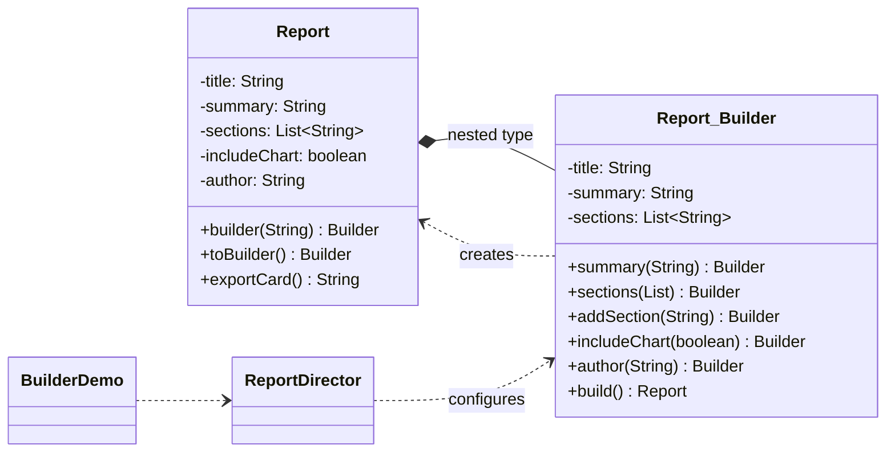
```mermaid
classDiagram
    direction LR

    class Report {
        -title: String
        -summary: String
        -sections: List~String~
        -includeChart: boolean
        -author: String
        +builder(String) Builder
        +toBuilder() Builder
        +exportCard() String
    }

    class Report_Builder {
        -title: String
        -summary: String
        -sections: List~String~
        +summary(String) Builder
        +sections(List) Builder
        +addSection(String) Builder
        +includeChart(boolean) Builder
        +author(String) Builder
        +build() Report
    }

    Report *-- Report_Builder : nested type
    Report_Builder ..> Report : creates
    ReportDirector ..> Report_Builder : configures
    BuilderDemo ..> ReportDirector
```

### Çalışma zamanı akışı

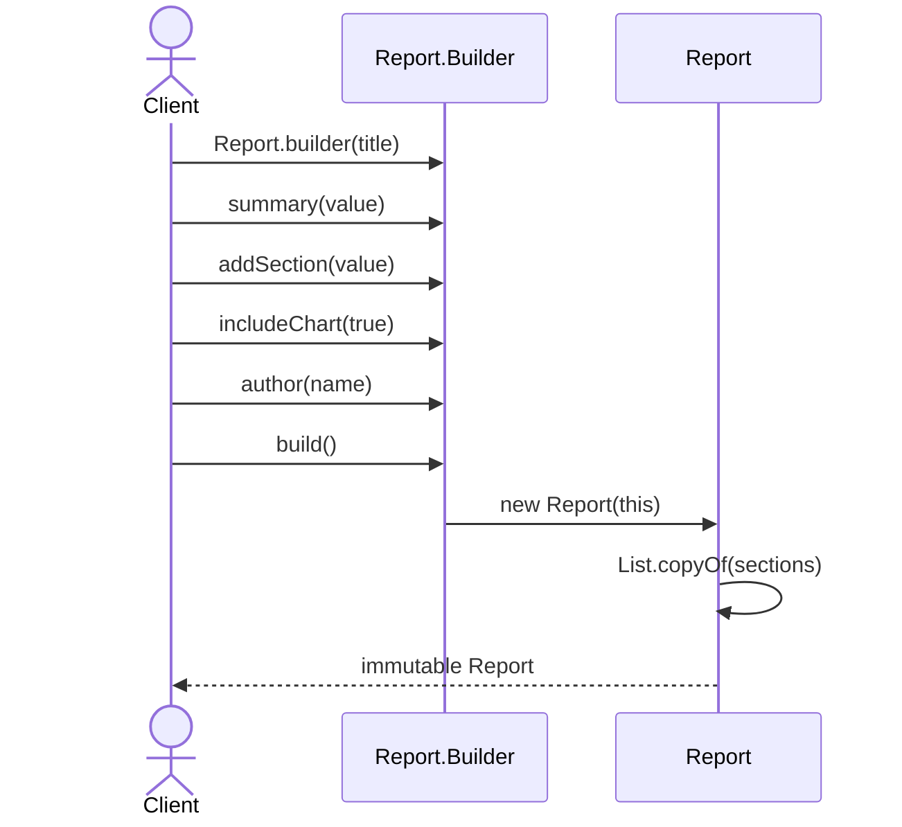
```mermaid
sequenceDiagram
    actor Client
    participant Builder as Report.Builder
    participant Product as Report

    Client->>Builder: Report.builder(title)
    Client->>Builder: summary(value)
    Client->>Builder: addSection(value)
    Client->>Builder: includeChart(true)
    Client->>Builder: author(name)
    Client->>Builder: build()
    Builder->>Product: new Report(this)
    Product->>Product: List.copyOf(sections)
    Product-->>Client: immutable Report
```

### Kodu adım adım okuma

#### 1. Zorunlu alan girişte alınır

`Report.builder(title)`, private builder constructor'ını çağırır.
Title null veya blank olamaz ve `trim()` ile normalize edilir.

#### 2. Opsiyoneller anlamlı default'larla başlar

- `summary`: `"No summary"`
- `sections`: boş liste
- `includeChart`: `false`
- `author`: `"Unknown"`

Client yalnız değiştirmek istediği alanları çağırır.

#### 3. Fluent metot aynı builder'ı döndürür

Her setter `this` döndürdüğü için zincir kurulabilir.
Bu, builder'ın mutable olduğu anlamına gelir; henüz `Report` değildir.

#### 4. Liste iki sınırda korunur

`sections(values)`, her elemanı normalize eden yeni bir liste üreterek input listesinden ayrılır.
`Report` constructor'ı `List.copyOf` ile değiştirilemez product snapshot'ı üretir.
Builder sonradan kullanılsa bile önceki Report değişmez.

#### 5. `addSection` ile `sections` aynı doğrulamayı paylaşır

`addSection` null/blank section'ı reddeder ve trim eder.
`sections(List)` de listedeki her elemanı aynı `normalize(section, "section")` fonksiyonundan geçirir.
Böylece tekli girişte kabul edilmeyen blank değer, toplu API üzerinden sisteme sızamaz.

#### 6. Director hazır reçete sağlar

`createQuarterlySalesReport()` ve `createIncidentPostmortemReport(id)` tekrar eden adımları toplar.
Bu sınıf generic bir GoF Director değil, `Report.Builder`a bağlı pratik bir reçete helper'ıdır.
Incident ID null/blank olamaz ve başlığa eklenmeden önce trim edilir.

#### 7. `toBuilder()` güvenli bir varyant başlangıcıdır

`toBuilder()`, raporun bütün scalar alanlarını ve section listesinin yeni kopyasını private builder constructor'ına taşır.
Client yalnız değişen kararları çağırır; örneğin ayrıntılı quarterly rapordan daha kısa bir executive rapor üretir.
Bu bir in-place güncelleme değildir: kaynak `Report` aynen kalır ve ikinci `build()` yeni bir object üretir.

### Testlerin anlattığı kontratlar

`BuilderDemoTest` şu kontratları korur:

| `@Nested` grup | Korunan davranış |
|---|---|
| `FluentConstruction` | İsimli adımlarla bütün alanların kurulması, section ekleme sırası ve çağrılmayan opsiyonellerin belgelenen default’ları |
| `ValidationBoundary` | Title/summary/author ile tekli ve toplu section girişlerinin aynı trim/doğrulama politikasına uyması; null/blank değerlerin doğru API sınırında reddi |
| `ImmutableProduct` | Kaynak listenin ve accessor sonucunun ürünü değiştirememesi; builder tekrar kullanıldığında daha önce üretilen `Report`un snapshot olarak kalması |
| `DerivedReportVariants` | `toBuilder()`ın bütün mevcut kararları taşıyıp kaynak raporu değiştirmeden yalnız seçilen alanları farklı yeni bir ürün üretmesi |
| `DirectorRecipes` | Quarterly ve incident reçetelerinin beklenen bütün alanları kurması; incident ID’nin trim edilmesi ve eksik ID’nin erken reddi |

Testler `Report` için `equals` olmadığı için alan accessor'larını `assertAll` ile karşılaştırır.

### Ne zaman kullanılır?

- Zorunlu ve opsiyonel alanlar birlikteyse.
- Aynı türden çok constructor parametresi varsa.
- Okunabilir çağrı API'si önemliyse.
- Nihai ürün immutable tutulacaksa.
- Kurulum sonunda çapraz alan doğrulaması yapılacaksa.

### Ne zaman kullanma?

- İki alanlı basit value object için constructor yeterliyse.
- Record canonical constructor niyeti açıkça anlatıyorsa.
- Ürün adım adım değil tek factory çağrısıyla doğal oluşuyorsa.
- Builder yalnız bütün alanları birebir tekrar eden boilerplate ise.

### Artılar ve bedeller

| Artı | Bedel |
|---|---|
| Çağrı yerinde alan adları görünür | Ek builder API'si bakım ister |
| Default ve doğrulama merkezileşir | Builder mutable ve thread-safe değildir |
| Immutable product üretmek kolaylaşır | Eksik doğrulama geç hataya dönüşebilir |
| Constructor patlamasını önler | Çok sayıda fluent adım uzun zincir üretir |
| Reçeteler tekrar kullanılabilir | Director yanlış adlandırılırsa beklenti karışır |

### Production hardening

Güçlendirilmiş örnek artık şunları uygular:

- `sections(List)` içindeki her elemanı `addSection` ile aynı şekilde doğrulamak.
- `incidentId` için null/blank doğrulaması ve normalizasyon.
- `toBuilder()` içinde listeyi kopyalayarak kaynak product ile yeni builder'ı ayırmak.

Production kararları olarak kalanlar:

- `trim()` yerine Unicode-aware `strip()` kararını değerlendirmek.
- Çok section ekleniyorsa her çağrıda liste kopyalamak yerine tek mutable buffer kullanmak.
- Build sırasında çapraz alan kuralları uygulamak.
- Hata mesajlarını domain diliyle standartlaştırmak.
- `Report` için gerekiyorsa value equality veya record alternatifi değerlendirmek.
- Director reçetelerinin sabit metinlerini configuration/localization katmanına taşımak.

Mevcut testler hem temel kurulum kontratını hem bu güçlendirmeleri ayrı `@Nested` bağlamlarda sabitler.

### Benzer pattern'lerle karşılaştırma

| Pattern | Ana soru | Builder'dan farkı |
|---|---|---|
| Factory Method | Hangi concrete product oluşacak? | Builder tek product'ın nasıl kurulacağına odaklanır |
| Abstract Factory | Hangi uyumlu ürün ailesi oluşacak? | Builder aile değil adım ve configuration yönetir |
| Prototype | Hangi mevcut örnek kopyalanacak? | Builder çoğunlukla sıfırdan kurar |
| Fluent Interface | API nasıl akıcı okunur? | Builder fluent olabilir; her fluent API Builder değildir |
| Parameter Object | Parametreleri hangi nesnede taşıyayım? | Üretim süreci ve terminal `build()` şart değildir |

### Yaygın hatalar

1. Bütün alanları opsiyonel yapıp geçersiz product üretmek.
2. `build()` sonrasında builder'ın mutable listesini product'a doğrudan vermek.
3. Fluent setter içinde doğrulama, build içinde başka doğrulama kullanıp tutarsızlık yaratmak.
4. Builder'ı thread'ler arasında paylaşmak.
5. Her fluent API'yi GoF Builder sanmak.
6. Reçete helper'ını birden fazla representation yöneten klasik Director gibi anlatmak.

### Üç kademeli alıştırma

#### Seviye 1 — yeni alan

Opsiyonel `department` alanı ekle.
Default değerini, normalize kuralını, accessor'ını ve export testini tamamla.

#### Seviye 2 — çapraz alan kuralı

`includeChart(true)` ise en az bir section zorunlu olsun.
Kuralın fluent adımda mı `build()` aşamasında mı daha doğru olduğunu gerekçelendir.

#### Seviye 3 — iki representation

Aynı rapor reçetesinden text ve HTML çıktı üreten iki builder tasarla.
Bu kez generic bir Director'ın neden anlamlı hale geldiğini göster.

### Tek cümlelik hafıza çengeli

> **Builder: zorunlu parçayla başla, seçenekleri isimli adımlarla ekle, `build()` ile immutable ürünü mühürle.**


<!-- generated-chapter:04 slug:prototype source:src/main/java/com/can/creational/prototype/explain/prototype.md -->
<div class="chapter-break"></div>

<h2 id="chapter-prototype">Prototype</h2>

Prototype, yeni nesneyi kurulum adımlarını tekrarlamak yerine hazır örneği kopyalayarak üretir; burada aday profilleri kişiselleştirilir.

### 30 saniyelik kart

| Soru | Cevap |
|---|---|
| **Niyet** | Mevcut bir nesneyi yeni nesnenin üretim kaynağı yapmak |
| **Değişen eksen** | Kopyanın kişisel adı, özeti, adresi ve becerileri |
| **Sabit kalan** | Şablondaki rol ve başlangıç verileri |
| **Bedel** | Shallow/deep copy semantiğini doğru tasarlama sorumluluğu |
| **Bu repodaki kopyalama noktası** | `CandidateProfile#copy()` |

> Kısa tanım: **Şablonu kopyala; aslına dokunmadan kopyayı özelleştir.**

### Örnek haritası: temel → güçlendirilmiş → production

| Katman | Gerçek kod karşılığı | Ne öğretiyor? |
|---|---|---|
| **Temel örnek** | `CandidateProfile#copy()` ve private copy constructor | Mutable `Address` ile skill container'ı ayrılan deep-enough kopya, aslı bozmadan kişiselleştirilir |
| **Güçlendirilmiş örnek** | `CandidateProfileRegistry#register`, defensive `address()` / `skills()` | Registry canlı referans değil template snapshot'ı saklar; accessor'lar iç mutable state'i dışarı açmaz |
| **Production sınırı** | `HashMap` tabanlı küçük registry'nin ötesi | Duplicate-ID politikası, versioning, concurrent update, çok büyük/cyclic graph kopyası ve kopyalama maliyeti ayrıca tasarlanmalıdır |

`PrototypeDemo`, doğrudan deep-copy fikrini ve registry'den alınan bağımsız çalışma kopyasını ayrı başlıklarla gösterir.

### Akılda kalıcı analoji: çalışma kâğıdının fotokopisi

Öğretmen başlıklı bir çalışma kâğıdı hazırlar; her öğrenci ayrı fotokopiye kendi cevaplarını yazar.
Bir öğrencinin notu diğer öğrencinin veya öğretmenin aslını değiştirmemelidir.

`CandidateProfile` şablon, `copy()` fotokopi makinesi, fluent metotlar öğrencinin kişiselleştirmesidir.

Bu bir **kavramsal benzetmedir**; araçlardaki “duplicate” davranışı benzer olsa da iç implementasyonun GoF Prototype olduğu varsayılmaz.

### Pattern olmasaydı problem nasıl görünürdü?

Her aday için bütün ortak alanlar tekrar kurulabilirdi:

```java
CandidateProfile ahmet = new CandidateProfile(
        "Ahmet Yılmaz",
        "Java Developer",
        "Backend-focused developer.",
        new Address("Ankara", "TR"),
        List.of("Java", "Spring Boot", "SQL", "Kafka")
);
```

Onlarca ortak ayar olduğunda:

- Default değerler çağrı yerlerine kopyalanır.
- Bir default değişikliği bütün kurulum noktalarını etkiler.
- Karmaşık nested graph tekrar oluşturulur.
- Client concrete kurulum ayrıntılarını bilir.
- Eksik veya farklı default kullanan varyantlar oluşur.

Prototype runtime'da hazırlanmış nesne başlangıç noktası olacaksa değerlidir; performans otomatik garanti değildir.

### Çözüm ve sınırı

Repo küçük ve açık bir kontrat kullanır:

```java
public interface Prototype<T> {
    T copy();
}
```

`CandidateProfile#copy()` private copy constructor'a gider:

```java
private CandidateProfile(CandidateProfile source) {
    this.fullName = source.fullName;
    this.targetRole = source.targetRole;
    this.summary = source.summary;
    this.address = new Address(source.address);
    this.skills = new ArrayList<>(source.skills);
}
```

Kod `Cloneable` kullanmaz; kopyalama kararı domain sınıfında açıkça görünür.

Prototype şunları kendiliğinden çözmez:

- Nesne grafiğinin hangi derinlikte kopyalanacağını belirlemez.
- Dairesel referansları otomatik yönetmez.
- Registry'nin thread-safe olmasını sağlamaz.
- Kopyanın immutable veya valid olmasını garanti etmez.
- Kopyalamanın constructor'dan daha hızlı olduğunu garanti etmez.

### Repo sınıfları ve pattern rolleri

| Sınıf / API | Rol | Sorumluluk |
|---|---|---|
| `Prototype<T>` | Prototype contract | `copy()` operasyonunu tanımlar |
| `CandidateProfile` | Concrete Prototype | Kendi kopyalama semantiğini uygular |
| `CandidateProfile(CandidateProfile)` | Copy constructor | Mutable nested alanları ayırır; private'dır |
| `Address` | Mutable nested object | Şehir ve ülke bilgisini taşır |
| `CandidateProfileRegistry` | Prototype Registry | ID ile template saklar, `cloneOf` ile kopya verir |
| `register` | Snapshot sınırı | Normalize edilen ID altında profile'ın o andaki kopyasını saklar |
| `personalize` | Özelleştirme adımı | Kopyanın adını ve özetini değiştirir |
| `addSkill` | Özelleştirme adımı | Kopyanın beceri listesine ekler |
| `relocateTo` | Özelleştirme adımı | Kopyanın adresini değiştirir |
| `PrototypeDemo` | Client | Template kaydeder ve iki bağımsız clone üretir |

### Yapı diyagramı

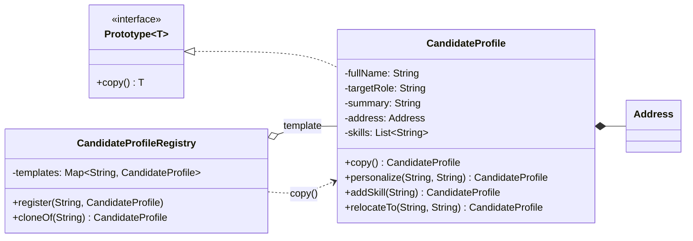
```mermaid
classDiagram
    direction LR
    class Prototype~T~ {
        <<interface>>
        +copy() T
    }
    class CandidateProfile {
        -fullName: String
        -targetRole: String
        -summary: String
        -address: Address
        -skills: List~String~
        +copy() CandidateProfile
        +personalize(String, String) CandidateProfile
        +addSkill(String) CandidateProfile
        +relocateTo(String, String) CandidateProfile
    }
    class CandidateProfileRegistry {
        -templates: Map~String, CandidateProfile~
        +register(String, CandidateProfile)
        +cloneOf(String) CandidateProfile
    }
    Prototype <|.. CandidateProfile
    CandidateProfile *-- Address
    CandidateProfileRegistry o-- CandidateProfile : template
    CandidateProfileRegistry ..> CandidateProfile : copy()
```

### Çalışma zamanı akışı

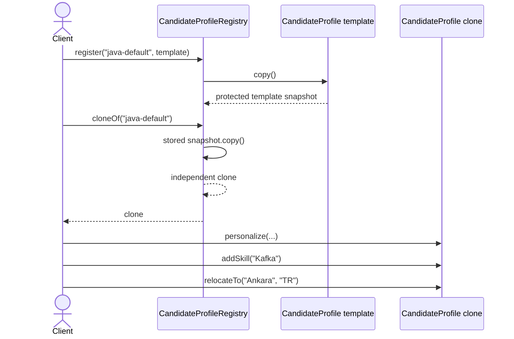
```mermaid
sequenceDiagram
    actor Client
    participant Registry as CandidateProfileRegistry
    participant Template as CandidateProfile template
    participant Clone as CandidateProfile clone

    Client->>Registry: register("java-default", template)
    Registry->>Template: copy()
    Template-->>Registry: protected template snapshot
    Client->>Registry: cloneOf("java-default")
    Registry->>Registry: stored snapshot.copy()
    Registry-->>Registry: independent clone
    Registry-->>Client: clone
    Client->>Clone: personalize(...)
    Client->>Clone: addSkill("Kafka")
    Client->>Clone: relocateTo("Ankara", "TR")
```

### Kodu adım adım okuma

#### 1. Public constructor da input kopyası alır

Address copy constructor, skills `new ArrayList` ile ayrılır; input değişse profil etkilenmez.
Ad, rol, özet, şehir, ülke ve skill değerleri kendi domain sınırlarında trim edilir; null/blank değerler yarım nesne oluşturmadan reddedilir.

#### 2. `copy()` polymorphic üretim noktasıdır

Client copy ayrıntısını bilmez; concrete prototype paylaşılacak ve kopyalanacak alanları belirler.

#### 3. Mutable nested alanlar ayrılır

Address ve list container yeni instance'lardır; immutable String elemanlarını paylaşmak güvenlidir.

#### 4. Clone fluent biçimde değiştirilir

Üç fluent metot aynı mutable clone'u döndürür; Prototype ile Builder aynı şey değildir.
`personalize` ve `Address#moveTo`, iki yeni değeri de yerel değişkenlerde doğruladıktan sonra state'e yazar.
İkinci alan geçersizse ilk alanın değiştiği yarım mutation oluşmaz.

#### 5. Registry her istekte `copy()` çağırır

`cloneOf(id)` template'i dışarı vermez; eksik ID için açık `IllegalArgumentException` fırlatır.

#### 6. Registry template snapshot'ı saklar

`register`, kendisine verilen profile'ı doğrudan saklamaz; `profile.copy()` sonucunu normalize edilmiş ID altında tutar.
Kayıttan sonra caller kendi profile'ını değiştirirse gelecekteki clone'lar bundan etkilenmez.
`cloneOf` her çağrıda saklanan snapshot'ın bir kopyasını döndürdüğü için registry içindeki template de dışarı açılmaz.

#### 7. Getter'lar mutable iç durumu açmaz

`address()` yeni bir `Address`, `skills()` ise `List.copyOf` ile değiştirilemez snapshot döndürür.
Dış kod accessor üzerinden aldığı değeri değiştirse bile profile'ın iç durumu korunur; domain değişiklikleri `relocateTo` ve `addSkill` üzerinden geçer.

### Shallow copy ve deep copy

```text
Shallow:
Template ─┐
          ├──> aynı Address
Clone ────┘

Bu repo:
Template ───> Address A
Clone ──────> Address B
```

“Deep copy” nesne grafiğine ilişkin karardır; repo Address ve list container'ını ayırır.
Skill mutable olursa yalnız listeyi kopyalamak yeterli olmayacaktır.

### Compatibility ve subclass sınırı

Bu hardening öncesinde `address()` iç Address referansını, `skills()` ise mutable iç listeyi doğrudan döndürüyordu.
Metot imzaları aynı kaldığı için eski caller source'u derlenebilir; davranış ise bilinçli olarak değişmiştir:

- `profile.address().moveTo(...)` artık yalnız detached kopyayı değiştirir.
- `profile.skills().add(...)` artık `UnsupportedOperationException` üretir.
- Domain değişikliği isteyen caller `relocateTo(...)` ve `addSkill(...)` kullanmalıdır.

Bu bir encapsulation düzeltmesidir, fakat version'lanan bir kütüphanede migration/release note gerektiren davranış değişikliğidir.

`CandidateProfile` kaynak uyumluluğu ve eğitimde subclass deneyi için `final` yapılmamıştır.
Buna karşılık `Prototype<CandidateProfile>` kontratı inherited `copy()` çağrısının subclass'ın runtime tipini koruyacağını vaat etmez; mevcut private copy constructor her zaman düz `CandidateProfile` üretir.
Yeni state ekleyen bir subclass kendi covariant `copy()` metodunu override etmeli ve bütün ek mutable alanlarının copy politikasını açıkça uygulamalıdır.
Subtype-preserving copy zorunlu bir domain kuralıysa alternatif, sınıfı baştan kapatmak veya self-typed prototype hiyerarşisi tasarlamaktır; sonradan `final` eklemek de dış subclass'lar için source-breaking olur.

### Testlerin anlattığı kontratlar

`PrototypeDemoTest` şu hikâyeleri doğrular:

| `@Nested` grup | Korunan davranış |
|---|---|
| `CopySemantics` | `copy()`nin bütün başlangıç değerlerini yeni identity’ye taşıması; clone değişikliklerinin template’e sızmaması ve mutable dalların bağımsız olması |
| `ConstructorIsolation` | Constructor’a verilen Address/listenin ve accessor’dan dönen Address/skill görünümünün profil iç state’ini sonradan değiştirememesi |
| `RegistryContract` | Her lookup’ın birbirinden bağımsız yeni clone üretmesi; registry’nin kayıt anındaki snapshot’ı saklaması ve bilinmeyen ID’nin anlamlı hata vermesi |
| `ValidationBoundary` | Metinlerin normalize edilmesi, blank domain değerlerinin erken reddi ve çok alanlı başarısız mutation sonrasında eski tutarlı state’in atomik biçimde korunması |
| `ExportFormatting` | Export kartının clone’un güncel bütün alanlarını kararlı ve beklenen sırada göstermesi |

### Ne zaman kullanılır?

- Runtime'da hazırlanmış şablonlardan çok varyasyon üretilecekse.
- Kurulum karmaşık ve tekrar eden default'lar içeriyorsa.
- Client concrete oluşturma ayrıntısından ayrılacaksa.
- Nesne türü çalışma zamanında yalnız prototype üzerinden biliniyorsa.

### Ne zaman kullanma?

- Nesne küçük ve constructor çağrısı açık ise.
- Kopyalama semantiği belirsizse.
- Nesne grafiği yoğun döngüler ve dış kaynaklar içeriyorsa.
- Kopya yerine aynı immutable nesneyi paylaşmak güvenliyse.

### Artılar ve bedeller

| Artı | Bedel |
|---|---|
| Tekrarlanan kurulum azalır | Copy kuralı her yeni alanda güncellenmelidir |
| Runtime template kullanılabilir | Shallow copy sessiz yan etki doğurabilir |
| Client concrete constructor'dan ayrılır | Büyük graph kopyası pahalı olabilir |
| Registry hazır varyantları adlandırır | Registry yaşam döngüsü ve concurrency ister |
| `Object#clone` yerine açık domain API'si vardır | Defensive accessor kopyaları ek allocation üretir |

### Production hardening

Güçlendirilmiş örnek artık şunları uygular:

- Constructor ve fluent metotlarda null/blank doğrulaması.
- `skills()` için `List.copyOf` snapshot'ı döndürmek.
- `address()` için defensive copy döndürmek.
- Registry'ye canlı referans yerine template snapshot'ı kaydetmek.
- Null ID/profile için açık hata mesajları.

Production kararı olarak kalanlar:

- `Address`ı immutable value object veya record yapmak; böylece her okumada kopya ihtiyacını kaldırmak.
- Duplicate ID için overwrite/reject kontratı.
- Concurrent erişim gerekiyorsa immutable registry veya `ConcurrentHashMap`.
- Büyük graph'larda cycle/identity map ile kopyalama.
- Copy maliyetini varsaymak yerine benchmark etmek.

### Benzer pattern'lerle karşılaştırma

| Pattern | Ana fikir | Prototype'tan farkı |
|---|---|---|
| Builder | Nesneyi adım adım sıfırdan kur | Prototype hazır instance'tan başlar |
| Factory Method | Alt sınıfa hangi concrete product'ı üreteceğini seçtir | Prototype üretim kaynağı olarak nesneyi kullanır |
| Abstract Factory | Uyumlu product ailesi üret | Prototype tek veya çok nesneyi kopyalayabilir, aile kontratı şart değildir |
| Memento | Bir nesnenin geçmiş durumunu sakla/geri yükle | Prototype yeni bağımsız iş nesnesi üretir |
| Copy constructor | Kopyalama tekniği | Prototype, bu tekniği polymorphic üretim kontratına dönüştürür |

### Yaygın hatalar

1. Yalnız üst nesneyi kopyalayıp mutable nested referansları paylaşmak.
2. Her yeni field eklendiğinde copy constructor'ı güncellememek.
3. `clone()` kullanımını otomatik olarak Prototype kalıbı sanmak.
4. Registry'den template'i doğrudan döndürmek.
5. Copy'nin constructor'dan mutlaka hızlı olduğunu varsaymak.
6. Mutable iç listeyi getter ile açıp tüm domain kurallarını atlatmak.
7. Kavramsal “duplicate” örneklerini doğrulanmış kütüphane implementasyonu gibi sunmak.

### Üç kademeli alıştırma

#### Seviye 1 — nested sertifika

Mutable `Certification` listesi ekle; listeyi ve elemanlarını kopyalayan testleri yaz.

#### Seviye 2 — registry sürümleme politikası

Aynı ID ikinci kez kaydedildiğinde overwrite, reject veya version üretme seçeneklerinden birini uygula.
Seçimin clone alan aktif client'lara etkisini test et.

#### Seviye 3 — graph copy

Referanslı profile/mentor grafiğinde cycle üretmeden kimliği koruyan copy context geliştir.

### Tek cümlelik hafıza çengeli

> **Prototype: hazır örneği kopyala, mutable dalları ayır, sonra yalnız kopyayı özelleştir.**


<!-- generated-chapter:05 slug:singleton source:src/main/java/com/can/creational/singleton/explain/singleton.md -->
<div class="chapter-break"></div>

<h2 id="chapter-singleton">Singleton</h2>

Singleton, belirli kapsamda tek instance ve ortak erişim amaçlar; `AppConfig` thread-safe lazy initialization için double-checked locking kullanır.

### 30 saniyelik kart

| Soru | Cevap |
|---|---|
| **Niyet** | Bir sınıf için kontrollü tek instance ve ortak erişim noktası sağlamak |
| **Değişen eksen** | İlk instance'ın hangi çağrıda ve hangi thread tarafından oluşturulacağı |
| **Sabit kalan** | Bütün normal `getInstance()` çağrılarının aynı referansı döndürmesi |
| **Bedel** | Global erişim, gizli bağımlılık ve test izolasyonu riski |
| **Bu repodaki erişim** | `AppConfig.getInstance()` |

> Kısa tanım: **Kapı çok, içeride classloader başına tek oda var.**

### Örnek haritası: temel → güçlendirilmiş → production

| Katman | Gerçek kod karşılığı | Ne öğretiyor? |
|---|---|---|
| **Temel örnek** | `AppConfig#getInstance()` | DCL + `volatile`, classloader kapsamında lazy ve thread-safe tek object identity yayınlar |
| **Güçlendirilmiş örnek** | `ApiClientConfig`, `ApiClient`, `ApiRequestPlan` | Singleton yalnız composition root'ta çözülür; iş sınıfı dar interface'i constructor'dan aldığı için fake config ile global state olmadan test edilir |
| **Production sınırı** | Hard-coded immutable `AppConfig` değerlerinin ötesi | Secret yönetimi, config reload, initialization failure, DI scope ve farklı process'ler arasındaki koordinasyon Singleton tarafından çözülmez |

`SingletonDemo`, önce iki erişimin identity eşitliğini, sonra aynı config'in enjekte edildiği test edilebilir bir API istek planını gösterir.

### Akılda kalıcı analoji: binanın ortak elektrik panosu

Her daire yeni pano kurmak yerine ortak panoya erişir; her yerden doğrudan kablo çekmek ise bağımlılıkları gizleyebilir.

`getInstance()` ortak erişim noktası, private constructor normal `new AppConfig()` kullanımının engelidir.

Bu bir **kavramsal benzetmedir**; framework “singleton scope”u otomatik olarak GoF Singleton değildir.

### Pattern olmasaydı problem nasıl görünürdü?

Her client kendi config nesnesini oluşturabilirdi:

```java
AppConfig first = new AppConfig();
AppConfig second = new AppConfig();
```

Gerçek bir mutable config söz konusuysa:

- Client'lar farklı değer görebilir.
- Pahalı kaynaklar tekrar açılabilir.
- Yaşam döngüsünün sahibi belirsizleşebilir.
- Eşzamanlı initialization yarışları oluşabilir.

“Tek instance” her probleme doğru değildir; DI container yaşam döngüsünü daha görünür yönetebilir.

### Çözüm ve sınırı

Repo şu çekirdeği kullanır:

```java
private static volatile AppConfig instance;

public static AppConfig getInstance() {
    if (instance == null) {
        synchronized (AppConfig.class) {
            if (instance == null) {
                instance = new AppConfig();
            }
        }
    }
    return instance;
}
```

Bu, double-checked locking'dir:

1. Fast path instance varsa lock almaz.
2. İlk null gözleminde class monitor'üne girer.
3. Lock içinde ikinci kez kontrol eder.
4. Yalnız bir instance yayınlar.

`volatile` visibility ve ordering garantisi kurar; modern Java'da DCL'yi doğru yapan unsurdur.

Singleton sınırları:

- Garanti genel olarak **classloader başınadır**, tüm işletim sistemi süreci için mutlak değildir.
- Reflection private constructor'a erişebilir.
- Serialization uygulanırsa ayrıca `readResolve` gibi kararlar gerekir.
- Bu sınıftaki `resetForTests()` bilinçli olarak yeni instance oluşturulmasına izin verir.
- Dağıtık sistemde farklı process/JVM'ler ayrı instance taşır.

### Repo sınıfları ve pattern rolleri

| Sınıf / API | Rol | Sorumluluk |
|---|---|---|
| `AppConfig` | Singleton | Instance kontrolü ve immutable config değerleri |
| `private AppConfig()` | Kontrollü constructor | Dışarıdan normal nesne üretimini kapatır |
| `volatile instance` | Paylaşılan referans | Thread'ler arası güvenli publication sağlar |
| `getInstance()` | Global access point | Lazy instance'ı döndürür |
| `resetForTests()` | Package-private test hook | Testler arasında static state'i sıfırlar |
| `getApiBaseUrl()` | Query | Sabit API adresini döndürür |
| `getConnectionTimeoutMs()` | Query | Sabit timeout değerini döndürür |
| `describe()` | Sunum helper'ı | Config'i okunabilir metne çevirir |
| `equals/hashCode` | Value equality | URL ve timeout değerlerini identity'den bağımsız karşılaştırır |
| `ApiClientConfig` | Dar dependency contract | Client'ın static `AppConfig` tipine bağlanmasını önler |
| `ApiClient` | Güçlendirilmiş client | Config'i constructor'dan alır, URI origin/base-path ve timeout sınırını doğrular |
| `ApiRequestPlan` | Immutable sonuç | Gerçek ağ çağrısı olmadan method, URL ve timeout kararını gözlemlenebilir yapar |
| `SingletonDemo` | Composition root | Singleton'ı bir kez çözüp client'a enjekte eder |

### Yapı diyagramı

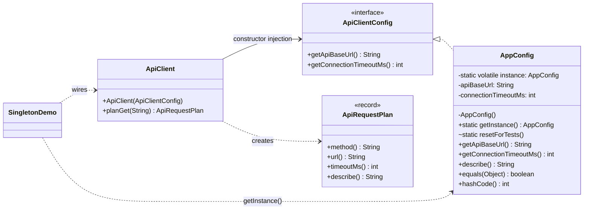
```mermaid
classDiagram
    direction LR
    class AppConfig {
        -static volatile instance: AppConfig
        -apiBaseUrl: String
        -connectionTimeoutMs: int
        -AppConfig()
        +static getInstance() AppConfig
        ~static resetForTests()
        +getApiBaseUrl() String
        +getConnectionTimeoutMs() int
        +describe() String
        +equals(Object) boolean
        +hashCode() int
    }
    class ApiClientConfig {
        <<interface>>
        +getApiBaseUrl() String
        +getConnectionTimeoutMs() int
    }
    class ApiClient {
        +ApiClient(ApiClientConfig)
        +planGet(String) ApiRequestPlan
    }
    class ApiRequestPlan {
        <<record>>
        +method() String
        +url() String
        +timeoutMs() int
        +describe() String
    }
    ApiClientConfig <|.. AppConfig
    ApiClient --> ApiClientConfig : constructor injection
    ApiClient ..> ApiRequestPlan : creates
    SingletonDemo ..> AppConfig : getInstance()
    SingletonDemo ..> ApiClient : wires
```

### Eşzamanlı ilk erişim

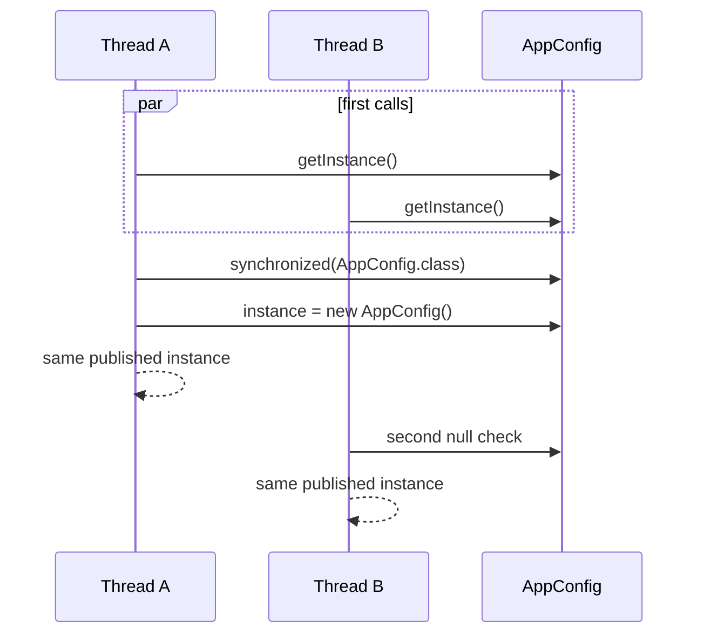
```mermaid
sequenceDiagram
    participant A as Thread A
    participant B as Thread B
    participant S as AppConfig
    par first calls
        A->>S: getInstance()
        B->>S: getInstance()
    end
    A->>S: synchronized(AppConfig.class)
    A->>S: instance = new AppConfig()
    A-->>A: same published instance
    B->>S: second null check
    B-->>B: same published instance
```

### Kodu adım adım okuma

#### 1. Constructor private'dır

Client `new AppConfig()` yazamaz; `final` sınıf subclass üzerinden yeni üretim yolunu kapatır.

#### 2. Alanlar immutable'dır

İki config alanı final ve setter'sızdır; bu mutable state riskini azaltır, global bağımlılığı kaldırmaz.

#### 3. İlk null kontrolü fast path'tir

Sonraki çağrılar synchronized bloğa girmez, fakat volatile read içerir.

#### 4. İkinci kontrol zorunludur

Birden çok thread null görebilir; lock içindeki ikinci kontrol yeni instance'ı engeller.

#### 5. Test hook static state'i temizler

`resetForTests()` aynı monitor ile instance'ı null yapar; package-private olduğu için testler erişebilir.
Production'da reset ve get yarışı identity garantisini bilinçli olarak bozar.

#### 6. Identity ile value equality farklı soruları cevaplar

Singleton kontratı “aynı referans mı?” sorusudur ve yalnız `assertSame` / `assertNotSame` ile test edilir.
`AppConfig#equals/hashCode` ise config değerlerini karşılaştırır; test hook sonrasında oluşan iki farklı identity aynı URL ve timeout'u taşıdığı için value-equal olabilir.
Value equality'nin true olması iki referansın aynı nesne olduğunu söylemez; tersine identity testi de domain değerlerinin eşitliğini ölçmez.

#### 7. Global erişim composition root'ta tutulur

`ApiClient`, kendi içinde `AppConfig.getInstance()` çağırmaz; yalnız `ApiClientConfig` sözleşmesini constructor'dan alır.
`SingletonDemo` wiring noktasında `new ApiClient(AppConfig.getInstance())` yazar.
Böylece production tek instance'ı kullanırken test, static state'e dokunmadan fake config sağlayabilir.

#### 8. İstek planı güvenli ve gözlemlenebilir bir sınırdır

`ApiClient` constructor'ı base URL'yi directory semantiğine sahip bir `URI` olarak normalize eder.
Yalnız credential/query/fragment içermeyen, geçerli portlu HTTP(S) adreslerini kabul eder; timeout'un pozitif olduğunu denetler ve immutable snapshot alır.

`planGet` endpoint'i `URI.resolve(...).normalize()` ile çözer:

- Absolute URI ve `//host/path` network-path reference reddedilir.
- Endpoint parametresi yalnız path'tir; query ve fragment özellikle reddedilir.
- Raw veya percent-encoded `.` / `..` segmentleri kabul edilmez.
- Sonucun scheme, host ve portu base URI ile aynı olmalıdır.
- Sonuç, trailing slash ile sınırlandırılan configured base-path altında kalmalıdır.
- Tek leading slash root anlamına gelmez; mevcut API davranışını koruyarak configured base-path'e göre relative kabul edilir.

`ApiRequestPlan` gerçek network I/O yapmadan oluşan method + URL + timeout kararını test etmeyi sağlar; HTTP retry/authentication gibi konular bilinçli olarak dışarıda kalır.

### Testlerin anlattığı kontratlar

`SingletonDemoTest` şu davranışları korur:

| `@Nested` grup | Korunan davranış |
|---|---|
| `IdentityContract` | Ardışık erişimlerin aynı referansı vermesi; test reset’i sonrası yeni identity oluşurken aynı config değerlerinin value-equal ve aynı hash’te kalması |
| `ConfigurationDefaults` | Immutable URL/timeout default’ları ile exact `describe()` çıktısının korunması |
| `DependencyBoundary` | `ApiClient`ın hem Singleton hem fake `ApiClientConfig` ile çalışması; güvenli GET planı üretmesi; base URI, timeout, origin/base-path, raw/encoded traversal, query ve fragment sınırlarını erken doğrulaması |
| `StructuralConstraints` | `AppConfig` sınıfının final ve tek constructor’ının private olması |
| `ThreadSafety` | Aynı anda başlayan worker’ların tek identity görmesi; timeout güvenlik ağı ve executor’ın her durumda kapatılması |

Concurrency testi güvenlik ağıdır; tekrar sayısı Java Memory Model doğruluğunun kanıtı değildir.

### Ne zaman kullanılır?

- Birden fazla instance domain kuralını gerçekten bozuyorsa.
- Yaşam döngüsü sınıfın kendisi tarafından yönetilmek zorundaysa.
- Classloader başına tek registry/config nesnesi isteniyorsa.
- DI container bulunmayan küçük bir runtime altyapısında kontrollü global erişim gerekliyse.

### Ne zaman kullanma?

- Amaç yalnız “her yerden kolay erişmek” ise.
- DI container yaşam döngüsünü zaten yönetiyorsa.
- Testlerde farklı configuration örnekleri gerekecekse.
- Tenant/request/thread başına farklı state gerekiyorsa.
- Dağıtık tekillik gerekiyorsa; process içi Singleton bunu sağlayamaz.

### Artılar ve bedeller

| Artı | Bedel |
|---|---|
| Nesne üretimi tek noktadan kontrol edilir | Bağımlılık constructor'da görünmeyebilir |
| Lazy initialization mümkündür | Static state test izolasyonunu zorlaştırır |
| Aynı JVM kapsamındaki paylaşım kolaydır | Classloader ve reflection sınırları vardır |
| DCL fast path lock almaz | Kod eager/holder yaklaşımından karmaşıktır |
| Immutable instance güvenli paylaşılır | Global erişim sıkı bağlılık yaratabilir |

### Daha sade Java alternatifleri

#### Initialization-on-demand holder

```java
private static class Holder {
    private static final AppConfig INSTANCE = new AppConfig();
}

public static AppConfig getInstance() {
    return Holder.INSTANCE;
}
```

Class initialization garantilerini kullanır; explicit volatile ve synchronized gerekmez.

#### Eager static final

Instance ucuzsa en sade seçenektir:

```java
private static final AppConfig INSTANCE = new AppConfig();
```

#### Enum singleton

Serialization ve reflection dirençleri için güçlüdür; API ve inheritance kısıtları farklıdır.

#### Dependency Injection scope

Container tek instance üretirken sınıf normal test edilebilir kalır; bu GoF Singleton'dan farklıdır.

### Production hardening

Güçlendirilmiş kullanım şunu artık kodla gösterir:

- Global `getInstance()` çağrısını iş sınıflarına yaymak yerine composition root'ta çözmek.
- Client'ı dar `ApiClientConfig` interface'i üzerinden constructor injection ile kurmak.
- Base URI origin'i, configured base-path, relative endpoint path'i ve timeout'u network çağrısından önce doğrulamak.

Production kararı olarak kalanlar:

- DCL gerçekten gerekli değilse holder veya eager yaklaşımını tercih etmek.
- Test hook'unu production artifact'tan ayırmak veya package tasarımını gözden geçirmek.
- Config değerlerini hard-code etmek yerine doğrulanmış configuration kaynağından almak.
- Secret değerleri `describe()` içine koymamak.
- Value equality ile Singleton identity testlerini ayrı assertion ve ayrı kavramlar olarak korumak.
- Classloader kapsamını deployment dokümanında açıklamak.
- Initialization hata politikasını ve yeniden denemeyi tasarlamak.
- Runtime config reload gerekiyorsa constructor snapshot'ı yerine version'lanmış provider tasarlamak.
- TLS, authentication, retry ve observability kararlarını gerçek HTTP transport katmanına yerleştirmek.

Logger, pool veya cache “her zaman Singleton” değildir; kapsamlarına göre birden fazla olabilir.
Yalnız kapsam gerçekten tek olduğunda kavramsal adaydır.

### Benzer pattern'lerle karşılaştırma

| Yapı | Ana amaç | Singleton'dan farkı |
|---|---|---|
| Static utility | Stateless fonksiyonları grupla | Nesne identity'si ve interface kullanımı yoktur |
| DI singleton scope | Container kapsamında tek instance | Sınıf kendi global erişim noktasını taşımaz |
| Object Pool | Sınırlı sayıda yeniden kullanılan instance | Tek instance şart değildir |
| Flyweight | Çok sayıda nesnede ortak intrinsic state paylaş | Tek global nesne hedeflemek zorunda değildir |
| Monostate | Farklı instance'larda static state paylaş | Identity farklı, state ortaktır |

### Yaygın hatalar

1. “Bir tane yeter” gerekçesini “bir tane olmak zorunda” ile karıştırmak.
2. Process-wide veya cluster-wide tekillik iddia etmek.
3. DCL'de `volatile` kullanmamak.
4. İkinci null kontrolünü kaldırmak.
5. Global erişimi dependency injection yerine her sınıfa yaymak.
6. Concurrency testini thread-safety'nin tek kanıtı saymak.
7. Kütüphane API'lerini doğrulamadan Logger veya pool'u Singleton örneği ilan etmek.

### Üç kademeli alıştırma

#### Seviye 1 — holder yaklaşımı

Holder kullanan alternatif yaz; aynı identity ve concurrency testlerini iki sürüme uygula.

#### Seviye 2 — yenilenebilir config

`ApiClientConfig` değerleri runtime'da yenilenecekse snapshot ve live-provider yaklaşımlarını karşılaştır.
Bir istek boyunca tutarlılık ve thread-safety kontratını test et.

#### Seviye 3 — classloader deneyi

Aynı class'ı iki classloader ile yükle; “tek” kelimesinin neden kapsam istediğini raporla.

### Tek cümlelik hafıza çengeli

> **Singleton: instance sayısını kontrol eder; ama global erişimin bedelini ve “tek” garantisinin kapsamını sen yönetirsin.**


<!-- generated-chapter:06 slug:adapter source:src/main/java/com/can/structural/adapter/explain/adapter.md -->
<div class="chapter-break"></div>

<h2 id="chapter-adapter">Adapter Pattern — Aynı İşi Farklı Dillerde Konuşturmak</h2>

> Bölüm önce geometriyle arayüz uyumunu görünür kılar, sonra aynı fikri eski bir kargo API'sindeki birim ve model dönüşümüne taşır.

### 30 saniyelik kart

| Soru | Kısa cevap |
|---|---|
| Niyet | Var olan nesnenin arayüzünü client'ın beklediği arayüze çevirmek |
| Değişen eksen | Dış/legacy API ile uygulamanın hedef kontratı |
| Ana araç | Adaptee'yi sarmak ve çağrı/veri dönüştürmek |
| Korunan şey | Client ve mevcut servis değiştirilmez |
| Bedel | Ek yönlendirme, dönüşüm ve hata eşleme sorumluluğu |
| Repo cümlesi | `SquarePegAdapter` şekli, `LegacyCargoAdapter` dış servis dilini target kontratına çevirir |

**Hafıza kancası:** Adapter bir çevirmendir; işin amacını değil konuşulan dili değiştirir.

### Örnek haritası: temel → güçlendirilmiş → production

| Katman | Repodaki karşılığı | Öğrettiği şey |
|---|---|---|
| Temel örnek | `RoundHole`, `RoundPeg`, `SquarePeg`, `SquarePegAdapter` | Uyumsuz tipi yarım köşegen hesabıyla target tipe uydurmak |
| Güçlendirilmiş örnek | `ShippingService`, `Parcel`, `DeliveryQuote`, `LegacyCargoApi`, `LegacyCargoAdapter` | Metot çağrısıyla birlikte gram→kilogram, kuruş→TL ve saat→gün semantiğini çevirmek |
| Bilinçli production sınırı | Demo API'si yerel ve deterministiktir | Gerçek provider'da timeout/retry, kur, SLA, kimlik doğrulama ve hata eşleme ayrıca tasarlanır |

### Akılda kalıcı analoji: priz dönüştürücü

Türkiye fişli cihazı İngiltere prizine doğrudan takamazsın. Duvarı veya cihaz kablosunu değiştirmek yerine araya dönüştürücü koyarsın.

- İki taraf kendi biçimini korur.
- Enerjinin amacı değişmez.
- Yalnız bağlantı biçimi çevrilir.

Yazılım Adapter'ı da tip, metot adı, DTO, veri formatı veya protokol uyumsuzluğunu aynı şekilde sınırlar. Yeni davranış eklemek Decorator'ın, erişimi yönetmek Proxy'nin niyetidir.

### Pattern olmadan problem

`RoundHole` yalnız şu kontratı kabul eder:

```java
boolean fits(RoundPeg peg)
```

`SquarePeg` ise radius değil yalnız width bilir. Kötü çözümler:

1. `RoundHole` içine her yabancı tip için overload eklemek.
2. Değiştiremeyeceğimiz `SquarePeg` sınıfını zorla dönüştürmek.
3. Formülü her client çağrısında kopyalamak.
4. `Object` ve `instanceof` zinciriyle tip güvenliğini kaybetmek.

Yeni adaptee geldikçe target tüketicisi büyür ve dönüşüm mantığı dağılır. Gerçek projede bu koku; provider DTO'su–domain modeli, XML–JSON, eski tarih–`Instant` veya üçüncü parti hata kodu–domain sonucu arasında görülür.

### Çözüm ve çözümün sınırı

`SquarePegAdapter`, target olan `RoundPeg` gibi davranır ve içeride `SquarePeg` tutar:

```java
public class SquarePegAdapter extends RoundPeg {
    private final SquarePeg squarePeg;

    @Override
    public double getRadius() {
        return squarePeg.getWidth() / Math.sqrt(2);
    }
}
```

Kare kesitin yuvarlak deliğe sığması için gereken radius, köşegenin yarısıdır:

```text
köşegen = width × √2
gerekli radius = width × √2 / 2
```

Adapter iki çeviri yapar:

- **Tip:** `SquarePeg`, `RoundPeg` kontratından görünür.
- **Anlam:** width, karşılaştırılabilir radius değerine çevrilir.

Sınırlar:

- Adapter yeni iş kuralı icat etmemelidir.
- Kaybolan veriyi sihirli biçimde geri üretemez.
- Hata/timeout politikasını otomatik çözmez.
- Dönüşüm kayıplıysa hedef kontrat bunu ifade etmelidir.

Bu klasik örnekte Target concrete sınıftır; adapter `super(0)` ile kullanılmayan üst sınıf state'i kurar. Production'da küçük bir Target interface'i bu yapay state'i kaldırabilir.

Gerçekçi örnekte target artık açıkça bir interface'tir:

```java
ShippingService shippingService =
    new LegacyCargoAdapter(new LegacyCargoApi());

DeliveryQuote quote =
    shippingService.quote(new Parcel("06000", 2_500));
```

Client gram ve TL kullanan kendi dilinde kalır. `LegacyCargoAdapter`, eski servise
`2.5` kilogram gönderir; dönen `9_625` kuruşu `96.25` TL'ye ve `50` saati yukarı
yuvarlayarak `3` güne çevirir. Para dönüşümünde `BigDecimal` kullanılması, adapter'ın
yalnız tip değil **ölçü birimi ve hassasiyet kontratı** da çevirdiğini gösterir.

### Repodaki roller

| Pattern rolü | Tip | Sorumluluk |
|---|---|---|
| Client / composition root | `AdapterPatternDemo` | Nesne graph'ını kurup örneği çalıştırır |
| Target tüketicisi | `RoundHole` | Yalnız `RoundPeg` üzerinden uygunluk ölçer |
| Target | `RoundPeg` | Client'ın bildiği radius tabanlı tip |
| Adaptee | `SquarePeg` | Width tabanlı mevcut/uyumsuz tip |
| Adapter | `SquarePegAdapter` | Adaptee'yi sarar ve width'i radius'a çevirir |
| Gerçek target | `ShippingService` | Uygulamanın beklediği kargo fiyatlama kontratı |
| Gerçek target modelleri | `Parcel`, `DeliveryQuote` | Gram, TL ve gün cinsinden uygulama dili |
| Gerçek adaptee | `LegacyCargoApi` | Kilogram, kuruş ve saat kullanan değiştirilemeyen servis |
| Gerçek adapter | `LegacyCargoAdapter` | Çağrıyı ve cevabı iki yönde dönüştürür |

Demo adapter'ın concrete tipini wiring için bilir; kazanç, `RoundHole` iş mantığının `SquarePeg` bilmemesidir.

### Mermaid yapı ve akış

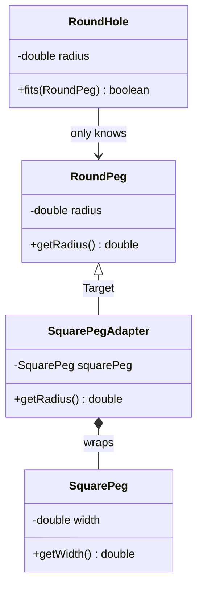
```mermaid
classDiagram
    class RoundHole {
        -double radius
        +fits(RoundPeg) boolean
    }
    class RoundPeg {
        -double radius
        +getRadius() double
    }
    class SquarePeg {
        -double width
        +getWidth() double
    }
    class SquarePegAdapter {
        -SquarePeg squarePeg
        +getRadius() double
    }
    RoundPeg <|-- SquarePegAdapter : Target
    SquarePegAdapter *-- SquarePeg : wraps
    RoundHole --> RoundPeg : only knows
```

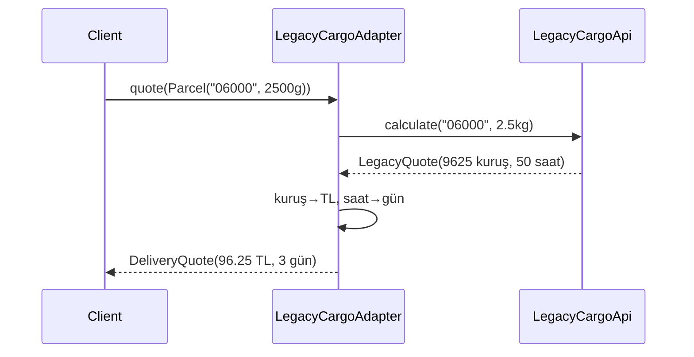
```mermaid
sequenceDiagram
    participant Client
    participant Adapter as LegacyCargoAdapter
    participant Legacy as LegacyCargoApi
    Client->>Adapter: quote(Parcel("06000", 2500g))
    Adapter->>Legacy: calculate("06000", 2.5kg)
    Legacy-->>Adapter: LegacyQuote(9625 kuruş, 50 saat)
    Adapter->>Adapter: kuruş→TL, saat→gün
    Adapter-->>Client: DeliveryQuote(96.25 TL, 3 gün)
```

### Kodun execution trace'i

**Temel akış**

1. Radius `5` olan `RoundHole` kurulur.
2. Radius `5` olan normal `RoundPeg` doğrudan sığar.
3. Width `5` ve `10` olan iki `SquarePeg` hazırlanır.
4. Her adaptee ayrı `SquarePegAdapter` ile sarılır.
5. Küçük adapter yaklaşık `3.54` döndürür; delik kabul eder.
6. Büyük adapter yaklaşık `7.07` döndürür; delik reddeder.

`RoundHole.fits` hiçbir concrete adapter kontrolü yapmaz; polimorfizm çeviriyi görünmez kılar.

**Gerçekçi entegrasyon akışı**

1. Client `ShippingService` referansı ister; `LegacyCargoApi` tipini bilmez.
2. `Parcel("06000", 2_500)` adapter'a verilir.
3. Adapter gramı `2.5` kilograma çevirip legacy çağrıyı yapar.
4. Legacy cevap `feeInKurus=9_625`, `estimatedHours=50` döner.
5. Adapter `DeliveryQuote("Legacy Cargo", 96.25, 3)` üretir.

### Test kontratları neyi öğretiyor?

`AdapterPatternDemoTest` dört `@Nested` hikâye kullanır.

#### `RoundPegCompatibility`

- Eşit ve küçük radius'un sığdığını,
- büyük radius'un sığmadığını,
- temel getter değerlerini birlikte doğrular.

#### `SquarePegAdaptation`

- Yarım köşegen formülünü floating-point toleransıyla test eder.
- Adapter'ın `RoundPeg` referansından kullanılabildiğini gösterir.
- Width `5` ve `10` ile olumlu/olumsuz yolu birlikte sınar.
- `Double.MAX_VALUE` gibi geçerli büyük bir width'in ara çarpım yüzünden
  `Infinity`ye taşmadığını doğrular.

#### `LegacyCargoIntegration`

- Gram→kilogram çağrı dönüşümünü bir fake adaptee üzerinden gözlemler.
- Kuruş→`BigDecimal` TL ve saat→gün cevap dönüşümünü doğrular.
- Client değişkeninin yalnız `ShippingService` target tipinde kaldığını gösterir.
- `140`, `276` ve `280` gram gibi tam kuruş sınırlarında binary `double`
  gürültüsünün fazladan bir kuruş üretmediğini parametreli testle sabitler.

#### `InputBoundaries`

- Sıfır/negatif/anlamsız ölçüleri,
- boş posta kodunu,
- null adaptee ve bağımlılıkları erken reddeden kontratları sabitler.

Arrange uyumsuz dünyaları kurar, Act target çağrısını yapar, Assert hem matematiksel çeviriyi hem client sonucunu doğrular. Demo metni yerine çekirdek API test edildiği için sunum değişikliği kontratı kırmaz.

### Edge case, güvenlik, concurrency ve performans

#### Sayısal sınırlar

`RoundHole` ve `SquarePeg` pozitif/finite değer ister; `RoundPeg`, adapter'ın
`super(0)` ihtiyacı nedeniyle sıfıra izin verir. `Parcel` ağırlığı pozitif olmalıdır.
Bu doğrulamalar anlamsız geometriyi ve sessiz yanlış fiyatı erken keser.

`double` yalnız kilogram oranı için legacy sınıra taşınır; uygulama tarafındaki para
`BigDecimal` kalır. Eğitim amaçlı legacy servis de `double` değeri
`BigDecimal.valueOf` ile ondalık gösterimine alıp ücret çarpımını yaptıktan sonra
`CEILING` uygular. Böylece örneğin `0.14 × 1250`, binary ara değer
`175.00000000000003` olduğu için yanlışlıkla `176` kuruşa çıkmaz. Gerçek provider'ın
küsurat ve yuvarlama kuralı sözleşmede açıkça belirtilmelidir.

#### Null ve hata eşleme

Null peg, adaptee, parcel ve adapter bağımlılığı sınırda reddedilir. Gerçek dış servis adapter'ında timeout, retry, bilinmeyen status ve hassas hata mesajı hedef kontrata bilinçli eşlenmelidir; ayrıntı sızıntısı engellenmelidir.

#### Güvenlik

Adapter güven sınırı olabilir. Dış DTO alanlarını körlemesine domain'e taşımak mass-assignment, injection veya yetkisiz alan kullanımına yol açabilir. Allow-list mapping ve boyut sınırı uygulanmalıdır.

#### Concurrency

Bu örnek immutable sayısal state okur. Mutable/thread-confined adaptee, adapter tarafından otomatik olarak thread-safe hale gelmez; lifecycle hâlâ gerçek nesnenin kontratıdır.

#### Performans

Bir çarpma ve karekök ihmal edilebilir. Büyük payload adapter'ında serialization, encoding, kopyalama ve allocation ölçülmelidir. Adapter ne doğası gereği yavaştır ne de maliyetsizdir.

### Ne zaman kullan?

- Değiştiremeyeceğin legacy/third-party API ile çalışırken.
- Provider DTO'larını domain modelinden izole ederken.
- Aynı işlev farklı metot adları veya veri biçimleriyle sunuluyorsa.
- Eski ve yeni kontratı geçiş döneminde birlikte desteklerken.
- Anti-corruption layer ile dış dilin iç modele sızmasını önlerken.

### Ne zaman kullanma?

- Tipler zaten aynı kontratı doğal biçimde paylaşabiliyorsa.
- Asıl ihtiyaç davranış eklemek veya erişimi yönetmekse.
- Dönüşüm hedef modelde ifade edilemeyecek kadar kayıplıysa.
- Tek, tekrarlanmayacak yerel dönüşüm için soyutlama daha çok yük getiriyorsa.

### Artılar ve bedeller

#### Artılar

- Mevcut sınıfları değiştirmeden entegrasyon.
- Dönüşüm ve hata eşlemeyi tek sınırda toplama.
- Client'ı sağlayıcı ayrıntısından koruma.
- Yeni adaptee türleriyle genişleyebilme.

#### Bedeller

- Ek sınıf ve çağrı katmanı.
- Veri kaybı ve hata semantiği tasarımı.
- Çok fazla ince adapter ile keşfedilebilirlik kaybı.
- Kötü Target kontratının sınırlarına bağımlılık.

### Karışan desenlerle karşılaştırma

| Desen | Ana fark |
|---|---|
| Bridge | İki hiyerarşiyi baştan bağımsız geliştirir |
| Decorator | Aynı interface üzerinde sorumluluk ekler |
| Facade | Alt sisteme daha sade, çoğu zaman farklı bir yüz verir |
| Proxy | Aynı interface ile gerçek nesneye erişimi yönetir |
| Mapper | Yalnız veri dönüşümü yapabilir; tam nesne arayüzü sunmak zorunda değildir |

Hepsi sarma kullanabilir. Seçimi sınıf diyagramı değil, **niyet** belirler.

### Yaygın hatalar

1. Adapter içine yeni domain iş kuralları doldurmak.
2. Dönüşümü controller/service'lerde tekrar etmek.
3. Hata kodlarını sessizce yutmak.
4. Client'ı yeniden concrete adaptee'ye bağlamak.
5. Wrapper gördüğü her yapıya Adapter demek.
6. Null ve sayı kontratını belirsiz bırakmak.

### Üç kademeli alıştırma

#### Seviye 1 — Isınma

Radius `4` deliğe width `5`, `6`, `8` karelerin sığıp sığmadığını önce hesapla, sonra test et.

#### Seviye 2 — Target abstraction

Küçük bir `RoundPegLike` interface'i çıkar. `RoundPeg` ve adapter bunu uygulasın; `super(0)` ihtiyacının neden kalktığını açıkla.

#### Seviye 3 — Production sınırı

`LegacyCargoApi` çağrısına timeout ve hata kodu ekle. Bunları `ShippingQuoteFailure`
gibi provider'dan bağımsız bir domain sonucuna eşle; retry edilebilir ve kalıcı
hataları ayrı testlerle görünür yap.

### Son hafıza cümlesi

> **Adapter, “aynı işi yapıyoruz ama aynı dili konuşmuyoruz” problemine konan çevirmendir.**


<!-- generated-chapter:07 slug:bridge source:src/main/java/com/can/structural/bridge/explain/bridge.md -->
<div class="chapter-break"></div>

<h2 id="chapter-bridge">Bridge Pattern — İki Değişim Eksenini Kompozisyonla Ayırmak</h2>

> TV ve Radio kodu temel köprüyü; preset workflow'u ise üst seviye davranışın implementor'dan bağımsız büyümesini gösterir.

### 30 saniyelik kart

| Soru | Kısa cevap |
|---|---|
| Niyet | Soyutlamayı, onu gerçekleştiren uygulamadan bağımsız geliştirmek |
| Değişen eksen | Kumanda çeşitleri ve cihaz/platform çeşitleri |
| Ana araç | Abstraction içinde Implementation referansı |
| Korunan şey | İki hiyerarşi diğerinin concrete tiplerini bilmez |
| Bedel | Daha çok tip, wiring ve doğru ortak kontrat ihtiyacı |
| Repo cümlesi | `RemoteControl`, `Device` köprüsüyle TV ve Radio'yu yönetir |

**Hafıza kancası:** Bridge iki kıyıyı birleştirir; kıyıları birbirine yapıştırmaz.

### Örnek haritası: temel → güçlendirilmiş → production

| Katman | Repodaki karşılığı | Öğrettiği şey |
|---|---|---|
| Temel örnek | `RemoteControl` + `Tv` / `Radio` | Abstraction'ın komutları `Device` implementor'ına delegate etmesi |
| Güçlendirilmiş örnek | `AdvancedRemoteControl` içindeki mute ve cihaz-kimliği kapsamlı kanal presetleri | Workflow'un refined abstraction'da bir kez yazılması; cihaz state'inin yanlış implementor'a taşınmaması |
| Bilinçli production sınırı | `Device` ortak paydası güç/ses/kanaldır | Cihaza özel capability, ağ I/O'su, authorization ve eşzamanlı device switch bu eğitim modelinin dışındadır |

### Akılda kalıcı analoji: evrensel kumanda

Evrensel kumandada “sesi artır” kullanıcı dilidir; TV ve Radio bu komutu farklı donanımda gerçekleştirir. Gelişmiş kumandada mute olabilir, yeni cihaz ailesi de sisteme eklenebilir.

Her kumanda × cihaz kombinasyonu için sınıf üretmek yerine araya ortak cihaz protokolü konur. Kumanda kullanıcı deneyimine, cihaz platform detayına göre gelişir.

Bridge'in özü tek delegation değildir; iki bağımsız değişim nedeninin çarpımını iki hiyerarşinin toplamına çevirmektir.

### Pattern olmadan problem

İki kumanda ve iki cihaz inheritance ile birleştirilirse:

`BasicTvRemote`, `AdvancedTvRemote`, `BasicRadioRemote` ve `AdvancedRadioRemote` gibi kombinasyon sınıfları oluşur.

Üç kumanda ve dört cihaz on iki kombinasyon ister. Sonuç:

- `volumeUp` benzeri kodlar tekrar eder.
- Cihaz detayı bütün kumanda sınıflarına yayılır.
- Yeni kumanda özelliği her cihaz için yeniden yazılır.
- Test matrisi çarpılarak büyür.

UI kontrolü × işletim sistemi renderer'ı, rapor × çıktı formatı ve mesaj × transport sağlayıcısı aynı iki-eksen kokusunu taşıyabilir.

### Çözüm ve çözümün sınırı

Bridge iki taraf kurar:

1. **Abstraction:** Client'ın kullandığı üst seviye dil.
2. **Implementation:** Platformun sağladığı temel yetenekler.

`RemoteControl` bir `Device` referansı taşır:

```java
public void volumeUp() {
    device.setVolume(device.getVolume() + 10);
}
```

`AdvancedRemoteControl` abstraction'ı genişletir:

```java
public void mute() {
    device.setVolume(0);
}

public void saveChannelPreset(String name) {
    presetsForCurrentDevice(true).put(name, device.getChannel());
}
```

`selectChannelPreset`, değeri yalnız kaydedildiği `Device` nesnesi tekrar bağlıyken
`Device#setChannel` üzerinden uygular. Preset map'i `IdentityHashMap` kullandığı için
iki ayrı `Tv` instance'ı bile iki ayrı state alanına sahiptir. Böylece workflow
`Tv` veya `Radio` concrete tiplerini bilmez; buna rağmen Radio frekansı yanlışlıkla
TV kanalı olarak taşınmaz.

Sınırlar:

- `Device` kontratında olmayan yetenek otomatik ortaklaşmaz.
- Aşırı geniş interface bütün implementor'ları zorlar.
- Çok dar interface abstraction'da type check doğurabilir.
- `switchDevice` faydalıdır fakat desenin zorunlu koşulu değildir.
- “Bağımsız büyüme” kararlaştırılmış köprü kontratının sınırları içindedir.

### Repodaki roller

| Pattern rolü | Tip | Sorumluluk |
|---|---|---|
| Client | `BridgePatternDemo` | Abstraction–implementation eşleşmelerini kurar |
| Abstraction | `RemoteControl` | Güç, ses ve kanal kullanım dilini sunar |
| Refined Abstraction | `AdvancedRemoteControl` | `mute`, preset kaydetme/seçme workflow'unu ekler |
| Implementation | `Device` | Ortak düşük seviye cihaz kontratı |
| Concrete Implementor | `Tv` | TV state ve sınırları |
| Concrete Implementor | `Radio` | Radio state ve sınırları |

Literatürdeki `BasicRemote` adı bu repoda ayrı sınıf değildir; karşılığı doğrudan `RemoteControl`dır.

### Mermaid yapı ve akış

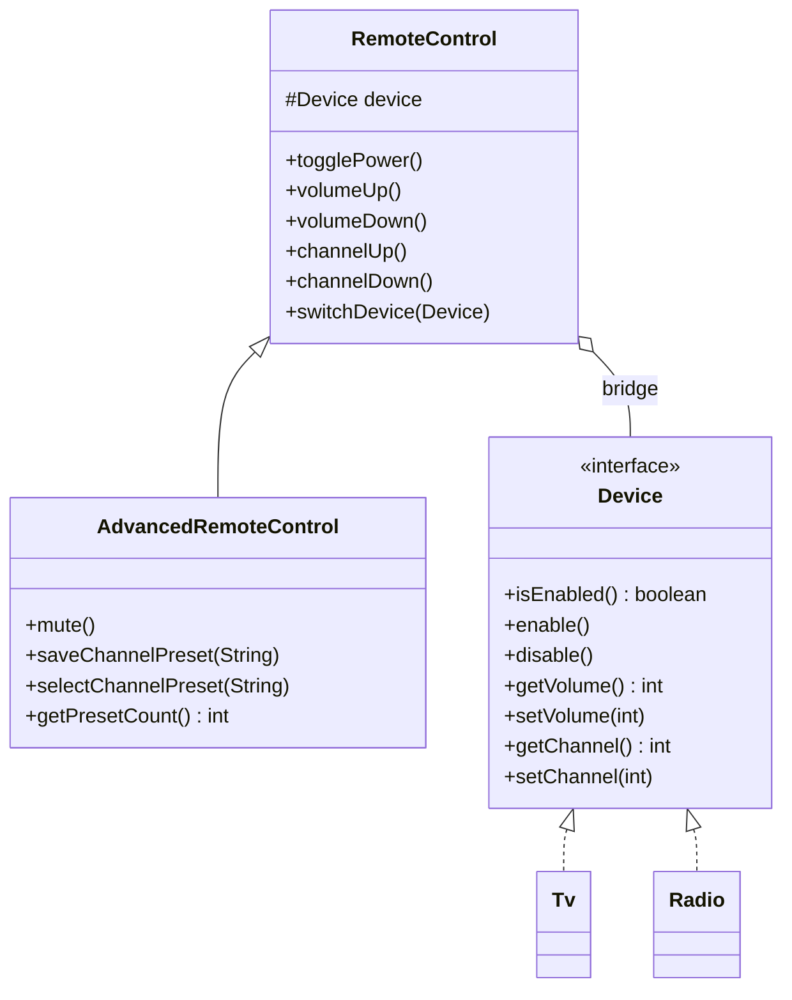
```mermaid
classDiagram
    class RemoteControl {
        #Device device
        +togglePower()
        +volumeUp()
        +volumeDown()
        +channelUp()
        +channelDown()
        +switchDevice(Device)
    }
    class AdvancedRemoteControl {
        +mute()
        +saveChannelPreset(String)
        +selectChannelPreset(String)
        +getPresetCount() int
    }
    class Device {
        <<interface>>
        +isEnabled() boolean
        +enable()
        +disable()
        +getVolume() int
        +setVolume(int)
        +getChannel() int
        +setChannel(int)
    }
    class Tv
    class Radio
    RemoteControl <|-- AdvancedRemoteControl
    RemoteControl o-- Device : bridge
    Device <|.. Tv
    Device <|.. Radio
```

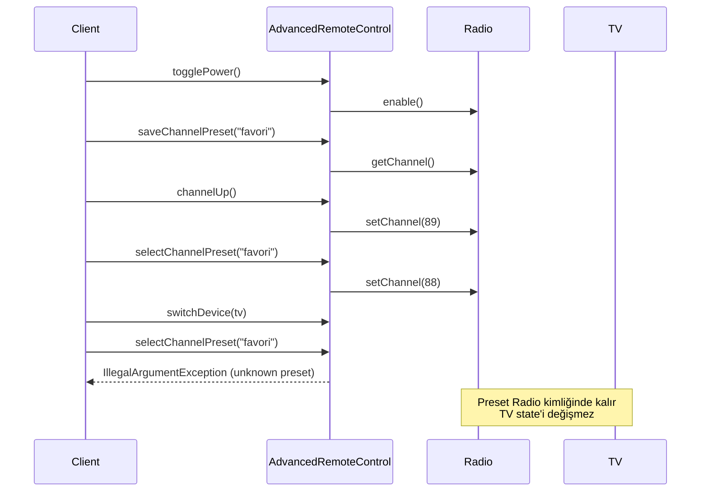
```mermaid
sequenceDiagram
    participant Client
    participant Remote as AdvancedRemoteControl
    participant Radio
    participant TV
    Client->>Remote: togglePower()
    Remote->>Radio: enable()
    Client->>Remote: saveChannelPreset("favori")
    Remote->>Radio: getChannel()
    Client->>Remote: channelUp()
    Remote->>Radio: setChannel(89)
    Client->>Remote: selectChannelPreset("favori")
    Remote->>Radio: setChannel(88)
    Client->>Remote: switchDevice(tv)
    Client->>Remote: selectChannelPreset("favori")
    Remote-->>Client: IllegalArgumentException (unknown preset)
    Note over Radio,TV: Preset Radio kimliğinde kalır<br/>TV state'i değişmez
```

### Kodun execution trace'i

#### `RemoteControl + Tv`

1. TV kapalı, volume `30`, channel `1` başlar.
2. `togglePower` TV'yi açar.
3. `volumeUp` önce `30` okur, sonra `40` yazar.
4. `channelUp` kanalı `2` yapar.

#### `AdvancedRemoteControl + Radio`

1. Radio kapalı, volume `20`, frequency `88` başlar.
2. Güç açılır ve ses `30` yapılır.
3. `"favori"` preset'i o andaki `88` değerini Radio kimliğine ait alanda saklar.
4. Frekans değiştirilip preset seçildiğinde ortak `setChannel` ile `88` geri yüklenir.
5. `mute`, ortak `Device#setVolume` üzerinden sesi `0` yapar.
6. `switchDevice(tv)` yalnız referansı değiştirir; Radio state'i ve preset'leri
   taşınmaz.
7. Sonraki komut TV üzerinde çalışır.

State implementation'a, kullanım dili abstraction'a aittir.

### Test kontratları neyi öğretiyor?

`BridgePatternDemoTest` dört `@Nested` hikâye kullanır.

#### `BasicRemoteOperations`

- Güç, ses ve kanal yönetimini,
- iki toggle sonrası yalnız power değişimini,
- exact TV status çıktısını doğrular.

#### `AdvancedRemoteOperations`

- `mute` davranışının Radio implementasyonunda da çalıştığını,
- preset workflow'unun concrete tipe bakmadan mevcut cihazda kanal kaydedip seçtiğini,
- Radio preset'inin TV'ye ve bir TV preset'inin başka TV instance'ına sızmadığını,
- boş ve bilinmeyen preset adlarının reddedildiğini,
- power ve channel state'inin korunmasını gösterir.

#### `RuntimeDeviceSwitching`

- Sonraki komutların yeni implementation'a gittiğini,
- eski cihaz state'inin değişmeden kaldığını doğrular.

#### `DeviceBoundaryContracts`

- Mevcut TV volume `0..100` clamp,
- TV channel minimum `1`,
- Radio frequency `80..108`,
- null implementor'ın constructor ve switch sınırında reddedilmesini görünür yapar.

Arrange graph'ı, Act abstraction çağrısını, Assert implementation state'ini göstererek köprüyü test dilinde de görünür kılar.

### Edge case, güvenlik, concurrency ve performans

#### Null bağımlılık

Constructor ve `switchDevice`, null implementor'ı `Objects.requireNonNull` ile
komut çalışmadan reddeder. Bu fail-fast davranış hedefin nerede kaybolduğunu açık
tutar; gerçek sistemde bağlantısı kopmuş ama null olmayan cihaz için ayrıca
ulaşılabilirlik sonucu gerekir.

#### Cihaz sınırları

TV ve Radio volume değerini `0..100` aralığına sıkıştırır. TV channel minimum `1`,
Radio frequency `80..108` uygular. Ancak aynı `int channel` alanının TV'de kanal,
Radio'da frekans anlamına gelmesi bilinçli bir eğitim sadeleştirmesidir. Bu nedenle
repo preset'leri `Device` kimliğine scope eder ve implementor'lar arasında taşımaz.
Gerçek domain yine de birim, adım ve capability'leri ayrı tiplerle modellemelidir.

#### Güvenlik

Gerçek uzaktan kontrol; cihaz authorization, komut bütünlüğü, replay koruması ve hassas state loglama politikası ister. Bridge bunları sağlamaz, yalnız uygulanacak sınırı ayırır.

#### Concurrency

`RemoteControl.device`, preset map'leri ve cihaz state'leri mutable ve senkronize
değildir. Bir thread cihaz değiştirirken diğeri komut verirse hedef belirsizleşebilir.
Identity map ayrıca bağlı cihazlara güçlü referans tuttuğu için uzun ömürlü
production kumandasında lifecycle/temizleme politikası gerekir. UI thread
confinement, lock veya actor/command queue politikası uygulama katmanında açıkça
seçilmelidir.

#### Performans

Interface delegation maliyeti çoğu sistemde önemsizdir; gerçek maliyet I/O'dadır. Bridge mikro optimizasyon değil değişim izolasyonu kararıdır.

### Ne zaman kullan?

- İki bağımsız boyut kombinasyon halinde büyüyorsa.
- Platform ayrıntısını üst seviye iş dilinden ayırmak istiyorsan.
- Implementation runtime'da seçilecek/değiştirilecekse.
- Hiyerarşileri farklı ekip veya release döngüsü geliştirecekse.

### Ne zaman kullanma?

- Tek implementation var ve ikinci eksen beklenmiyorsa.
- Basit delegation için iki hiyerarşi okumayı zorlaştırıyorsa.
- İhtiyaç yalnız algoritma seçmekse Strategy daha açık olabilir.
- Amaç yalnız mevcut uyumsuz API'yi çevirmekse Adapter uygundur.

### Artılar ve bedeller

#### Artılar

- Kombinasyon sınıfı patlamasını önler.
- Abstraction ve platform sorumluluklarını ayırır.
- Yeni cihaz/kumanda türlerini bağımsız genişletir.
- Fake Implementation ile test etmeyi kolaylaştırır.

#### Bedeller

- Daha çok type ve wiring.
- Doğru ortak kontratı bulma zorluğu.
- Mutable köprü için lifecycle/concurrency kararı.
- Fazla genel interface'in “god interface” olma riski.

### Karışan desenlerle karşılaştırma

| Desen | Ana fark |
|---|---|
| Adapter | Var olan uyumsuz iki API'yi konuşturur |
| Strategy | Tek context'teki değiştirilebilir algoritmayı hedefler |
| Decorator | Aynı nesneye katman katman sorumluluk ekler |
| Facade | Alt sisteme sade tek yüz sunar |
| Proxy | Subject'e erişimi cache/security/lifecycle için yönetir |

Bridge çoğu zaman iki eksen baştan görülünce kurulur; Adapter mevcut uyumsuzluk ortaya çıkınca eklenebilir. Bu tarihsel ayrım zorunlu değil, faydalı sezgidir.

### Yaygın hatalar

1. `Device` içine concrete cihaza özel bütün metotları doldurmak.
2. Abstraction'da `instanceof Tv` dalları açmak.
3. State'i kumandaya kopyalayıp iki source of truth yaratmak.
4. Device switch sırasında state'in otomatik taşınacağını sanmak.
5. Bridge'i yalnız dependency injection'ın yeni adı saymak.
6. Null ve concurrency politikasını belirsiz bırakmak.

### Üç kademeli alıştırma

#### Seviye 1 — Isınma

Gelişmiş kumandayla TV'yi aç, sesi iki kez artır, mute et ve exact state'i test et.

#### Seviye 2 — Yeni implementor

`SmartSpeaker` adlı `Device` ekle. Kumandalara dokunmadan çalıştır; speaker için channel kontratının doğal olup olmadığını tartış.

#### Seviye 3 — Capability tasarımı

`Device`ı `PowerControl`, `VolumeControl`, `ChannelControl` capability'lerine ayır. Kumandaların ihtiyaçlarını composition/generic seçenekleriyle modelle ve trade-off'u testlerle anlat.

### Son hafıza cümlesi

> **Bridge, iki değişim eksenini kalıtımla çarpmak yerine kompozisyonla bağlar.**


<!-- generated-chapter:08 slug:composite source:src/main/java/com/can/structural/composite/explain/composite.md -->
<div class="chapter-break"></div>

<h2 id="chapter-composite">Composite Pattern — Tek Bir Parça ile Bütün Ağacı Aynı Dilde Kullanmak</h2>

> Sipariş ağacı temel Composite'i korurken parasal doğruluk, açık snapshot API'si ve cycle invariant'larıyla gerçek kullanıma bir adım yaklaştırılmıştır.

### 30 saniyelik kart

| Soru | Kısa cevap |
|---|---|
| Niyet | Tek nesne ile nesne grubunu ortak bir kontrattan kullanmak |
| Değişen eksen | Ağacın derinliği ve leaf/composite çeşitleri |
| Ana araç | Ortak Component, polimorfizm ve özyinelemeli delegasyon |
| Korunan şey | Client düğümün Product mı Box mı olduğunu bilmez |
| Bedel | Ağaç bütünlüğü, cycle, sahiplik ve ortak API kararları |
| Repo cümlesi | `getPriceAmount()` hem üründe hem iç içe kutuda exact para toplamıdır |

**Hafıza kancası:** Composite, “bir yaprağa ne soruyorsan dala da onu sor” der.

### Örnek haritası: temel → güçlendirilmiş → production

| Katman | Repodaki karşılığı | Öğrettiği şey |
|---|---|---|
| Temel örnek | `OrderComponent`, `Product`, `Box` | Leaf ve Composite'e aynı `getPrice()` / `getName()` sorusunu sormak |
| Güçlendirilmiş örnek | `BigDecimal getPriceAmount()`, cycle kontrolü, `getChildrenSnapshot()` | Parasal toplamı exact tutmak, invariant'ları korumak ve eski canlı görünümden açık snapshot'ı ayırmak |
| Bilinçli production sınırı | Çoklu parent ve aynı child'ın tekrarı hâlâ domain kararıdır | Ownership, kalıcılık, maksimum derinlik ve eşzamanlı mutation uygulamaya göre ayrıca çözülür |

### Akılda kalıcı analoji: klasör ve dosya

Dosyanın boyutu kendi boyutudur. Klasörün boyutuysa içindeki dosya ve alt klasörlerin toplamıdır.

Kullanıcı iki durumda da “boyut nedir?” diye sorar. Klasör, soruyu çocuklarına iletir ve cevapları toplar. Composite'in gücü, istemcinin ağacı açıp her concrete tipe göre dallanmak zorunda kalmamasıdır.

Bu repoda dosyanın karşılığı `Product`, klasörün karşılığı `Box`, ortak soruysa `getPrice()`dır.

### Pattern olmadan problem

Bir siparişte ürünler, kutular ve kutu içinde kutular olabilir. Ortak kontrat yoksa client şuna dönüşür:

```java
if (item instanceof Product product) {
    total += product.getPrice();
} else if (item instanceof Box box) {
    for (Object child : box.getItems()) {
        // aynı ayrım her seviyede tekrar
    }
}
```

Sorunlar:

- Client bütün concrete tipleri bilir.
- Her yeni düğüm tipi yeni `instanceof` dalları üretir.
- Recursion farklı yerlerde kopyalanır.
- Paketleme maliyetinin hangi seviyede eklendiği belirsizleşir.
- Aynı ağaç üzerinde yeni operasyonlar yazmak zorlaşır.

Doğal ağaç örnekleri yalnız dosya sistemi değildir: organizasyon şeması, UI component ağacı, menü, yorum zinciri, ürün paketi ve ifade ağacı da aynı probleme sahiptir.

### Çözüm ve çözümün sınırı

Tüm düğümler ortak `OrderComponent` arayüzünü uygular:

```java
public interface OrderComponent {
    double getPrice();
    default BigDecimal getPriceAmount() { ... }
    String getName();
}
```

`Product` bir **Leaf**tir; alt elemanı yoktur ve kendi fiyatını döndürür.

`Box` bir **Composite**tir; `List<OrderComponent>` tutar:

```java
public BigDecimal getPriceAmount() {
    BigDecimal total = packagingCost;
    for (OrderComponent child : children) {
        total = total.add(child.getPriceAmount());
    }
    return total;
}
```

Bir child başka `Box` ise aynı çağrı tekrar çalışır. Recursion, explicit type kontrolünden değil polimorfik delegasyondan doğar.

Bu çözümün sınırı:

- Ortak operasyonlar uniformdur; çocuk yönetimi uniform değildir.
- `add/remove` yalnız `Box` üzerindedir. Bu, “safe composite” yaklaşımıdır.
- Ortak interface'e `add/remove` koymak daha şeffaf ama Leaf için anlamsız olabilir.
- `Box.add`, self-cycle ve dolaylı ancestor cycle'ını reddeder.
- Aynı child'ın tekrar eklenmesi veya iki parent tarafından paylaşılması özellikle
  yasaklanmamıştır; bunun ağaç mı DAG mı olduğu domain kararıdır.

### Repodaki roller

| Pattern rolü | Tip | Sorumluluk |
|---|---|---|
| Client | `CompositePatternDemo` | Sipariş ağacını kurup kökten fiyat ister |
| Component | `OrderComponent` | Geriye uyumlu `getPrice()`, exact `getPriceAmount()` ve `getName()` kontratı |
| Leaf | `Product` | `BigDecimal` fiyatını ve adını döndürür |
| Composite | `Box` | Çocukları yönetir, exact fiyatları ve packaging cost'u toplar |

Geriye uyumluluk için `getChildren()` dışarıdan değiştirilemeyen **canlı görünüm**
vermeye devam eder; `Box` değişince daha önce alınan görünüm de yeni içeriği gösterir.
Zamanda sabit bir sonuç isteyen client açıkça `getChildrenSnapshot()` çağırır; bu
metot `List.copyOf` ile değiştirilemeyen ve sonraki mutation'lardan etkilenmeyen
bir kopya verir.

### Yapı diyagramı

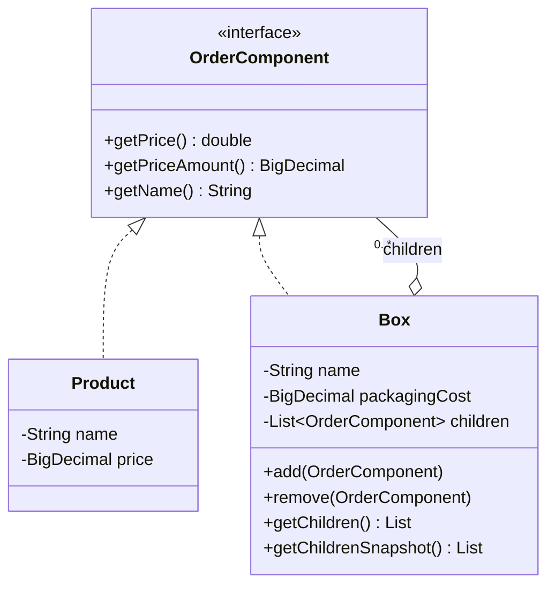
```mermaid
classDiagram
    class OrderComponent {
        <<interface>>
        +getPrice() double
        +getPriceAmount() BigDecimal
        +getName() String
    }
    class Product {
        -String name
        -BigDecimal price
    }
    class Box {
        -String name
        -BigDecimal packagingCost
        -List~OrderComponent~ children
        +add(OrderComponent)
        +remove(OrderComponent)
        +getChildren() List
        +getChildrenSnapshot() List
    }
    OrderComponent <|.. Product
    OrderComponent <|.. Box
    Box o-- "0..*" OrderComponent : children
```

Demo nesne ağacı:

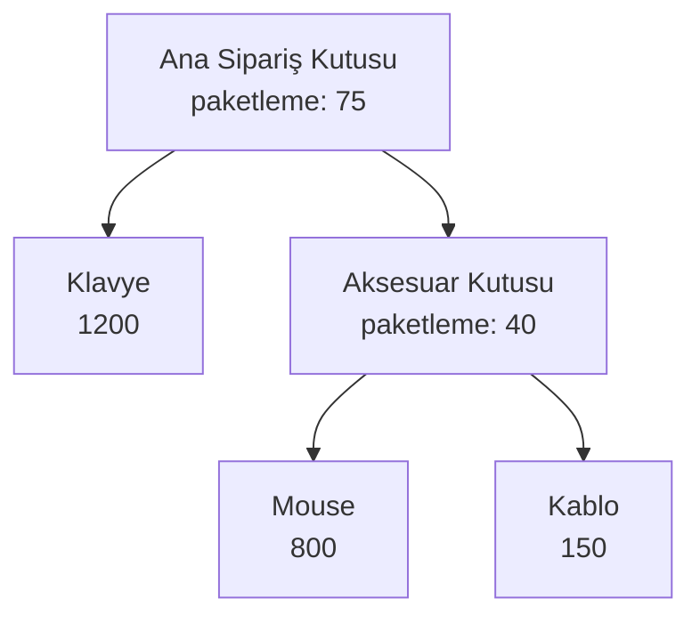
```mermaid
flowchart TD
    M["Ana Sipariş Kutusu<br/>paketleme: 75"]
    K["Klavye<br/>1200"]
    A["Aksesuar Kutusu<br/>paketleme: 40"]
    F["Mouse<br/>800"]
    C["Kablo<br/>150"]
    M --> K
    M --> A
    A --> F
    A --> C
```

### Kodun execution trace'i

`mainOrderBox.getPriceAmount()` çağrısında:

1. Ana kutu total'i kendi `75` paketleme maliyetiyle başlatır.
2. Klavye `1200` döndürür; ara toplam `1275` olur.
3. Aksesuar kutusuna aynı `getPrice()` çağrısı yapılır.
4. Aksesuar kutusu `40 + 800 + 150 = 990` döndürür.
5. Kök kutu `1275 + 990 = 2265` sonucuna ulaşır.

Client tek bir kök çağrısı yapar. Ağacın dolaşım bilgisi Composite içinde kalır.

### Test kontratları neyi öğretiyor?

`CompositePatternDemoTest` dört `@Nested` hikâyeden oluşur.

#### `LeafAndEmptyComposite`

- `Product` değerlerini Component kontratından sunar.
- Çocuksuz `Box` yalnız kendi packaging cost'unu döndürür.

#### `RecursivePriceAggregation`

- Product ve Box düğümlerinin iç içe toplamını exact değerle doğrular.
- Her kutu maliyetinin yalnız kendi seviyesinde bir kez eklendiğini gösterir.

#### `ChildManagement`

- Child çıkarılınca toplamın yeniden hesaplandığını gösterir.
- `getChildren()` canlı görünümünün dışarıdan değiştirilemediğini ve eski semantiği
  koruduğunu,
- `getChildrenSnapshot()` sonucunun sonraki `Box` mutation'larından etkilenmediğini
  doğrular.

#### `ProductionInvariants`

- `0.10 + 0.20` parasal toplamının `BigDecimal("0.30")` olduğunu,
- doğrudan ve dolaylı cycle'ın yazma anında reddedildiğini,
- negatif maliyet, boş ad ve null child'ın graph'a giremediğini sabitler.

Arrange–Act–Assert ayrımı, ağacı kurma ile kökten operasyon istemeyi birbirinden görünür biçimde ayırır.

### Edge case, güvenlik, concurrency ve performans

#### Tree bütünlüğü

`Box.add` null child'ı, self-cycle'ı ve child ağacının zaten parent'ı içerdiği
dolaylı cycle'ı reddeder. Böylece repo API'siyle oluşturulan graph'ta
`getPriceAmount()` sonsuz recursion'a girmez.

İki karar bilerek açık bırakılmıştır:

- Aynı child aynı parent'a iki kez eklenirse iki adet/iki satır gibi sayılır.
- Aynı nesne iki farklı parent altında paylaşılabilir ve iki toplamda da yer alır.

Gerçek siparişte quantity ayrı alan mı olacak, node tek parent mı taşıyacak sorusu
domain uzmanıyla kararlaştırılmalı; pattern kendi başına cevap vermez.

#### Para doğruluğu

`Product` ve `Box` parayı `BigDecimal` saklar; recursive toplam da
`getPriceAmount()` üzerinden exact ilerler. Eski öğrenme API'sini bozmamak için
`double getPrice()` korunur ve yalnız uyumluluk görünümüdür. Para hesabı yapan yeni
kod exact metodu kullanmalıdır.

Negatif maliyet ve boş ad constructor sınırında reddedilir. Production'da para
birimi, scale ve rounding policy için `Money(amount, currency)` gibi daha zengin
bir value object tercih edilmelidir.

#### Null ve güvenlik

Null child ve blank isim graph kurulurken reddedilir. Buna rağmen kullanıcıdan
gelen sınırsız derinlikte ağaç, stack ve CPU tüketimiyle denial-of-service riski
oluşturabilir; maksimum depth/node sayısı bu küçük modelde yoktur.

#### Concurrency

`ArrayList` thread-safe değildir. Bir thread fiyat hesaplarken diğeri child ekler/çıkarırsa tutarsız sonuç veya `ConcurrentModificationException` oluşabilir. Immutable tree, snapshot veya kilit politikası seçilmelidir.

#### Performans

Her `getPrice()` çağrısı erişilen düğüm sayısı kadar, yaklaşık `O(n)` çalışır. Çok derin ağaç stack'i tüketir. Cache eklenecekse her mutation'da invalidation zorunludur; aksi halde hızlı ama yanlış sonuç alınır.

### Ne zaman kullan?

- Model doğal olarak parent–child ağacıysa.
- Leaf ve composite aynı operasyonlarla kullanılacaksa.
- Client recursive yapının concrete tiplerini bilmemeliyse.
- UI, dosya, organizasyon, paket veya ifade ağacı modelleniyorsa.

### Ne zaman kullanma?

- Yapı aslında düz bir koleksiyonsa.
- Leaf ve grup neredeyse hiç ortak davranış paylaşmıyorsa.
- Ağ üzerinde güçlü ilişki sorguları gerekiyorsa graph modeli daha uygun olabilir.
- Cycle ve çoklu parent temel domain davranışıysa “tree” varsayımı yanıltıcı olabilir.

### Artılar ve bedeller

#### Artılar

- Tek nesne ve nesne grubuna uniform erişim.
- Client'ta type-check zincirlerini kaldırma.
- Yeni Leaf/Composite türlerini kolay ekleme.
- Recursive davranışı verinin doğal yapısına yakın tutma.

#### Bedeller

- Çok genel Component kontratı anlamsız metotlara yol açabilir.
- Cycle, ownership ve mutation politikası ayrıca gerekir.
- Derin recursion ve tekrar hesaplama maliyetlidir.
- Ağaç debug etmek düz koleksiyondan daha zordur.

### Karışan desenlerle karşılaştırma

| Desen | Composite'ten farkı |
|---|---|
| Decorator | Genellikle tek child sarar ve davranış ekler; Composite çok child ile ağaç kurar |
| Iterator | Ağacın dolaşım yöntemini dışarı çıkarır; Composite yapıyı kurar |
| Visitor | Yeni operasyonları düğümleri değiştirmeden ekler |
| Chain of Responsibility | Bir istek zincirde ilerler; bütün çocuk sonuçları toplanmak zorunda değildir |
| Facade | Alt sistemi sadeleştirir, recursive parça-bütün hiyerarşisi kurmaz |

Composite ve Decorator benzer arayüzlerle sarma yapabilir. Ayırıcı soru şudur: **Amaç parça-bütün ağacı mı, davranış katmanı mı?**

### Yaygın hatalar

1. Cycle kontrolü olmadan her düğümü her yere eklemek.
2. Para için kontrolsüz `double` kullanmak.
3. Leaf'e anlamsız child metotları zorlamak.
4. `getChildren()` görünümünü mutable sızdırmak veya canlı görünüm ile snapshot'ı
   isimlendirmeden birbirine karıştırmak.
5. Çok derin kullanıcı girdisini sınırsız recursive işlemek.
6. Aynı node'un çoklu parent semantiğini belirsiz bırakmak.

### Üç kademeli alıştırma

#### Seviye 1 — Isınma

Üç katmanlı bir kutu ağacı kur. Her seviyeye farklı packaging cost ver ve toplamı önce elle, sonra testle hesapla.

#### Seviye 2 — Yeni operasyon

`getItemCount()` davranışını Product için `1`, Box için çocuk toplamı olacak biçimde ekle. Component interface'inin neden değiştiğini tartış.

#### Seviye 3 — Production invariant

Mevcut DFS cycle kontrolünü genişlet: aynı child'ın iki parent altında bulunup
bulunamayacağını domain kararı yap. Tek sahiplik seçersen parent bilgisini veya
ayrı bir aggregate builder'ı ekle ve duplicate/multi-parent testlerini yaz.

### Son hafıza cümlesi

> **Composite, yaprakla dalı aynı cümlede konuşturur; dal cevabı çocuklarından toplar.**


<!-- generated-chapter:09 slug:decorator source:src/main/java/com/can/structural/decorator/explain/decorator.md -->
<div class="chapter-break"></div>

<h2 id="chapter-decorator">Decorator Pattern — Davranışı Katman Katman Giydirmek</h2>

> Bu örnek gerçek kanal entegrasyonu yapmaz; gönderimleri açıklayıcı String çıktılarıyla simüle eder.

### 30 saniyelik kart

| Soru | Kısa cevap |
|---|---|
| Niyet | Bir nesneye aynı arayüzü koruyarak çalışma anında sorumluluk eklemek |
| Değişen eksen | Bildirim kanalı kombinasyonu ve katman sırası |
| Ana araç | Component'i yine Component olan bir nesneyle sarmak |
| Korunan şey | Client yalnız `Notifier` kontratını görür |
| Bedel | Nesne zinciri, sıra/failure semantiği ve wiring karmaşıklığı |
| Repo cümlesi | Email çıktısı SMS/Slack ile genişler, `PriorityDecorator` mesajı bütün iç kanallardan önce dönüştürür |

**Hafıza kancası:** Decorator nesneyi değiştirmez; üzerine çıkarılabilir görünen davranış katmanları giydirir.

### Örnek haritası: temel → güçlendirilmiş → production

| Katman | Repodaki karşılığı | Öğrettiği şey |
|---|---|---|
| Temel örnek | `EmailNotifier` + `SmsDecorator` / `SlackDecorator` / `FacebookDecorator` | Aynı `Notifier` kontratıyla çıktıyı içten dışa genişletmek |
| Güçlendirilmiş örnek | En dıştaki `PriorityDecorator` | Decorator'ın yalnız sonuç eklemekle kalmayıp isteği bütün iç katmanlara gitmeden dönüştürebilmesi |
| Bilinçli production sınırı | `String` sonuçlu, side-effect'siz kanal simülasyonu | Retry, idempotency, kısmi başarı, PII masking ve gerçek SDK lifecycle'ı ayrıca tasarlanır |

### Akılda kalıcı analoji: kat kat giyinmek

Bir tişörtün üzerine kazak, onun üzerine yağmurluk giyebilirsin.

- Altta hâlâ aynı kişisin.
- Her katman ayrı bir özellik ekler.
- Katmanların sırası sonucu etkileyebilir.
- Her kombinasyon için yeni bir “insan türü” oluşturmazsın.

Decorator da tek bir component'i başka component'lerle sarar. Kalıtımdaki her kombinasyon için subclass üretme problemini, küçük ve birleştirilebilir nesnelere dönüştürür.

Bu analojinin sınırı: repodaki wrapper alanları `final`dır. Kurulmuş bir stack'ten ortadaki katmanı gerçekten “çıkaran” API yoktur; yeni bir stack kurulur.

### Pattern olmadan problem

Başlangıçta yalnız Email bildirimi vardır. Sonra SMS, Slack ve Facebook gelir.

Kalıtımla kombinasyon çözülürse:

```text
EmailNotifier
EmailSmsNotifier
EmailSlackNotifier
EmailSmsSlackNotifier
EmailFacebookNotifier
...
```

Her yeni kanal kombinasyon sayısını büyütür. Ayrıca:

- Aynı kanal kodu birçok subclass'ta tekrar eder.
- Sıra değişimi yeni sınıf gerektirir.
- Client concrete kombinasyon adlarını bilir.
- Bir özelliğin bağımsız testi zorlaşır.

Tek sınıftaki `smsEnabled/slackEnabled/facebookEnabled` bayraklarıysa bütün kanal bağımlılıklarını ve hata politikalarını aynı yerde toplar.

### Çözüm ve çözümün sınırı

Önce ortak Component tanımlanır:

```java
public interface Notifier {
    String send(String message);
}
```

`EmailNotifier` temel davranıştır. `BaseNotifierDecorator` aynı interface'i uygular ve başka bir `Notifier` tutar:

```java
public abstract class BaseNotifierDecorator implements Notifier {
    protected final Notifier wrappee;

    public String send(String message) {
        return wrappee.send(message);
    }
}
```

Concrete decorator önce iç katmana delege eder, sonra kendi sonucunu ekler:

```java
return super.send(message)
    + System.lineSeparator()
    + "Slack -> " + channel + " | mesaj=" + message;
```

Bu yüzden:

```text
new SlackDecorator(new SmsDecorator(new EmailNotifier(...), ...), ...)
```

çıktıyı `Email → SMS → Slack` sırasıyla üretir.

`PriorityDecorator` ise farklı bir decorator tekniğini gösterir: mesajı önce
`"[P1] ..."` biçimine dönüştürür, sonra wrappee'ye yollar. En dışa konduğunda Email,
SMS ve Slack'in tamamı aynı zenginleştirilmiş mesajı görür. İçeri konursa yalnız
ondan daha içteki katmanlar prefix'i görür; dolayısıyla sıra yalnız çıktı sırası
değil **girdi semantiği** açısından da kontrattır.

Sınırlar:

- Decorator her kombinasyon için subclass ihtiyacını kaldırır; bütün subclass ihtiyacını değil.
- Aynı interface korunur ama identity/type kontrolü karmaşıklaşır.
- Failure ve transaction davranışı otomatik çözülmez.
- Katman sırası observable ise artık kontratın parçasıdır.

### Repodaki roller

| Pattern rolü | Tip | Sorumluluk |
|---|---|---|
| Client | `DecoratorPatternDemo` | İstenen stack'leri composition ile kurar |
| Component | `Notifier` | Bütün bildirimlerin `send` kontratı |
| Concrete Component | `EmailNotifier` | Temel Email çıktısını üretir |
| Base Decorator | `BaseNotifierDecorator` | Aynı kontratı korur ve wrappee'ye delege eder |
| Concrete Decorator | `SmsDecorator` | SMS satırı ekler |
| Concrete Decorator | `SlackDecorator` | Slack satırı ekler |
| Concrete Decorator | `FacebookDecorator` | Facebook satırı ekler |
| Transforming Decorator | `PriorityDecorator` | Mesajı inner stack'e göndermeden önce priority prefix'iyle zenginleştirir |

`EmailNotifier`, constructor'a verilen recipient listesini doğrulayıp
`Stream#toList` ile immutable bir kopyaya dönüştürür. Böylece client daha sonra
özgün listeyi değiştirse de notifier'ın iç state'i değişmez. `Notifier.requireText`
mesaj ve hedeflerin blank olmasını tek kuralla engeller.

### Yapı diyagramı

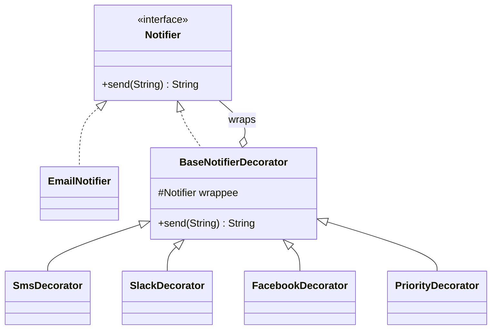
```mermaid
classDiagram
    class Notifier {
        <<interface>>
        +send(String) String
    }
    class EmailNotifier
    class BaseNotifierDecorator {
        #Notifier wrappee
        +send(String) String
    }
    class SmsDecorator
    class SlackDecorator
    class FacebookDecorator
    class PriorityDecorator

    Notifier <|.. EmailNotifier
    Notifier <|.. BaseNotifierDecorator
    BaseNotifierDecorator <|-- SmsDecorator
    BaseNotifierDecorator <|-- SlackDecorator
    BaseNotifierDecorator <|-- FacebookDecorator
    BaseNotifierDecorator <|-- PriorityDecorator
    BaseNotifierDecorator o-- Notifier : wraps
```

İlk demo stack'inin gerçek yönü:

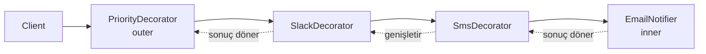
```mermaid
flowchart LR
    Client --> Priority["PriorityDecorator<br/>outer"]
    Priority --> Slack
    Slack["SlackDecorator"] --> Sms["SmsDecorator"]
    Sms --> Email["EmailNotifier<br/>inner"]
    Email -. sonuç döner .-> Sms
    Sms -. genişletir .-> Slack
    Slack -. sonuç döner .-> Priority
```

### Kodun execution trace'i

`notifier.send("Alarm")` çağrısında:

1. En dıştaki `PriorityDecorator`, mesajı `"[P1] Alarm"` yapar.
2. Priority, `SlackDecorator.send` çağrısına delege eder.
3. Slack önce `super.send` ile `SmsDecorator`a gider.
4. SMS önce `EmailNotifier`a gider.
5. Email temel satırı döndürür.
6. SMS kendi satırını sonuna ekler.
7. Slack kendi satırını en sona ekler.
8. Priority değiştirilmiş stack sonucunu client'a döndürür.

Gerçek side-effect kullanan production notifier'da da içten dışa çağrı sırası aynı olabilir. İç katman exception atarsa mevcut tasarımda dış katman çalışmaz. “Bir kanal başarısız olsa da diğerleri devam etsin” isteniyorsa açık bir orchestration/failure policy gerekir.

### Test kontratları neyi öğretiyor?

`DecoratorPatternDemoTest` üç ana `@Nested` hikâye kullanır.

#### `BaseNotification`

- Email çıktısını exact metinle doğrular.
- Recipient listesinin savunmacı kopyalandığını gösterir.

#### `DecoratorStack`

- Email, SMS ve Slack satırlarının exact içten-dışa sırasını sınar.
- Aynı `Notifier` kontratıyla Email + Facebook alternatifini doğrular.
- Dıştaki `PriorityDecorator`ın hem Email hem Slack'e aynı prefixed mesajı taşıdığını gösterir.
- `contains` yerine exact assertion kullanarak eksik, fazla veya yinelenen satırı yakalar.

#### `NotificationBoundaries`

- Null wrappee,
- boş kanal/recipient koleksiyonu,
- blank mesaj gibi graph ve çağrı hatalarının zincirin başında reddedildiğini doğrular.

Arrange kısmında graph kurulur, Act yalnız tek `send` çağrısıdır, Assert ise bütün stack'in observable kontratını kontrol eder.

### Edge case, güvenlik, concurrency ve performans

#### Null ve input kontratı

`BaseNotifierDecorator` null wrappee'yi reddeder. Email en az bir geçerli recipient,
concrete decorator'lar geçerli hedef, bütün katmanlar blank olmayan mesaj ister.
Metinler trim edilir; priority upper-case dönüşümü locale sürprizi yaşamamak için
`Locale.ROOT` kullanır. Buna rağmen email/telefon formatı yalnız non-blank
seviyesinde doğrulanır; gerçek syntax ve sahiplik doğrulaması adapter/kanal sınırına
aittir.

#### Güvenlik ve gizlilik

Email adresi, telefon ve mesaj içeriğini düz log metnine yazmak PII veya secret sızdırabilir. Gerçek entegrasyonda masking, structured logging, erişim kontrolü ve retention politikası gerekir.

#### Failure semantiği

Bir kanal hata verdiğinde devam, yalnız başarısız kanalı retry, duplicate gönderim ve kısmi başarı modeli açıkça kararlaştırılmalıdır. Decorator bu kararları tek başına çözmez.

#### Concurrency

Mevcut decorator nesneleri yalnız immutable String alanları okur ve state değiştirmez; bu örnekte paylaşım basittir. Gerçek SDK/client thread-safe değilse wrapper onu kendiliğinden güvenli yapmaz.

#### Performans

Her katman yeni String birleştirir; kısa demo için önemsizdir. Büyük payload ve çok katmanda allocation artar. Gerçek network kanallarında ana maliyet delegasyon değil I/O ve retry'dır.

### Ne zaman kullan?

- Davranış kombinasyonları çalışma anında değişiyorsa.
- Her kombinasyon için subclass açmak patlamaya yol açıyorsa.
- Sorumlulukları küçük, tek amaçlı katmanlara ayırmak istiyorsan.
- Logging, compression, encryption veya bildirim kanalı gibi zincirlenebilir işler varsa.

### Ne zaman kullanma?

- Katman sırası ve graph kurulumu iş kuralını anlaşılmaz yapıyorsa.
- Bütün kombinasyonlar sabit ve çok azsa basit composition yeterli olabilir.
- Concrete component tipine sık sık erişmek gerekiyorsa.
- Birden çok bağımsız side-effect için orchestration sonucu/transaction modeli gerekiyorsa.

### Artılar ve bedeller

#### Artılar

- Her kombinasyon için subclass ihtiyacını kaldırır.
- Sorumluluklar bağımsız test edilir.
- Client aynı interface'i kullanır.
- SRP ve Open/Closed yönünde genişlemeyi destekler.

#### Bedeller

- Çok sayıda küçük nesne ve wiring oluşur.
- Katman sırası ve exception davranışı kritikleşir.
- Ortadaki katmanı bulmak/çıkarmak kolay değildir.
- Aynı decorator'ın yanlışlıkla iki kez eklenmesi mümkün olabilir.

### Karışan desenlerle karşılaştırma

| Desen | Decorator'dan farkı |
|---|---|
| Adapter | Arayüzü çevirir; davranış katmanı eklemek ana niyet değildir |
| Proxy | Aynı arayüzle erişim, cache, security veya lifecycle kontrol eder |
| Composite | Çok child ile parça-bütün ağacı kurar |
| Chain of Responsibility | İstek bir sonraki handler'a geçebilir veya durabilir; hepsi aynı component'i sarmak zorunda değildir |
| Facade | Alt sisteme daha sade, çoğu zaman farklı bir yüz sunar |

Proxy ile Decorator'ın sınıf diyagramı çok benzeyebilir. Ayırıcı soru: **Nesneye sorumluluk mu ekliyorum, erişimi mi yönetiyorum?**

### Yaygın hatalar

1. Her decorator'da wrappee çağrısını unutmak veya iki kez çağırmak.
2. Katman sırasını önemsiz sanmak.
3. “Runtime” kelimesini mevcut graph'ın yerinde sökülüp takılması sanmak.
4. Hata alan bir kanalın diğer kanallara etkisini tanımlamamak.
5. Concrete decorator tiplerine client'ı bağımlı etmek.
6. PII içeriğini kontrolsüz loglamak.

### Üç kademeli alıştırma

#### Seviye 1 — Isınma

Email → Facebook → Slack stack'i kur. Exact çıktı sırasını test et ve constructor nesting sırasıyla çıktı sırası arasındaki ilişkiyi açıkla.

#### Seviye 2 — Yeni decorator

Mesajın başına timestamp ekleyen `TimestampDecorator` yaz. Zamanı test edebilmek için `Clock` bağımlılığı kullan.

#### Seviye 3 — Production failure modeli

String yerine kanal bazlı başarı/hata taşıyan immutable `NotificationResult` tasarla. Bir kanal hata verdiğinde devam etme ve retry politikasını test doubles ile doğrula.

### Son hafıza cümlesi

> **Decorator, aynı arayüzü koruyup davranışı iç içe katmanlarla büyütür; kombinasyonu sınıfa değil nesne grafiğine taşır.**


<!-- generated-chapter:10 slug:facade source:src/main/java/com/can/structural/facade/explain/facade.md -->
<div class="chapter-break"></div>

<h2 id="chapter-facade">Facade Pattern — Karmaşık Alt Sisteme Tek ve Sade Bir Kapı</h2>

> Bu örnek gerçek medya dosyası okumaz veya codec çalıştırmaz. Dönüşüm hattını String değerleriyle görünür yapan bir eğitim simülasyonudur.

### 30 saniyelik kart

| Soru | Kısa cevap |
|---|---|
| Niyet | Karmaşık alt sisteme sık kullanılan işler için sade bir üst seviye API sunmak |
| Değişen eksen | Alt sistem sınıfları, çağrı sırası ve entegrasyon ayrıntıları |
| Ana araç | Akışı tek bir giriş noktasında orkestre etmek |
| Korunan şey | Client alt sistemin kurulum ve sıra detaylarını bilmez |
| Bedel | Facade alt sisteme bağlanır; büyürse god object olabilir |
| Repo cümlesi | Client yalnız `converter.convert(file, format)` çağırır |

**Hafıza kancası:** Facade binayı küçültmez; ziyaretçinin doğru kapıdan girmesini sağlar.

### Örnek haritası: temel → güçlendirilmiş → production

| Katman | Repodaki karşılığı | Öğrettiği şey |
|---|---|---|
| Temel örnek | `VideoConverterFacade#convert(String, String)` | Kaynak analizi, codec seçimi, dönüşüm, audio ve adlandırmayı tek use-case kapısında toplamak |
| Güçlendirilmiş örnek | `VideoFormat`, `convertTo` typed operasyonu, explicit format hatası ve constructor-injected `CodecFactory` / `AudioMixer` | Sessiz fallback yerine açık input kontratı ve test edilebilir orchestration |
| Bilinçli production sınırı | `BitrateReader` ve codec'ler String simülasyonudur | Dosya güvenliği, MIME sniffing, streaming, resource kapatma, cancellation ve job yönetimi bu örneğin dışındadır |

### Akılda kalıcı analoji: otel resepsiyonu

Bir otelde temizlik, teknik servis, mutfak ve rezervasyon ekipleri vardır. Misafir her departmanın dahili numarasını ve işlem sırasını bilmek yerine resepsiyona isteğini söyler.

Resepsiyon:

- doğru birimleri bulur,
- gerekli sırayı koordine eder,
- sonucu misafirin anlayacağı biçimde sunar.

Departmanlar ortadan kalkmaz ve isterlerse doğrudan da kullanılabilir. Facade da alt sistemi yasaklamaz; yaygın senaryo için daha güvenli ve kolay bir yol sunar.

### Pattern olmadan problem

Client video dönüştürmek için şunları bilmek zorunda kalsaydı:

1. Dosyayı `VideoFile` olarak çözümle.
2. `CodecFactory` ile kaynak codec'i bul.
3. Hedef codec'i doğru koşulla seç.
4. `BitrateReader.read` çağır.
5. Buffer'ı `BitrateReader.convert` ile dönüştür.
6. `AudioMixer.fix` ile ses adımını uygula.
7. Yeni dosya uzantısını hesapla.
8. Sonucu `ConvertedFile` içine koy.

Bu akış controller, CLI ve batch job içinde kopyalanırsa:

- sıra hataları oluşur,
- client bütün concrete codec tiplerine bağlanır,
- alt sistem değişikliği birçok yere yayılır,
- testler aynı setup'ı tekrarlar.

### Çözüm ve çözümün sınırı

`VideoConverterFacade` bu kullanım senaryosunu tek metotta toplar:

```java
ConvertedFile converted = converter.convert("funny-cats-video.ogg", "mp4");
```

Facade içeride:

```java
VideoFile file = new VideoFile(filename);
CompressionCodec source = codecFactory.extract(file);
CompressionCodec destination = codecFactory.create(format);
String buffer = BitrateReader.read(file.getName(), source);
String converted = BitrateReader.convert(buffer, destination);
String mixed = audioMixer.fix(converted);
```

Eski imzayı koruyan String operasyonu, değeri önce açık enum'a çevirir:

```java
public ConvertedFile convert(String filename, String format) {
    return convertTo(filename, VideoFormat.from(format));
}
```

`avi`, `webm`, null veya blank değer artık OGG'ye sessizce düşmez; facade sınırından
anlamlı `IllegalArgumentException` çıkar.

Bu bir **imza uyumluluğu**, tam davranış uyumluluğu değildir: önceki eğitim kodu
`"mp4"` dışındaki her değeri — null ve yazım hataları dahil — OGG kabul ediyordu.
Yeni sürüm bu girdileri bilerek reddeder; böyle bir API gerçek tüketicilere
yayınlanmış olsaydı migration/release notu gerekirdi. Enum alan operasyonun adı
`convertTo(String, VideoFormat)` seçilmiştir. Aynı `convert` adı kullanılsaydı eski
`convert("clip.mp4", null)` kaynak çağrısı iki reference overload arasında
derleme zamanında belirsizleşirdi.

Bu tasarım coupling'i yok etmez. Client coupling'ini azaltır ve alt sistem coupling'ini Facade sınırında toplar.

Facade'ın sınırı:

- Alt sistemin her özelliğini sunmak zorunda değildir.
- Advanced client alt sistemi doğrudan kullanabilir.
- Domain validation ve security otomatik gelmez.
- Her yeni use case aynı sınıfa eklenirse Facade god object'e dönüşebilir.
- Facade, alt sistem sınıflarının replacement'ı değil orkestratörüdür.

### Repodaki roller

| Pattern rolü | Tip | Sorumluluk |
|---|---|---|
| Client | `FacadePatternDemo` | Tek `convert` çağrısıyla sonucu ister |
| Facade | `VideoConverterFacade` | Kaynak analizi, codec seçimi, dönüşüm, audio ve adlandırmayı koordine eder |
| Input vocabulary | `VideoFormat` | Desteklenen MP4/OGG kümesini ve normalize etmeyi açık tipte tutar |
| Subsystem | `VideoFile` | Dosya adı ve uzantısını çıkarır |
| Subsystem | `CodecFactory` | Kaynak uzantısına codec seçer |
| Subsystem contract | `CompressionCodec` | Codec type bilgisini sunar |
| Concrete subsystem | `Mpeg4CompressionCodec`, `OggCompressionCodec` | MP4/OGG türlerini temsil eder |
| Subsystem | `BitrateReader` | Okuma ve dönüştürmeyi String ile simüle eder |
| Subsystem | `AudioMixer` | Audio-fix adımını String'e ekler |
| Result DTO | `ConvertedFile` | Çıktı adı ve payload'ı taşır |

### Yapı diyagramı

```mermaid
classDiagram
    class FacadePatternDemo
    class VideoConverterFacade {
        +convert(String, String) ConvertedFile
        +convertTo(String, VideoFormat) ConvertedFile
    }
    class VideoFormat {
        <<enumeration>>
        MP4
        OGG
    }
    class VideoFile
    class CodecFactory
    class CompressionCodec {
        <<interface>>
        +getType() String
    }
    class Mpeg4CompressionCodec
    class OggCompressionCodec
    class BitrateReader
    class AudioMixer
    class ConvertedFile

    FacadePatternDemo --> VideoConverterFacade
    VideoConverterFacade --> VideoFormat
    VideoConverterFacade --> VideoFile
    VideoConverterFacade --> CodecFactory
    VideoConverterFacade --> BitrateReader
    VideoConverterFacade --> AudioMixer
    VideoConverterFacade --> ConvertedFile
    CompressionCodec <|.. Mpeg4CompressionCodec
    CompressionCodec <|.. OggCompressionCodec
    CodecFactory --> CompressionCodec
```

Akış:

```mermaid
sequenceDiagram
    participant Client
    participant Facade as VideoConverterFacade
    participant Factory as CodecFactory
    participant Reader as BitrateReader
    participant Mixer as AudioMixer

    Client->>Facade: convert("cats.ogg", "mp4")
    Facade->>Facade: VideoFormat.from("mp4")
    Facade->>Factory: extract(VideoFile)
    Factory-->>Facade: Ogg codec
    Facade->>Factory: create(MP4)
    Factory-->>Facade: Mpeg4 codec
    Facade->>Reader: read(filename, source)
    Reader-->>Facade: buffer{...:ogg}
    Facade->>Reader: convert(buffer, mp4)
    Reader-->>Facade: converted{...->mp4}
    Facade->>Mixer: fix(converted)
    Mixer-->>Facade: ...|audio-fixed
    Facade-->>Client: ConvertedFile("cats.mp4", payload)
```

### Kodun execution trace'i

`convert("funny-cats-video.ogg", "mp4")` için:

1. `VideoFile` son noktadan `ogg` uzantısını çıkarır.
2. `CodecFactory` source codec olarak OGG üretir.
3. Hedef metni `VideoFormat.from` ile locale-safe ve case-insensitive `MP4` enum'una çevrilir.
4. `CodecFactory#create(MP4)` destination codec olarak MPEG-4 üretir.
5. `BitrateReader.read` `buffer{funny-cats-video.ogg:ogg}` üretir.
6. `convert` bunu destination codec ile `converted{buffer{...}->mp4}` yapar.
7. `AudioMixer` sonuna `|audio-fixed` ekler.
8. Uzantı `.mp4` yapılır ve `ConvertedFile` döner.

Bu çıktı gerçek medya içeriği değildir; akış sırasını gözle görülebilir kılan bir test fixture'ıdır.

### Test kontratları neyi öğretiyor?

`FacadePatternDemoTest` dört `@Nested` bölüm kullanır.

#### `SourceFileMetadata`

- Son noktadan sonra gelen uzantının seçildiğini,
- uzantının küçük harfe normalize edildiğini,
- özgün dosya adının korunduğunu gösterir.

#### `ConversionWorkflow`

- OGG → MP4 ve MP4 → OGG akışlarını exact payload ile doğrular.
- Audio adımının ve source/destination codec'lerin doğru sırada olduğunu kanıtlar.
- Hedef `MP4` yazımının case-insensitive işlendiğini gösterir.
- `VideoFormat.MP4` alan açık isimli `convertTo` operasyonunun aynı facade
  workflow'unu kullandığını gösterir.

#### `SubsystemCollaborators`

- Factory'nin bilinen MP4/OGG kaynakları için beklenen codec türünü döndürdüğünü test eder.

#### `BoundaryPolicy`

- Bilinmeyen source/target formatının sessiz OGG fallback'i olmadığını,
- blank dosya adının,
- null `CodecFactory` ve `AudioMixer` bağımlılıklarının erken reddedildiğini doğrular.

Exact assertion kullanımı, yalnız `"->mp4"` geçen ama source veya audio adımı eksik bir çıktının yanlışlıkla geçmesini engeller.

### Edge case, güvenlik, concurrency ve performans

#### Açık format sözleşmesi

`VideoFormat` desteklenen kümeyi MP4 ve OGG ile sınırlar. String girişler
`trim + Locale.ROOT + valueOf` ile normalize edilir; bilinmeyen kaynak ve hedef
açık “unsupported format” hatasına dönüşür. `CodecFactory.extract` source uzantısını,
`create` hedef enum'u işler; “MP4 değilse OGG” fallback'i yoktur.

Typed kullanım `convertTo` adıyla ayrıldığı için String API'deki null literal çağrısı
kaynak uyumluluğunu bozan overload belirsizliği üretmez. String null/blank için
`IllegalArgumentException`, typed null için fail-fast `NullPointerException`
kontratı testlerde ayrı ayrı görünürdür.

Yeni format eklenince enum, codec ve switch'in birlikte değişmesi gerekir. Bu küçük
kapalı küme için bilinçli bir tercihtir; eklenti tabanlı codec dünyasında registry
ve provider discovery daha uygun olur.

#### Dosya adı riski

`changeExtension` yalnız `String.lastIndexOf('.')` kullanır; noktalı klasör yolu uzantı sanılabilir, `.hidden` boş base üretebilir, trailing dot/separator yanlış yorumlanabilir. Production'da `Path` ayrımı ve `../`, absolute path, symlink kontrolleri gerekir.

#### Null ve kaynak doğrulama

Null/blank filename `VideoFile` sınırında reddedilir; ad trim edilir. Dosyanın
varlığı, okunabilirliği, boyutu veya MIME içeriği yine doğrulanmaz. Uzantıya
güvenmek, saldırgan içeriği güvenilir codec sanmak için yeterli değildir.

#### Dependency ve test edilebilirlik

`CodecFactory` ve `AudioMixer` constructor injection ile verilebilir; no-arg
constructor mevcut demo kolaylığını korur. `BitrateReader` hâlâ statiktir. Gerçek
production sınırında reader/encoder port'u da inject edilmeli, kapatılabilir
resource lifecycle'ı açıkça yönetilmelidir.

#### Concurrency ve performans

Facade'ın kendi state'i yoktur; örnek çağrılar bağımsızdır. Gerçek codec/mixer thread-safe olmayabilir. Video dönüşümü CPU, disk ve bellek açısından pahalıdır; timeout, cancellation, streaming, back-pressure ve job queue gerekebilir. Facade bunları saklarken operasyonel görünürlüğü kaybetmemelidir.

### Ne zaman kullan?

- Bir alt sistemin yaygın senaryosu çok adımlıysa.
- Client'ları concrete framework sınıflarından korumak istiyorsan.
- Katmanlar arasında açık bir giriş noktası gerekiyorsa.
- Legacy/third-party workflow'u tek yerde koordine etmek istiyorsan.

### Ne zaman kullanma?

- Alt sistem zaten küçük ve anlaşılırsa.
- Client'ların çoğu farklı advanced özelliklere ihtiyaç duyuyorsa.
- Sınıf yalnız metotları yeniden adlandırıyor, anlamlı bir workflow sunmuyorsa.
- Facade bütün domain'i yutan tek god service'e dönüşüyorsa.

### Artılar ve bedeller

#### Artılar

- Client kodu ve setup sadeleşir.
- Entegrasyon sırası tek yerde korunur.
- Alt sistem değişikliği çoğunlukla tek sınıra toplanır.
- Yaygın kullanım için daha güvenli “pit of success” oluşturur.

#### Bedeller

- Facade alt sistem concrete tiplerine sıkı bağlanabilir.
- Fazla sorumluluk god object yaratır.
- Aşırı sade API önemli seçenekleri gizleyebilir.

### Karışan desenlerle karşılaştırma

| Desen | Facade'dan farkı |
|---|---|
| Adapter | Tek bir uyumsuz arayüzü hedef kontrata çevirir |
| Proxy | Gerçek subject ile aynı arayüzü koruyarak erişimi yönetir |
| Decorator | Aynı interface üzerinde davranış katmanları birleştirir |
| Mediator | Eş bileşenlerin birbirleriyle iletişimini merkezileştirir |
| Service Layer | Uygulama use-case sınırıdır; Facade herhangi bir alt sistem üzerinde olabilir |

Facade çoğu zaman alt sistemden daha küçük ve farklı bir API sunar. Proxy ise genellikle gerçek servisle aynı API'yi korur.

### Yaygın hatalar

1. Alt sistemin bütün metotlarını birebir geçirip sahte bir facade oluşturmak.
2. Validation hatalarını sessiz fallback'e çevirmek.
3. Facade'a ilgisiz bütün use-case'leri doldurmak.
4. Gerçek I/O simülasyonu ile production garantisini karıştırmak.
5. Path ve formatı yalnız uzantıya bakarak güvenilir saymak.
6. Resource kapatma, cancellation ve hata ayrıntısını kaybetmek.

### Üç kademeli alıştırma

#### Seviye 1 — Isınma

`sample.OGG` dosyasını `MP4` hedefiyle dönüştür ve exact output name/payload testini yaz.

#### Seviye 2 — Açık format kontratı

`VideoFormat.WEBM` ve karşılık gelen codec'i ekle. Enum, factory ve facade akışının
hangi derleme noktalarında seni yönlendirdiğini; bilinmeyen string'in neden hâlâ
reddedildiğini test et.

#### Seviye 3 — Production orchestration

Statik `BitrateReader` yerine inject edilen `MediaPipeline` port'u çıkar. Recording
fake ile çağrı sırasını test et; cancellation ve geçici codec hatası için retry
edilip edilmeyeceğini tasarla.

### Son hafıza cümlesi

> **Facade karmaşık sistemi yok etmez; client'ın güvenle kullanacağı tek bir kapıda düzenler.**


<!-- generated-chapter:11 slug:flyweight source:src/main/java/com/can/structural/flyweight/explain/flyweight.md -->
<div class="chapter-break"></div>

<h2 id="chapter-flyweight">Flyweight Pattern — Tekrarlanan Ağır Durumu Paylaşmak</h2>

> Bu örnek bellek kazancını ölçmez; String alanlarıyla intrinsic/extrinsic state ayrımını görünür kılan bir eğitim modelidir.

### 30 saniyelik kart

| Soru | Kısa cevap |
|---|---|
| Niyet | Çok sayıdaki benzer nesnenin ortak, immutable durumunu paylaşmak |
| Değişen eksen | Context sayısı ve ortak intrinsic state kombinasyonları |
| Ana araç | Flyweight havuzu/factory ve dışarıda tutulan extrinsic state |
| Korunan şey | Her context kendi konumunu korurken pahalı ortak veri tekrarlanmaz |
| Bedel | State ayrımı, lookup, identity, lifecycle ve concurrency karmaşıklığı |
| Repo cümlesi | 200 `Tree`, yalnız 2 ortak `TreeType` kullanabilir |

**Hafıza kancası:** Flyweight her ağaca ayrı tür kitabı basmaz; aynı tür kitabına referans verir.

### Örnek haritası: temel → güçlendirilmiş → production

| Katman | Repodaki karşılığı | Öğrettiği şey |
|---|---|---|
| Temel örnek | `Tree` context'i + immutable `TreeType` flyweight'i | Koordinatı extrinsic, ad/renk/texture'ı intrinsic state olarak ayırmak |
| Güçlendirilmiş örnek | `TreeTypeKey` record'u, `ConcurrentHashMap` factory ve `getUsedTreeTypeCount()` | Güvenli identity anahtarı, atomik reuse ve geriye uyumlu factory/local ölçümünü ayırmak |
| Bilinçli production sınırı | Pool bounded değildir; `Forest` mutable ve thread-safe değildir | Cardinality/eviction, texture resource lifecycle, ölçülmüş bellek kazancı ve container concurrency ayrıca tasarlanır |

### Akılda kalıcı analoji: harf kalıpları

Bir kitapta milyonlarca harf görünür. Her “a” için font dosyasını, glyph eğrisini ve stil bilgisini yeniden saklamak yerine ortak bir “a glyph” tanımı paylaşılabilir.

Her görünümün:

- sayfadaki x/y konumu farklıdır,
- fakat font/glyph biçimi ortak olabilir.

Ortak glyph bilgisi **intrinsic state**, konum ve bağlam **extrinsic state**tir.

“Cache” ile ilişkilidir ama eş anlamlı değildir. Cache çoğunlukla daha önce hesaplanan/indirilen sonucu hız için tutar; Flyweight'in ayırt edici niyeti ortak nesne state'ini paylaşarak temsil maliyetini azaltmaktır.

### Pattern olmadan problem

Her `Tree` ayrı ayrı `x, y, name, color, texture` taşısaydı aynı türden milyonlarca ağaçta `name`, `color` ve özellikle büyük texture tekrar ederdi.

Basit çözüm her şeyi nesnede tutmaktır; fakat şu koşullarda pahalılaşır:

- context sayısı çok yüksek,
- tekrar oranı yüksek,
- ortak veri büyük,
- intrinsic kombinasyon sayısı context sayısından çok düşük.

Flyweight gereksiz kullanılırsa tersine map, key ve referans overhead'i yaratabilir. On beş küçük String nesnesinde “büyük RAM tasarrufu” varsaymak doğru değildir; kazanç ölçülmelidir.

### Çözüm ve çözümün sınırı

State ikiye ayrılır:

| State türü | Bu örnekte | Özellik |
|---|---|---|
| Intrinsic | `name`, `color`, `texture` | Paylaşılabilir, context'ten bağımsız, immutable olmalı |
| Extrinsic | `x`, `y` | Her Tree'ye özel, operasyon sırasında flyweight'e verilir |

`TreeType` yalnız intrinsic state'i tutar:

```java
public String draw(int x, int y) {
    return "%s ... x=%d, y=%d".formatted(name, x, y);
}
```

`Tree` context'tir:

```java
final int x;
final int y;
final TreeType type;
```

`TreeFactory`, üç metni bir String'e yapıştırmak yerine private
`TreeTypeKey(name, color, texture)` record'unu anahtar kullanır. Aynı intrinsic üçlü
için aynı identity'yi `ConcurrentHashMap.computeIfAbsent` ile döndürür. `Forest`,
yeni bir Tree ekerken type'ı doğrudan oluşturmaz; factory'den ister ve kendi
kullandığı identity'leri ayrıca sayar.

Sınırlar:

- Intrinsic state sonradan değişirse onu paylaşan bütün context'ler etkilenir.
- Çok fazla benzersiz key varsa havuz tasarruf sağlamaz.
- Identity reuse davranışı factory scope'una bağlıdır.
- Flyweight, context nesnelerini ortadan kaldırmaz.

### Repodaki roller

| Pattern rolü | Tip | Sorumluluk |
|---|---|---|
| Client / container | `Forest` | Context oluşturur ve flyweight factory'yi kullanır |
| Context | `Tree` | `x`, `y` ve `TreeType` referansını taşır |
| Flyweight | `TreeType` | Ortak name/color/texture verisini ve draw davranışını taşır |
| Flyweight Factory | `TreeFactory` | Anahtara göre `TreeType` üretir veya reuse eder |
| Demo | `FlyweightPatternDemo` | 15 context ve 3 unique type örneğini gösterir |

`TreeType` `final`, alanları `final` ve Stringler immutable olduğu için örnekte
paylaşılabilir durumdadır. `signature()` yalnız okunabilir gösterimdir; delimiter
içerebildiği için factory key'i olarak kullanılmaz.

### Yapı diyagramı

```mermaid
classDiagram
    class Forest {
        -TreeFactory treeFactory
        -List~Tree~ trees
        -Set~TreeType~ usedTreeTypes
        +plantTree(...)
        +drawAll() List~String~
        +getUniqueTreeTypeCount() int
        +getUsedTreeTypeCount() int
        +getFactoryTreeTypeCount() int
    }
    class Tree {
        -int x
        -int y
        -TreeType type
        +draw() String
    }
    class TreeType {
        -String name
        -String color
        -String texture
        +draw(int, int) String
        +signature() String
    }
    class TreeFactory {
        -ConcurrentMap~TreeTypeKey, TreeType~ treeTypes
        +getTreeType(...) TreeType
        +getTreeTypeCount() int
    }
    Forest *-- Tree
    Forest --> TreeFactory
    Tree --> TreeType : shared reference
    TreeFactory o-- TreeType : pool
```

State ayrımı:

```mermaid
flowchart LR
    T1["Tree x=1,y=2"] --> P["TreeType Çam/Yeşil/Texture"]
    T2["Tree x=10,y=20"] --> P
    T3["Tree x=30,y=40"] --> O["TreeType Meşe/Koyu Yeşil/Texture"]
```

### Kodun execution trace'i

İlk iki aynı tür ağacın ekildiğini düşün:

1. `Forest.plantTree(1, 2, "Çam", ...)` çağrılır.
2. Factory `TreeTypeKey("Çam", "Yeşil", "needle-texture")` yapısal anahtarını üretir.
3. Map boş olduğu için bir `TreeType` oluşturur.
4. Type hem Forest'ın `usedTreeTypes` set'ine hem `Tree(1, 2, sharedType)` context'ine eklenir.
5. Aynı intrinsic bilgilerle ikinci `plantTree` çağrılır.
6. `computeIfAbsent` mevcut `TreeType` identity'sini döndürür.
7. İkinci `Tree` farklı x/y ama aynı type referansıyla oluşturulur.
8. `draw`, context koordinatlarını ortak type davranışına parametre olarak verir.

### Test kontratları neyi öğretiyor?

`FlyweightPatternDemoTest` dört `@Nested` hikâye içerir.

#### `FactoryIdentityReuse`

- Aynı intrinsic state için `assertSame` kullanır.
- Farklı state için `assertNotSame` kullanır.
- İki unique type üretildiğini ve signature'ı doğrular.
- Alanlarında `|` bulunan iki farklı üçlünün artık aynı key sanılmadığını gösterir.
- Başlangıç bariyerinde buluşan `16` paralel aynı-key isteğinin tek identity ve tek
  factory entry'si ürettiğini deterministik biçimde sınar.

`equals` değil `same` önemlidir; desen ortak değerden daha güçlü biçimde ortak **nesne kimliği** gösterir.

#### `ContextSeparation`

- İki Tree aynı `TreeType` referansını paylaşır.
- Farklı x/y değerleri exact ve farklı draw çıktıları üretir.

#### `ForestAccounting`

- 200 context'in 2 flyweight ile temsil edildiğini doğrular.
- `drawAll()` sırasını ve dönen listenin değiştirilemez olduğunu gösterir.
- Paylaşılan factory iki Forest tarafından kullanıldığında local `1`, pool genelinde
  `2` sayılmasını doğrular.

#### `FlyweightBoundaries`

- Blank intrinsic state'i,
- null `TreeType`,
- null factory gibi eksik graph parçalarını oluşturma sınırında reddeder.

Bu test RAM miktarını kanıtlamaz; paylaşım mekanizmasının doğru kurulduğunu kanıtlar.

### Edge case, güvenlik, concurrency ve performans

#### Yapısal anahtar ve display signature ayrımı

Naif delimiter anahtarı şu çakışmayı üretirdi:

```text
("a|b", "c", "d")  -> a|b|c|d
("a", "b|c", "d")  -> a|b|c|d
```

Repo factory'si artık private `TreeTypeKey` record'u kullandığı için bu iki üçlü
farklı `equals/hashCode` değerine sahiptir. Null/blank alanlar key oluşmadan
reddedilir. `TreeType.signature()` okunabilir log/test çıktısı olarak kalır fakat
identity anahtarı değildir.

#### Factory scope riski

Geriye uyumluluk için `Forest#getUniqueTreeTypeCount()` eski davranışını korur ve
paylaşılan factory havuzunun toplamını verir. Daha açık isimli
`getFactoryTreeTypeCount()` aynı değerin alias'ıdır. Yalnız o Forest'ın kullandığı
`TreeType` identity'lerini yeni `getUsedTreeTypeCount()` sayar. Böylece iki farklı
scope isimde ve testte ayrıdır; eski client'ın sonucu sessizce değişmez.

#### Null ve immutability

Null factory/type ve blank intrinsic metinler constructor/factory sınırında
reddedilir. Intrinsic alanlar mutable object olsaydı defensive copy gerekirdi.
Paylaşılan flyweight state'ine context'e özel veri yazmak bütün ağaçları bozardı.

#### Güvenlik

Kontrolsüz kullanıcı key'leri havuzu sınırsız büyütüp bellek tüketebilir. Cardinality limiti, eviction veya bounded scope gerekebilir. Büyük texture gibi kaynakların lifecycle'ı da açıkça kapatılmalıdır.

#### Concurrency

`TreeFactory`, paralel aynı-key reuse için `ConcurrentHashMap.computeIfAbsent`
kullanır ve factory function yan etkisizdir. Bu yalnız pool'u güvenli yapar:
`Forest` içindeki `ArrayList` ve `HashSet` thread-safe değildir; eşzamanlı ekim/çizim
için confinement, lock veya immutable batch yaklaşımı gerekir.

#### Performans

Her lookup küçük bir `TreeTypeKey` allocation'ı yapar. Tasarruf; context sayısı,
intrinsic boyut, unique key oranı ve map overhead'i birlikte ölçülerek
değerlendirilmelidir. JOL/profiler veya kontrollü benchmark kullanmadan “yüzde X
bellek kazancı” denmemelidir.

### Ne zaman kullan?

- Milyonlarca benzer nesne varsa.
- Büyük ve tekrar eden state ayrıştırılabiliyorsa.
- Paylaşılan state immutable/context bağımsızsa.
- Unique kombinasyon sayısı toplam context sayısından çok düşükse.

### Ne zaman kullanma?

- Nesne sayısı azsa.
- State'in çoğu context'e özelse.
- Intrinsic state sık değişiyorsa.
- Key cardinality'si kontrolsüzse.
- Tasarruf ölçülmeden yalnız pattern kullanmak için ekleniyorsa.

### Artılar ve bedeller

#### Artılar

- Büyük tekrar eden state için ciddi bellek azaltımı sağlayabilir.
- Ortak immutable veriyi merkezi yönetir.
- Çok sayıda context oluşturmayı ucuzlatabilir.

#### Bedeller

- Intrinsic/extrinsic ayrımı zihinsel yük getirir.
- Factory lookup ve key allocation maliyeti vardır.
- Havuz lifecycle, eviction ve concurrency politikası ister.
- Context verisi operasyonlara taşınır.
- Debug sırasında paylaşılmış state'i izlemek zorlaşabilir.

### Karışan desenlerle karşılaştırma

| Desen | Flyweight'ten farkı |
|---|---|
| Cache | Sonuç/erişim hızını hedefler; ortak nesne temsilini hedeflemek zorunda değildir |
| Singleton | Bir sınıftan tek global instance amaçlar; Flyweight key başına çok instance tutabilir |
| Object Pool | Kullanım için sınırlı mutable nesneleri ödünç verip geri alır |
| Prototype | Yeni bağımsız nesneyi kopyalayarak üretir; paylaşım ana amaç değildir |
| Proxy | Gerçek servise erişimi yönetir; intrinsic state bölmez |

### Yaygın hatalar

1. Mutable context state'ini flyweight içine koymak.
2. Delimiter birleştirmesiyle güvenilmez key üretmek.
3. Havuzu sınırsız global cache yapmak.
4. `equals` doğrulayıp ortak identity'yi test etmemek.
5. Küçük örnekte ölçmeden büyük bellek kazancı iddia etmek.
6. Factory scope'unu forest-local sanmak.
7. Thread safety'yi `computeIfAbsent` adına bakarak varsaymak.

### Üç kademeli alıştırma

#### Seviye 1 — Isınma

Aynı türden üç Tree'yi farklı koordinatlarda oluştur. Type referanslarının aynı, draw sonuçlarının farklı olduğunu test et.

#### Seviye 2 — Güvenli key

`TreeTypeKey` canonical constructor'ında büyük/küçük harf ve boşluk normalizasyonu
kararı ver. `" Çam "` ile `"çam"` aynı tür mü olmalı? Domain kararını identity
testleriyle açıkla.

#### Seviye 3 — Ölç ve sınırla

Bounded, thread-safe bir flyweight factory tasarla. Unique key saldırısını, eviction politikasını ve paralel aynı key isteğinde identity garantisini test et; sonra bellek ölçümü yap.

### Son hafıza cümlesi

> **Flyweight, değişmeyen ağır ortak kısmı paylaşır; her context yalnız kendine özgü küçük kısmı taşır.**


<!-- generated-chapter:12 slug:proxy source:src/main/java/com/can/structural/proxy/explain/proxy.md -->
<div class="chapter-break"></div>

<h2 id="chapter-proxy">Proxy Pattern — Gerçek Nesneye Giden Yolda Kontrollü Temsilci</h2>

> Bu örnekte uzak YouTube servisi ve download işlemi String/sayaçlarla simüle edilir; gerçek ağ, depolama veya YouTube API çağrısı yoktur.

### 30 saniyelik kart

| Soru | Kısa cevap |
|---|---|
| Niyet | Gerçek nesneyle aynı kontratı koruyarak ona erişimi yönetmek |
| Değişen eksen | Cache, yetki, lazy creation, remote iletişim veya logging politikası |
| Ana araç | Subject interface'ini uygulayan ve Real Subject'e delege eden temsilci |
| Korunan şey | Client gerçek servis ile proxy arasında değiştirilmez |
| Bedel | Gizli gecikme/state, invalidation, concurrency ve lifecycle karmaşıklığı |
| Repo cümlesi | Aynı video isteği backend'e bir kez gider, sonra cache'den döner |

**Hafıza kancası:** Proxy kapının kendisi değildir; kapıya kim, ne zaman ve nasıl ulaşır onu yöneten görevli gibidir.

### Örnek haritası: temel → güçlendirilmiş → production

| Katman | Repodaki karşılığı | Öğrettiği şey |
|---|---|---|
| Temel örnek | `ThirdPartyYouTubeLib`, `ThirdPartyYouTubeClass`, `CachedYouTubeClass` | Client'ı değiştirmeden liste, metadata ve download erişimine cache policy eklemek |
| Güçlendirilmiş örnek | Immutable liste snapshot'ı, `ConcurrentHashMap`, exact-id kontratı ve `invalidateVideo(id)` | Cache poisoning'i önlemek, Subject semantiğini korumak, aynı-key reuse'u güvenli kılmak ve hedefli invalidation yapmak |
| Bilinçli production sınırı | TTL/kapasite/tenant key yok; download String'dir | Dağıtık stampede, eviction, stale toleransı, CDN/object storage ve authorization ayrıca tasarlanır |

### Akılda kalıcı analoji: güvenlik turnikesi

Ofisteki turnike geçiş kartını kontrol eder, denetim kaydı tutabilir ve yetkisiz isteği toplantı odasına ulaşmadan durdurur.
Oda işini değiştirmez; aynı hedefe giden erişim yolu kontrol edilir.

Caching Proxy'de görevli daha önce istenen bilgiye sahipse gerçek servise tekrar gitmez. Bu repodaki `CachedYouTubeClass` yalnız caching proxy çeşidini gösterir; lazy initialization, authorization ve remote transport kodda uygulanmış değildir.

### Pattern olmadan problem

`YouTubeManager` doğrudan uzak servise bağlanırsa her ekran çiziminde:

- video listesi tekrar indirilebilir,
- aynı video metadata'sı tekrar istenebilir,
- aynı download tekrar başlatılabilir,
- latency ve kota maliyeti client koduna yayılır.

Cache için `containsKey/get/remote call` akışını manager içine koymak da erişim politikasını UI sorumluluğuna karıştırır.

Bu durumda UI/client:

- remote erişim politikasını bilir,
- birden çok manager aynı cache kodunu tekrarlar,
- gerçek servis yerine farklı policy vermek zorlaşır,
- Single Responsibility ihlal edilir.

### Çözüm ve çözümün sınırı

Gerçek servis ve Proxy aynı Subject interface'ini uygular:

```java
public interface ThirdPartyYouTubeLib {
    List<String> listVideos();
    String getVideoInfo(String id);
    String downloadVideo(String id);
}
```

Proxy gerçek servisi içeride tutar:

```java
public String getVideoInfo(String id) {
    String exactId = Objects.requireNonNull(id, "video id cannot be null");
    return videoInfoCache.computeIfAbsent(exactId, service::getVideoInfo);
}
```

Client yalnız interface görür:

```java
ThirdPartyYouTubeLib service = new CachedYouTubeClass(realService);
YouTubeManager manager = new YouTubeManager(service);
```

Proxy'nin sınırı:

- Aynı interface şeffaflığı, aynı non-functional davranış anlamına gelmez.
- Cache freshness ve invalidation kendiliğinden çözülmez.
- Proxy gerçek servisin domain hatalarını gizlememelidir.
- Caching Proxy cache key üretirken Subject girdisini trim/normalize ederek
  fonksiyonel sonucu değiştirmemelidir.
- Dağıtık sistemde “aynı çağrı” idempotent olmayabilir.
- Cache her operasyona uygun değildir; download sonucu büyük olabilir.

Liste cache'i özel olarak immutable snapshot üretir:

```java
listCache = List.copyOf(service.listVideos());
```

Bu hem kaynağın sonradan değişmesini cache'ten ayırır hem client'ın `add/set` ile
gelecekteki hit'leri zehirlemesini engeller. `invalidateVideo(id)` yalnız ilgili
metadata ve download entry'sini siler; `reset()` bütün bölgeleri temizler.

### Repodaki roller

| Pattern rolü | Tip | Sorumluluk |
|---|---|---|
| Subject | `ThirdPartyYouTubeLib` | Client ve iki servis için ortak kontrat |
| Real Subject | `ThirdPartyYouTubeClass` | Sonuç üretir ve gerçek çağrı sayısını simüle eder |
| Proxy | `CachedYouTubeClass` | Liste, bilgi ve download sonuçlarını cache'ler; hedefli/tam invalidation sunar |
| Client | `YouTubeManager` | Yalnız Subject üzerinden panel/page/download üretir |
| Composition root | `ProxyPatternDemo` | Real Subject, Proxy ve Client graph'ını kurar |

Real service içindeki sayaçlar öğretici test gözlem noktalarıdır. Production remote client'ın ana sorumluluğuna test sayacı eklemek yerine metrics veya fake kullanılmalıdır.

### Yapı diyagramı

```mermaid
classDiagram
    class ThirdPartyYouTubeLib {
        <<interface>>
        +listVideos() List
        +getVideoInfo(String) String
        +downloadVideo(String) String
    }
    class ThirdPartyYouTubeClass
    class CachedYouTubeClass {
        -ThirdPartyYouTubeLib service
        -List listCache
        -Map videoInfoCache
        -Map downloadedVideoCache
        +invalidateVideo(String)
        +reset()
    }
    class YouTubeManager

    ThirdPartyYouTubeLib <|.. ThirdPartyYouTubeClass
    ThirdPartyYouTubeLib <|.. CachedYouTubeClass
    CachedYouTubeClass o-- ThirdPartyYouTubeLib : delegates
    YouTubeManager --> ThirdPartyYouTubeLib
```

Cache hit/miss akışı:

```mermaid
sequenceDiagram
    participant Manager
    participant Proxy
    participant Real as Real Service

    Manager->>Proxy: getVideoInfo("proxy-pattern")
    alt cache miss
        Proxy->>Real: getVideoInfo("proxy-pattern")
        Real-->>Proxy: Video[...]
        Proxy->>Proxy: cache'e yaz
    end
    Proxy-->>Manager: Video[...]
    Manager->>Proxy: aynı id
    Proxy-->>Manager: cache hit, Real çağrılmaz
```

### Kodun execution trace'i

`renderVideoPage("proxy-pattern")` iki kez çağrıldığında:

1. Manager Subject'ten `getVideoInfo(id)` ister.
2. Proxy map'te id'yi bulamaz.
3. `computeIfAbsent` Real Subject metodunu çağırır.
4. Real Subject id sayacını `1` yapar ve String döndürür.
5. Proxy sonucu map'e koyar.
6. Manager `"VideoPage => ..."` çıktısını üretir.
7. İkinci çağrıda map sonucu bulunur.
8. Real Subject sayacı `1` kalır.

`invalidateVideo(id)` yalnız o id'nin info/download kayıtlarını siler. `reset()`
liste alanını synchronized blokta null yapar ve iki map'i temizler. Sonraki ilk
çağrı yeniden miss olur.

### Test kontratları neyi öğretiyor?

`ProxyPatternDemoTest` altı `@Nested` hikâye kullanır.

#### `SubjectContract`

- Aynı parametreli kontrat testini hem Real Subject hem Caching Proxy üzerinde
  çalıştırır.
- Başında/sonunda boşluk olan ve blank id'nin iki implementasyonda da exact
  korunduğunu gösterir.
- Null id'nin iki tarafta da aynı hata ailesiyle reddedildiğini doğrular.

#### `ListCaching`

- Manager'ın görünür panel çıktısını exact doğrular.
- İki client çağrısına rağmen Real Subject'in bir kez çağrıldığını kanıtlar.
- Mutable service listesinin immutable ve defensive snapshot'a dönüştüğünü gösterir.

#### `VideoInfoCaching`

- Cache'in id bazında çalıştığını,
- aynı id'nin reuse edildiğini,
- farklı id'nin bağımsız miss oluşturduğunu gösterir.

#### `DownloadCachingAndReset`

- Aynı download sonucunun tekrar kullanıldığını doğrular.
- Reset sonrası backend sayacının arttığını gösterir.
- Reset'in list, info ve download bölgelerinin tamamını temizlediğini sınar.
- Tek video invalidation'ının başka id'nin sıcak cache entry'sini koruduğunu kanıtlar.

#### `ConcurrentCacheCoordination`

- Başlangıç bariyerinde buluşan `16` paralel liste miss'inin tek backend çağrısı ve
  tek immutable snapshot identity'si ürettiğini,
- `16` paralel aynı-id metadata miss'inin tek cached value ve tek backend çağrısına
  birleştiğini deterministik executor testiyle kanıtlar.

#### `ProxyBoundaries`

- Null servis/manager bağımlılığını,
- null video id'sini ve null invalidation hedefini fail-fast reddeder.

Bu testlerde görünür sonuç ile backend çağrı sayısı birlikte assert edilir. Yalnız eşit String kontrolü, Proxy gerçekten cache kullanmadan da geçebilirdi.

### Edge case, güvenlik, concurrency ve performans

#### Immutable liste cache'i

`listVideos()` real service sonucunu `List.copyOf` ile bir kez snapshot'a çevirir.
`volatile` referans ve synchronized miss bölümü aynı proxy instance'ında listenin
güvenli publication'ını sağlar. Client mutation denemesi
`UnsupportedOperationException` üretir; kaynağın sonraki mutation'ı snapshot'ı
değiştirmez.

#### Null ve failure semantiği

Null service constructor'da, null video id hem Real Subject hem Proxy'de gerçek
işlemden önce reddedilir. Blank ve whitespace içeren id ise mevcut Subject
kontratında geçerlidir ve **aynen** korunur; caching katmanı trim ederek görünür
sonucu veya cache-key eşitliğini değiştirmez. Gerçek domain blank id'yi yasaklayacaksa
bu kural ortak bir `VideoId` value object veya bütün Subject implementasyonlarında
aynı contract ile uygulanmalıdır.

`Map.computeIfAbsent` mapping function null döndürürse değer saklanmaz; aynı id her
seferinde backend'e gider. Exception da cache'lenmez ve sonraki çağrı yeniden dener.
Bunun doğru olup olmadığı açık negatif-cache/retry politikası olmalıdır.

#### Freshness, kapasite ve invalidation

Cache'te hedefli `invalidateVideo(id)` ve bütün bölgeleri temizleyen `reset()` vardır;
fakat TTL ve maksimum entry yoktur. Veri explicit invalidation'a kadar stale
kalabilir ve farklı id'ler belleği sınırsız büyütebilir. Caffeine gibi
battle-tested cache çoğu production senaryosunda daha güvenlidir.

#### Güvenlik

Protection Proxy yazılıyorsa authentication kadar authorization, tenant isolation ve audit gerekir. Cache key tenant/rol bilgisini içermiyorsa bir kullanıcının sonucu diğerine sızabilir. Hassas video metadata'sı cache ve loglarda şifreleme/retention gerektirebilir.

#### Concurrency

Info/download bölgeleri `ConcurrentHashMap.computeIfAbsent`, liste bölgesi
volatile + synchronized miss kullanır. Real service'in eğitim sayaçları da atomik
hale getirilmiştir. Bu, tek JVM'deki aynı proxy instance'ının temel reuse'unu
iyileştirir; başlangıç bariyerli paralel testler aynı instance'ta tek backend çağrısı
olduğunu görünür kılar. `reset/invalidate` ile devam eden request yarışı ve birden
çok instance/JVM arasındaki distributed stampede hâlâ çözülmüş değildir.

#### Performans

Cache latency ve remote çağrı sayısını azaltabilir; fakat serialization, memory, eviction ve invalidation maliyeti getirir. Hit ratio, backend latency, entry size ve stale-data bedeli ölçülmelidir. Download payload'ını bellekte cache'lemek yerine object storage/CDN gerekebilir.

### Ne zaman kullan?

- Pahalı/uzak nesneye erişimi geciktirmek veya azaltmak istiyorsan.
- Yetkilendirmeyi Subject sınırında uygulayacaksan.
- Remote nesneyi yerel interface gibi sunacaksan.
- Logging, rate limit veya metrics'i client'tan ayıracaksan.
- Client'ın gerçek ve temsilci arasında değişmeden kalması önemliyse.

### Ne zaman kullanma?

- Cache doğruluğu freshness gereksinimini karşılamıyorsa.
- Operasyon yan etkili ve tekrar kullanılamazsa.
- Ek katman yalnızca çağrıyı geçiriyor, policy sunmuyorsa.
- Client'ın gelişmiş backend özelliklerine doğrudan ihtiyacı varsa.
- Dağıtık cache karmaşıklığı kazançtan büyükse.

### Artılar ve bedeller

#### Artılar

- Client'ı değiştirmeden erişim policy'si ekler.
- Remote çağrı ve latency'yi azaltabilir.
- Gerçek servisi security/lifecycle detayından ayırır.
- Interface sayesinde fake ve farklı proxy'ler kolay bağlanır.

#### Bedeller

- Gizli state ve gecikme davranışı ekler.
- Stale data ve invalidation zordur.
- Memory/capacity ve concurrency yönetimi gerekir.
- Hata, retry ve observability bir kat daha karmaşıklaşır.

### Karışan desenlerle karşılaştırma

| Desen | Proxy'den farkı |
|---|---|
| Adapter | Farklı interface'i hedef interface'e çevirir |
| Decorator | Asıl niyet davranış/sorumluluk eklemektir |
| Facade | Alt sisteme daha sade ve çoğu zaman farklı bir API sunar |
| Flyweight | Ortak intrinsic nesne state'ini paylaşır |
| Gateway | Uzak sisteme uygulama-özel sınır sunabilir; Proxy aynı Subject şeffaflığını hedefler |

Proxy ve Decorator yapısal olarak benzerdir. Ayrım niyettedir: **erişim kontrolü mü, davranış zenginleştirme mi?**

### Yaygın hatalar

1. Mutable sonucu doğrudan cache'ten dışarı vermek.
2. TTL ve invalidation olmadan cache'i sonsuz doğru sanmak.
3. Null/exception sonucunun cache politikasını belirsiz bırakmak.
4. Thread-safe olmayan map'i paylaşılan proxy'de kullanmak.
5. Tenant/user bilgisini cache key'den çıkarmak.
6. Her download veya side-effect'i güvenle cache'lenebilir sanmak.
7. Proxy'nin lazy olduğunu söyleyip gerçek servisi eager oluşturmak.

### Üç kademeli alıştırma

#### Seviye 1 — Isınma

İki farklı video id'sini ikişer kez iste. Her id için görünür sonuç dört kez üretilirken backend sayacının bir olduğunu test et.

#### Seviye 2 — Güvenli liste cache'i

Liste cache'ine ayrı `invalidateList()` ekle. Yalnız listeyi soğutup info/download
entry'lerini koruduğunu ve sonraki iki paralel liste isteğinin tek backend çağrısıyla
sonuçlandığını test et.

#### Seviye 3 — Production cache policy

`Clock`, TTL, maksimum boyut ve id bazlı invalidation ekleyen bir proxy tasarla. Paralel aynı-key miss, backend exception, null cevap ve tenant isolation senaryolarını test doubles ile sınayarak trade-off'ları yaz.

### Son hafıza cümlesi

> **Proxy gerçek nesnenin maskesi değil, ona giden yolun politikasını taşıyan aynı yüzlü temsilcidir.**


<!-- generated-chapter:13 slug:chain-of-responsibility source:src/main/java/com/can/behavirol/chainofresponsibility/explain/chainofresponsibility.md -->
<div class="chapter-break"></div>

<h2 id="chapter-chain-of-responsibility">Chain of Responsibility — Sorumluluk Zinciri</h2>

> Bu bölüm repodaki çalışan örneği anlatır.
> Güvenlik isimleri taşısa da kod bir eğitim demosudur; production güvenlik katmanı değildir.

### 30 saniyelik kart

| Soru | Kısa cevap |
|---|---|
| Niyet | Bir isteği, sırayla çalışan ve gerektiğinde akışı kesen handler nesnelerinden geçirmek |
| Değişen eksen | Kontrollerin türü, sırası ve hangi koşulda zinciri durdurduğu |
| Ana bedel | Akış dağıtık hale gelir; sonuç ve yan etkilerin izini sürmek zorlaşabilir |
| Bu örnekte | Sipariş isteği brute-force, kimlik, temizlik, yetki, tekrar ve işleme adımlarından geçer |
| Hafıza ipucu | “Ben geçiremezsem burada durdurur, geçirebilirsem sıradakine veririm.” |

### Örnek haritası: temel → güçlendirilmiş → production

| Katman | Bu repoda ne var? | Öğrettiği sınır |
|---|---|---|
| Temel örnek | `OrderRequestHandler`, `BaseOrderRequestHandler` ve altı concrete handler | İsteğin sırayla ilerlemesi ve herhangi bir handler’ın kısa devre yapması |
| Güçlendirilmiş örnek | `OrderRequestOutcome` ile `OrderRequest#getOutcome()` / `getOutcomeMessage()` | Aynı `false` sonucunun yetki reddi mi yoksa duplicate mı olduğunun gözlenmesi |
| Production sınırı | Typed sonuç dönüşü, idempotency key, güvenli kimlik sağlayıcısı, rate limiter ve bounded cache | Boolean ile iş sonucu, güvenlik ve tekrar politikasının tam modellenememesi |

### Akılda kalıcı analoji: havaalanı güvenlik hattı

Bir yolcu uçağa ulaşmadan önce bilet, kimlik, bagaj, pasaport ve kapı kontrollerinden geçer.
Bir istasyon başarısız olursa sonrakiler çalışmaz; her istasyon yalnız kendi kuralını bilir.

Bu üç cümle Sorumluluk Zinciri’nin özüdür.

### Pattern olmasaydı problem ne olurdu?

Tüm kurallar tek metotta toplandığında kod hızla iç içe `if`, erken dönüş ve yan etki yığınına dönüşür.

İlk bakışta kısa görünen bu metot büyüdükçe:

- güvenlik ve iş kuralları birbirine karışır,
- farklı bir akışta tek bir kontrolü yeniden kullanmak zorlaşır,
- kontrol sırası değişiklikleri riskli hale gelir,
- her yeni kural merkezi metodu değiştirmeyi gerektirir,
- hangi adımın isteği mutate ettiği kolayca gözden kaçar.

### Çözüm

Her kontrol ortak bir sözleşmeyi uygulayan ayrı handler olur.
Handler kendi sorumluluğunu yerine getirir ve iki sonuçtan birini seçer:

- isteği reddedip zinciri kesmek,
- `checkNext(request)` ile sonraki handler’a geçirmek.

`BaseOrderRequestHandler`, `next` referansını ve varsayılan geçiş davranışını tek yerde toplar.
Client olan `ChainOfResponsibilityDemo`, concrete handler’ları çalışma anında sıraya dizer.

#### Çözmediği şeyler

Bu desen tek başına:

- doğru güvenlik algoritmasını seçmez,
- handler sırasının güvenli olduğunu garanti etmez,
- transaction veya rollback sağlamaz,
- eşzamanlı erişimi güvenli yapmaz,
- handler dönüş değerinde zengin bir başarı/hata sonucu taşımaz,
- gözlemleme, loglama ve timeout politikasını otomatik kurmaz.

Pattern iletişim yapısını düzenler; iş kurallarının doğruluğu yine geliştiricinin sorumluluğudur.

### Repodaki roller

| Pattern rolü | Repodaki karşılığı | Sorumluluk |
|---|---|---|
| Handler | `OrderRequestHandler` | `setNext` ve `handle` sözleşmesini tanımlar |
| Base Handler | `BaseOrderRequestHandler` | Sonraki handler referansını ve `checkNext` akışını tutar |
| Concrete Handler | `BruteForceProtectionHandler` | IP blokluysa zinciri keser |
| Concrete Handler | `AuthenticationHandler` | Kullanıcı/parola kontrolü yapar ve kullanıcıyı request’e yazar |
| Concrete Handler | `DataSanitizationHandler` | Payload’dan `<` ve `>` karakterlerini silip trim eder |
| Concrete Handler | `AuthorizationHandler` | `VIEW_ALL_ORDERS` için admin rolünü kontrol eder |
| Concrete Handler | `CacheHandler` | Daha önce başarılı olmuş imzayı tekrar kabul etmez |
| Terminal Handler | `OrderProcessingHandler` | Sonucu `PROCESSED` yapar, işlemi yazar ve zinciri başarıyla bitirir |
| Request | `OrderRequest` | Zincirde taşınan mutable context |
| Sonuç modeli | `OrderRequestOutcome` | `PROCESSED`, `REJECTED` ve `DUPLICATE` nedenlerini ayırır |
| Destek nesnesi | `LoginAttemptService` | IP başına başarısız deneme sayısını tutar |
| Destek nesnesi | `RequestCache` | Başarılı istek imzalarını `Set` içinde saklar |
| Client | `ChainOfResponsibilityDemo` | Zinciri kurar ve örnek istekleri gönderir |

### Yapı

```mermaid
classDiagram
    class OrderRequestHandler {
        <<interface>>
        +setNext(next) OrderRequestHandler
        +handle(request) boolean
    }
    class BaseOrderRequestHandler {
        -next OrderRequestHandler
        #checkNext(request) boolean
    }
    class BruteForceProtectionHandler
    class AuthenticationHandler
    class DataSanitizationHandler
    class AuthorizationHandler
    class CacheHandler
    class OrderProcessingHandler
    class OrderRequest {
        -outcome OrderRequestOutcome
        -outcomeMessage String
        +getOutcome() OrderRequestOutcome
        +getOutcomeMessage() String
    }
    class OrderRequestOutcome {
        <<enumeration>>
        PENDING
        PROCESSED
        REJECTED
        DUPLICATE
    }
    OrderRequestHandler <|.. BaseOrderRequestHandler
    BaseOrderRequestHandler <|-- BruteForceProtectionHandler
    BaseOrderRequestHandler <|-- AuthenticationHandler
    BaseOrderRequestHandler <|-- DataSanitizationHandler
    BaseOrderRequestHandler <|-- AuthorizationHandler
    BaseOrderRequestHandler <|-- CacheHandler
    BaseOrderRequestHandler <|-- OrderProcessingHandler
    OrderRequestHandler ..> OrderRequest : handles
    OrderRequest --> OrderRequestOutcome : current result
```

### Gerçek çalışma akışı

```mermaid
flowchart LR
    R["OrderRequest<br/>PENDING"] --> B[Brute force]
    B -->|bloklu| X1["false<br/>REJECTED"]
    B -->|uygun| A[Authentication]
    A -->|hatalı| X2["false<br/>REJECTED"]
    A -->|başarılı| S[Sanitization]
    S --> Z[Authorization]
    Z -->|yetkisiz| X3["false<br/>REJECTED"]
    Z -->|yetkili| C[Cache]
    C -->|imza var| X4["false<br/>DUPLICATE"]
    C -->|yeni| P[Order processing]
    P --> OK["true<br/>PROCESSED"]
```

### Kod execution trace

#### 1. Normal kullanıcının sipariş oluşturması

1. IP henüz bloklu değildir.
2. `"can" / "1234"` doğrulanır.
3. `authenticatedUser` request üzerine yazılır.
4. `<script>...` payload’ındaki açı parantezleri silinir.
5. `CREATE_ORDER` admin gerektirmez.
6. İmza cache’de bulunmaz.
7. İşlem mesajı yazılır ve zincir `true` döner.
8. Cache başarılı imzayı saklar.

#### 2. Normal kullanıcının tüm siparişleri istemesi

1. Brute-force ve authentication adımları geçilir.
2. Payload, authorization’dan önce mutate edilir.
3. Kullanıcı admin olmadığı için authorization `false` döndürür.
4. Cache ve order processing çalışmaz.

#### 3. Aynı admin isteğinin ikinci kez gelmesi

1. İkinci istek yine brute-force, authentication, sanitization ve authorization’dan geçer.
2. Cache imzayı bulur.
3. Order processing çağrılmaz.
4. Mevcut API cache-hit için de `false` döndürür.

Bu son nokta önemlidir: örnek gerçek bir “sonuç cache’i” değil, tekrar bastırma mekanizmasıdır.

### API, invariant ve sonuç semantiği

- Zincirin kökü `buildChain` tarafından döndürülen ilk handler’dır.
- `setNext` verilen handler’ı döndürür; bu yüzden fluent bağlantı kurulabilir.
- `checkNext`, sıradaki handler yoksa `true` döndürür.
- Bir handler `false` döndürdüğünde kalan zincir çalışmaz.
- `OrderProcessingHandler` terminaldir; yanlışlıkla arkasına handler bağlansa bile onu çağırmaz.
- `OrderRequest` immutable değildir; payload ve authenticated user değişebilir.
- Cache imzası `username|operation|sanitizedPayload` biçimindedir.
- İmza IP, parola veya ayrı bir idempotency key içermez.
- Başarısız istekler cache’e yazılmaz.
- `boolean` yalnız “terminal işleme kabul edildi mi?” bilgisini taşır.
- Authentication, authorization, blok ve cache-hit dönüşte aynı `false` değerinde birleşir.
- Buna karşılık request üzerindeki `outcome`, reddi duplicate kısa devreden ayırır.
- `outcomeMessage`, demosal ve insan okunur nedeni taşır; localization/domain error code değildir.

Production API’sinde sonucu mutable request’e yazmak yerine, handler’dan typed bir `HandlingResult` döndürmek daha açık olur.

### Test kontrat haritası

| `@Nested` grup | Korunan davranış |
|---|---|
| `SuccessfulRequests` | Create başarısı, admin erişimi, payload mutation |
| `RejectedRequests` | Yanlış parola, yetki reddi, deneme eşiği, başarılı login reset’i |
| `CacheShortCircuit` | İlk çağrı/tekrar sonucu ve payload’a bağlı imza |
| `OutcomeSemantics` | Başarı/reddetme/tekrar ayrımı ve processing handler’ın terminal olması |

Testler sunum davranışını ölçmek için stdout’a bağımlı olmamalıdır.
Terminal davranış, yanlışlıkla bağlanan recording handler’ın çağrılmadığı gözlenerek korunur.

### Edge case, güvenlik, concurrency ve performans

#### Audit sırasında görülen riskler

- Üçüncü hatalı giriş sayacı eşiğe getirir; brute-force reddi sonraki istekte görülür.
- Başarılı giriş, aynı IP’deki bütün hata sayısını sıfırlar.
- `maxFailedAttempts <= 0` her IP’yi bloklu kabul eder.
- Null request veya null payload açık doğrulama yerine NPE üretebilir.
- `setNext(null)` fluent kurulumun sonraki çağrısını bozabilir.
- `HashMap` ve `HashSet` thread-safe değildir.
- Düz metin parola karşılaştırması production için uygun değildir.
- Açı parantezi silmek güvenli HTML/XSS sanitizasyonu değildir.
- Cache sınırsız büyür; eviction, TTL ve tenant ayrımı yoktur.
- Handler başına çağrı maliyeti O(1) kabul edilirse zincir O(h) çalışır.

Production’da güvenilir kimlik sağlayıcısı, parola hash’i, güvenli encoder, rate limiter, bounded cache ve thread-safe depolar kullanılmalıdır.

### Ne zaman kullan?

- Filtrelerin sırası çalışma anında kurulacaksa,
- her kontrol bağımsız yeniden kullanılacaksa,
- herhangi bir adım akışı kısa devre edebilecekse,
- middleware, validation veya approval hattı modelleniyorsa,
- gönderen concrete işleyiciyi bilmemeliyse.

### Ne zaman kullanma?

- Tek ve sabit bir kontrol varsa,
- bütün adımlar atomik transaction gerektiriyorsa,
- iş akışı dallanma, retry ve uzun süreli state taşıyorsa,
- sonuç nedeninin güçlü biçimde modellenmesi gerekirken yalnız boolean kullanılacaksa,
- sıra gizlenince sistem anlaşılmaz hale geliyorsa.

### Artılar ve bedeller

| Artı | Bedel |
|---|---|
| Handler’lar tek sorumluluğa yaklaşır | Execution flow birden fazla dosyaya dağılır |
| Zincir runtime’da kurulabilir | Yanlış sıra güvenlik açığı veya gereksiz yan etki doğurabilir |
| Yeni kontrol ayrı sınıf olarak eklenebilir | Composition kodu yeni handler için yine değişebilir |
| Erken çıkış doğaldır | Bir isteğin neden durduğu zengin sonuç yoksa kaybolur |
| Handler yeniden kullanılabilir | Paylaşılan mutable servisler concurrency riski taşır |

### En çok karışan desen: Decorator

| Chain of Responsibility | Decorator |
|---|---|
| Bir handler isteği durdurabilir | Decorator çoğunlukla wrapped nesneyi çağırır |
| Amaç uygun işleyici/filtre hattıdır | Amaç nesneye davranış eklemektir |
| Sonraki adım opsiyoneldir | İç nesne dekorasyonun merkezidir |
| Sonuç kısa devre olabilir | Çağrı genellikle içeri ve tekrar dışarı akar |

Bu repo örneği “her handler katkı yapıp sıradakine geçirir” biçimiyle middleware’e de benzer.

### Yaygın hatalar

1. Handler sırasını önemsiz sanmak.
2. Bütün handler’lara ortak mutable state vermek.
3. `false` sonucunun nedenini kaybetmek.
4. Her handler’da farklı exception politikası kullanmak.
5. Terminal handler’dan sonra yeni kontrol bağlamak.
6. Güvenlik demosunu production güvenliği sanmak.
7. Cache ile duplicate suppression kavramlarını karıştırmak.

### Alıştırmalar

#### Seviye 1 — Gözlemle

`LoggingHandler` ekle ve request’in zincirde hangi sırayla ilerlediğini bir listeye yaz.
Mevcut handler’ların kodunu değiştirmeden listenin beklenen sırada olduğunu test et.

#### Seviye 2 — Tasarla

`boolean` yerine sealed bir `ChainResult` tasarla.
Başarı, authentication hatası, yetki hatası, blok ve duplicate sonuçlarını ayrı modelle.

#### Seviye 3 — Production’a yaklaştır

IP ve kullanıcı anahtarlı, zaman pencereli bir rate limiter tasarla.
Thread safety, TTL, saat bağımlılığı ve test edilebilir clock kararlarını dokümante et.

### Hafıza cümlesi

**Sorumluluk Zinciri, isteği “kim yapacak?” diye merkezi koşullarda aramaz; sıraya dizilmiş uzmanlara tek tek sorar ve biri dur dediğinde akışı keser.**


<!-- generated-chapter:14 slug:command source:src/main/java/com/can/behavirol/command/explain/command.md -->
<div class="chapter-break"></div>

<h2 id="chapter-command">Command — Komut Deseni</h2>

> Bu bölüm repodaki mini editörü temel alır.
> Undo ve macro fikrini öğretir; mevcut implementasyon tam özellikli bir editör geçmişi değildir.

### 30 saniyelik kart

| Soru | Kısa cevap |
|---|---|
| Niyet | Bir isteği, çağrı bilgilerini taşıyan bağımsız bir nesneye dönüştürmek |
| Değişen eksen | Hangi eylemin, hangi receiver ve verilerle çalışacağı |
| Ana bedel | Komut sınıfı sayısı ve komut yaşam döngüsü yönetimi artar |
| Bu örnekte | Toolbar butonları yazma, kopyalama, yapıştırma ve undo komutlarını tetikler |
| Hafıza ipucu | “Yapılacak işi fişe yaz; düğme yalnız fişi çalıştırsın.” |

### Örnek haritası: temel → güçlendirilmiş → production

| Katman | Bu repoda ne var? | Öğrettiği sınır |
|---|---|---|
| Temel örnek | `WriteTextCommand`, `CopyCommand`, `PasteCommand`, `UndoCommand` ve `EditorToolbar` | İsteği nesneleştirme, receiver’a delegasyon ve LIFO undo |
| Güçlendirilmiş örnek | `AbstractEditorCommand` içindeki invocation başına backup stack’i ve `MacroCommand` | Aynı command instance’ını güvenle tekrar çalıştırma; birçok komutu tek history kaydı olarak geri alma |
| Production sınırı | Command factory, redo, bounded history, kalıcı event log veya gerçek transaction/saga | In-memory full-text backup ve telafi edici undo’nun atomik transaction olmaması |

### Akılda kalıcı analoji: restoran sipariş fişi

Müşteri isteğini garsona söyler.
Garson isteği bir fişe dönüştürür.
Mutfak, müşteriyi tanımadan fişteki talimatı uygular.

Fiş:

- sıraya alınabilir,
- başka bir garson tarafından taşınabilir,
- loglanabilir,
- iptal edilebilir,
- tamamlandıktan sonra arşivlenebilir.

Command nesnesi de çağrıyı bu şekilde taşınabilir bir pakete dönüştürür.

### Pattern olmasaydı problem ne olurdu?

Toolbar işi doğrudan yaparsa UI, clipboard kontrolünü, backup almayı, receiver çağrısını ve history kaydını bilmek zorunda kalır.

Aynı paste davranışı menü, kısayol ve macro için tekrarlandığında:

- UI ile domain davranışı sıkı bağlanır,
- undo kodu her event handler’a yayılır,
- eylemleri kuyruklamak zorlaşır,
- yeni tetikleme kanalı kopya kod üretir,
- testler UI ayrıntısına bağımlı hale gelir.

### Çözüm

İsteğin receiver’ı, parametreleri ve çalıştırma davranışı bir `Command` nesnesine konur.
Invoker olan toolbar yalnız `execute()` çağırır.
Undo edilebilir komut, çalışmadan önce receiver state’inin yedeğini alır.
Toolbar, komutun dönüş değerine göre onu history’ye ekler.

#### Çözmediği şeyler

Command tek başına:

- doğru transaction sınırını belirlemez,
- otomatik redo üretmez,
- command instance’ının lifecycle politikasını otomatik seçmez,
- dağıtık işlemlerde exactly-once garantisi sağlamaz,
- exception sonrası rollback garantilemez,
- receiver state’inin ne kadarının saklanacağını seçmez.

### Repodaki roller

| Pattern rolü | Repodaki karşılığı | Sorumluluk |
|---|---|---|
| Command | `Command` | `execute`, `undo`, `name` sözleşmesi |
| Base Command | `AbstractEditorCommand` | App/editor referansı ve invocation başına backup stack’i |
| Concrete Command | `WriteTextCommand` | Verilen metni editöre ekler |
| Concrete Command | `CopyCommand` | Editör metnini clipboard’a yazar |
| Concrete Command | `PasteCommand` | Clipboard doluysa metni ekler |
| Concrete Command | `UndoCommand` | Toolbar üzerinden son komutu geri alır |
| Composite Command | `MacroCommand` | Alt komutları tek history birimi olarak çalıştırır ve ters sırada undo eder |
| Receiver | `Editor` | Asıl metin state’ini ve metin operasyonlarını taşır |
| Paylaşılan context | `ApplicationContext` | Clipboard state’ini tutar |
| Invoker | `EditorToolbar` | Buton adı ile komutu eşler ve çalıştırır |
| History | `CommandHistory` | Undo edilebilir komutları stack’te tutar |
| Client | `CommandPatternDemo` | Nesneleri üretip birbirine bağlar |

### Yapı

```mermaid
classDiagram
    class Command {
        <<interface>>
        +execute() boolean
        +undo()
        +name() String
    }
    class AbstractEditorCommand {
        #app ApplicationContext
        #editor Editor
        -backups Deque~String~
        #saveBackup()
        +undo()
    }
    class MacroCommand {
        -commands List~Command~
        -executionHistory Deque
        +execute() boolean
        +undo()
    }
    class EditorToolbar {
        -buttons Map
        -history CommandHistory
        +click(name)
        +undoLast()
    }
    class Editor
    Command <|.. AbstractEditorCommand
    AbstractEditorCommand <|-- WriteTextCommand
    AbstractEditorCommand <|-- CopyCommand
    AbstractEditorCommand <|-- PasteCommand
    Command <|.. UndoCommand
    Command <|.. MacroCommand
    MacroCommand o--> Command
    EditorToolbar --> Command
    AbstractEditorCommand --> Editor
    EditorToolbar --> CommandHistory
```

### Çalışma akışı

```mermaid
sequenceDiagram
    participant Client
    participant Toolbar
    participant Command
    participant Editor
    participant History
    Client->>Toolbar: click("writeA")
    Toolbar->>Command: execute()
    Command->>Editor: getText() / write("A")
    Command-->>Toolbar: true
    Toolbar->>History: push(command)
    Client->>Toolbar: click("undo")
    Toolbar->>History: pop()
    History-->>Toolbar: last command
    Toolbar->>Command: undo()
    Command->>Editor: replaceAll(backup)
```

### Kod execution trace

#### Yazma

Client butona `WriteTextCommand` bağlar; toolbar komutu bulur, komut backup alıp metni append eder ve `true` döndüğü için history’ye girer.

#### Copy ve paste

Copy tam metni clipboard’a yazıp `false` döner.
Paste blank olmayan clipboard için backup alır, metni append eder ve history’ye girer.

#### Undo

1. `UndoCommand.execute`, `toolbar.undoLast()` çağırır.
2. Toolbar history’den son command’i alır.
3. Command’in `undo()` metodu kendi backup’ını restore eder.
4. UndoCommand `false` döner ve kendisi history’ye yazılmaz.

### API, invariant ve sonuç semantiği

- `Command.execute()` dönüşü iş başarısı değil, “history’ye ekle” bayrağıdır.
- `true` dönen command undo edilebilir kabul edilir.
- History LIFO davranır; boş stack’te `pop()` null döner.
- Boş history üzerinde undo no-op’tur.
- Toolbar’da tanımsız isim `IllegalArgumentException` üretir.
- Write ve paste, çalışmadan önce tam editör state’ini String olarak saklar.
- Copy clipboard’ı değiştirse de editor history’sine girmez.
- Blank clipboard paste edilmez; yalnız boş String değil whitespace de no-op’tur.
- `name()` mevcut akışta çağrılmaz.

Bu boolean protokolü production API’sinde `ExecutionResult` veya `isUndoable()` gibi daha açık bir kavramla ayrıştırılabilir.

### Güçlendirme: invocation geçmişi ve macro

Toolbar aynı command instance’ını birden çok kez çalıştırabilir.
Bu nedenle `AbstractEditorCommand` tek backup yerine `Deque<String>` kullanır:

1. her başarılı execute kendi önceki state’ini stack’e iter,
2. history aynı command referansını tekrar taşısa bile,
3. her undo o invocation’a ait son backup’ı pop eder.

`MacroCommand` ise alt komutlardan `true` dönenleri kaydeder.
Normal undo’da bu komutları ters sırada geri alır.
Bir alt komut exception atarsa daha önce çalışan undo edilebilir alt komutların tamamını ters sırada telafi etmeyi dener.
Asıl execute exception’ı primary kalır; rollback exception’ları çağrı sırasıyla ona suppressed olarak eklenir.

Normal macro undo sırasında birden fazla alt komut hata verirse yine bütün undo’lar denenir.
Ters sıradaki ilk undo hatası primary olur, sonraki undo hataları ona suppressed olarak eklenir.
Bu deterministik politika hata bilgisini korur; fakat telafilerin iş açısından gerçekten başarılı olduğunu garanti etmez.

Bu telafi davranışı veritabanı transaction’ı değildir: `false` dönen ama clipboard gibi başka state’i değiştiren bir komut otomatik geri alınmaz.

### Test kontrat haritası

| `@Nested` grup | Korunan davranış |
|---|---|
| `CommandExecution` | Write sırası, history boyutu, tanımsız buton |
| `ClipboardCommands` | Copy tracking politikası, dolu ve blank paste |
| `UndoHistory` | LIFO undo, farklı instance’larla çoklu undo, boş history |
| `ReusableCommandHistory` | Aynı stateful command instance’ının iki invocation backup’ı |
| `MacroCommands` | Tek history birimi, ters sıra undo, primary/suppressed hata ve tam telafi denemesi |

Core testlerde stdout yerine receiver state’i ve history boyutu gözlenir.

### Edge case, güvenlik, concurrency ve performans

- `setClipboard(null)` sonraki paste’te NPE üretebilir.
- Aynı isimle ikinci kayıt ilk command’i sessizce değiştirir.
- Tam metin backup’ı her komutta O(n) zaman ve bellek kullanır.
- Macro undo hatasında bütün telafiler denense de receiver’lar kısmen geri alınmış kalabilir.

Production editörleri diff, operation log, immutable event veya Memento tabanlı snapshot kullanabilir.

### Ne zaman kullan?

- Aynı eylem buton, menü, kısayol ve API’den tetiklenecekse,
- işlemler kuyruğa alınacak veya zamanlanacaksa,
- undo/audit/logging isteniyorsa,
- sender receiver ayrıntısını bilmemeliyse,
- macro veya composite command kurulacaksa.

### Ne zaman kullanma?

- Tek satırlık, tek kullanımlık ve geçmiş gerektirmeyen çağrıda,
- command sınıfları davranıştan daha fazla gürültü üretiyorsa,
- işlem nesneleştirilmeden sade bir fonksiyon yeterliyse,
- dağıtık rollback ihtiyacı yalnız local backup ile çözülmeye çalışılıyorsa.

### Artılar ve bedeller

| Artı | Bedel |
|---|---|
| Sender ve receiver gevşek bağlanır | Sınıf ve nesne sayısı artar |
| Eylem birinci sınıf nesne olur | Command yaşam döngüsü dikkat ister |
| Queue, macro ve history mümkün olur | Parametre/state snapshot maliyeti oluşur |
| Aynı command farklı invoker’dan çağrılabilir | Stateful command tekrar kullanımı bug üretebilir |
| Test double ile delegasyon kolay ölçülür | Exception/rollback politikası ayrıca tasarlanır |

### En çok karışan desen: Strategy

| Command | Strategy |
|---|---|
| “Hangi isteği çalıştır?” sorusunu nesneleştirir | “Aynı işi hangi algoritmayla yap?” sorusunu cevaplar |
| Receiver ve çağrı parametrelerini taşır | Algoritma ailesini değiştirir |
| Queue, log ve undo doğal kullanım alanıdır | Runtime algoritma seçimi doğal kullanım alanıdır |
| Bir eylemi temsil eder | Bir hesaplama yöntemini temsil eder |

Memento ise eylemi değil, önceki state’i paketler; Command ile birlikte undo altyapısını güçlendirebilir.

### Yaygın hatalar

1. Invocation başına ayrı backup tutmadan tek stateful command instance’ını history’ye tekrar tekrar koymak.
2. `execute()` sonucuna belirsiz bir boolean anlamı yüklemek.
3. Undoable olmayan state değişikliklerini fark etmemek.

### Alıştırmalar

#### Seviye 1 — Gözlemle

`DeleteLastCommand` yaz.
`Editor.deleteLast` metodunu kullan, backup al ve iki farklı delete command instance’ıyla LIFO undo testi ekle.

#### Seviye 2 — Tasarla

`boolean execute()` yerine açık bir `CommandExecution` sonucu tasarla.
No-op, executed-and-undoable ve executed-not-undoable durumlarını modelle.

#### Seviye 3 — Telafi hatalarını yönet

Üç alt komutlu bir macro kur; son komut execute sırasında, önceki iki komut da undo sırasında hata versin.
Asıl execute hatasını primary tut, iki rollback hatasını suppressed olarak taşı ve bütün undo denemelerinin ters sırada yapıldığını test et.

### Hafıza cümlesi

**Command, “bu metodu şimdi çağır” demez; çağrıyı taşınabilir, saklanabilir ve gerektiğinde geri alınabilir bir iş emrine dönüştürür.**


<!-- generated-chapter:15 slug:iterator source:src/main/java/com/can/behavirol/iterator/explain/iterator.md -->
<div class="chapter-break"></div>

<h2 id="chapter-iterator">Iterator — Yineleyici Deseni</h2>

> Bu örnek custom bir iterator sözleşmesi kullanır.
> Java’nın standart `Iterator` API’siyle aynı bitiş davranışına sahip değildir.

### 30 saniyelik kart

| Soru | Kısa cevap |
|---|---|
| Niyet | Koleksiyonun iç yapısını açmadan elemanları sırayla gezmek |
| Değişen eksen | Gezinme türü, filtre, sıra ve cursor state’i |
| Ana bedel | Ek iterator nesneleri ve koleksiyon değişince snapshot tutarlılığı |
| Bu örnekte | Aynı sosyal grafikte friends ve coworkers gezintileri |
| Hafıza ipucu | “Koleksiyonu verme; sıradaki elemanı sorabileceğim bir kumanda ver.” |

### Örnek haritası: temel → güçlendirilmiş → production

| Katman | Bu repoda ne var? | Öğrettiği sınır |
|---|---|---|
| Temel örnek | `SocialGraphIterator` ile friends/coworkers gezintisi | Koleksiyon yapısını client’tan saklama ve bağımsız cursor state’i |
| Güçlendirilmiş örnek | `CompanyProfileIterator` | Var olan iterator’ı açmadan lazy filtreyle compose etme ve `hasMore()` için buffer tutma |
| Production sınırı | Java `Iterator`/`Spliterator`, sayfalama, retry, snapshot/version politikası | Null sentinel ve process içi cache’in büyük/uzak veri kaynağına yetmemesi |

### Akılda kalıcı analoji: müze sesli rehberi

Bir müzenin depolama planını bilmezsin.
Sesli rehber sana yalnız:

- sırada ziyaret edilecek eseri,
- gezi bitip bitmediğini,
- seçtiğin rotanın sırasını

söyler.

Çocuk rotasıyla tarih rotası aynı müzeyi farklı sırayla gezebilir.
Her cihaz kendi kaldığı yeri hatırlar.
Iterator da koleksiyon ile gezinme state’ini bu şekilde ayırır.

### Pattern olmasaydı problem ne olurdu?

Client doğrudan graph map’lerini bilirse traversal ayrıntısı dışarı sızar:

```java
for (String friendId : friendsByProfileId.get(profileId)) {
    Profile profile = profiles.get(friendId);
    send(profile.email());
}
```

Bu kod:

- map ve list yapısına bağımlıdır,
- dangling ID politikasını client’a taşır,
- friends ve coworkers için tekrarlanır,
- cursor’ı durdurup devam ettirmeyi zorlaştırır,
- veri kaynağı uzaktaki API olursa yeniden yazılır.

### Çözüm

`ProfileIterator`, client’a yalnız iki operasyon sunar:

```java
boolean hasMore();
Profile getNext();
```

`SocialGraphIterator` profil ID’sini, relation türünü, cursor’ı ve lazy cache’i kendi içinde tutar.
`Facebook`, istenen relation için doğru iterator’ı üreten aggregate/factory rolündedir.
`SocialSpammer`, graph yapısını görmeden iterator üzerinden ilerler.

#### Çözmediği şeyler

Iterator tek başına:

- graph verisini thread-safe yapmaz,
- veri kaynağının değişmesi halinde tutarlılık garantilemez,
- duplicate veya dangling relation’ı doğrulamaz,
- pagination, retry ve rate limit sağlamaz,
- doğru bitiş sözleşmesini otomatik seçmez.

### Repodaki roller

| Pattern rolü | Repodaki karşılığı | Sorumluluk |
|---|---|---|
| Iterator | `ProfileIterator` | `hasMore` ve `getNext` sözleşmesi |
| Concrete Iterator | `SocialGraphIterator` | Cursor, relation seçimi ve lazy cache |
| Iterator decorator | `CompanyProfileIterator` | Delegate iterator’ı şirket adına göre lazy süzer |
| Aggregate arayüzü | `SocialNetwork` | Friends/coworkers iterator factory’leri |
| Concrete Aggregate | `Facebook` | `SocialGraphIterator` üretir |
| Veri sahibi | `SocialGraph` | Profile ve relation map’lerini okur |
| Element | `Profile` | Gezilen immutable record |
| Relation seçimi | `RelationType` | `FRIENDS` veya `COWORKERS` |
| Client | `SocialSpammer` | Iterator’dan email adreslerini tüketir |
| Composition root | `IteratorPatternDemo` | Örnek graph’ı kurar |

### Yapı

```mermaid
classDiagram
    class ProfileIterator {
        <<interface>>
        +hasMore() boolean
        +getNext() Profile
    }
    class SocialGraphIterator {
        -socialGraph SocialGraph
        -profileId String
        -relationType RelationType
        -currentPosition int
        -cache List~Profile~
    }
    class CompanyProfileIterator {
        -delegate ProfileIterator
        -company String
        -bufferedProfile Profile
        +hasMore() boolean
        +getNext() Profile
    }
    class SocialNetwork {
        <<interface>>
        +createFriendsIterator(id)
        +createCoworkersIterator(id)
    }
    ProfileIterator <|.. SocialGraphIterator
    ProfileIterator <|.. CompanyProfileIterator
    CompanyProfileIterator o--> ProfileIterator : lazy delegate
    SocialNetwork <|.. Facebook
    Facebook --> SocialGraphIterator
    SocialGraphIterator --> SocialGraph
    SocialSpammer --> ProfileIterator
```

### Çalışma akışı

```mermaid
sequenceDiagram
    participant Client as SocialSpammer
    participant Filter as CompanyProfileIterator
    participant Delegate as SocialGraphIterator
    participant Graph as SocialGraph
    Client->>Filter: hasMore()
    Filter->>Delegate: hasMore()
    Delegate->>Graph: getFriendsOf(profileId) (ilk erişim)
    Graph-->>Delegate: List~Profile~
    loop eşleşme bulunana veya delegate bitene kadar
        Filter->>Delegate: getNext()
        Delegate-->>Filter: candidate
        Filter->>Filter: company eşleşmesini kontrol et
    end
    Filter->>Filter: bufferedProfile = match
    Filter-->>Client: true
    Client->>Filter: hasMore() (tekrar)
    Filter-->>Client: true (delegate ilerlemez)
    Client->>Filter: getNext()
    Filter-->>Client: buffered match döner ve buffer temizlenir
```

### Kod execution trace

1. Demo profile ve relation map’lerini oluşturur.
2. `Facebook#createFriendsIterator("1")` yeni iterator üretir.
3. Constructor graph’a henüz sorgu yapmaz.
4. İlk `hasMore()` çağrısı `lazyInit()` metodunu tetikler.
5. Graph ID listesini profile listesine dönüştürür.
6. Bulunamayan profile ID’leri `filter` ile sessizce çıkarılır.
7. Elde edilen `Stream.toList()` sonucu iterator cache’ine yazılır.
8. `hasMore`, cursor cache boyutundan küçükse true döner.
9. `getNext`, mevcut profile’ı alıp cursor’ı bir artırır.
10. Bitişte `getNext()` null döner.

Friends ve coworkers iterator’ları ayrı nesnelerdir.
Bu yüzden cursor state’leri birbirini bozmaz.
Bu ifade thread-safe oldukları anlamına gelmez.

`CompanyProfileIterator`, delegate’den eşleşen profile ulaşana kadar ilerler.
`hasMore()` sırasında bulunan eşleşmeyi buffer’da sakladığı için tekrarlı `hasMore()` çağrıları sonucu tüketmez; `getNext()` buffer’ı döndürüp temizler.

### API, invariant ve sonuç semantiği

- Yeni `SocialGraphIterator` nesnesinin `currentPosition` değeri sıfırdır.
- `SocialGraphIterator#hasMore()` cursor’ı ilerletmez.
- `SocialGraphIterator#getNext()` başarılı olduğunda cursor’ı tam bir artırır.
- Bitişte `hasMore()` false, `getNext()` null döner.
- Bu null sentinel, Java `Iterator#next()` sözleşmesinden farklıdır.
- Relation listesinin sırası sonuç sırasını belirler.
- Duplicate ID duplicate profile üretebilir.
- Bilinmeyen source profile boş relation gibi davranır.
- Graph’ta bulunmayan relation ID’si sessizce filtrelenir.
- Cache ilk erişimde oluşur ve daha sonra yenilenmez.
- `CompanyProfileIterator` şirket adını case-insensitive karşılaştırır.
- Filtre iterator’ının buffer’ı en fazla bir `Profile` taşır.
- Filtre iterator’ının ilk `hasMore()` çağrısı eşleşme ararken delegate cursor’ını ilerletebilir.
- Eşleşme buffer’a girdikten sonraki tekrarlı `hasMore()` çağrıları delegate’i yeniden ilerletmez.

### Lazy cache ve mutation zamanı

`SocialGraph` constructor girdilerini defensive copy yapmadan saklar.
Bu nedenle dışarıdaki mutable map/list:

- iterator oluşturulduktan sonra,
- fakat ilk `hasMore/getNext` öncesinde

değişirse yeni veri cache’e yansıyabilir.
Cache oluştuktan sonraki değişiklikler aynı iterator’da görünmez.
Bu davranış snapshot zamanının ilk erişim olduğunu gösterir.

### Test kontrat haritası

| `@Nested` grup | Korunan davranış |
|---|---|
| `RelationTraversal` | Friends sırası ve coworkers filtresi |
| `CursorState` | Idempotent `hasMore`, ilerleme, bağımsız iterator, null bitiş |
| `EmptyTraversal` | Bilinmeyen source ve dangling relation davranışı |
| `IteratorComposition` | Lazy şirket filtresi ve buffered `hasMore` idempotency’si |

Testler client’ın graph map’lerine erişmesini gerektirmez.
İki iterator interleaved ilerletilerek cursor isolation doğrudan gözlenir.

### Edge case, security, concurrency ve performans

- Null `relationType`, mevcut ternary nedeniyle coworkers koluna düşer.
- Enum’a yeni değer eklenirse o da sessizce coworkers gibi davranır.
- `switch` ile exhaustive seçim daha güvenli olurdu.
- Graph girdileri defensive copy değildir.
- Iterator ve graph thread-safe değildir.
- Remote graph’ta lazy init ilk çağrıyı beklenmedik biçimde yavaşlatabilir.
- `SocialGraphIterator` cache oluştuktan sonra `hasMore/getNext` için O(1) çalışır.
- `CompanyProfileIterator#hasMore`, sıradaki eşleşmeye kadar k adayı tararsa O(k) çalışır; bütün traversal toplamda O(n)’dir.
- `SocialSpammer` adı ve davranışı production ileti izinlerini modellemez.

Production’da standart `Iterator`, `Iterable`, stream, cursor pagination veya reactive publisher seçenekleri değerlendirilmelidir.

### Ne zaman kullan?

- Veri yapısını client’tan gizlemek istiyorsan,
- aynı veri üzerinde birden çok traversal gerekiyorsa,
- gezinmeyi durdurup devam ettirmek gerekiyorsa,
- koleksiyon ileride listeden tree/API’ye dönüşebilecekse,
- client yalnız eleman sırasını tüketmeliyse.

### Ne zaman kullanma?

- Basit bir `List` ve for-each yeterliyse,
- bütün veri tek seferde map/filter operasyonuyla işlenecekse,
- snapshot tutarlılığı tanımlanmamış mutable kaynakta kritikse,
- async/backpressure gereken akış custom sync iterator’a sıkıştırılıyorsa.

### Artılar ve bedeller

| Artı | Bedel |
|---|---|
| Koleksiyon temsili gizlenir | Ek arayüz ve sınıflar oluşur |
| Cursor ayrı nesnede yaşar | Iterator invalidation politikası gerekir |
| Birden çok bağımsız gezinti olur | Cache bellek tüketebilir |
| Client traversal ayrıntısını bilmez | Hata ve bitiş sözleşmesi tasarlanmalıdır |
| Farklı sıra/filtre eklenebilir | Yeni relation mevcut aggregate API’sini değiştirebilir |

### En çok karışan desen: Strategy

| Iterator | Strategy |
|---|---|
| Bir yapıda nasıl ilerlediğini ve nerede kaldığını taşır | Bir işi hangi algoritmayla yaptığını taşır |
| Cursor state’i tipiktir | Algoritmalar çoğunlukla bağımsızdır |
| Sonuç eleman dizisidir | Sonuç tek hesaplama olabilir |
| Aggregate ile birlikte çalışır | Context ile birlikte çalışır |

Bir traversal’ın sıralama algoritması Strategy olabilir; gezinti state’i yine Iterator’da kalır.

### Yaygın hatalar

1. Bitiş davranışını dokümante etmemek.
2. `hasMore()` içinde cursor ilerletmek.
3. İki iterator’a ortak cursor vermek.
4. Mutable koleksiyonun snapshot zamanını belirsiz bırakmak.
5. Null relation’ı varsayılan kola düşürmek.

### Alıştırmalar

#### Seviye 1 — Gözlemle

İki friends iterator üret.
Birini iki adım, diğerini bir adım ilerlet ve cursor’ların bağımsızlığını test et.

#### Seviye 2 — Tasarla

`ProfileIterator`ı Java `Iterator<Profile>` sözleşmesine uyarla.
Bitişte null yerine `NoSuchElementException` bekleyen test yaz.

#### Seviye 3 — Ölçekle

Graph’ın uzak API’den sayfa sayfa geldiğini varsay.
Cursor token, retry, cache ve rate-limit davranışlarını içeren lazy iterator tasarla.

### Hafıza cümlesi

**Iterator, koleksiyonun kapısını açmaz; sana yalnız sıradaki elemanı ve yolun bitip bitmediğini söyler.**


<!-- generated-chapter:16 slug:mediator source:src/main/java/com/can/behavirol/mediator/explain/mediator.md -->
<div class="chapter-break"></div>

<h2 id="chapter-mediator">Mediator — Arabulucu Deseni</h2>

> Bu bölüm küçük bir UI koordinasyon demosunu anlatır.
> Gerçek authentication, email doğrulama veya parola güvenliği sağlamaz.

### 30 saniyelik kart

| Soru | Kısa cevap |
|---|---|
| Niyet | Bir grup nesnenin birbirini doğrudan bilmeden merkezi bir koordinatör üzerinden iletişim kurması |
| Değişen eksen | Bileşen olaylarına karşı hangi bileşenlerin nasıl tepki vereceği |
| Ana bedel | Bağımlılıklar azalırken mediator büyüyüp God Object olabilir |
| Bu örnekte | Login/register formundaki checkbox, textbox ve button davranışları |
| Hafıza ipucu | “Herkes birbirini aramasın; kuleyle konuşsun.” |

### Örnek haritası: temel → güçlendirilmiş → production

| Katman | Bu repoda ne var? | Öğrettiği sınır |
|---|---|---|
| Temel örnek | `AuthenticationDialog` ile checkbox, textbox, label ve button koordinasyonu | Colleague nesnelerinin birbirini bilmeden mediator’a olay göndermesi |
| Güçlendirilmiş örnek | Enjekte edilen `AuthenticationGateway` ve varsayılan `DemoAuthenticationGateway` | UI koordinasyonu ile login/register yan etkisinin ayrı sınırlar olması |
| Production sınırı | Typed UI event’leri, validation nesneleri, async durum, gerçek auth adapter’ı ve secret temizliği | String event ve demo gateway’in güvenli authentication sağlamaması |

### Akılda kalıcı analoji: hava trafik kontrol kulesi

Uçaklar iniş sırasını birbirleriyle pazarlık etmez.
Her uçak konumunu kuleye bildirir.
Kule bütün resmi görür ve:

- kimin bekleyeceğini,
- hangi pistin kullanılacağını,
- ne zaman iniş izni verileceğini

koordine eder.

Uçaklar birbirini tanımadığı için iletişim ağı N×N bağlantıya dönüşmez.
Mediator, UI bileşenleri için kontrol kulesi rolündedir.

### Pattern olmasaydı problem ne olurdu?

Checkbox diğer bileşenleri doğrudan yönetirse title, email ve button gibi concrete bağımlılıklar ona yayılır.

Bu tasarımda:

- checkbox title, email ve button’ı bilir,
- button username/password/email kurallarını bilir,
- bileşen başka formda zor yeniden kullanılır,
- değişiklik birden çok sınıfa yayılır,
- test fixture’ı bütün bağlantıları kurmak zorunda kalır.

### Çözüm

Component yalnız olayı mediator’a bildirir:

```java
mediator.notify(this, "check");
```

Concrete mediator olan `AuthenticationDialog`, sender ve event’e göre koordinasyon kararını verir.
Bileşenler birbirlerinin sınıfını veya alanlarını bilmez.
Form kuralı tek koordinasyon noktasında görünür olur.
Alanlar geçerliyse mediator yan etkiyi `AuthenticationGateway` sınırına delege eder.

#### Çözmediği şeyler

Mediator tek başına:

- form verisini güvenli doğrulamaz,
- event isimlerini type-safe yapmaz,
- async event queue sağlamaz,
- mediator’ın büyümesini engellemez,
- component state’inin dışarıdan değiştirilmesini otomatik yasaklamaz,
- domain service çağrılarını transaction içine almaz.

### Repodaki roller

| Pattern rolü | Repodaki karşılığı | Sorumluluk |
|---|---|---|
| Mediator | `Mediator` | `notify(sender, event)` sözleşmesi |
| Concrete Mediator | `AuthenticationDialog` | Mod geçişi ve submit koordinasyonu |
| Dış servis portu | `AuthenticationGateway` | Login/register yan etkisinin UI’dan bağımsız sözleşmesi |
| Demo adapter | `DemoAuthenticationGateway` | Main akışını dış sistem olmadan çalıştıran cevaplar |
| Base Colleague | `Component` | Mediator referansını taşır |
| Colleague | `Checkbox` | Checked state ve `"check"` olayı |
| Colleague | `Textbox` | Text/visibility state ve `"input"` olayı |
| Colleague | `Button` | Ad ve `"click"` olayı |
| Colleague | `Label` | Başlık/sonuç metni |
| Client | `MediatorPatternDemo` | Kullanıcı etkileşimlerini simüle eder |

### Yapı

```mermaid
classDiagram
    class Mediator {
        <<interface>>
        +notify(sender, event)
    }
    class AuthenticationDialog {
        -authenticationGateway AuthenticationGateway
        -title Label
        -resultMessage Label
        -loginModeCheckbox Checkbox
        -username Textbox
        -password Textbox
        -email Textbox
        -okButton Button
    }
    class AuthenticationGateway {
        <<interface>>
        +login(username, password) String
        +register(username, password, email) String
    }
    class DemoAuthenticationGateway
    class Component {
        #mediator Mediator
    }
    Mediator <|.. AuthenticationDialog
    AuthenticationGateway <|.. DemoAuthenticationGateway
    AuthenticationDialog --> AuthenticationGateway : delegates valid submit
    Component <|-- Checkbox
    Component <|-- Textbox
    Component <|-- Button
    Component <|-- Label
    AuthenticationDialog --> Component
```

### Olay akışı

```mermaid
sequenceDiagram
    participant User
    participant Button
    participant Dialog as AuthenticationDialog
    participant Gateway as AuthenticationGateway
    participant Result as resultMessage Label
    User->>Button: click()
    Button->>Dialog: notify(this, "click")
    Dialog->>Dialog: aktif modu ve zorunlu alanları doğrula
    alt geçerli login formu
        Dialog->>Gateway: login(username, password)
        Gateway-->>Dialog: sonuç metni
        Dialog->>Result: setText(gatewayResult)
    else eksik alan
        Dialog->>Result: setText(validationMessage)
        Note over Dialog,Gateway: Gateway çağrılmaz
    end
```

### Kod execution trace

#### İlk oluşturma

Dialog component’leri kendi mediator referansıyla üretir.
Constructor’daki `setChecked(true)` bir `"check"` olayı göndererek başlığı, email görünürlüğünü ve bilgi mesajını hazırlar.

Başlangıç result label’ı önce boş oluşturulsa da constructor sonunda boş değildir.

#### Register moduna geçiş

1. Checkbox false yapılır.
2. Dialog sender identity ve `"check"` event’ini eşleştirir.
3. Başlık `"Kayıt Ol"` olur.
4. Email görünür olur.
5. Bilgi mesajı register modunu bildirir.

#### Submit

1. Button click, `"click"` olayı gönderir.
2. Dialog aktif modu checkbox state’inden okur.
3. Login modunda username ve password için `isBlank()` kontrolü yapar.
4. Register modunda email de zorunludur.
5. Alanlar geçerliyse login/register isteği `AuthenticationGateway` metoduna gider.
6. Gateway sonucu label’a yazılır; eksik alanda gateway hiç çağrılmaz.

### API, invariant ve sonuç semantiği

- `checked=true` login, `checked=false` register anlamına gelir.
- Login modunda email görünmez; register modunda görünür.
- `setChecked`, değer değişmese bile her çağrıda event gönderir.
- Textbox her `enterText` çağrısında `"input"` olayı gönderir.
- Dialog mevcut `"input"` olayına tepki vermez.
- Button yalnız `"click"` olayı gönderir; button adı karar için kullanılmaz.
- Sender karşılaştırması identity (`==`) ile yapılır.
- Bilinmeyen sender/event sessizce yok sayılır.
- Result string hem doğrulama hem başarı bilgisini taşır.
- Mod değişiminde textbox içerikleri temizlenmez.
- Parametresiz constructor `DemoAuthenticationGateway` kullanarak eski Main akışını korur.
- Constructor injection kullanılan test/uygulama gerçek servisi veya test double’ını verebilir.

### Dışarı açılan component riski

Dialog getter’ları gerçek component nesnelerini döndürür.
Client örneğin:

```java
dialog.getEmail().setVisible(false);
```

çağrısıyla mediator koordinasyonunu bypass edebilir.
Bu yüzden “bütün state yalnız mediator’dan değişir” iddiası mevcut API için tam doğru değildir.
Production tasarımında kullanıcı aksiyon API’si ile internal component mutator’ları ayrılabilir.

### Test kontrat haritası

| `@Nested` grup | Korunan davranış |
|---|---|
| `InitialState` | Login başlangıcı, görünürlük ve constructor mesajı |
| `ModeSwitching` | Register’a geçiş ve login’e dönüş |
| `LoginSubmission` | Zorunlu alan reddi ve başarı |
| `RegistrationSubmission` | Email zorunluluğu ve başarı |
| `GatewayBoundary` | Geçerli login’in delege edilmesi ve invalid formda servisin çağrılmaması |

Testler UI framework’ü başlatmadan mediator state’ini doğrudan gözler.

### Edge case, security, concurrency ve performans

- Event’ler String olduğu için typo compile-time’da yakalanmaz.
- `enterText(null)`, submit sırasında `isBlank()` NPE’sine dönüşür.
- Email yalnız non-blank kontrolünden geçer; format doğrulaması yoktur.
- Mode değişiminde password ve email bellekte kalır.
- Public setters mediator invariant’larını dışarıdan bozabilir.
- Thread-safe değildir; tipik tek UI thread varsayımına dayanır.
- Component sayısı büyüdükçe concrete mediator koşul yığınına dönüşebilir.
- Gerçek login/kayıt servisi, parola hash’i veya ağ çağrısı yoktur.

Production’da typed event, command binding, validation service ve sensitive-field temizleme politikası gerekir.

### Ne zaman kullan?

- Bir component grubu birbirini yoğun biçimde çağırıyorsa,
- form/workflow koordinasyonu merkezi görünmeliyse,
- component’ler başka ekranlarda yeniden kullanılacaksa,
- N×N iletişim bağlantısı büyüyorsa,
- sender’lar concrete receiver ayrıntısını bilmemeliyse.

### Ne zaman kullanma?

- Yalnız iki nesne arasında sade ve kalıcı bir ilişki varsa,
- merkezi mediator domain’in tüm iş mantığını yutacaksa,
- event bus gibi global ve izlenmesi zor bir arabulucu oluşturulacaksa,
- compile-time bağımlılıklar yerine String protokolüyle hatalar gizlenecekse.

### Artılar ve bedeller

| Artı | Bedel |
|---|---|
| Colleague’ler birbirini bilmez | Mediator bütün colleague’leri bilir |
| Koordinasyon tek yerde görülür | O sınıf hızla büyüyebilir |
| Component yeniden kullanılabilir | Event protokolü ayrıca tasarlanır |
| Entegrasyon testi sadeleşebilir | Tek merkez değişiklik çatışması yaratabilir |
| N×N bağlantı azalır | Mediator arızası bütün akışı etkiler |

### En çok karışan desen: Observer

| Mediator | Observer |
|---|---|
| Koordinasyon kararını merkezi nesne verir | Publisher olayı abonelere yayınlar |
| Colleague’lerin davranışını yönlendirir | Subscriber kendi tepkisini seçer |
| Genellikle belirli component grubunu bilir | Publisher yalnız subscriber arayüzünü bilir |
| İki yönlü diyalog görülebilir | Çoğunlukla birden çoğa bildirimdir |

Mediator içinde Observer kullanılarak component event’leri yayınlanabilir; niyetleri yine farklıdır.

### Yaygın hatalar

1. Mediator’ı bütün uygulamanın global God Object’i yapmak.
2. String event isimlerini merkezi sabit olmadan kullanmak.
3. Component state’ini hem mediator hem dış client’ın değiştirmesi.
4. Domain validation’ı UI koordinasyonuyla karıştırmak.
5. Bilinmeyen event’leri gözlenmeden yutmak.

### Alıştırmalar

#### Seviye 1 — Gözlemle

Fake bir `Mediator` yaz.
Button, Checkbox ve Textbox’ın doğru sender/event ikilisini gönderdiğini test et.

#### Seviye 2 — Type-safe yap

String event yerine `ComponentEvent` enum veya sealed hierarchy tasarla.
Unknown event durumunun compile-time etkisini karşılaştır.

#### Seviye 3 — Sınırları ayır

Form koordinasyonunu, credential validation’ı ve authentication service çağrısını üç ayrı sorumluluğa böl.
Mediator’ın hangi katmanda kalacağını bir sequence diagram ile göster.

### Hafıza cümlesi

**Mediator, bileşenlerin birbirini aramasını engeller; herkes olayı kontrol kulesine bildirir, koordinasyonu kule yapar.**


<!-- generated-chapter:17 slug:memento source:src/main/java/com/can/behavirol/memento/explain/memento.md -->
<div class="chapter-break"></div>

<h2 id="chapter-memento">Memento — Anlık Görüntü Deseni</h2>

> Bu bölüm repodaki editör snapshot demosunu anlatır.
> Demo tek adım gösterir; `EditorHistory#undo` ardışık geri almayı yönetir, fakat redo sunmaz.

### 30 saniyelik kart

| Soru | Kısa cevap |
|---|---|
| Niyet | Bir nesnenin iç durumunu kapsüllemeyi bozmadan kaydetmek ve geri yüklemek |
| Değişen eksen | Hangi state’in, ne zaman ve ne kadar geçmişle saklandığı |
| Ana bedel | Snapshot üretme ve geçmişi bellekte tutma maliyeti |
| Bu örnekte | Editör metni, cursor ve selection tek snapshot’ta tutulur |
| Hafıza ipucu | “Oyunu kaydet; karakterin iç alanlarını dışarı dökmeden o ana dön.” |

### Örnek haritası: temel → güçlendirilmiş → production

| Katman | Bu repoda ne var? | Öğrettiği sınır |
|---|---|---|
| Temel örnek | `TextEditor#createSnapshot`, `restore` ve `EditorHistory#push/popLast` | Originator’ın tam state’i kapsüllenmiş immutable snapshot olarak üretmesi |
| Güçlendirilmiş örnek | `EditorHistory#undo(TextEditor)` ve `size()` | “Mevcut snapshot’ı çıkar, öncekini stack’te tutup restore et” protokolünün caretaker’a ait olması |
| Production sınırı | Redo stack’i, bounded history, diff/command log, snapshot versioning ve secret politikası | Tam metin snapshot’larının bellek maliyeti ve persistence eksikliği |

### Akılda kalıcı analoji: video oyunu kayıt noktası

Oyuncu bir kayıt noktasına ulaştığında oyun:

- konumu,
- envanteri,
- sağlık değerini,
- görev ilerlemesini

tek bir kayıt olarak saklar.

Kayıt menüsü bu alanları nasıl yorumlayacağını bilmez.
Yalnız kayıtları listeler ve seçileni oyuna geri verir.
State’i nasıl üreteceğini ve okuyacağını asıl oyun nesnesi bilir.

### Pattern olmasaydı problem ne olurdu?

History editörün text, cursor ve selection alanlarını getter’larla okuyup kendi backup nesnesini kurarsa kapsülleme sızar.

Bu yaklaşımda:

- originator private state’ini getter’larla açar,
- yeni alan eklenince caretaker değişir,
- restore sırası dış sınıfın sorumluluğu olur,
- geçersiz kısmi state üretilebilir,
- snapshot formatı domain dışına yayılır.

### Çözüm

Originator kendi snapshot’ını üretir.
Snapshot state’i immutable biçimde saklar.
Caretaker snapshot’ları stack/history içinde tutar.
Geri yükleme gerektiğinde `undo(originator)`, mevcut snapshot’ı düşürür ve önceki snapshot’ı originator’a geri verir.

#### Çözmediği şeyler

Memento tek başına:

- hangi anda snapshot alınacağını belirlemez,
- redo protokolünü otomatik kurmaz,
- sınırsız history’yi sınırlandırmaz,
- mutable alanlar için otomatik deep copy yapmaz,
- snapshot persistence/şifreleme sağlamaz,
- başka originator’a ait snapshot kullanımını engellemez.

### Repodaki roller

| Pattern rolü | Repodaki karşılığı | Sorumluluk |
|---|---|---|
| Originator | `TextEditor` | State’i değiştirir, snapshot üretir ve restore eder |
| Narrow Memento | `TextEditor.EditorMemento` | Caretaker’a yalnız action adını gösterir |
| Concrete Memento | `TextEditor.Snapshot` | Text, cursor ve selection state’ini immutable tutar |
| Caretaker | `EditorHistory` | Snapshot’ları LIFO saklar ve ardışık undo protokolünü yönetir |
| Client | `MementoPatternDemo` | Snapshot zamanını seçer ve caretaker’dan undo ister |

### Yapı

```mermaid
classDiagram
    class TextEditor {
        -text String
        -cursorX int
        -cursorY int
        -selectionWidth int
        +createSnapshot(action) Snapshot
        +restore(snapshot)
    }
    class EditorMemento {
        <<interface>>
        +getActionName() String
    }
    class Snapshot {
        -actionName String
        -text String
        -cursorX int
        -cursorY int
        -selectionWidth int
    }
    class EditorHistory {
        -stack Deque~Snapshot~
        +push(memento)
        +popLast() Optional~Snapshot~
        +undo(editor) boolean
        +size() int
    }
    EditorMemento <|.. Snapshot
    TextEditor --> Snapshot : creates/restores
    EditorHistory --> Snapshot : stores
```

### Snapshot ve restore akışı

```mermaid
sequenceDiagram
    participant Client
    participant Editor as TextEditor
    participant History as EditorHistory
    Client->>Editor: createSnapshot("Başlangıç")
    Editor-->>Client: Snapshot
    Client->>History: push(snapshot)
    Client->>Editor: setText(...)
    Client->>Editor: createSnapshot("Düzenleme")
    Client->>History: push(snapshot)
    Client->>History: undo(editor)
    History->>History: mevcut snapshot'ı pop et
    History->>Editor: restore(previousSnapshot)
    History-->>Client: true
```

### Kod execution trace

1. Yeni editor boş text ve sıfır koordinatlarla başlar.
2. Client `"Başlangıç"` snapshot’ını alıp history’ye koyar.
3. Text, cursor ve selection değiştirilir.
4. `"Başlık yazıldı"` snapshot’ı alınır.
5. İkinci düzenlemeden sonra üçüncü snapshot alınır.
6. Client `history.undo(editor)` çağırır.
7. Caretaker mevcut durumu pop eder, önceki durumu stack üzerinde bırakıp editor’e restore eder.
8. Aynı işlem stack’te en eski snapshot kalana kadar güvenle tekrarlanabilir.
9. Kalan history timeline olarak stdout’a yazılır.

Snapshot constructor’ı private’dır.
Concrete snapshot’ın alanları final’dır.
String ve int alanlar kullanıldığı için mevcut state shallow-copy açısından güvenlidir.

### API, invariant ve sonuç semantiği

- `createSnapshot` çağrı anındaki dört state değerini yakalar.
- Sonraki editor değişiklikleri mevcut snapshot’ı değiştirmez.
- `restore` text, iki cursor koordinatı ve selection’ı birlikte geri yükler.
- `EditorHistory` LIFO çalışır.
- Boş history `Optional.empty()` döndürür.
- Action adı caretaker tarafından okunabilir.
- `push` parametresi `EditorMemento` olsa da yalnız `Snapshot` instance’ını saklar.
- Başka bir `EditorMemento` implementasyonu sessizce yok sayılır.
- `popLast` narrow interface değil concrete `Snapshot` döndürür.
- Snapshot belirli bir editor identity’sine bağlı değildir.
- `undo` için en az iki snapshot gerekir; aksi durumda state’i değiştirmeden `false` döner.
- Başarılı `undo`, mevcut snapshot’ı kaldırır fakat restore edilen snapshot’ı stack’te bırakır.
- `undo(null)`, stack boyutuna veya `pop` işlemine geçmeden fail-fast NPE üretir; history ve geçerli editor state’i değişmeden kalır.

### Güçlendirme: ardışık undo protokolü caretaker’da

History’ye mevcut state de konur.
Bu yüzden undo kavramsal olarak iki işlemdir:

- mevcut state atılır,
- önceki state restore edilir.

Eski client kodundaki iki `popLast()` yaklaşımı restore edilen snapshot’ı da stack’ten çıkardığı için ardışık undo’da durum atlıyordu.
`EditorHistory#undo` önce editor precondition’ını doğrular; ardından restore edilen snapshot’ı `peek()` ile okur ve stack’te bırakır.
Böylece sonraki undo onu “mevcut durum” olarak doğru biçimde kaldırabilir.

### Kapsülleme nüansı

Snapshot alanları dışarı açılmaz; ancak caretaker concrete `Snapshot` tipini bilir ve client herhangi bir snapshot’ı herhangi bir editor’e restore ettirebilir.

### Test kontrat haritası

| `@Nested` grup | Korunan davranış |
|---|---|
| `SnapshotCreation` | Tam state yakalama, action metadata ve immutability |
| `HistoryStack` | LIFO sıra ve empty Optional |
| `SingleStepUndo` | Restore edilen snapshot’ın history’de bırakıldığı tek adım undo |
| `EncapsulatedUndo` | Caretaker ile ardışık undo, en eski snapshot sınırı ve null editor hatasında snapshot tüketmeyen atomik precondition |

Testler private snapshot alanlarını reflection ile açmaz.
State yalnız restore sonrası `viewState()` üzerinden gözlenir.

### Edge case, security, concurrency ve performans

- Null snapshot restore doğrudan NPE üretir.
- Null editor ile `undo`, history yetersiz olsa bile önce fail-fast olur ve hiçbir snapshot tüketmez.
- Negatif cursor ve selection değerleri doğrulanmaz.
- `printTimeline` caretaker’ı stdout’a bağlar.
- Her snapshot text uzunluğu n için O(n) bellek tüketebilir.
- m snapshot yaklaşık O(m×n) metin belleğine çıkabilir.
- Mutable nesne alanı eklenirse immutable snapshot için deep copy gerekebilir.

Production’da bounded history, redo stack, command diff’leri ve hassas veri politikası ayrıca tasarlanmalıdır.

### Ne zaman kullan?

- Undo/rollback gerekiyor ve state dışarı açılmamalıysa,
- checkpoint alınacaksa,
- object state geçmişi tutulacaksa,
- transaction öncesi local geri dönüş noktası gerekiyorsa,
- state’i doğru biçimde kopyalamayı originator biliyorsa.

### Ne zaman kullanma?

- State çok büyük ve snapshot çok sık alınacaksa,
- event log zaten state’i tekrar üretebiliyorsa,
- yalnız tek alan için basit eski değer yeterliyse,
- dağıtık transaction Memento ile çözülmeye çalışılıyorsa,
- snapshot’ta secret saklama politikası yoksa.

### Artılar ve bedeller

| Artı | Bedel |
|---|---|
| Originator encapsulation’ı korunur | Snapshot bellek maliyeti yaratır |
| State atomik paketlenir | Ne zaman snapshot alınacağı client’a kalır |
| Caretaker state ayrıntısını değiştirmez | History yaşam döngüsü ayrıca tasarlanır |
| Undo modeli okunaklı olur | Mutable graph için deep copy zor olabilir |
| Snapshot immutable olabilir | Versioning ve persistence maliyeti doğar |

### En çok karışan desen: Command

| Memento | Command |
|---|---|
| Bir andaki state’i temsil eder | Yapılacak/yapılmış eylemi temsil eder |
| Restore merkezlidir | Execute/undo davranışı merkezlidir |
| Originator snapshot üretir | Client concrete command üretir |
| Bellek maliyeti state boyutuna bağlıdır | Maliyet command parametrelerine bağlı olabilir |

Command, undo için Memento saklayabilir.
İkisi rakip değil, sık kullanılan tamamlayıcılardır.

### Yaygın hatalar

1. Snapshot’ın mutable nesnelere canlı referans tutması.
2. History’ye sınırsız snapshot koymak.
3. Snapshot alma zamanını belirsiz bırakmak.
4. Undo ve redo stack’lerini aynı sanmak.
5. Concrete memento içeriğini caretaker’a açmak.

### Alıştırmalar

#### Seviye 1 — Gözlemle

Üç farklı editor state’i üret.
Snapshot’ları LIFO pop et ve action adlarının ters sırada geldiğini test et.

#### Seviye 2 — Ardışık undo

History’nin mevcut state’i nasıl temsil edeceğine karar ver.
Üç ardışık undo ve sınırda no-op davranışı için API tasarla.

#### Seviye 3 — Undo/redo

Undo ve redo stack’leri ekle.
Undo sonrası yeni edit yapıldığında redo geçmişinin neden temizlenmesi gerektiğini testle göster.

### Hafıza cümlesi

**Memento, nesnenin içini dışarı dökmeden “şu andaki halimi sakla, sonra beni bu hale döndür” demesidir.**


<!-- generated-chapter:18 slug:observer source:src/main/java/com/can/behavirol/observer/explain/observer.md -->
<div class="chapter-break"></div>

<h2 id="chapter-observer">Observer — Gözlemci Deseni</h2>

> Bu örnek synchronous, process içi ve stdout tabanlı bir bildirim demosudur.
> Gerçek SMS, e-posta, push altyapısı veya güvenilir event delivery sağlamaz.

### 30 saniyelik kart

| Soru | Kısa cevap |
|---|---|
| Niyet | Bir publisher’daki olayı dinleyen değişken sayıdaki subscriber’a otomatik bildirmek |
| Değişen eksen | Kimlerin hangi konuya abone olduğu ve olaya nasıl tepki verdiği |
| Ana bedel | Görünmeyen callback zincirleri, yaşam döngüsü ve hata yayılımı |
| Bu örnekte | Müşteriler ürün adına abone olur, restock mesajı alır |
| Hafıza ipucu | “Gazeteyi herkese sorma; isteyen abone olsun, baskı çıkınca dağıt.” |

### Örnek haritası: temel → güçlendirilmiş → production

| Katman | Bu repoda ne var? | Öğrettiği sınır |
|---|---|---|
| Temel örnek | `Store`, `Publisher`, `Subscriber` ve `Customer` | Ürün bazlı synchronous birden-çoğa bildirim |
| Güçlendirilmiş örnek | `LinkedHashMap`, reference-counted `Subscription` handle’ları ve snapshot iteration | Duplicate doğrudan aboneliği önleme, bağımsız sahiplik ve callback içinde güvenli unsubscribe |
| Production sınırı | Immutable event, failure isolation, executor/backpressure, retry/DLQ ve metrics | Process içi callback’in güvenilir broker veya async delivery olmaması |

### Akılda kalıcı analoji: dergi aboneliği

Bir derginin yeni sayısı çıktığında yayınevi:

- abone listesini açar,
- her aboneye aynı sayı haberini gönderir,
- abonelikten çıkan kişiye artık göndermez.

Yayınevi okuyucunun bildirimi nasıl işleyeceğini bilmez.
Okuyucu da derginin üretim ayrıntısını bilmez.
Aralarındaki ortak sözleşme bildirimdir.

### Pattern olmasaydı problem ne olurdu?

Store bütün concrete müşteri ve kanal servislerini doğrudan çağırırsa büyüyen, compile-time’a sabit bir bağımlılık listesi oluşur.

Bu kod:

- müşteri sayısını compile-time’a sabitler,
- Store’u concrete channel’lara bağlar,
- abonelik değişikliğinde Store’u değiştirir,
- ürün bazlı ilgi alanını modellemez,
- testlerde gerçek servis bağımlılığı doğurur.

### Çözüm

Publisher ortak `Subscriber` arayüzüne bağımlı olur.
Subscriber runtime’da ürün kanalına eklenip çıkarılır.
Olay oluşunca publisher o ürünün subscriber snapshot’ını dolaşır ve `update` çağırır.
İsteğe bağlı her `Subscription` handle’ı abonelik üzerinde kendine ait bir referans taşır.
Bir handle’ın kapanması başka bir handle’ın veya doğrudan `subscribe` kaydının sahipliğini kaldırmaz.

#### Çözmediği şeyler

Observer tek başına:

- mesajı kalıcı yapmaz,
- retry veya dead-letter queue sağlamaz,
- subscriber hatalarını izole etmez,
- farklı event’lerin duplicate delivery’sini engellemez,
- eşzamanlı collection erişimini thread-safe yapmaz,
- network üzerinden pub/sub broker davranışı sunmaz.

### Repodaki roller

| Pattern rolü | Repodaki karşılığı | Sorumluluk |
|---|---|---|
| Publisher | `Publisher` | Subscribe, unsubscribe ve notify sözleşmesi |
| Concrete Publisher | `Store` | Ürün adına göre insertion-order registration map’leri |
| Registration state | `SubscriberRegistration` | Doğrudan abonelik bayrağı ile açık handle sayısını birlikte tutar |
| Abonelik handle’ı | `Subscription` | `close()` ile yalnız kendi abonelik referansını idempotent sonlandırır |
| Subscriber | `Subscriber` | `update(productName, message)` callback’i |
| Concrete Subscriber | `Customer` | Bildirimi kanal etiketiyle stdout’a yazar |
| Client | `ObserverPatternDemo` | Abonelik ve restock senaryosunu kurar |

### Yapı

```mermaid
classDiagram
    class Publisher {
        <<interface>>
        +subscribe(product, subscriber)
        +unsubscribe(product, subscriber)
        +notifySubscribers(product, message)
    }
    class Subscriber {
        <<interface>>
        +update(product, message)
    }
    class Store {
        -subscribersByProduct Map
        +subscribeWithHandle(product, subscriber) Subscription
        +restockProduct(product, stock)
    }
    class Subscription {
        <<interface>>
        +close()
    }
    class SubscriberRegistration {
        -directSubscription boolean
        -openHandleCount int
    }
    class Customer {
        -name String
        -channel String
    }
    Publisher <|.. Store
    Subscriber <|.. Customer
    Store o--> Subscriber
    Store *--> SubscriberRegistration
    Store ..> Subscription : creates handle
    Subscription ..> Store : releases one reference
```

### Bildirim akışı

```mermaid
sequenceDiagram
    participant Client
    participant Store
    participant HandleA as Subscription A
    participant HandleB as Subscription B
    participant Subscriber
    Client->>Store: subscribeWithHandle("Telefon", subscriber)
    Store->>Store: openHandleCount = 1
    Store-->>Client: handleA
    Client->>Store: subscribeWithHandle("Telefon", subscriber)
    Store->>Store: openHandleCount = 2
    Store-->>Client: handleB
    Client->>Store: restockProduct("Telefon", 12)
    Store->>Subscriber: update("Telefon", message)
    Client->>HandleA: close()
    HandleA->>Store: releaseHandle(...)
    Store->>Store: openHandleCount = 1
    Client->>Store: restockProduct("Telefon", 5)
    Store->>Subscriber: update("Telefon", message)
    Client->>HandleB: close()
    HandleB->>Store: releaseHandle(...)
    Store->>Store: count = 0 ve inactive registration silinir
```

### Kod execution trace

1. Store boş bir ürün map’i ile başlar.
2. İlk subscribe ürün için insertion-order koruyan bir `LinkedHashMap` oluşturur.
3. Subscriber anahtarına bağlı registration state üretilir.
4. Normal `subscribe`, `directSubscription` bayrağını true yapar; tekrarı yeni delivery üretmez.
5. `subscribeWithHandle`, `openHandleCount` değerini bir artırır.
6. `restockProduct`, ürün ve adetle Türkçe mesaj oluşturur.
7. `notifySubscribers`, subscriber anahtarlarının immutable snapshot’ını insertion order ile dolaşır.
8. Her subscriber synchronous `update` çağrısı alır.
9. Handle kapanışı yalnız kendi sayacını azaltır; normal `unsubscribe` yalnız doğrudan aboneliği kaldırır.
10. Hiçbir sahiplik kalmayınca subscriber, son subscriber da gidince ürün anahtarı silinir.
11. Abonesiz ürün için stdout’a bilgi mesajı yazılır.

`Store` gerçek stok değerini saklamaz.
Restock metodu bu örnekte yalnız event üretir.

### API, invariant ve sonuç semantiği

- Abonelik anahtarı serbest biçimli product String’idir.
- Her ürün ayrı, insertion-order koruyan subscriber registration map’ine sahiptir.
- Aynı subscriber birden fazla ürüne eklenebilir.
- Aynı ürün/subscriber için normal `subscribe` çağrısı idempotenttir.
- Eşitlik concrete subscriber’ın `equals/hashCode` sözleşmesine bağlıdır; `Customer` için identity’dir.
- Olmayan ürün veya subscriber’dan unsubscribe no-op’tur.
- Her `subscribeWithHandle` çağrısı bağımsız bir sahiplik referansı oluşturur.
- Aynı handle iki kez kapatılsa da sayaç yalnız ilk kapanışta azalır.
- İki handle’dan biri kapanınca diğer handle subscriber’ı aktif tutar.
- Doğrudan abonelik ve handle sahipliği bağımsızdır; biri kapanınca diğeri sürer.
- `unsubscribe`, handle referanslarını değil yalnız doğrudan abonelik bayrağını kaldırır.
- Callback içindeki unsubscribe mevcut snapshot turunu bozmaz; sonraki yayında etkili olur.
- Concrete kod callback sırasını kayıt sırası olarak korur.
- Genel Observer deseni sıra garantisi vermek zorunda değildir.
- Callback dönüş değeri yoktur; delivery sonucu publisher’a dönmez.
- Olay publisher thread’inde tamamlanana kadar `restockProduct` dönmez.

### Push modeli

Bu örnek push Observer kullanır:

```java
subscriber.update(productName, message);
```

Publisher event verisini callback’e taşır.
Pull modelinde subscriber yalnız “değişti” sinyali alıp state’i publisher’dan okurdu.
Push daha sade, fakat event payload sözleşmesine daha sıkı bağlanır.

### Test kontrat haritası

| `@Nested` grup | Korunan davranış |
|---|---|
| `SubscriptionManagement` | Ürün izolasyonu, çoklu subscriber ve kayıt sırası |
| `Unsubscription` | Çıkan subscriber’ın bildirim almaması ve no-op |
| `RestockNotification` | Mesaj içeriği ve bağımsız ürün kanalları |
| `SubscriptionLifecycle` | Duplicate idempotency, reference-counted bağımsız sahiplik ve callback içinde self-unsubscribe |

Testler `Customer` stdout’unu yakalamak yerine recording subscriber kullanır.
Böylece core delivery kontratı presentation’dan ayrılır.

### Güçlendirilen ve açık kalan callback riskleri

#### Callback sırasında liste değişikliği

Store `List.copyOf(registrations.keySet())` snapshot’ı üzerinde dolaşır.
Subscriber callback içinde subscribe/unsubscribe çağırsa mevcut for-each bozulmaz.
Değişiklik bir sonraki yayında görülür.

Bu snapshot yalnız reentrant mutation’ı çözer; `HashMap`, `LinkedHashMap` ve sayaç state’i eşzamanlı thread erişimine hâlâ uygun değildir.

#### Subscriber exception’ı

Bir subscriber `update` içinde exception atarsa:

- döngü kesilir,
- sonraki subscriber’lar bildirim alamaz,
- Store exception’ı client’a taşır.

Failure isolation, loglama ve retry ayrıca tasarlanmalıdır.

### Edge case, security, concurrency ve performans

- Null subscriber `LinkedHashMap`e anahtar olarak eklenebilir ve snapshot üretiminde/notify sırasında hata yaratabilir.
- Sıfır veya negatif stock yine restock mesajı üretir.
- Customer eşitliği identity tabanlıdır; aynı verilere sahip yeni nesne unsubscribe etmez.
- Subscriber’lar güçlü referansla tutulur; unsubscribe unutulursa memory retention oluşur.
- Store thread-safe değildir.
- Eşzamanlı subscribe/notify veri yarışı veya collection hatası doğurabilir.
- Bir ürüne bildirim maliyeti subscriber sayısı n için O(n)’dir.
- Yavaş subscriber bütün publisher çağrısını yavaşlatır.
- Channel alanı yalnız etikettir; gerçek channel adapter yoktur.
- Hassas message stdout’a yazılırsa log sızıntısı olabilir.

Production’da bounded executor, immutable event, delivery policy, metrics ve unsubscribe lifecycle düşünülmelidir.

### Ne zaman kullan?

- Bir event’e kaç nesnenin tepki vereceği runtime’da değişiyorsa,
- publisher concrete subscriber’ları bilmemeliyse,
- UI listener, domain event veya cache invalidation gerekiyorsa,
- abonelik dinamik eklenip çıkarılacaksa,
- birden çoğa process-içi bildirim uygunsa.

### Ne zaman kullanma?

- Güvenilir, kalıcı, process’ler arası mesajlaşma gerekiyorsa,
- callback sırası ve transaction atomikliği kritikse,
- bütün subscriber’lar önceden sabit ve doğrudan çağrı daha açıksa,
- event zinciri sistem davranışını izlenemez hale getiriyorsa.

### Artılar ve bedeller

| Artı | Bedel |
|---|---|
| Publisher concrete subscriber bilmez | Callback akışı görünmezleşebilir |
| Runtime abonelik mümkündür | Unsubscribe yaşam döngüsü gerekir |
| Yeni subscriber sınıfı kolay eklenir | Hata ve sıra politikası ayrıca tasarlanır |
| Ürün/konu bazlı dağıtım yapılır | Duplicate ve reentrancy riski vardır |
| Test double kullanımı kolaydır | Yavaş subscriber publisher’ı bloklayabilir |

### En çok karışan kavram: mesaj broker’ı

| Process-içi Observer | Broker tabanlı pub/sub |
|---|---|
| Nesne referansları aynı process’tedir | Publisher/subscriber farklı process olabilir |
| Callback çoğunlukla synchronous’tur | Mesaj çoğunlukla async teslim edilir |
| Kalıcılık yoktur | Broker persistence sağlayabilir |
| Subscriber exception’ı çağrı stack’ini etkiler | Hata retry/DLQ ile ayrıştırılabilir |
| Basit ve düşük gecikmelidir | Operasyonel altyapı gerektirir |

### Yaygın hatalar

1. Duplicate abonelik politikasını tanımlamamak.
2. Unsubscribe yaşam döngüsünü unutmak.
3. Callback exception’ının diğerlerini durduracağını görmemek.
4. Notify sırasında canlı listeyi mutate etmek.
5. Synchronous callback’i async sanmak.
6. Genel pattern garantisiyle concrete liste sırasını karıştırmak.
7. Observer’ı güvenilir message broker yerine kullanmak.

### Alıştırmalar

#### Seviye 1 — Gözlemle

Recording subscriber ile iki ürün kanalı kur.
Yalnız doğru ürün callback’inin geldiğini test et.

#### Seviye 2 — Politika seç

Duplicate subscribe idempotent olsun.
`List` yerine uygun veri yapısını seç ve unsubscribe testlerini güncelle.

#### Seviye 3 — Dayanıklı yayın

Bir subscriber exception atsa da diğerlerinin bildirim aldığı tasarım kur.
Hata toplama, retry ve callback sırasında unsubscribe kararlarını dokümante et.

### Hafıza cümlesi

**Observer, “kim ilgileniyor?” listesini runtime’da tutar; olay olduğunda publisher listedeki herkese haber verir.**


<!-- generated-chapter:19 slug:state source:src/main/java/com/can/behavirol/state/explain/state.md -->
<div class="chapter-break"></div>

<h2 id="chapter-state">State — Durum Deseni</h2>

> Bu örnek bir dokümanın yayın yaşam döngüsünü modeller.
> Rol ve geçiş API’leri eğitim için sadedir; production yetkilendirme sistemi değildir.

### 30 saniyelik kart

| Soru | Kısa cevap |
|---|---|
| Niyet | Bir nesnenin davranışını mevcut iç durumuna göre ayrı state nesnelerine dağıtmak |
| Değişen eksen | Yaşam döngüsü durumları, izin verilen eylemler ve geçişler |
| Ana bedel | State sınıfı ve geçiş kurallarının sayısı artar |
| Bu örnekte | Draft ↔ Moderation → Published doküman akışı |
| Hafıza ipucu | “Aynı düğme, makinenin bulunduğu moda göre başka davranır.” |

### Örnek haritası: temel → güçlendirilmiş → production

| Katman | Bu repoda ne var? | Öğrettiği sınır |
|---|---|---|
| Temel örnek | `DraftState`, `ModerationState`, `PublishedState` ve `publish/edit` | Aynı mesajın aktif state’e göre farklı davranması ve state’in geçiş başlatması |
| Güçlendirilmiş örnek | `reject(reason)`, admin guard’ı, Draft’a dönüş ve `lastReviewNote` | Geri yönlü domain transition, yetki/gerekçe guard’ı ve transition metadata’sı |
| Production sınırı | Dar transition API, enum/value object rol, optimistic locking, typed sonuç ve audit event’i | Public mutator’ların lifecycle’ı bypass edebilmesi |

### Akılda kalıcı analoji: turnike

Aynı turnike kolunu ittiğini düşün:

- kilitliyken itmek geçiş sağlamaz,
- para atılınca turnike açık state’e geçer,
- açıkken itmek kişiyi geçirip tekrar kilitler.

Nesne aynıdır, çağrı aynıdır; davranış state’e göre değişir.
State sınıfları hem davranışı hem geçiş kararını taşır.

### Pattern olmasaydı problem ne olurdu?

Context bütün durumları koşulla yönetirse her operasyon state switch’i taşır:

```java
String publish() {
    if (state == DRAFT) {
        state = MODERATION;
    } else if (state == MODERATION && isAdmin()) {
        state = PUBLISHED;
    } else if (state == PUBLISHED) {
        return "Zaten yayında";
    }
}
```

`edit`, `archive`, `reject` gibi operasyonlar eklendikçe:

- aynı state koşulları tekrar edilir,
- geçiş kuralları farklı metotlara dağılır,
- yeni state bütün switch’lere dokunur,
- geçersiz geçişler kolayca oluşur.

### Çözüm

Her state, ortak `DocumentState` sözleşmesini uygular.
`DocumentContext`, public operasyonları aktif state’e delege eder.
Concrete state gerekli olduğunda `context.changeState(...)` ile sonraki state’i seçer.

#### Çözmediği şeyler

State deseni tek başına:

- geçişlerin dışarıdan bypass edilmesini engellemez,
- authorization servisi sağlamaz,
- state’i kalıcı depoya yazmaz,
- eşzamanlı geçişleri atomik yapmaz,
- state machine’in eksiksiz olduğunu kanıtlamaz.

### Repodaki roller

| Pattern rolü | Repodaki karşılığı | Sorumluluk |
|---|---|---|
| Context | `DocumentContext` | İçerik, rol ve aktif state’i tutar |
| State | `DocumentState` | `publish`, `edit`, default `reject` ve `getName` sözleşmesi |
| Concrete State | `DraftState` | Edit’e izin verir, publish ile moderation’a geçer |
| Concrete State | `ModerationState` | Edit/publish yanında gerekçeli ret ile Draft’a döner |
| Concrete State | `PublishedState` | Edit ve tekrar publish’i no-op yapar |
| Client | `StatePatternDemo` | Rol değişikliği ve geçişleri yürütür |

### Yapı

```mermaid
classDiagram
    class DocumentState {
        <<interface>>
        +publish(context) String
        +edit(context, content) String
        +reject(context, reason) String
        +getName() String
    }
    class DocumentContext {
        -content String
        -currentUserRole String
        -state DocumentState
        +publish() String
        +edit(content) String
        +reject(reason) String
        +changeState(state)
    }
    DocumentState <|.. DraftState
    DocumentState <|.. ModerationState
    DocumentState <|.. PublishedState
    DocumentContext --> DocumentState
```

### Geçiş diyagramı

```mermaid
stateDiagram-v2
    [*] --> Draft
    Draft --> Draft: edit
    Draft --> Moderation: publish
    Moderation --> Moderation: edit
    Moderation --> Moderation: publish / role != admin
    Moderation --> Published: publish / role == admin
    Moderation --> Draft: reject / admin ve reason dolu
    Moderation --> Moderation: reject / yetkisiz veya reason boş
    Published --> Published: edit veya publish
```

### Davranış matrisi

| State | `edit(newContent)` | `publish()` | `reject(reason)` |
|---|---|---|---|
| Draft | İçeriği değiştirir, Draft kalır | Moderation’a geçer | Default ret mesajı |
| Moderation | İçeriği değiştirir, Moderation kalır | Admin değilse reddeder | Admin değilse reddeder |
| Moderation + admin | İçerik değişebilir | Published’a geçer | Dolu gerekçeyle Draft’a döner |
| Published | İçeriği değiştirmez | State’i değiştirmez | Default ret mesajı |

### Kod execution trace

1. `DocumentContext` her zaman yeni `DraftState` ile başlar.
2. Draft edit, `context.setContent` çağırır.
3. İlk publish, state’i `new ModerationState()` yapar.
4. Editor rolüyle ikinci publish mesaj döndürür; state değişmez.
5. Client rolü `"admin"` yapar.
6. Moderation publish bu kez `PublishedState` oluşturur.
7. Published edit yeni içeriği kullanmaz.
8. Published publish idempotent bir bilgi mesajı döndürür.

Alternatif akışta admin kullanıcının Moderation state’indeki `reject("Kaynak eksik")` çağrısı, notu context’e yazar ve state’i yeniden Draft yapar.
Blank gerekçe guard’a takılır; state ve not değişmez.

### API, invariant ve sonuç semantiği

- Context oluşturulunca state adı `"Draft"`tır.
- `publish/edit` sonuçları domain sonucu yerine Türkçe String mesajdır.
- Role karşılaştırması `equalsIgnoreCase` ile yapılır.
- Null role admin kabul edilmez ve NPE üretmez.
- Başında/sonunda boşluk olan `" admin "` kabul edilmez.
- Draft publish için içerik veya rol doğrulaması yapılmaz.
- Moderation edit state’i değiştirmez.
- Published operasyonları state ve content açısından no-op’tur.
- State nesneleri stateless olsa da geçişlerde yeniden oluşturulur.
- `DocumentState#reject` default davranış sunar; yalnız Moderation state geçiş uygular.
- Moderation ret geçişi yalnız `admin` rolüne açıktır.
- Başarılı ret nedeni trim edilerek `lastReviewNote` alanında saklanır.

### Kritik audit bulgusu: lifecycle bypass

`DocumentContext` şu mutator’ları public sunar:

- `changeState(DocumentState)`,
- `setContent(String)`,
- `setCurrentUserRole(String)`.

Client:

- Draft’tan doğrudan Published’a geçebilir,
- Published içeriğini `setContent` ile değiştirebilir,
- `changeState(null)` ile context’i bozabilir.

Bu yüzden state sınıflarının koyduğu kurallar API seviyesinde tam korunmuyor.
Production’da transition mutator’ları dar erişimli tutulmalı veya invariant context tarafından doğrulanmalıdır.

### Test kontrat haritası

| `@Nested` grup | Korunan davranış |
|---|---|
| `InitialState` | Draft başlangıcı ve başlangıç alanları |
| `DraftBehavior` | Edit ve moderation’a geçiş |
| `ModerationBehavior` | Rol reddi, case-insensitive admin ve edit |
| `PublishedBehavior` | Edit engeli ve idempotent publish |
| `ReviewRejection` | Gerekçeli Draft dönüşü, blank guard ve Published ret davranışı |

Testler yalnız mesajı değil state ve content’i birlikte doğrular.

### Edge case, security, concurrency ve performans

- Title, content ve role null/blank olabilir.
- Draft/Moderation edit null content yazabilir.
- Rol String’i typo’ya açıktır; enum/value object daha güvenlidir.
- Public transition API geçersiz state’e izin verir.
- Context ve state değişimleri thread-safe değildir.
- İki thread aynı anda publish yaparsa geçiş yarışı oluşabilir.
- State mesajları domain ile presentation/localization’ı bağlar.
- Moderation edit mesajı “tekrar onay” der fakat approval kaydı yoktur.
- State sayısı s, operasyon sayısı o olduğunda sınıflara yayılan davranış yaklaşık s×o’dur.
- Her delegasyon O(1)’dir; maliyet performanstan çok tasarım karmaşıklığıdır.
- Gerçek authorization yalnız role string karşılaştırmasına bırakılamaz.

### Ne zaman kullan?

- Aynı operasyon lifecycle boyunca farklı davranıyorsa,
- state geçişleri domain’in merkezindeyse,
- switch/if blokları birçok metoda yayılmışsa,
- yeni davranış mevcut state bağlamını bilmeli ise,
- state diagram iş kuralını açıklıyorsa.

### Ne zaman kullanma?

- Yalnız iki basit flag varsa,
- state’ler davranış değil yalnız veri etiketi ise,
- geçişler dış workflow engine tarafından yönetiliyorsa,
- her state sınıfı yalnız bir satırlık aynı davranışı tekrar ediyorsa.

### Artılar ve bedeller

| Artı | Bedel |
|---|---|
| State’e özgü davranış bir arada kalır | Sınıf sayısı artar |
| Büyük koşul blokları azalır | Geçişleri dosyalar arasında takip etmek gerekir |
| Context sade delegasyon yapar | Context mutator erişimi dikkat ister |
| Geçişler state içinden başlatılabilir | Yeni state’e ulaşmak için mevcut state değişebilir |
| State testleri izole yazılabilir | Mesaj ve transition sonucu ayrıca modellenmelidir |

### En çok karışan desen: Strategy

| State | Strategy |
|---|---|
| Davranış lifecycle state’ine bağlıdır | Algoritma client ihtiyacına göre seçilir |
| Concrete state başka state’e geçebilir | Strategy’ler genellikle birbirini bilmez |
| Seçim çoğu zaman içeriden evrilir | Seçim çoğu zaman dışarıdan yapılır |
| Context’in kimliği zamanla davranış değiştirir | Aynı iş farklı yöntemle yapılır |

### Yaygın hatalar

1. Public setter ile state kurallarını bypass etmek.
2. State adını ve rolü serbest String yapmak.
3. Her state metodunda yeniden büyük if blokları yazmak.
4. Transition tablosu olmadan state eklemek.
5. Geçersiz state/null kabul etmek.
6. Presentation mesajlarını tek domain sonucu yapmak.
7. Basit enum yeterliyken sınıf patlaması yaratmak.

### Alıştırmalar

#### Seviye 1 — Gözlemle

Draft, Moderation ve Published için edit/publish davranış matrisini testlerle tamamla.

#### Seviye 2 — Yeni state

`RejectedState` ekle.
Hangi state’lerden ulaşılacağını ve edit/publish davranışını diyagramda göster.

#### Seviye 3 — Invariant koru

Public bypass noktalarını kapat.
Transition sonucu ve hata nedenini String yerine typed bir modelle ifade et.

### Hafıza cümlesi

**State, “hangi moddayım?” koşulunu her metoda yaymak yerine, o modun bütün davranışını ayrı bir nesneye verir.**


<!-- generated-chapter:20 slug:strategy source:src/main/java/com/can/behavirol/strategy/explain/strategy.md -->
<div class="chapter-break"></div>

<h2 id="chapter-strategy">Strategy — Strateji Deseni</h2>

> Aritmetik örnek mekanizmayı görünür kılar; teslimat örneği aynı fikrin gerçek iş kuralındaki karşılığını gösterir.

### 30 saniyelik kart

| Soru | Kısa cevap |
|---|---|
| Niyet | Aynı işi yapan algoritma ailesini ortak sözleşmeyle değiştirilebilir nesneler yapmak |
| Değişen eksen | Context’in kullandığı hesaplama algoritması |
| Ana bedel | Client doğru stratejiyi bilmeli; sınıf/nesne sayısı artar |
| Bu örnekte | Aritmetik algoritmalar ve teslimat fiyatlama politikaları runtime’da değiştirilir |
| Hafıza ipucu | “Hedef aynı, oraya giden rota değişebilir.” |

### Örnek haritası: temel → güçlendirilmiş → production

| Katman | Bu repoda ne var? | Öğrettiği sınır |
|---|---|---|
| Temel örnek | `CalculationStrategy`, `CalculatorContext` ve üç aritmetik strategy | Aynı çağrının farklı algoritmaya delege edilmesi ve runtime seçim |
| Güçlendirilmiş örnek | `DeliveryStrategy`, `DeliveryPlanner`, `Shipment`, `DeliveryQuote`, `StandardDeliveryStrategy`, `ExpressDeliveryStrategy` | Strategy’nin gerçek fiyat/SLA kuralını ve typed input/output’u kapsüllemesi |
| Production sınırı | Currency-aware para modeli, konfigürasyon, uygunluk motoru, versiyonlama ve metrics | Cent tutarının tek currency varsayması; stratejiyi doğru seçmenin hâlâ client sorumluluğu olması |

### Akılda kalıcı analoji: navigasyon rotası

Havalimanına gitme hedefi değişmez.
Fakat koşula göre:

- araba,
- toplu taşıma,
- bisiklet,
- yürüme

algoritmalarından biri seçilir.

Navigasyon ekranı “rota hesapla” der.
Seçili strateji kendi algoritmasını çalıştırır.
Yeni rota türü ekranın hesaplama akışını değiştirmez.

### Pattern olmasaydı problem ne olurdu?

Context concrete seçimleri kendi içinde yaparsa büyüyen koşul oluşur:

```java
int calculate(Operation operation, int a, int b) {
    return switch (operation) {
        case ADD -> a + b;
        case SUBTRACT -> a - b;
        case MULTIPLY -> a * b;
    };
}
```

Bu küçük örnekte switch gayet yeterli olabilir.
Algoritmalar büyüyüp bağımlılıkları farklılaştığında ise:

- context şişer,
- her yeni algoritma context’i değiştirir,
- algoritmalar ayrı test edilemez hale gelir,
- runtime composition zorlaşır.

### Çözüm

Algoritma ailesi `CalculationStrategy` arayüzünde birleşir.
Her concrete strategy aynı `execute(a, b)` çağrısını farklı uygular.
`CalculatorContext` yalnız interface’i bilir.
Client, constructor veya setter ile aktif stratejiyi seçer.

Aynı yapı daha gerçekçi teslimat örneğinde tekrar edilir.
`DeliveryPlanner`, `Shipment` verisini seçili `DeliveryStrategy` nesnesine verir ve typed `DeliveryQuote` alır.
Standart strateji premium müşteriye ücretsiz gönderim uygularken ekspres strateji hız için ayrı fiyat hesaplar.

#### Çözmediği şeyler

Strategy tek başına:

- doğru algoritmayı otomatik seçmez,
- client’taki seçim koşulunu yok etmez,
- null stratejiyi engellemez,
- temel `CalculatorContext` örneğindeki `int` overflow’unu kendiliğinden çözmez,
- stateful stratejiyi thread-safe yapmaz,
- algoritmalar arası ortak kodu otomatik paylaşmaz.

### Repodaki roller

| Pattern rolü | Repodaki karşılığı | Sorumluluk |
|---|---|---|
| Strategy | `CalculationStrategy` | `execute` ve gösterim adı sözleşmesi |
| Concrete Strategy | `AddStrategy` | `a + b` |
| Concrete Strategy | `SubtractStrategy` | `a - b` |
| Concrete Strategy | `MultiplyStrategy` | `a * b` |
| Context | `CalculatorContext` | Aktif stratejiyi saklar ve delege eder |
| Client | `StrategyPatternDemo` | Runtime strateji seçimini yapar |
| Gerçekçi Strategy | `DeliveryStrategy` | `Shipment` için `DeliveryQuote` sözleşmesi |
| Gerçekçi Context | `DeliveryPlanner` | Non-null aktif teslimat stratejisine delege eder |
| Concrete Strategy | `StandardDeliveryStrategy` | Ürün adedi, şehir ve premium politikasını uygular |
| Concrete Strategy | `ExpressDeliveryStrategy` | Daha yüksek ücret ve daha kısa SLA hesaplar |
| Typed veri | `Shipment`, `DeliveryQuote` | Girdi invariant’ı ve fiyat/SLA sonucunu isimlendirir |

### Yapı

```mermaid
classDiagram
    class CalculationStrategy {
        <<interface>>
        +execute(a, b) int
        +name() String
    }
    class CalculatorContext {
        -strategy CalculationStrategy
        +setStrategy(strategy)
        +calculate(a, b) int
        +getStrategyName() String
    }
    class DeliveryStrategy {
        <<interface>>
        +quote(Shipment) DeliveryQuote
    }
    class DeliveryPlanner {
        -strategy DeliveryStrategy
        +setStrategy(DeliveryStrategy)
        +quote(Shipment) DeliveryQuote
    }
    class Shipment {
        <<record>>
        +itemCount() int
        +sameCity() boolean
        +premiumCustomer() boolean
    }
    class DeliveryQuote {
        <<record>>
        +serviceName() String
        +feeInCents() long
        +estimatedDays() int
    }
    CalculationStrategy <|.. AddStrategy
    CalculationStrategy <|.. SubtractStrategy
    CalculationStrategy <|.. MultiplyStrategy
    CalculatorContext --> CalculationStrategy
    DeliveryStrategy <|.. StandardDeliveryStrategy
    DeliveryStrategy <|.. ExpressDeliveryStrategy
    DeliveryPlanner --> DeliveryStrategy
    DeliveryPlanner ..> Shipment : input
    DeliveryPlanner ..> DeliveryQuote : result
```

### Runtime seçim akışı

```mermaid
sequenceDiagram
    participant Client
    participant Planner as DeliveryPlanner
    participant Standard as StandardDeliveryStrategy
    participant Express as ExpressDeliveryStrategy
    Client->>Planner: new DeliveryPlanner(Standard)
    Client->>Planner: quote(Shipment(3, sameCity=true, premium=false))
    Planner->>Standard: quote(shipment)
    Standard-->>Planner: DeliveryQuote(5990 cent, 2 gün)
    Planner-->>Client: standart teklif
    Client->>Planner: setStrategy(Express)
    Client->>Planner: quote(aynı shipment)
    Planner->>Express: quote(shipment)
    Express-->>Planner: DeliveryQuote(10990 cent, 1 gün)
    Planner-->>Client: ekspres teklif
```

### Kod execution trace

1. Client context’i `AddStrategy` ile oluşturur.
2. Context `calculate(12, 4)` çağrısını strategy’ye iletir.
3. Sonuç 16 döner.
4. Client `setStrategy(new SubtractStrategy())` çağırır.
5. Aynı calculate API’si bu kez 8 döner.
6. Strategy `MultiplyStrategy` olduğunda sonuç 48 olur.
7. Context hiçbir concrete strategy için `instanceof` veya switch kullanmaz.

Seçim yine client tarafından yapılır.
Pattern koşulu ortadan kaldırmaz; algoritma uygulamasını koşuldan ayırır.

Teslimat örneğinde aynı fikir domain verisiyle tekrar edilir:

1. Client üç ürünlü, aynı şehirde ve premium olmayan bir `Shipment` oluşturur.
2. `DeliveryPlanner`, `StandardDeliveryStrategy` ile `5_990` cent ve iki günlük teklif üretir.
3. Client planner üzerindeki strategy’yi `ExpressDeliveryStrategy` ile değiştirir.
4. Aynı shipment bu kez `10_990` cent ve bir günlük teklif üretir.
5. Planner yalnız `DeliveryStrategy` sözleşmesini bilir; premium ücretsiz teslimat kararı standart strategy’nin içinde kalır.

### API, invariant ve sonuç semantiği

- Context çalışmak için non-null strategy’ye ihtiyaç duyar.
- Mevcut constructor ve setter bu invariant’ı doğrulamaz.
- Null verilirse hata `calculate` veya `getStrategyName` anında NPE olur.
- `calculate` operand sırasını değiştirmeden strategy’ye iletir.
- Subtraction için `a-b`, `b-a` ile aynı değildir.
- Strategy runtime’da sınırsız kez değiştirilebilir.
- `name()` hesaplamadan bağımsız Türkçe presentation metadata’sıdır.
- Interface iki abstract metoda sahip olduğu için functional interface değildir.
- Aritmetik örneğin sonucu `int`tir; `CalculatorContext` overflow kontrolü yapmaz.
- Teslimat ücreti floating-point yerine cent cinsinden, nonnegative `long` olarak tutulur.
- İki teslimat stratejisi ücreti `Math.addExact` ve `Math.multiplyExact` ile hesaplar; `Integer.MAX_VALUE` ürün sayısında bile exact `long` sonuç üretir.
- `DeliveryQuote` negatif ücreti value object sınırında reddeder.
- `Shipment` en az bir ürün invariant’ını constructor’da korur.
- `DeliveryPlanner` constructor/setter’da null stratejiyi hemen reddeder.
- Premium ücretsiz kargo yalnız standart stratejinin politikasıdır; ekspres stratejiye sızmaz.

### Test kontrat haritası

| `@Nested` grup | Korunan davranış |
|---|---|
| `Addition` | Pozitif/negatif toplama ve ad |
| `Subtraction` | Operand sırası, negatif sonuç ve ad |
| `Multiplication` | Normal/sıfır çarpımı ve ad |
| `RuntimeSelection` | Strategy değiştirme ve custom interface implementasyonu |
| `DeliveryPricing` | Runtime teslimat seçimi, premium politika izolasyonu, en az bir ürün invariant’ı, maksimum `int` ürün sayısında taşmayan exact `long` ücret ve negatif teklifin reddi |

Custom strategy testi context’in concrete sınıfa değil interface’e delege ettiğini gösterir.

### Edge case, security, concurrency ve performans

- Aritmetik `AddStrategy` için `Integer.MAX_VALUE + 1` sessizce negatif değere taşar.
- Aritmetik `MultiplyStrategy` içindeki büyük `int` çarpımlar da overflow üretir.
- Teslimat tarafı ücreti `long` ve exact arithmetic ile hesaplar; mevcut `int itemCount` aralığının üst sınırı testle korunur.
- `DeliveryQuote` negatif ücreti reddeder; service adı ve tahmini gün için ayrıca bir domain doğrulaması yoktur.
- `CalculatorContext` null stratejide geç hata üretir; güçlendirilmiş `DeliveryPlanner` sınırda reddeder.
- Context mutable olduğu için thread’ler strategy değişimini yarışmalı görebilir.
- Concrete strategy’ler stateless’tir ve paylaşılabilir.
- Her çağrı O(1)’dir; delegasyon maliyeti ihmal edilebilir.
- Çok küçük algoritmalarda sınıf sayısı bilişsel maliyeti artırır.
- `name()` localization değişikliğini domain interface’ine taşır.
- Strateji dış kaynağa erişirse timeout/retry sorumluluğu ayrıca tanımlanmalıdır.
- Kullanıcı girdisine göre strategy seçilecekse allow-list gerekir.

Production’da temel `CalculatorContext` için `Objects.requireNonNull`, bilinçli bir `int` overflow politikası ve immutable context seçeneği değerlendirilmelidir.
Teslimat örneği null strategy ile negatif/taşan ücret sınırlarını güçlendirmiştir; currency, yuvarlama ve strateji uygunluğu hâlâ ayrı domain kararlarıdır.

### Ne zaman kullan?

- Aynı iş için birden çok anlamlı algoritma varsa,
- algoritma runtime’da veya configuration ile seçilecekse,
- büyük switch yalnız algoritma varyantlarını ayırıyorsa,
- algoritmaların bağımsız test/dependency ihtiyacı varsa,
- composition inheritance’dan daha esnek olacaksa.

### Ne zaman kullanma?

- Birkaç tek satırlık sabit işlem için enum/switch daha açıksa,
- algoritmalar aynı sözleşmeyi dürüstçe paylaşamıyorsa,
- seçim hiçbir zaman değişmeyecekse,
- client strateji farklarını anlayamayacaksa,
- sınıf patlaması davranıştan daha çok gürültü üretiyorsa.

### Artılar ve bedeller

| Artı | Bedel |
|---|---|
| Algoritma context’ten ayrılır | Client seçenekleri bilmelidir |
| Runtime değişim mümkündür | Null/lifecycle politikası gerekir |
| Yeni strateji context’i değiştirmez | Sınıf sayısı artar |
| Her algoritma ayrı test edilir | Ortak kod tekrar edebilir |
| Composition esnektir | Mutable context concurrency riski taşır |

### En çok karışan desen: State

| Strategy | State |
|---|---|
| Algoritma çoğunlukla client tarafından seçilir | Durum lifecycle içinde evrilir |
| Stratejiler birbirini bilmez | State başka state’e geçiş başlatabilir |
| “Nasıl hesaplayayım?” sorusudur | “Şu anda nasıl davranmalıyım?” sorusudur |
| Değişim isteğe bağlı konfigürasyondur | Değişim domain yaşam döngüsüdür |

### Yaygın hatalar

1. Basit switch yeterliyken sınıf patlaması yaratmak.
2. Null strategy kabul etmek.
3. Strategy seçimini de context içine geri taşımak.
4. Farklı amaçlı algoritmaları zorla aynı interface’e sokmak.
5. Stateful strategy’yi güvenli biçimde paylaşmak.
6. Overflow ve hata sözleşmesini unutmak.
7. UI adını algoritma kontratıyla karıştırmak.

### Alıştırmalar

#### Seviye 1 — Gözlemle

Bölme stratejisi ekle.
Operand sırası, sıfıra bölme ve ad kontratını test et.

#### Seviye 2 — Sadeleştir

Aynı örneği `IntBinaryOperator` ile kur.
Class tabanlı Strategy’nin ne zaman daha okunaklı olduğunu karşılaştır.

#### Seviye 3 — Gerçek algoritma

Kargo ücreti için standart, hızlı ve uluslararası stratejiler tasarla.
Her birine farklı dependency ve hata politikası ver.

### Hafıza cümlesi

**Strategy, aynı hedefe giden algoritmaları ortak bir direksiyonun arkasına koyar; client gerektiğinde sürücüyü değiştirir.**


<!-- generated-chapter:21 slug:template-method source:src/main/java/com/can/behavirol/templatemethod/explain/templatemethod.md -->
<div class="chapter-break"></div>

<h2 id="chapter-template-method">Template Method — Şablon Metot Deseni</h2>

> Bu bölüm dosya madenciliği akışını simüle eder.
> Concrete sınıflar gerçek dosya açmaz; stdout ve sabit metinlerle pattern’i görünür kılar.

### 30 saniyelik kart

| Soru | Kısa cevap |
|---|---|
| Niyet | Bir algoritmanın değişmeyen iskeletini üst sınıfta, değişen adımlarını alt sınıflarda tanımlamak |
| Değişen eksen | Dosya türüne özgü açma, çıkarma, analiz, rapor ve hook adımları |
| Ana bedel | Kalıtım bağımlılığı ve fragile base class riski |
| Bu örnekte | PDF ve CSV aynı yedi adımlı `process` akışını kullanır |
| Hafıza ipucu | “Tarifin sırası şefte sabit; malzeme hazırlığını uzmanlar değiştirir.” |

### Örnek haritası: temel → güçlendirilmiş → production

| Katman | Bu repoda ne var? | Öğrettiği sınır |
|---|---|---|
| Temel örnek | `DocumentMiningTemplate`, `PdfDocumentMiner`, `CsvDocumentMiner` | Sabit algoritma iskeleti, abstract/default adımlar ve hook’lar |
| Güçlendirilmiş örnek | `process` içindeki cleanup ve primary/suppressed hata politikası | İş adımı hata verse bile `closeFile` tam bir kez çalışır; close da hata verirse asıl hata kimliğini korur |
| Production sınırı | `AutoCloseable` resource, `try-with-resources`, streaming parser ve typed ara modeller | String tabanlı simülasyonun gerçek dosya/encoding/partial-open yönetmemesi |

### Akılda kalıcı analoji: standart ameliyat kontrol listesi

Her ameliyatın uzmanlığı farklı olabilir.
Fakat hastane ana sırayı sabit tutar:

1. kimliği doğrula,
2. hazırlığı yap,
3. işlemi uygula,
4. sonucu kaydet,
5. odayı kapat.

Uzmanlar bazı adımları özelleştirir, fakat güvenli sıra korunur.
Template Method algoritmanın omurgasını böyle sabitler.

### Pattern olmasaydı problem ne olurdu?

PDF ve CSV sınıfları açma, çıkarma, analiz, rapor ve kapama akışını ayrı ayrı yazarsa aynı algoritma iskeleti tekrarlanır.

CSV metodu da aynı sırayı kopyaladığında:

- yeni ortak adım bütün sınıflarda değişir,
- bir format close adımını unutabilir,
- akış sıraları zamanla ayrışır,
- client dosya türüne göre koşul yazabilir.

### Çözüm

Abstract üst sınıf final bir template method sunar:

```java
public final String process(String fileName) { ... }
```

Alt sınıflar yalnız izin verilen primitive operation ve hook’ları override eder.
`final`, akışın tamamen yeniden yazılmasını engeller.

#### Adım türleri

| Tür | Repodaki örnek | Anlam |
|---|---|---|
| Abstract operation | `openFile`, `extractRawData`, `closeFile` | Alt sınıf uygulamak zorunda |
| Default operation | `analyzeData`, `createReport` | İstenirse override edilir |
| Hook | `beforeAnalyze`, `afterReport` | Varsayılanı boş, opsiyonel genişletme noktası |
| Template method | `process` | Bütün sırayı tanımlar ve final’dir |

#### Çözmediği şeyler

Template Method:

- override’ın semantik olarak doğru olmasını garanti etmez,
- exception-safe cleanup politikasını otomatik seçmez; template açıkça kurmalıdır,
- runtime’da adımları kolayca değiştirmez,
- yanlış kalıtım hiyerarşisini düzeltmez,
- dosya doğrulama veya gerçek parser sağlamaz.

### Repodaki roller

| Pattern rolü | Repodaki karşılığı | Sorumluluk |
|---|---|---|
| Abstract Class | `DocumentMiningTemplate` | Akış ve extension noktaları |
| Template Method | `process` | Yedi adımı sabit sırada çağırır |
| Concrete Class | `PdfDocumentMiner` | PDF açma/çıkarma/kapama ve OCR hook’u |
| Concrete Class | `CsvDocumentMiner` | CSV’ye özel analiz, rapor ve after hook |
| Client | `TemplateMethodPatternDemo` | İki miner’ı aynı API ile çalıştırır |

### Yapı

```mermaid
classDiagram
    class DocumentMiningTemplate {
        +process(fileName) String
        #openFile(fileName)*
        #extractRawData(fileName)*
        #beforeAnalyze(rawData)
        #analyzeData(rawData) String
        #createReport(analyzedData) String
        #afterReport(report)
        #closeFile(fileName)*
    }
    DocumentMiningTemplate <|-- PdfDocumentMiner
    DocumentMiningTemplate <|-- CsvDocumentMiner
```

### Sabit akış

```mermaid
flowchart TD
    A[openFile<br/>korunan try dışında] -->|başarılı| B[extract → beforeAnalyze → analyze<br/>→ report → afterReport]
    A -. hata .-> Z[Hatayı taşı<br/>closeFile çağrılmaz]
    B --> C{İş adımı<br/>RuntimeException/Error attı mı?}
    C -->|hayır| D[closeFile tam bir kez]
    D --> E{Close hatası?}
    E -->|hayır| F[Raporu döndür]
    E -->|evet| G[Close hatasını<br/>aynı identity ile primary taşı]
    C -->|evet| H[İş hatasını primary olarak sakla]
    H --> I[closeFile tam bir kez]
    I --> J{Close hatası?}
    J -->|hayır| K[İş hatasını<br/>aynı identity ile taşı]
    J -->|evet| L[Close hatasını<br/>suppressed olarak ekle]
    L --> K
```

### Kod execution trace

#### PDF

1. PDF dosyası açılıyor mesajı yazılır.
2. Sabit PDF raw metni üretilir.
3. `beforeAnalyze` OCR kalite mesajı yazar.
4. Base `analyzeData`, raw metni uppercase yapar.
5. Base `createReport`, `"RAPOR: "` prefix’i ekler.
6. Base `afterReport` boş çalışır.
7. PDF kapatma mesajı yazılır.

#### CSV

1. CSV açma mesajı yazılır.
2. Sabit CSV raw metni üretilir.
3. Base `beforeAnalyze` no-op’tur.
4. CSV özel satır normalizasyon metni üretir.
5. CSV özel `"CSV RAPORU: "` çıktısı üretir.
6. `afterReport`, veri ambarı mesajı yazar.
7. CSV kapatma mesajı yazılır.

### API, invariant ve sonuç semantiği

- `process` final olduğu için alt sınıf çağrı sırasını override edemez.
- Başarılı akışta her adım tam bir kez ve tabloda verilen sırada çağrılır.
- Bir adımın çıktısı sonraki adıma String olarak aktarılır.
- Rapor, `closeFile` tamamlandıktan sonra client’a döner.
- `openFile` korunan `try` alanından önce çalışır; başarılı olduktan sonraki bütün iş adımları cleanup politikası içindedir.
- İş gövdesindeki `RuntimeException` veya `Error` aynı nesne kimliğiyle primary kalır.
- Close da hata verirse farklı close hatası primary hataya `suppressed` olarak eklenir; close tam bir kez çağrılır.
- İş gövdesi başarılı, yalnız close başarısızsa close hatası kendi kimliğiyle primary olur ve rapor dönmez.
- Hook’lar opsiyoneldir.
- Filename yalnız log/açma/çıkarma adımlarına taşınır.
- Extension doğrulaması yapılmaz.
- Null raw data base `toUpperCase()` çağrısında NPE üretir.
- Null analyzed data concatenation ile `"null"` metnine dönüşebilir.

### Güçlendirme: cleanup invariant’ı

`process`, `openFile` tamamlandıktan sonra veri çıkarma, hook, analiz ve rapor adımlarını korunan gövdede çalıştırır.
`closeFile`, bu gövdenin sonucu ne olursa olsun `finally` içinde tam bir kez çağrılır.

Böylece `extractRawData`, `beforeAnalyze`, `analyzeData`, `createReport` veya `afterReport` exception atsa bile close çağrısı yapılır.
İş hatası yutulmaz veya close hatasıyla maskelenmez: aynı primary nesne client’a taşınır, farklı close hatası `getSuppressed()` üzerinden gözlenebilir.
Gövde başarılıysa close hatası doğrudan primary olur.

İki önemli production nüansı kalır:

- `openFile` kendi içinde kısmen kaynak açıp sonra exception atarsa template `finally` bloğuna giremez.
- Mevcut imzalar yalnız unchecked `RuntimeException`/`Error` politikasını taşır; gerçek `AutoCloseable` kaynaklarda checked exception, çoklu resource ve ters kapatma sırası için `try-with-resources` tercih edilmelidir.

### Locale determinismi

Base analiz `rawData.toUpperCase()` çağırır.
Parametresiz uppercase JVM default locale’ine bağlıdır.
Türkçe locale’de `i/İ` dönüşümü test çıktısını değiştirebilir.

Makineden bağımsız metin protokolü gerekiyorsa `toUpperCase(Locale.ROOT)` tercih edilir.

### Test kontrat haritası

| `@Nested` grup | Korunan davranış |
|---|---|
| `AlgorithmSkeleton` | Recording subclass ile tam yedi adımlı sıra ve veri akışı |
| `PdfProcessing` | Default analyze/report davranışı |
| `CsvProcessing` | Format özel override davranışı |
| `ResourceSafety` | İş hatasında close’un çalışması; `RuntimeException`/`Error` primary kimliğinin korunması; close hatasının suppressed olması; yalnız close hatasında onun primary olması ve her senaryoda tek close çağrısı |

Cleanup testi stdout’a değil recording subclass’ın çağrı sırasına bakar.

### Edge case, security, concurrency ve performans

- Null/blank filename doğrulanmaz.
- Dosya extension’ı concrete miner ile eşleştirilmez.
- Gerçek path traversal veya dosya izni kontrolü yoktur.
- Stdout gerçek loglama/metric sistemi değildir.
- Miner’lar görünür mutable state taşımadığı için örnekte paylaşılabilir görünür.
- Override edilen alt sınıf alanları eklenirse thread safety yeniden değerlendirilir.
- `toUpperCase` raw uzunluğu n için O(n)’dir.
- String prefix işlemleri yeni nesne üretir ve O(n) kopya maliyeti taşır.
- Büyük dosyalar streaming yerine tam String olursa bellek baskısı oluşur.
- Hook’ta yapılan dış yan etki, sonraki close başarısız olsa bile geri alınmaz.
- Alt sınıf null veya yanlış formatlı ara veri döndürebilir.

### Ne zaman kullan?

- Süreç sırası gerçekten sabitse,
- birkaç adım format/alt tür bazında değişiyorsa,
- ortak algoritma kodu tekrar ediyorsa,
- inheritance domain’de doğal bir “is-a” ilişkisi kuruyorsa,
- hook noktaları kontrollü tutulabiliyorsa.

### Ne zaman kullanma?

- Adımlar runtime’da bağımsız değiştirilecekse,
- çoklu kombinasyon kalıtım patlaması yaratacaksa,
- alt sınıflar üst sınıf invariant’larını sürekli bozuyorsa,
- composition/Strategy daha açık olacaksa,
- yalnız bir ortak satır için abstract hierarchy kuruluyorsa.

### Artılar ve bedeller

| Artı | Bedel |
|---|---|
| Akış tek yerde standardize edilir | Alt sınıf üst sınıfa sıkı bağlanır |
| Tekrar azalır | Fragile base class riski oluşur |
| Hook’lar kontrollü extension sağlar | Fazla hook akışı anlaşılmaz yapar |
| Client aynı API’yi kullanır | Runtime composition sınırlıdır |
| Sıra final metotla korunur | Exception safety ayrıca yazılmalıdır |

### En çok karışan desen: Strategy

| Template Method | Strategy |
|---|---|
| Kalıtım tabanlıdır | Composition tabanlıdır |
| Algoritma iskeleti üst sınıfta sabittir | Bütün algoritma nesnesi değişebilir |
| Extension compile-time alt sınıftır | Strategy runtime’da değiştirilebilir |
| Hook/override kullanır | Interface delegation kullanır |

### Yaygın hatalar

1. Cleanup’ı template’in normal son satırına bırakmak.
2. Çok fazla hook açmak.
3. Alt sınıfın bilmesi gerekmeyen state’i protected yapmak.
4. Runtime değişim gereken yerde kalıtım kullanmak.
5. Default operation kontratını belirsiz bırakmak.
6. Locale ve null ara veri davranışını unutmak.
7. Test adında akış deyip yalnız final String’i test etmek.

### Alıştırmalar

#### Seviye 1 — Gözlemle

Recording miner yaz ve yedi adımın sırasını tek listede doğrula.

#### Seviye 2 — Yeni format

JSON miner ekle.
Hangi adımların abstract, default veya hook olarak kalacağını gerekçelendir.

#### Seviye 3 — Güvenli cleanup

Her ara adımın `RuntimeException` veya `Error` attığı senaryolarda mevcut primary/suppressed politikasını test matrisiyle gözle.
Ardından aynı davranışı iki `AutoCloseable` kaynağı ters sırada kapatan `try-with-resources` sürümüyle karşılaştır.

### Hafıza cümlesi

**Template Method, algoritmanın iskeletini kilitler; alt sınıflara yalnız izin verilen adımları özelleştirme alanı bırakır.**


<!-- generated-chapter:22 slug:visitor source:src/main/java/com/can/behavirol/visitor/explain/visitor.md -->
<div class="chapter-break"></div>

<h2 id="chapter-visitor">Visitor — Ziyaretçi Deseni</h2>

> Bu örnek düz bir `List<GeoNode>` üzerinde farklı visitor operasyonları çalıştırır.
> XML attribute değerleri escape edilir; çıktı yine de tam bir XML document/serializer değildir.

### 30 saniyelik kart

| Soru | Kısa cevap |
|---|---|
| Niyet | Farklı element tiplerine uygulanacak operasyonları element sınıflarından ayırmak |
| Değişen eksen | Sabit element ailesine eklenen export, audit ve rapor operasyonları |
| Ana bedel | Yeni element tipi eklemek bütün visitor’ları değiştirir |
| Bu örnekte | City, Industry ve SightSeeing için XML export, risk audit ve toplu istatistik |
| Hafıza ipucu | “Yeni işi her binaya öğretme; işi bilen uzman bütün binaları gezsin.” |

### Örnek haritası: temel → güçlendirilmiş → production

| Katman | Bu repoda ne var? | Öğrettiği sınır |
|---|---|---|
| Temel örnek | `XmlExportVisitor` ve `RiskAuditVisitor` | Double dispatch ile her concrete tipe özel operasyon |
| Güçlendirilmiş örnek | XML attribute escaping’i, `GeoSummaryVisitor` ve `GeoSummary` | Elementleri değiştirmeden güvenli fragment ve heterojen koleksiyonda stateful aggregation |
| Production sınırı | XML library, schema/encoding/root document, visitor lifecycle ve toplam overflow politikası | Elle String üretiminin tam serializer olmaması; yeni elementin bütün visitor’ları değiştirmesi |

### Akılda kalıcı analoji: denetim ekibi

Aynı şehirde:

- itfaiye denetçisi yangın riskine,
- vergi denetçisi mali kayıtlara,
- erişilebilirlik uzmanı fiziksel erişime

bakar.

Binaların tipleri sabittir, fakat zamanla yeni denetim operasyonları eklenir.
Her uzman bina tipine göre farklı kontrol uygular.
Visitor operasyonu uzmana, yapısal veriyi elemente bırakır.

### Pattern olmasaydı problem ne olurdu?

Her export, audit, validation ve rapor davranışı element sınıflarına eklenirse domain sınıfları ilgisiz operasyonlarla şişer.

Bu yaklaşımda:

- City ilgisiz operasyonlarla dolar,
- aynı operasyon üç elemente dağılır,
- yeni rapor bütün domain sınıflarını değiştirir,
- operasyonun topladığı state merkezi tutulamaz.

### Çözüm

Her element `accept(GeoNodeVisitor)` sunar.
Visitor interface her concrete element için overload tanımlar.
Concrete element kendi `accept` metodunda doğru overload’u çağırır:

```java
public void accept(GeoNodeVisitor visitor) {
    visitor.visitCity(this);
}
```

Yeni operasyon, yeni concrete visitor olarak eklenir.
Örneğin `GeoSummaryVisitor`, elementlere rapor metodu eklemeden population ve visitor toplamlarını biriktirir.

#### Çözmediği şeyler

Visitor tek başına:

- element koleksiyonunu gezmez,
- yeni element ekleme maliyetini azaltmaz,
- private verilere otomatik erişim vermez,
- çıktı formatının tamamını veya schema validation’ı otomatik sağlamaz,
- visitor instance’ını thread-safe yapmaz,
- operation sonucunun lifecycle’ını belirlemez.

### Repodaki roller

| Pattern rolü | Repodaki karşılığı | Sorumluluk |
|---|---|---|
| Element | `GeoNode` | `getName` ve `accept` sözleşmesi |
| Concrete Element | `City` | Population verisi ve `visitCity` dispatch’i |
| Concrete Element | `Industry` | Sector verisi ve `visitIndustry` dispatch’i |
| Concrete Element | `SightSeeing` | Annual visitors ve `visitSightSeeing` dispatch’i |
| Visitor | `GeoNodeVisitor` | Her concrete tipe özel visit metodu |
| Concrete Visitor | `XmlExportVisitor` | XML fragment listesi biriktirir |
| Concrete Visitor | `RiskAuditVisitor` | Risk notları biriktirir |
| Concrete Visitor | `GeoSummaryVisitor` | Tip bazlı sayaç ve toplamları biriktirir |
| Sonuç modeli | `GeoSummary` | Aggregation sonucunu immutable record olarak taşır |
| Client | `VisitorPatternDemo` | Düz listeyi gezer ve üç visitor uygular |

### Yapı

```mermaid
classDiagram
    class GeoNode {
        <<interface>>
        +getName() String
        +accept(visitor)
    }
    class GeoNodeVisitor {
        <<interface>>
        +visitCity(city)
        +visitIndustry(industry)
        +visitSightSeeing(sight)
    }
    GeoNode <|.. City
    GeoNode <|.. Industry
    GeoNode <|.. SightSeeing
    GeoNodeVisitor <|.. XmlExportVisitor
    GeoNodeVisitor <|.. RiskAuditVisitor
    GeoNodeVisitor <|.. GeoSummaryVisitor
    GeoSummaryVisitor ..> GeoSummary : creates snapshot
    City --> GeoNodeVisitor : accept
    Industry --> GeoNodeVisitor : accept
    SightSeeing --> GeoNodeVisitor : accept
```

### Double dispatch akışı

```mermaid
sequenceDiagram
    participant Client
    participant CityElement as City
    participant Xml as XmlExportVisitor
    participant Risk as RiskAuditVisitor
    participant Summary as GeoSummaryVisitor
    Client->>CityElement: accept(xmlVisitor)
    CityElement->>Xml: visitCity(this)
    Xml->>Xml: city fragment ekle
    Client->>CityElement: accept(riskVisitor)
    CityElement->>Risk: visitCity(this)
    Risk->>Risk: yoğunluk notu ekle
    Client->>CityElement: accept(summaryVisitor)
    CityElement->>Summary: visitCity(this)
    Summary->>Summary: cityCount++ ve population ekle
    Client->>Summary: getSummary()
    Summary-->>Client: immutable GeoSummary
```

### Double dispatch tam olarak nedir?

İlk seçim, `GeoNode` referansının runtime concrete tipine göre doğru `accept` implementasyonudur.
`City.accept` içindeki `this` statik olarak `City` olduğu için `visitCity(City)` overload’u seçilir.
Son olarak concrete visitor’ın `visitCity` implementasyonu dynamic dispatch ile çalışır.

Bu iş birliği `instanceof` zinciri yazmadan hem element hem visitor tipini davranışa dahil eder.

### Kod execution trace

Client üç farklı `GeoNode` içeren düz listeyi gezer.
Her node sırasıyla XML, risk ve summary visitor’ını kabul eder.
Doğru overload çalışır; XML/risk sonuçları ziyaret sırasıyla internal listelerde birikirken summary visitor sayaç ve toplamlarını günceller.

Adı `graph` olsa da mevcut koleksiyon tree/graph traversal yapmaz.
Gezinme sorumluluğu client’taki for döngüsündedir.

### API, invariant ve sonuç semantiği

- Her concrete `accept`, eşleşen visit metodunu çağırır.
- Visit metotları void’dur; sonuç visitor içinde birikir.
- Aynı visitor tekrar kullanılırsa eski sonuçlara yenileri eklenir.
- `getXmlRows/getNotes` unmodifiable fakat canlı view döndürür.
- View’e `add` yapılamaz; sonraki visit’ler daha önce alınan view’de görünür.
- Ziyaret sırası sonuç sırasını belirler.
- Risk city eşiği `> 1_000_000`dur.
- Tam 1.000.000 “Orta yoğunluk” sayılır.
- SightSeeing eşiği `> 500_000`dur.
- City, Industry ve SightSeeing adları; ayrıca Industry sektörü null/blank olamaz ve constructor’da trim edilir.
- Population ile annual visitor sayısı negatif olamaz; hatalı değer visitor’a ulaşmadan reddedilir.
- `chemical` sektör kontrolü normalize edilmiş değer üzerinde case-insensitive çalışır.
- XML visitor `&`, `"`, `<`, `>` ve `'` karakterlerini attribute entity’lerine çevirir.
- `GeoSummaryVisitor#getSummary`, çağrı anındaki sayaçları immutable `GeoSummary` record’una kopyalar.

### Güçlendirme ve XML production sınırı

XML visitor attribute değerlerini `escape` metodundan geçirir.

Şu karakterler XML entity’lerine dönüşür:

- `&` → `&amp;`
- `"` → `&quot;`
- `<` → `&lt;`
- `>` → `&gt;`
- `'` → `&apos;`

Ancak fragment listesinde hâlâ:

- tek root element,
- XML declaration,
- encoding metadata,
- schema validation

yoktur.

Production’da elle String birleştirmek yerine XML writer/serializer library kullanılmalıdır.

### Test kontrat haritası

| `@Nested` grup | Korunan davranış |
|---|---|
| `DoubleDispatch` | Her elementin doğru visit metodunu seçmesi |
| `DomainInvariants` | Null/blank ad ve sektörün, negatif population/annualVisitors değerlerinin erken reddi ve geçerli metinlerin trim edilmesi |
| `XmlExport` | Üç tipin exact fragment’i ve unmodifiable sonuç |
| `RiskAudit` | City, chemical, sightseeing branch’leri ve sıra |
| `SummaryVisitor` | İki city ve iki sightseeing üzerinden typed aggregation sonucu |

Testler “element değişmedi” gibi dolaylı isimler yerine dispatch ve sonuç kontratını doğrudan gözler.

### Edge case, security, concurrency ve performans

- Null visitor `accept` içinde NPE üretir.
- Null/blank ad veya sektör constructor’da açık `IllegalArgumentException` üretir; visitor kısmi/geçersiz element görmez.
- Negatif population/annualVisitors constructor’da açık `IllegalArgumentException` üretir.
- `" chemical "` constructor’da `"chemical"` olarak normalize edilir ve chemical branch’ine girer.
- Visitor state’i için reset API’si yoktur.
- Visitor’lar thread-safe değildir.
- Unmodifiable view immutable snapshot değildir.
- Her visit O(1), bütün liste traversal’ı node sayısı n için O(n)’dir.
- Sonuç listeleri ziyaret sayısı kadar sınırsız büyür.
- Çok uzun traversal’da `int` sayaçlar veya `long` toplamlar için overflow politikası yoktur.
- Yeni element eklemek interface ve bütün concrete visitor’ları değiştirir.

### Ne zaman kullan?

- Element tipleri sabit, yeni operasyonlar sık ekleniyorsa,
- operasyon birden çok element tipi üzerinde birlikte çalışıyorsa,
- domain sınıfları export/audit ayrıntısıyla kirlenmemeliyse,
- double dispatch tip kontrolü zincirini temizleyecekse,
- visitor traversal boyunca state biriktirecekse.

### Ne zaman kullanma?

- Yeni element tipleri sık ekleniyorsa,
- yalnız tek basit operasyon varsa,
- pattern için domain encapsulation’ı getter’larla delinmek zorundaysa,
- dilin sealed type/pattern matching özelliği daha açık çözüm sunuyorsa,
- traversal ile operation ayrımına ihtiyaç yoksa.

### Artılar ve bedeller

| Artı | Bedel |
|---|---|
| Yeni operasyon ayrı visitor olur | Yeni element bütün visitor’ları kırar |
| İlgili operasyon kodu tek sınıfta kalır | Double dispatch öğrenme maliyeti vardır |
| Visitor state biriktirebilir | Instance lifecycle/reset gerekir |
| Domain export/audit ile kirlenmez | Element verisi daha çok açılabilir |
| Farklı tipler tek operasyon altında işlenir | Boilerplate visit metotları artar |

### En çok karışan desen: Iterator

| Visitor | Iterator |
|---|---|
| Elemanda hangi operasyonun çalışacağını seçer | Elemanlara hangi sırayla ulaşılacağını seçer |
| `accept/visit` ile double dispatch yapar | `hasNext/next` ile cursor taşır |
| Sonuç/state visitor’da birikebilir | Gezinme state’i iterator’dadır |
| Traversal yapması şart değildir | Asıl görevi traversal’dır |

İkisi birlikte kullanılabilir: Iterator yapıyı gezer, her element Visitor’ı kabul eder.

### Yaygın hatalar

1. Visitor’ın traversal’ı otomatik yaptığı sanmak.
2. Yeni element maliyetini görmezden gelmek.
3. `accept` içinde yanlış visit overload’unu çağırmak.
4. Stateful visitor’ı resetlemeden tekrar kullanmak.
5. Unmodifiable view’i immutable snapshot sanmak.
6. XML’i String concatenate edip escape etmemek.
7. Basit pattern matching yeterliyken visitor boilerplate’i eklemek.

### Alıştırmalar

#### Seviye 1 — Gözlemle

Recording visitor yaz.
Üç elementin doğru visit metodunu tam bir kez çağırdığını test et.

#### Seviye 2 — Yeni operasyon

Population ve visitor toplamı üreten `StatisticsVisitor` ekle.
Element sınıflarını değiştirmeden sonucu test et.

#### Seviye 3 — Yeni element

`River` elementi ekle.
Visitor interface ve bütün concrete visitor’lardaki değişiklik maliyetini kaydet; alternatif sealed switch ile karşılaştır.

### Hafıza cümlesi

**Visitor, yeni davranışı elementlere dağıtmaz; uzmanı elementlerin yanına gönderir ve her element doğru uzman metodunu seçer.**


---

## Kitabın sonu

Bir pattern’i öğrenmenin en iyi yolu, onu her yere uygulamak değil; hangi değişim baskısında işe yaradığını ve hangi bedeli getirdiğini doğru teşhis etmektir.
