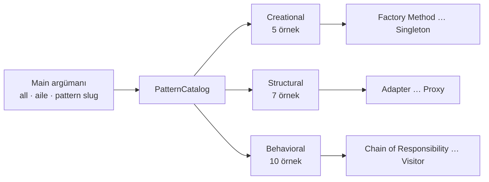
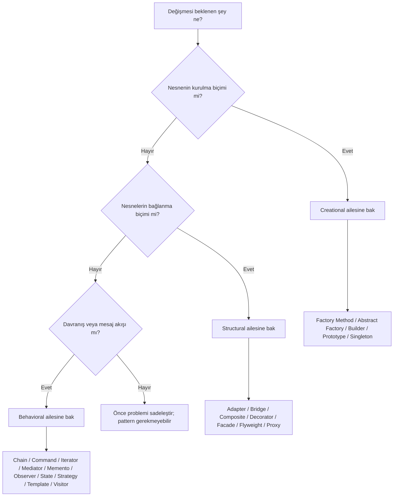
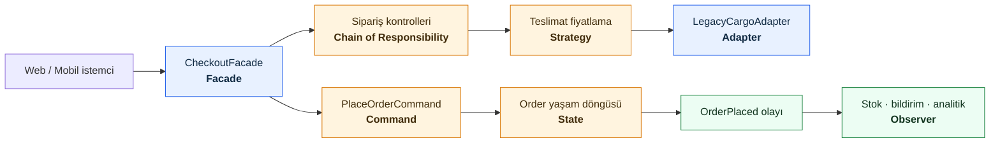
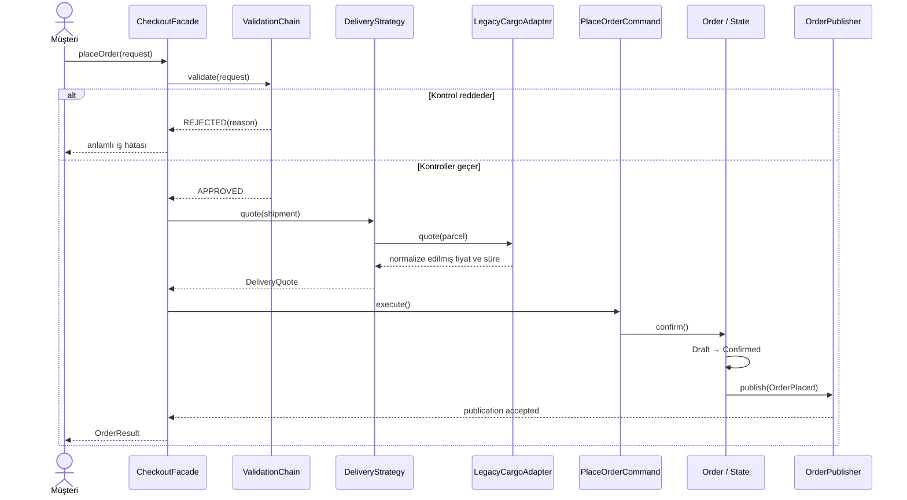
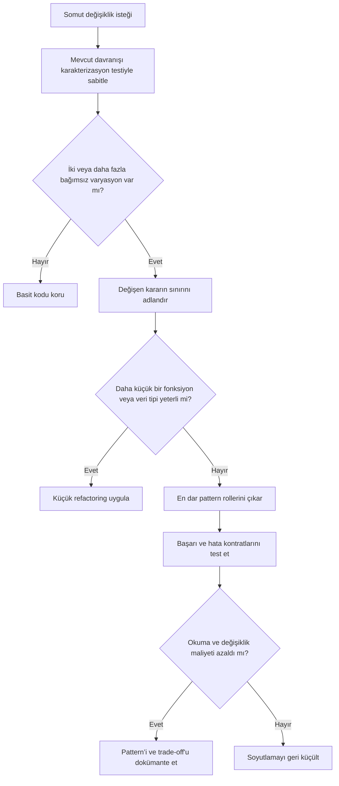

<section class="cover">
  <div class="cover-kicker">KODU OKU · KARARI ANLA · TESTLE KANITLA</div>
  <h1>Java ile Tasarım Desenleri</h1>
  <p class="cover-subtitle">22 GoF desenini ezberlemek için değil, doğru tasarım baskısını görünce tanımak için uygulamalı saha rehberi</p>
  <div class="cover-rule"></div>
  <div class="cover-metrics">
    <span><strong>5</strong> oluşturucu</span>
    <span><strong>7</strong> yapısal</span>
    <span><strong>10</strong> davranışsal</span>
  </div>
  <p class="cover-note">Java 21 · JUnit 5 · Mermaid diyagramları · Üretim sertleştirme notları</p>
</section>

# Kitabı kullanma rehberi

Bu kitap bir “pattern kataloğu” olmanın ötesinde, repodaki çalışan kodu **tasarım kararı → sınıf işbirliği → test kanıtı** zinciriyle okumak için hazırlandı. Her bölüm aynı öğrenme ritmini izler:

1. Önce pattern’in çözmeye çalıştığı **değişim eksenini** bulursun.
2. Sonra repodaki sınıfların pattern rollerine nasıl oturduğunu görürsün.
3. Bir çağrıyı baştan sona izleyerek soyut tanımı çalışan koda bağlarsın.
4. `@Nested` test gruplarıyla hangi sözleşmenin korunduğunu okursun.
5. Son olarak pattern’in bedelini, sınırlarını ve production ortamında eksik kalan parçaları tartarsın.

> **Ana fikir:** Pattern, kopyalanacak bir kod kalıbı değil; tekrar eden bir tasarım baskısına verilmiş, adı olan bir karardır.

Bu repoda GoF kataloğundaki 23 desenin 22’si bulunur. Davranışsal ailedeki **Interpreter** örneği bu çalışmanın kapsamında değildir. Aşağıdaki bütün anlatımlar yalnızca repoda gerçekten bulunan örneklerle eşleştirilmiştir.

## Hızlı başlangıç

Proje Java 21 hedefler. Önce Maven’in doğru JDK ile çalıştığını doğrula:

```bash
java -version
mvn -version
```

macOS ve Homebrew JDK 21 için gerekirse:

```bash
export JAVA_HOME="$(brew --prefix openjdk@21)/libexec/openjdk.jdk/Contents/Home"
export PATH="$(brew --prefix openjdk@21)/bin:$PATH"
```

Bütün örnekleri sırayla çalıştır:

```bash
mvn compile exec:java -Dexec.mainClass=com.can.Main
```

Örnek kataloğunu ve geçerli seçimleri gör:

```bash
mvn compile exec:java -Dexec.mainClass=com.can.Main -Dexec.args=--list
```

Yalnızca bir aileyi ya da tek bir deseni çalıştır:

```bash
mvn compile exec:java -Dexec.mainClass=com.can.Main -Dexec.args=structural
mvn compile exec:java -Dexec.mainClass=com.can.Main -Dexec.args=factory-method
```

`PatternCatalog`, 22 demoyu tek composition root altında toplar. `all`,
`creational`, `structural`, `behavioral` veya listelenen bir pattern slug'ı
seçilebilir. Bu katalog, desenlerin kendi domain koduna altyapı sorumluluğu
yüklemeden örnekleri gruplar ve tek tek çalıştırılabilir hâle getirir.
Türkçe aile adları da büyük/küçük harften bağımsız kabul edilir. `--help` ve
`--list` başarıyla kataloğu gösterirken, bilinmeyen seçim ve fazla argüman
process seviyesinde `2` kullanım hatası kodu üretir.

Öğrenme sözleşmelerini testlerle doğrula:

```bash
mvn test
```

Yalnızca bir pattern’in testini çalıştırmak için:

```bash
mvn -Dtest=AdapterPatternDemoTest test
```

## Repo içinde önerilen okuma döngüsü

Bir pattern’i yalnız açıklamasından okumak yerine üç dosya türü arasında gidip gel:

```text
explain/<pattern>.md
        │  “Neden ve hangi bedelle?”
        ▼
<Pattern>Demo.java + domain sınıfları
        │  “Kim, kime, ne zaman çağrı yapıyor?”
        ▼
<Pattern>DemoTest.java
           “Hangi davranış gerçekten kanıtlanıyor?”
```

Önerilen uygulama:

- İlk turda yalnız “30 saniyelik kart”, diyagram ve hafıza cümlesini oku.
- İkinci turda demo yerine önce domain sınıflarını incele.
- Üçüncü turda test adlarını bir gereksinim listesi gibi oku.
- Son turda “production hardening” bölümünden bir madde seçip kendin uygula.

> **Paket adı notu:** Davranışsal örnekler mevcut kodda `com.can.behavirol` altında duruyor. İngilizce doğru yazım `behavioral` olsa da bu kitap, çalışan paket ve import yollarıyla birebir eşleşmek için mevcut adı korur. Yeniden adlandırma ayrı ve kırıcı olabilecek bir refactoring’dir.

## Örnekleri üç katmanda okumak

Her bölümdeki örnek haritası, kodu “eski/yeni” diye değil öğretme amacıyla
gruplar:

| Katman | Ne gösterir? | Okurken sorulacak soru |
|---|---|---|
| Temel örnek | Pattern’in minimum katılımcıları ve ana çağrı zinciri | “Desenin niyeti hangi işbirliğinde ortaya çıkıyor?” |
| Güçlendirilmiş örnek | Daha gerçekçi invariant, hata durumu veya ikinci değişim ekseni | “İlk örneğin sakladığı hangi tasarım baskısı görünür oldu?” |
| Production sınırı | Bilinçli olarak demo dışında bırakılan operasyonel yükümlülük | “Bu kod canlı sisteme girmeden önce neyin sahibi belirlenmeli?” |

Amaç temel örneği çöpe atmak değildir. Küçük örnek mekanizmayı görünür kılar;
güçlendirilmiş örnek mekanizmanın gerçek bir gereksinim altında neden var
olduğunu gösterir; production notu ise eğitim koduyla ürün garantisini birbirine
karıştırmayı önler.

## Çalıştırılabilir katalog nasıl gruplanıyor?



`Main`, 22 somut demo importunu ve sırasını taşımak yerine seçim davranışını
`PatternCatalog` üzerinden yürütür. Katalog metadata ile çalıştırılabilir
davranışı yan yana tutar; benzersiz slug, aile dağılımı ve değiştirilemez
envanter sözleşmeleri `PatternCatalogTest` içinde ayrıca doğrulanır.

## Kısa terminoloji

Kod içindeki rol adlarıyla birebir bağ kurmak için bazı İngilizce terimler korunur:

| Terim | Bu kitaptaki anlamı |
|---|---|
| Product / concrete product | Ürün sözleşmesi / onun somut uygulaması |
| Client | Pattern katılımcılarını kullanan istemci kod |
| Runtime | Programın çalışma zamanı |
| Snapshot | Belirli bir andaki durum görüntüsü |
| Wrapper | Başka bir nesneyi sararak çağrıyı yöneten nesne |
| Trade-off | Bir kazanç için kabul edilen tasarım bedeli |
| Exact assertion | Sonucun yalnız bir parçasını değil, tamamını doğrulayan test beklentisi |
| Production hardening | Öğrenme demosunu gerçek sistem koşullarına hazırlayan doğrulama, güvenlik ve dayanıklılık adımları |

# Pattern’i ezberlemeden seçmek

Bir pattern adına bakarak değil, değişimin nereden geldiğine bakarak başla.



## Üç soru filtresi

Bir pattern eklemeden önce şu üç soruya somut cevap ver:

1. **Değişim baskısı:** Hangi kararın yakın zamanda birden fazla varyanta dönüşmesini bekliyorum?
2. **Sınır:** Bu kararı hangi sınıflardan izole etmek istiyorum?
3. **Vergi:** Yeni interface, sınıf ve dolaylı çağrı maliyetini hangi gerçek kazanç karşılıyor?

Üçüncü soruya cevap veremiyorsan, pattern muhtemelen erken soyutlamadır.

## Pattern ailelerinin asıl görevi

| Aile | Koruduğu karar | Tipik kod kokusu | Ana soru |
|---|---|---|---|
| Creational | Hangi nesnenin, hangi veri ve sırayla üretildiği | `new` kararlarının her yere yayılması, constructor patlaması | “Üretim değişince kimler etkileniyor?” |
| Structural | Nesnelerin hangi biçimde bağlandığı ve göründüğü | Uyumsuz API, kombinasyon sınıfları, karmaşık alt sistem | “Bağlantı şekli değişince istemci kırılıyor mu?” |
| Behavioral | Sorumluluğun, algoritmanın ve mesajın kimler arasında aktığı | Uzayan koşullar, sıkı bağlı iş akışı, dağınık event yönetimi | “Davranış değişince hangi nesneler birbirini bilmek zorunda?” |

# 22 pattern atlası

Bu tablo bir seçim kısayoludur; bölüm anlatımlarının yerine geçmez.

## Creational — üretim kararları

| Pattern | Değişen eksen | Bu repodaki hikâye | Ana giriş noktası |
|---|---|---|---|
| [Factory Method](#chapter-factory-method) | Üretilecek somut notification | Kanal creator’ları ve sıralı `NotificationJob` işleri | `NotificationCreator` |
| [Abstract Factory](#chapter-abstract-factory) | Birbiriyle uyumlu UI ürün ailesi | Light/Dark/High Contrast button + checkbox | `GuiFactory` |
| [Builder](#chapter-builder) | Çok alanlı nesnenin kurulum adımları | Rapor reçeteleri ve immutable varyant türetme | `Report.Builder` |
| [Prototype](#chapter-prototype) | Önceden hazırlanmış örnekten kopyalama | Deep-copy aday profili ve template registry | `CandidateProfile#copy` |
| [Singleton](#chapter-singleton) | Instance yaşam döngüsü ve erişimi | Global config, enjekte edilen API client | `AppConfig#getInstance` |

## Structural — bağlanma ve görünüm kararları

| Pattern | Değişen eksen | Bu repodaki hikâye | Ana giriş noktası |
|---|---|---|---|
| [Adapter](#chapter-adapter) | Uyumsuz API’nin hedef tipe çevrilmesi | Küçük Target kontratı ve legacy kargo birim/model dönüşümü | `RoundPegShape` / `ShippingService` |
| [Bridge](#chapter-bridge) | Abstraction ve implementation’ın bağımsız varyasyonları | Kumanda × cihaz, mute ve kanal preset’i | `RemoteControl` + `Device` |
| [Composite](#chapter-composite) | Tekil ve bileşik nesnenin aynı sözleşmeyle kullanılması | Exact para hesabı yapan güvenli kutu ağacı | `OrderComponent` |
| [Decorator](#chapter-decorator) | Davranışların runtime’da katmanlanması | Öncelik etiketi ve bildirim kanalı zincirleri | `Notifier` |
| [Facade](#chapter-facade) | Karmaşık alt sistemin istemciye sunulan yüzeyi | Typed video formatı, güvenli dosya metadata’sı ve dönüşüm orkestrasyonu | `VideoConverterFacade` |
| [Flyweight](#chapter-flyweight) | Çok sayıdaki nesnede ortak intrinsic state | Yapısal anahtarla paylaşılan ağaç türleri | `TreeFactory` |
| [Proxy](#chapter-proxy) | Aynı interface arkasındaki erişim politikası | Immutable ve hedefli temizlenebilen YouTube cache’i | `CachedYouTubeClass` |

## Behavioral — sorumluluk ve işbirliği kararları

| Pattern | Değişen eksen | Bu repodaki hikâye | Ana giriş noktası |
|---|---|---|---|
| [Chain of Responsibility](#chapter-chain-of-responsibility) | İsteği işleyecek ardışık kontroller | Girdi invariant’ı ve typed sonuç taşıyan sipariş pipeline’ı | `OrderRequestHandler` |
| [Command](#chapter-command) | Bir eylemin nesne olarak taşınması ve geçmişi | Editör toolbar’ı, güvenli undo ve macro | `Command` |
| [Iterator](#chapter-iterator) | Koleksiyon yapısını açmadan dolaşma | Immutable sosyal graph, lazy şirket filtresi ve Java Iterator adapter’ı | `ProfileIterator` |
| [Mediator](#chapter-mediator) | Bileşenler arası iletişim merkezi | Gateway enjekte edilen login/register diyaloğu | `AuthenticationDialog` |
| [Memento](#chapter-memento) | Encapsulation bozmadan snapshot/restore | Ardışık undo protokollü editör geçmişi | `EditorHistory` |
| [Observer](#chapter-observer) | Bir olayı dinleyicilere yayma | Yaşam döngüsü handle’lı stok aboneliği | `Publisher` / `Store` |
| [State](#chapter-state) | İç duruma bağlı davranış ve geçiş | Moderation reject içeren belge yaşam döngüsü | `DocumentState` |
| [Strategy](#chapter-strategy) | Seçilebilir algoritma | Hesap makinesi ve teslimat fiyatlama | `DeliveryStrategy` |
| [Template Method](#chapter-template-method) | Sabit akış, değiştirilebilir adımlar | Cleanup garantili PDF/CSV document mining | `DocumentMiningTemplate` |
| [Visitor](#chapter-visitor) | Stabil tipe yeni operasyon ekleme | Güvenli XML, risk analizi ve typed geo özeti | `GeoNodeVisitor` |

# Kod incelemesi: temel örnekten güçlendirilmiş örneğe

Kod incelemesinde amaç sınıf sayısını artırmak değildi. Her desende önce mevcut
örneğin öğretmekte zorlandığı tek bir gerçek tasarım baskısı seçildi; sonra o
baskı küçük bir API, açık bir invariant ve doğrudan testle görünür kılındı.
Aşağıdaki harita, değişikliklerin neden yapıldığını topluca gösterir.

## Creational kod inceleme haritası

| Pattern | Temel örnek | Güçlendirilen nokta | Bilinçli production sınırı |
|---|---|---|---|
| Factory Method | Tek kanal bildirimi | Creator/channel tutarlılığı ve sıralı `NotificationJob` batch’i | Retry, outbox, idempotency |
| Abstract Factory | Light/Dark UI | Tam `HIGH_CONTRAST` ürün ailesi ve fail-fast factory | Design token, WCAG ölçümü |
| Builder | Fluent rapor kurulumu | `toBuilder()`, tutarlı section ve incident doğrulaması | Çapraz alan kuralları, localization |
| Prototype | Profil `copy()` çağrısı | Registry snapshot’ı, deep copy ve defensive accessor | Duplicate ID, cyclic graph, concurrency |
| Singleton | Lazy `AppConfig` | Dar `ApiClientConfig` sözleşmesiyle constructor injection | Reload, secret yönetimi, dağıtık scope |

## Structural kod inceleme haritası

| Pattern | Temel örnek | Güçlendirilen nokta | Bilinçli production sınırı |
|---|---|---|---|
| Adapter | Kare çivi–yuvarlak delik | Yapay superclass state’ini kaldıran Target interface’i; kargo model/birim dönüşümü | Binary uyumluluk, provider timeout, retry, auth, SLA |
| Bridge | Kumanda × cihaz | Mute, preset workflow’u, null ve cihaz sınırları | Capability modeli, ağ I/O, concurrency |
| Composite | Ürün/kutu toplamı | `BigDecimal`, immutable child görünümü ve cycle koruması | Ownership, depth limiti, persistence |
| Decorator | Çok kanallı bildirim | Bütün kanallara ulaşan `PriorityDecorator` ve fail-fast graph | Kısmi başarı, retry, PII, SDK lifecycle |
| Facade | String tabanlı conversion | `VideoFormat`, tek yerde dosya metadata’sı ve dependency injection | Gerçek media I/O, güvenli path/MIME, cancel |
| Flyweight | Paylaşılan `TreeType` | Yapısal key, thread-safe havuz ve doğru sayaç scope’u | Eviction, kapasite ve resource lifecycle |
| Proxy | YouTube cache | Immutable snapshot, concurrent map ve hedefli invalidation | TTL, tenant, stampede, dağıtık cache |

## Behavioral kod inceleme haritası

| Pattern | Temel örnek | Güçlendirilen nokta | Bilinçli production sınırı |
|---|---|---|---|
| Chain of Responsibility | Boolean handler sonucu | İlk halkada request invariant’ı; `PROCESSED/REJECTED/DUPLICATE` ve sonuç nedeni | Gerçek idempotency/rate-limit/cache |
| Command | Toolbar ve tek undo | Invocation backup stack’i, macro ters-undo ve telafi | Redo, bounded/persistent history, transaction |
| Iterator | Friends/coworkers dolaşımı | Immutable graph snapshot’ı, lazy filtre ve standart Java `Iterator` adapter’ı | Pagination, retry, versioned snapshot |
| Mediator | Auth form koordinasyonu | Enjekte edilen `AuthenticationGateway` ile yan etki sınırı | Typed event, gerçek auth ve secret lifecycle |
| Memento | Snapshot + düşük seviye stack | Precondition-safe `EditorHistory#undo` ile caretaker protokolü | Redo, diff/bounded history, persistence |
| Observer | Store/subscriber bildirimi | Duplicate-safe kayıt, snapshot iteration ve ref-counted `Subscription` sahipliği | Async isolation, retry, DLQ, thread safety |
| State | Draft→Moderation→Published | Admin ve gerekçe kontrollü reject→Draft geçişi | Mutator sınırı, locking ve kalıcı audit |
| Strategy | Aritmetik işlemler | Typed shipment/quote ve overflow-safe `long` fiyatlama | Currency, config, eligibility, versioning |
| Template Method | PDF/CSV sabit akış | Giriş precondition’ı, locale-deterministic analiz ve `finally` ile primary/suppressed cleanup politikası | AutoCloseable, streaming parser |
| Visitor | XML + risk notları | Fail-fast elementler, XML escaping ve typed `GeoSummaryVisitor` | Serializer, schema, root ve lifecycle |

# En çok karıştırılan desenler

Pattern’ler çoğu zaman aynı mekanizmayı kullanır; onları ayıran şey mekanizma değil **niyettir**.

## Factory Method, Abstract Factory ve Builder

| Soru | Factory Method | Abstract Factory | Builder |
|---|---|---|---|
| Ana amaç | Tek product sözleşmesi için hangi concrete türün üretileceğini seçmek | Bir varyanta ait uyumlu product türlerini birlikte üretmek | Tek karmaşık product’ı adım adım kurmak |
| Sonuç | Genellikle bir product | Birbiriyle ilişkili product ailesi | Aynı product’ın farklı konfigürasyonları |
| Değişim | Concrete product | Aile/tema/platform | Kurulum adımları ve opsiyoneller |
| Bu repo | Notification türü | Light/Dark UI | `Report` |

Hafıza kuralı:

- “**Hangisini üreteceğim?**” → Factory Method
- “**Hangi uyumlu takımı üreteceğim?**” → Abstract Factory
- “**Bunu hangi adımlarla kuracağım?**” → Builder

## Adapter, Bridge, Decorator, Proxy ve Facade

Hepsi composition veya wrapping kullanabilir; hedefleri farklıdır.

| Pattern | Niyeti | Interface etkisi | Zamanlama |
|---|---|---|---|
| Adapter | Uyumsuz interface’i beklenene çevirmek | Değiştirir/çevirir | Çoğunlukla entegrasyon anında |
| Bridge | İki varyasyon eksenini ayırmak | Abstraction ile implementation arasında sabit köprü | Tasarımın başında |
| Decorator | Aynı sözleşmeye davranış eklemek | Korur | Runtime composition |
| Proxy | Aynı sözleşmede erişimi kontrol etmek | Korur | Çağrı öncesi/sonrası politika |
| Facade | Alt sisteme daha basit bir yüz sunmak | Yeni, daha dar bir yüz verir | İstemci sınırında |

## Strategy, State ve Template Method

| Pattern | Davranışı kim seçer? | Ana teknik | Tipik işaret |
|---|---|---|---|
| Strategy | Client/composition root | Composition ve delegasyon | Aynı iş için değiştirilebilir algoritmalar |
| State | Context’in yaşam döngüsü ve state nesneleri | Composition + explicit transition | Aynı çağrı, mevcut duruma göre farklı sonuç |
| Template Method | Base class akış sırasını sabitler | Kalıtım ve hook/primitive operation | İskelet aynı, bazı adımlar farklı |

Kısa kural: dışarıdan algoritma seçimi **Strategy**, davranışın mevcut duruma bağlanması ve geçişlerle evrilmesi **State**, sabit iskelet üzerinde alt sınıf adımları **Template Method**.

## Command ve Memento

- Command, “**ne yapılacağını**” nesneleştirir.
- Memento, “**hangi duruma dönüleceğini**” snapshot olarak saklar.
- Undo sistemi ikisini birlikte kullanabilir; fakat bu repodaki örnekler iki fikri ayrı ayrı öğretir.

## Observer ve Mediator

- Observer’da publisher abonelik listesini yönetebilir; fakat concrete subscriber’ın davranışını bilmeden olayı ortak sözleşme üzerinden yayınlar.
- Mediator’da etkileşim kuralları merkezde toplanır; concrete mediator bileşenlerin protokolünü bilir.
- Observer dağıtımı yaygınlaştırır, Mediator iletişimi merkezileştirir.

## Chain of Responsibility ve Decorator

İkisi de zincir görünebilir:

- Chain’de her halka isteği reddedebilir, işleyebilir, dönüştürebilir veya sonrakine bırakabilir.
- Decorator’da her halka aynı operation’a ek davranış katar ve sonucu aynı sözleşmede döndürür.

# Pattern’leri birlikte kullanmak: bir sipariş akışı

Gerçek bir sistem çoğu zaman tek bir pattern’den oluşmaz. Yine de iyi mimari,
“mümkün olan en fazla deseni” bir araya getirmek değildir. Her pattern yalnızca
kanıtlanmış bir değişim baskısının etrafına çizilen küçük bir karar sınırı
olmalıdır.

Aşağıdaki sipariş akışı **entegrasyon düşünce deneyidir**; repoda ayrıca
çalışan tek bir e-ticaret uygulaması bulunduğu anlamına gelmez. Amaç, ayrı
demolarda öğrenilen rollerin aynı use case içinde nerede durabileceğini
göstermektir.



Bu şekil bir sınıf sayısı hedefi vermez. Örneğin use case yalnızca senkron
çalışıyor, kuyruğa alınmıyor ve geri alınmıyorsa `PlaceOrderCommand` ayrı bir
sınıf olmak zorunda değildir. Pattern’in varlığını diyagram değil gereksinim
haklı çıkarır.

## Aynı isteğin çalışma zamanı izi



Akışı okurken üç farklı ilişkiyi ayır:

1. **Orkestrasyon:** `CheckoutFacade` adımların hangi sırada çağrıldığını bilir.
2. **Politika:** Chain, Strategy ve State kendi kararlarını sahiplenir.
3. **Entegrasyon:** Adapter dış sistemin modelini içerideki modele çevirir;
   Observer ise sipariş sonucunu ikincil alıcılara dağıtır.

Bu ayrım önemlidir. Bir facade’ın içinde yüzlerce iş kuralı oluşursa facade,
kolay bir giriş noktası olmaktan çıkıp “god object” olur. Observer üzerinden
yayınlanan her dinleyici ana transaction’ın zorunlu parçası yapılırsa gevşek
bağlı görünen tasarım gerçekte ortak hata kaderine sahip olur.

## Değişim baskısından pattern’e

| Gözlenen baskı | Aday pattern | İzole edilen karar | Pattern eklemeden önce sor |
|---|---|---|---|
| Kargo sağlayıcısının modeli ve birimleri iç API’den farklı | Adapter | Dış model → iç model dönüşümü | Dönüşüm gerçekten tekrar ediyor mu, yoksa tek fonksiyon yeterli mi? |
| Teslimat fiyatı standart/ekspres/mağazadan teslim algoritmasına göre değişiyor | Strategy | Seçilebilir fiyatlama algoritması | Algoritmalar aynı giriş/çıkış sözleşmesini taşıyor mu? |
| Güvenlik ve iş kontrollerinin sırası ürünlere göre kuruluyor | Chain of Responsibility | Ardışık kontrol ve kısa devre politikası | Sabit üç koşul, açık bir metotta daha okunabilir mi? |
| İstek kuyruklanacak, audit edilecek veya daha sonra çalıştırılacak | Command | Çağrı ile çalıştırılabilir eylem arasındaki zaman | Eylemi nesneleştirmenin somut bir yaşam döngüsü var mı? |
| Aynı operasyon sipariş durumuna göre farklı davranıyor | State | Duruma bağlı davranış ve geçişler | Yalnız iki basit durum için enum/switch daha açık mı? |
| Sipariş sonrası alıcılar birbirinden bağımsız eklenip çıkarılıyor | Observer | Olay üreticisi ile ikincil tepkiler | Teslimat, sıra ve hata semantiği tanımlı mı? |
| İstemci alt sistem adımlarını bilmemeli | Facade | Use case’in dışarıya sunulan dar yüzeyi | Basitleştirme yapıyor mu, yoksa kuralları tek sınıfa mı yığıyor? |

Tablo “baskı varsa kesin bu pattern’i kullan” demez. Adayı görünür kılar;
son karar kodun boyutu, değişim sıklığı, ekip bilgisi ve operasyon gereksinimiyle
verilir.

## Pattern çorbasını önleyen refactoring döngüsü



Deneyimli ekiplerin önemli alışkanlığı, yalnız pattern ekleyebilmek değil;
değişim baskısı ortadan kalktığında onu güvenle küçültebilmektir. Silinebilen
bir soyutlama başarısızlık değil, bakım maliyetinin yeniden değerlendirilmesidir.

## Birlikte kullanımda beş mühendislik kuralı

1. **Concrete wiring composition root’ta kalır.** Pattern kullanmak, sistemde
   hiçbir sınıfın concrete türleri bilmemesi demek değildir.
2. **Hata semantiği tasarımın parçasıdır.** Chain’in neden durduğu, Observer’da
   bir dinleyici çöktüğünde ne olduğu ve Command’in tekrar çalıştırılıp
   çalıştırılamayacağı açık sözleşme ister.
3. **Transaction sınırı diyagramda görünmeyen en önemli çizgidir.** State
   değişimi ile event yayını arasında atomicity gerekiyorsa outbox gibi bir
   teslimat tasarımı ayrıca gerekir; Observer bunu kendiliğinden çözmez.
4. **Decorator ve Proxy sırası davranıştır.** Cache’in telemetry’nin içinde mi
   dışında mı olduğu, cache hit’lerinin ölçülüp ölçülmeyeceğini değiştirir.
   Wrapper sırasını composition testiyle sabitle.
5. **Pattern adı acceptance criterion değildir.** “Strategy kullandık” yerine
   “yeni fiyatlama algoritması mevcut algoritmaları değiştirmeden ekleniyor ve
   aynı kontrat testinden geçiyor” denebilmelidir.

# Testleri bir gereksinim dokümanı gibi okumak

Bu projedeki testler `@Nested` ile davranış bağlamlarına ayrılır. Amaç yalnız yeşil sonuç almak değil, test raporunu okunabilir bir tasarım sözleşmesine çevirmektir.

Örnek düşünme biçimi:

```java
@Nested
@DisplayName("Aynı intrinsic state tekrar istendiğinde")
class IdentityReuse {

    @Test
    @DisplayName("factory aynı flyweight örneğini döndürür")
    void reusesTheSameInstance() {
        // Arrange
        TreeFactory factory = new TreeFactory();

        // Act
        TreeType first = factory.getTreeType("Oak", "Green", "Rough");
        TreeType second = factory.getTreeType("Oak", "Green", "Rough");

        // Assert
        assertSame(first, second);
    }
}
```

Bu test üç şeyi aynı anda anlatır:

1. Test edilen iş kuralını doğal dilde adlandırır.
2. Pattern’in özünü bir implementation detayı yerine observable sözleşmeyle gösterir.
3. Hata olduğunda raporda “hangi bağlamın” kırıldığını görünür kılar.

## İyi pattern testi için kontrol listesi

- Pattern’in ayırt edici davranışını test ediyor mu?
- Sadece demo `stdout` çıktısına değil, domain API’sine bakıyor mu?
- Happy path yanında sınır veya başarısızlık davranışı var mı?
- Aynı test birden fazla bağımsız nedeni yüzünden kırılacak kadar geniş mi?
- `contains` yerine mümkün olduğunda exact sonuç, sıra, identity veya çağrı sayısı doğrulanıyor mu?
- Test adı implementation’ı değil iş sonucunu mu anlatıyor?
- Bilinen demo kısıtı, geçmesini beklemediğimiz bir “wishlist testi” yerine dokümanda mı tutuluyor?

# Demo kodu ile production kodunu ayırmak

Bu repo öğrenme amaçlıdır. Basitlik, pattern’in iskeletini görünür kılar; fakat bu basitliği production garantisi sanmamak gerekir.

| Konu | Demo için makul | Production’da ayrıca düşün |
|---|---|---|
| Input | Sabit ve kontrollü örnek veri | Null/blank/range doğrulaması, hata modeli |
| Concurrency | Tek thread | Thread-safety, visibility, contention |
| Cache | Sınırsız map ve manuel reset | TTL, capacity, eviction, stampede, stale data |
| Para | `double` ile basit örnek | Minor unit veya `BigDecimal`, currency |
| Snapshot | Küçük immutable alanlar | Deep copy, bellek bütçesi, ownership |
| Event | Senkron callback | Failure isolation, retry, backpressure, ordering |
| Güvenlik | Akışı gösterecek basit kontrol | Gerçek auth, secret hashing, XSS/SQL güvenliği |
| Dosya/XML | String simülasyonu | Resource cleanup, encoding, escaping, schema |

> Bölümlerdeki “production hardening” notları, örneğin kötü olduğu anlamına gelmez. Tam tersine, pattern iskeleti ile gerçek sistem yükümlülüklerini bilinçli biçimde ayırır.

# Dört haftalık çalışma rotası

## 1. hafta — üretim kararları

- Factory Method ve Abstract Factory’yi arka arkaya oku.
- Builder’da default değer ve immutable snapshot testlerini çalıştır.
- Prototype’ta shallow/deep copy farkını bir mutation deneyiyle gör.
- Singleton bölümünde classloader scope ile process-wide iddia arasındaki farkı yazılı olarak açıkla.

Hafta çıktısı: “nesne üretimi” adı altında aslında beş farklı tasarım niyeti bulunduğunu ayırt edebilmek.

## 2. hafta — yapısal niyet

- Adapter–Bridge farkını aynı cümlede açıklamaya çalış.
- Composite fiyat ağacına üçüncü seviye kutu ekle.
- Decorator stack sırasını exact assertion ile izle.
- Facade ve Proxy’de istemcinin hangi karmaşıklıktan korunduğunu karşılaştır.
- Flyweight’ta context sayısı ile unique type sayısını ayrı ölç.

Hafta çıktısı: aynı composition tekniğinin beş farklı niyet için kullanılabileceğini görmek.

## 3. hafta — davranış seçimi ve akış

- Strategy–State–Template Method üçlüsünü birlikte çalış.
- Chain’de handler sırasını değiştirip sonucu gözlemle.
- Command ve Memento’nun undo sorumluluklarını karşılaştır.
- Iterator ile koleksiyonun iç yapısını açmadan iki bağımsız cursor oluştur.

Hafta çıktısı: “if/else azaltmak” ile “sorumluluğu doğru yere taşımak” arasındaki farkı kurmak.

## 4. hafta — olaylar ve yeni operasyonlar

- Observer’ın senkron dağıtım bedelini incele.
- Mediator’da event protokolünü enum’a dönüştürmeyi tasarla.
- Visitor’ın yeni operasyon ekleme avantajını, yeni element ekleme bedeliyle birlikte test et.
- Her aileden bir pattern seçip production hardening maddelerinden birini uygula.

Hafta çıktısı: pattern seçimini isim ezberinden çıkarıp trade-off değerlendirmesine dönüştürmek.

# Kendi kendine değerlendirme

Bir pattern’i gerçekten anladığını söylemeden önce şu soruları cevaplayabilmelisin:

1. Patternsiz tasarımda hangi değişiklik birden fazla sınıfı kırıyordu?
2. Eklenen indirection hangi kararı izole etti?
3. Repodaki her katılımcının rolü nedir?
4. Pattern’in özünü hangi tek test en iyi kanıtlıyor?
5. Hangi koşulda bu pattern gereksiz soyutlama olur?
6. En çok benzediği pattern’den niyet olarak nasıl ayrılır?
7. Demo kodunu production’a taşımadan önce ilk üç sertleştirme adımın ne olur?

# Kitabı yeniden üretmek

Pattern Markdown’ları güncellendikten sonra birleşik kitabı üret:

```bash
./scripts/build-book.sh
```

İçerik ve test yapısını doğrula:

```bash
node scripts/validate-learning-content.mjs
```

Node.js 22+, npm/npx, yerel Chrome/Chromium, internet bağlantısı ve macOS’taki
Swift/PDFKit araçlarıyla görsel PDF’i yeniden oluştur:

```bash
node scripts/render-book.mjs
```

Birleşik Markdown çıktısı `BOOK.md`, görsel olarak doğrulanacak PDF çıktısı ise `docs/design-patterns-java.pdf` dosyasıdır.
PDFKit adımı tıklanabilir bölüm bağlantılarını denetler ve 22 bölümlük yer imi ağacını ekler.
İçerik validator'ı kanonik 22 pattern sırasını, manifest/katalog/atlas
eşleşmesini ve Markdown fence yapısını kontrol eder. Mermaid sözdiziminin tam
parse/render doğrulaması PDF üretim aşamasında gerçekleştirilir.

---

<div class="part-divider">
  <span>UYGULAMALI PATTERN BÖLÜMLERİ</span>
  <strong>Her bölüm: niyet → kod → test → trade-off</strong>
</div>
