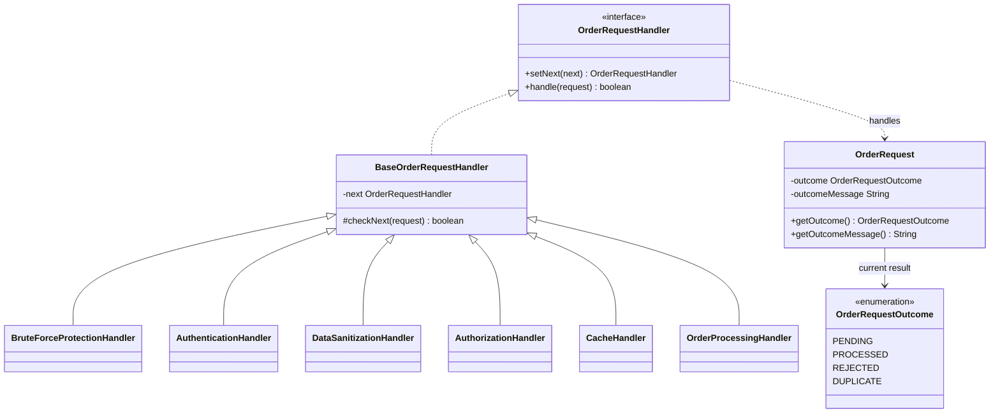
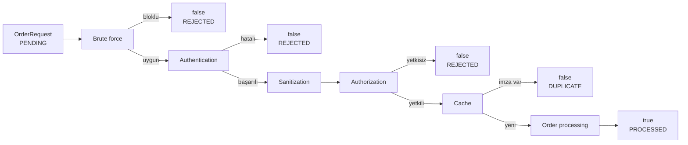

# Chain of Responsibility — Sorumluluk Zinciri

> Bu bölüm repodaki çalışan örneği anlatır.
> Güvenlik isimleri taşısa da kod bir eğitim demosudur; production güvenlik katmanı değildir.

## 30 saniyelik kart

| Soru | Kısa cevap |
|---|---|
| Niyet | Bir isteği, sırayla çalışan ve gerektiğinde akışı kesen handler nesnelerinden geçirmek |
| Değişen eksen | Kontrollerin türü, sırası ve hangi koşulda zinciri durdurduğu |
| Ana bedel | Akış dağıtık hale gelir; sonuç ve yan etkilerin izini sürmek zorlaşabilir |
| Bu örnekte | Sipariş isteği brute-force, kimlik, temizlik, yetki, tekrar ve işleme adımlarından geçer |
| Hafıza ipucu | “Ben geçiremezsem burada durdurur, geçirebilirsem sıradakine veririm.” |

## Örnek haritası: temel → güçlendirilmiş → production

| Katman | Bu repoda ne var? | Öğrettiği sınır |
|---|---|---|
| Temel örnek | `OrderRequestHandler`, `BaseOrderRequestHandler` ve altı concrete handler | İsteğin sırayla ilerlemesi ve herhangi bir handler’ın kısa devre yapması |
| Güçlendirilmiş örnek | `OrderRequestOutcome` ile `OrderRequest#getOutcome()` / `getOutcomeMessage()` | Aynı `false` sonucunun yetki reddi mi yoksa duplicate mı olduğunun gözlenmesi |
| Production sınırı | Typed sonuç dönüşü, idempotency key, güvenli kimlik sağlayıcısı, rate limiter ve bounded cache | Boolean ile iş sonucu, güvenlik ve tekrar politikasının tam modellenememesi |

## Akılda kalıcı analoji: havaalanı güvenlik hattı

Bir yolcu uçağa ulaşmadan önce bilet, kimlik, bagaj, pasaport ve kapı kontrollerinden geçer.
Bir istasyon başarısız olursa sonrakiler çalışmaz; her istasyon yalnız kendi kuralını bilir.

Bu üç cümle Sorumluluk Zinciri’nin özüdür.

## Pattern olmasaydı problem ne olurdu?

Tüm kurallar tek metotta toplandığında kod hızla iç içe `if`, erken dönüş ve yan etki yığınına dönüşür.

İlk bakışta kısa görünen bu metot büyüdükçe:

- güvenlik ve iş kuralları birbirine karışır,
- farklı bir akışta tek bir kontrolü yeniden kullanmak zorlaşır,
- kontrol sırası değişiklikleri riskli hale gelir,
- her yeni kural merkezi metodu değiştirmeyi gerektirir,
- hangi adımın isteği mutate ettiği kolayca gözden kaçar.

## Çözüm

Her kontrol ortak bir sözleşmeyi uygulayan ayrı handler olur.
Handler kendi sorumluluğunu yerine getirir ve iki sonuçtan birini seçer:

- isteği reddedip zinciri kesmek,
- `checkNext(request)` ile sonraki handler’a geçirmek.

`BaseOrderRequestHandler`, `next` referansını ve varsayılan geçiş davranışını tek yerde toplar.
Client olan `ChainOfResponsibilityDemo`, concrete handler’ları çalışma anında sıraya dizer.

### Çözmediği şeyler

Bu desen tek başına:

- doğru güvenlik algoritmasını seçmez,
- handler sırasının güvenli olduğunu garanti etmez,
- transaction veya rollback sağlamaz,
- eşzamanlı erişimi güvenli yapmaz,
- handler dönüş değerinde zengin bir başarı/hata sonucu taşımaz,
- gözlemleme, loglama ve timeout politikasını otomatik kurmaz.

Pattern iletişim yapısını düzenler; iş kurallarının doğruluğu yine geliştiricinin sorumluluğudur.

## Repodaki roller

| Pattern rolü | Repodaki karşılığı | Sorumluluk |
|---|---|---|
| Handler | `OrderRequestHandler` | `setNext` ve `handle` sözleşmesini tanımlar |
| Base Handler | `BaseOrderRequestHandler` | Sonraki handler referansını ve `checkNext` akışını tutar |
| Concrete Handler | `BruteForceProtectionHandler` | IP blokluysa zinciri keser |
| Concrete Handler | `AuthenticationHandler` | Kullanıcı/parola kontrolü yapar ve kullanıcıyı request’e yazar |
| Concrete Handler | `DataSanitizationHandler` | Payload’dan `<` ve `>` karakterlerini silip trim eder |
| Concrete Handler | `AuthorizationHandler` | `VIEW_ALL_ORDERS` için admin rolünü kontrol eder |
| Concrete Handler | `CacheHandler` | Daha önce başarılı olmuş imzayı tekrar kabul etmez |
| Terminal Handler | `OrderProcessingHandler` | Sonucu `PROCESSED` yapar, işlemi yazar ve zinciri başarıyla bitirir |
| Request | `OrderRequest` | Zincirde taşınan mutable context |
| Sonuç modeli | `OrderRequestOutcome` | `PROCESSED`, `REJECTED` ve `DUPLICATE` nedenlerini ayırır |
| Destek nesnesi | `LoginAttemptService` | IP başına başarısız deneme sayısını tutar |
| Destek nesnesi | `RequestCache` | Başarılı istek imzalarını `Set` içinde saklar |
| Client | `ChainOfResponsibilityDemo` | Zinciri kurar ve örnek istekleri gönderir |

## Yapı

## Gerçek çalışma akışı

## Kod execution trace

### 1. Normal kullanıcının sipariş oluşturması

1. IP henüz bloklu değildir.
2. `"can" / "1234"` doğrulanır.
3. `authenticatedUser` request üzerine yazılır.
4. `<script>...` payload’ındaki açı parantezleri silinir.
5. `CREATE_ORDER` admin gerektirmez.
6. İmza cache’de bulunmaz.
7. İşlem mesajı yazılır ve zincir `true` döner.
8. Cache başarılı imzayı saklar.

### 2. Normal kullanıcının tüm siparişleri istemesi

1. Brute-force ve authentication adımları geçilir.
2. Payload, authorization’dan önce mutate edilir.
3. Kullanıcı admin olmadığı için authorization `false` döndürür.
4. Cache ve order processing çalışmaz.

### 3. Aynı admin isteğinin ikinci kez gelmesi

1. İkinci istek yine brute-force, authentication, sanitization ve authorization’dan geçer.
2. Cache imzayı bulur.
3. Order processing çağrılmaz.
4. Mevcut API cache-hit için de `false` döndürür.

Bu son nokta önemlidir: örnek gerçek bir “sonuç cache’i” değil, tekrar bastırma mekanizmasıdır.

## API, invariant ve sonuç semantiği

- Zincirin kökü `buildChain` tarafından döndürülen ilk handler’dır.
- `setNext` verilen handler’ı döndürür; bu yüzden fluent bağlantı kurulabilir.
- `checkNext`, sıradaki handler yoksa `true` döndürür.
- Bir handler `false` döndürdüğünde kalan zincir çalışmaz.
- `OrderProcessingHandler` terminaldir; yanlışlıkla arkasına handler bağlansa bile onu çağırmaz.
- `OrderRequest` immutable değildir; payload ve authenticated user değişebilir.
- Cache imzası `username|operation|sanitizedPayload` biçimindedir.
- İmza IP, parola veya ayrı bir idempotency key içermez.
- Başarısız istekler cache’e yazılmaz.
- `boolean` yalnız “terminal işleme kabul edildi mi?” bilgisini taşır.
- Authentication, authorization, blok ve cache-hit dönüşte aynı `false` değerinde birleşir.
- Buna karşılık request üzerindeki `outcome`, reddi duplicate kısa devreden ayırır.
- `outcomeMessage`, demosal ve insan okunur nedeni taşır; localization/domain error code değildir.

Production API’sinde sonucu mutable request’e yazmak yerine, handler’dan typed bir `HandlingResult` döndürmek daha açık olur.

## Test kontrat haritası

| `@Nested` grup | Korunan davranış |
|---|---|
| `SuccessfulRequests` | Create başarısı, admin erişimi, payload mutation |
| `RejectedRequests` | Yanlış parola, yetki reddi, deneme eşiği, başarılı login reset’i |
| `CacheShortCircuit` | İlk çağrı/tekrar sonucu ve payload’a bağlı imza |
| `OutcomeSemantics` | Başarı/reddetme/tekrar ayrımı ve processing handler’ın terminal olması |

Testler sunum davranışını ölçmek için stdout’a bağımlı olmamalıdır.
Terminal davranış, yanlışlıkla bağlanan recording handler’ın çağrılmadığı gözlenerek korunur.

## Edge case, güvenlik, concurrency ve performans

### Audit sırasında görülen riskler

- Üçüncü hatalı giriş sayacı eşiğe getirir; brute-force reddi sonraki istekte görülür.
- Başarılı giriş, aynı IP’deki bütün hata sayısını sıfırlar.
- `maxFailedAttempts <= 0` her IP’yi bloklu kabul eder.
- Null request veya null payload açık doğrulama yerine NPE üretebilir.
- `setNext(null)` fluent kurulumun sonraki çağrısını bozabilir.
- `HashMap` ve `HashSet` thread-safe değildir.
- Düz metin parola karşılaştırması production için uygun değildir.
- Açı parantezi silmek güvenli HTML/XSS sanitizasyonu değildir.
- Cache sınırsız büyür; eviction, TTL ve tenant ayrımı yoktur.
- Handler başına çağrı maliyeti O(1) kabul edilirse zincir O(h) çalışır.

Production’da güvenilir kimlik sağlayıcısı, parola hash’i, güvenli encoder, rate limiter, bounded cache ve thread-safe depolar kullanılmalıdır.

## Ne zaman kullan?

- Filtrelerin sırası çalışma anında kurulacaksa,
- her kontrol bağımsız yeniden kullanılacaksa,
- herhangi bir adım akışı kısa devre edebilecekse,
- middleware, validation veya approval hattı modelleniyorsa,
- gönderen concrete işleyiciyi bilmemeliyse.

## Ne zaman kullanma?

- Tek ve sabit bir kontrol varsa,
- bütün adımlar atomik transaction gerektiriyorsa,
- iş akışı dallanma, retry ve uzun süreli state taşıyorsa,
- sonuç nedeninin güçlü biçimde modellenmesi gerekirken yalnız boolean kullanılacaksa,
- sıra gizlenince sistem anlaşılmaz hale geliyorsa.

## Artılar ve bedeller

| Artı | Bedel |
|---|---|
| Handler’lar tek sorumluluğa yaklaşır | Execution flow birden fazla dosyaya dağılır |
| Zincir runtime’da kurulabilir | Yanlış sıra güvenlik açığı veya gereksiz yan etki doğurabilir |
| Yeni kontrol ayrı sınıf olarak eklenebilir | Composition kodu yeni handler için yine değişebilir |
| Erken çıkış doğaldır | Bir isteğin neden durduğu zengin sonuç yoksa kaybolur |
| Handler yeniden kullanılabilir | Paylaşılan mutable servisler concurrency riski taşır |

## En çok karışan desen: Decorator

| Chain of Responsibility | Decorator |
|---|---|
| Bir handler isteği durdurabilir | Decorator çoğunlukla wrapped nesneyi çağırır |
| Amaç uygun işleyici/filtre hattıdır | Amaç nesneye davranış eklemektir |
| Sonraki adım opsiyoneldir | İç nesne dekorasyonun merkezidir |
| Sonuç kısa devre olabilir | Çağrı genellikle içeri ve tekrar dışarı akar |

Bu repo örneği “her handler katkı yapıp sıradakine geçirir” biçimiyle middleware’e de benzer.

## Yaygın hatalar

1. Handler sırasını önemsiz sanmak.
2. Bütün handler’lara ortak mutable state vermek.
3. `false` sonucunun nedenini kaybetmek.
4. Her handler’da farklı exception politikası kullanmak.
5. Terminal handler’dan sonra yeni kontrol bağlamak.
6. Güvenlik demosunu production güvenliği sanmak.
7. Cache ile duplicate suppression kavramlarını karıştırmak.

## Alıştırmalar

### Seviye 1 — Gözlemle

`LoggingHandler` ekle ve request’in zincirde hangi sırayla ilerlediğini bir listeye yaz.
Mevcut handler’ların kodunu değiştirmeden listenin beklenen sırada olduğunu test et.

### Seviye 2 — Tasarla

`boolean` yerine sealed bir `ChainResult` tasarla.
Başarı, authentication hatası, yetki hatası, blok ve duplicate sonuçlarını ayrı modelle.

### Seviye 3 — Production’a yaklaştır

IP ve kullanıcı anahtarlı, zaman pencereli bir rate limiter tasarla.
Thread safety, TTL, saat bağımlılığı ve test edilebilir clock kararlarını dokümante et.

## Hafıza cümlesi

**Sorumluluk Zinciri, isteği “kim yapacak?” diye merkezi koşullarda aramaz; sıraya dizilmiş uzmanlara tek tek sorar ve biri dur dediğinde akışı keser.**
