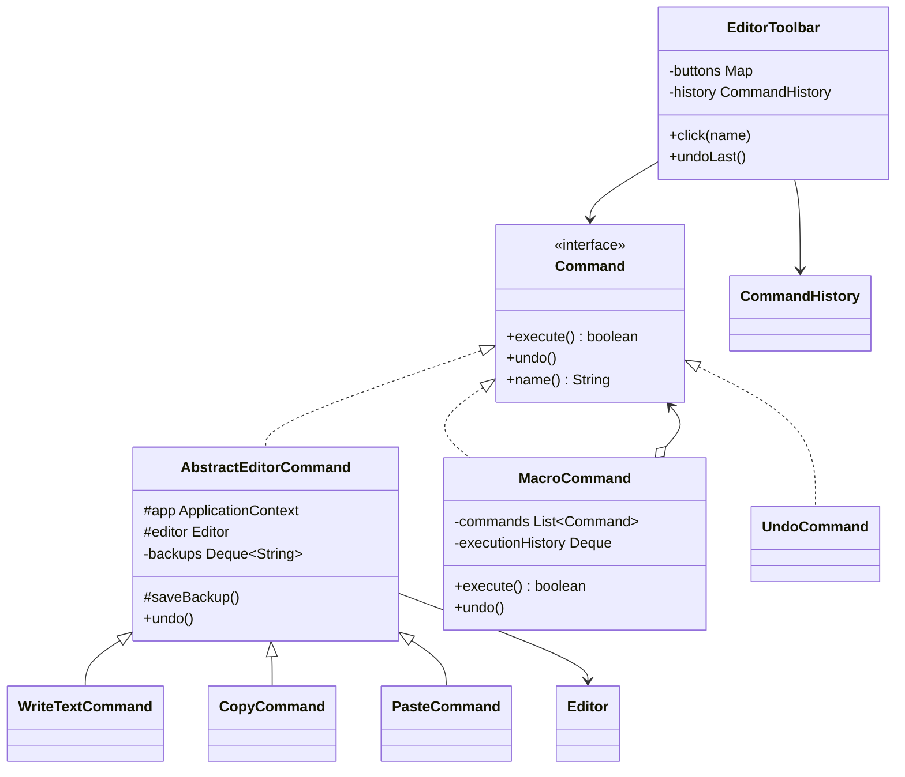
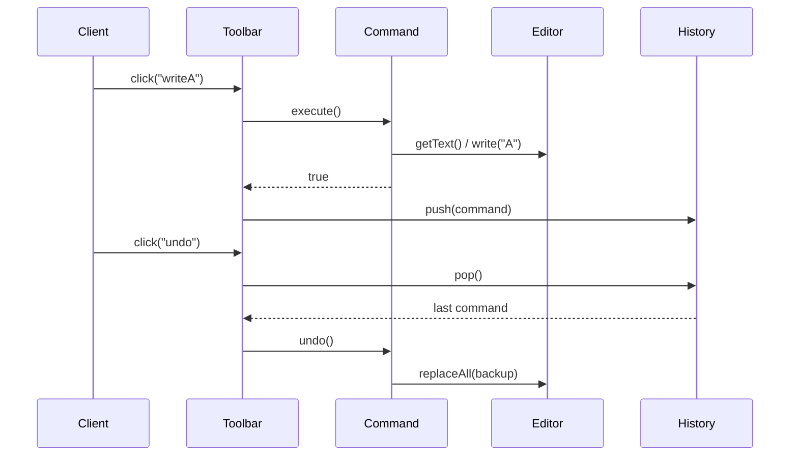
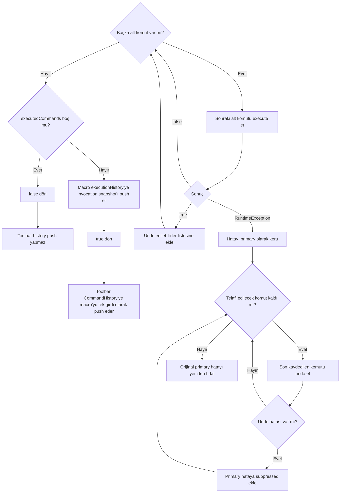

# Command — Komut Deseni

> Bu bölüm repodaki mini editörü temel alır.
> Undo ve macro fikrini öğretir; mevcut implementasyon tam özellikli bir editör geçmişi değildir.

## 30 saniyelik kart

| Soru | Kısa cevap |
|---|---|
| Niyet | Bir isteği, çağrı bilgilerini taşıyan bağımsız bir nesneye dönüştürmek |
| Değişen eksen | Hangi eylemin, hangi receiver ve verilerle çalışacağı |
| Ana bedel | Komut sınıfı sayısı ve komut yaşam döngüsü yönetimi artar |
| Bu örnekte | Toolbar butonları yazma, kopyalama, yapıştırma ve undo komutlarını tetikler |
| Hafıza ipucu | “Yapılacak işi fişe yaz; düğme yalnız fişi çalıştırsın.” |

## Örnek haritası: temel → güçlendirilmiş → production

| Katman | Bu repoda ne var? | Öğrettiği sınır |
|---|---|---|
| Temel örnek | `WriteTextCommand`, `CopyCommand`, `PasteCommand`, `UndoCommand` ve `EditorToolbar` | İsteği nesneleştirme, receiver’a delegasyon ve LIFO undo |
| Güçlendirilmiş örnek | `AbstractEditorCommand` içindeki invocation başına backup stack’i ve `MacroCommand` | Aynı command instance’ını güvenle tekrar çalıştırma; birçok komutu tek history kaydı olarak geri alma |
| Production sınırı | Command factory, redo, bounded history, kalıcı event log veya gerçek transaction/saga | In-memory full-text backup ve telafi edici undo’nun atomik transaction olmaması |

## Akılda kalıcı analoji: restoran sipariş fişi

Müşteri isteğini garsona söyler.
Garson isteği bir fişe dönüştürür.
Mutfak, müşteriyi tanımadan fişteki talimatı uygular.

Fiş:

- sıraya alınabilir,
- başka bir garson tarafından taşınabilir,
- loglanabilir,
- iptal edilebilir,
- tamamlandıktan sonra arşivlenebilir.

Command nesnesi de çağrıyı bu şekilde taşınabilir bir pakete dönüştürür.

## Pattern olmasaydı problem ne olurdu?

Toolbar işi doğrudan yaparsa UI, clipboard kontrolünü, backup almayı, receiver çağrısını ve history kaydını bilmek zorunda kalır.

Aynı paste davranışı menü, kısayol ve macro için tekrarlandığında:

- UI ile domain davranışı sıkı bağlanır,
- undo kodu her event handler’a yayılır,
- eylemleri kuyruklamak zorlaşır,
- yeni tetikleme kanalı kopya kod üretir,
- testler UI ayrıntısına bağımlı hale gelir.

## Çözüm

İsteğin receiver’ı, parametreleri ve çalıştırma davranışı bir `Command` nesnesine konur.
Invoker olan toolbar yalnız `execute()` çağırır.
Undo edilebilir komut, çalışmadan önce receiver state’inin yedeğini alır.
Toolbar, komutun dönüş değerine göre onu history’ye ekler.

### Çözmediği şeyler

Command tek başına:

- doğru transaction sınırını belirlemez,
- otomatik redo üretmez,
- command instance’ının lifecycle politikasını otomatik seçmez,
- dağıtık işlemlerde exactly-once garantisi sağlamaz,
- exception sonrası rollback garantilemez,
- receiver state’inin ne kadarının saklanacağını seçmez.

## Repodaki roller

| Pattern rolü | Repodaki karşılığı | Sorumluluk |
|---|---|---|
| Command | `Command` | `execute`, `undo`, `name` sözleşmesi |
| Base Command | `AbstractEditorCommand` | App/editor referansı ve invocation başına backup stack’i |
| Concrete Command | `WriteTextCommand` | Verilen metni editöre ekler |
| Concrete Command | `CopyCommand` | Editör metnini clipboard’a yazar |
| Concrete Command | `PasteCommand` | Clipboard doluysa metni ekler |
| Concrete Command | `UndoCommand` | Toolbar üzerinden son komutu geri alır |
| Composite Command | `MacroCommand` | Alt komutları tek history birimi olarak çalıştırır ve ters sırada undo eder |
| Receiver | `Editor` | Asıl metin state’ini ve metin operasyonlarını taşır |
| Paylaşılan context | `ApplicationContext` | Clipboard state’ini tutar |
| Invoker | `EditorToolbar` | Buton adı ile komutu eşler ve çalıştırır |
| History | `CommandHistory` | Undo edilebilir komutları stack’te tutar |
| Client | `CommandPatternDemo` | Nesneleri üretip birbirine bağlar |

## Yapı

## Çalışma akışı

## Kod execution trace

### Yazma

Client butona `WriteTextCommand` bağlar; toolbar komutu bulur, komut backup alıp metni append eder ve `true` döndüğü için history’ye girer.

### Copy ve paste

Copy tam metni clipboard’a yazıp `false` döner.
Paste blank olmayan clipboard için backup alır, metni append eder ve history’ye girer.

### Undo

1. `UndoCommand.execute`, `toolbar.undoLast()` çağırır.
2. Toolbar history’den son command’i alır.
3. Command’in `undo()` metodu kendi backup’ını restore eder.
4. UndoCommand `false` döner ve kendisi history’ye yazılmaz.

## API, invariant ve sonuç semantiği

- `Command.execute()` dönüşü iş başarısı değil, “history’ye ekle” bayrağıdır.
- `true` dönen command undo edilebilir kabul edilir.
- History LIFO davranır; boş stack’te `pop()` null döner.
- Boş history üzerinde undo no-op’tur.
- Toolbar’da tanımsız isim `IllegalArgumentException` üretir.
- Write ve paste, çalışmadan önce tam editör state’ini String olarak saklar.
- Copy clipboard’ı değiştirse de editor history’sine girmez.
- Blank clipboard paste edilmez; yalnız boş String değil whitespace de no-op’tur.
- `name()` mevcut akışta çağrılmaz.

Bu boolean protokolü production API’sinde `ExecutionResult` veya `isUndoable()` gibi daha açık bir kavramla ayrıştırılabilir.

## Güçlendirme: invocation geçmişi ve macro

Toolbar aynı command instance’ını birden çok kez çalıştırabilir.
Bu nedenle `AbstractEditorCommand` tek backup yerine `Deque<String>` kullanır:

1. her başarılı execute kendi önceki state’ini stack’e iter,
2. history aynı command referansını tekrar taşısa bile,
3. her undo o invocation’a ait son backup’ı pop eder.

`MacroCommand` ise alt komutlardan `true` dönenleri kaydeder.
Normal undo’da bu komutları ters sırada geri alır.
Bir alt komut `RuntimeException` atarsa daha önce çalışan undo edilebilir alt
komutların tamamını ters sırada telafi etmeyi dener.
Asıl execute exception’ı primary kalır; rollback exception’ları çağrı sırasıyla
ona suppressed olarak eklenir.

Normal macro undo sırasında birden fazla alt komut hata verirse yine bütün undo’lar denenir.
Ters sıradaki ilk undo hatası primary olur, sonraki undo hataları ona suppressed olarak eklenir.
Bu deterministik politika hata bilgisini korur; fakat telafilerin iş açısından gerçekten başarılı olduğunu garanti etmez.

Bu telafi davranışı veritabanı transaction’ı değildir: `false` dönen ama clipboard gibi başka state’i değiştiren bir komut otomatik geri alınmaz.

`MacroCommand` özellikle `Error` yakalamaz.
`OutOfMemoryError`, `StackOverflowError` veya VM seviyesindeki başka fatal
durumlarda ek telafi kodu çalıştırmak güvenli olmayabilir.
Bu nedenle örneğin best-effort telafi garantisi recoverable uygulama hatası olarak
modellenen `RuntimeException` sınırında kalır.

## Test kontrat haritası

| `@Nested` grup | Korunan davranış |
|---|---|
| `CommandExecution` | Write sırası, history boyutu, tanımsız buton |
| `ClipboardCommands` | Copy tracking politikası, dolu ve blank paste |
| `UndoHistory` | LIFO undo, farklı instance’larla çoklu undo, boş history |
| `ReusableCommandHistory` | Aynı stateful command instance’ının iki invocation backup’ı |
| `MacroCommands` | Tek history birimi, ters sıra undo, `RuntimeException` primary/suppressed hata ve tam telafi denemesi |

Core testlerde stdout yerine receiver state’i ve history boyutu gözlenir.

## Edge case, güvenlik, concurrency ve performans

- `setClipboard(null)` sonraki paste’te NPE üretebilir.
- Aynı isimle ikinci kayıt ilk command’i sessizce değiştirir.
- Tam metin backup’ı her komutta O(n) zaman ve bellek kullanır.
- Macro undo hatasında bütün telafiler denense de receiver’lar kısmen geri alınmış kalabilir.
- Macro `Error` sonrasında telafi garantisi vermez; fatal JVM koşullarında ek uygulama kodu çalıştırmaz.

Production editörleri diff, operation log, immutable event veya Memento tabanlı snapshot kullanabilir.

## Ne zaman kullan?

- Aynı eylem buton, menü, kısayol ve API’den tetiklenecekse,
- işlemler kuyruğa alınacak veya zamanlanacaksa,
- undo/audit/logging isteniyorsa,
- sender receiver ayrıntısını bilmemeliyse,
- macro veya composite command kurulacaksa.

## Ne zaman kullanma?

- Tek satırlık, tek kullanımlık ve geçmiş gerektirmeyen çağrıda,
- command sınıfları davranıştan daha fazla gürültü üretiyorsa,
- işlem nesneleştirilmeden sade bir fonksiyon yeterliyse,
- dağıtık rollback ihtiyacı yalnız local backup ile çözülmeye çalışılıyorsa.

## Artılar ve bedeller

| Artı | Bedel |
|---|---|
| Sender ve receiver gevşek bağlanır | Sınıf ve nesne sayısı artar |
| Eylem birinci sınıf nesne olur | Command yaşam döngüsü dikkat ister |
| Queue, macro ve history mümkün olur | Parametre/state snapshot maliyeti oluşur |
| Aynı command farklı invoker’dan çağrılabilir | Stateful command tekrar kullanımı bug üretebilir |
| Test double ile delegasyon kolay ölçülür | Exception/rollback politikası ayrıca tasarlanır |

## En çok karışan desen: Strategy

| Command | Strategy |
|---|---|
| “Hangi isteği çalıştır?” sorusunu nesneleştirir | “Aynı işi hangi algoritmayla yap?” sorusunu cevaplar |
| Receiver ve çağrı parametrelerini taşır | Algoritma ailesini değiştirir |
| Queue, log ve undo doğal kullanım alanıdır | Runtime algoritma seçimi doğal kullanım alanıdır |
| Bir eylemi temsil eder | Bir hesaplama yöntemini temsil eder |

Memento ise eylemi değil, önceki state’i paketler; Command ile birlikte undo altyapısını güçlendirebilir.

## Yaygın hatalar

1. Invocation başına ayrı backup tutmadan tek stateful command instance’ını history’ye tekrar tekrar koymak.
2. `execute()` sonucuna belirsiz bir boolean anlamı yüklemek.
3. Undoable olmayan state değişikliklerini fark etmemek.

## Alıştırmalar

### Seviye 1 — Gözlemle

`DeleteLastCommand` yaz.
`Editor.deleteLast` metodunu kullan, backup al ve iki farklı delete command instance’ıyla LIFO undo testi ekle.

### Seviye 2 — Tasarla

`boolean execute()` yerine açık bir `CommandExecution` sonucu tasarla.
No-op, executed-and-undoable ve executed-not-undoable durumlarını modelle.

### Seviye 3 — Telafi hatalarını yönet

Üç alt komutlu bir macro kur; son komut execute sırasında, önceki iki komut da undo sırasında hata versin.
Asıl execute hatasını primary tut, iki rollback hatasını suppressed olarak taşı ve bütün undo denemelerinin ters sırada yapıldığını test et.

## Hafıza cümlesi

**Command, “bu metodu şimdi çağır” demez; çağrıyı taşınabilir, saklanabilir ve gerektiğinde geri alınabilir bir iş emrine dönüştürür.**
