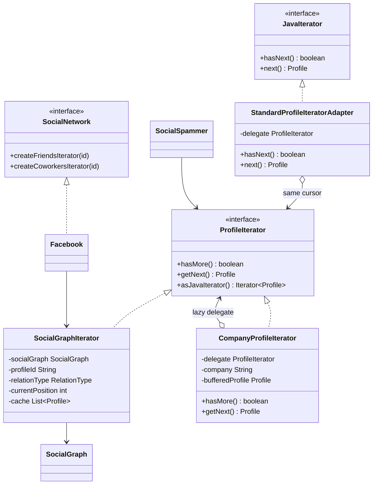
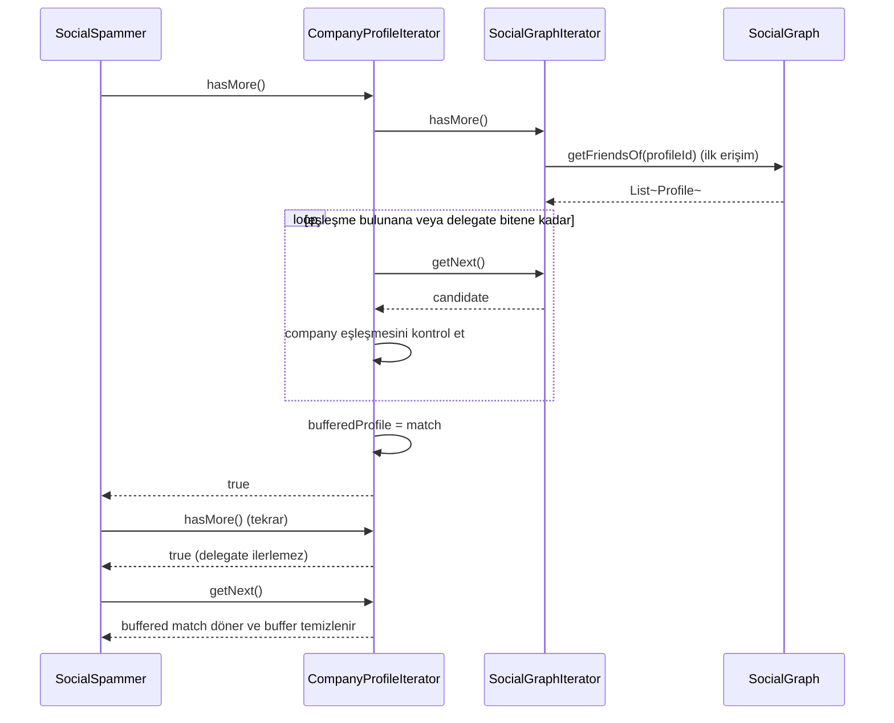
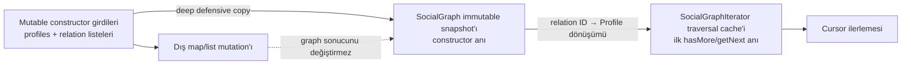

# Iterator — Yineleyici Deseni

> Temel örnek custom bir iterator sözleşmesi kullanır.
> Geriye uyumlu `asJavaIterator()` adaptörü aynı traversal’ı standart Java
> `Iterator` bitiş sözleşmesiyle de sunar.

## Kod organizasyonu ve composition sınırı

- Desen rolleri `com.can.behavirol.iterator` paketindedir.
- Çalıştırılabilir composition root `com.can.demo.behavioral.iterator.IteratorPatternDemo` sınıfıdır.
- Demo örnek sosyal grafiği kurar ve farklı iterator’ları tüketiciye verir; iterator implementasyonları ile `SocialSpammer` demo paketine bağımlı değildir.

Bu sınır önemlidir: graph fixture’ı öğretim verisidir, traversal kontratı ise yeniden kullanılabilir koddur. Testler demo `main` metoduna veya stdout’a bağlanmadan cursor, filtreleme, snapshot ve Java adapter davranışlarını domain API’si üzerinden ölçer.

## 30 saniyelik kart

| Soru | Kısa cevap |
|---|---|
| Niyet | Koleksiyonun iç yapısını açmadan elemanları sırayla gezmek |
| Değişen eksen | Gezinme türü, filtre, sıra ve cursor state’i |
| Ana bedel | Ek iterator nesneleri ve koleksiyon değişince snapshot tutarlılığı |
| Bu örnekte | Aynı sosyal grafikte friends ve coworkers gezintileri |
| Hafıza ipucu | “Koleksiyonu verme; sıradaki elemanı sorabileceğim bir kumanda ver.” |

## Örnek haritası: temel → güçlendirilmiş → production

| Katman | Bu repoda ne var? | Öğrettiği sınır |
|---|---|---|
| Temel örnek | `SocialGraphIterator` ile friends/coworkers gezintisi | Koleksiyon yapısını client’tan saklama ve bağımsız cursor state’i |
| Güçlendirilmiş örnek | `CompanyProfileIterator`, `StandardProfileIteratorAdapter` ve immutable `SocialGraph` snapshot’ı | Lazy filtre composition’ı, custom API’yi standart kontrata uyarlama ve snapshot zamanını aggregate sınırında sabitleme |
| Production sınırı | `Spliterator`, sayfalama, retry, snapshot/version politikası | Process içi tam cache’in büyük/uzak veri kaynağına ve backpressure’a yetmemesi |

## Akılda kalıcı analoji: müze sesli rehberi

Bir müzenin depolama planını bilmezsin.
Sesli rehber sana yalnız:

- sırada ziyaret edilecek eseri,
- gezi bitip bitmediğini,
- seçtiğin rotanın sırasını

söyler.

Çocuk rotasıyla tarih rotası aynı müzeyi farklı sırayla gezebilir.
Her cihaz kendi kaldığı yeri hatırlar.
Iterator da koleksiyon ile gezinme state’ini bu şekilde ayırır.

## Pattern olmasaydı problem ne olurdu?

Client doğrudan graph map’lerini bilirse traversal ayrıntısı dışarı sızar:

```java
for (String friendId : friendsByProfileId.get(profileId)) {
    Profile profile = profiles.get(friendId);
    send(profile.email());
}
```

Bu kod:

- map ve list yapısına bağımlıdır,
- dangling ID politikasını client’a taşır,
- friends ve coworkers için tekrarlanır,
- cursor’ı durdurup devam ettirmeyi zorlaştırır,
- veri kaynağı uzaktaki API olursa yeniden yazılır.

## Çözüm

`ProfileIterator`, client’a yalnız iki operasyon sunar:

```java
boolean hasMore();
Profile getNext();
```

`SocialGraphIterator` profil ID’sini, relation türünü, cursor’ı ve lazy cache’i kendi içinde tutar.
`Facebook`, istenen relation için doğru iterator’ı üreten aggregate/factory rolündedir.
`SocialSpammer`, graph yapısını görmeden iterator üzerinden ilerler.

Custom sözleşmeye bağlı olmayan Java kodu aynı nesne üzerinde
`profileIterator.asJavaIterator()` çağırabilir.
`StandardProfileIteratorAdapter`, `hasMore/getNext` çağrılarını
`hasNext/next` sözleşmesine çevirir; traversal bitince null yerine
`NoSuchElementException` üretir.

### Çözmediği şeyler

Iterator tek başına:

- graph verisini thread-safe yapmaz,
- veri kaynağının değişmesi halinde tutarlılık garantilemez,
- duplicate veya dangling relation’ı doğrulamaz,
- pagination, retry ve rate limit sağlamaz,
- doğru bitiş sözleşmesini otomatik seçmez.

## Repodaki roller

| Pattern rolü | Repodaki karşılığı | Sorumluluk |
|---|---|---|
| Iterator | `ProfileIterator` | `hasMore` ve `getNext` sözleşmesi |
| Concrete Iterator | `SocialGraphIterator` | Cursor, relation seçimi ve lazy cache |
| Iterator decorator | `CompanyProfileIterator` | Delegate iterator’ı şirket adına göre lazy süzer |
| Iterator adapter | `StandardProfileIteratorAdapter` | Custom null-sentinel sözleşmesini Java `Iterator` sözleşmesine çevirir |
| Aggregate arayüzü | `SocialNetwork` | Friends/coworkers iterator factory’leri |
| Concrete Aggregate | `Facebook` | `SocialGraphIterator` üretir |
| Veri sahibi | `SocialGraph` | Constructor girdilerinin immutable snapshot’ını tutar |
| Element | `Profile` | Gezilen immutable record |
| Relation seçimi | `RelationType` | `FRIENDS` veya `COWORKERS` |
| Client | `SocialSpammer` | Iterator’dan email adreslerini tüketir |
| Demo composition root | `com.can.demo.behavioral.iterator.IteratorPatternDemo` | Örnek graph’ı kurar |

## Yapı



## Çalışma akışı



## İki snapshot anı



İki katmanı ayırmak önemlidir:

1. `SocialGraph`, aldığı map’leri ve iç relation listelerini constructor’da kopyalar.
2. Her `SocialGraphIterator`, seçtiği relation’ın `List<Profile>` sonucunu ilk erişimde kendi cache’ine alır.

Birinci katman aggregate’i dış mutation’dan korur.
İkinci katman her traversal’a bağımsız cursor ve sabit bir gezi listesi verir.

## Kod execution trace

1. Demo profile ve relation map’lerini oluşturur.
2. `SocialGraph` bu map’leri ve iç listeleri defensive copy ile sabitler.
3. `Facebook#createFriendsIterator("1")` yeni iterator üretir.
4. Iterator constructor’ı graph’a henüz sorgu yapmaz.
5. İlk `hasMore()` çağrısı `lazyInit()` metodunu tetikler.
6. Exhaustive `switch`, `FRIENDS` relation’ını seçer.
7. Graph ID listesini profile listesine dönüştürür.
8. Bulunamayan profile ID’leri `filter` ile sessizce çıkarılır.
9. Elde edilen `Stream.toList()` sonucu iterator cache’ine yazılır.
10. `hasMore`, cursor cache boyutundan küçükse true döner.
11. `getNext`, mevcut profile’ı alıp cursor’ı bir artırır.
12. Custom API bitişte null döner; standart adapter aynı noktada `NoSuchElementException` üretir.

Friends ve coworkers iterator’ları ayrı nesnelerdir.
Bu yüzden cursor state’leri birbirini bozmaz.
Bu ifade thread-safe oldukları anlamına gelmez.

`CompanyProfileIterator`, delegate’den eşleşen profile ulaşana kadar ilerler.
`hasMore()` sırasında bulunan eşleşmeyi buffer’da sakladığı için tekrarlı `hasMore()` çağrıları sonucu tüketmez; `getNext()` buffer’ı döndürüp temizler.

## API, invariant ve sonuç semantiği

- Yeni `SocialGraphIterator` nesnesinin `currentPosition` değeri sıfırdır.
- `SocialGraphIterator#hasMore()` cursor’ı ilerletmez.
- `SocialGraphIterator#getNext()` başarılı olduğunda cursor’ı tam bir artırır.
- Bitişte `hasMore()` false, `getNext()` null döner.
- Bu null sentinel, Java `Iterator#next()` sözleşmesinden farklıdır.
- `asJavaIterator()` yeni iterator/cursor üretmez; mevcut delegate traversal’ını tüketir.
- Adapter bitişte null değerini `NoSuchElementException` olarak çevirir.
- Relation listesinin sırası sonuç sırasını belirler.
- Duplicate ID duplicate profile üretebilir.
- Bilinmeyen source profile boş relation gibi davranır.
- Graph’ta bulunmayan relation ID’si sessizce filtrelenir.
- Cache ilk erişimde oluşur ve daha sonra yenilenmez.
- Null `socialGraph`, `profileId` ve `relationType` constructor’da fail-fast reddedilir.
- Relation seçimi exhaustive `switch` ile yapılır; enum’a yeni değer eklemek compile-time güncelleme gerektirir.
- `CompanyProfileIterator` şirket adını case-insensitive karşılaştırır.
- Null/blank şirket filtresi constructor’da reddedilir, geçerli değer trim edilir.
- Filtre iterator’ının buffer’ı en fazla bir `Profile` taşır.
- Filtre iterator’ının ilk `hasMore()` çağrısı eşleşme ararken delegate cursor’ını ilerletebilir.
- Eşleşme buffer’a girdikten sonraki tekrarlı `hasMore()` çağrıları delegate’i yeniden ilerletmez.

## Lazy cache ve mutation zamanı

`SocialGraph` constructor girdilerini shallow değil, relation listelerini de kapsayan
defensive copy ile saklar.
Constructor döndükten sonra caller’ın:

- profile map’ine yeni profil eklemesi,
- mevcut friend ID listesine eleman eklemesi,
- relation map’ine yeni anahtar yazması

aggregate’in sonucunu değiştirmez.

Iterator cache’i yine ilk `hasMore/getNext` sırasında oluşur; buradaki laziness
dış mutation’ı görmek için değil, traversal maliyetini gerçekten kullanılacağı ana
ertelemek içindir.
İleride `SocialGraph`a kontrollü mutator veya uzak veri kaynağı eklenirse
“aggregate version’ı mı, iterator oluşturma anı mı, ilk erişim mi?” kararı yeniden
açıkça verilmelidir.

## Test kontrat haritası

| `@Nested` grup | Korunan davranış |
|---|---|
| `RelationTraversal` | Friends sırası ve coworkers filtresi |
| `CursorState` | Idempotent `hasMore`, ilerleme, bağımsız iterator, null bitiş |
| `EmptyTraversal` | Bilinmeyen source ve dangling relation davranışı |
| `IteratorComposition` | Lazy şirket filtresi, ölçüt normalizasyonu/validasyonu ve buffered `hasMore` idempotency’si |
| `StandardIteratorCompatibility` | Java bitiş sözleşmesi ve adapter/delegate ortak cursor’ı |
| `AggregateSnapshot` | Constructor-time deep snapshot ve null relation fail-fast davranışı |

Testler client’ın graph map’lerine erişmesini gerektirmez.
İki iterator interleaved ilerletilerek cursor isolation doğrudan gözlenir.

## Edge case, security, concurrency ve performans

- Custom API’nin null sentinel’i, sonuç domain’i ileride null profile’a izin verirse belirsizleşir; standart adapter bu yüzden daha güvenli sınırdır.
- `SocialGraph` iç durumu immutable snapshot’tır; iterator cursor’ları ise thread-safe değildir.
- Aynı custom iterator ile ondan üretilen adapter eşzamanlı tüketilmemelidir; aynı cursor’ı paylaşırlar.
- Remote graph’ta lazy init ilk çağrıyı beklenmedik biçimde yavaşlatabilir.
- `SocialGraphIterator` cache oluştuktan sonra `hasMore/getNext` için O(1) çalışır.
- `CompanyProfileIterator#hasMore`, sıradaki eşleşmeye kadar k adayı tararsa O(k) çalışır; bütün traversal toplamda O(n)’dir.
- `SocialSpammer` adı ve davranışı production ileti izinlerini modellemez.

Production’da adapter’ın ötesinde `Iterable`, `Spliterator`, stream, cursor pagination veya reactive publisher seçenekleri değerlendirilmelidir.

## Ne zaman kullan?

- Veri yapısını client’tan gizlemek istiyorsan,
- aynı veri üzerinde birden çok traversal gerekiyorsa,
- gezinmeyi durdurup devam ettirmek gerekiyorsa,
- koleksiyon ileride listeden tree/API’ye dönüşebilecekse,
- client yalnız eleman sırasını tüketmeliyse.

## Ne zaman kullanma?

- Basit bir `List` ve for-each yeterliyse,
- bütün veri tek seferde map/filter operasyonuyla işlenecekse,
- snapshot tutarlılığı tanımlanmamış mutable kaynakta kritikse,
- async/backpressure gereken akış custom sync iterator’a sıkıştırılıyorsa.

## Artılar ve bedeller

| Artı | Bedel |
|---|---|
| Koleksiyon temsili gizlenir | Ek arayüz ve sınıflar oluşur |
| Cursor ayrı nesnede yaşar | Iterator invalidation politikası gerekir |
| Birden çok bağımsız gezinti olur | Cache bellek tüketebilir |
| Client traversal ayrıntısını bilmez | Hata ve bitiş sözleşmesi tasarlanmalıdır |
| Farklı sıra/filtre eklenebilir | Yeni relation mevcut aggregate API’sini değiştirebilir |

## En çok karışan desen: Strategy

| Iterator | Strategy |
|---|---|
| Bir yapıda nasıl ilerlediğini ve nerede kaldığını taşır | Bir işi hangi algoritmayla yaptığını taşır |
| Cursor state’i tipiktir | Algoritmalar çoğunlukla bağımsızdır |
| Sonuç eleman dizisidir | Sonuç tek hesaplama olabilir |
| Aggregate ile birlikte çalışır | Context ile birlikte çalışır |

Bir traversal’ın sıralama algoritması Strategy olabilir; gezinti state’i yine Iterator’da kalır.

## Yaygın hatalar

1. Bitiş davranışını dokümante etmemek.
2. `hasMore()` içinde cursor ilerletmek.
3. İki iterator’a ortak cursor vermek.
4. Mutable koleksiyonun snapshot zamanını belirsiz bırakmak.
5. Null relation’ı varsayılan kola düşürmek.

## Alıştırmalar

### Seviye 1 — Gözlemle

İki friends iterator üret.
Birini iki adım, diğerini bir adım ilerlet ve cursor’ların bağımsızlığını test et.

### Seviye 2 — Standart API ile genişlet

`StandardProfileIteratorAdapter` için `forEachRemaining` kullanan bir client yaz.
Adapter ve delegate’in aynı cursor’ı paylaştığını göster; ardından bağımsız traversal
gereken kullanımda neden aggregate’den yeni iterator istenmesi gerektiğini açıkla.

### Seviye 3 — Ölçekle

Graph’ın uzak API’den sayfa sayfa geldiğini varsay.
Cursor token, retry, cache ve rate-limit davranışlarını içeren lazy iterator tasarla.

## Hafıza cümlesi

**Iterator, koleksiyonun kapısını açmaz; sana yalnız sıradaki elemanı ve yolun bitip bitmediğini söyler.**
