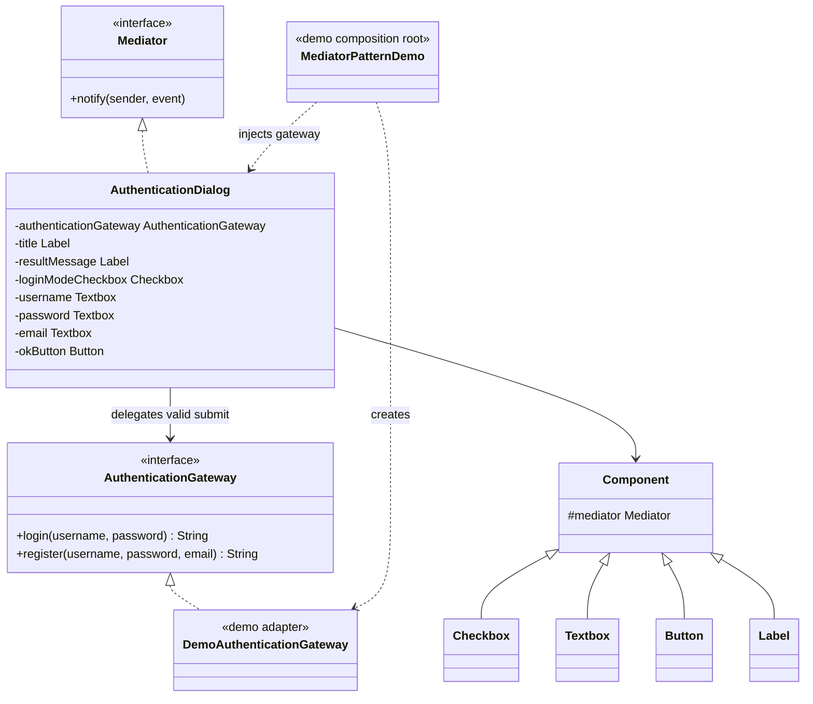
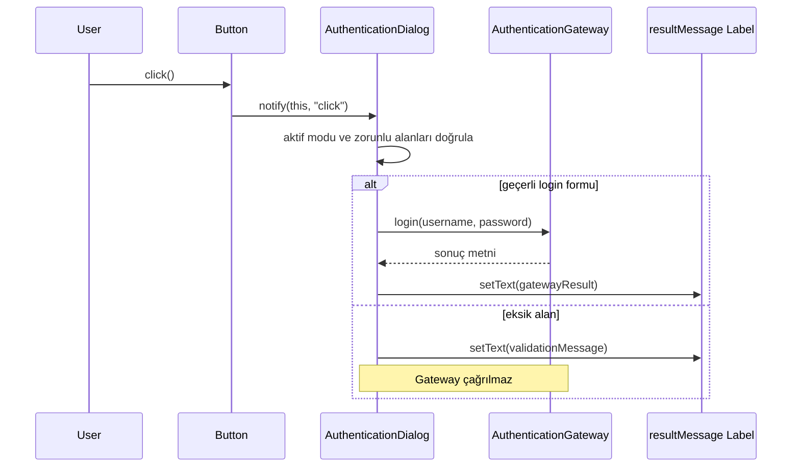

# Mediator — Arabulucu Deseni

> Bu bölüm küçük bir UI koordinasyon demosunu anlatır.
> Gerçek authentication, email doğrulama veya parola güvenliği sağlamaz.

## Kod organizasyonu ve composition sınırı

- Desen rolleri `com.can.behavirol.mediator` paketindedir.
- Çalıştırılabilir composition root `com.can.demo.behavioral.mediator.MediatorPatternDemo` sınıfıdır.
- Dış sistem olmadan çalışmayı sağlayan adapter `com.can.demo.behavioral.mediator.DemoAuthenticationGateway` sınıfıdır. Demo composition root bu adapter’ı açıkça `AuthenticationDialog` constructor’ına verir.
- Component’ların koordinasyonu `AuthenticationDialog` mediator’ında, dış kimlik sistemi sınırı ise domain paketindeki `AuthenticationGateway` arayüzündedir; domain kodu demo adapter’ını bilmez.

Production composition root gerçek gateway adapter’ını constructor üzerinden vermek zorundadır. Testler kendi test-scope stub/fake gateway’lerini kullanır; demo adapter’ına veya demo akışına bağlanmadan mediator’ın component görünürlüğü, doğrulama ve gateway delegasyonu kontratlarını ölçer.

## 30 saniyelik kart

| Soru | Kısa cevap |
|---|---|
| Niyet | Bir grup nesnenin birbirini doğrudan bilmeden merkezi bir koordinatör üzerinden iletişim kurması |
| Değişen eksen | Bileşen olaylarına karşı hangi bileşenlerin nasıl tepki vereceği |
| Ana bedel | Bağımlılıklar azalırken mediator büyüyüp God Object olabilir |
| Bu örnekte | Login/register formundaki checkbox, textbox ve button davranışları |
| Hafıza ipucu | “Herkes birbirini aramasın; kuleyle konuşsun.” |

## Örnek haritası: temel → güçlendirilmiş → production

| Katman | Bu repoda ne var? | Öğrettiği sınır |
|---|---|---|
| Temel örnek | `AuthenticationDialog` ile checkbox, textbox, label ve button koordinasyonu | Colleague nesnelerinin birbirini bilmeden mediator’a olay göndermesi |
| Güçlendirilmiş örnek | Zorunlu constructor injection ile `AuthenticationGateway`; demo paketindeki `DemoAuthenticationGateway`; test-scope stub/fake | UI koordinasyonu ile login/register yan etkisinin ayrı sınırlar olması; domain’in demo adapter’ına bağımlı olmaması |
| Production sınırı | Typed UI event’leri, validation nesneleri, async durum, gerçek auth adapter’ı ve secret temizliği | String event ve demo adapter’ın güvenli authentication sağlamaması |

## Akılda kalıcı analoji: hava trafik kontrol kulesi

Uçaklar iniş sırasını birbirleriyle pazarlık etmez.
Her uçak konumunu kuleye bildirir.
Kule bütün resmi görür ve:

- kimin bekleyeceğini,
- hangi pistin kullanılacağını,
- ne zaman iniş izni verileceğini

koordine eder.

Uçaklar birbirini tanımadığı için iletişim ağı N×N bağlantıya dönüşmez.
Mediator, UI bileşenleri için kontrol kulesi rolündedir.

## Pattern olmasaydı problem ne olurdu?

Checkbox diğer bileşenleri doğrudan yönetirse title, email ve button gibi concrete bağımlılıklar ona yayılır.

Bu tasarımda:

- checkbox title, email ve button’ı bilir,
- button username/password/email kurallarını bilir,
- bileşen başka formda zor yeniden kullanılır,
- değişiklik birden çok sınıfa yayılır,
- test fixture’ı bütün bağlantıları kurmak zorunda kalır.

## Çözüm

Component yalnız olayı mediator’a bildirir:

```java
mediator.notify(this, "check");
```

Concrete mediator olan `AuthenticationDialog`, sender ve event’e göre koordinasyon kararını verir.
Bileşenler birbirlerinin sınıfını veya alanlarını bilmez.
Form kuralı tek koordinasyon noktasında görünür olur.
Alanlar geçerliyse mediator yan etkiyi `AuthenticationGateway` sınırına delege eder.

### Çözmediği şeyler

Mediator tek başına:

- form verisini güvenli doğrulamaz,
- event isimlerini type-safe yapmaz,
- async event queue sağlamaz,
- mediator’ın büyümesini engellemez,
- component state’inin dışarıdan değiştirilmesini otomatik yasaklamaz,
- domain service çağrılarını transaction içine almaz.

## Repodaki roller

| Pattern rolü | Repodaki karşılığı | Sorumluluk |
|---|---|---|
| Mediator | `Mediator` | `notify(sender, event)` sözleşmesi |
| Concrete Mediator | `AuthenticationDialog` | Mod geçişi ve submit koordinasyonu |
| Dış servis portu | `AuthenticationGateway` | Login/register yan etkisinin UI’dan bağımsız sözleşmesi |
| Demo adapter | `com.can.demo.behavioral.mediator.DemoAuthenticationGateway` | Yalnız demo akışını dış sistem olmadan çalıştıran cevaplar |
| Base Colleague | `Component` | Mediator referansını taşır |
| Colleague | `Checkbox` | Checked state ve `"check"` olayı |
| Colleague | `Textbox` | Text/visibility state ve `"input"` olayı |
| Colleague | `Button` | Ad ve `"click"` olayı |
| Colleague | `Label` | Başlık/sonuç metni |
| Demo composition root | `com.can.demo.behavioral.mediator.MediatorPatternDemo` | Kullanıcı etkileşimlerini simüle eder |

## Yapı



## Olay akışı



## Kod execution trace

### İlk oluşturma

Dialog component’leri kendi mediator referansıyla üretir.
Constructor’daki `setChecked(true)` bir `"check"` olayı göndererek başlığı, email görünürlüğünü ve bilgi mesajını hazırlar.

Başlangıç result label’ı önce boş oluşturulsa da constructor sonunda boş değildir.

### Register moduna geçiş

1. Checkbox false yapılır.
2. Dialog sender identity ve `"check"` event’ini eşleştirir.
3. Başlık `"Kayıt Ol"` olur.
4. Email görünür olur.
5. Bilgi mesajı register modunu bildirir.

### Submit

1. Button click, `"click"` olayı gönderir.
2. Dialog aktif modu checkbox state’inden okur.
3. Login modunda username ve password için `isBlank()` kontrolü yapar.
4. Register modunda email de zorunludur.
5. Alanlar geçerliyse login/register isteği `AuthenticationGateway` metoduna gider.
6. Gateway sonucu label’a yazılır; eksik alanda gateway hiç çağrılmaz.

## API, invariant ve sonuç semantiği

- `checked=true` login, `checked=false` register anlamına gelir.
- Login modunda email görünmez; register modunda görünür.
- `setChecked`, değer değişmese bile her çağrıda event gönderir.
- Textbox her `enterText` çağrısında `"input"` olayı gönderir.
- Dialog mevcut `"input"` olayına tepki vermez.
- Button yalnız `"click"` olayı gönderir; button adı karar için kullanılmaz.
- Sender karşılaştırması identity (`==`) ile yapılır.
- Bilinmeyen sender/event sessizce yok sayılır.
- Result string hem doğrulama hem başarı bilgisini taşır.
- Mod değişiminde textbox içerikleri temizlenmez.
- `AuthenticationDialog` yalnız `AuthenticationGateway` alan constructor sunar; adapter seçimi gizli bir default değildir.
- Null gateway constructor sınırında reddedilir.
- Demo composition root demo adapter’ını, production composition root gerçek adapter’ı, test ise test-scope stub/fake’i açıkça enjekte eder.

## Dışarı açılan component riski

Dialog getter’ları gerçek component nesnelerini döndürür.
Client örneğin:

```java
dialog.getEmail().setVisible(false);
```

çağrısıyla mediator koordinasyonunu bypass edebilir.
Bu yüzden “bütün state yalnız mediator’dan değişir” iddiası mevcut API için tam doğru değildir.
Production tasarımında kullanıcı aksiyon API’si ile internal component mutator’ları ayrılabilir.

## Test kontrat haritası

| `@Nested` grup | Korunan davranış |
|---|---|
| `InitialState` | Test-scope stub enjekte edildiğinde login başlangıcı, görünürlük ve constructor mesajı |
| `ModeSwitching` | Register’a geçiş ve login’e dönüş |
| `LoginSubmission` | Zorunlu alan reddi ve başarı |
| `RegistrationSubmission` | Email zorunluluğu ve başarı |
| `GatewayBoundary` | Geçerli login’in delege edilmesi ve invalid formda servisin çağrılmaması |

Testler UI framework’ü başlatmadan mediator state’ini doğrudan gözler.
Başarı metni gereken senaryolar küçük bir `StubAuthenticationGateway`, çağrı ayrıntısı gereken sınır senaryoları ise recording fake kullanır; production ve demo adapter’ları test source set’ine sızmaz.

## Edge case, security, concurrency ve performans

- Event’ler String olduğu için typo compile-time’da yakalanmaz.
- `enterText(null)`, submit sırasında `isBlank()` NPE’sine dönüşür.
- Email yalnız non-blank kontrolünden geçer; format doğrulaması yoktur.
- Mode değişiminde password ve email bellekte kalır.
- Public setters mediator invariant’larını dışarıdan bozabilir.
- Thread-safe değildir; tipik tek UI thread varsayımına dayanır.
- Component sayısı büyüdükçe concrete mediator koşul yığınına dönüşebilir.
- Gerçek login/kayıt servisi, parola hash’i veya ağ çağrısı yoktur.

Production’da typed event, command binding, validation service ve sensitive-field temizleme politikası gerekir.

## Ne zaman kullan?

- Bir component grubu birbirini yoğun biçimde çağırıyorsa,
- form/workflow koordinasyonu merkezi görünmeliyse,
- component’ler başka ekranlarda yeniden kullanılacaksa,
- N×N iletişim bağlantısı büyüyorsa,
- sender’lar concrete receiver ayrıntısını bilmemeliyse.

## Ne zaman kullanma?

- Yalnız iki nesne arasında sade ve kalıcı bir ilişki varsa,
- merkezi mediator domain’in tüm iş mantığını yutacaksa,
- event bus gibi global ve izlenmesi zor bir arabulucu oluşturulacaksa,
- compile-time bağımlılıklar yerine String protokolüyle hatalar gizlenecekse.

## Artılar ve bedeller

| Artı | Bedel |
|---|---|
| Colleague’ler birbirini bilmez | Mediator bütün colleague’leri bilir |
| Koordinasyon tek yerde görülür | O sınıf hızla büyüyebilir |
| Component yeniden kullanılabilir | Event protokolü ayrıca tasarlanır |
| Entegrasyon testi sadeleşebilir | Tek merkez değişiklik çatışması yaratabilir |
| N×N bağlantı azalır | Mediator arızası bütün akışı etkiler |

## En çok karışan desen: Observer

| Mediator | Observer |
|---|---|
| Koordinasyon kararını merkezi nesne verir | Publisher olayı abonelere yayınlar |
| Colleague’lerin davranışını yönlendirir | Subscriber kendi tepkisini seçer |
| Genellikle belirli component grubunu bilir | Publisher yalnız subscriber arayüzünü bilir |
| İki yönlü diyalog görülebilir | Çoğunlukla birden çoğa bildirimdir |

Mediator içinde Observer kullanılarak component event’leri yayınlanabilir; niyetleri yine farklıdır.

## Yaygın hatalar

1. Mediator’ı bütün uygulamanın global God Object’i yapmak.
2. String event isimlerini merkezi sabit olmadan kullanmak.
3. Component state’ini hem mediator hem dış client’ın değiştirmesi.
4. Domain validation’ı UI koordinasyonuyla karıştırmak.
5. Bilinmeyen event’leri gözlenmeden yutmak.

## Alıştırmalar

### Seviye 1 — Gözlemle

Fake bir `Mediator` yaz.
Button, Checkbox ve Textbox’ın doğru sender/event ikilisini gönderdiğini test et.

### Seviye 2 — Type-safe yap

String event yerine `ComponentEvent` enum veya sealed hierarchy tasarla.
Unknown event durumunun compile-time etkisini karşılaştır.

### Seviye 3 — Sınırları ayır

Form koordinasyonunu, credential validation’ı ve authentication service çağrısını üç ayrı sorumluluğa böl.
Mediator’ın hangi katmanda kalacağını bir sequence diagram ile göster.

## Hafıza cümlesi

**Mediator, bileşenlerin birbirini aramasını engeller; herkes olayı kontrol kulesine bildirir, koordinasyonu kule yapar.**
