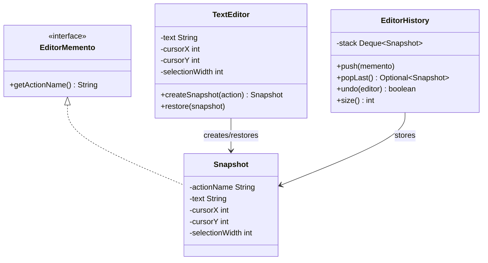
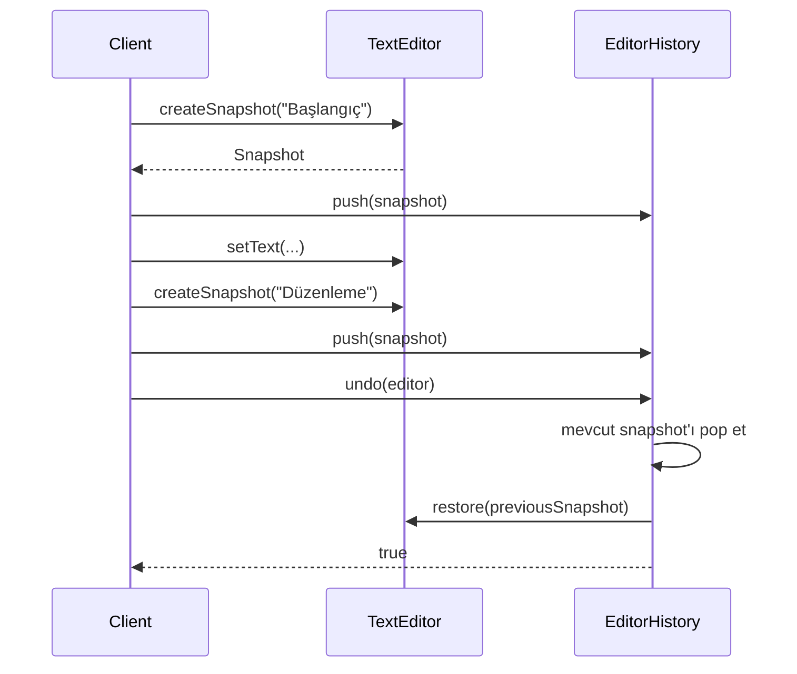

# Memento — Anlık Görüntü Deseni

> Bu bölüm repodaki editör snapshot demosunu anlatır.
> Demo tek adım gösterir; `EditorHistory#undo` ardışık geri almayı yönetir, fakat redo sunmaz.

## 30 saniyelik kart

| Soru | Kısa cevap |
|---|---|
| Niyet | Bir nesnenin iç durumunu kapsüllemeyi bozmadan kaydetmek ve geri yüklemek |
| Değişen eksen | Hangi state’in, ne zaman ve ne kadar geçmişle saklandığı |
| Ana bedel | Snapshot üretme ve geçmişi bellekte tutma maliyeti |
| Bu örnekte | Editör metni, cursor ve selection tek snapshot’ta tutulur |
| Hafıza ipucu | “Oyunu kaydet; karakterin iç alanlarını dışarı dökmeden o ana dön.” |

## Örnek haritası: temel → güçlendirilmiş → production

| Katman | Bu repoda ne var? | Öğrettiği sınır |
|---|---|---|
| Temel örnek | `TextEditor#createSnapshot`, `restore` ve `EditorHistory#push/popLast` | Originator’ın tam state’i kapsüllenmiş immutable snapshot olarak üretmesi |
| Güçlendirilmiş örnek | `EditorHistory#undo(TextEditor)` ve `size()` | “Mevcut snapshot’ı çıkar, öncekini stack’te tutup restore et” protokolünün caretaker’a ait olması |
| Production sınırı | Redo stack’i, bounded history, diff/command log, snapshot versioning ve secret politikası | Tam metin snapshot’larının bellek maliyeti ve persistence eksikliği |

## Akılda kalıcı analoji: video oyunu kayıt noktası

Oyuncu bir kayıt noktasına ulaştığında oyun:

- konumu,
- envanteri,
- sağlık değerini,
- görev ilerlemesini

tek bir kayıt olarak saklar.

Kayıt menüsü bu alanları nasıl yorumlayacağını bilmez.
Yalnız kayıtları listeler ve seçileni oyuna geri verir.
State’i nasıl üreteceğini ve okuyacağını asıl oyun nesnesi bilir.

## Pattern olmasaydı problem ne olurdu?

History editörün text, cursor ve selection alanlarını getter’larla okuyup kendi backup nesnesini kurarsa kapsülleme sızar.

Bu yaklaşımda:

- originator private state’ini getter’larla açar,
- yeni alan eklenince caretaker değişir,
- restore sırası dış sınıfın sorumluluğu olur,
- geçersiz kısmi state üretilebilir,
- snapshot formatı domain dışına yayılır.

## Çözüm

Originator kendi snapshot’ını üretir.
Snapshot state’i immutable biçimde saklar.
Caretaker snapshot’ları stack/history içinde tutar.
Geri yükleme gerektiğinde `undo(originator)`, mevcut snapshot’ı düşürür ve önceki snapshot’ı originator’a geri verir.

### Çözmediği şeyler

Memento tek başına:

- hangi anda snapshot alınacağını belirlemez,
- redo protokolünü otomatik kurmaz,
- sınırsız history’yi sınırlandırmaz,
- mutable alanlar için otomatik deep copy yapmaz,
- snapshot persistence/şifreleme sağlamaz,
- başka originator’a ait snapshot kullanımını engellemez.

## Repodaki roller

| Pattern rolü | Repodaki karşılığı | Sorumluluk |
|---|---|---|
| Originator | `TextEditor` | State’i değiştirir, snapshot üretir ve restore eder |
| Narrow Memento | `TextEditor.EditorMemento` | Caretaker’a yalnız action adını gösterir |
| Concrete Memento | `TextEditor.Snapshot` | Text, cursor ve selection state’ini immutable tutar |
| Caretaker | `EditorHistory` | Snapshot’ları LIFO saklar ve ardışık undo protokolünü yönetir |
| Client | `MementoPatternDemo` | Snapshot zamanını seçer ve caretaker’dan undo ister |

## Yapı

## Snapshot ve restore akışı

## Kod execution trace

1. Yeni editor boş text ve sıfır koordinatlarla başlar.
2. Client `"Başlangıç"` snapshot’ını alıp history’ye koyar.
3. Text, cursor ve selection değiştirilir.
4. `"Başlık yazıldı"` snapshot’ı alınır.
5. İkinci düzenlemeden sonra üçüncü snapshot alınır.
6. Client `history.undo(editor)` çağırır.
7. Caretaker mevcut durumu pop eder, önceki durumu stack üzerinde bırakıp editor’e restore eder.
8. Aynı işlem stack’te en eski snapshot kalana kadar güvenle tekrarlanabilir.
9. Kalan history timeline olarak stdout’a yazılır.

Snapshot constructor’ı private’dır.
Concrete snapshot’ın alanları final’dır.
String ve int alanlar kullanıldığı için mevcut state shallow-copy açısından güvenlidir.

## API, invariant ve sonuç semantiği

- `createSnapshot` çağrı anındaki dört state değerini yakalar.
- Sonraki editor değişiklikleri mevcut snapshot’ı değiştirmez.
- `restore` text, iki cursor koordinatı ve selection’ı birlikte geri yükler.
- `EditorHistory` LIFO çalışır.
- Boş history `Optional.empty()` döndürür.
- Action adı caretaker tarafından okunabilir.
- `push` parametresi `EditorMemento` olsa da yalnız `Snapshot` instance’ını saklar.
- Başka bir `EditorMemento` implementasyonu sessizce yok sayılır.
- `popLast` narrow interface değil concrete `Snapshot` döndürür.
- Snapshot belirli bir editor identity’sine bağlı değildir.
- `undo` için en az iki snapshot gerekir; aksi durumda state’i değiştirmeden `false` döner.
- Başarılı `undo`, mevcut snapshot’ı kaldırır fakat restore edilen snapshot’ı stack’te bırakır.
- `undo(null)`, stack boyutuna veya `pop` işlemine geçmeden fail-fast NPE üretir; history ve geçerli editor state’i değişmeden kalır.

## Güçlendirme: ardışık undo protokolü caretaker’da

History’ye mevcut state de konur.
Bu yüzden undo kavramsal olarak iki işlemdir:

- mevcut state atılır,
- önceki state restore edilir.

Eski client kodundaki iki `popLast()` yaklaşımı restore edilen snapshot’ı da stack’ten çıkardığı için ardışık undo’da durum atlıyordu.
`EditorHistory#undo` önce editor precondition’ını doğrular; ardından restore edilen snapshot’ı `peek()` ile okur ve stack’te bırakır.
Böylece sonraki undo onu “mevcut durum” olarak doğru biçimde kaldırabilir.

## Kapsülleme nüansı

Snapshot alanları dışarı açılmaz; ancak caretaker concrete `Snapshot` tipini bilir ve client herhangi bir snapshot’ı herhangi bir editor’e restore ettirebilir.

## Test kontrat haritası

| `@Nested` grup | Korunan davranış |
|---|---|
| `SnapshotCreation` | Tam state yakalama, action metadata ve immutability |
| `HistoryStack` | LIFO sıra ve empty Optional |
| `SingleStepUndo` | Restore edilen snapshot’ın history’de bırakıldığı tek adım undo |
| `EncapsulatedUndo` | Caretaker ile ardışık undo, en eski snapshot sınırı ve null editor hatasında snapshot tüketmeyen atomik precondition |

Testler private snapshot alanlarını reflection ile açmaz.
State yalnız restore sonrası `viewState()` üzerinden gözlenir.

## Edge case, security, concurrency ve performans

- Null snapshot restore doğrudan NPE üretir.
- Null editor ile `undo`, history yetersiz olsa bile önce fail-fast olur ve hiçbir snapshot tüketmez.
- Negatif cursor ve selection değerleri doğrulanmaz.
- `printTimeline` caretaker’ı stdout’a bağlar.
- Her snapshot text uzunluğu n için O(n) bellek tüketebilir.
- m snapshot yaklaşık O(m×n) metin belleğine çıkabilir.
- Mutable nesne alanı eklenirse immutable snapshot için deep copy gerekebilir.

Production’da bounded history, redo stack, command diff’leri ve hassas veri politikası ayrıca tasarlanmalıdır.

## Ne zaman kullan?

- Undo/rollback gerekiyor ve state dışarı açılmamalıysa,
- checkpoint alınacaksa,
- object state geçmişi tutulacaksa,
- transaction öncesi local geri dönüş noktası gerekiyorsa,
- state’i doğru biçimde kopyalamayı originator biliyorsa.

## Ne zaman kullanma?

- State çok büyük ve snapshot çok sık alınacaksa,
- event log zaten state’i tekrar üretebiliyorsa,
- yalnız tek alan için basit eski değer yeterliyse,
- dağıtık transaction Memento ile çözülmeye çalışılıyorsa,
- snapshot’ta secret saklama politikası yoksa.

## Artılar ve bedeller

| Artı | Bedel |
|---|---|
| Originator encapsulation’ı korunur | Snapshot bellek maliyeti yaratır |
| State atomik paketlenir | Ne zaman snapshot alınacağı client’a kalır |
| Caretaker state ayrıntısını değiştirmez | History yaşam döngüsü ayrıca tasarlanır |
| Undo modeli okunaklı olur | Mutable graph için deep copy zor olabilir |
| Snapshot immutable olabilir | Versioning ve persistence maliyeti doğar |

## En çok karışan desen: Command

| Memento | Command |
|---|---|
| Bir andaki state’i temsil eder | Yapılacak/yapılmış eylemi temsil eder |
| Restore merkezlidir | Execute/undo davranışı merkezlidir |
| Originator snapshot üretir | Client concrete command üretir |
| Bellek maliyeti state boyutuna bağlıdır | Maliyet command parametrelerine bağlı olabilir |

Command, undo için Memento saklayabilir.
İkisi rakip değil, sık kullanılan tamamlayıcılardır.

## Yaygın hatalar

1. Snapshot’ın mutable nesnelere canlı referans tutması.
2. History’ye sınırsız snapshot koymak.
3. Snapshot alma zamanını belirsiz bırakmak.
4. Undo ve redo stack’lerini aynı sanmak.
5. Concrete memento içeriğini caretaker’a açmak.

## Alıştırmalar

### Seviye 1 — Gözlemle

Üç farklı editor state’i üret.
Snapshot’ları LIFO pop et ve action adlarının ters sırada geldiğini test et.

### Seviye 2 — Ardışık undo

History’nin mevcut state’i nasıl temsil edeceğine karar ver.
Üç ardışık undo ve sınırda no-op davranışı için API tasarla.

### Seviye 3 — Undo/redo

Undo ve redo stack’leri ekle.
Undo sonrası yeni edit yapıldığında redo geçmişinin neden temizlenmesi gerektiğini testle göster.

## Hafıza cümlesi

**Memento, nesnenin içini dışarı dökmeden “şu andaki halimi sakla, sonra beni bu hale döndür” demesidir.**
