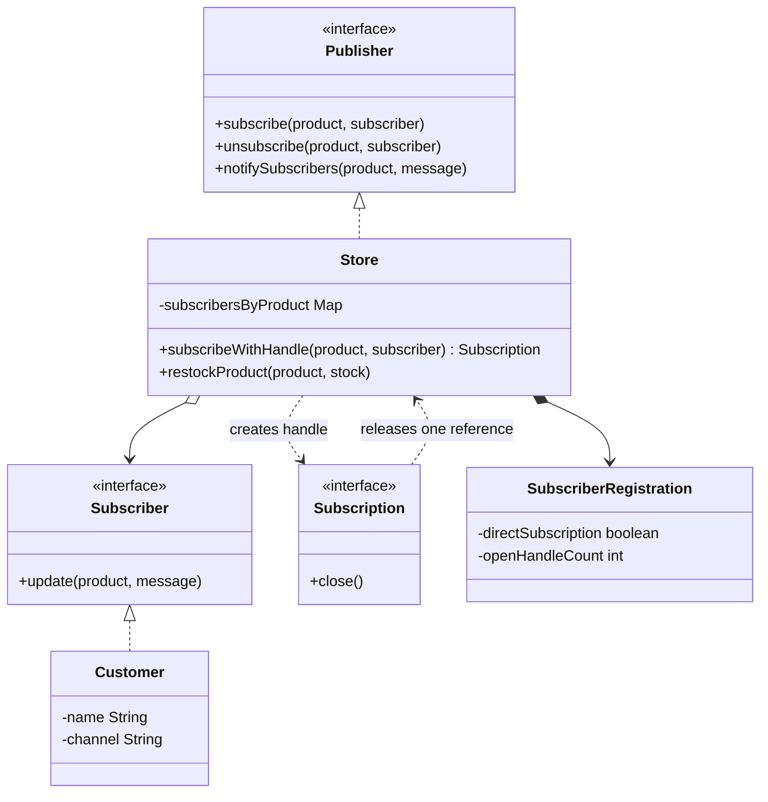
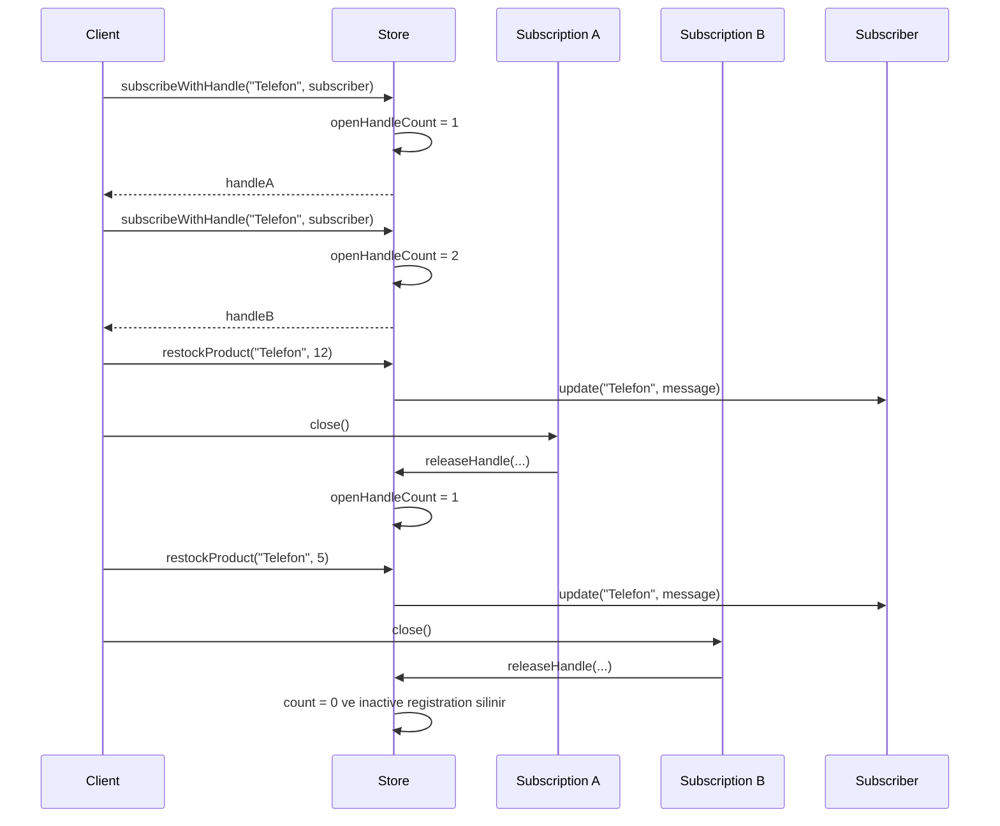

# Observer — Gözlemci Deseni

> Bu örnek synchronous, process içi ve stdout tabanlı bir bildirim demosudur.
> Gerçek SMS, e-posta, push altyapısı veya güvenilir event delivery sağlamaz.

## 30 saniyelik kart

| Soru | Kısa cevap |
|---|---|
| Niyet | Bir publisher’daki olayı dinleyen değişken sayıdaki subscriber’a otomatik bildirmek |
| Değişen eksen | Kimlerin hangi konuya abone olduğu ve olaya nasıl tepki verdiği |
| Ana bedel | Görünmeyen callback zincirleri, yaşam döngüsü ve hata yayılımı |
| Bu örnekte | Müşteriler ürün adına abone olur, restock mesajı alır |
| Hafıza ipucu | “Gazeteyi herkese sorma; isteyen abone olsun, baskı çıkınca dağıt.” |

## Örnek haritası: temel → güçlendirilmiş → production

| Katman | Bu repoda ne var? | Öğrettiği sınır |
|---|---|---|
| Temel örnek | `Store`, `Publisher`, `Subscriber` ve `Customer` | Ürün bazlı synchronous birden-çoğa bildirim |
| Güçlendirilmiş örnek | `LinkedHashMap`, reference-counted `Subscription` handle’ları ve snapshot iteration | Duplicate doğrudan aboneliği önleme, bağımsız sahiplik ve callback içinde güvenli unsubscribe |
| Production sınırı | Immutable event, failure isolation, executor/backpressure, retry/DLQ ve metrics | Process içi callback’in güvenilir broker veya async delivery olmaması |

## Akılda kalıcı analoji: dergi aboneliği

Bir derginin yeni sayısı çıktığında yayınevi:

- abone listesini açar,
- her aboneye aynı sayı haberini gönderir,
- abonelikten çıkan kişiye artık göndermez.

Yayınevi okuyucunun bildirimi nasıl işleyeceğini bilmez.
Okuyucu da derginin üretim ayrıntısını bilmez.
Aralarındaki ortak sözleşme bildirimdir.

## Pattern olmasaydı problem ne olurdu?

Store bütün concrete müşteri ve kanal servislerini doğrudan çağırırsa büyüyen, compile-time’a sabit bir bağımlılık listesi oluşur.

Bu kod:

- müşteri sayısını compile-time’a sabitler,
- Store’u concrete channel’lara bağlar,
- abonelik değişikliğinde Store’u değiştirir,
- ürün bazlı ilgi alanını modellemez,
- testlerde gerçek servis bağımlılığı doğurur.

## Çözüm

Publisher ortak `Subscriber` arayüzüne bağımlı olur.
Subscriber runtime’da ürün kanalına eklenip çıkarılır.
Olay oluşunca publisher o ürünün subscriber snapshot’ını dolaşır ve `update` çağırır.
İsteğe bağlı her `Subscription` handle’ı abonelik üzerinde kendine ait bir referans taşır.
Bir handle’ın kapanması başka bir handle’ın veya doğrudan `subscribe` kaydının sahipliğini kaldırmaz.

### Çözmediği şeyler

Observer tek başına:

- mesajı kalıcı yapmaz,
- retry veya dead-letter queue sağlamaz,
- subscriber hatalarını izole etmez,
- farklı event’lerin duplicate delivery’sini engellemez,
- eşzamanlı collection erişimini thread-safe yapmaz,
- network üzerinden pub/sub broker davranışı sunmaz.

## Repodaki roller

| Pattern rolü | Repodaki karşılığı | Sorumluluk |
|---|---|---|
| Publisher | `Publisher` | Subscribe, unsubscribe ve notify sözleşmesi |
| Concrete Publisher | `Store` | Ürün adına göre insertion-order registration map’leri |
| Registration state | `SubscriberRegistration` | Doğrudan abonelik bayrağı ile açık handle sayısını birlikte tutar |
| Abonelik handle’ı | `Subscription` | `close()` ile yalnız kendi abonelik referansını idempotent sonlandırır |
| Subscriber | `Subscriber` | `update(productName, message)` callback’i |
| Concrete Subscriber | `Customer` | Bildirimi kanal etiketiyle stdout’a yazar |
| Client | `ObserverPatternDemo` | Abonelik ve restock senaryosunu kurar |

## Yapı



## Bildirim akışı



## Kod execution trace

1. Store boş bir ürün map’i ile başlar.
2. İlk subscribe ürün için insertion-order koruyan bir `LinkedHashMap` oluşturur.
3. Subscriber anahtarına bağlı registration state üretilir.
4. Normal `subscribe`, `directSubscription` bayrağını true yapar; tekrarı yeni delivery üretmez.
5. `subscribeWithHandle`, `openHandleCount` değerini bir artırır.
6. `restockProduct`, ürün ve adetle Türkçe mesaj oluşturur.
7. `notifySubscribers`, subscriber anahtarlarının immutable snapshot’ını insertion order ile dolaşır.
8. Her subscriber synchronous `update` çağrısı alır.
9. Handle kapanışı yalnız kendi sayacını azaltır; normal `unsubscribe` yalnız doğrudan aboneliği kaldırır.
10. Hiçbir sahiplik kalmayınca subscriber, son subscriber da gidince ürün anahtarı silinir.
11. Abonesiz ürün için stdout’a bilgi mesajı yazılır.

`Store` gerçek stok değerini saklamaz.
Restock metodu bu örnekte yalnız event üretir.

## API, invariant ve sonuç semantiği

- Abonelik anahtarı serbest biçimli product String’idir.
- Her ürün ayrı, insertion-order koruyan subscriber registration map’ine sahiptir.
- Aynı subscriber birden fazla ürüne eklenebilir.
- Aynı ürün/subscriber için normal `subscribe` çağrısı idempotenttir.
- Eşitlik concrete subscriber’ın `equals/hashCode` sözleşmesine bağlıdır; `Customer` için identity’dir.
- Olmayan ürün veya subscriber’dan unsubscribe no-op’tur.
- Her `subscribeWithHandle` çağrısı bağımsız bir sahiplik referansı oluşturur.
- Aynı handle iki kez kapatılsa da sayaç yalnız ilk kapanışta azalır.
- İki handle’dan biri kapanınca diğer handle subscriber’ı aktif tutar.
- Doğrudan abonelik ve handle sahipliği bağımsızdır; biri kapanınca diğeri sürer.
- `unsubscribe`, handle referanslarını değil yalnız doğrudan abonelik bayrağını kaldırır.
- Callback içindeki unsubscribe mevcut snapshot turunu bozmaz; sonraki yayında etkili olur.
- Concrete kod callback sırasını kayıt sırası olarak korur.
- Genel Observer deseni sıra garantisi vermek zorunda değildir.
- Callback dönüş değeri yoktur; delivery sonucu publisher’a dönmez.
- Olay publisher thread’inde tamamlanana kadar `restockProduct` dönmez.

## Push modeli

Bu örnek push Observer kullanır:

```java
subscriber.update(productName, message);
```

Publisher event verisini callback’e taşır.
Pull modelinde subscriber yalnız “değişti” sinyali alıp state’i publisher’dan okurdu.
Push daha sade, fakat event payload sözleşmesine daha sıkı bağlanır.

## Test kontrat haritası

| `@Nested` grup | Korunan davranış |
|---|---|
| `SubscriptionManagement` | Ürün izolasyonu, çoklu subscriber ve kayıt sırası |
| `Unsubscription` | Çıkan subscriber’ın bildirim almaması ve no-op |
| `RestockNotification` | Mesaj içeriği ve bağımsız ürün kanalları |
| `SubscriptionLifecycle` | Duplicate idempotency, reference-counted bağımsız sahiplik ve callback içinde self-unsubscribe |

Testler `Customer` stdout’unu yakalamak yerine recording subscriber kullanır.
Böylece core delivery kontratı presentation’dan ayrılır.

## Güçlendirilen ve açık kalan callback riskleri

### Callback sırasında liste değişikliği

Store `List.copyOf(registrations.keySet())` snapshot’ı üzerinde dolaşır.
Subscriber callback içinde subscribe/unsubscribe çağırsa mevcut for-each bozulmaz.
Değişiklik bir sonraki yayında görülür.

Bu snapshot yalnız reentrant mutation’ı çözer; `HashMap`, `LinkedHashMap` ve sayaç state’i eşzamanlı thread erişimine hâlâ uygun değildir.

### Subscriber exception’ı

Bir subscriber `update` içinde exception atarsa:

- döngü kesilir,
- sonraki subscriber’lar bildirim alamaz,
- Store exception’ı client’a taşır.

Failure isolation, loglama ve retry ayrıca tasarlanmalıdır.

## Edge case, security, concurrency ve performans

- Null subscriber `LinkedHashMap`e anahtar olarak eklenebilir ve snapshot üretiminde/notify sırasında hata yaratabilir.
- Sıfır veya negatif stock yine restock mesajı üretir.
- Customer eşitliği identity tabanlıdır; aynı verilere sahip yeni nesne unsubscribe etmez.
- Subscriber’lar güçlü referansla tutulur; unsubscribe unutulursa memory retention oluşur.
- Store thread-safe değildir.
- Eşzamanlı subscribe/notify veri yarışı veya collection hatası doğurabilir.
- Bir ürüne bildirim maliyeti subscriber sayısı n için O(n)’dir.
- Yavaş subscriber bütün publisher çağrısını yavaşlatır.
- Channel alanı yalnız etikettir; gerçek channel adapter yoktur.
- Hassas message stdout’a yazılırsa log sızıntısı olabilir.

Production’da bounded executor, immutable event, delivery policy, metrics ve unsubscribe lifecycle düşünülmelidir.

## Ne zaman kullan?

- Bir event’e kaç nesnenin tepki vereceği runtime’da değişiyorsa,
- publisher concrete subscriber’ları bilmemeliyse,
- UI listener, domain event veya cache invalidation gerekiyorsa,
- abonelik dinamik eklenip çıkarılacaksa,
- birden çoğa process-içi bildirim uygunsa.

## Ne zaman kullanma?

- Güvenilir, kalıcı, process’ler arası mesajlaşma gerekiyorsa,
- callback sırası ve transaction atomikliği kritikse,
- bütün subscriber’lar önceden sabit ve doğrudan çağrı daha açıksa,
- event zinciri sistem davranışını izlenemez hale getiriyorsa.

## Artılar ve bedeller

| Artı | Bedel |
|---|---|
| Publisher concrete subscriber bilmez | Callback akışı görünmezleşebilir |
| Runtime abonelik mümkündür | Unsubscribe yaşam döngüsü gerekir |
| Yeni subscriber sınıfı kolay eklenir | Hata ve sıra politikası ayrıca tasarlanır |
| Ürün/konu bazlı dağıtım yapılır | Duplicate ve reentrancy riski vardır |
| Test double kullanımı kolaydır | Yavaş subscriber publisher’ı bloklayabilir |

## En çok karışan kavram: mesaj broker’ı

| Process-içi Observer | Broker tabanlı pub/sub |
|---|---|
| Nesne referansları aynı process’tedir | Publisher/subscriber farklı process olabilir |
| Callback çoğunlukla synchronous’tur | Mesaj çoğunlukla async teslim edilir |
| Kalıcılık yoktur | Broker persistence sağlayabilir |
| Subscriber exception’ı çağrı stack’ini etkiler | Hata retry/DLQ ile ayrıştırılabilir |
| Basit ve düşük gecikmelidir | Operasyonel altyapı gerektirir |

## Yaygın hatalar

1. Duplicate abonelik politikasını tanımlamamak.
2. Unsubscribe yaşam döngüsünü unutmak.
3. Callback exception’ının diğerlerini durduracağını görmemek.
4. Notify sırasında canlı listeyi mutate etmek.
5. Synchronous callback’i async sanmak.
6. Genel pattern garantisiyle concrete liste sırasını karıştırmak.
7. Observer’ı güvenilir message broker yerine kullanmak.

## Alıştırmalar

### Seviye 1 — Gözlemle

Recording subscriber ile iki ürün kanalı kur.
Yalnız doğru ürün callback’inin geldiğini test et.

### Seviye 2 — Politika seç

Duplicate subscribe idempotent olsun.
`List` yerine uygun veri yapısını seç ve unsubscribe testlerini güncelle.

### Seviye 3 — Dayanıklı yayın

Bir subscriber exception atsa da diğerlerinin bildirim aldığı tasarım kur.
Hata toplama, retry ve callback sırasında unsubscribe kararlarını dokümante et.

## Hafıza cümlesi

**Observer, “kim ilgileniyor?” listesini runtime’da tutar; olay olduğunda publisher listedeki herkese haber verir.**
