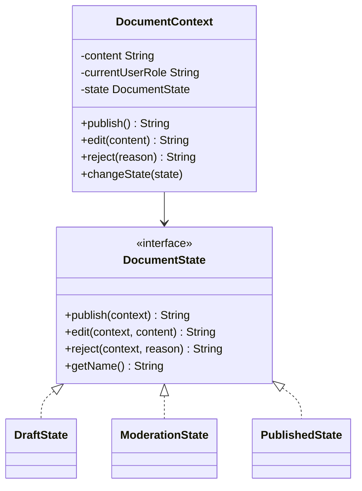
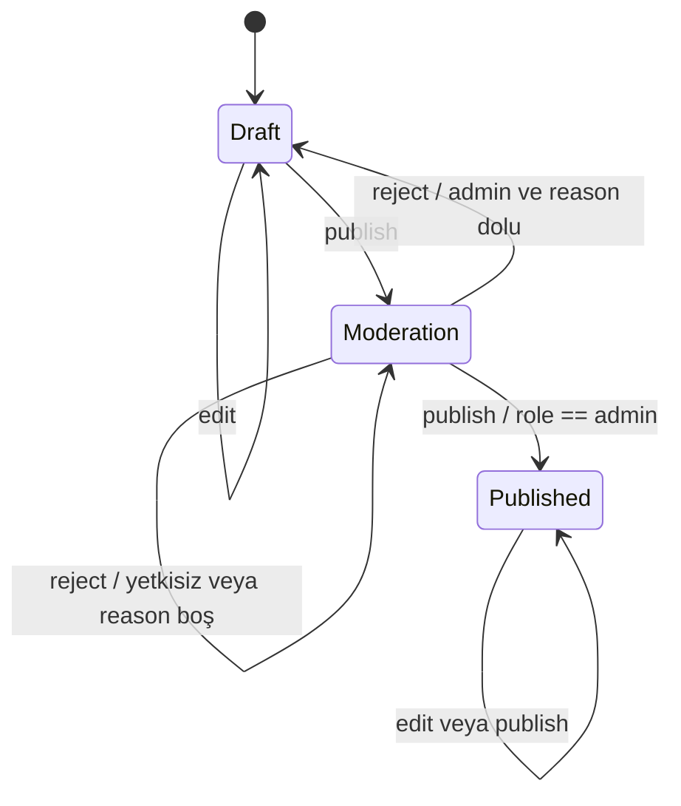

# State — Durum Deseni

> Bu örnek bir dokümanın yayın yaşam döngüsünü modeller.
> Rol ve geçiş API’leri eğitim için sadedir; production yetkilendirme sistemi değildir.

## 30 saniyelik kart

| Soru | Kısa cevap |
|---|---|
| Niyet | Bir nesnenin davranışını mevcut iç durumuna göre ayrı state nesnelerine dağıtmak |
| Değişen eksen | Yaşam döngüsü durumları, izin verilen eylemler ve geçişler |
| Ana bedel | State sınıfı ve geçiş kurallarının sayısı artar |
| Bu örnekte | Draft ↔ Moderation → Published doküman akışı |
| Hafıza ipucu | “Aynı düğme, makinenin bulunduğu moda göre başka davranır.” |

## Örnek haritası: temel → güçlendirilmiş → production

| Katman | Bu repoda ne var? | Öğrettiği sınır |
|---|---|---|
| Temel örnek | `DraftState`, `ModerationState`, `PublishedState` ve `publish/edit` | Aynı mesajın aktif state’e göre farklı davranması ve state’in geçiş başlatması |
| Güçlendirilmiş örnek | `reject(reason)`, admin guard’ı, Draft’a dönüş ve `lastReviewNote` | Geri yönlü domain transition, yetki/gerekçe guard’ı ve transition metadata’sı |
| Production sınırı | Dar transition API, enum/value object rol, optimistic locking, typed sonuç ve audit event’i | Public mutator’ların lifecycle’ı bypass edebilmesi |

## Akılda kalıcı analoji: turnike

Aynı turnike kolunu ittiğini düşün:

- kilitliyken itmek geçiş sağlamaz,
- para atılınca turnike açık state’e geçer,
- açıkken itmek kişiyi geçirip tekrar kilitler.

Nesne aynıdır, çağrı aynıdır; davranış state’e göre değişir.
State sınıfları hem davranışı hem geçiş kararını taşır.

## Pattern olmasaydı problem ne olurdu?

Context bütün durumları koşulla yönetirse her operasyon state switch’i taşır:

```java
String publish() {
    if (state == DRAFT) {
        state = MODERATION;
    } else if (state == MODERATION && isAdmin()) {
        state = PUBLISHED;
    } else if (state == PUBLISHED) {
        return "Zaten yayında";
    }
}
```

`edit`, `archive`, `reject` gibi operasyonlar eklendikçe:

- aynı state koşulları tekrar edilir,
- geçiş kuralları farklı metotlara dağılır,
- yeni state bütün switch’lere dokunur,
- geçersiz geçişler kolayca oluşur.

## Çözüm

Her state, ortak `DocumentState` sözleşmesini uygular.
`DocumentContext`, public operasyonları aktif state’e delege eder.
Concrete state gerekli olduğunda `context.changeState(...)` ile sonraki state’i seçer.

### Çözmediği şeyler

State deseni tek başına:

- geçişlerin dışarıdan bypass edilmesini engellemez,
- authorization servisi sağlamaz,
- state’i kalıcı depoya yazmaz,
- eşzamanlı geçişleri atomik yapmaz,
- state machine’in eksiksiz olduğunu kanıtlamaz.

## Repodaki roller

| Pattern rolü | Repodaki karşılığı | Sorumluluk |
|---|---|---|
| Context | `DocumentContext` | İçerik, rol ve aktif state’i tutar |
| State | `DocumentState` | `publish`, `edit`, default `reject` ve `getName` sözleşmesi |
| Concrete State | `DraftState` | Edit’e izin verir, publish ile moderation’a geçer |
| Concrete State | `ModerationState` | Edit/publish yanında gerekçeli ret ile Draft’a döner |
| Concrete State | `PublishedState` | Edit ve tekrar publish’i no-op yapar |
| Client | `StatePatternDemo` | Rol değişikliği ve geçişleri yürütür |

## Yapı



## Geçiş diyagramı



## Davranış matrisi

| State | `edit(newContent)` | `publish()` | `reject(reason)` |
|---|---|---|---|
| Draft | İçeriği değiştirir, Draft kalır | Moderation’a geçer | Default ret mesajı |
| Moderation | İçeriği değiştirir, Moderation kalır | Admin değilse reddeder | Admin değilse reddeder |
| Moderation + admin | İçerik değişebilir | Published’a geçer | Dolu gerekçeyle Draft’a döner |
| Published | İçeriği değiştirmez | State’i değiştirmez | Default ret mesajı |

## Kod execution trace

1. `DocumentContext` her zaman yeni `DraftState` ile başlar.
2. Draft edit, `context.setContent` çağırır.
3. İlk publish, state’i `new ModerationState()` yapar.
4. Editor rolüyle ikinci publish mesaj döndürür; state değişmez.
5. Client rolü `"admin"` yapar.
6. Moderation publish bu kez `PublishedState` oluşturur.
7. Published edit yeni içeriği kullanmaz.
8. Published publish idempotent bir bilgi mesajı döndürür.

Alternatif akışta admin kullanıcının Moderation state’indeki `reject("Kaynak eksik")` çağrısı, notu context’e yazar ve state’i yeniden Draft yapar.
Blank gerekçe guard’a takılır; state ve not değişmez.

## API, invariant ve sonuç semantiği

- Context oluşturulunca state adı `"Draft"`tır.
- `publish/edit` sonuçları domain sonucu yerine Türkçe String mesajdır.
- Role karşılaştırması `equalsIgnoreCase` ile yapılır.
- Null role admin kabul edilmez ve NPE üretmez.
- Başında/sonunda boşluk olan `" admin "` kabul edilmez.
- Draft publish için içerik veya rol doğrulaması yapılmaz.
- Moderation edit state’i değiştirmez.
- Published operasyonları state ve content açısından no-op’tur.
- State nesneleri stateless olsa da geçişlerde yeniden oluşturulur.
- `DocumentState#reject` default davranış sunar; yalnız Moderation state geçiş uygular.
- Moderation ret geçişi yalnız `admin` rolüne açıktır.
- Başarılı ret nedeni trim edilerek `lastReviewNote` alanında saklanır.

## Kritik audit bulgusu: lifecycle bypass

`DocumentContext` şu mutator’ları public sunar:

- `changeState(DocumentState)`,
- `setContent(String)`,
- `setCurrentUserRole(String)`.

Client:

- Draft’tan doğrudan Published’a geçebilir,
- Published içeriğini `setContent` ile değiştirebilir,
- `changeState(null)` ile context’i bozabilir.

Bu yüzden state sınıflarının koyduğu kurallar API seviyesinde tam korunmuyor.
Production’da transition mutator’ları dar erişimli tutulmalı veya invariant context tarafından doğrulanmalıdır.

## Test kontrat haritası

| `@Nested` grup | Korunan davranış |
|---|---|
| `InitialState` | Draft başlangıcı ve başlangıç alanları |
| `DraftBehavior` | Edit ve moderation’a geçiş |
| `ModerationBehavior` | Rol reddi, case-insensitive admin ve edit |
| `PublishedBehavior` | Edit engeli ve idempotent publish |
| `ReviewRejection` | Gerekçeli Draft dönüşü, blank guard ve Published ret davranışı |

Testler yalnız mesajı değil state ve content’i birlikte doğrular.

## Edge case, security, concurrency ve performans

- Title, content ve role null/blank olabilir.
- Draft/Moderation edit null content yazabilir.
- Rol String’i typo’ya açıktır; enum/value object daha güvenlidir.
- Public transition API geçersiz state’e izin verir.
- Context ve state değişimleri thread-safe değildir.
- İki thread aynı anda publish yaparsa geçiş yarışı oluşabilir.
- State mesajları domain ile presentation/localization’ı bağlar.
- Moderation edit mesajı “tekrar onay” der fakat approval kaydı yoktur.
- State sayısı s, operasyon sayısı o olduğunda sınıflara yayılan davranış yaklaşık s×o’dur.
- Her delegasyon O(1)’dir; maliyet performanstan çok tasarım karmaşıklığıdır.
- Gerçek authorization yalnız role string karşılaştırmasına bırakılamaz.

## Ne zaman kullan?

- Aynı operasyon lifecycle boyunca farklı davranıyorsa,
- state geçişleri domain’in merkezindeyse,
- switch/if blokları birçok metoda yayılmışsa,
- yeni davranış mevcut state bağlamını bilmeli ise,
- state diagram iş kuralını açıklıyorsa.

## Ne zaman kullanma?

- Yalnız iki basit flag varsa,
- state’ler davranış değil yalnız veri etiketi ise,
- geçişler dış workflow engine tarafından yönetiliyorsa,
- her state sınıfı yalnız bir satırlık aynı davranışı tekrar ediyorsa.

## Artılar ve bedeller

| Artı | Bedel |
|---|---|
| State’e özgü davranış bir arada kalır | Sınıf sayısı artar |
| Büyük koşul blokları azalır | Geçişleri dosyalar arasında takip etmek gerekir |
| Context sade delegasyon yapar | Context mutator erişimi dikkat ister |
| Geçişler state içinden başlatılabilir | Yeni state’e ulaşmak için mevcut state değişebilir |
| State testleri izole yazılabilir | Mesaj ve transition sonucu ayrıca modellenmelidir |

## En çok karışan desen: Strategy

| State | Strategy |
|---|---|
| Davranış lifecycle state’ine bağlıdır | Algoritma client ihtiyacına göre seçilir |
| Concrete state başka state’e geçebilir | Strategy’ler genellikle birbirini bilmez |
| Seçim çoğu zaman içeriden evrilir | Seçim çoğu zaman dışarıdan yapılır |
| Context’in kimliği zamanla davranış değiştirir | Aynı iş farklı yöntemle yapılır |

## Yaygın hatalar

1. Public setter ile state kurallarını bypass etmek.
2. State adını ve rolü serbest String yapmak.
3. Her state metodunda yeniden büyük if blokları yazmak.
4. Transition tablosu olmadan state eklemek.
5. Geçersiz state/null kabul etmek.
6. Presentation mesajlarını tek domain sonucu yapmak.
7. Basit enum yeterliyken sınıf patlaması yaratmak.

## Alıştırmalar

### Seviye 1 — Gözlemle

Draft, Moderation ve Published için edit/publish davranış matrisini testlerle tamamla.

### Seviye 2 — Yeni state

`RejectedState` ekle.
Hangi state’lerden ulaşılacağını ve edit/publish davranışını diyagramda göster.

### Seviye 3 — Invariant koru

Public bypass noktalarını kapat.
Transition sonucu ve hata nedenini String yerine typed bir modelle ifade et.

## Hafıza cümlesi

**State, “hangi moddayım?” koşulunu her metoda yaymak yerine, o modun bütün davranışını ayrı bir nesneye verir.**
