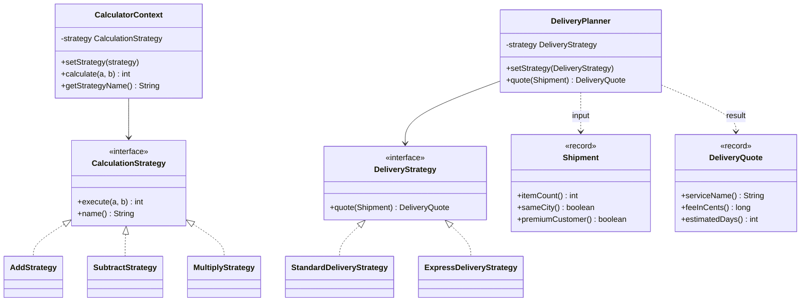
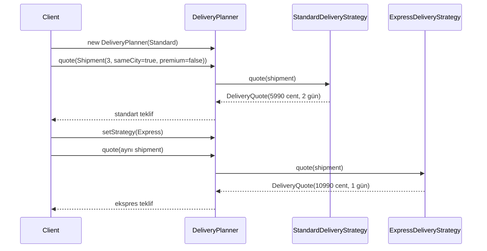

# Strategy — Strateji Deseni

> Aritmetik örnek mekanizmayı görünür kılar; teslimat örneği aynı fikrin gerçek iş kuralındaki karşılığını gösterir.

## Kod organizasyonu ve composition sınırı

- Desen rolleri `com.can.behavirol.strategy` paketindedir.
- Çalıştırılabilir composition root `com.can.demo.behavioral.strategy.StrategyPatternDemo` sınıfıdır.
- Demo calculator ve teslimat context’lerine concrete strategy seçer; context’ler çalıştırılabilir örneği veya seçim arayüzünü bilmez.

Production composition root strategy’yi kullanıcı tercihi, feature flag ya da iş kuralından seçebilir. Testler demo stdout’u yerine her algoritmanın sonucu ile runtime strategy değişiminin context kontratını doğrular.

## 30 saniyelik kart

| Soru | Kısa cevap |
|---|---|
| Niyet | Aynı işi yapan algoritma ailesini ortak sözleşmeyle değiştirilebilir nesneler yapmak |
| Değişen eksen | Context’in kullandığı hesaplama algoritması |
| Ana bedel | Client doğru stratejiyi bilmeli; sınıf/nesne sayısı artar |
| Bu örnekte | Aritmetik algoritmalar ve teslimat fiyatlama politikaları runtime’da değiştirilir |
| Hafıza ipucu | “Hedef aynı, oraya giden rota değişebilir.” |

## Örnek haritası: temel → güçlendirilmiş → production

| Katman | Bu repoda ne var? | Öğrettiği sınır |
|---|---|---|
| Temel örnek | `CalculationStrategy`, `CalculatorContext` ve üç aritmetik strategy | Aynı çağrının farklı algoritmaya delege edilmesi ve runtime seçim |
| Güçlendirilmiş örnek | `DeliveryStrategy`, `DeliveryPlanner`, `Shipment`, `DeliveryQuote`, `StandardDeliveryStrategy`, `ExpressDeliveryStrategy` | Strategy’nin gerçek fiyat/SLA kuralını ve typed input/output’u kapsüllemesi |
| Production sınırı | Currency-aware para modeli, konfigürasyon, uygunluk motoru, versiyonlama ve metrics | Cent tutarının tek currency varsayması; stratejiyi doğru seçmenin hâlâ client sorumluluğu olması |

## Akılda kalıcı analoji: navigasyon rotası

Havalimanına gitme hedefi değişmez.
Fakat koşula göre:

- araba,
- toplu taşıma,
- bisiklet,
- yürüme

algoritmalarından biri seçilir.

Navigasyon ekranı “rota hesapla” der.
Seçili strateji kendi algoritmasını çalıştırır.
Yeni rota türü ekranın hesaplama akışını değiştirmez.

## Pattern olmasaydı problem ne olurdu?

Context concrete seçimleri kendi içinde yaparsa büyüyen koşul oluşur:

```java
int calculate(Operation operation, int a, int b) {
    return switch (operation) {
        case ADD -> a + b;
        case SUBTRACT -> a - b;
        case MULTIPLY -> a * b;
    };
}
```

Bu küçük örnekte switch gayet yeterli olabilir.
Algoritmalar büyüyüp bağımlılıkları farklılaştığında ise:

- context şişer,
- her yeni algoritma context’i değiştirir,
- algoritmalar ayrı test edilemez hale gelir,
- runtime composition zorlaşır.

## Çözüm

Algoritma ailesi `CalculationStrategy` arayüzünde birleşir.
Her concrete strategy aynı `execute(a, b)` çağrısını farklı uygular.
`CalculatorContext` yalnız interface’i bilir.
Client, constructor veya setter ile aktif stratejiyi seçer.

Aynı yapı daha gerçekçi teslimat örneğinde tekrar edilir.
`DeliveryPlanner`, `Shipment` verisini seçili `DeliveryStrategy` nesnesine verir ve typed `DeliveryQuote` alır.
Standart strateji premium müşteriye ücretsiz gönderim uygularken ekspres strateji hız için ayrı fiyat hesaplar.

### Çözmediği şeyler

Strategy tek başına:

- doğru algoritmayı otomatik seçmez,
- client’taki seçim koşulunu yok etmez,
- null stratejiyi engellemez,
- temel `CalculatorContext` örneğindeki `int` overflow’unu kendiliğinden çözmez,
- stateful stratejiyi thread-safe yapmaz,
- algoritmalar arası ortak kodu otomatik paylaşmaz.

## Repodaki roller

| Pattern rolü | Repodaki karşılığı | Sorumluluk |
|---|---|---|
| Strategy | `CalculationStrategy` | `execute` ve gösterim adı sözleşmesi |
| Concrete Strategy | `AddStrategy` | `a + b` |
| Concrete Strategy | `SubtractStrategy` | `a - b` |
| Concrete Strategy | `MultiplyStrategy` | `a * b` |
| Context | `CalculatorContext` | Aktif stratejiyi saklar ve delege eder |
| Demo composition root | `com.can.demo.behavioral.strategy.StrategyPatternDemo` | Runtime strateji seçimini yapar |
| Gerçekçi Strategy | `DeliveryStrategy` | `Shipment` için `DeliveryQuote` sözleşmesi |
| Gerçekçi Context | `DeliveryPlanner` | Non-null aktif teslimat stratejisine delege eder |
| Concrete Strategy | `StandardDeliveryStrategy` | Ürün adedi, şehir ve premium politikasını uygular |
| Concrete Strategy | `ExpressDeliveryStrategy` | Daha yüksek ücret ve daha kısa SLA hesaplar |
| Typed veri | `Shipment`, `DeliveryQuote` | Girdi invariant’ı ve fiyat/SLA sonucunu isimlendirir |

## Yapı



## Runtime seçim akışı



## Kod execution trace

1. Client context’i `AddStrategy` ile oluşturur.
2. Context `calculate(12, 4)` çağrısını strategy’ye iletir.
3. Sonuç 16 döner.
4. Client `setStrategy(new SubtractStrategy())` çağırır.
5. Aynı calculate API’si bu kez 8 döner.
6. Strategy `MultiplyStrategy` olduğunda sonuç 48 olur.
7. Context hiçbir concrete strategy için `instanceof` veya switch kullanmaz.

Seçim yine client tarafından yapılır.
Pattern koşulu ortadan kaldırmaz; algoritma uygulamasını koşuldan ayırır.

Teslimat örneğinde aynı fikir domain verisiyle tekrar edilir:

1. Client üç ürünlü, aynı şehirde ve premium olmayan bir `Shipment` oluşturur.
2. `DeliveryPlanner`, `StandardDeliveryStrategy` ile `5_990` cent ve iki günlük teklif üretir.
3. Client planner üzerindeki strategy’yi `ExpressDeliveryStrategy` ile değiştirir.
4. Aynı shipment bu kez `10_990` cent ve bir günlük teklif üretir.
5. Planner yalnız `DeliveryStrategy` sözleşmesini bilir; premium ücretsiz teslimat kararı standart strategy’nin içinde kalır.

## API, invariant ve sonuç semantiği

- Context çalışmak için non-null strategy’ye ihtiyaç duyar.
- Mevcut constructor ve setter bu invariant’ı doğrulamaz.
- Null verilirse hata `calculate` veya `getStrategyName` anında NPE olur.
- `calculate` operand sırasını değiştirmeden strategy’ye iletir.
- Subtraction için `a-b`, `b-a` ile aynı değildir.
- Strategy runtime’da sınırsız kez değiştirilebilir.
- `name()` hesaplamadan bağımsız Türkçe presentation metadata’sıdır.
- Interface iki abstract metoda sahip olduğu için functional interface değildir.
- Aritmetik örneğin sonucu `int`tir; `CalculatorContext` overflow kontrolü yapmaz.
- Teslimat ücreti floating-point yerine cent cinsinden, nonnegative `long` olarak tutulur.
- İki teslimat stratejisi ücreti `Math.addExact` ve `Math.multiplyExact` ile hesaplar; `Integer.MAX_VALUE` ürün sayısında bile exact `long` sonuç üretir.
- `DeliveryQuote` negatif ücreti value object sınırında reddeder.
- `Shipment` en az bir ürün invariant’ını constructor’da korur.
- `DeliveryPlanner` constructor/setter’da null stratejiyi hemen reddeder.
- Premium ücretsiz kargo yalnız standart stratejinin politikasıdır; ekspres stratejiye sızmaz.

## Test kontrat haritası

| `@Nested` grup | Korunan davranış |
|---|---|
| `Addition` | Pozitif/negatif toplama ve ad |
| `Subtraction` | Operand sırası, negatif sonuç ve ad |
| `Multiplication` | Normal/sıfır çarpımı ve ad |
| `RuntimeSelection` | Strategy değiştirme ve custom interface implementasyonu |
| `DeliveryPricing` | Runtime teslimat seçimi, premium politika izolasyonu, en az bir ürün invariant’ı, maksimum `int` ürün sayısında taşmayan exact `long` ücret ve negatif teklifin reddi |

Custom strategy testi context’in concrete sınıfa değil interface’e delege ettiğini gösterir.

## Edge case, security, concurrency ve performans

- Aritmetik `AddStrategy` için `Integer.MAX_VALUE + 1` sessizce negatif değere taşar.
- Aritmetik `MultiplyStrategy` içindeki büyük `int` çarpımlar da overflow üretir.
- Teslimat tarafı ücreti `long` ve exact arithmetic ile hesaplar; mevcut `int itemCount` aralığının üst sınırı testle korunur.
- `DeliveryQuote` negatif ücreti reddeder; service adı ve tahmini gün için ayrıca bir domain doğrulaması yoktur.
- `CalculatorContext` null stratejide geç hata üretir; güçlendirilmiş `DeliveryPlanner` sınırda reddeder.
- Context mutable olduğu için thread’ler strategy değişimini yarışmalı görebilir.
- Concrete strategy’ler stateless’tir ve paylaşılabilir.
- Her çağrı O(1)’dir; delegasyon maliyeti ihmal edilebilir.
- Çok küçük algoritmalarda sınıf sayısı bilişsel maliyeti artırır.
- `name()` localization değişikliğini domain interface’ine taşır.
- Strateji dış kaynağa erişirse timeout/retry sorumluluğu ayrıca tanımlanmalıdır.
- Kullanıcı girdisine göre strategy seçilecekse allow-list gerekir.

Production’da temel `CalculatorContext` için `Objects.requireNonNull`, bilinçli bir `int` overflow politikası ve immutable context seçeneği değerlendirilmelidir.
Teslimat örneği null strategy ile negatif/taşan ücret sınırlarını güçlendirmiştir; currency, yuvarlama ve strateji uygunluğu hâlâ ayrı domain kararlarıdır.

## Ne zaman kullan?

- Aynı iş için birden çok anlamlı algoritma varsa,
- algoritma runtime’da veya configuration ile seçilecekse,
- büyük switch yalnız algoritma varyantlarını ayırıyorsa,
- algoritmaların bağımsız test/dependency ihtiyacı varsa,
- composition inheritance’dan daha esnek olacaksa.

## Ne zaman kullanma?

- Birkaç tek satırlık sabit işlem için enum/switch daha açıksa,
- algoritmalar aynı sözleşmeyi dürüstçe paylaşamıyorsa,
- seçim hiçbir zaman değişmeyecekse,
- client strateji farklarını anlayamayacaksa,
- sınıf patlaması davranıştan daha çok gürültü üretiyorsa.

## Artılar ve bedeller

| Artı | Bedel |
|---|---|
| Algoritma context’ten ayrılır | Client seçenekleri bilmelidir |
| Runtime değişim mümkündür | Null/lifecycle politikası gerekir |
| Yeni strateji context’i değiştirmez | Sınıf sayısı artar |
| Her algoritma ayrı test edilir | Ortak kod tekrar edebilir |
| Composition esnektir | Mutable context concurrency riski taşır |

## En çok karışan desen: State

| Strategy | State |
|---|---|
| Algoritma çoğunlukla client tarafından seçilir | Durum lifecycle içinde evrilir |
| Stratejiler birbirini bilmez | State başka state’e geçiş başlatabilir |
| “Nasıl hesaplayayım?” sorusudur | “Şu anda nasıl davranmalıyım?” sorusudur |
| Değişim isteğe bağlı konfigürasyondur | Değişim domain yaşam döngüsüdür |

## Yaygın hatalar

1. Basit switch yeterliyken sınıf patlaması yaratmak.
2. Null strategy kabul etmek.
3. Strategy seçimini de context içine geri taşımak.
4. Farklı amaçlı algoritmaları zorla aynı interface’e sokmak.
5. Stateful strategy’yi güvenli biçimde paylaşmak.
6. Overflow ve hata sözleşmesini unutmak.
7. UI adını algoritma kontratıyla karıştırmak.

## Alıştırmalar

### Seviye 1 — Gözlemle

Bölme stratejisi ekle.
Operand sırası, sıfıra bölme ve ad kontratını test et.

### Seviye 2 — Sadeleştir

Aynı örneği `IntBinaryOperator` ile kur.
Class tabanlı Strategy’nin ne zaman daha okunaklı olduğunu karşılaştır.

### Seviye 3 — Gerçek algoritma

Kargo ücreti için standart, hızlı ve uluslararası stratejiler tasarla.
Her birine farklı dependency ve hata politikası ver.

## Hafıza cümlesi

**Strategy, aynı hedefe giden algoritmaları ortak bir direksiyonun arkasına koyar; client gerektiğinde sürücüyü değiştirir.**
