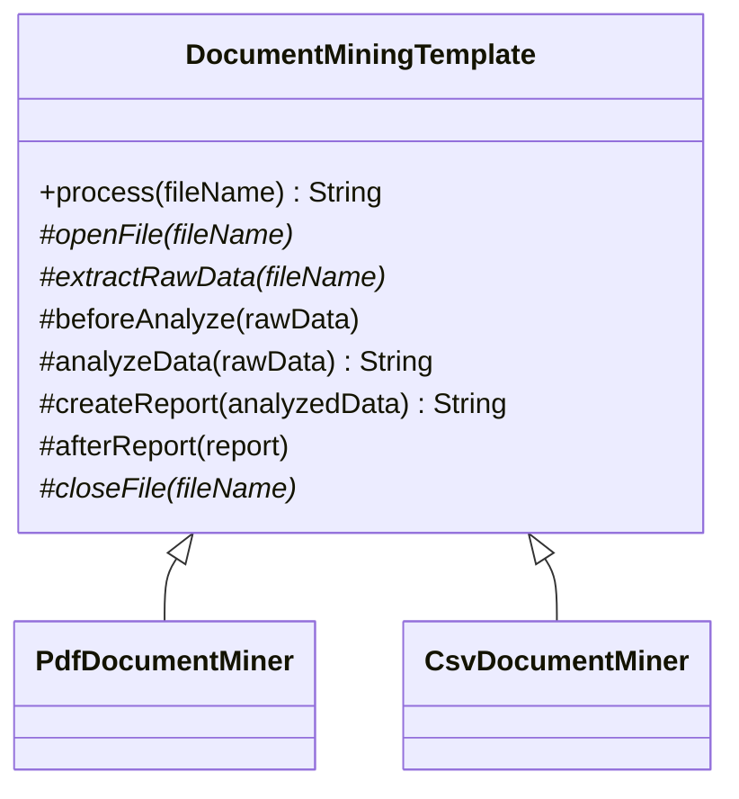
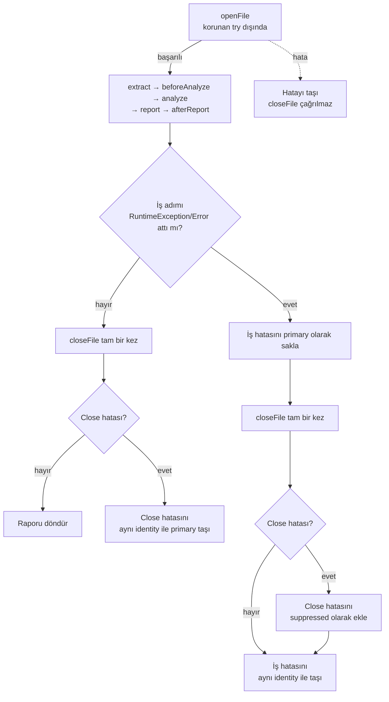

# Template Method — Şablon Metot Deseni

> Bu bölüm dosya madenciliği akışını simüle eder.
> Concrete sınıflar gerçek dosya açmaz; stdout ve sabit metinlerle pattern’i görünür kılar.

## Kod organizasyonu ve composition sınırı

- Desen rolleri `com.can.behavirol.templatemethod` paketindedir.
- Çalıştırılabilir composition root `com.can.demo.behavioral.templatemethod.TemplateMethodPatternDemo` sınıfıdır.
- Demo concrete miner seçip ortak `process` API’sini çağırır; algoritmanın sabit sırası `DocumentMiningTemplate` içinde kalır ve demo paketinden bağımsızdır.

Production composition root dosya türünden doğru miner’ı seçen factory/registry sağlayabilir. Testler demo çıktısını değil template sırasını, hook’ları ve exception-safe cleanup invariant’ını recording subclass üzerinden doğrular.

## 30 saniyelik kart

| Soru | Kısa cevap |
|---|---|
| Niyet | Bir algoritmanın değişmeyen iskeletini üst sınıfta, değişen adımlarını alt sınıflarda tanımlamak |
| Değişen eksen | Dosya türüne özgü açma, çıkarma, analiz, rapor ve hook adımları |
| Ana bedel | Kalıtım bağımlılığı ve fragile base class riski |
| Bu örnekte | PDF ve CSV aynı yedi adımlı `process` akışını kullanır |
| Hafıza ipucu | “Tarifin sırası şefte sabit; malzeme hazırlığını uzmanlar değiştirir.” |

## Örnek haritası: temel → güçlendirilmiş → production

| Katman | Bu repoda ne var? | Öğrettiği sınır |
|---|---|---|
| Temel örnek | `DocumentMiningTemplate`, `PdfDocumentMiner`, `CsvDocumentMiner` | Sabit algoritma iskeleti, abstract/default adımlar ve hook’lar |
| Güçlendirilmiş örnek | `process` içindeki cleanup ve primary/suppressed hata politikası | İş adımı hata verse bile `closeFile` tam bir kez çalışır; close da hata verirse asıl hata kimliğini korur |
| Production sınırı | `AutoCloseable` resource, `try-with-resources`, streaming parser ve typed ara modeller | String tabanlı simülasyonun gerçek dosya/encoding/partial-open yönetmemesi |

## Akılda kalıcı analoji: standart ameliyat kontrol listesi

Her ameliyatın uzmanlığı farklı olabilir.
Fakat hastane ana sırayı sabit tutar:

1. kimliği doğrula,
2. hazırlığı yap,
3. işlemi uygula,
4. sonucu kaydet,
5. odayı kapat.

Uzmanlar bazı adımları özelleştirir, fakat güvenli sıra korunur.
Template Method algoritmanın omurgasını böyle sabitler.

## Pattern olmasaydı problem ne olurdu?

PDF ve CSV sınıfları açma, çıkarma, analiz, rapor ve kapama akışını ayrı ayrı yazarsa aynı algoritma iskeleti tekrarlanır.

CSV metodu da aynı sırayı kopyaladığında:

- yeni ortak adım bütün sınıflarda değişir,
- bir format close adımını unutabilir,
- akış sıraları zamanla ayrışır,
- client dosya türüne göre koşul yazabilir.

## Çözüm

Abstract üst sınıf final bir template method sunar:

```java
public final String process(String fileName) { ... }
```

Alt sınıflar yalnız izin verilen primitive operation ve hook’ları override eder.
`final`, akışın tamamen yeniden yazılmasını engeller.

### Adım türleri

| Tür | Repodaki örnek | Anlam |
|---|---|---|
| Abstract operation | `openFile`, `extractRawData`, `closeFile` | Alt sınıf uygulamak zorunda |
| Default operation | `analyzeData`, `createReport` | İstenirse override edilir |
| Hook | `beforeAnalyze`, `afterReport` | Varsayılanı boş, opsiyonel genişletme noktası |
| Template method | `process` | Bütün sırayı tanımlar ve final’dir |

### Çözmediği şeyler

Template Method:

- override’ın semantik olarak doğru olmasını garanti etmez,
- exception-safe cleanup politikasını otomatik seçmez; template açıkça kurmalıdır,
- runtime’da adımları kolayca değiştirmez,
- yanlış kalıtım hiyerarşisini düzeltmez,
- dosya doğrulama veya gerçek parser sağlamaz.

## Repodaki roller

| Pattern rolü | Repodaki karşılığı | Sorumluluk |
|---|---|---|
| Abstract Class | `DocumentMiningTemplate` | Akış ve extension noktaları |
| Template Method | `process` | Yedi adımı sabit sırada çağırır |
| Concrete Class | `PdfDocumentMiner` | PDF açma/çıkarma/kapama ve OCR hook’u |
| Concrete Class | `CsvDocumentMiner` | CSV’ye özel analiz, rapor ve after hook |
| Demo composition root | `com.can.demo.behavioral.templatemethod.TemplateMethodPatternDemo` | İki miner’ı aynı API ile çalıştırır |

## Yapı



## Sabit akış



## Kod execution trace

### PDF

1. PDF dosyası açılıyor mesajı yazılır.
2. Sabit PDF raw metni üretilir.
3. `beforeAnalyze` OCR kalite mesajı yazar.
4. Base `analyzeData`, raw metni uppercase yapar.
5. Base `createReport`, `"RAPOR: "` prefix’i ekler.
6. Base `afterReport` boş çalışır.
7. PDF kapatma mesajı yazılır.

### CSV

1. CSV açma mesajı yazılır.
2. Sabit CSV raw metni üretilir.
3. Base `beforeAnalyze` no-op’tur.
4. CSV özel satır normalizasyon metni üretir.
5. CSV özel `"CSV RAPORU: "` çıktısı üretir.
6. `afterReport`, veri ambarı mesajı yazar.
7. CSV kapatma mesajı yazılır.

## API, invariant ve sonuç semantiği

- `process` final olduğu için alt sınıf çağrı sırasını override edemez.
- Başarılı akışta her adım tam bir kez ve tabloda verilen sırada çağrılır.
- Bir adımın çıktısı sonraki adıma String olarak aktarılır.
- Rapor, `closeFile` tamamlandıktan sonra client’a döner.
- `openFile` korunan `try` alanından önce çalışır; başarılı olduktan sonraki bütün iş adımları cleanup politikası içindedir.
- İş gövdesindeki `RuntimeException` veya `Error` aynı nesne kimliğiyle primary kalır.
- Close da hata verirse farklı close hatası primary hataya `suppressed` olarak eklenir; close tam bir kez çağrılır.
- İş gövdesi başarılı, yalnız close başarısızsa close hatası kendi kimliğiyle primary olur ve rapor dönmez.
- Hook’lar opsiyoneldir.
- Null/blank filename herhangi bir resource adımı başlamadan `IllegalArgumentException` ile reddedilir.
- Filename yalnız log/açma/çıkarma adımlarına taşınır.
- Extension doğrulaması yapılmaz.
- Null raw data base `toUpperCase()` çağrısında NPE üretir.
- Null analyzed data concatenation ile `"null"` metnine dönüşebilir.

## Güçlendirme: cleanup invariant’ı

`process`, `openFile` tamamlandıktan sonra veri çıkarma, hook, analiz ve rapor adımlarını korunan gövdede çalıştırır.
`closeFile`, bu gövdenin sonucu ne olursa olsun `finally` içinde tam bir kez çağrılır.

Böylece `extractRawData`, `beforeAnalyze`, `analyzeData`, `createReport` veya `afterReport` exception atsa bile close çağrısı yapılır.
İş hatası yutulmaz veya close hatasıyla maskelenmez: aynı primary nesne client’a taşınır, farklı close hatası `getSuppressed()` üzerinden gözlenebilir.
Gövde başarılıysa close hatası doğrudan primary olur.

İki önemli production nüansı kalır:

- `openFile` kendi içinde kısmen kaynak açıp sonra exception atarsa template `finally` bloğuna giremez.
- Mevcut imzalar yalnız unchecked `RuntimeException`/`Error` politikasını taşır; gerçek `AutoCloseable` kaynaklarda checked exception, çoklu resource ve ters kapatma sırası için `try-with-resources` tercih edilmelidir.

## Locale determinismi

Base analiz `rawData.toUpperCase(Locale.ROOT)` çağırır.
Bu seçim protokol/rapor metnini JVM’in default locale’inden bağımsız yapar.
Test, default locale’i geçici olarak Türkçe yapıp `"birim fiyat"` girdisinin yine
`"BIRIM FIYAT"` üretmesini doğrular.

Bu, kullanıcıya gösterilen doğal dil metninin her zaman `Locale.ROOT` ile
dönüştürülmesi gerektiği anlamına gelmez.
Kullanıcı arayüzü metni kullanıcının locale’ini; makineden bağımsız anahtar ve
protokol metni ise `Locale.ROOT` gibi sabit bir politika kullanmalıdır.

## Test kontrat haritası

| `@Nested` grup | Korunan davranış |
|---|---|
| `InputBoundary` | Blank filename’in lifecycle başlamadan reddi ve locale-independent analiz |
| `AlgorithmSkeleton` | Recording subclass ile tam yedi adımlı sıra ve veri akışı |
| `PdfProcessing` | Default analyze/report davranışı |
| `CsvProcessing` | Format özel override davranışı |
| `ResourceSafety` | İş hatasında close’un çalışması; `RuntimeException`/`Error` primary kimliğinin korunması; close hatasının suppressed olması; yalnız close hatasında onun primary olması ve her senaryoda tek close çağrısı |

Cleanup testi stdout’a değil recording subclass’ın çağrı sırasına bakar.

## Edge case, security, concurrency ve performans

- Filename yalnız null/blank açısından doğrulanır; normalize edilmez ve gerçek path güvenliği sağlamaz.
- Dosya extension’ı concrete miner ile eşleştirilmez.
- Gerçek path traversal veya dosya izni kontrolü yoktur.
- Stdout gerçek loglama/metric sistemi değildir.
- Miner’lar görünür mutable state taşımadığı için örnekte paylaşılabilir görünür.
- Override edilen alt sınıf alanları eklenirse thread safety yeniden değerlendirilir.
- `toUpperCase` raw uzunluğu n için O(n)’dir.
- String prefix işlemleri yeni nesne üretir ve O(n) kopya maliyeti taşır.
- Büyük dosyalar streaming yerine tam String olursa bellek baskısı oluşur.
- Hook’ta yapılan dış yan etki, sonraki close başarısız olsa bile geri alınmaz.
- Alt sınıf null veya yanlış formatlı ara veri döndürebilir.

## Ne zaman kullan?

- Süreç sırası gerçekten sabitse,
- birkaç adım format/alt tür bazında değişiyorsa,
- ortak algoritma kodu tekrar ediyorsa,
- inheritance domain’de doğal bir “is-a” ilişkisi kuruyorsa,
- hook noktaları kontrollü tutulabiliyorsa.

## Ne zaman kullanma?

- Adımlar runtime’da bağımsız değiştirilecekse,
- çoklu kombinasyon kalıtım patlaması yaratacaksa,
- alt sınıflar üst sınıf invariant’larını sürekli bozuyorsa,
- composition/Strategy daha açık olacaksa,
- yalnız bir ortak satır için abstract hierarchy kuruluyorsa.

## Artılar ve bedeller

| Artı | Bedel |
|---|---|
| Akış tek yerde standardize edilir | Alt sınıf üst sınıfa sıkı bağlanır |
| Tekrar azalır | Fragile base class riski oluşur |
| Hook’lar kontrollü extension sağlar | Fazla hook akışı anlaşılmaz yapar |
| Client aynı API’yi kullanır | Runtime composition sınırlıdır |
| Sıra final metotla korunur | Exception safety ayrıca yazılmalıdır |

## En çok karışan desen: Strategy

| Template Method | Strategy |
|---|---|
| Kalıtım tabanlıdır | Composition tabanlıdır |
| Algoritma iskeleti üst sınıfta sabittir | Bütün algoritma nesnesi değişebilir |
| Extension compile-time alt sınıftır | Strategy runtime’da değiştirilebilir |
| Hook/override kullanır | Interface delegation kullanır |

## Yaygın hatalar

1. Cleanup’ı template’in normal son satırına bırakmak.
2. Çok fazla hook açmak.
3. Alt sınıfın bilmesi gerekmeyen state’i protected yapmak.
4. Runtime değişim gereken yerde kalıtım kullanmak.
5. Default operation kontratını belirsiz bırakmak.
6. Locale ve null ara veri davranışını unutmak.
7. Test adında akış deyip yalnız final String’i test etmek.

## Alıştırmalar

### Seviye 1 — Gözlemle

Recording miner yaz ve yedi adımın sırasını tek listede doğrula.

### Seviye 2 — Yeni format

JSON miner ekle.
Hangi adımların abstract, default veya hook olarak kalacağını gerekçelendir.

### Seviye 3 — Güvenli cleanup

Her ara adımın `RuntimeException` veya `Error` attığı senaryolarda mevcut primary/suppressed politikasını test matrisiyle gözle.
Ardından aynı davranışı iki `AutoCloseable` kaynağı ters sırada kapatan `try-with-resources` sürümüyle karşılaştır.

## Hafıza cümlesi

**Template Method, algoritmanın iskeletini kilitler; alt sınıflara yalnız izin verilen adımları özelleştirme alanı bırakır.**
