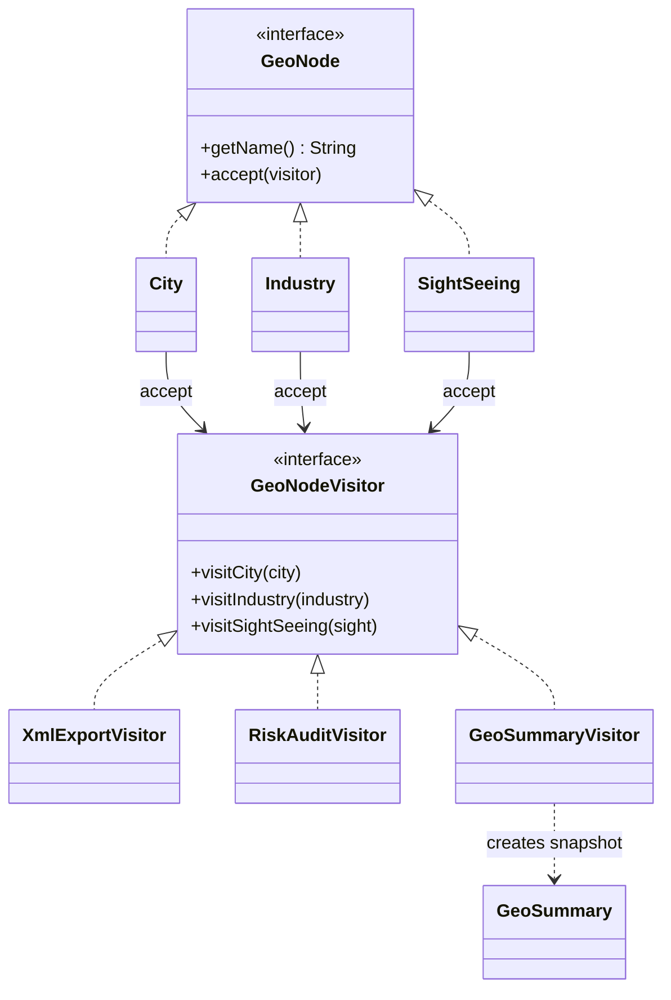
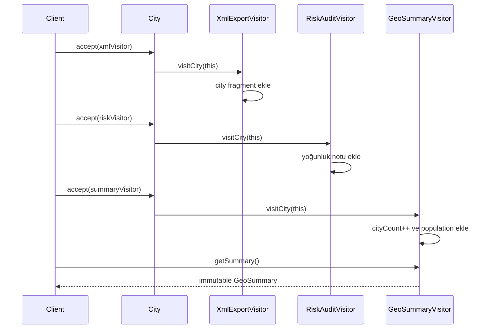

# Visitor — Ziyaretçi Deseni

> Bu örnek düz bir `List<GeoNode>` üzerinde farklı visitor operasyonları çalıştırır.
> XML attribute değerleri escape edilir; çıktı yine de tam bir XML document/serializer değildir.

## Kod organizasyonu ve composition sınırı

- Desen rolleri `com.can.behavirol.visitor` paketindedir.
- Çalıştırılabilir composition root `com.can.demo.behavioral.visitor.VisitorPatternDemo` sınıfıdır.
- Demo heterojen element koleksiyonunu ve visitor instance’larını üretip traversal’ı başlatır; element/visitor double-dispatch kontratı demo paketinden bağımsızdır.

Production composition root visitor yaşam döngüsünü ve traversal kaynağını seçer. Testler demo rapor metnine değil doğru overload dispatch’ine, escaping’e ve typed aggregation sonucuna doğrudan bağlanır.

## 30 saniyelik kart

| Soru | Kısa cevap |
|---|---|
| Niyet | Farklı element tiplerine uygulanacak operasyonları element sınıflarından ayırmak |
| Değişen eksen | Sabit element ailesine eklenen export, audit ve rapor operasyonları |
| Ana bedel | Yeni element tipi eklemek bütün visitor’ları değiştirir |
| Bu örnekte | City, Industry ve SightSeeing için XML export, risk audit ve toplu istatistik |
| Hafıza ipucu | “Yeni işi her binaya öğretme; işi bilen uzman bütün binaları gezsin.” |

## Örnek haritası: temel → güçlendirilmiş → production

| Katman | Bu repoda ne var? | Öğrettiği sınır |
|---|---|---|
| Temel örnek | `XmlExportVisitor` ve `RiskAuditVisitor` | Double dispatch ile her concrete tipe özel operasyon |
| Güçlendirilmiş örnek | XML attribute escaping’i, `GeoSummaryVisitor` ve `GeoSummary` | Elementleri değiştirmeden güvenli fragment ve heterojen koleksiyonda stateful aggregation |
| Production sınırı | XML library, schema/encoding/root document, visitor lifecycle ve toplam overflow politikası | Elle String üretiminin tam serializer olmaması; yeni elementin bütün visitor’ları değiştirmesi |

## Akılda kalıcı analoji: denetim ekibi

Aynı şehirde:

- itfaiye denetçisi yangın riskine,
- vergi denetçisi mali kayıtlara,
- erişilebilirlik uzmanı fiziksel erişime

bakar.

Binaların tipleri sabittir, fakat zamanla yeni denetim operasyonları eklenir.
Her uzman bina tipine göre farklı kontrol uygular.
Visitor operasyonu uzmana, yapısal veriyi elemente bırakır.

## Pattern olmasaydı problem ne olurdu?

Her export, audit, validation ve rapor davranışı element sınıflarına eklenirse domain sınıfları ilgisiz operasyonlarla şişer.

Bu yaklaşımda:

- City ilgisiz operasyonlarla dolar,
- aynı operasyon üç elemente dağılır,
- yeni rapor bütün domain sınıflarını değiştirir,
- operasyonun topladığı state merkezi tutulamaz.

## Çözüm

Her element `accept(GeoNodeVisitor)` sunar.
Visitor interface her concrete element için overload tanımlar.
Concrete element kendi `accept` metodunda doğru overload’u çağırır:

```java
public void accept(GeoNodeVisitor visitor) {
    visitor.visitCity(this);
}
```

Yeni operasyon, yeni concrete visitor olarak eklenir.
Örneğin `GeoSummaryVisitor`, elementlere rapor metodu eklemeden population ve visitor toplamlarını biriktirir.

### Çözmediği şeyler

Visitor tek başına:

- element koleksiyonunu gezmez,
- yeni element ekleme maliyetini azaltmaz,
- private verilere otomatik erişim vermez,
- çıktı formatının tamamını veya schema validation’ı otomatik sağlamaz,
- visitor instance’ını thread-safe yapmaz,
- operation sonucunun lifecycle’ını belirlemez.

## Repodaki roller

| Pattern rolü | Repodaki karşılığı | Sorumluluk |
|---|---|---|
| Element | `GeoNode` | `getName` ve `accept` sözleşmesi |
| Concrete Element | `City` | Population verisi ve `visitCity` dispatch’i |
| Concrete Element | `Industry` | Sector verisi ve `visitIndustry` dispatch’i |
| Concrete Element | `SightSeeing` | Annual visitors ve `visitSightSeeing` dispatch’i |
| Visitor | `GeoNodeVisitor` | Her concrete tipe özel visit metodu |
| Concrete Visitor | `XmlExportVisitor` | XML fragment listesi biriktirir |
| Concrete Visitor | `RiskAuditVisitor` | Risk notları biriktirir |
| Concrete Visitor | `GeoSummaryVisitor` | Tip bazlı sayaç ve toplamları biriktirir |
| Sonuç modeli | `GeoSummary` | Aggregation sonucunu immutable record olarak taşır |
| Demo composition root | `com.can.demo.behavioral.visitor.VisitorPatternDemo` | Düz listeyi gezer ve üç visitor uygular |

## Yapı



## Double dispatch akışı



## Double dispatch tam olarak nedir?

İlk seçim, `GeoNode` referansının runtime concrete tipine göre doğru `accept` implementasyonudur.
`City.accept` içindeki `this` statik olarak `City` olduğu için `visitCity(City)` overload’u seçilir.
Son olarak concrete visitor’ın `visitCity` implementasyonu dynamic dispatch ile çalışır.

Bu iş birliği `instanceof` zinciri yazmadan hem element hem visitor tipini davranışa dahil eder.

## Kod execution trace

Client üç farklı `GeoNode` içeren düz listeyi gezer.
Her node sırasıyla XML, risk ve summary visitor’ını kabul eder.
Doğru overload çalışır; XML/risk sonuçları ziyaret sırasıyla internal listelerde birikirken summary visitor sayaç ve toplamlarını günceller.

Adı `graph` olsa da mevcut koleksiyon tree/graph traversal yapmaz.
Gezinme sorumluluğu client’taki for döngüsündedir.

## API, invariant ve sonuç semantiği

- Her concrete `accept`, eşleşen visit metodunu çağırır.
- Visit metotları void’dur; sonuç visitor içinde birikir.
- Aynı visitor tekrar kullanılırsa eski sonuçlara yenileri eklenir.
- `getXmlRows/getNotes` unmodifiable fakat canlı view döndürür.
- View’e `add` yapılamaz; sonraki visit’ler daha önce alınan view’de görünür.
- Ziyaret sırası sonuç sırasını belirler.
- Risk city eşiği `> 1_000_000`dur.
- Tam 1.000.000 “Orta yoğunluk” sayılır.
- SightSeeing eşiği `> 500_000`dur.
- City, Industry ve SightSeeing adları; ayrıca Industry sektörü null/blank olamaz ve constructor’da trim edilir.
- Population ile annual visitor sayısı negatif olamaz; hatalı değer visitor’a ulaşmadan reddedilir.
- `chemical` sektör kontrolü normalize edilmiş değer üzerinde case-insensitive çalışır.
- XML visitor `&`, `"`, `<`, `>` ve `'` karakterlerini attribute entity’lerine çevirir.
- `GeoSummaryVisitor#getSummary`, çağrı anındaki sayaçları immutable `GeoSummary` record’una kopyalar.

## Güçlendirme ve XML production sınırı

XML visitor attribute değerlerini `escape` metodundan geçirir.

Şu karakterler XML entity’lerine dönüşür:

- `&` → `&amp;`
- `"` → `&quot;`
- `<` → `&lt;`
- `>` → `&gt;`
- `'` → `&apos;`

Ancak fragment listesinde hâlâ:

- tek root element,
- XML declaration,
- encoding metadata,
- schema validation

yoktur.

Production’da elle String birleştirmek yerine XML writer/serializer library kullanılmalıdır.

## Test kontrat haritası

| `@Nested` grup | Korunan davranış |
|---|---|
| `DoubleDispatch` | Her elementin doğru visit metodunu seçmesi |
| `DomainInvariants` | Null/blank ad ve sektörün, negatif population/annualVisitors değerlerinin erken reddi ve geçerli metinlerin trim edilmesi |
| `XmlExport` | Üç tipin exact fragment’i ve unmodifiable sonuç |
| `RiskAudit` | City, chemical, sightseeing branch’leri ve sıra |
| `SummaryVisitor` | İki city ve iki sightseeing üzerinden typed aggregation sonucu |

Testler “element değişmedi” gibi dolaylı isimler yerine dispatch ve sonuç kontratını doğrudan gözler.

## Edge case, security, concurrency ve performans

- Null visitor `accept` içinde NPE üretir.
- Null/blank ad veya sektör constructor’da açık `IllegalArgumentException` üretir; visitor kısmi/geçersiz element görmez.
- Negatif population/annualVisitors constructor’da açık `IllegalArgumentException` üretir.
- `" chemical "` constructor’da `"chemical"` olarak normalize edilir ve chemical branch’ine girer.
- Visitor state’i için reset API’si yoktur.
- Visitor’lar thread-safe değildir.
- Unmodifiable view immutable snapshot değildir.
- Her visit O(1), bütün liste traversal’ı node sayısı n için O(n)’dir.
- Sonuç listeleri ziyaret sayısı kadar sınırsız büyür.
- Çok uzun traversal’da `int` sayaçlar veya `long` toplamlar için overflow politikası yoktur.
- Yeni element eklemek interface ve bütün concrete visitor’ları değiştirir.

## Ne zaman kullan?

- Element tipleri sabit, yeni operasyonlar sık ekleniyorsa,
- operasyon birden çok element tipi üzerinde birlikte çalışıyorsa,
- domain sınıfları export/audit ayrıntısıyla kirlenmemeliyse,
- double dispatch tip kontrolü zincirini temizleyecekse,
- visitor traversal boyunca state biriktirecekse.

## Ne zaman kullanma?

- Yeni element tipleri sık ekleniyorsa,
- yalnız tek basit operasyon varsa,
- pattern için domain encapsulation’ı getter’larla delinmek zorundaysa,
- dilin sealed type/pattern matching özelliği daha açık çözüm sunuyorsa,
- traversal ile operation ayrımına ihtiyaç yoksa.

## Artılar ve bedeller

| Artı | Bedel |
|---|---|
| Yeni operasyon ayrı visitor olur | Yeni element bütün visitor’ları kırar |
| İlgili operasyon kodu tek sınıfta kalır | Double dispatch öğrenme maliyeti vardır |
| Visitor state biriktirebilir | Instance lifecycle/reset gerekir |
| Domain export/audit ile kirlenmez | Element verisi daha çok açılabilir |
| Farklı tipler tek operasyon altında işlenir | Boilerplate visit metotları artar |

## En çok karışan desen: Iterator

| Visitor | Iterator |
|---|---|
| Elemanda hangi operasyonun çalışacağını seçer | Elemanlara hangi sırayla ulaşılacağını seçer |
| `accept/visit` ile double dispatch yapar | `hasNext/next` ile cursor taşır |
| Sonuç/state visitor’da birikebilir | Gezinme state’i iterator’dadır |
| Traversal yapması şart değildir | Asıl görevi traversal’dır |

İkisi birlikte kullanılabilir: Iterator yapıyı gezer, her element Visitor’ı kabul eder.

## Yaygın hatalar

1. Visitor’ın traversal’ı otomatik yaptığı sanmak.
2. Yeni element maliyetini görmezden gelmek.
3. `accept` içinde yanlış visit overload’unu çağırmak.
4. Stateful visitor’ı resetlemeden tekrar kullanmak.
5. Unmodifiable view’i immutable snapshot sanmak.
6. XML’i String concatenate edip escape etmemek.
7. Basit pattern matching yeterliyken visitor boilerplate’i eklemek.

## Alıştırmalar

### Seviye 1 — Gözlemle

Recording visitor yaz.
Üç elementin doğru visit metodunu tam bir kez çağırdığını test et.

### Seviye 2 — Yeni operasyon

Population ve visitor toplamı üreten `StatisticsVisitor` ekle.
Element sınıflarını değiştirmeden sonucu test et.

### Seviye 3 — Yeni element

`River` elementi ekle.
Visitor interface ve bütün concrete visitor’lardaki değişiklik maliyetini kaydet; alternatif sealed switch ile karşılaştır.

## Hafıza cümlesi

**Visitor, yeni davranışı elementlere dağıtmaz; uzmanı elementlerin yanına gönderir ve her element doğru uzman metodunu seçer.**
