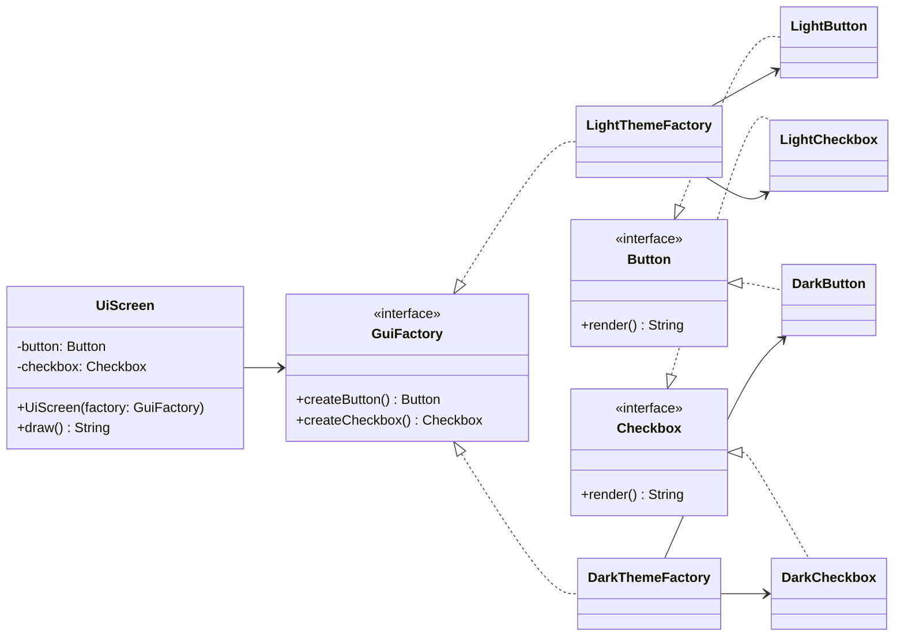

# Abstract Factory (Creational Pattern)

> Diğer adı: **Kit of Factories / Families of Products**

## Niyet (Intent)
Abstract Factory, birbiriyle ilişkili veya bağımlı nesne ailelerini, somut sınıflara doğrudan bağlanmadan üretmeyi amaçlar.

Kısa versiyon: **"Aynı ailenin parçalarını birlikte üret, uyumluluğu garanti et."**

## Problem
Sistemde birden fazla ürün türü vardır ve bu ürünler **aile** halinde birlikte kullanılmalıdır.

Örneğin UI tarafında:
- `Button`
- `Checkbox`

Eğer tema "Light" ise her iki bileşen de light olmalı;
Eğer tema "Dark" ise her iki bileşen de dark olmalı.

Doğrudan `new` ile üretim yaparsan:
- Ekranda yanlış kombinasyon riski oluşur (`DarkButton + LightCheckbox`).
- Tema değiştirme kodu farklı katmanlara dağılır.
- Yeni aile ekledikçe (`HighContrast`, `CorporateTheme`) `if/else` zinciri büyür.
- Üretim detayları client koduna sızdığı için bakım maliyeti artar.

## Çözüm
Bir `AbstractFactory` arayüzü tanımlanır ve ürün ailesindeki tüm ürünleri üretmek için metotlar eklenir.

Örnek:
- `GuiFactory#createButton()`
- `GuiFactory#createCheckbox()`

Sonra her ürün ailesi için somut fabrika yazılır:
- `LightThemeFactory`
- `DarkThemeFactory`

Client (`UiScreen`) sadece fabrikaya bağımlıdır:
- Hangi somut ürünün üretileceğini bilmez.
- Uyumlu ürün setini tek noktadan alır.
- Tema değişimi için yalnızca kullanılan factory değişir.

## Yapı

## Bu projedeki model

- `Button`, `Checkbox` → Abstract Product
- `LightButton`, `DarkButton`, `LightCheckbox`, `DarkCheckbox` → Concrete Product
- `GuiFactory` → Abstract Factory
- `LightThemeFactory`, `DarkThemeFactory` → Concrete Factory
- `UiScreen` → Client
- `AbstractFactoryDemo#run()` → Çalıştırma akışı

## Gerçek hayattan analoji
Bir otomotiv markasında araç paketlerini düşün:
- **Sport paket**: sport jant + sport süspansiyon + sport koltuk
- **Comfort paket**: konfor jant + yumuşak süspansiyon + konfor koltuk

Parçaları tek tek rastgele seçmek yerine paket bazlı seçim yaparsın.
Bu sayede uyumsuz kombinasyon ihtimali azalır.

Burada paket üreticisi = **Abstract Factory**, paket içindeki parçalar = **Product Family**.

## Developer kullanım senaryoları
- **UI tema sistemleri:** Light/Dark/High-Contrast bileşenlerini tutarlı üretmek.
- **Çoklu bulut sağlayıcıları:** AWS/Azure/GCP için uyumlu istemci aileleri üretmek.
- **Ödeme entegrasyonu:** Stripe/Adyen/Iyzico için ortak fakat sağlayıcıya özel nesneler üretmek.
- **Veritabanı katmanı:** PostgreSQL/MySQL için bağlantı + sorgu oluşturucu + migration bileşenlerini aile olarak sağlamak.
- **Mesajlaşma sistemleri:** Kafka/RabbitMQ için producer/consumer/config nesnelerini birlikte üretmek.

## Factory Method ile farkı
- **Factory Method** genellikle **tek bir ürünün** üretimine odaklanır.
- **Abstract Factory** ise **birbiriyle ilişkili birden fazla ürünün ailesini** birlikte üretir.

Pratikte Abstract Factory, çoğunlukla içeride birden fazla Factory Method barındırır.

## OOP ve SOLID notları

- **SRP:** Ürün ailesi seçimi factory'lerde toplanır, client sadece kullanım akışına odaklanır.
- **OCP:** Yeni bir aile (ör. `BlueThemeFactory`) eklemek mevcut client kodunu bozmaz.
- **DIP:** Üst seviye modül (`UiScreen`) somut sınıflara değil soyutlamalara (`GuiFactory`, `Button`, `Checkbox`) bağımlıdır.
- **Encapsulation:** Somut ürünlerin oluşturulma ayrıntıları client'tan gizlenir.

## Uygulanabilirlik
- Birlikte çalışması gereken ürün aileleri varsa.
- Uyumlu kombinasyonları garanti etmek istiyorsan.
- Somut sınıf bağımlılıklarını azaltmak istiyorsan.
- Çalışma zamanında aile değiştirme ihtiyacı varsa (tema/tenant/ülke/sağlayıcı).

## Artılar / Eksiler

**Artılar**
- Ürün aileleri arasında güçlü tutarlılık sağlar.
- Client kodunu somut sınıflardan ayırır.
- Aile değiştirme (ör. Light → Dark) tek noktadan yapılır.
- Testlerde fake/mock factory ile senaryo üretimi kolaylaşır.

**Eksiler**
- Yeni bir ürün türü eklemek maliyetlidir.
  - Örn. `Slider` eklenirse `GuiFactory` ve tüm concrete factory'ler güncellenir.
- Sınıf sayısı artar (özellikle çok aile/çok ürün kombinasyonunda).
- Küçük projelerde fazla soyutlama yaratabilir.

## Kısa özet
Abstract Factory, özellikle "birlikte değişen" ürün kümelerinde çok değerlidir. 
Tema, sağlayıcı veya platforma göre uyumlu nesne setlerini merkezi ve güvenli şekilde üretmeyi sağlar. 
Orta-büyük ölçekli mimarilerde, yanlış ürün kombinasyonlarını engelleyerek bakım ve genişletilebilirlikte ciddi avantaj sağlar.
