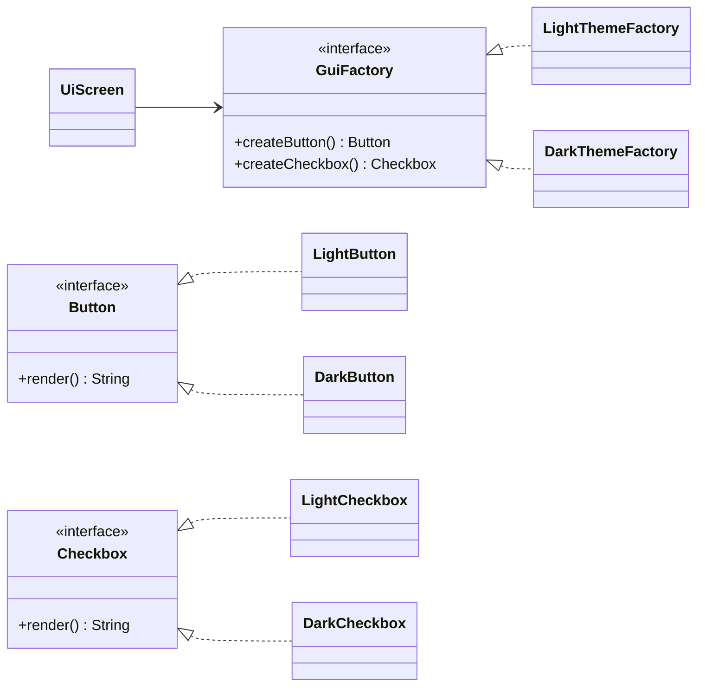
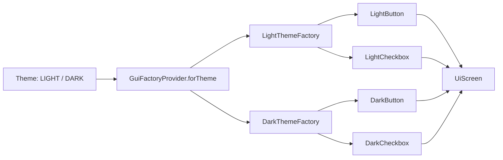

# Abstract Factory (Creational Pattern)

> Diğer adı: **Kit of Factories / Family Factory**

## Niyet (Intent)
Abstract Factory, birbiriyle ilişkili ürün ailesini (ör. Button + Checkbox) tek noktadan ve tutarlı şekilde üretir.

Kısa versiyon: **"Ürünleri tek tek değil, uyumlu aile olarak üret."**

## Problem
Tema/platform bazlı UI veya entegrasyon katmanında:
- Ürünler birbiriyle uyumlu olmalıdır.
- Yanlış kombinasyonlar (DarkButton + LightCheckbox) kalite sorununa yol açar.
- Client kodu somut sınıflara bağımlı olursa tema değişimi maliyetli olur.

## Çözüm
`GuiFactory` arayüzüyle ürün ailesi sözleşmesi tanımlanır:
- `createButton()`
- `createCheckbox()`

`LightThemeFactory` ve `DarkThemeFactory` bu aileyi tema bazında üretir.
Client (`UiScreen`) sadece factory sözleşmesini bilir.

## Zihinde Kalıcı Görsel (Hafıza Kartı)

<table>
  <tr>
    <td align="center"><b>🎯 Amaç</b><br/>Uyumlu ürün ailesi üretmek</td>
    <td align="center"><b>🧠 Mnemonic</b><br/>"Tema seç, tüm parçalar uyumlu gelsin"</td>
    <td align="center"><b>⚠️ Risk</b><br/>Aile sayısı arttıkça sınıf sayısı büyür</td>
  </tr>
</table>

```text
Theme = DARK
     │
     ▼
DarkThemeFactory
   ├── createButton()   -> DarkButton
   └── createCheckbox() -> DarkCheckbox

Aynı aile = uyumlu kombinasyon ✅
```

## Yapı



## UI tema akışı



## Bu projedeki model
- `Button`, `Checkbox` → Abstract Product
- `LightButton`, `DarkButton`, `LightCheckbox`, `DarkCheckbox` → Concrete Product
- `GuiFactory` → Abstract Factory
- `LightThemeFactory`, `DarkThemeFactory` → Concrete Factory
- `GuiFactoryProvider` → Factory seçici
- `UiScreen` → Client

## Teknik notlar
- `GuiFactoryProvider` tema seçimini merkezi bir policy noktasına çeker.
- `UiScreen` içinde somut sınıf referansı olmaması, tema değişimini düşük maliyetli yapar.
- Temaya özel tüm ürünlerin birlikte değiştirilmesi gereken durumlarda bakım maliyeti düşer.

## Ne zaman kullanılır?
- Ürünler aile halinde birlikte değişiyorsa.
- Çoklu tema/platform/tenant varyantları varsa.
- Tutarsız ürün kombinasyonlarını compile-time’a yakın yerde engellemek istiyorsan.

## Ne zaman kullanma?
- Tek ürün var ve aile ilişkisi yoksa.
- Varyant sayısı çok düşük ve stabilse.

## Artılar / Eksiler

**Artılar**
- Aile tutarlılığı
- Client tarafında düşük bağımlılık
- Varyant geçişinde temiz mimari

**Eksiler**
- Yeni ürün türü eklendiğinde tüm factory ailesi etkilenir
- Başlangıçta soyutlama maliyeti vardır

## Kısa özet
Abstract Factory, özellikle UI ve platform farklılaşmasının yoğun olduğu projelerde “doğru kombinasyonla üretim” garantisi vererek sistem bütünlüğünü korur.

## Gerçek Hayattan ve Yaygın Kullanılan Abstract Factory Pattern Örnekleri

### 1. UI Tema Sistemleri (Windows/MacOS/Linux, Light/Dark Theme)
Farklı platform veya temalara göre uyumlu buton, checkbox, menü gibi bileşenlerin birlikte üretilmesi:

```java
GuiFactory factory = theme.equals("dark") ? new DarkThemeFactory() : new LightThemeFactory();
Button button = factory.createButton();
Checkbox checkbox = factory.createCheckbox();
```

### 2. Veritabanı Bağlantı Katmanı (JDBC, ODBC, NoSQL)
Farklı veritabanı türleri için bağlantı, sorgu ve transaction nesnelerinin birlikte uyumlu şekilde üretilmesi:

```java
DbFactory factory = dbType.equals("mysql") ? new MySqlFactory() : new PostgresFactory();
Connection conn = factory.createConnection();
Query query = factory.createQuery();
Transaction tx = factory.createTransaction();
```

### 3. Oyun Motorları (2D/3D Grafik, Farklı Platformlar)
Farklı platformlara (PC, mobil, konsol) göre grafik, ses ve input nesnelerinin uyumlu şekilde üretilmesi:

```java
GameFactory factory = platform.equals("mobile") ? new MobileGameFactory() : new PcGameFactory();
Renderer renderer = factory.createRenderer();
Audio audio = factory.createAudio();
Input input = factory.createInput();
```

### 4. Web Framework Tema/Widget Sistemleri
Farklı tema veya marka için uyumlu widget setlerinin (button, input, modal) birlikte üretilmesi:

```java
WidgetFactory factory = brand.equals("A") ? new BrandAWidgetFactory() : new BrandBWidgetFactory();
Button button = factory.createButton();
Modal modal = factory.createModal();
```
