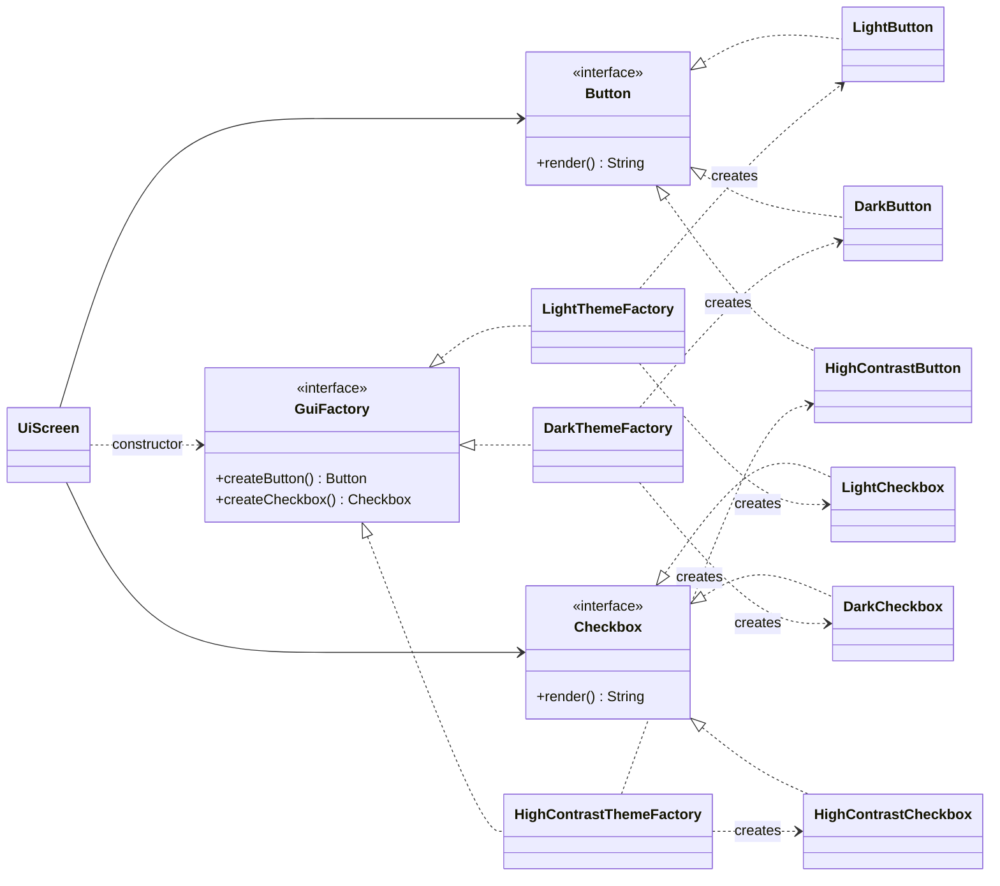
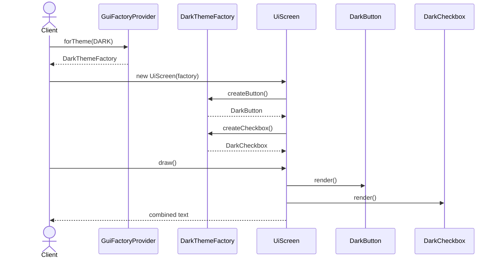

# Abstract Factory

Abstract Factory, birlikte kullanılması gereken ürünleri uyumlu bir aile olarak üretir; bu repoda `Button` ile `Checkbox` LIGHT, DARK ve erişilebilir HIGH_CONTRAST temaları için birlikte oluşturulur.

## 30 saniyelik kart

| Soru | Cevap |
|---|---|
| **Niyet** | Concrete sınıfları göstermeden uyumlu ürün ailesi üretmek |
| **Değişen eksen** | Tema ailesi: LIGHT, DARK veya HIGH_CONTRAST |
| **Sabit kalan** | Client'ın `Button` ve `Checkbox` sözleşmeleriyle çalışması |
| **Bedel** | Yeni ürün türü bütün concrete factory'leri etkiler |
| **Bu repodaki abstract factory** | `GuiFactory` |

> Kısa tanım: **Bir tema seç; o temaya ait bütün parçalar aynı kutudan çıksın.**

## Örnek haritası: temel → güçlendirilmiş → production

| Katman | Gerçek kod karşılığı | Ne öğretiyor? |
|---|---|---|
| **Temel örnek** | `LightThemeFactory`, `DarkThemeFactory` ve `UiScreen` | Client concrete bileşenleri bilmeden aynı temadaki button + checkbox ailesini kullanır |
| **Güçlendirilmiş örnek** | `HighContrastThemeFactory`, `HighContrastButton`, `HighContrastCheckbox` | Yeni bir erişilebilirlik ailesi eklenirken `GuiFactory` ve `UiScreen` değişmez; yalnız varyantlar ile composition seçimi genişler |
| **Production sınırı** | `GuiFactoryProvider` + `UiScreen` fail-fast kontrollerinin ötesi | Gerçek component toolkit, design-token doğrulaması, WCAG testleri ve runtime theme cache bu metin tabanlı demoda uygulanmaz |

`AbstractFactoryDemo`, standart LIGHT/DARK ailelerini “temel”, HIGH_CONTRAST ailesini “daha gerçekçi” başlığı altında render eder.

## Akılda kalıcı analoji: takım forma seti

Bir futbol takımının forma, şort ve çorabı aynı kulübün renklerini taşımalıdır; parçalar birlikte seçilir.

`LightThemeFactory` açık, `DarkThemeFactory` koyu takımı hazırlar; `HighContrastThemeFactory` ise erişilebilirlik için iki parçayı aynı görsel dilde üretir.
`UiScreen` concrete sınıfları bilmeden seti kullanır.

Bu bir **kavramsal benzetmedir**; forma üretim sistemlerinin mutlaka Abstract Factory kullandığı anlamına gelmez.

## Pattern olmasaydı problem nasıl görünürdü?

Client bütün concrete ürünleri seçebilirdi:

```java
Button button;
Checkbox checkbox;

if (theme == Theme.DARK) {
    button = new DarkButton();
    checkbox = new DarkCheckbox();
} else {
    button = new LightButton();
    checkbox = new LightCheckbox();
}
```

Bu seçim farklı ekranlara kopyalandığında:

- Her client tema kararını tekrarlar.
- `DarkButton + LightCheckbox` gibi tutarsız kombinasyonlar mümkün olur.
- Yeni tema bütün seçim noktalarını değiştirir.
- Ürünlerin birlikte değiştiği bilgisi tek bir sözleşmede görünmez.

Asıl sorun, **ürünlerin aile halinde değiştiği bilgisinin tasarımda temsil edilmemesidir**.

## Çözüm ve sınırı

`GuiFactory` aynı ailede üretilmesi gereken ürün türlerini tek kontratta toplar:

```java
public interface GuiFactory {
    Button createButton();
    Checkbox createCheckbox();
}
```

Her concrete factory aynı varyanta ait product'ları döndürür:

```java
public final class DarkThemeFactory implements GuiFactory {
    public Button createButton() {
        return new DarkButton();
    }

    public Checkbox createCheckbox() {
        return new DarkCheckbox();
    }
}
```

Kalıbın sınırı önemlidir:

- Factory implementasyonunun uyumlu ürün döndürmesini Java tip sistemi otomatik kanıtlamaz.
- Tema seçimini Abstract Factory tek başına çözmez.
- Ürünlerin çalışma zamanı davranışını yönetmez; yalnız oluşturur.

`GuiFactoryProvider`, `Theme` değerini factory'ye çeviren yararlı ama kalıp için zorunlu olmayan bir composition helper'dır.

## Repo sınıfları ve pattern rolleri

| Sınıf / API | Rol | Sorumluluk |
|---|---|---|
| `Button` | Abstract Product A | `render()` kontratını tanımlar |
| `Checkbox` | Abstract Product B | `render()` kontratını tanımlar |
| `LightButton` | Concrete Product A1 | Açık tema butonunu render eder |
| `DarkButton` | Concrete Product A2 | Koyu tema butonunu render eder |
| `LightCheckbox` | Concrete Product B1 | Açık tema checkbox'ını render eder |
| `DarkCheckbox` | Concrete Product B2 | Koyu tema checkbox'ını render eder |
| `HighContrastButton` | Concrete Product A3 | Kalın çerçeveli erişilebilir butonu render eder |
| `HighContrastCheckbox` | Concrete Product B3 | Büyük işaretli erişilebilir checkbox'ı render eder |
| `GuiFactory` | Abstract Factory | İki ürün türünün üretim sözleşmesini tanımlar |
| `LightThemeFactory` | Concrete Factory 1 | Açık tema ailesini üretir |
| `DarkThemeFactory` | Concrete Factory 2 | Koyu tema ailesini üretir |
| `HighContrastThemeFactory` | Concrete Factory 3 | HIGH_CONTRAST ailesini eksiksiz üretir |
| `Theme` | Varyant anahtarı | LIGHT, DARK ve HIGH_CONTRAST seçeneklerini taşır |
| `GuiFactoryProvider` | Factory seçici | Temayı concrete factory ile eşler |
| `UiScreen` | Client | Factory'den ürünleri alır ve abstract API ile kullanır |
| `AbstractFactoryDemo` | Demo / composition root | Üç temayı kurup sonucu yazdırır |

## Yapı diyagramı


```mermaid
classDiagram
    direction LR
    class GuiFactory {
        <<interface>>
        +createButton() Button
        +createCheckbox() Checkbox
    }
    class Button {
        <<interface>>
        +render() String
    }
    class Checkbox {
        <<interface>>
        +render() String
    }
    GuiFactory <|.. LightThemeFactory
    GuiFactory <|.. DarkThemeFactory
    GuiFactory <|.. HighContrastThemeFactory
    Button <|.. LightButton
    Button <|.. DarkButton
    Button <|.. HighContrastButton
    Checkbox <|.. LightCheckbox
    Checkbox <|.. DarkCheckbox
    Checkbox <|.. HighContrastCheckbox
    LightThemeFactory ..> LightButton : creates
    LightThemeFactory ..> LightCheckbox : creates
    DarkThemeFactory ..> DarkButton : creates
    DarkThemeFactory ..> DarkCheckbox : creates
    HighContrastThemeFactory ..> HighContrastButton : creates
    HighContrastThemeFactory ..> HighContrastCheckbox : creates
    UiScreen --> Button
    UiScreen --> Checkbox
    UiScreen ..> GuiFactory : constructor
```

## Çalışma zamanı akışı


```mermaid
sequenceDiagram
    actor Client
    participant Provider as GuiFactoryProvider
    participant Factory as DarkThemeFactory
    participant Screen as UiScreen
    participant Button as DarkButton
    participant Checkbox as DarkCheckbox

    Client->>Provider: forTheme(DARK)
    Provider-->>Client: DarkThemeFactory
    Client->>Screen: new UiScreen(factory)
    Screen->>Factory: createButton()
    Factory-->>Screen: DarkButton
    Screen->>Factory: createCheckbox()
    Factory-->>Screen: DarkCheckbox
    Client->>Screen: draw()
    Screen->>Button: render()
    Screen->>Checkbox: render()
    Screen-->>Client: combined text
```

## Kodu adım adım okuma

### 1. Product sözleşmeleri küçük tutulur

`Button` ve `Checkbox` yalnız `render()` tanımlar; client tema ayrıntısına değil bu davranışa bağımlıdır.

### 2. Her aile bütün ürün türlerini tamamlar

Light factory iki light, dark factory iki dark ve high-contrast factory iki erişilebilir product üretir; uyum kuralı concrete implementasyonda görünür.

### 3. Provider varyant seçimini merkezileştirir

`GuiFactoryProvider.forTheme(theme)` switch ile seçim yapar; yeni temada enum ve provider güncellenir.
Null tema `Objects.requireNonNull` ile `"theme cannot be null"` mesajıyla composition sınırında reddedilir.

### 4. Client ürünleri constructor'da oluşturur

`UiScreen` factory'yi saklamaz; constructor'da iki abstract product'ı saklar.
Aynı screen sonradan tema değiştirmez; yeni factory ile yeni screen kurulur.
Null factory veya null product yarım kurulmuş bir ekran üretmeden açık mesajla reddedilir.

### 5. Draw aşaması concrete sınıfları görmez

`draw()` iki `render()` sonucunu birleştirir; fake factory client bağımsızlığını gösterir.

## Testlerin anlattığı kontratlar

`AbstractFactoryDemoTest` şu davranışları görünür kılar:

| `@Nested` grup | Korunan davranış |
|---|---|
| `FactorySelection` | Provider’ın LIGHT, DARK ve HIGH_CONTRAST değerlerini doğru concrete factory’ye çözmesi; null temanın composition sınırında açıkça reddedilmesi |
| `CompatibleProductFamilies` | Her concrete factory’nin aynı aileye ait doğru Button + Checkbox tiplerini ve uyumlu render metinlerini üretmesi |
| `ClientComposition` | `UiScreen`in yalnız `GuiFactory` sözleşmesiyle tam aileyi çizmesi; fake factory ile concrete bağımsızlığın ve her factory metodunun birer kez çağrıldığının gözlenmesi |
| `InvalidFamilyProtection` | Null factory veya null product döndüren eksik family’nin yarım kurulmuş client oluşturmadan reddedilmesi |

## İki değişim eksenini ayır

### Yeni aile eklemek: repodaki HIGH_CONTRAST

- `Theme.HIGH_CONTRAST`, `HighContrastButton`, `HighContrastCheckbox` ve `HighContrastThemeFactory` birlikte eklenmiştir.
- Provider eşlemesi güncellenir; mevcut factory sözleşmesi değişmez.
- `UiScreen` yeni aileyi öğrenmeden çalışır; test yeni ailenin iki ürününü birlikte doğrular.

Compatibility ayrıntısı: `GuiFactory` ve `UiScreen` kaynak API'si değişmese de public enum'a yeni constant eklemek her caller için risksiz değildir.
`Theme` üzerinde `default` yazmadan exhaustive switch expression kullanan dış kod yeniden derlendiğinde yeni case'i eklemek zorundadır; eski binary de yeni değerle karşılaşırsa kendi default/exhaustiveness davranışına gider.
Bu nedenle enum varyantı eklemek release note ve downstream switch taraması gerektirir.

### Yeni ürün türü eklemek: örneğin Slider

- `Slider`, tema başına concrete slider ve `GuiFactory#createSlider()` eklenir.
- Bütün factory'ler ve Slider kullanan client güncellenir.

Yeni **aile** eklemek kolay, yeni **ürün türü** eklemek bilinçli olarak pahalıdır.

## Ne zaman kullanılır?

- Ürünler aynı tema, platform, tenant veya vendor varyantıyla birlikte değişiyorsa.
- Yanlış product kombinasyonu iş kuralını bozuyorsa.
- Client'ların concrete sınıflardan bağımsız olması gerekiyorsa.

## Ne zaman kullanma?

- Yalnız tek ürün türü varsa.
- Ürünler birbirinden bağımsız değişiyorsa.
- İki küçük varyant stabilse ve doğrudan constructor injection daha açıksa.
- Yeni ürün türleri, yeni ailelerden çok daha sık ekleniyorsa.

## Artılar ve bedeller

| Artı | Bedel |
|---|---|
| Aile seçimi tek yerde görünür | Sınıf sayısı artar |
| Client concrete product'lardan ayrılır | Yeni product türü bütün factory'leri kırar |
| Uyumlu set üretmek kolaylaşır | Uyum tip sistemiyle garanti edilmez |
| Aileyi fake factory ile test etmek kolaydır | Provider yeni ailelerde güncellenir |

## Production hardening

Güçlendirilmiş örnek şu composition korumalarını artık uygular:

- `forTheme` için `Objects.requireNonNull(theme, "theme cannot be null")`.
- `UiScreen` constructor'ında factory null kontrolü.
- Factory'nin null product döndürmesini erken reddetme.

Production tasarımında ayrıca:

- Render metni yerine gerçek component modeli veya view abstraction.
- Provider switch'i büyürse kayıt tabanlı factory resolver.
- Config parsing/fallback ve bilinmeyen tema politikası.
- HIGH_CONTRAST adının tek başına erişilebilirlik kanıtı olmadığını kabul eden WCAG contrast, focus-state, screen-reader ve kullanıcı testi.
- Renk, spacing ve typography değerleri için version'lanmış design-token kaynağı.

Yanlış kombinasyon compile-time'da kesin engellenmez; tutarlılığı factory kodu ve contract testleri korur.
Generic family marker ek güvence sağlayabilir, fakat API karmaşıklığını artırır.

## Benzer pattern'lerle karşılaştırma

| Pattern | Üretim odağı | Abstract Factory'den farkı |
|---|---|---|
| Factory Method | Bir product varyantını override edilen metotla üretmek | Birden çok ilişkili product türünü set olarak hedeflemez |
| Simple Factory | Parametreyi tek bir seçim fonksiyonuna vermek | `GuiFactoryProvider` buna benzer; asıl aile kontratı `GuiFactory`dir |
| Builder | Tek karmaşık product'ı adım adım kurmak | Ürün ailesi yerine kurulum sürecine odaklanır |
| Prototype | Var olan örneği kopyalamak | Aileyi constructor'larla üretmek zorunda değildir |
| Dependency Injection | Nesne grafiğini dışarıdan sağlamak | Abstract Factory, DI içinde kullanılabilen özel bir üretim tasarımıdır |

## Yaygın hatalar

1. Yalnız tek `createButton()` içeren factory'yi ürün ailesi sanmak.
2. Concrete factory içinde farklı ailelerden product döndürmek.
3. Provider'ı kalıbın kendisiyle karıştırmak.
4. Client içinde tekrar `instanceof DarkButton` kontrolü yapmak.
5. Yeni product eklemenin bütün family implementasyonlarını etkileyeceğini hesaba katmamak.

## Üç kademeli alıştırma

### Seviye 1 — yeni aile

`SOLARIZED` için iki ürünü ve factory'yi ekle; provider, family ve screen testlerini tamamla.
HIGH_CONTRAST uygulamasını değişiklik kontrol listesi olarak kullan.

### Seviye 2 — yeni ürün türü

`TextField`ı iki aileye ekle; neden bütün factory'leri etkilediğini karar kaydıyla açıkla.

### Seviye 3 — type-safe aile

Yanlış eşleşmeyi generic marker ile engelle; sağladığı güvenceyi API karmaşıklığıyla karşılaştır.

## Tek cümlelik hafıza çengeli

> **Abstract Factory: tek parçayı değil, birlikte doğru çalışan ürün ailesini aynı kutudan çıkar.**
