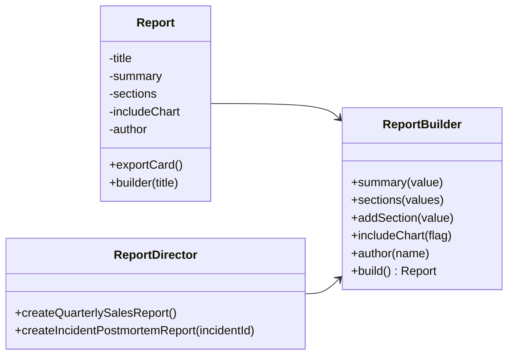
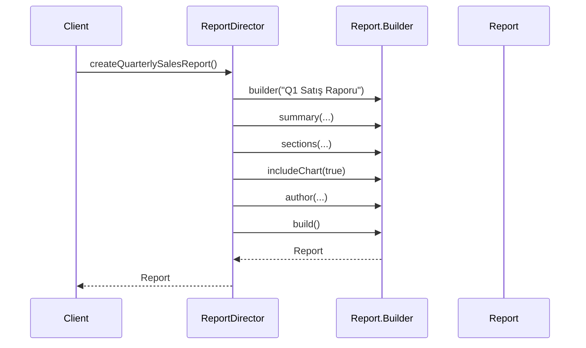

# Builder (Creational Pattern)

> Diğer adı: **Step-by-Step Construction**

## Niyet (Intent)
Builder, karmaşık nesneleri adım adım oluşturur; okunabilir, doğrulanabilir ve esnek kurulum akışı sağlar.

Kısa versiyon: **"Nesneyi bir kerede değil, kontrollü adımlarla kur."**

## Problem
Çok parametreli nesnelerde:
- Constructor patlaması (telescoping constructors) olur.
- Parametre sırası karışır.
- Zorunlu/opsiyonel ayrımı belirsizleşir.
- Geçersiz nesne oluşturma riski yükselir.

## Çözüm
Üretim adımlarını `Report.Builder` içine taşı:
- Zorunlu alanı başlangıçta al (`builder(title)`).
- Opsiyonelleri zincirli metotlarla kur.
- `build()` ile immutable `Report` üret.
- Tekrarlayan tarifleri `ReportDirector` ile merkezileştir.

## Yapı

## Runtime akışı

## Bu projedeki model
- `Report` → Product (immutable)
- `Report.Builder` → Concrete Builder
- `ReportDirector` → Director
- `BuilderDemo` → Client

## Teknik notlar
- `normalize(...)` ile null/blank validasyonları tek yerde toplanır.
- `sections` için defensive copy uygulanır (`new ArrayList`, `List.copyOf`).
- Immutable final ürün sayesinde inşa sonrası state değişim riskleri azalır.

## Ne zaman kullanılır?
- Opsiyonel alan sayısı fazlaysa.
- Aynı ürünün farklı reçeteleri tekrar ediyorsa.
- Kod okunabilirliği ve API ergonomisi önemliyse.

## Ne zaman kullanma?
- Çok basit DTO/VO yapılarında.
- Üretim adımı zaten tek satır ve kararlıysa.

## Artılar / Eksiler

**Artılar**
- Okunabilir, akıcı kurulum
- Geçerlilik kurallarını merkezileştirme
- Immutable modelle iyi uyum

**Eksiler**
- Basit nesnelerde ek sınıf/method yükü
- Yanlış tasarımda aşırı fluent API karmaşası

## Kısa özet
Builder, parametre kalabalığını yönetilebilir hale getirir; özellikle domain nesnesi doğruluğu ve okunabilirliğin kritik olduğu projelerde ciddi kalite artışı sağlar.
