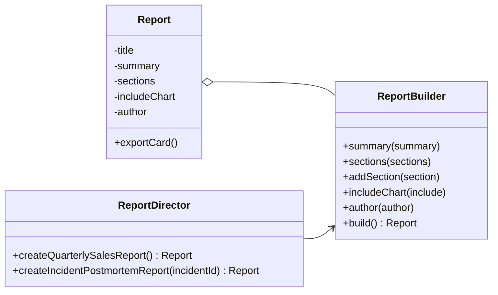

# Builder (Creational Pattern)

> Diğer adı: **Step-by-Step Object Construction**

## Niyet (Intent)
Builder, karmaşık bir nesnenin oluşturulma sürecini adımlara böler. Böylece aynı inşa sürecinden farklı temsil/konfigürasyonlar üretilebilir.

Kısa versiyon: **"Parametre kalabalığını yönet, nesneyi adım adım kur."**

## Problem
Çok sayıda opsiyonel alana sahip nesnelerde:
- Constructor sayısı hızla artar (constructor telescoping).
- Parametre sırası karışır, okunabilirlik düşer.
- Zorunlu/opsiyonel alan ayrımı bulanıklaşır.
- Geçersiz veya eksik nesne üretme riski artar.

Özellikle rapor, kampanya, request payload gibi veri yapılarında bu durum bakımı zorlaştırır.

## Çözüm
Nesnenin inşasını ayrı bir `Builder` sınıfına taşı:
- Builder adım adım alanları toplar.
- `build()` ile final immutable nesne üretilir.
- İstersen `Director` ile tekrar eden tarifleri merkezileştirirsin.

Bu projede `Report` immutable product, `Report.Builder` adım adım kurucu, `ReportDirector` ise hazır tarif sağlayıcıdır.

## Yapı

## Bu projedeki model

- `Report` → Product
- `Report.Builder` → Concrete Builder
- `ReportDirector` → Director
- `BuilderDemo` → Client akışı

## Gerçek hayattan analoji
Araba siparişi düşün:
- Temel model sabit (`Report`).
- Renk, paket, jant, multimedya gibi alanlar adım adım seçiliyor (`Builder`).
- Filonun standart araç konfigürasyonlarını merkezi bir ekip belirliyor (`Director`).

## Developer kullanım senaryoları
- API request/payload üretimi (opsiyonel alan çoksa)
- Rapor ve doküman nesneleri
- Test fixture üretimi
- UI component konfigürasyonları

## OOP / SOLID katkısı
- **SRP:** Nesnenin davranışı (`Report`) ile inşa süreci (`Builder`) ayrılır.
- **Encapsulation:** Geçerli nesne üretim kuralları builder içinde toplanır.
- **Readability:** Zincirli çağrılarla kod okunabilirliği artar.

## Uygulanabilirlik
- Çok sayıda opsiyonel parametre varsa.
- Nesne immutable tasarlanacaksa.
- Aynı ürün farklı kombinasyonlarla sıkça üretilecekse.
- Hazır tariflere ihtiyaç varsa (`Director` ile).

## Artılar / Eksiler

**Artılar**
- Okunabilir ve akıcı API
- Constructor karmaşasını azaltır
- Zorunlu alan doğrulamalarını merkezileştirir
- Immutable model ile uyumlu

**Eksiler**
- Basit nesnelerde ek sınıf maliyeti
- Aşırı kullanılırsa gereksiz soyutlama

## Kısa özet
Builder, özellikle opsiyonel alanları fazla olan nesnelerde hem okunabilirliği hem doğruluğu yükseltir. Director ile birlikte kullanıldığında tekrar eden inşa şablonlarını da temizce yönetirsin.
