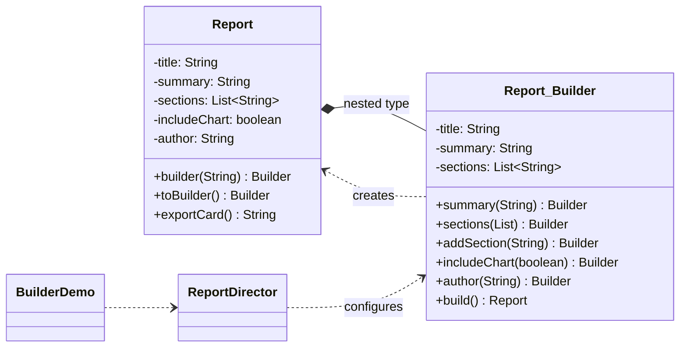
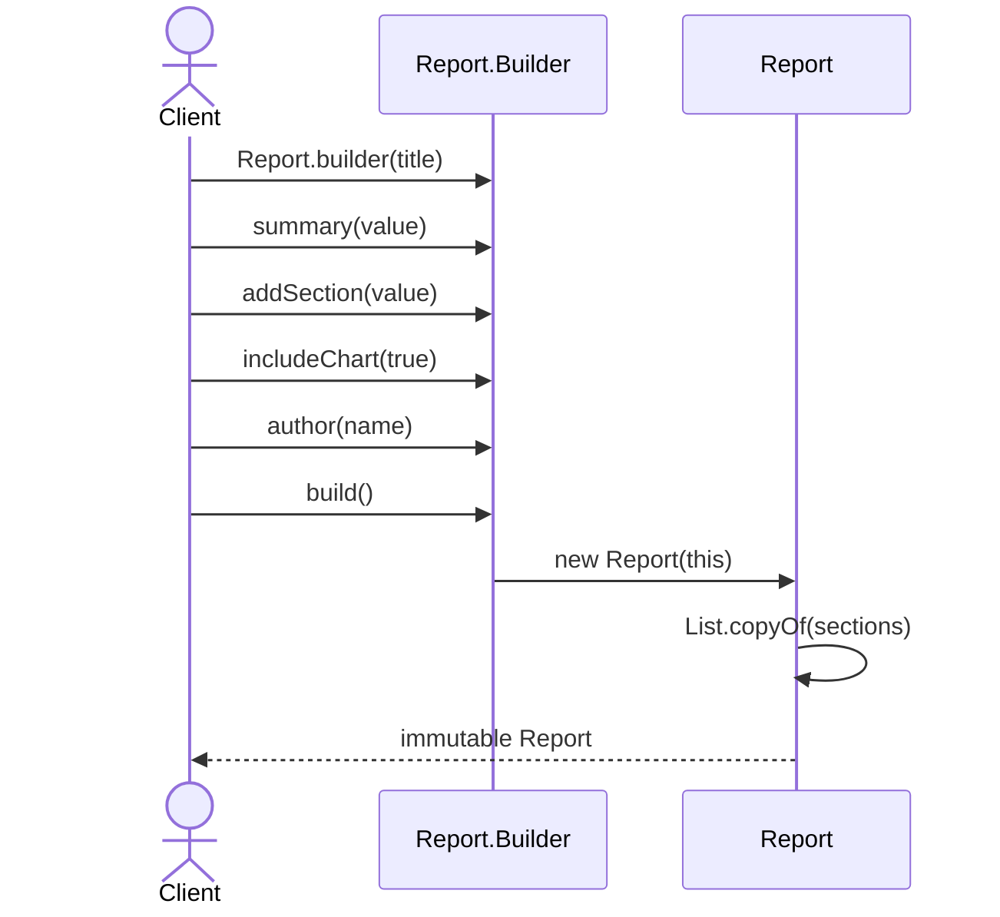
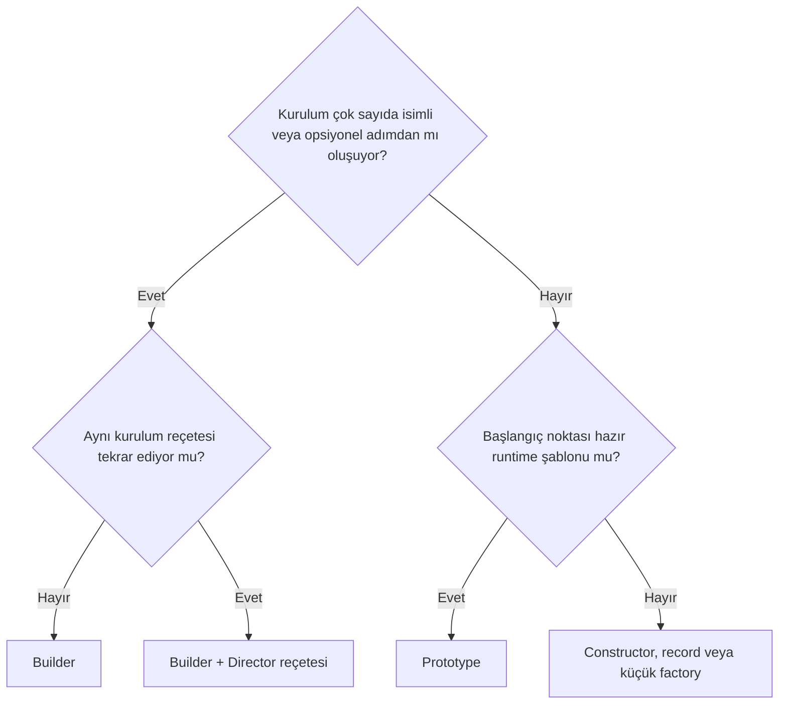

# Builder

Builder, çok alanlı bir nesneyi okunabilir adımlarla kurup en sonda tutarlı bir ürün üretir.
Bu repoda immutable `Report`, nested `Report.Builder` ile oluşturulur.

## 30 saniyelik kart

| Soru | Cevap |
|---|---|
| **Niyet** | Karmaşık bir nesnenin kurulumunu constructor kalabalığından ayırmak |
| **Değişen eksen** | Report'a hangi opsiyonel alan ve section'ların ekleneceği |
| **Sabit kalan** | `build()` sonunda immutable `Report` üretilmesi |
| **Bedel** | Mutable builder durumu ve ek API yüzeyi oluşur |
| **Bu repodaki giriş** | `Report.builder(title)` |

> Kısa tanım: **Önce parçaları tezgâhta düzenle, hazır olduğunda ürünü mühürle.**

## Örnek haritası: temel → güçlendirilmiş → production

| Katman | Gerçek kod karşılığı | Ne öğretiyor? |
|---|---|---|
| **Temel örnek** | `Report.builder(title)` ve fluent adımlar | Zorunlu alanla başlayan mutable builder, `build()` anında immutable `Report` snapshot'ı üretir |
| **Güçlendirilmiş örnek** | `Report#toBuilder()` ve normalize edilen `sections(List)` | Mevcut rapordan yalnız seçilen alanları değişen yeni varyant türetilir; tekli ve toplu section girişleri aynı kurala uyar |
| **Production sınırı** | `ReportDirector` reçetelerinin ötesi | Cross-field kuralları, localization, kalıcı çıktı formatları ve çok büyük bölüm listelerinde kopyalama maliyeti bu küçük modelde çözülmez |

`com.can.demo.creational.builder.BuilderDemo`, custom kurulumu ve iki director reçetesini korurken quarterly rapordan bir executive-summary varyantı da türetir.

## Paket sınırı: pattern kodu ve çalıştırılabilir demo

Immutable product, nested builder ve tekrar kullanılabilir reçeteler `com.can.creational.builder` domain paketinde kalır.
`com.can.demo.creational.builder.BuilderDemo` ise `main` / `run` giriş noktalarından bu API'yi kullanan composition root'tur; bağımlılık yönü **demo → domain** biçimindedir.
Demo sınıfına davranış veya doğrulama kuralı konmaz; bu kurallar `Report.Builder` ve `ReportDirector` içinde test edilebilir kalır.
Diyagramlarda uzun FQCN yerine kısa `BuilderDemo` adı gösterilir.

`src/test` altındaki `com.can.creational.builder.BuilderDemoTest` çalıştırma demosunu değil, builder ve immutable product kontratlarını doğrular.

## Akılda kalıcı analoji: kişiselleştirilen sandviç

Ekmek zorunludur; peynir, sos ve sebzeler seçime bağlıdır.
Kasiyere on boolean parametre vermek yerine seçimler sırayla söylenir.
Sipariş tamamlanınca mutfak değiştirilemeyen nihai sandviçi çıkarır.

`Report.Builder` hazırlık tezgâhı, `Report` teslim edilmiş üründür.
`ReportDirector` ise sık siparişler için kayıtlı reçeteleri temsil eder.

Bu bir **kavramsal benzetmedir**; restoran sistemlerinin içeride mutlaka Builder kullandığını iddia etmez.

## Pattern olmasaydı problem nasıl görünürdü?

Çok parametreli constructor çağrısı şöyle olabilirdi:

```java
Report report = new Report(
        "Q2 Satış Raporu",
        "İkinci çeyrek metrikleri",
        List.of("Revenue", "Churn"),
        true,
        "Analytics Team"
);
```

Alanlar arttıkça:

- Aynı tipteki parametrelerin sırası karışır.
- `true` değerinin neyi açtığı çağrı yerinde görünmez.
- Opsiyonel kombinasyonlar telescoping constructor üretir.
- Default değerler farklı constructor'lara dağılır.
- Mutable liste ürünün içine sızabilir.

Named argument olmayan Java'da çağrının niyetini okumak zorlaşır.

## Çözüm ve sınırı

Gerçek API zorunlu title'ı başlangıçta alır:

```java
Report report = Report.builder("Q2 Satış Raporu")
        .summary("İkinci çeyrek metrikleri")
        .addSection("Revenue")
        .addSection("Churn")
        .includeChart(true)
        .author("Analytics Team")
        .build();
```

Builder şunları otomatik garanti etmez:

- Her fluent API doğru doğrulama yapıyor değildir.
- Builder'ın kendisi immutable değildir.
- Adımların her sırada çağrılması domain açısından geçerli olmayabilir.
- Basit bir nesnede sınıf ve metot sayısını gereksiz artırabilir.
- Aynı builder eşzamanlı thread'lerde güvenle paylaşılamaz.

Bu örnek, Effective Java tarzı nested fluent builder'dır.
Klasik GoF Builder'daki ayrı `Builder` arayüzü ve birden fazla representation burada yoktur.

## Repo sınıfları ve pattern rolleri

| Sınıf / API | Rol | Sorumluluk |
|---|---|---|
| `Report` | Product | Kurulum sonrası immutable raporu temsil eder |
| `Report.Builder` | Concrete Builder | Alanları toplar, normalize eder ve product üretir |
| `Report.builder(String)` | Builder factory | Zorunlu title ile builder başlatır |
| `Report#toBuilder()` | Varyant başlangıcı | Mevcut immutable raporun alanlarını yeni builder'a kopyalar |
| `summary(String)` | Build step | Özeti ayarlar |
| `sections(List<String>)` | Build step | Section listesinin kopyasını alır |
| `addSection(String)` | Build step | Normalize edilmiş tek section ekler |
| `includeChart(boolean)` | Build step | Chart bayrağını ayarlar |
| `author(String)` | Build step | Yazarı ayarlar |
| `build()` | Terminal step | Builder snapshot'ından `Report` üretir |
| `ReportDirector` | Reçete helper'ı | İki hazır Report kurulumu sunar |
| `com.can.demo.creational.builder.BuilderDemo` | Demo / composition root | Custom, hazır ve mevcut üründen türetilmiş reçeteleri karşılaştırır |

## Yapı diyagramı


```mermaid
classDiagram
    direction LR

    class Report {
        -title: String
        -summary: String
        -sections: List~String~
        -includeChart: boolean
        -author: String
        +builder(String) Builder
        +toBuilder() Builder
        +exportCard() String
    }

    class Report_Builder {
        -title: String
        -summary: String
        -sections: List~String~
        +summary(String) Builder
        +sections(List) Builder
        +addSection(String) Builder
        +includeChart(boolean) Builder
        +author(String) Builder
        +build() Report
    }

    Report *-- Report_Builder : nested type
    Report_Builder ..> Report : creates
    ReportDirector ..> Report_Builder : configures
    BuilderDemo ..> ReportDirector
```

## Çalışma zamanı akışı


```mermaid
sequenceDiagram
    actor Client
    participant Builder as Report.Builder
    participant Product as Report

    Client->>Builder: Report.builder(title)
    Client->>Builder: summary(value)
    Client->>Builder: addSection(value)
    Client->>Builder: includeChart(true)
    Client->>Builder: author(name)
    Client->>Builder: build()
    Builder->>Product: new Report(this)
    Product->>Product: List.copyOf(sections)
    Product-->>Client: immutable Report
```

## Yanlış araç seçimini önleyen karar diyagramı


```mermaid
flowchart TD
    A{"Kurulum çok sayıda isimli veya opsiyonel adımdan mı oluşuyor?"}
    A -- Evet --> B{"Aynı kurulum reçetesi tekrar ediyor mu?"}
    B -- Hayır --> C["Builder"]
    B -- Evet --> D["Builder + Director reçetesi"]
    A -- Hayır --> E{"Başlangıç noktası hazır runtime şablonu mu?"}
    E -- Evet --> F["Prototype"]
    E -- Hayır --> G["Constructor, record veya küçük factory"]
```

Builder'ın seçim sinyali fluent sözdizimi değil, **kurulum kararlarının okunabilir ve doğrulanabilir bir süreç olarak ayrılmasıdır**.
İki alanlı bir value object için builder eklemek yalnız API yüzeyini büyütür; hazır bir nesneyi kopyalayarak başlamak gerekiyorsa Prototype daha doğru soruyu cevaplar.

## Kodu adım adım okuma

### 1. Zorunlu alan girişte alınır

`Report.builder(title)`, private builder constructor'ını çağırır.
Title null veya blank olamaz ve `trim()` ile normalize edilir.

### 2. Opsiyoneller anlamlı default'larla başlar

- `summary`: `"No summary"`
- `sections`: boş liste
- `includeChart`: `false`
- `author`: `"Unknown"`

Client yalnız değiştirmek istediği alanları çağırır.

### 3. Fluent metot aynı builder'ı döndürür

Her setter `this` döndürdüğü için zincir kurulabilir.
Bu, builder'ın mutable olduğu anlamına gelir; henüz `Report` değildir.

### 4. Liste iki sınırda korunur

`sections(values)`, her elemanı normalize eden yeni bir liste üreterek input listesinden ayrılır.
`Report` constructor'ı `List.copyOf` ile değiştirilemez product snapshot'ı üretir.
Builder sonradan kullanılsa bile önceki Report değişmez.

### 5. `addSection` ile `sections` aynı doğrulamayı paylaşır

`addSection` null/blank section'ı reddeder ve trim eder.
`sections(List)` de listedeki her elemanı aynı `normalize(section, "section")` fonksiyonundan geçirir.
Böylece tekli girişte kabul edilmeyen blank değer, toplu API üzerinden sisteme sızamaz.

### 6. Director hazır reçete sağlar

`createQuarterlySalesReport()` ve `createIncidentPostmortemReport(id)` tekrar eden adımları toplar.
Bu sınıf generic bir GoF Director değil, `Report.Builder`a bağlı pratik bir reçete helper'ıdır.
Incident ID null/blank olamaz ve başlığa eklenmeden önce trim edilir.

### 7. `toBuilder()` güvenli bir varyant başlangıcıdır

`toBuilder()`, raporun bütün scalar alanlarını ve section listesinin yeni kopyasını private builder constructor'ına taşır.
Client yalnız değişen kararları çağırır; örneğin ayrıntılı quarterly rapordan daha kısa bir executive rapor üretir.
Bu bir in-place güncelleme değildir: kaynak `Report` aynen kalır ve ikinci `build()` yeni bir object üretir.

## Testlerin anlattığı kontratlar

`BuilderDemoTest` şu kontratları korur:

| `@Nested` grup | Korunan davranış |
|---|---|
| `FluentConstruction` | İsimli adımlarla bütün alanların kurulması, section ekleme sırası ve çağrılmayan opsiyonellerin belgelenen default’ları |
| `ValidationBoundary` | Title/summary/author ile tekli ve toplu section girişlerinin aynı trim/doğrulama politikasına uyması; null/blank değerlerin doğru API sınırında reddi |
| `ImmutableProduct` | Kaynak listenin ve accessor sonucunun ürünü değiştirememesi; builder tekrar kullanıldığında daha önce üretilen `Report`un snapshot olarak kalması |
| `DerivedReportVariants` | `toBuilder()`ın bütün mevcut kararları taşıyıp kaynak raporu değiştirmeden yalnız seçilen alanları farklı yeni bir ürün üretmesi |
| `DirectorRecipes` | Quarterly ve incident reçetelerinin beklenen bütün alanları kurması; incident ID’nin trim edilmesi ve eksik ID’nin erken reddi |

Testler `Report` için `equals` olmadığı için alan accessor'larını `assertAll` ile karşılaştırır.

## Ne zaman kullanılır?

- Zorunlu ve opsiyonel alanlar birlikteyse.
- Aynı türden çok constructor parametresi varsa.
- Okunabilir çağrı API'si önemliyse.
- Nihai ürün immutable tutulacaksa.
- Kurulum sonunda çapraz alan doğrulaması yapılacaksa.

## Ne zaman kullanma?

- İki alanlı basit value object için constructor yeterliyse.
- Record canonical constructor niyeti açıkça anlatıyorsa.
- Ürün adım adım değil tek factory çağrısıyla doğal oluşuyorsa.
- Builder yalnız bütün alanları birebir tekrar eden boilerplate ise.

## Artılar ve bedeller

| Artı | Bedel |
|---|---|
| Çağrı yerinde alan adları görünür | Ek builder API'si bakım ister |
| Default ve doğrulama merkezileşir | Builder mutable ve thread-safe değildir |
| Immutable product üretmek kolaylaşır | Eksik doğrulama geç hataya dönüşebilir |
| Constructor patlamasını önler | Çok sayıda fluent adım uzun zincir üretir |
| Reçeteler tekrar kullanılabilir | Director yanlış adlandırılırsa beklenti karışır |

## Production hardening

Güçlendirilmiş örnek artık şunları uygular:

- `sections(List)` içindeki her elemanı `addSection` ile aynı şekilde doğrulamak.
- `incidentId` için null/blank doğrulaması ve normalizasyon.
- `toBuilder()` içinde listeyi kopyalayarak kaynak product ile yeni builder'ı ayırmak.

Production kararları olarak kalanlar:

- `trim()` yerine Unicode-aware `strip()` kararını değerlendirmek.
- Çok section ekleniyorsa her çağrıda liste kopyalamak yerine tek mutable buffer kullanmak.
- Build sırasında çapraz alan kuralları uygulamak.
- Hata mesajlarını domain diliyle standartlaştırmak.
- `Report` için gerekiyorsa value equality veya record alternatifi değerlendirmek.
- Director reçetelerinin sabit metinlerini configuration/localization katmanına taşımak.

Mevcut testler hem temel kurulum kontratını hem bu güçlendirmeleri ayrı `@Nested` bağlamlarda sabitler.

## Benzer pattern'lerle karşılaştırma

| Pattern | Ana soru | Builder'dan farkı |
|---|---|---|
| Factory Method | Hangi concrete product oluşacak? | Builder tek product'ın nasıl kurulacağına odaklanır |
| Abstract Factory | Hangi uyumlu ürün ailesi oluşacak? | Builder aile değil adım ve configuration yönetir |
| Prototype | Hangi mevcut örnek kopyalanacak? | Builder çoğunlukla sıfırdan kurar |
| Fluent Interface | API nasıl akıcı okunur? | Builder fluent olabilir; her fluent API Builder değildir |
| Parameter Object | Parametreleri hangi nesnede taşıyayım? | Üretim süreci ve terminal `build()` şart değildir |

## Yaygın hatalar

1. Bütün alanları opsiyonel yapıp geçersiz product üretmek.
2. `build()` sonrasında builder'ın mutable listesini product'a doğrudan vermek.
3. Fluent setter içinde doğrulama, build içinde başka doğrulama kullanıp tutarsızlık yaratmak.
4. Builder'ı thread'ler arasında paylaşmak.
5. Her fluent API'yi GoF Builder sanmak.
6. Reçete helper'ını birden fazla representation yöneten klasik Director gibi anlatmak.

## Üç kademeli alıştırma

### Seviye 1 — yeni alan

Opsiyonel `department` alanı ekle.
Default değerini, normalize kuralını, accessor'ını ve export testini tamamla.

### Seviye 2 — çapraz alan kuralı

`includeChart(true)` ise en az bir section zorunlu olsun.
Kuralın fluent adımda mı `build()` aşamasında mı daha doğru olduğunu gerekçelendir.

### Seviye 3 — iki representation

Aynı rapor reçetesinden text ve HTML çıktı üreten iki builder tasarla.
Bu kez generic bir Director'ın neden anlamlı hale geldiğini göster.

## Tek cümlelik hafıza çengeli

> **Builder: zorunlu parçayla başla, seçenekleri isimli adımlarla ekle, `build()` ile immutable ürünü mühürle.**
