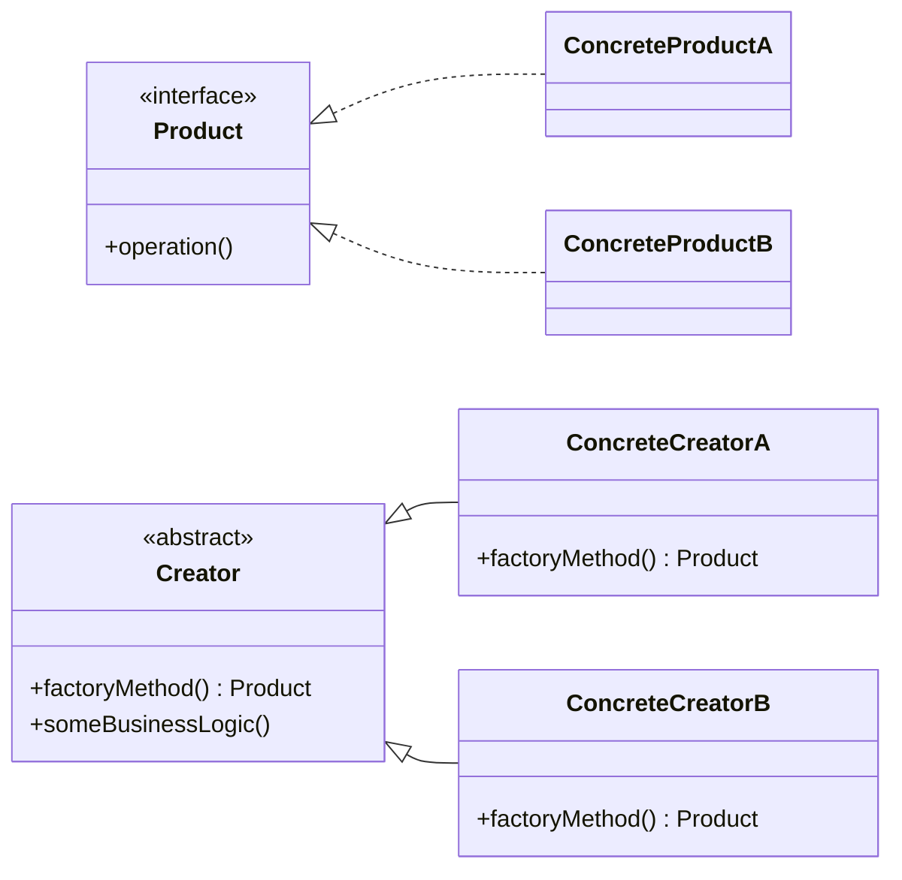
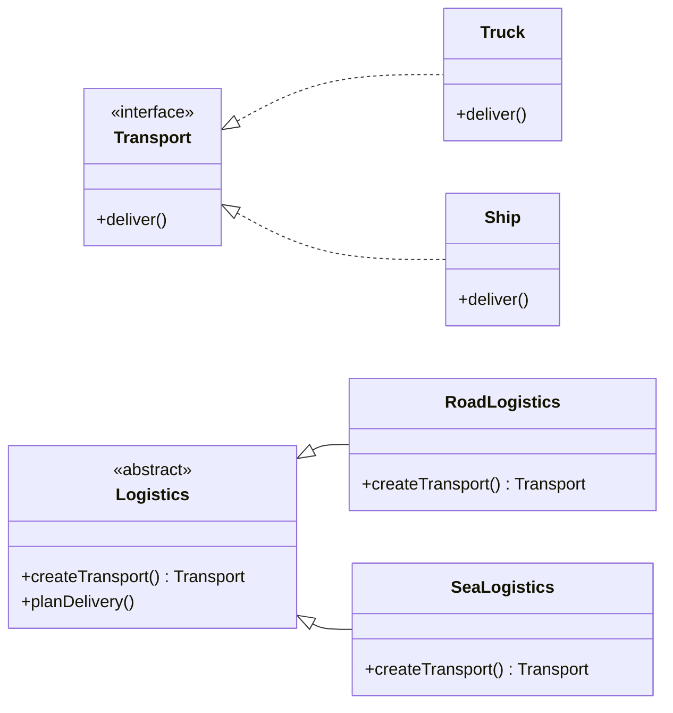
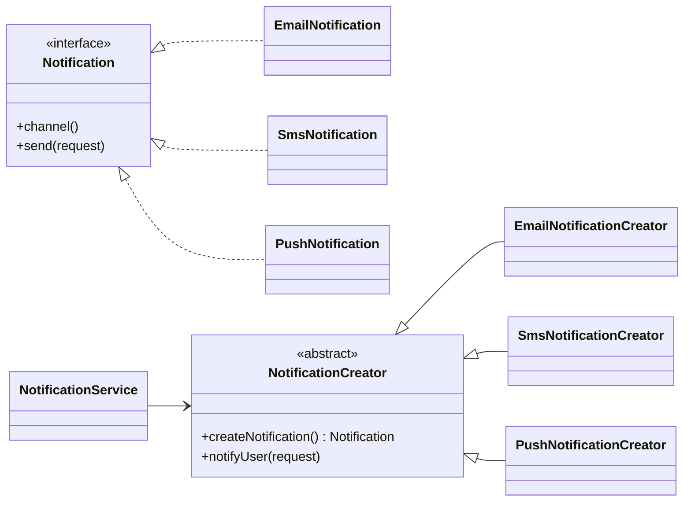

# Factory Method (Virtual Constructor / Sanal Kurucu)

Factory Method, **nesne oluşturma işini** doğrudan `new` çağrılarından alıp bir “fabrika metodu”na taşır. Böylece istemci kod (client), somut sınıfları bilmeden yalnızca ortak arayüz (interface) üzerinden çalışır.

---

## 1) Niyet (Intent)

Factory Method, bir üst sınıfta nesne üretimi için bir yöntem tanımlar; alt sınıflar bu yöntemi ezerek (override) hangi somut ürünün üretileceğini belirler.

**Kısaca:**
- “Neyi üretirim?” kararı alt sınıfa gider.
- “Üretilen nesneyi nasıl kullanırım?” kararı üst sınıfta kalır.

---

## 2) Problem: Neden Factory Method’a ihtiyaç duyarız?

Klasik başlangıç senaryosu:
- Uygulama sadece `Truck` (kara taşımacılığı) destekler.
- Kodun birçok yerinde `new Truck()` vardır.
- Sonra `Ship` (deniz taşımacılığı) ihtiyacı gelir.

Bu durumda:
1. Kod tabanında çok sayıda yerde değişiklik gerekir.
2. `if/else` veya `switch` blokları büyür.
3. Yeni tür eklendikçe (örn. `Train`, `Airplane`) karmaşa artar.
4. İstemci kod somut sınıflara sıkı bağlı kalır.

---

## 3) Çözüm Özeti

`new ConcreteProduct()` çağrılarını, Creator sınıfındaki bir **factory method** içine taşı.

- Üst sınıf (Creator), işi yürüten akışı içerir.
- Alt sınıf (Concrete Creator), hangi ürünün döneceğini belirler.
- İstemci sadece `Product` arayüzünü bilir.

---

## 4) Pattern Yapısı

### Roller

- **Product**: Tüm ürünlerin ortak arayüzü
- **Concrete Product**: Product’ın somut implementasyonları
- **Creator**: Factory method’u tanımlayan sınıf
- **Concrete Creator**: Factory method’u override ederek somut ürün dönen sınıf

### Sınıf Diyagramı (Genel)



---

## 5) Verdiğin lojistik örneğinin Türkçe anlatımı

Senaryoda başlangıçta sadece `Truck` varken, sonradan `Ship` desteği gerekiyor.

### Product arayüzü
- `Transport`
- Ortak metot: `deliver()`

### Concrete Product’lar
- `Truck`: karadan teslimat
- `Ship`: denizden teslimat

### Creator
- `Logistics`
- `createTransport(): Transport` gibi bir factory method tanımlar.
- Ana iş akışında (ör. sevkiyat süreci) bu metotla ürün alır.

### Concrete Creator’lar
- `RoadLogistics` → `Truck` döndürür
- `SeaLogistics` → `Ship` döndürür

### Diyagram (Lojistik)



### Akış Diyagramı

```mermaid
flowchart TD
    A[Client] --> B[Logistics.planDelivery()]
    B --> C[createTransport()]
    C --> D{Concrete Logistics?}
    D -->|RoadLogistics| E[Truck]
    D -->|SeaLogistics| F[Ship]
    E --> G[deliver()]
    F --> G
```

---

## 6) UI Dialog örneğinin Türkçe çevirisi

Bu örnekte amaç, platforma göre farklı buton üretmek:

- `Dialog` (Creator) içinde `createButton(): Button` tanımlanır.
- `WindowsDialog` → `WindowsButton`
- `WebDialog` → `HTMLButton`
- `Dialog.render()` içinde yalnızca `Button` arayüzü kullanılır.

Böylece `Dialog` kodu değişmeden farklı platform butonlarıyla çalışır.

---

## 7) Bu repository’de Factory Method eşlemesi

Mevcut sınıflar bu pattern’e birebir oturuyor:

- **Product**: `Notification`
- **Concrete Product**:
  - `EmailNotification`
  - `SmsNotification`
  - `PushNotification`
- **Creator**: `NotificationCreator`
- **Concrete Creator**:
  - `EmailNotificationCreator`
  - `SmsNotificationCreator`
  - `PushNotificationCreator`
- **Client / Orkestrasyon**: `NotificationService`

### Proje Diyagramı



---

## 8) Ne zaman kullanılmalı? (Applicability)

Factory Method iyi bir seçimdir, eğer:

1. Çalışma zamanında hangi somut nesnenin üretileceği belli değilse.
2. Kütüphane/framework kullanıcılarına genişletme noktası vermek istiyorsan.
3. Kaynak maliyetini düşürmek için bazen cache/pool’dan obje döndürmek istiyorsan.
4. Oluşturma kodunu iş mantığından ayırmak istiyorsan.

---

## 9) Nasıl uygulanır? (Adım adım)

1. Ortak bir `Product` arayüzü belirle.
2. Creator içine `factoryMethod()` ekle (gerekirse abstract).
3. Dağınık `new` çağrılarını creator içine taşı.
4. Her ürün türü için concrete creator yaz ve override et.
5. İstemciyi sadece Creator/Product soyutlamasıyla konuştur.
6. Gerekirse varsayılan ürün dönen base factory method bırak.

---

## 10) Artılar / Eksiler

### Artılar
- Somut ürünlerle sıkı bağımlılığı azaltır.
- Open/Closed Principle’a uyumu artırır.
- Üretim kodunu merkezileştirir.
- Test edilebilirliği artırır (mock/stub creator kolaylaşır).

### Eksiler
- Sınıf sayısı ve soyutlama katmanı artar.
- Çok basit senaryolarda gereksiz karmaşıklık yaratabilir.

---

## 11) Factory Method vs Simple Factory (kısa not)

- **Simple Factory**: Genelde tek sınıfta `if/switch` ile ürün döner.
- **Factory Method**: Üretim kararını kalıtım üzerinden alt sınıflara dağıtır.

Yani Factory Method, genişleyebilirliği daha güçlü ama yapısal olarak biraz daha “ağır” bir çözümdür.

---

## 12) Sonuç

Factory Method, özellikle ürün çeşitliliğinin arttığı projelerde “değişen kısım” olan üretim kararını izole eder. Bu sayede istemci kod daha stabil kalır, yeni ürün eklemek daha güvenli ve düşük maliyetli hale gelir.

Bu doküman, hem klasik lojistik/UI örneğini hem de bu projedeki `Notification` akışını aynı kavramsal çatı altında anlatır.
