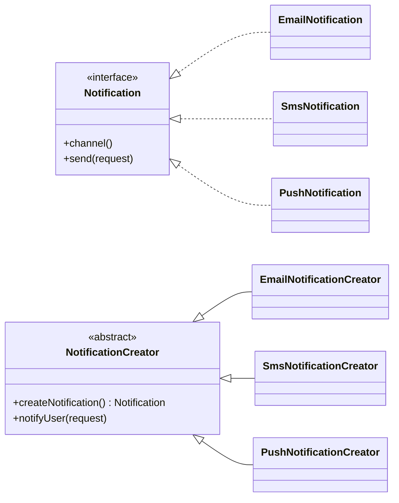

# Factory Method (Creational Pattern)

> Diğer adı: **Virtual Constructor (Sanal Kurucu)**

## Niyet (Intent)
Factory Method, üst sınıfta nesne üretmek için bir arayüz tanımlar; alt sınıflar hangi somut ürünün oluşturulacağını belirler.

## Problem
Doğrudan `new` kullanımı farklı katmanlara dağıldığında:
- Somut sınıflara bağımlılık artar.
- Yeni ürün eklendikçe `if/else` blokları büyür.
- Bakım maliyeti yükselir.

## Çözüm
Nesne oluşturma sorumluluğunu **factory method** içine taşı:
- Client kodu yalnızca `Product` arayüzünü bilir.
- Somut ürün kararı `ConcreteCreator` tarafından verilir.
- Yeni ürün tipi eklemek için yeni creator sınıfı yazmak yeterli olur.

## Yapı

## Bu projedeki model

- `Notification` → Product
- `EmailNotification`, `SmsNotification`, `PushNotification` → Concrete Product
- `NotificationCreator` → Creator
- `EmailNotificationCreator`, `SmsNotificationCreator`, `PushNotificationCreator` → Concrete Creator
- `NotificationService` → Client tarafı orkestrasyon

## Uygulanabilirlik
- Çalışma zamanında ürün türü değişebiliyorsa.
- Yeni ürün ekleme sıklığı yüksekse.
- Oluşturma kodunu iş mantığından ayırmak istiyorsan.

## Artılar / Eksiler

**Artılar**
- Gevşek bağlılık
- Open/Closed Principle uyumu
- Ürün üretimini tek noktada toplama

**Eksiler**
- Sınıf sayısını artırır
- Basit senaryolarda fazla soyutlama olabilir
