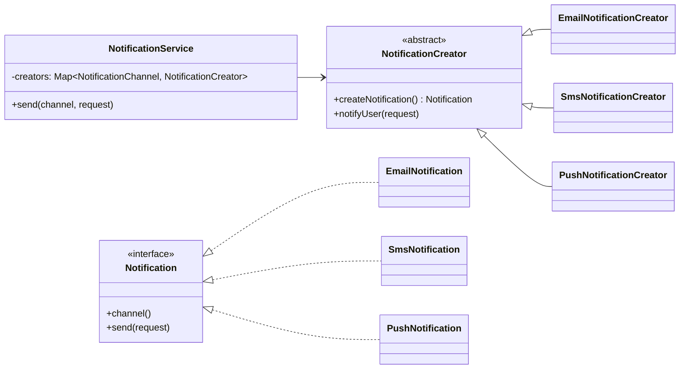
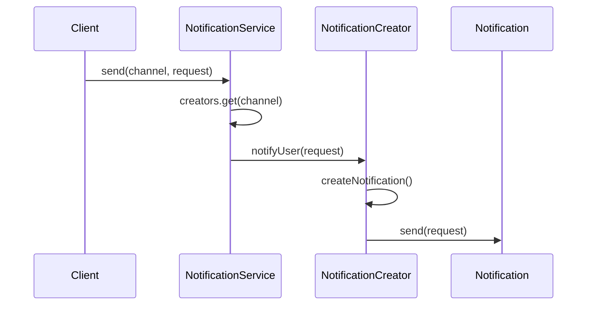

# Factory Method (Creational Pattern)

> Diğer adı: **Virtual Constructor (Sanal Kurucu)**

## Niyet (Intent)
Factory Method, nesne üretim kararını client akışından ayırır. Üst sınıf ortak iş akışını korurken, hangi somut ürünün üretileceğini alt sınıflar belirler.

Kısa versiyon: **"Akış sabit, ürün seçimi genişletilebilir."**

## Problem
Doğrudan `new` kullanımı iş katmanına yayıldığında:
- Somut sınıflara bağımlılık büyür.
- Kanal/ürün sayısı arttıkça `if-else` veya `switch` şişer.
- Yeni tip eklemek mevcut akışı değiştirmeyi zorunlu kılar.
- Testte mock/stub enjekte etmek zorlaşır.

## Çözüm
Üretim sorumluluğunu `NotificationCreator#createNotification()` metoduna taşı:
- Client sadece `Notification` kontratını bilir.
- `Email/Sms/Push` gibi farklı ürünler ayrı creator sınıflarıyla eklenir.
- `NotificationService` yalnızca kanal→creator eşlemesini yönetir.

## Yapı



## Runtime akışı



## Bu projedeki model
- `Notification` → Product
- `EmailNotification`, `SmsNotification`, `PushNotification` → Concrete Product
- `NotificationCreator` → Creator
- `EmailNotificationCreator`, `SmsNotificationCreator`, `PushNotificationCreator` → Concrete Creator
- `NotificationService` → Client orkestrasyonu

## Teknik notlar
- `NotificationService` constructor’ında `Map.copyOf(...)` kullanımı runtime mutasyonu engeller.
- Creator katmanı, üretim anına loglama/telemetry/policy eklemek için doğal extension noktasıdır.
- Yeni kanal eklemek için mevcut client kodunu kırmadan yeni creator + product eklemek yeterlidir (OCP).

## Ne zaman kullanılır?
- Ürün tipleri düzenli artıyorsa.
- Üretim kararını iş akışından ayırmak istiyorsan.
- Client kodunun sadece arayüzü görmesini hedefliyorsan.

## Ne zaman kullanma?
- Tek ürün tipi varsa ve değişim beklenmiyorsa.
- Ek soyutlama maliyeti faydadan yüksekse.

## Artılar / Eksiler

**Artılar**
- OCP dostu genişleme
- Client kodunda somut tipe bağımlılık azalması
- Testte izolasyon kolaylığı

**Eksiler**
- Sınıf sayısını artırır
- Basit senaryolarda gereksiz soyutlama olabilir

## Kısa özet
Factory Method, özellikle kanal/ürün çeşitliliği büyüyen sistemlerde üretim kararını yönetilebilir hale getirir ve ana iş akışını sade tutar.

## Kısa Java Kod Örneği

```java
// Ürün arayüzü
public interface Notification {
    void send(String message);
}

// Somut ürünler
public class EmailNotification implements Notification {
    public void send(String message) {
        System.out.println("Email gönderildi: " + message);
    }
}
public class SmsNotification implements Notification {
    public void send(String message) {
        System.out.println("SMS gönderildi: " + message);
    }
}

// Creator
public abstract class NotificationCreator {
    public abstract Notification createNotification();
    public void notifyUser(String message) {
        Notification notification = createNotification();
        notification.send(message);
    }
}

// Somut creator
public class EmailNotificationCreator extends NotificationCreator {
    public Notification createNotification() {
        return new EmailNotification();
    }
}
```

## Gerçek Hayattan ve Farklı Sektörlerden Factory Method Örnekleri

### Finans
- **Ödeme Yöntemi Factory'si**: Kredi kartı, havale, kripto gibi farklı ödeme yöntemleri için `PaymentFactory` ile uygun ödeme nesnesi oluşturulabilir.

### Sağlık
- **Rapor Üretimi**: Kan testi, MR, röntgen gibi farklı rapor türleri için `ReportFactory` ile uygun rapor nesnesi üretilebilir.

### E-Ticaret
- **Kargo Firması Seçimi**: Siparişin gönderileceği kargo firmasına göre `ShippingFactory` ile uygun kargo nesnesi oluşturulabilir.

### Oyun
- **Karakter Tipi**: Savaşçı, büyücü, okçu gibi karakterler için `CharacterFactory` ile uygun karakter nesnesi üretilebilir.

## Factory Method vs Abstract Factory
- **Factory Method**: Tek bir ürün ailesinin farklı tiplerini üretmek için kullanılır. Her bir creator, tek bir ürün tipini üretir.
- **Abstract Factory**: Birbiriyle ilişkili birden fazla ürün ailesini birlikte üretmek için kullanılır. Birden fazla factory method içerir.

## Anti-pattern/ Yanlış Kullanım Örneği
- Sadece tek bir ürün tipi varsa ve değişim beklenmiyorsa gereksiz soyutlama yapmak kodu karmaşıklaştırır.
- Örnek: Sadece Email gönderilecekse, Factory Method gereksizdir.

## Test Edilebilirlik ve Genişletilebilirlik Avantajı
- Factory Method sayesinde mock veya stub notification nesneleri kolayca test ortamına enjekte edilebilir.
- Yeni bir kanal eklemek için mevcut kodu değiştirmeden yeni bir creator ve ürün eklemek yeterlidir (OCP).
