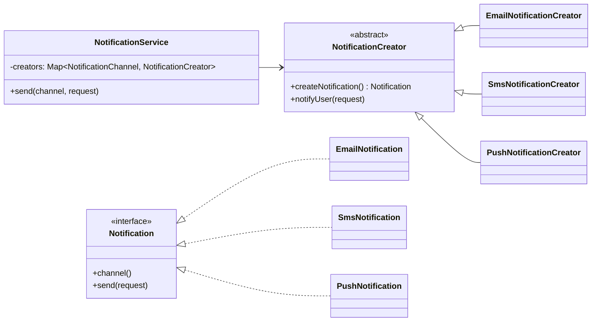
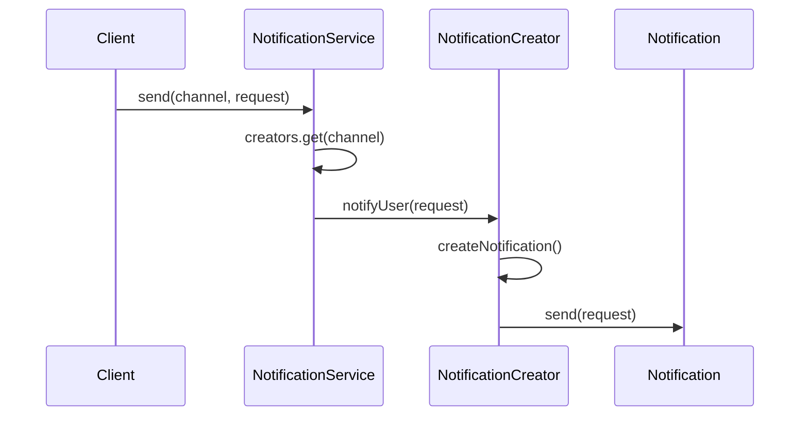

# Factory Method (Creational Pattern)

> Diğer adı: **Virtual Constructor (Sanal Kurucu)**

## Niyet (Intent)
Factory Method, nesne üretim kararını client akışından ayırır. Üst sınıf ortak iş akışını korurken, hangi somut ürünün üretileceğini alt sınıflar belirler.

Kısa versiyon: **"Akış sabit, ürün seçimi genişletilebilir."**

## Problem
Doğrudan `new` kullanımı iş katmanına yayıldığında:
- Somut sınıflara bağımlılık büyür.
- Kanal/ürün sayısı arttıkça `if-else` veya `switch` şişer.
- Yeni tip eklemek mevcut akışı değiştirmeyi zorunlu kılar.
- Testte mock/stub enjekte etmek zorlaşır.

## Çözüm
Üretim sorumluluğunu `NotificationCreator#createNotification()` metoduna taşı:
- Client sadece `Notification` kontratını bilir.
- `Email/Sms/Push` gibi farklı ürünler ayrı creator sınıflarıyla eklenir.
- `NotificationService` yalnızca kanal→creator eşlemesini yönetir.

## Yapı

## Runtime akışı

## Bu projedeki model
- `Notification` → Product
- `EmailNotification`, `SmsNotification`, `PushNotification` → Concrete Product
- `NotificationCreator` → Creator
- `EmailNotificationCreator`, `SmsNotificationCreator`, `PushNotificationCreator` → Concrete Creator
- `NotificationService` → Client orkestrasyonu

## Teknik notlar
- `NotificationService` constructor’ında `Map.copyOf(...)` kullanımı runtime mutasyonu engeller.
- Creator katmanı, üretim anına loglama/telemetry/policy eklemek için doğal extension noktasıdır.
- Yeni kanal eklemek için mevcut client kodunu kırmadan yeni creator + product eklemek yeterlidir (OCP).

## Ne zaman kullanılır?
- Ürün tipleri düzenli artıyorsa.
- Üretim kararını iş akışından ayırmak istiyorsan.
- Client kodunun sadece arayüzü görmesini hedefliyorsan.

## Ne zaman kullanma?
- Tek ürün tipi varsa ve değişim beklenmiyorsa.
- Ek soyutlama maliyeti faydadan yüksekse.

## Artılar / Eksiler

**Artılar**
- OCP dostu genişleme
- Client kodunda somut tipe bağımlılık azalması
- Testte izolasyon kolaylığı

**Eksiler**
- Sınıf sayısını artırır
- Basit senaryolarda gereksiz soyutlama olabilir

## Kısa özet
Factory Method, özellikle kanal/ürün çeşitliliği büyüyen sistemlerde üretim kararını yönetilebilir hale getirir ve ana iş akışını sade tutar.
