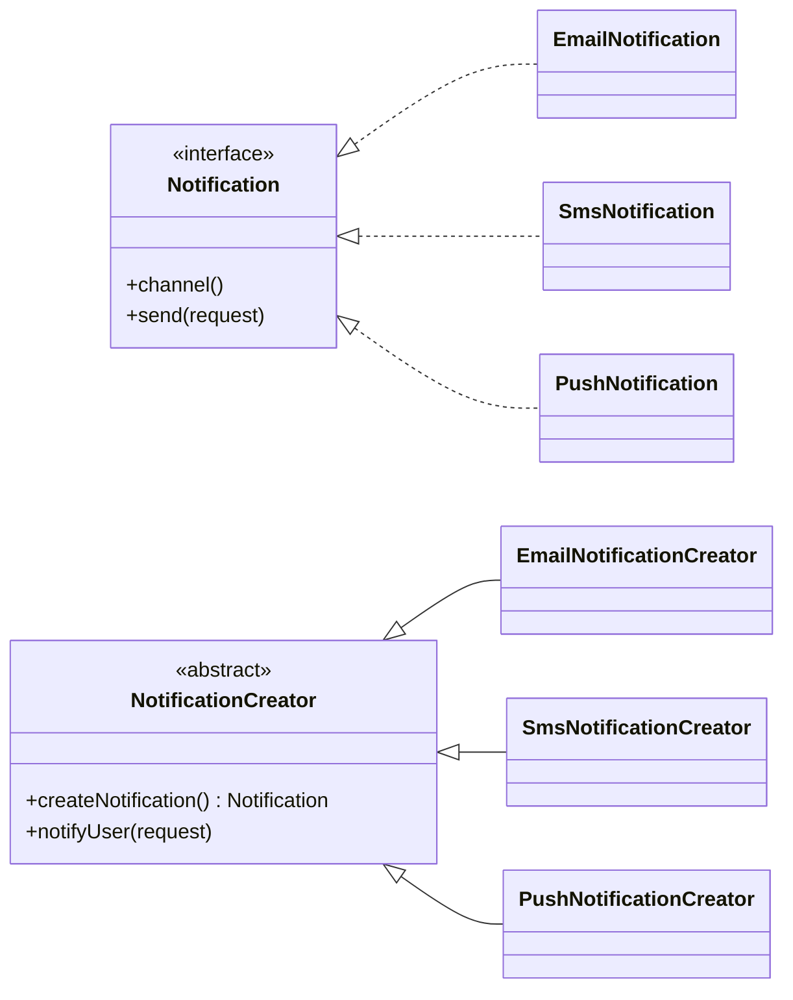

# Factory Method (Creational Pattern)

> Diğer adı: **Virtual Constructor (Sanal Kurucu)**

## Niyet (Intent)
Factory Method, üst sınıfta nesne üretmek için bir arayüz tanımlar; alt sınıflar hangi somut ürünün oluşturulacağını belirler.

Kısa versiyon: **"Neyi üreteceğini bana bırak, nasıl kullanacağını sen belirle."**

## Problem
Doğrudan `new` kullanımı farklı katmanlara dağıldığında:
- Somut sınıflara bağımlılık artar.
- Yeni ürün eklendikçe `if/else` veya `switch` blokları büyür.
- Test yazmak zorlaşır (mock/stub enjekte etmek güçleşir).
- Bakım maliyeti yükselir.

Örneğin bir bildirim servisinde e-posta, SMS, push ve WhatsApp desteği geldiğinde; her yeni kanal için ana iş akışını değiştirmek zorunda kalmak kırılgan bir tasarıma neden olur.

## Çözüm
Nesne oluşturma sorumluluğunu **factory method** içine taşı:
- Client kodu yalnızca `Product` arayüzünü bilir.
- Somut ürün kararı `ConcreteCreator` tarafından verilir.
- Yeni ürün tipi eklemek için yeni creator sınıfı yazmak yeterli olur.
- Üretim kararı tek noktada olduğu için konfigürasyon, loglama ve telemetry gibi çapraz ihtiyaçlar daha kolay yönetilir.

## Yapı

## Bu projedeki model

- `Notification` → Product
- `EmailNotification`, `SmsNotification`, `PushNotification` → Concrete Product
- `NotificationCreator` → Creator
- `EmailNotificationCreator`, `SmsNotificationCreator`, `PushNotificationCreator` → Concrete Creator
- `NotificationService` → Client tarafı orkestrasyon

## Gerçek hayattan analoji
Bir kargo şirketini düşün:
- "Gönderiyi ilet" süreci sabit.
- Teslimat aracı (motosiklet, kamyonet, drone) bölge ve gönderi tipine göre değişir.
- Operasyon ekibi teslimat sürecini bilir, ama "hangi araç oluşturulacak" kararını ayrı bir lojistik kuralı verir.

Buradaki lojistik kuralı = **Factory Method**, araçlar = **Concrete Product**.

## Developer kullanım senaryoları
- **Bildirim sistemleri:** kanal bazlı gönderim (email/sms/push).
- **Ödeme entegrasyonları:** `IyzicoPayment`, `StripePayment`, `PaypalPayment` gibi sağlayıcıların aynı kontratla çağrılması.
- **Dosya dışa aktarma:** `PdfExporter`, `ExcelExporter`, `CsvExporter` üretimi.
- **Bulut sürücüleri:** ortama göre `S3StorageClient`, `GCSStorageClient`, `AzureBlobClient` yaratılması.

## Ne zaman Factory Method, ne zaman Simple Factory?
- Ürün ailesi küçük ve değişmeyecekse Simple Factory yeterli olabilir.
- Ürün türleri zamanla artacak, her biri farklı davranış/bağımlılık taşıyacaksa Factory Method daha sürdürülebilir olur.

## OOP / SOLID katkısı
- **OCP:** Yeni kanal eklemek için mevcut çalışan client koduna dokunmadan yeni creator + product eklenir.
- **DIP:** Üst seviye akış, somut sınıflara değil `Notification` gibi soyutlamalara bağımlı kalır.
- **SRP:** "Ne zaman gönder?" ile "hangi kanal nesnesini üret?" sorumlulukları ayrışır.

## Uygulanabilirlik
- Çalışma zamanında ürün türü değişebiliyorsa.
- Yeni ürün ekleme sıklığı yüksekse.
- Oluşturma kodunu iş mantığından ayırmak istiyorsan.
- Testlerde farklı ürün implementasyonlarını kolayca enjekte etmek istiyorsan.

## Artılar / Eksiler

**Artılar**
- Gevşek bağlılık
- Open/Closed Principle uyumu
- Ürün üretimini tek noktada toplama
- Test edilebilirlik artışı

**Eksiler**
- Sınıf sayısını artırır
- Basit senaryolarda fazla soyutlama olabilir
- Yanlış kullanılırsa "çok küçük sınıflar" ile gereksiz parçalanma yaratabilir

## Kısa özet
Factory Method, uygulamanın "iş akışını" sabit tutarken "hangi somut nesnenin üretileceğini" esnekleştirir. Bu sayede büyüyen projelerde değişiklik maliyetini düşürür ve yeni özellikleri daha güvenli eklersin.
