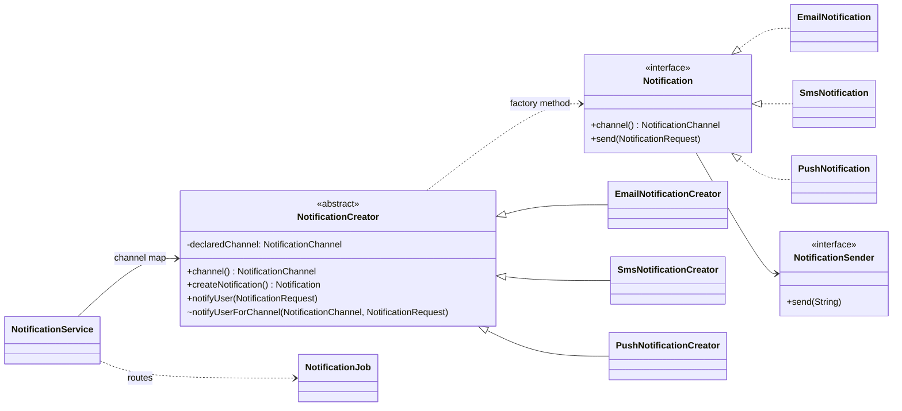
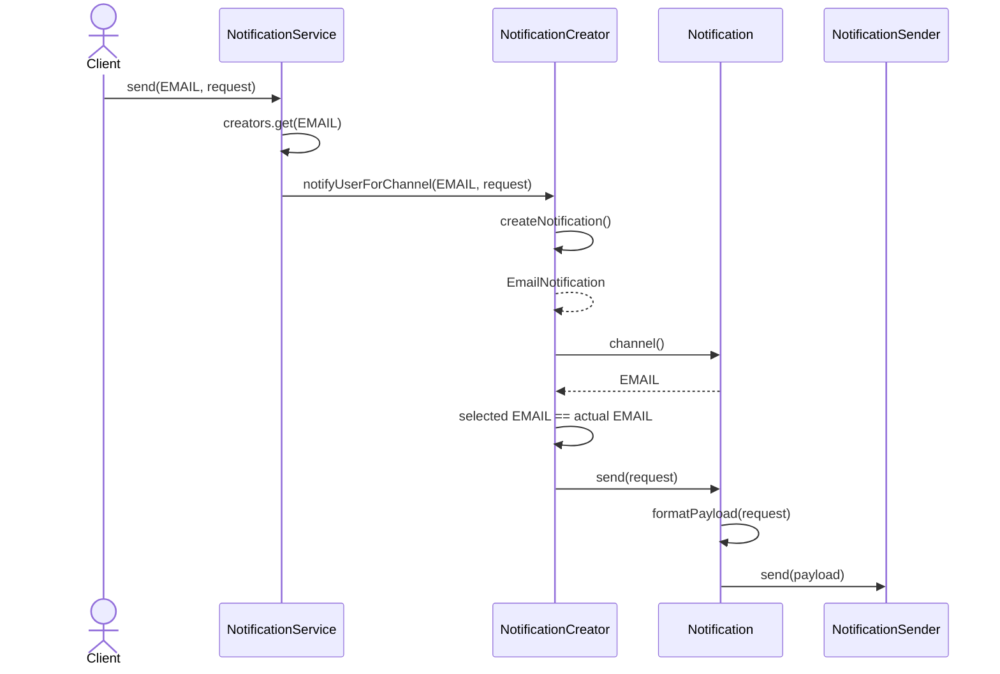

# Factory Method

Factory Method, nesne oluşturma kararını ortak iş akışından ayıran yaratıcı tasarım kalıbıdır. Bu bölümdeki örnek, e-posta, SMS ve push bildirimlerini aynı gönderim akışında buluşturur.

## 30 saniyelik kart

| Soru | Cevap |
|---|---|
| **Niyet** | Üst sınıf ortak akışı korurken üretilecek somut ürünü alt sınıfa seçtirmek |
| **Değişen eksen** | Hangi `Notification` implementasyonunun oluşturulacağı |
| **Sabit kalan** | `notifyUser(request)` ile bildirimin oluşturulup gönderilmesi |
| **Bedel** | Her yeni ürün varyantı için product ve creator sınıfları eklenir |
| **Bu repodaki factory method** | `NotificationCreator#createNotification()` |

> Kısa tanım: **Akış aynı kalır, sahneye çıkacak ürün creator tarafından seçilir.**

## Örnek haritası: temel → güçlendirilmiş → production

| Katman | Gerçek kod karşılığı | Ne öğretiyor? |
|---|---|---|
| **Temel örnek** | `NotificationCreator`, üç concrete creator ve üç `Notification` | Ortak `notifyUser` akışı değişmeden concrete product seçimi alt sınıfa bırakılır |
| **Güçlendirilmiş örnek** | `NotificationService`, `NotificationJob` ve `sendAll(List<NotificationJob>)` | Built-in creator metadata'sı wiring aşamasında, gerçekten üretilen product ise her gönderimde seçilen kanala karşı doğrulanır |
| **Production sınırı** | `NotificationSender` portunun arkasındaki henüz uygulanmamış altyapı | Retry, timeout, idempotency, outbox, rate limit ve hassas veri maskeleme factory'nin değil teslimat katmanının kararıdır |

`FactoryMethodDemo` bu haritayı iki başlıkla çalıştırır: önce tek EMAIL gönderimi, sonra SMS ve PUSH işlerinden oluşan küçük bir batch.

## Akılda kalıcı analoji: aynı servis, farklı usta

Bir restoranda garsonun servis akışı değişmez:

1. Siparişi alır.
2. Doğru ustaya iletir.
3. Hazırlanan ürünü müşteriye götürür.

Pizza ustası pizza, pastacı pasta üretir. Garson ürünün hazırlanma ayrıntısını bilmez.
Bu örnekte `NotificationCreator` usta rolündedir; `createNotification()` hangi bildirimin üretileceğini belirler.

Bu bir **kavramsal benzetmedir**; restoran yazılımlarının içeride mutlaka GoF Factory Method kullandığını iddia etmez.

## Pattern olmasaydı problem nasıl görünürdü?

Üretim ve gönderim kararı tek serviste toplanabilirdi:

```java
void send(NotificationChannel channel, NotificationRequest request) {
    Notification notification;

    if (channel == NotificationChannel.EMAIL) {
        notification = new EmailNotification(sender);
    } else if (channel == NotificationChannel.SMS) {
        notification = new SmsNotification(sender);
    } else {
        notification = new PushNotification(sender);
    }

    notification.send(request);
}
```

İlk bakışta kısa olan bu kod, kanal sayısı arttıkça şu sorunları büyütür:

- Servis bütün concrete product constructor'larını bilir.
- Üretim politikası ile kullanım akışı aynı yerde değişir.
- Her yeni ürün için koşullu blok açılır.
- Üretim öncesi telemetry, feature flag veya farklı bağımlılık kuralları tek metoda yığılır.
- Bir ürünün oluşturulmasını özelleştirmek için servis değiştirilir.

Sorun `new` anahtar sözcüğü değil, **değişme nedenleri farklı olan üretim kararı ile iş akışının birbirine bağlanmasıdır**.

## Çözüm ve sınırı

`NotificationCreator`, ortak akış ile tek üretim noktası ve opsiyonel kanal metadata'sı tanımlar:

```java
protected NotificationCreator(NotificationSender sender) {
    this.sender = requireNonNull(sender); // eski custom creator'lar
    this.declaredChannel = null;
}

protected NotificationCreator(NotificationSender sender, NotificationChannel channel) {
    this.sender = requireNonNull(sender);
    this.declaredChannel = requireNonNull(channel); // built-in creator metadata'sı
}

public NotificationChannel channel() {
    if (declaredChannel != null) {
        return declaredChannel;             // product üretmez
    }
    return createNotification().channel();  // yalnız explicit legacy fallback çağrısı
}

public abstract Notification createNotification();

public void notifyUser(NotificationRequest request) {
    createValidateAndSend(null, request);
}
```

`notifyUser()` ortak algoritma, `createNotification()` ise alt sınıfların doldurduğu değişim noktasıdır.
Built-in creator'lar ikinci constructor'a sabit enum metadata'sı verir; `channel()` bu nedenle product oluşturmadan cevap verir.
Eski/custom creator'lar mevcut `protected NotificationCreator(NotificationSender)` constructor'ıyla kaynak uyumlu kalır.
Bu creator'larda explicit `channel()` çağrısı product'tan fallback kanal çıkarabilir; fakat `notifyUser()` ve `NotificationService` bu fallback'i çağırmaz.

Gönderim sırasında tek bir product oluşturulur; kanal aynı instance'dan okunur ve aynı instance gönderilir:

```java
Notification notification = requireNonNull(createNotification()); // tam bir kez
NotificationChannel actual = requireNonNull(notification.channel());

if (selectedChannel != null && actual != selectedChannel) {
    throw new IllegalStateException("Seçilen kanal ile product uyuşmuyor");
}

notification.send(request);
```

```java
public Notification createNotification() {
    return new EmailNotification(sender());
}
```

Factory Method şunları çözmez:

- Kanalın runtime'da nasıl seçileceğini tek başına belirlemez.
- Uyumlu birden fazla ürün ailesini birlikte üretmez.
- Oluşturulan nesnenin yaşam döngüsünü otomatik yönetmez.
- Retry, timeout veya kalıcı teslimat garantisini kendiliğinden sağlamaz.

Bu repoda runtime seçim için ayrıca `NotificationService` içindeki kanal→creator map'i kullanılır; dolayısıyla örnek küçük bir registry/router da içerir.
Constructor, açık built-in metadata ile map anahtarı uyuşmazlığını product üretmeden yakalar; legacy creator'ın gerçek product kanalı dispatch sırasında seçilen anahtarla doğrulanır.

## Repo sınıfları ve pattern rolleri

| Sınıf / API | Rol | Sorumluluk |
|---|---|---|
| `Notification` | Product | Kanalını ve `send(request)` kontratını tanımlar |
| `EmailNotification` | Concrete Product | E-posta payload'ı oluşturur |
| `SmsNotification` | Concrete Product | SMS payload'ı oluşturur |
| `PushNotification` | Concrete Product | Push payload'ı oluşturur |
| `NotificationCreator` | Creator | Ortak tek-üretim `notifyUser` akışını, factory method'u ve opsiyonel kanal metadata'sını tanımlar |
| `EmailNotificationCreator` | Concrete Creator | `EmailNotification` üretir |
| `SmsNotificationCreator` | Concrete Creator | `SmsNotification` üretir |
| `PushNotificationCreator` | Concrete Creator | `PushNotification` üretir |
| `NotificationSender` | Çıkış portu | Formatlanmış payload'ı gönderir |
| `ConsoleNotificationSender` | Concrete port | Payload'ı konsola yazar |
| `AbstractMessageNotification` | Ortak product tabanı | `formatPayload` sonucunu sender'a verir |
| `NotificationRequest` | Değer nesnesi | Recipient, title ve message verisini taşır |
| `NotificationService` | Router / client orkestrasyonu | Kanalı kayıtlı creator ile eşler |
| `NotificationJob` | Batch değer nesnesi | Bir kanal ile o kanala özel isteği tek, doğrulanmış işte gruplar |
| `NotificationService#sendAll` | Güçlendirilmiş client akışı | İşleri giriş sırasıyla mevcut `send` yoluna aktarır |
| `FactoryMethodDemo` | Demo client | Tek gönderim ile sıralı iş listesini yan yana çalıştırır |

## Yapı diyagramı


```mermaid
classDiagram
    direction LR

    class Notification {
        <<interface>>
        +channel() NotificationChannel
        +send(NotificationRequest)
    }

    class NotificationCreator {
        <<abstract>>
        -declaredChannel: NotificationChannel
        +channel() NotificationChannel
        +createNotification() Notification
        +notifyUser(NotificationRequest)
        ~notifyUserForChannel(NotificationChannel, NotificationRequest)
    }

    class NotificationSender {
        <<interface>>
        +send(String)
    }

    NotificationCreator <|-- EmailNotificationCreator
    NotificationCreator <|-- SmsNotificationCreator
    NotificationCreator <|-- PushNotificationCreator
    Notification <|.. EmailNotification
    Notification <|.. SmsNotification
    Notification <|.. PushNotification
    NotificationCreator ..> Notification : factory method
    Notification --> NotificationSender
    NotificationService --> NotificationCreator : channel map
    NotificationService ..> NotificationJob : routes
```

## Çalışma zamanı akışı


```mermaid
sequenceDiagram
    actor Client
    participant Service as NotificationService
    participant Creator as NotificationCreator
    participant Product as Notification
    participant Sender as NotificationSender

    Client->>Service: send(EMAIL, request)
    Service->>Service: creators.get(EMAIL)
    Service->>Creator: notifyUserForChannel(EMAIL, request)
    Creator->>Creator: createNotification()
    Creator-->>Creator: EmailNotification
    Creator->>Product: channel()
    Product-->>Creator: EMAIL
    Creator->>Creator: selected EMAIL == actual EMAIL
    Creator->>Product: send(request)
    Product->>Product: formatPayload(request)
    Product->>Sender: send(payload)
```

## Kodu adım adım okuma

### 1. İstek daha oluşturulurken doğrulanır

`NotificationRequest` bir record'dur. Compact constructor null veya blank recipient, title ve message değerlerini reddeder.
Geçerli değerlerin çevre boşluklarını bir kez `trim()` ile temizler; product'lar normalize edilmiş değer görür.

### 2. Gönderme mekanizması product'tan ayrılır

`NotificationSender` sayesinde bildirim formatı konsola bağımlı değildir; testler payload'ı `InMemoryNotificationSender` ile gözlemler.

### 3. Product yalnız kendi kanal formatını bilir

`EmailNotification`, `SmsNotification` ve `PushNotification` aynı `send` akışını miras alır; değişen bölüm protected `formatPayload(request)` metodudur.

### 4. Creator bağımlılığı product'a aktarır

Her concrete creator, constructor'da aldığı sender'ı `sender()` üzerinden yeni product'a verir ve aynı constructor'da sabit kanal metadata'sını tanımlar.
Metadata okumak product üretmez.
Creator, null sender/product/request ile kendi beyanından farklı product'ı erken reddeder; `notifyUser()` product'ı tam bir kez oluşturur.

### 5. Service doğru creator'ı bulur

`NotificationService`, map'i `Map.copyOf` ile snapshot'a çevirir.
Built-in creator'ın açık metadata'sı varsa map anahtarıyla uyuşması constructor'da denetlenir; legacy creator için wiring sırasında product üretilmez.
Kayıt bulunamazsa anlamlı bir `IllegalArgumentException` üretir.
Her `send(channel, request)` çağrısı seçilen kanalı creator'a geçirir; creator tek product üretir, gerçek kanalı o instance'dan okur ve uyuşursa yine aynı instance'ı gönderir.

### 6. Composition root somut tipleri bilir

`FactoryMethodDemo` üç creator'ı oluşturup map'e koyar. Concrete sınıflardan habersiz olması gereken yer bütün uygulama değil, ortak iş akışıdır.

### 7. Gerçekçi batch aynı güvenli yolu tekrar kullanır

`NotificationJob`, kanal ve isteği null olmayacak biçimde gruplar.
`sendAll` yeni bir üretim algoritması yazmaz; liste snapshot'ını alır ve her işi mevcut `send(channel, request)` metoduna geçirir.
Sıra korunur, fakat bir iş hata verirse kalan işlerin devamı, rollback veya retry davranışı özellikle tanımlanmamıştır.

## Testlerin anlattığı kontratlar

`FactoryMethodDemoTest` testleri şu hikâyeyi korur:

| `@Nested` grup | Korunan davranış |
|---|---|
| `CreatorContract` | Her creator’ın doğru product/kanalı üretmesi; `notifyUser()`ın factory method ürününü göndermesi; metadata okumanın product oluşturmaması; tek çağrıda tek üretim; yanlış kanallı product’ın reddi ve yalnız eski factory method’u uygulayan custom creator’ın uyumluluğu |
| `PayloadFormatting` | Aynı normalize edilmiş isteğin EMAIL, SMS ve PUSH tarafından kendi kanal formatına çevrilmesi |
| `RequestValidation` | Null/blank istek alanlarının erken reddi ve geçerli recipient/title/message değerlerinin trim edilmesi |
| `ServiceRouting` | Seçilen creator’a tek yönlendirme; registry map’inin immutable snapshot olması; metadata-key wiring kontrolü; stateful legacy creator’da üretilen aynı instance’ın doğrulanıp gönderilmesi ve kayıtsız kanalın açık hata vermesi |
| `BatchDispatch` | Farklı kanallardaki işlerin mevcut güvenli `send` yoluyla ve verilen sırada gönderilmesi |

Testler aynı pakette olduğu için protected metotlara erişebilir; yine de public davranışı doğrulamak tercih edilir.

## Ne zaman kullanılır?

- Ürün varyantları düzenli olarak artıyorsa.
- Ortak kullanım algoritması sabit, oluşturma biçimi değişkense.
- Alt sınıfların üretim anına farklı bağımlılıklar veya politikalar eklemesi gerekiyorsa.
- Concrete product bilgisini ortak servisten çıkarmak istiyorsan.
- Framework bir hook metodunu override ederek nesne üretmeni bekliyorsa.

## Ne zaman kullanma?

- Tek ürün varsa ve ikinci varyant için gerçek bir değişim sinyali yoksa.
- Basit bir constructor injection yeterliyse.
- İhtiyaç yalnız bir değere göre kısa bir nesne seçmekse; küçük bir map veya Simple Factory daha açık olabilir.
- Birbiriyle ilişkili birçok ürün aynı varyantta birlikte oluşturulacaksa; Abstract Factory daha uygundur.

## Artılar ve bedeller

| Artı | Bedel |
|---|---|
| Üretim kararı ortak akıştan ayrılır | Product başına creator sınıfı oluşabilir |
| Yeni varyantlar lokal sınıflarla eklenir | Composition root yine concrete tipleri bilmelidir |
| Test double creator/sender yazmak kolaydır | Akışı takip etmek yeni başlayan için daha uzundur |
| Creator üretim politikası için extension point olur | Yanlış kullanılırsa yalnız `new` saklayan anlamsız katman olur |

## Production hardening

Güçlendirilmiş örnek aşağıdaki ilk üç korumayı artık uygular:

- Creator ve sender constructor'larında `Objects.requireNonNull`.
- `NotificationService` için null channel/request davranışı.
- Built-in creator metadata'sı ile map anahtarının wiring aşamasında tutarlılık kontrolü.
- Seçilen kanal ile tek seferde üretilen gerçek product kanalının dispatch anında kontrolü.

Gerçek teslimat sisteminde hâlâ açıkça tasarlanması gerekenler:

- Retry, timeout ve idempotency politikasının sender katmanında ele alınması.
- Batch'in fail-fast mı best-effort mü olduğu; partial success sonucunun nasıl raporlanacağı.
- Transactional outbox veya kalıcı kuyruk ile process çökmesine karşı teslimat.
- Hassas recipient veya message verisinin loglarda maskelenmesi.
- Kanal bazlı metric ve tracing.
- Enum değişmeden plugin eklemek gerekiyorsa string/type-safe registry tasarımı.

“Yeni kanal eklemek için mevcut hiçbir kod değişmez” doğru değildir; product ve creator yanında enum ile kurulum map'i de güncellenir.
Asıl kazanım, `NotificationService#send` algoritmasının dallarla büyümemesidir.

### Compatibility notu

- `protected NotificationCreator(NotificationSender)` korunur; yalnız eski factory method'u uygulayan subclass kaynak uyumlu kalır.
- Built-in creator'lar yan etkisiz metadata için yeni iki parametreli constructor'ı kullanır.
- Legacy `channel()` fallback'i explicit çağrıda product oluşturabilir; gönderim yolu bunu kullanmadığından bir `notifyUser` çağrısı bir product üretir.
- Service artık legacy creator'ı wiring sırasında çalıştırmaz; gerçek product kanalını request anında seçilen map anahtarıyla doğrular.

## Benzer pattern'lerle karşılaştırma

| Pattern | Temel soru | Bu örnekten farkı |
|---|---|---|
| Simple Factory | Parametreye göre hangi nesneyi döndüreyim? | Genellikle tek fonksiyon/switch kullanır, kalıtım hook'u şart değildir |
| Abstract Factory | Hangi uyumlu ürün ailesini üreteyim? | Bir factory birden fazla ilişkili product türü üretir |
| Builder | Karmaşık tek nesneyi hangi adımlarla kurayım? | Ürün varyantından çok kurulum adımlarına odaklanır |
| Strategy | Çalışma zamanında hangi davranışı kullanayım? | Var olan davranışı seçer; Factory Method nesne üretir |
| Template Method | Algoritmanın hangi adımı değişsin? | Buradaki `notifyUser` zaten factory method kullanan template benzeri akıştır |

## Yaygın hatalar

1. Her `createX()` metoduna Factory Method demek; kalıbın ayırt edici yanı override edilebilir üretim kararıdır.
2. Creator oluşturup ortak operasyonu kullanmamak, her yerde doğrudan `createNotification()` çağırmak.
3. Product'ın kanal bilgisi ile registry anahtarını farklı bırakmak.
4. Null bağımlılıkları üretimden çok sonra NPE olarak görmek.
5. Composition root'taki concrete bağımlılığı “kalıp başarısız” sanmak.
6. Simple Factory için yeterli probleme gereksiz subclass hiyerarşisi kurmak.
7. Gerçek bir kütüphane yalnız `Factory` adlı sınıf içeriyor diye GoF Factory Method kullandığını varsaymak.

## Üç kademeli alıştırma

### Seviye 1 — yeni varyant

`IN_APP` kanalı, `InAppNotification` ve creator'ını ekle; product tipi, kanal ve payload testlerini yaz.

### Seviye 2 — batch sonucu

`sendAll` için `SENT/FAILED` sonucu ve hata nedeni taşıyan bir rapor tasarla.
Fail-fast ile best-effort seçeneklerini ayrı testlerle göster.

### Seviye 3 — runtime eklenti

Enum'a bağımlı olmayan bir `NotificationChannelKey` ve registry tasarla; runtime eklenti sınırını tartış.

## Tek cümlelik hafıza çengeli

> **Factory Method: ortak akış siparişi verir, hangi somut ürünün doğacağını alt sınıftaki üretim hook'u seçer.**
