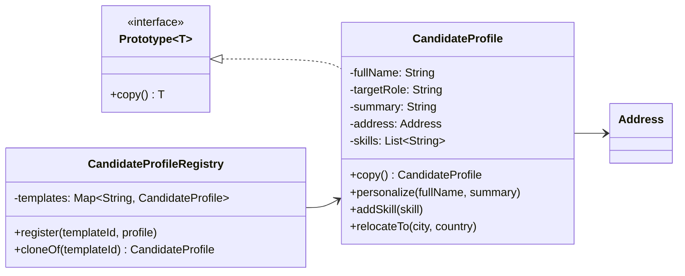
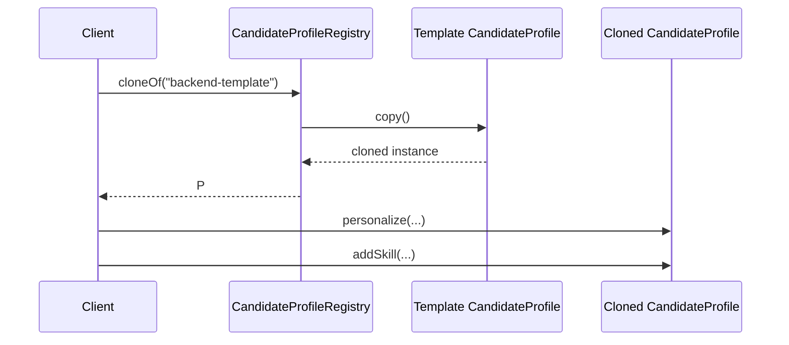

# Prototype (Creational Pattern)

> Diğer adı: **Clone-based Object Creation**

## Niyet (Intent)
Prototype, yeni nesneyi sıfırdan kurmak yerine mevcut örneğin kopyasından üretir.

Kısa versiyon: **"Kurulumu pahalıysa, şablonu kopyala ve özelleştir."**

## Problem
Bazı nesneler:
- Karmaşık kurulum adımlarına sahiptir.
- Çok sayıda default değer ve nested yapı içerir.
- Her seferinde sıfırdan üretildiğinde performans/maliyet baskısı oluşturur.

## Çözüm
`Prototype<T>` arayüzü ile `copy()` kontratı tanımlanır.
Somut sınıf (`CandidateProfile`) copy-constructor ile güvenli klon üretir.
`CandidateProfileRegistry` sık kullanılan şablonları merkezi saklar.

## Yapı



## Runtime akışı



## Bu projedeki model
- `Prototype<T>` → Prototype arayüzü
- `CandidateProfile` → Concrete Prototype
- `CandidateProfileRegistry` → Prototype Registry
- `Address` → Deep copy gerektiren nested obje

## Teknik notlar
- `CandidateProfile` copy-constructor içinde `Address` ve `skills` için deep copy uygulanır.
- Deep copy sayesinde klonda yapılan değişiklik template’e sızmaz.
- Registry yaklaşımı runtime template yönetimini hızlandırır.

## Ne zaman kullanılır?
- Nesne kurulum maliyeti yüksekse.
- Benzer nesnelerden çok sayıda varyasyon üretilecekse.
- Tenant/kampanya/rol bazlı şablon yönetimi gerekiyorsa.

## Ne zaman kullanma?
- Nesne çok basitse ve clone maliyeti/sorumluluğu gereksizse.
- Kopyalama semantiği açıkça tanımlanamıyorsa.

## Artılar / Eksiler

**Artılar**
- Hızlı çoğaltma
- Şablon tabanlı üretim
- Kurulum kodu tekrarını azaltma

**Eksiler**
- Deep/shallow copy karmaşıklığı
- Dairesel referanslarda kopya yönetimi zorlaşabilir

## Kısa özet
Prototype, özellikle hazır şablondan varyasyon üretiminin yoğun olduğu sistemlerde hız ve esneklik sağlar; ancak kopyalama kuralları net tasarlanmazsa ciddi yan etki üretir.

## Gerçek Hayattan ve Yaygın Kullanılan Prototype Pattern Örnekleri

### 1. Grafik Editörlerinde Şekil Kopyalama (Photoshop, Figma, PowerPoint)
Bir şekil, metin kutusu veya obje kopyalanıp farklı özelliklerle çoğaltılır:

```java
Shape template = new Rectangle(100, 50, Color.RED);
Shape copy = template.copy();
copy.setColor(Color.BLUE);
```

### 2. Oyunlarda Karakter/Item Şablonları
Farklı karakter veya item şablonları kopyalanıp kişiselleştirilir:

```java
Character warriorTemplate = registry.get("warrior");
Character player1 = warriorTemplate.copy();
player1.setName("Player1");
```

### 3. Ofis Belge Şablonları (Word, Google Docs)
Hazır bir belge şablonu kopyalanıp başlık, içerik gibi alanlar özelleştirilir:

```java
Document invoiceTemplate = registry.get("invoice");
Document myInvoice = invoiceTemplate.copy();
myInvoice.setCustomer("Ali Veli");
```

### 4. Web Uygulamalarında Form/Component Kopyalama
Bir form veya UI component şablonu kopyalanıp farklı sayfalarda kullanılır:

```java
Form loginFormTemplate = registry.get("loginForm");
Form customLoginForm = loginFormTemplate.copy();
customLoginForm.setTheme("dark");
```
