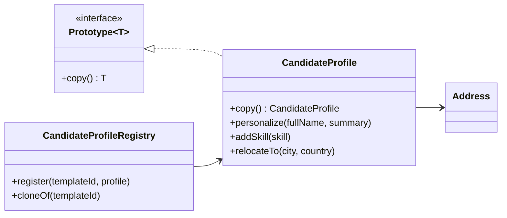

# Prototype (Creational Pattern)

> Diğer adı: **Clone-Based Object Creation**

## Niyet (Intent)
Prototype, mevcut bir nesnenin kopyasını alarak yeni nesneler üretmeyi amaçlar. Böylece maliyetli kurulum adımlarını tekrar etmeden, hazır şablondan hızlıca yeni örnekler oluşturulur.

Kısa versiyon: **"Sıfırdan kurma, iyi bir örnekten çoğalt."**

## Problem
Bazı nesnelerin oluşturulması:
- Çok fazla konfigürasyon adımı gerektirir.
- Dış kaynaklardan yükleme yaptığı için maliyetlidir.
- Birçok benzer varyant üretileceğinde gereksiz kod tekrarına neden olur.

Doğrudan `new` ile her seferinde sıfırdan üretim yapmak:
- Performans maliyetini artırabilir,
- Kurulum adımlarında insan hatası riskini yükseltebilir,
- Aynı "başlangıç ayarlarını" sürekli tekrar etmene neden olur.

## Çözüm
Ortak bir `Prototype<T>` arayüzü ile `copy()` metodu tanımlanır.
- Client kodu, nesneyi nasıl inşa edeceğini bilmek yerine bir **template** klonlar.
- Her Concrete Prototype kendi kopyalama mantığını (deep/shallow) kontrol eder.
- Yeni varyasyonlar, klon sonrası kişiselleştirme adımlarıyla üretilir.
- İstersen prototype'ları bir `Registry` içinde saklayıp anahtar ile çağırırsın.

## Yapı

## Bu projedeki model

- `Prototype<T>` → Prototype arayüzü
- `CandidateProfile` → Concrete Prototype
- `Address` → Deep copy yapılması gereken iç nesne
- `CandidateProfileRegistry` → Şablonların tutulduğu registry
- `PrototypeDemo` → Client akışı

## Gerçek hayattan analoji
Bir emlak ofisinde "standart ilan şablonları" düşün:
- 1+1 kiralık daire, 3+1 satılık daire gibi hazır şablonlar var.
- Yeni ilan açarken sıfırdan yazmak yerine uygun şablon klonlanıyor.
- Sadece dairenin adresi, fiyatı ve görselleri güncelleniyor.

Burada şablon ilan = **Prototype**, yeni ilan = **Clone + personalize**.

## Developer kullanım senaryoları
- **CV / profil üretimi:** farklı pozisyonlar için hazır aday şablonundan türetme.
- **Oyun geliştirme:** aynı düşman tipinden (HP, hız, animasyon seti) çok sayıda instance üretme.
- **UI bileşenleri:** varsayılan tema + davranışlara sahip component konfigurasyonlarını çoğaltma.
- **Raporlama:** temel rapor şablonunu klonlayıp tarih aralığı/filtreleri değiştirerek yeni rapor oluşturma.
- **E2E test verisi:** temel fixture nesnesini klonlayıp sadece testte gereken alanları değiştirme.

## OOP ve SOLID notları

- **SRP:** Klonlama sorumluluğu `CandidateProfile` içinde, şablon yönetimi `CandidateProfileRegistry` içinde.
- **OCP:** Yeni bir profil tipi ekleneceğinde mevcut client kodunu bozmak gerekmez; yeni prototype sınıfı eklemek yeterlidir.
- **Encapsulation:** İç durum (`address`, `skills`) prototype tarafından kontrollü biçimde çoğaltılır.

## Deep Copy neden önemli?
Bu örnekte `Address` ve `skills` koleksiyonu **ayrı kopyalar** olarak üretilir.
Böylece klon üzerinde yapılan değişiklikler template nesneyi etkilemez.

Örnek risk:
- Shallow copy yaparsan, klonun `skills` listesine eklenen bir teknoloji template listesinde de görünür.
- Bu da özellikle çok kullanıcılı sistemlerde beklenmedik veri sızıntılarına veya "yan etki" bug'larına yol açar.

## Prototype + Registry birlikte neden güçlü?
- Sık kullanılan şablonlar bellekte hazır tutulur.
- Runtime'da `templateId` ile hızlıca kopya üretilir.
- Kampanya, ülke, tenant, rol bazında farklı default ayarları kolay yönetilir.

Bu yaklaşım özellikle multi-tenant SaaS uygulamalarında işe yarar: her tenant için farklı başlangıç konfigürasyonu template olarak saklanır.

## Uygulanabilirlik
- Çok sayıda benzer nesne üretilecekse.
- Nesne kurulum maliyeti yüksekse.
- Runtime'da dinamik şablonlardan varyasyonlar üretilecekse.
- "Ön tanımlı başlangıç durumu" tekrar tekrar gerekiyorsa.

## Artılar / Eksiler

**Artılar**
- Hızlı nesne üretimi
- Karmaşık kurulum kodunu azaltma
- Runtime'da esnek varyasyon üretimi
- Tekrarlanan konfigürasyon adımlarını merkezi hale getirme

**Eksiler**
- Deep vs shallow copy karmaşıklığı
- Dairesel referanslarda kopyalama maliyeti/karmaşıklığı artabilir
- Kopyalama kuralları net tanımlanmazsa debug zorlaşabilir

## Kısa özet
Prototype, "kurulumu pahalı ama varyasyonu bol" nesnelerde geliştirici hızını ciddi artırır. Doğru deep-copy stratejisiyle birlikte kullanıldığında hem performans hem bakım tarafında güçlü bir desen haline gelir.
