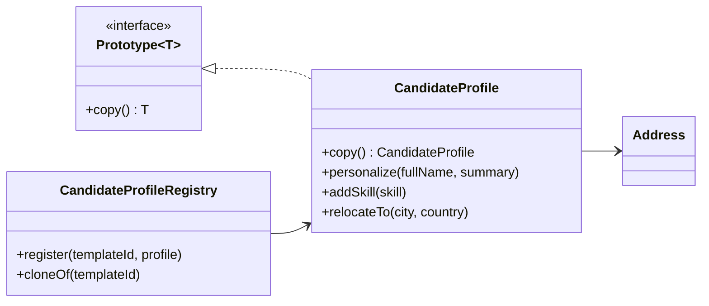

# Prototype (Creational Pattern)

> Diğer adı: **Clone-Based Object Creation**

## Niyet (Intent)
Prototype, mevcut bir nesnenin kopyasını alarak yeni nesneler üretmeyi amaçlar. Böylece maliyetli kurulum adımlarını tekrar etmeden, hazır şablondan hızlıca yeni örnekler oluşturulur.

## Problem
Bazı nesnelerin oluşturulması:
- Çok fazla konfigürasyon adımı gerektirir.
- Dış kaynaklardan yükleme yaptığı için maliyetlidir.
- Birçok benzer varyant üretileceğinde gereksiz kod tekrarına neden olur.

Doğrudan `new` ile her seferinde sıfırdan üretim yapmak, bakım maliyetini ve hataya açıklığı artırır.

## Çözüm
Ortak bir `Prototype<T>` arayüzü ile `copy()` metodu tanımlanır.
- Client kodu, nesneyi nasıl inşa edeceğini bilmek yerine bir **template** klonlar.
- Her Concrete Prototype kendi kopyalama mantığını (deep/shallow) kontrol eder.
- Yeni varyasyonlar, klon sonrası kişiselleştirme adımlarıyla üretilir.

## Yapı

## Bu projedeki model

- `Prototype<T>` → Prototype arayüzü
- `CandidateProfile` → Concrete Prototype
- `Address` → Deep copy yapılması gereken iç nesne
- `CandidateProfileRegistry` → Şablonların tutulduğu registry
- `PrototypeDemo` → Client akışı

## OOP ve SOLID notları

- **SRP:** Klonlama sorumluluğu `CandidateProfile` içinde, şablon yönetimi `CandidateProfileRegistry` içinde.
- **OCP:** Yeni bir profil tipi ekleneceğinde mevcut client kodunu bozmak gerekmez; yeni prototype sınıfı eklemek yeterlidir.
- **Encapsulation:** İç durum (`address`, `skills`) prototype tarafından kontrollü biçimde çoğaltılır.

## Deep Copy neden önemli?
Bu örnekte `Address` ve `skills` koleksiyonu **ayrı kopyalar** olarak üretilir.
Böylece klon üzerinde yapılan değişiklikler template nesneyi etkilemez.

## Uygulanabilirlik
- Çok sayıda benzer nesne üretilecekse.
- Nesne kurulum maliyeti yüksekse.
- Runtime'da dinamik şablonlardan varyasyonlar üretilecekse.

## Artılar / Eksiler

**Artılar**
- Hızlı nesne üretimi
- Karmaşık kurulum kodunu azaltma
- Runtime'da esnek varyasyon üretimi

**Eksiler**
- Deep vs shallow copy karmaşıklığı
- Dairesel referanslarda kopyalama maliyeti/karmaşıklığı artabilir
