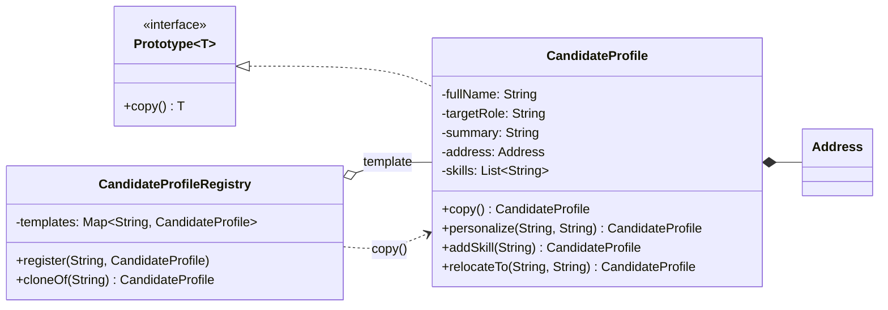
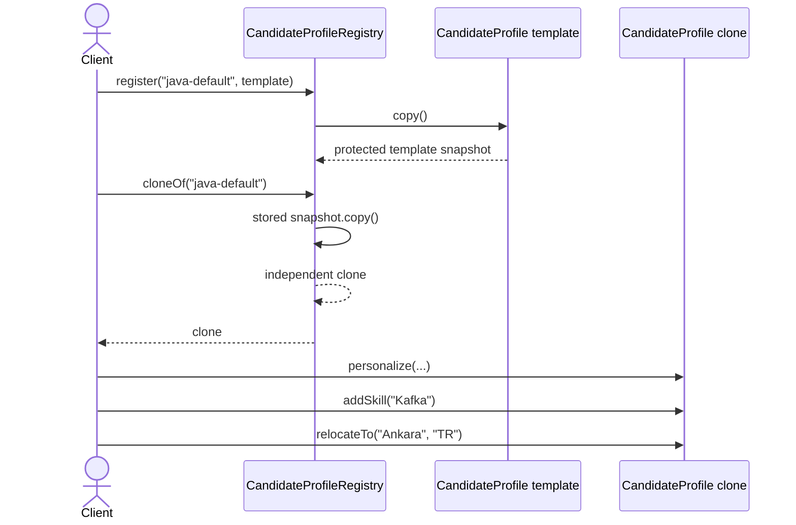
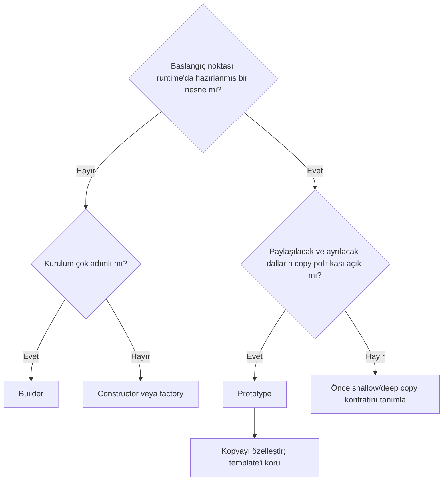

# Prototype

Prototype, yeni nesneyi kurulum adımlarını tekrarlamak yerine hazır örneği kopyalayarak üretir; burada aday profilleri kişiselleştirilir.

## 30 saniyelik kart

| Soru | Cevap |
|---|---|
| **Niyet** | Mevcut bir nesneyi yeni nesnenin üretim kaynağı yapmak |
| **Değişen eksen** | Kopyanın kişisel adı, özeti, adresi ve becerileri |
| **Sabit kalan** | Şablondaki rol ve başlangıç verileri |
| **Bedel** | Shallow/deep copy semantiğini doğru tasarlama sorumluluğu |
| **Bu repodaki kopyalama noktası** | `CandidateProfile#copy()` |

> Kısa tanım: **Şablonu kopyala; aslına dokunmadan kopyayı özelleştir.**

## Örnek haritası: temel → güçlendirilmiş → production

| Katman | Gerçek kod karşılığı | Ne öğretiyor? |
|---|---|---|
| **Temel örnek** | `CandidateProfile#copy()` ve private copy constructor | Mutable `Address` ile skill container'ı ayrılan deep-enough kopya, aslı bozmadan kişiselleştirilir |
| **Güçlendirilmiş örnek** | `CandidateProfileRegistry#register`, defensive `address()` / `skills()` | Registry canlı referans değil template snapshot'ı saklar; accessor'lar iç mutable state'i dışarı açmaz |
| **Production sınırı** | `HashMap` tabanlı küçük registry'nin ötesi | Duplicate-ID politikası, versioning, concurrent update, çok büyük/cyclic graph kopyası ve kopyalama maliyeti ayrıca tasarlanmalıdır |

`com.can.demo.creational.prototype.PrototypeDemo`, doğrudan deep-copy fikrini ve registry'den alınan bağımsız çalışma kopyasını ayrı başlıklarla gösterir.

## Paket sınırı: pattern kodu ve çalıştırılabilir demo

Prototype kontratı, concrete profile, mutable nested value ve registry `com.can.creational.prototype` domain paketindedir.
`com.can.demo.creational.prototype.PrototypeDemo` ise template'i hazırlayıp registry'ye kaydeden çalıştırılabilir composition root'tur; bağımlılık yönü **demo → domain** biçimindedir.
Kopyalama politikası demo sınıfında değil `CandidateProfile#copy()` ve copy constructor'da yaşar; böylece politika bütün client'lar için tek ve doğrudan test edilebilir kalır.
Diyagramlarda uzun FQCN yerine kısa `PrototypeDemo` adı kullanılır.

`src/test` altındaki `com.can.creational.prototype.PrototypeDemoTest` bir çalıştırma demosu değil, identity ve copy-semantics kontrat testidir.

## Akılda kalıcı analoji: çalışma kâğıdının fotokopisi

Öğretmen başlıklı bir çalışma kâğıdı hazırlar; her öğrenci ayrı fotokopiye kendi cevaplarını yazar.
Bir öğrencinin notu diğer öğrencinin veya öğretmenin aslını değiştirmemelidir.

`CandidateProfile` şablon, `copy()` fotokopi makinesi, fluent metotlar öğrencinin kişiselleştirmesidir.

Bu bir **kavramsal benzetmedir**; araçlardaki “duplicate” davranışı benzer olsa da iç implementasyonun GoF Prototype olduğu varsayılmaz.

## Pattern olmasaydı problem nasıl görünürdü?

Her aday için bütün ortak alanlar tekrar kurulabilirdi:

```java
CandidateProfile ahmet = new CandidateProfile(
        "Ahmet Yılmaz",
        "Java Developer",
        "Backend-focused developer.",
        new Address("Ankara", "TR"),
        List.of("Java", "Spring Boot", "SQL", "Kafka")
);
```

Onlarca ortak ayar olduğunda:

- Default değerler çağrı yerlerine kopyalanır.
- Bir default değişikliği bütün kurulum noktalarını etkiler.
- Karmaşık nested graph tekrar oluşturulur.
- Client concrete kurulum ayrıntılarını bilir.
- Eksik veya farklı default kullanan varyantlar oluşur.

Prototype runtime'da hazırlanmış nesne başlangıç noktası olacaksa değerlidir; performans otomatik garanti değildir.

## Çözüm ve sınırı

Repo küçük ve açık bir kontrat kullanır:

```java
public interface Prototype<T> {
    T copy();
}
```

`CandidateProfile#copy()` private copy constructor'a gider:

```java
private CandidateProfile(CandidateProfile source) {
    this.fullName = source.fullName;
    this.targetRole = source.targetRole;
    this.summary = source.summary;
    this.address = new Address(source.address);
    this.skills = new ArrayList<>(source.skills);
}
```

Kod `Cloneable` kullanmaz; kopyalama kararı domain sınıfında açıkça görünür.

Prototype şunları kendiliğinden çözmez:

- Nesne grafiğinin hangi derinlikte kopyalanacağını belirlemez.
- Dairesel referansları otomatik yönetmez.
- Registry'nin thread-safe olmasını sağlamaz.
- Kopyanın immutable veya valid olmasını garanti etmez.
- Kopyalamanın constructor'dan daha hızlı olduğunu garanti etmez.

## Repo sınıfları ve pattern rolleri

| Sınıf / API | Rol | Sorumluluk |
|---|---|---|
| `Prototype<T>` | Prototype contract | `copy()` operasyonunu tanımlar |
| `CandidateProfile` | Concrete Prototype | Kendi kopyalama semantiğini uygular |
| `CandidateProfile(CandidateProfile)` | Copy constructor | Mutable nested alanları ayırır; private'dır |
| `Address` | Mutable nested object | Şehir ve ülke bilgisini taşır |
| `CandidateProfileRegistry` | Prototype Registry | ID ile template saklar, `cloneOf` ile kopya verir |
| `register` | Snapshot sınırı | Normalize edilen ID altında profile'ın o andaki kopyasını saklar |
| `personalize` | Özelleştirme adımı | Kopyanın adını ve özetini değiştirir |
| `addSkill` | Özelleştirme adımı | Kopyanın beceri listesine ekler |
| `relocateTo` | Özelleştirme adımı | Kopyanın adresini değiştirir |
| `com.can.demo.creational.prototype.PrototypeDemo` | Demo / composition root | Template kaydeder ve iki bağımsız clone üretir |

## Yapı diyagramı


```mermaid
classDiagram
    direction LR
    class Prototype~T~ {
        <<interface>>
        +copy() T
    }
    class CandidateProfile {
        -fullName: String
        -targetRole: String
        -summary: String
        -address: Address
        -skills: List~String~
        +copy() CandidateProfile
        +personalize(String, String) CandidateProfile
        +addSkill(String) CandidateProfile
        +relocateTo(String, String) CandidateProfile
    }
    class CandidateProfileRegistry {
        -templates: Map~String, CandidateProfile~
        +register(String, CandidateProfile)
        +cloneOf(String) CandidateProfile
    }
    Prototype <|.. CandidateProfile
    CandidateProfile *-- Address
    CandidateProfileRegistry o-- CandidateProfile : template
    CandidateProfileRegistry ..> CandidateProfile : copy()
```

## Çalışma zamanı akışı


```mermaid
sequenceDiagram
    actor Client
    participant Registry as CandidateProfileRegistry
    participant Template as CandidateProfile template
    participant Clone as CandidateProfile clone

    Client->>Registry: register("java-default", template)
    Registry->>Template: copy()
    Template-->>Registry: protected template snapshot
    Client->>Registry: cloneOf("java-default")
    Registry->>Registry: stored snapshot.copy()
    Registry-->>Registry: independent clone
    Registry-->>Client: clone
    Client->>Clone: personalize(...)
    Client->>Clone: addSkill("Kafka")
    Client->>Clone: relocateTo("Ankara", "TR")
```

## Yanlış araç seçimini önleyen karar diyagramı


```mermaid
flowchart TD
    A{"Başlangıç noktası runtime'da hazırlanmış bir nesne mi?"}
    A -- Hayır --> B{"Kurulum çok adımlı mı?"}
    B -- Evet --> C["Builder"]
    B -- Hayır --> D["Constructor veya factory"]
    A -- Evet --> E{"Paylaşılacak ve ayrılacak dalların copy politikası açık mı?"}
    E -- Evet --> F["Prototype"]
    E -- Hayır --> G["Önce shallow/deep copy kontratını tanımla"]
    F --> H["Kopyayı özelleştir; template'i koru"]
```

Prototype'ın seçim sinyali yalnız alan sayısı değildir; **başlangıç konfigürasyonunun yaşayan bir instance üzerinde bulunması** ve bu instance'tan bağımsız varyantlar gerekmesidir.
Copy politikası belirsizken kalıbı eklemek, constructor tekrarından daha tehlikeli biçimde sessiz aliasing hataları üretir.

## Kodu adım adım okuma

### 1. Public constructor da input kopyası alır

Address copy constructor, skills `new ArrayList` ile ayrılır; input değişse profil etkilenmez.
Ad, rol, özet, şehir, ülke ve skill değerleri kendi domain sınırlarında trim edilir; null/blank değerler yarım nesne oluşturmadan reddedilir.

### 2. `copy()` polymorphic üretim noktasıdır

Client copy ayrıntısını bilmez; concrete prototype paylaşılacak ve kopyalanacak alanları belirler.

### 3. Mutable nested alanlar ayrılır

Address ve list container yeni instance'lardır; immutable String elemanlarını paylaşmak güvenlidir.

### 4. Clone fluent biçimde değiştirilir

Üç fluent metot aynı mutable clone'u döndürür; Prototype ile Builder aynı şey değildir.
`personalize` ve `Address#moveTo`, iki yeni değeri de yerel değişkenlerde doğruladıktan sonra state'e yazar.
İkinci alan geçersizse ilk alanın değiştiği yarım mutation oluşmaz.

### 5. Registry her istekte `copy()` çağırır

`cloneOf(id)` template'i dışarı vermez; eksik ID için açık `IllegalArgumentException` fırlatır.

### 6. Registry template snapshot'ı saklar

`register`, kendisine verilen profile'ı doğrudan saklamaz; `profile.copy()` sonucunu normalize edilmiş ID altında tutar.
Kayıttan sonra caller kendi profile'ını değiştirirse gelecekteki clone'lar bundan etkilenmez.
`cloneOf` her çağrıda saklanan snapshot'ın bir kopyasını döndürdüğü için registry içindeki template de dışarı açılmaz.

### 7. Getter'lar mutable iç durumu açmaz

`address()` yeni bir `Address`, `skills()` ise `List.copyOf` ile değiştirilemez snapshot döndürür.
Dış kod accessor üzerinden aldığı değeri değiştirse bile profile'ın iç durumu korunur; domain değişiklikleri `relocateTo` ve `addSkill` üzerinden geçer.

## Shallow copy ve deep copy

```text
Shallow:
Template ─┐
          ├──> aynı Address
Clone ────┘

Bu repo:
Template ───> Address A
Clone ──────> Address B
```

“Deep copy” nesne grafiğine ilişkin karardır; repo Address ve list container'ını ayırır.
Skill mutable olursa yalnız listeyi kopyalamak yeterli olmayacaktır.

## Compatibility ve subclass sınırı

Bu hardening öncesinde `address()` iç Address referansını, `skills()` ise mutable iç listeyi doğrudan döndürüyordu.
Metot imzaları aynı kaldığı için eski caller source'u derlenebilir; davranış ise bilinçli olarak değişmiştir:

- `profile.address().moveTo(...)` artık yalnız detached kopyayı değiştirir.
- `profile.skills().add(...)` artık `UnsupportedOperationException` üretir.
- Domain değişikliği isteyen caller `relocateTo(...)` ve `addSkill(...)` kullanmalıdır.

Bu bir encapsulation düzeltmesidir, fakat version'lanan bir kütüphanede migration/release note gerektiren davranış değişikliğidir.

`CandidateProfile` kaynak uyumluluğu ve eğitimde subclass deneyi için `final` yapılmamıştır.
Buna karşılık `Prototype<CandidateProfile>` kontratı inherited `copy()` çağrısının subclass'ın runtime tipini koruyacağını vaat etmez; mevcut private copy constructor her zaman düz `CandidateProfile` üretir.
Yeni state ekleyen bir subclass kendi covariant `copy()` metodunu override etmeli ve bütün ek mutable alanlarının copy politikasını açıkça uygulamalıdır.
Subtype-preserving copy zorunlu bir domain kuralıysa alternatif, sınıfı baştan kapatmak veya self-typed prototype hiyerarşisi tasarlamaktır; sonradan `final` eklemek de dış subclass'lar için source-breaking olur.

## Testlerin anlattığı kontratlar

`PrototypeDemoTest` şu hikâyeleri doğrular:

| `@Nested` grup | Korunan davranış |
|---|---|
| `CopySemantics` | `copy()`nin bütün başlangıç değerlerini yeni identity’ye taşıması; clone değişikliklerinin template’e sızmaması ve mutable dalların bağımsız olması |
| `ConstructorIsolation` | Constructor’a verilen Address/listenin ve accessor’dan dönen Address/skill görünümünün profil iç state’ini sonradan değiştirememesi |
| `RegistryContract` | Her lookup’ın birbirinden bağımsız yeni clone üretmesi; registry’nin kayıt anındaki snapshot’ı saklaması ve bilinmeyen ID’nin anlamlı hata vermesi |
| `ValidationBoundary` | Metinlerin normalize edilmesi, blank domain değerlerinin erken reddi ve çok alanlı başarısız mutation sonrasında eski tutarlı state’in atomik biçimde korunması |
| `ExportFormatting` | Export kartının clone’un güncel bütün alanlarını kararlı ve beklenen sırada göstermesi |

## Ne zaman kullanılır?

- Runtime'da hazırlanmış şablonlardan çok varyasyon üretilecekse.
- Kurulum karmaşık ve tekrar eden default'lar içeriyorsa.
- Client concrete oluşturma ayrıntısından ayrılacaksa.
- Nesne türü çalışma zamanında yalnız prototype üzerinden biliniyorsa.

## Ne zaman kullanma?

- Nesne küçük ve constructor çağrısı açık ise.
- Kopyalama semantiği belirsizse.
- Nesne grafiği yoğun döngüler ve dış kaynaklar içeriyorsa.
- Kopya yerine aynı immutable nesneyi paylaşmak güvenliyse.

## Artılar ve bedeller

| Artı | Bedel |
|---|---|
| Tekrarlanan kurulum azalır | Copy kuralı her yeni alanda güncellenmelidir |
| Runtime template kullanılabilir | Shallow copy sessiz yan etki doğurabilir |
| Client concrete constructor'dan ayrılır | Büyük graph kopyası pahalı olabilir |
| Registry hazır varyantları adlandırır | Registry yaşam döngüsü ve concurrency ister |
| `Object#clone` yerine açık domain API'si vardır | Defensive accessor kopyaları ek allocation üretir |

## Production hardening

Güçlendirilmiş örnek artık şunları uygular:

- Constructor ve fluent metotlarda null/blank doğrulaması.
- `skills()` için `List.copyOf` snapshot'ı döndürmek.
- `address()` için defensive copy döndürmek.
- Registry'ye canlı referans yerine template snapshot'ı kaydetmek.
- Null ID/profile için açık hata mesajları.

Production kararı olarak kalanlar:

- `Address`ı immutable value object veya record yapmak; böylece her okumada kopya ihtiyacını kaldırmak.
- Duplicate ID için overwrite/reject kontratı.
- Concurrent erişim gerekiyorsa immutable registry veya `ConcurrentHashMap`.
- Büyük graph'larda cycle/identity map ile kopyalama.
- Copy maliyetini varsaymak yerine benchmark etmek.

## Benzer pattern'lerle karşılaştırma

| Pattern | Ana fikir | Prototype'tan farkı |
|---|---|---|
| Builder | Nesneyi adım adım sıfırdan kur | Prototype hazır instance'tan başlar |
| Factory Method | Alt sınıfa hangi concrete product'ı üreteceğini seçtir | Prototype üretim kaynağı olarak nesneyi kullanır |
| Abstract Factory | Uyumlu product ailesi üret | Prototype tek veya çok nesneyi kopyalayabilir, aile kontratı şart değildir |
| Memento | Bir nesnenin geçmiş durumunu sakla/geri yükle | Prototype yeni bağımsız iş nesnesi üretir |
| Copy constructor | Kopyalama tekniği | Prototype, bu tekniği polymorphic üretim kontratına dönüştürür |

## Yaygın hatalar

1. Yalnız üst nesneyi kopyalayıp mutable nested referansları paylaşmak.
2. Her yeni field eklendiğinde copy constructor'ı güncellememek.
3. `clone()` kullanımını otomatik olarak Prototype kalıbı sanmak.
4. Registry'den template'i doğrudan döndürmek.
5. Copy'nin constructor'dan mutlaka hızlı olduğunu varsaymak.
6. Mutable iç listeyi getter ile açıp tüm domain kurallarını atlatmak.
7. Kavramsal “duplicate” örneklerini doğrulanmış kütüphane implementasyonu gibi sunmak.

## Üç kademeli alıştırma

### Seviye 1 — nested sertifika

Mutable `Certification` listesi ekle; listeyi ve elemanlarını kopyalayan testleri yaz.

### Seviye 2 — registry sürümleme politikası

Aynı ID ikinci kez kaydedildiğinde overwrite, reject veya version üretme seçeneklerinden birini uygula.
Seçimin clone alan aktif client'lara etkisini test et.

### Seviye 3 — graph copy

Referanslı profile/mentor grafiğinde cycle üretmeden kimliği koruyan copy context geliştir.

## Tek cümlelik hafıza çengeli

> **Prototype: hazır örneği kopyala, mutable dalları ayır, sonra yalnız kopyayı özelleştir.**
