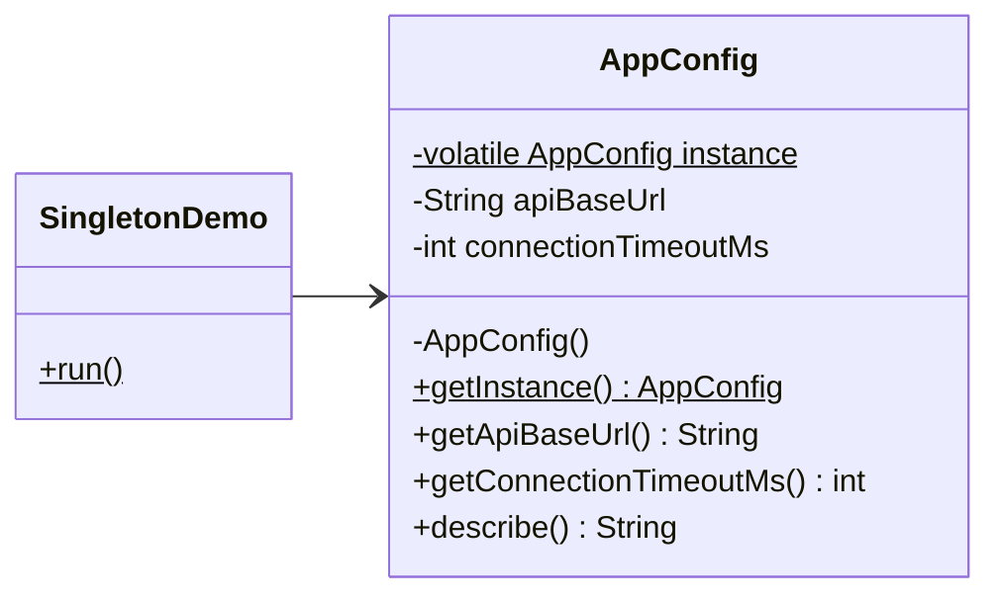

# Singleton (Creational Pattern)

> Diğer adı: **Single Instance**

## Niyet (Intent)
Singleton, bir sınıfın uygulama yaşam döngüsü boyunca **yalnızca bir kez oluşturulmasını** ve bu tek örneğe global erişim sağlanmasını amaçlar.

Kısa versiyon: **"Tek kaynak, tek gerçek."**

## Problem
Bazı bileşenler doğası gereği tek olmalıdır:
- Uygulama konfigürasyonu (`AppConfig`)
- Feature flag cache
- Lisans doğrulama yöneticisi
- Process-level telemetry/metrics toplayıcısı

Bu tip bir bileşen birden fazla üretilirse:
- Tutarsız durumlar oluşur (farklı config değerleri),
- Kaynak tüketimi artar,
- Debug süreci zorlaşır (hangi instance aktif?),
- Multi-thread ortamlarda race condition riskleri ortaya çıkar.

## Çözüm
Singleton sınıfı aşağıdaki kuralları uygular:
- Constructor `private` olur (dışarıdan `new` engellenir).
- Tek örnek `static` alanda tutulur.
- Erişim noktası olarak `getInstance()` tanımlanır.
- Thread-safety için bu projede **Double-Checked Locking + `volatile`** kullanılır.

Bu sayede:
- İlk kullanımda lazy initialize edilir,
- Sonraki erişimlerde kilit maliyeti minimumda tutulur,
- Tüm katmanlar aynı referansı kullanır.

## Yapı

## Bu projedeki model

- `AppConfig` → Singleton sınıfı
- `SingletonDemo` → Client akışı

Dosyalar:
- `src/main/java/com/can/creational/singleton/AppConfig.java`
- `src/main/java/com/can/creational/singleton/SingletonDemo.java`

## Gerçek hayattan analoji
Bir şirket binasındaki **yangın alarm panelini** düşün:
- Her katta farklı panel olsaydı kurallar ve durum takibi dağılırdı.
- Tek merkezi panel tüm sensör durumunu yönetir.
- Herkes aynı panelin ürettiği gerçekliğe göre hareket eder.

Burada alarm paneli = **Singleton**.

## Developer kullanım senaryoları
- **Configuration Manager:** environment bazlı config değerlerinin tek kaynaktan okunması.
- **In-memory Cache Gateway:** process içindeki kısa ömürlü cache'e tek erişim kapısı.
- **Telemetry Registry:** sayaç/metrik toplama servisinin merkezi yönetimi.
- **Connection Pool Wrapper:** pool nesnesinin tek orkestratör üzerinden paylaşılması.

## Thread-safety notu
Bu projede kullanılan yaklaşım:
- `instance` alanı `volatile`
- `getInstance()` içinde double-checked locking

Neden `volatile`?
- JVM instruction reordering nedeniyle kısmi oluşturulmuş nesnenin görünmesini önler.
- Multi-thread senaryoda güvenli yayınlama (safe publication) sağlar.

## OOP ve SOLID notları
- **SRP uyarısı:** Singleton sınıfı sadece "tek örnek yönetimi + kendi domain sorumluluğu" taşımalıdır.
- **DIP riski:** Singleton'ı doğrudan her yere çağırmak global state bağımlılığı oluşturabilir.
- **Testability:** Test izolasyonu için reset/adapter ihtiyacı doğabilir (bu projede test için `resetForTests()` mevcut).

## Uygulanabilirlik
- Uygulama genelinde paylaşılacak tek bir durum/servis gerektiğinde.
- Nesnenin birden fazla oluşturulması iş kurallarını bozuyorsa.
- Merkezi erişim noktası tasarım açısından anlamlıysa.

Kullanmaman gereken durumlar:
- Aslında DI container ile `singleton scope` çözebileceğin yerler,
- Test bağımsızlığının kritik olduğu katmanlar,
- Gizli global state'in bakım maliyetini artıracağı domain'ler.

## Artılar / Eksiler

**Artılar**
- Tek instance garantisi
- Merkezi erişim
- Lazy initialization ile kontrollü kaynak kullanımı

**Eksiler**
- Global state kokusu oluşturabilir
- Unit test izolasyonunu zorlaştırabilir
- Yanlış kullanımda gevşek bağlılık yerine sıkı bağlılık üretir

## Kısa özet
Singleton, doğru yerde kullanıldığında "tek gerçek kaynağı" güvenli şekilde sunar. Ancak her problemi singleton ile çözmek yerine, bağımlılık enjeksiyonu ve yaşam döngüsü yönetimi alternatifleriyle birlikte değerlendirmek gerekir.
