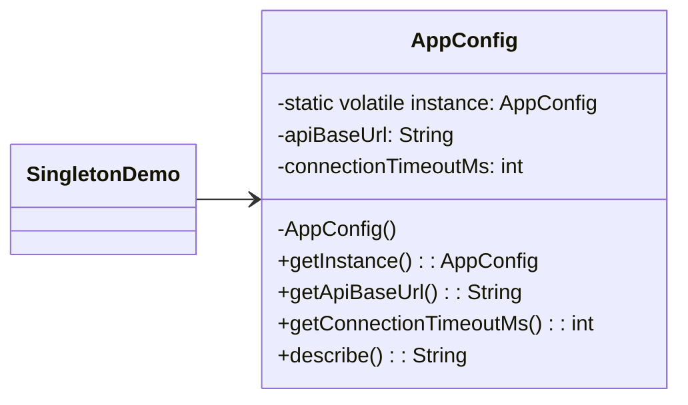
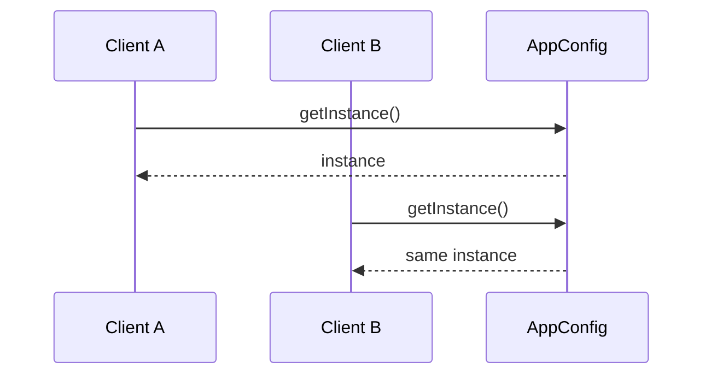

# Singleton (Creational Pattern)

> Diğer adı: **Single Instance**

## Niyet (Intent)
Singleton, bir sınıfın süreç boyunca yalnızca tek kez üretilmesini ve bu örneğe merkezi erişim sunulmasını sağlar.

Kısa versiyon: **"Tek kaynak, tek gerçek durum."**

## Problem
Aşağıdaki bileşenler çoğu zaman tek olmalıdır:
- Uygulama konfigürasyonu
- Process-level cache/registry
- Telemetry sayaç toplayıcısı

Birden fazla instance oluşursa:
- Konfigürasyon tutarsızlığı
- Kaynak israfı
- Debug karmaşası
- Çok thread’li senaryoda yarış koşulları

## Çözüm
`AppConfig` sınıfında:
- Constructor `private`
- Tek örnek `static volatile instance`
- Erişim `getInstance()`
- Thread-safe lazy initialization için double-checked locking

## Yapı



## Runtime akışı



## Bu projedeki model
- `AppConfig` → Singleton sınıfı
- `SingletonDemo` → Client

## Teknik notlar
- `volatile`, JVM instruction reordering riskini azaltır; yarım-initialize nesnenin görünmesini engeller.
- Double-checked locking, ilk oluşturma dışındaki çağrılarda gereksiz lock maliyetini düşürür.
- `resetForTests()` ile test izolasyonu senaryosu desteklenmiştir.

## Ne zaman kullanılır?
- Sistem genelinde tek konfigürasyon/registry örneği gerekiyorsa.
- Birden fazla instance iş kuralını bozuyorsa.

## Ne zaman kullanma?
- DI container yaşam döngüsünü zaten yönetiyorsa.
- Global state’in test/bağımlılık maliyeti kabul edilemezse.

## Artılar / Eksiler

**Artılar**
- Tek instance garantisi
- Merkezi erişim
- Lazy initialize ile kontrollü kaynak kullanımı

**Eksiler**
- Global state kokusu riski
- Unit test izolasyon zorluğu
- Yanlış kullanımda sıkı bağlılık

## Kısa özet
Singleton doğru yerde güçlü bir araçtır; ama “kolay erişim” uğruna global state’i yaygınlaştırmak uzun vadede bakım maliyetini artırır.

## Gerçek Hayattan ve Yaygın Kullanılan Singleton Pattern Örnekleri

### 1. Uygulama Konfigürasyonu (Spring, Android, .NET)
Tüm uygulama genelinde tek bir konfigürasyon nesnesi kullanılır:

```java
AppConfig config = AppConfig.getInstance();
String apiUrl = config.getApiBaseUrl();
```

### 2. Logger (Log4j, SLF4J, java.util.logging)
Tüm loglama işlemleri için tek bir logger nesnesi kullanılır:

```java
Logger logger = Logger.getInstance();
logger.info("Başlatıldı");
```

### 3. Database Connection Pool (JDBC, HikariCP, DBCP)
Veritabanı bağlantı havuzu uygulama boyunca tek örnek olarak yönetilir:

```java
ConnectionPool pool = ConnectionPool.getInstance();
Connection conn = pool.getConnection();
```

### 4. Cache/Registry (Ehcache, Guava Cache)
Tüm uygulama genelinde merkezi bir cache veya registry nesnesi kullanılır:

```java
Cache cache = Cache.getInstance();
cache.put("user:1", user);
```
