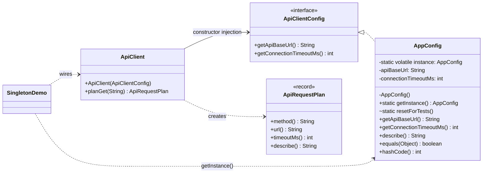
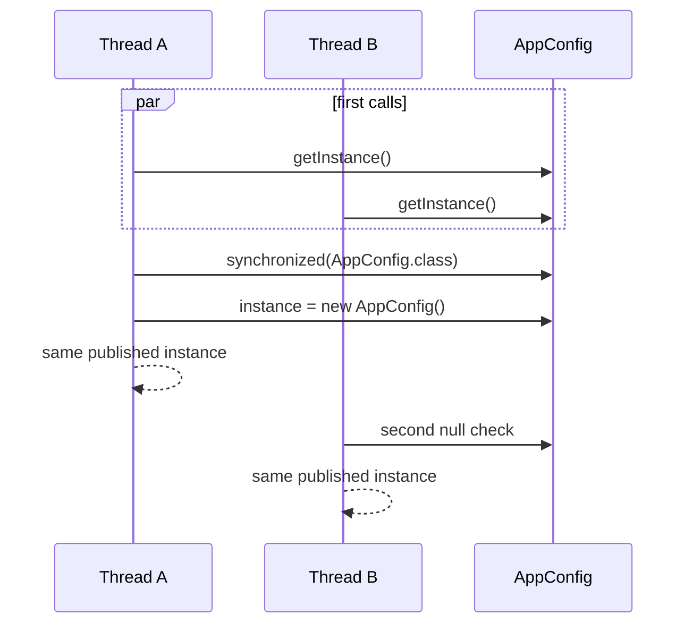
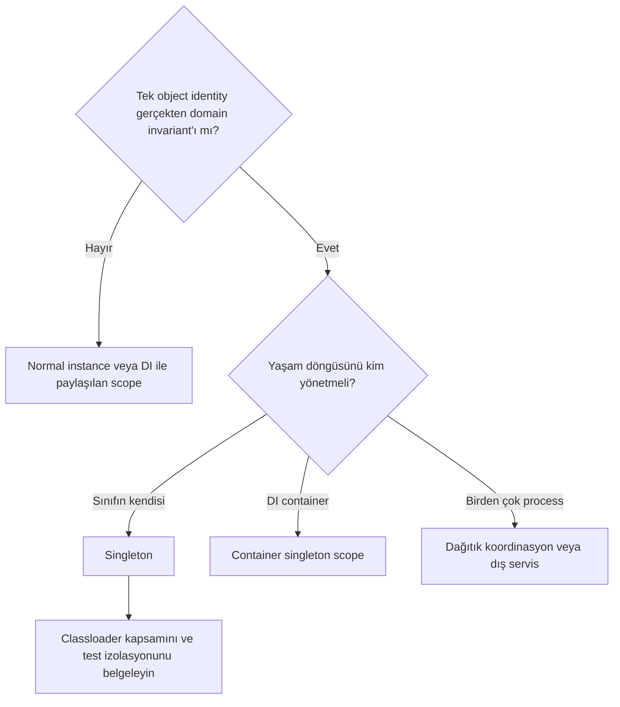

# Singleton

Singleton, belirli kapsamda tek instance ve ortak erişim amaçlar; `AppConfig` thread-safe lazy initialization için double-checked locking kullanır.

## 30 saniyelik kart

| Soru | Cevap |
|---|---|
| **Niyet** | Bir sınıf için kontrollü tek instance ve ortak erişim noktası sağlamak |
| **Değişen eksen** | İlk instance'ın hangi çağrıda ve hangi thread tarafından oluşturulacağı |
| **Sabit kalan** | Bütün normal `getInstance()` çağrılarının aynı referansı döndürmesi |
| **Bedel** | Global erişim, gizli bağımlılık ve test izolasyonu riski |
| **Bu repodaki erişim** | `AppConfig.getInstance()` |

> Kısa tanım: **Kapı çok, içeride classloader başına tek oda var.**

## Örnek haritası: temel → güçlendirilmiş → production

| Katman | Gerçek kod karşılığı | Ne öğretiyor? |
|---|---|---|
| **Temel örnek** | `AppConfig#getInstance()` | DCL + `volatile`, classloader kapsamında lazy ve thread-safe tek object identity yayınlar |
| **Güçlendirilmiş örnek** | `ApiClientConfig`, `ApiClient`, `ApiRequestPlan` | Singleton yalnız composition root'ta çözülür; iş sınıfı dar interface'i constructor'dan aldığı için fake config ile global state olmadan test edilir |
| **Production sınırı** | Hard-coded immutable `AppConfig` değerlerinin ötesi | Secret yönetimi, config reload, initialization failure, DI scope ve farklı process'ler arasındaki koordinasyon Singleton tarafından çözülmez |

`com.can.demo.creational.singleton.SingletonDemo`, önce iki erişimin identity eşitliğini, sonra aynı config'in enjekte edildiği test edilebilir bir API istek planını gösterir.

## Paket sınırı: pattern kodu ve çalıştırılabilir demo

Singleton, dar config sözleşmesi ve onu kullanan client `com.can.creational.singleton` domain paketindedir.
`com.can.demo.creational.singleton.SingletonDemo` global erişimi bir kez çözüp `ApiClient`a enjekte eden çalıştırılabilir composition root'tur; bağımlılık yönü **demo → domain** biçimindedir.
Bu sınır `AppConfig.getInstance()` çağrısının iş sınıflarına yayılmasını önler ve global identity kararını wiring noktasında görünür tutar.
Diyagramlarda uzun FQCN yerine kısa `SingletonDemo` adı kullanılır.

`src/test` altındaki `com.can.creational.singleton.SingletonDemoTest` çalıştırılabilir demo değildir.
Static yaşam döngüsünü izole eden package-private `resetForTests()` hook'una kontrollü erişmek ve domain kontratını doğrulamak için test paketinde kalır.

## Akılda kalıcı analoji: binanın ortak elektrik panosu

Her daire yeni pano kurmak yerine ortak panoya erişir; her yerden doğrudan kablo çekmek ise bağımlılıkları gizleyebilir.

`getInstance()` ortak erişim noktası, private constructor normal `new AppConfig()` kullanımının engelidir.

Bu bir **kavramsal benzetmedir**; framework “singleton scope”u otomatik olarak GoF Singleton değildir.

## Pattern olmasaydı problem nasıl görünürdü?

Her client kendi config nesnesini oluşturabilirdi:

```java
AppConfig first = new AppConfig();
AppConfig second = new AppConfig();
```

Gerçek bir mutable config söz konusuysa:

- Client'lar farklı değer görebilir.
- Pahalı kaynaklar tekrar açılabilir.
- Yaşam döngüsünün sahibi belirsizleşebilir.
- Eşzamanlı initialization yarışları oluşabilir.

“Tek instance” her probleme doğru değildir; DI container yaşam döngüsünü daha görünür yönetebilir.

## Çözüm ve sınırı

Repo şu çekirdeği kullanır:

```java
private static volatile AppConfig instance;

public static AppConfig getInstance() {
    if (instance == null) {
        synchronized (AppConfig.class) {
            if (instance == null) {
                instance = new AppConfig();
            }
        }
    }
    return instance;
}
```

Bu, double-checked locking'dir:

1. Fast path instance varsa lock almaz.
2. İlk null gözleminde class monitor'üne girer.
3. Lock içinde ikinci kez kontrol eder.
4. Yalnız bir instance yayınlar.

`volatile` visibility ve ordering garantisi kurar; modern Java'da DCL'yi doğru yapan unsurdur.

Singleton sınırları:

- Garanti genel olarak **classloader başınadır**, tüm işletim sistemi süreci için mutlak değildir.
- Reflection private constructor'a erişebilir.
- Serialization uygulanırsa ayrıca `readResolve` gibi kararlar gerekir.
- Bu sınıftaki `resetForTests()` bilinçli olarak yeni instance oluşturulmasına izin verir.
- Dağıtık sistemde farklı process/JVM'ler ayrı instance taşır.

## Repo sınıfları ve pattern rolleri

| Sınıf / API | Rol | Sorumluluk |
|---|---|---|
| `AppConfig` | Singleton | Instance kontrolü ve immutable config değerleri |
| `private AppConfig()` | Kontrollü constructor | Dışarıdan normal nesne üretimini kapatır |
| `volatile instance` | Paylaşılan referans | Thread'ler arası güvenli publication sağlar |
| `getInstance()` | Global access point | Lazy instance'ı döndürür |
| `resetForTests()` | Package-private test hook | Testler arasında static state'i sıfırlar |
| `getApiBaseUrl()` | Query | Sabit API adresini döndürür |
| `getConnectionTimeoutMs()` | Query | Sabit timeout değerini döndürür |
| `describe()` | Sunum helper'ı | Config'i okunabilir metne çevirir |
| `equals/hashCode` | Value equality | URL ve timeout değerlerini identity'den bağımsız karşılaştırır |
| `ApiClientConfig` | Dar dependency contract | Client'ın static `AppConfig` tipine bağlanmasını önler |
| `ApiClient` | Güçlendirilmiş client | Config'i constructor'dan alır, URI origin/base-path ve timeout sınırını doğrular |
| `ApiRequestPlan` | Immutable sonuç | Gerçek ağ çağrısı olmadan method, URL ve timeout kararını gözlemlenebilir yapar |
| `com.can.demo.creational.singleton.SingletonDemo` | Demo / composition root | Singleton'ı bir kez çözüp client'a enjekte eder |

## Yapı diyagramı


```mermaid
classDiagram
    direction LR
    class AppConfig {
        -static volatile instance: AppConfig
        -apiBaseUrl: String
        -connectionTimeoutMs: int
        -AppConfig()
        +static getInstance() AppConfig
        ~static resetForTests()
        +getApiBaseUrl() String
        +getConnectionTimeoutMs() int
        +describe() String
        +equals(Object) boolean
        +hashCode() int
    }
    class ApiClientConfig {
        <<interface>>
        +getApiBaseUrl() String
        +getConnectionTimeoutMs() int
    }
    class ApiClient {
        +ApiClient(ApiClientConfig)
        +planGet(String) ApiRequestPlan
    }
    class ApiRequestPlan {
        <<record>>
        +method() String
        +url() String
        +timeoutMs() int
        +describe() String
    }
    ApiClientConfig <|.. AppConfig
    ApiClient --> ApiClientConfig : constructor injection
    ApiClient ..> ApiRequestPlan : creates
    SingletonDemo ..> AppConfig : getInstance()
    SingletonDemo ..> ApiClient : wires
```

## Eşzamanlı ilk erişim


```mermaid
sequenceDiagram
    participant A as Thread A
    participant B as Thread B
    participant S as AppConfig
    par first calls
        A->>S: getInstance()
        B->>S: getInstance()
    end
    A->>S: synchronized(AppConfig.class)
    A->>S: instance = new AppConfig()
    A-->>A: same published instance
    B->>S: second null check
    B-->>B: same published instance
```

## Yanlış araç seçimini önleyen karar diyagramı


```mermaid
flowchart TD
    A{"Tek object identity gerçekten domain invariant'ı mı?"}
    A -- Hayır --> B["Normal instance veya DI ile paylaşılan scope"]
    A -- Evet --> C{"Yaşam döngüsünü kim yönetmeli?"}
    C -- "Sınıfın kendisi" --> D["Singleton"]
    C -- "DI container" --> E["Container singleton scope"]
    C -- "Birden çok process" --> F["Dağıtık koordinasyon veya dış servis"]
    D --> G["Classloader kapsamını ve test izolasyonunu belgeleyin"]
```

Singleton seçimi “her yerden kolay erişim” arzusuna değil kanıtlanabilir bir identity invariant'ına dayanmalıdır.
Yalnız tek konfigürasyon değeri paylaşmak gerekiyorsa immutable bir nesneyi composition root'tan enjekte etmek, global access point eklemeden aynı paylaşımı sağlayabilir.

## Kodu adım adım okuma

### 1. Constructor private'dır

Client `new AppConfig()` yazamaz; `final` sınıf subclass üzerinden yeni üretim yolunu kapatır.

### 2. Alanlar immutable'dır

İki config alanı final ve setter'sızdır; bu mutable state riskini azaltır, global bağımlılığı kaldırmaz.

### 3. İlk null kontrolü fast path'tir

Sonraki çağrılar synchronized bloğa girmez, fakat volatile read içerir.

### 4. İkinci kontrol zorunludur

Birden çok thread null görebilir; lock içindeki ikinci kontrol yeni instance'ı engeller.

### 5. Test hook static state'i temizler

`resetForTests()` aynı monitor ile instance'ı null yapar; package-private olduğu için testler erişebilir.
Production'da reset ve get yarışı identity garantisini bilinçli olarak bozar.

### 6. Identity ile value equality farklı soruları cevaplar

Singleton kontratı “aynı referans mı?” sorusudur ve yalnız `assertSame` / `assertNotSame` ile test edilir.
`AppConfig#equals/hashCode` ise config değerlerini karşılaştırır; test hook sonrasında oluşan iki farklı identity aynı URL ve timeout'u taşıdığı için value-equal olabilir.
Value equality'nin true olması iki referansın aynı nesne olduğunu söylemez; tersine identity testi de domain değerlerinin eşitliğini ölçmez.

### 7. Global erişim composition root'ta tutulur

`ApiClient`, kendi içinde `AppConfig.getInstance()` çağırmaz; yalnız `ApiClientConfig` sözleşmesini constructor'dan alır.
`com.can.demo.creational.singleton.SingletonDemo` wiring noktasında `new ApiClient(AppConfig.getInstance())` yazar.
Böylece production tek instance'ı kullanırken test, static state'e dokunmadan fake config sağlayabilir.

### 8. İstek planı güvenli ve gözlemlenebilir bir sınırdır

`ApiClient` constructor'ı base URL'yi directory semantiğine sahip bir `URI` olarak normalize eder.
Yalnız credential/query/fragment içermeyen, geçerli portlu HTTP(S) adreslerini kabul eder; timeout'un pozitif olduğunu denetler ve immutable snapshot alır.

`planGet` endpoint'i `URI.resolve(...).normalize()` ile çözer:

- Absolute URI ve `//host/path` network-path reference reddedilir.
- Endpoint parametresi yalnız path'tir; query ve fragment özellikle reddedilir.
- Raw veya percent-encoded `.` / `..` segmentleri kabul edilmez.
- Sonucun scheme, host ve portu base URI ile aynı olmalıdır.
- Sonuç, trailing slash ile sınırlandırılan configured base-path altında kalmalıdır.
- Tek leading slash root anlamına gelmez; mevcut API davranışını koruyarak configured base-path'e göre relative kabul edilir.

`ApiRequestPlan` gerçek network I/O yapmadan oluşan method + URL + timeout kararını test etmeyi sağlar; HTTP retry/authentication gibi konular bilinçli olarak dışarıda kalır.

## Testlerin anlattığı kontratlar

`SingletonDemoTest` şu davranışları korur:

| `@Nested` grup | Korunan davranış |
|---|---|
| `IdentityContract` | Ardışık erişimlerin aynı referansı vermesi; test reset’i sonrası yeni identity oluşurken aynı config değerlerinin value-equal ve aynı hash’te kalması |
| `ConfigurationDefaults` | Immutable URL/timeout default’ları ile exact `describe()` çıktısının korunması |
| `DependencyBoundary` | `ApiClient`ın hem Singleton hem fake `ApiClientConfig` ile çalışması; güvenli GET planı üretmesi; base URI, timeout, origin/base-path, raw/encoded traversal, query ve fragment sınırlarını erken doğrulaması |
| `StructuralConstraints` | `AppConfig` sınıfının final ve tek constructor’ının private olması |
| `ThreadSafety` | Aynı anda başlayan worker’ların tek identity görmesi; timeout güvenlik ağı ve executor’ın her durumda kapatılması |

Concurrency testi güvenlik ağıdır; tekrar sayısı Java Memory Model doğruluğunun kanıtı değildir.

## Ne zaman kullanılır?

- Birden fazla instance domain kuralını gerçekten bozuyorsa.
- Yaşam döngüsü sınıfın kendisi tarafından yönetilmek zorundaysa.
- Classloader başına tek registry/config nesnesi isteniyorsa.
- DI container bulunmayan küçük bir runtime altyapısında kontrollü global erişim gerekliyse.

## Ne zaman kullanma?

- Amaç yalnız “her yerden kolay erişmek” ise.
- DI container yaşam döngüsünü zaten yönetiyorsa.
- Testlerde farklı configuration örnekleri gerekecekse.
- Tenant/request/thread başına farklı state gerekiyorsa.
- Dağıtık tekillik gerekiyorsa; process içi Singleton bunu sağlayamaz.

## Artılar ve bedeller

| Artı | Bedel |
|---|---|
| Nesne üretimi tek noktadan kontrol edilir | Bağımlılık constructor'da görünmeyebilir |
| Lazy initialization mümkündür | Static state test izolasyonunu zorlaştırır |
| Aynı JVM kapsamındaki paylaşım kolaydır | Classloader ve reflection sınırları vardır |
| DCL fast path lock almaz | Kod eager/holder yaklaşımından karmaşıktır |
| Immutable instance güvenli paylaşılır | Global erişim sıkı bağlılık yaratabilir |

## Daha sade Java alternatifleri

### Initialization-on-demand holder

```java
private static class Holder {
    private static final AppConfig INSTANCE = new AppConfig();
}

public static AppConfig getInstance() {
    return Holder.INSTANCE;
}
```

Class initialization garantilerini kullanır; explicit volatile ve synchronized gerekmez.

### Eager static final

Instance ucuzsa en sade seçenektir:

```java
private static final AppConfig INSTANCE = new AppConfig();
```

### Enum singleton

Serialization ve reflection dirençleri için güçlüdür; API ve inheritance kısıtları farklıdır.

### Dependency Injection scope

Container tek instance üretirken sınıf normal test edilebilir kalır; bu GoF Singleton'dan farklıdır.

## Production hardening

Güçlendirilmiş kullanım şunu artık kodla gösterir:

- Global `getInstance()` çağrısını iş sınıflarına yaymak yerine composition root'ta çözmek.
- Client'ı dar `ApiClientConfig` interface'i üzerinden constructor injection ile kurmak.
- Base URI origin'i, configured base-path, relative endpoint path'i ve timeout'u network çağrısından önce doğrulamak.

Production kararı olarak kalanlar:

- DCL gerçekten gerekli değilse holder veya eager yaklaşımını tercih etmek.
- Test hook'unu production artifact'tan ayırmak veya package tasarımını gözden geçirmek.
- Config değerlerini hard-code etmek yerine doğrulanmış configuration kaynağından almak.
- Secret değerleri `describe()` içine koymamak.
- Value equality ile Singleton identity testlerini ayrı assertion ve ayrı kavramlar olarak korumak.
- Classloader kapsamını deployment dokümanında açıklamak.
- Initialization hata politikasını ve yeniden denemeyi tasarlamak.
- Runtime config reload gerekiyorsa constructor snapshot'ı yerine version'lanmış provider tasarlamak.
- TLS, authentication, retry ve observability kararlarını gerçek HTTP transport katmanına yerleştirmek.

Logger, pool veya cache “her zaman Singleton” değildir; kapsamlarına göre birden fazla olabilir.
Yalnız kapsam gerçekten tek olduğunda kavramsal adaydır.

## Benzer pattern'lerle karşılaştırma

| Yapı | Ana amaç | Singleton'dan farkı |
|---|---|---|
| Static utility | Stateless fonksiyonları grupla | Nesne identity'si ve interface kullanımı yoktur |
| DI singleton scope | Container kapsamında tek instance | Sınıf kendi global erişim noktasını taşımaz |
| Object Pool | Sınırlı sayıda yeniden kullanılan instance | Tek instance şart değildir |
| Flyweight | Çok sayıda nesnede ortak intrinsic state paylaş | Tek global nesne hedeflemek zorunda değildir |
| Monostate | Farklı instance'larda static state paylaş | Identity farklı, state ortaktır |

## Yaygın hatalar

1. “Bir tane yeter” gerekçesini “bir tane olmak zorunda” ile karıştırmak.
2. Process-wide veya cluster-wide tekillik iddia etmek.
3. DCL'de `volatile` kullanmamak.
4. İkinci null kontrolünü kaldırmak.
5. Global erişimi dependency injection yerine her sınıfa yaymak.
6. Concurrency testini thread-safety'nin tek kanıtı saymak.
7. Kütüphane API'lerini doğrulamadan Logger veya pool'u Singleton örneği ilan etmek.

## Üç kademeli alıştırma

### Seviye 1 — holder yaklaşımı

Holder kullanan alternatif yaz; aynı identity ve concurrency testlerini iki sürüme uygula.

### Seviye 2 — yenilenebilir config

`ApiClientConfig` değerleri runtime'da yenilenecekse snapshot ve live-provider yaklaşımlarını karşılaştır.
Bir istek boyunca tutarlılık ve thread-safety kontratını test et.

### Seviye 3 — classloader deneyi

Aynı class'ı iki classloader ile yükle; “tek” kelimesinin neden kapsam istediğini raporla.

## Tek cümlelik hafıza çengeli

> **Singleton: instance sayısını kontrol eder; ama global erişimin bedelini ve “tek” garantisinin kapsamını sen yönetirsin.**
