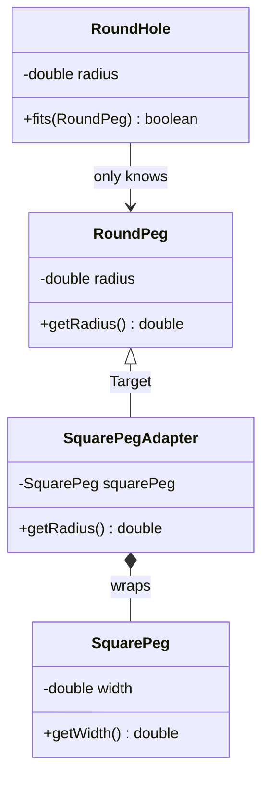
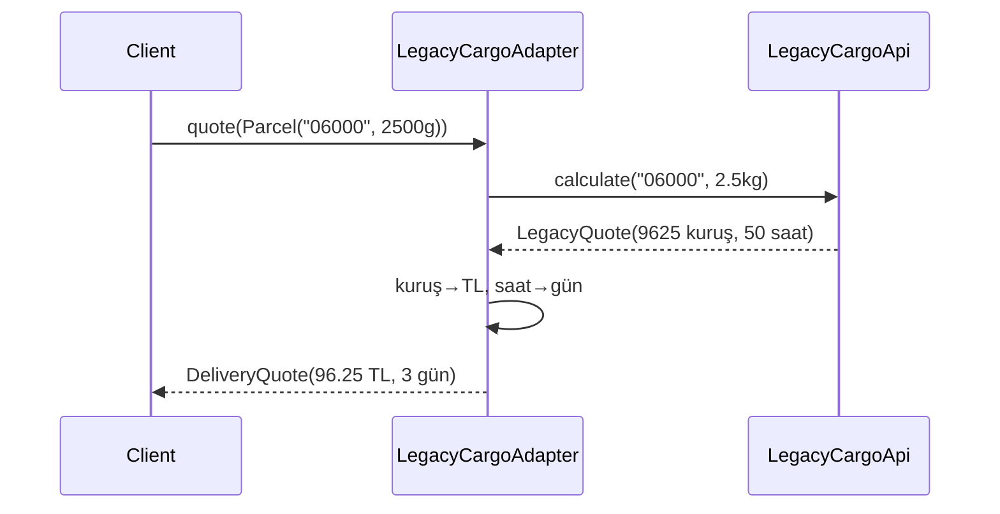

# Adapter Pattern — Aynı İşi Farklı Dillerde Konuşturmak

> Bölüm önce geometriyle arayüz uyumunu görünür kılar, sonra aynı fikri eski bir kargo API'sindeki birim ve model dönüşümüne taşır.

## 30 saniyelik kart

| Soru | Kısa cevap |
|---|---|
| Niyet | Var olan nesnenin arayüzünü client'ın beklediği arayüze çevirmek |
| Değişen eksen | Dış/legacy API ile uygulamanın hedef kontratı |
| Ana araç | Adaptee'yi sarmak ve çağrı/veri dönüştürmek |
| Korunan şey | Client ve mevcut servis değiştirilmez |
| Bedel | Ek yönlendirme, dönüşüm ve hata eşleme sorumluluğu |
| Repo cümlesi | `SquarePegAdapter` şekli, `LegacyCargoAdapter` dış servis dilini target kontratına çevirir |

**Hafıza kancası:** Adapter bir çevirmendir; işin amacını değil konuşulan dili değiştirir.

## Örnek haritası: temel → güçlendirilmiş → production

| Katman | Repodaki karşılığı | Öğrettiği şey |
|---|---|---|
| Temel örnek | `RoundHole`, `RoundPeg`, `SquarePeg`, `SquarePegAdapter` | Uyumsuz tipi yarım köşegen hesabıyla target tipe uydurmak |
| Güçlendirilmiş örnek | `ShippingService`, `Parcel`, `DeliveryQuote`, `LegacyCargoApi`, `LegacyCargoAdapter` | Metot çağrısıyla birlikte gram→kilogram, kuruş→TL ve saat→gün semantiğini çevirmek |
| Bilinçli production sınırı | Demo API'si yerel ve deterministiktir | Gerçek provider'da timeout/retry, kur, SLA, kimlik doğrulama ve hata eşleme ayrıca tasarlanır |

## Akılda kalıcı analoji: priz dönüştürücü

Türkiye fişli cihazı İngiltere prizine doğrudan takamazsın. Duvarı veya cihaz kablosunu değiştirmek yerine araya dönüştürücü koyarsın.

- İki taraf kendi biçimini korur.
- Enerjinin amacı değişmez.
- Yalnız bağlantı biçimi çevrilir.

Yazılım Adapter'ı da tip, metot adı, DTO, veri formatı veya protokol uyumsuzluğunu aynı şekilde sınırlar. Yeni davranış eklemek Decorator'ın, erişimi yönetmek Proxy'nin niyetidir.

## Pattern olmadan problem

`RoundHole` yalnız şu kontratı kabul eder:

```java
boolean fits(RoundPeg peg)
```

`SquarePeg` ise radius değil yalnız width bilir. Kötü çözümler:

1. `RoundHole` içine her yabancı tip için overload eklemek.
2. Değiştiremeyeceğimiz `SquarePeg` sınıfını zorla dönüştürmek.
3. Formülü her client çağrısında kopyalamak.
4. `Object` ve `instanceof` zinciriyle tip güvenliğini kaybetmek.

Yeni adaptee geldikçe target tüketicisi büyür ve dönüşüm mantığı dağılır. Gerçek projede bu koku; provider DTO'su–domain modeli, XML–JSON, eski tarih–`Instant` veya üçüncü parti hata kodu–domain sonucu arasında görülür.

## Çözüm ve çözümün sınırı

`SquarePegAdapter`, target olan `RoundPeg` gibi davranır ve içeride `SquarePeg` tutar:

```java
public class SquarePegAdapter extends RoundPeg {
    private final SquarePeg squarePeg;

    @Override
    public double getRadius() {
        return squarePeg.getWidth() / Math.sqrt(2);
    }
}
```

Kare kesitin yuvarlak deliğe sığması için gereken radius, köşegenin yarısıdır:

```text
köşegen = width × √2
gerekli radius = width × √2 / 2
```

Adapter iki çeviri yapar:

- **Tip:** `SquarePeg`, `RoundPeg` kontratından görünür.
- **Anlam:** width, karşılaştırılabilir radius değerine çevrilir.

Sınırlar:

- Adapter yeni iş kuralı icat etmemelidir.
- Kaybolan veriyi sihirli biçimde geri üretemez.
- Hata/timeout politikasını otomatik çözmez.
- Dönüşüm kayıplıysa hedef kontrat bunu ifade etmelidir.

Bu klasik örnekte Target concrete sınıftır; adapter `super(0)` ile kullanılmayan üst sınıf state'i kurar. Production'da küçük bir Target interface'i bu yapay state'i kaldırabilir.

Gerçekçi örnekte target artık açıkça bir interface'tir:

```java
ShippingService shippingService =
    new LegacyCargoAdapter(new LegacyCargoApi());

DeliveryQuote quote =
    shippingService.quote(new Parcel("06000", 2_500));
```

Client gram ve TL kullanan kendi dilinde kalır. `LegacyCargoAdapter`, eski servise
`2.5` kilogram gönderir; dönen `9_625` kuruşu `96.25` TL'ye ve `50` saati yukarı
yuvarlayarak `3` güne çevirir. Para dönüşümünde `BigDecimal` kullanılması, adapter'ın
yalnız tip değil **ölçü birimi ve hassasiyet kontratı** da çevirdiğini gösterir.

## Repodaki roller

| Pattern rolü | Tip | Sorumluluk |
|---|---|---|
| Client / composition root | `AdapterPatternDemo` | Nesne graph'ını kurup örneği çalıştırır |
| Target tüketicisi | `RoundHole` | Yalnız `RoundPeg` üzerinden uygunluk ölçer |
| Target | `RoundPeg` | Client'ın bildiği radius tabanlı tip |
| Adaptee | `SquarePeg` | Width tabanlı mevcut/uyumsuz tip |
| Adapter | `SquarePegAdapter` | Adaptee'yi sarar ve width'i radius'a çevirir |
| Gerçek target | `ShippingService` | Uygulamanın beklediği kargo fiyatlama kontratı |
| Gerçek target modelleri | `Parcel`, `DeliveryQuote` | Gram, TL ve gün cinsinden uygulama dili |
| Gerçek adaptee | `LegacyCargoApi` | Kilogram, kuruş ve saat kullanan değiştirilemeyen servis |
| Gerçek adapter | `LegacyCargoAdapter` | Çağrıyı ve cevabı iki yönde dönüştürür |

Demo adapter'ın concrete tipini wiring için bilir; kazanç, `RoundHole` iş mantığının `SquarePeg` bilmemesidir.

## Mermaid yapı ve akış





## Kodun execution trace'i

**Temel akış**

1. Radius `5` olan `RoundHole` kurulur.
2. Radius `5` olan normal `RoundPeg` doğrudan sığar.
3. Width `5` ve `10` olan iki `SquarePeg` hazırlanır.
4. Her adaptee ayrı `SquarePegAdapter` ile sarılır.
5. Küçük adapter yaklaşık `3.54` döndürür; delik kabul eder.
6. Büyük adapter yaklaşık `7.07` döndürür; delik reddeder.

`RoundHole.fits` hiçbir concrete adapter kontrolü yapmaz; polimorfizm çeviriyi görünmez kılar.

**Gerçekçi entegrasyon akışı**

1. Client `ShippingService` referansı ister; `LegacyCargoApi` tipini bilmez.
2. `Parcel("06000", 2_500)` adapter'a verilir.
3. Adapter gramı `2.5` kilograma çevirip legacy çağrıyı yapar.
4. Legacy cevap `feeInKurus=9_625`, `estimatedHours=50` döner.
5. Adapter `DeliveryQuote("Legacy Cargo", 96.25, 3)` üretir.

## Test kontratları neyi öğretiyor?

`AdapterPatternDemoTest` dört `@Nested` hikâye kullanır.

### `RoundPegCompatibility`

- Eşit ve küçük radius'un sığdığını,
- büyük radius'un sığmadığını,
- temel getter değerlerini birlikte doğrular.

### `SquarePegAdaptation`

- Yarım köşegen formülünü floating-point toleransıyla test eder.
- Adapter'ın `RoundPeg` referansından kullanılabildiğini gösterir.
- Width `5` ve `10` ile olumlu/olumsuz yolu birlikte sınar.
- `Double.MAX_VALUE` gibi geçerli büyük bir width'in ara çarpım yüzünden
  `Infinity`ye taşmadığını doğrular.

### `LegacyCargoIntegration`

- Gram→kilogram çağrı dönüşümünü bir fake adaptee üzerinden gözlemler.
- Kuruş→`BigDecimal` TL ve saat→gün cevap dönüşümünü doğrular.
- Client değişkeninin yalnız `ShippingService` target tipinde kaldığını gösterir.
- `140`, `276` ve `280` gram gibi tam kuruş sınırlarında binary `double`
  gürültüsünün fazladan bir kuruş üretmediğini parametreli testle sabitler.

### `InputBoundaries`

- Sıfır/negatif/anlamsız ölçüleri,
- boş posta kodunu,
- null adaptee ve bağımlılıkları erken reddeden kontratları sabitler.

Arrange uyumsuz dünyaları kurar, Act target çağrısını yapar, Assert hem matematiksel çeviriyi hem client sonucunu doğrular. Demo metni yerine çekirdek API test edildiği için sunum değişikliği kontratı kırmaz.

## Edge case, güvenlik, concurrency ve performans

### Sayısal sınırlar

`RoundHole` ve `SquarePeg` pozitif/finite değer ister; `RoundPeg`, adapter'ın
`super(0)` ihtiyacı nedeniyle sıfıra izin verir. `Parcel` ağırlığı pozitif olmalıdır.
Bu doğrulamalar anlamsız geometriyi ve sessiz yanlış fiyatı erken keser.

`double` yalnız kilogram oranı için legacy sınıra taşınır; uygulama tarafındaki para
`BigDecimal` kalır. Eğitim amaçlı legacy servis de `double` değeri
`BigDecimal.valueOf` ile ondalık gösterimine alıp ücret çarpımını yaptıktan sonra
`CEILING` uygular. Böylece örneğin `0.14 × 1250`, binary ara değer
`175.00000000000003` olduğu için yanlışlıkla `176` kuruşa çıkmaz. Gerçek provider'ın
küsurat ve yuvarlama kuralı sözleşmede açıkça belirtilmelidir.

### Null ve hata eşleme

Null peg, adaptee, parcel ve adapter bağımlılığı sınırda reddedilir. Gerçek dış servis adapter'ında timeout, retry, bilinmeyen status ve hassas hata mesajı hedef kontrata bilinçli eşlenmelidir; ayrıntı sızıntısı engellenmelidir.

### Güvenlik

Adapter güven sınırı olabilir. Dış DTO alanlarını körlemesine domain'e taşımak mass-assignment, injection veya yetkisiz alan kullanımına yol açabilir. Allow-list mapping ve boyut sınırı uygulanmalıdır.

### Concurrency

Bu örnek immutable sayısal state okur. Mutable/thread-confined adaptee, adapter tarafından otomatik olarak thread-safe hale gelmez; lifecycle hâlâ gerçek nesnenin kontratıdır.

### Performans

Bir çarpma ve karekök ihmal edilebilir. Büyük payload adapter'ında serialization, encoding, kopyalama ve allocation ölçülmelidir. Adapter ne doğası gereği yavaştır ne de maliyetsizdir.

## Ne zaman kullan?

- Değiştiremeyeceğin legacy/third-party API ile çalışırken.
- Provider DTO'larını domain modelinden izole ederken.
- Aynı işlev farklı metot adları veya veri biçimleriyle sunuluyorsa.
- Eski ve yeni kontratı geçiş döneminde birlikte desteklerken.
- Anti-corruption layer ile dış dilin iç modele sızmasını önlerken.

## Ne zaman kullanma?

- Tipler zaten aynı kontratı doğal biçimde paylaşabiliyorsa.
- Asıl ihtiyaç davranış eklemek veya erişimi yönetmekse.
- Dönüşüm hedef modelde ifade edilemeyecek kadar kayıplıysa.
- Tek, tekrarlanmayacak yerel dönüşüm için soyutlama daha çok yük getiriyorsa.

## Artılar ve bedeller

### Artılar

- Mevcut sınıfları değiştirmeden entegrasyon.
- Dönüşüm ve hata eşlemeyi tek sınırda toplama.
- Client'ı sağlayıcı ayrıntısından koruma.
- Yeni adaptee türleriyle genişleyebilme.

### Bedeller

- Ek sınıf ve çağrı katmanı.
- Veri kaybı ve hata semantiği tasarımı.
- Çok fazla ince adapter ile keşfedilebilirlik kaybı.
- Kötü Target kontratının sınırlarına bağımlılık.

## Karışan desenlerle karşılaştırma

| Desen | Ana fark |
|---|---|
| Bridge | İki hiyerarşiyi baştan bağımsız geliştirir |
| Decorator | Aynı interface üzerinde sorumluluk ekler |
| Facade | Alt sisteme daha sade, çoğu zaman farklı bir yüz verir |
| Proxy | Aynı interface ile gerçek nesneye erişimi yönetir |
| Mapper | Yalnız veri dönüşümü yapabilir; tam nesne arayüzü sunmak zorunda değildir |

Hepsi sarma kullanabilir. Seçimi sınıf diyagramı değil, **niyet** belirler.

## Yaygın hatalar

1. Adapter içine yeni domain iş kuralları doldurmak.
2. Dönüşümü controller/service'lerde tekrar etmek.
3. Hata kodlarını sessizce yutmak.
4. Client'ı yeniden concrete adaptee'ye bağlamak.
5. Wrapper gördüğü her yapıya Adapter demek.
6. Null ve sayı kontratını belirsiz bırakmak.

## Üç kademeli alıştırma

### Seviye 1 — Isınma

Radius `4` deliğe width `5`, `6`, `8` karelerin sığıp sığmadığını önce hesapla, sonra test et.

### Seviye 2 — Target abstraction

Küçük bir `RoundPegLike` interface'i çıkar. `RoundPeg` ve adapter bunu uygulasın; `super(0)` ihtiyacının neden kalktığını açıkla.

### Seviye 3 — Production sınırı

`LegacyCargoApi` çağrısına timeout ve hata kodu ekle. Bunları `ShippingQuoteFailure`
gibi provider'dan bağımsız bir domain sonucuna eşle; retry edilebilir ve kalıcı
hataları ayrı testlerle görünür yap.

## Son hafıza cümlesi

> **Adapter, “aynı işi yapıyoruz ama aynı dili konuşmuyoruz” problemine konan çevirmendir.**
