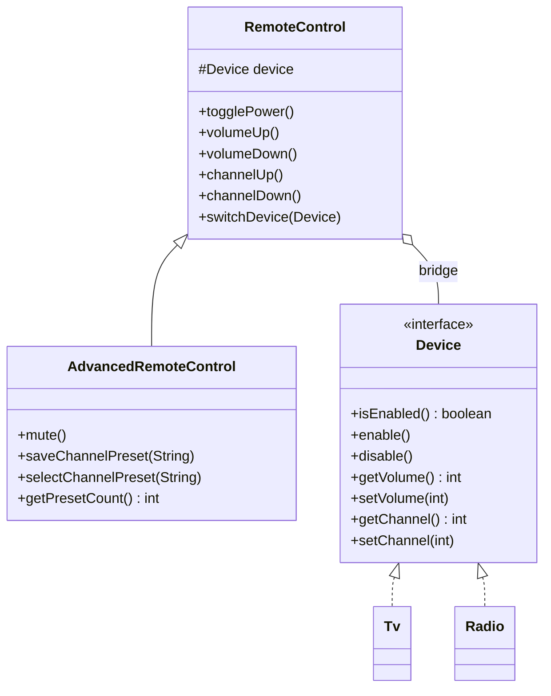
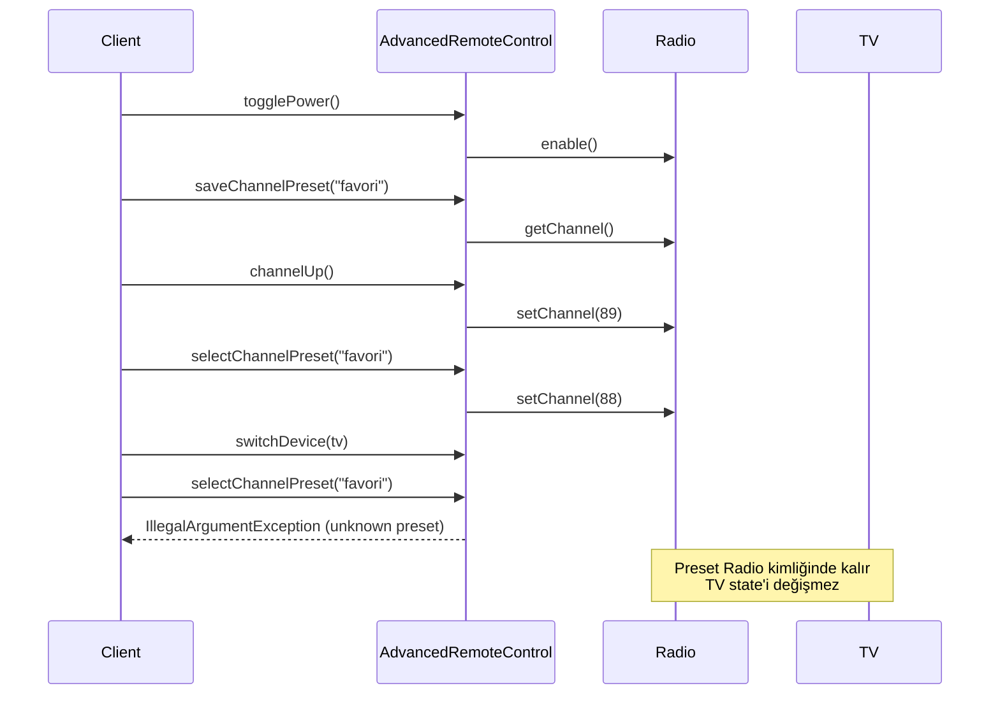

# Bridge Pattern — İki Değişim Eksenini Kompozisyonla Ayırmak

> TV ve Radio kodu temel köprüyü; preset workflow'u ise üst seviye davranışın implementor'dan bağımsız büyümesini gösterir.

## 30 saniyelik kart

| Soru | Kısa cevap |
|---|---|
| Niyet | Soyutlamayı, onu gerçekleştiren uygulamadan bağımsız geliştirmek |
| Değişen eksen | Kumanda çeşitleri ve cihaz/platform çeşitleri |
| Ana araç | Abstraction içinde Implementation referansı |
| Korunan şey | İki hiyerarşi diğerinin concrete tiplerini bilmez |
| Bedel | Daha çok tip, wiring ve doğru ortak kontrat ihtiyacı |
| Repo cümlesi | `RemoteControl`, `Device` köprüsüyle TV ve Radio'yu yönetir |

**Hafıza kancası:** Bridge iki kıyıyı birleştirir; kıyıları birbirine yapıştırmaz.

## Örnek haritası: temel → güçlendirilmiş → production

| Katman | Repodaki karşılığı | Öğrettiği şey |
|---|---|---|
| Temel örnek | `RemoteControl` + `Tv` / `Radio` | Abstraction'ın komutları `Device` implementor'ına delegate etmesi |
| Güçlendirilmiş örnek | `AdvancedRemoteControl` içindeki mute ve cihaz-kimliği kapsamlı kanal presetleri | Workflow'un refined abstraction'da bir kez yazılması; cihaz state'inin yanlış implementor'a taşınmaması |
| Bilinçli production sınırı | `Device` ortak paydası güç/ses/kanaldır | Cihaza özel capability, ağ I/O'su, authorization ve eşzamanlı device switch bu eğitim modelinin dışındadır |

## Akılda kalıcı analoji: evrensel kumanda

Evrensel kumandada “sesi artır” kullanıcı dilidir; TV ve Radio bu komutu farklı donanımda gerçekleştirir. Gelişmiş kumandada mute olabilir, yeni cihaz ailesi de sisteme eklenebilir.

Her kumanda × cihaz kombinasyonu için sınıf üretmek yerine araya ortak cihaz protokolü konur. Kumanda kullanıcı deneyimine, cihaz platform detayına göre gelişir.

Bridge'in özü tek delegation değildir; iki bağımsız değişim nedeninin çarpımını iki hiyerarşinin toplamına çevirmektir.

## Pattern olmadan problem

İki kumanda ve iki cihaz inheritance ile birleştirilirse:

`BasicTvRemote`, `AdvancedTvRemote`, `BasicRadioRemote` ve `AdvancedRadioRemote` gibi kombinasyon sınıfları oluşur.

Üç kumanda ve dört cihaz on iki kombinasyon ister. Sonuç:

- `volumeUp` benzeri kodlar tekrar eder.
- Cihaz detayı bütün kumanda sınıflarına yayılır.
- Yeni kumanda özelliği her cihaz için yeniden yazılır.
- Test matrisi çarpılarak büyür.

UI kontrolü × işletim sistemi renderer'ı, rapor × çıktı formatı ve mesaj × transport sağlayıcısı aynı iki-eksen kokusunu taşıyabilir.

## Çözüm ve çözümün sınırı

Bridge iki taraf kurar:

1. **Abstraction:** Client'ın kullandığı üst seviye dil.
2. **Implementation:** Platformun sağladığı temel yetenekler.

`RemoteControl` bir `Device` referansı taşır:

```java
public void volumeUp() {
    device.setVolume(device.getVolume() + 10);
}
```

`AdvancedRemoteControl` abstraction'ı genişletir:

```java
public void mute() {
    device.setVolume(0);
}

public void saveChannelPreset(String name) {
    presetsForCurrentDevice(true).put(name, device.getChannel());
}
```

`selectChannelPreset`, değeri yalnız kaydedildiği `Device` nesnesi tekrar bağlıyken
`Device#setChannel` üzerinden uygular. Preset map'i `IdentityHashMap` kullandığı için
iki ayrı `Tv` instance'ı bile iki ayrı state alanına sahiptir. Böylece workflow
`Tv` veya `Radio` concrete tiplerini bilmez; buna rağmen Radio frekansı yanlışlıkla
TV kanalı olarak taşınmaz.

Sınırlar:

- `Device` kontratında olmayan yetenek otomatik ortaklaşmaz.
- Aşırı geniş interface bütün implementor'ları zorlar.
- Çok dar interface abstraction'da type check doğurabilir.
- `switchDevice` faydalıdır fakat desenin zorunlu koşulu değildir.
- “Bağımsız büyüme” kararlaştırılmış köprü kontratının sınırları içindedir.

## Repodaki roller

| Pattern rolü | Tip | Sorumluluk |
|---|---|---|
| Client | `BridgePatternDemo` | Abstraction–implementation eşleşmelerini kurar |
| Abstraction | `RemoteControl` | Güç, ses ve kanal kullanım dilini sunar |
| Refined Abstraction | `AdvancedRemoteControl` | `mute`, preset kaydetme/seçme workflow'unu ekler |
| Implementation | `Device` | Ortak düşük seviye cihaz kontratı |
| Concrete Implementor | `Tv` | TV state ve sınırları |
| Concrete Implementor | `Radio` | Radio state ve sınırları |

Literatürdeki `BasicRemote` adı bu repoda ayrı sınıf değildir; karşılığı doğrudan `RemoteControl`dır.

## Mermaid yapı ve akış





## Kodun execution trace'i

### `RemoteControl + Tv`

1. TV kapalı, volume `30`, channel `1` başlar.
2. `togglePower` TV'yi açar.
3. `volumeUp` önce `30` okur, sonra `40` yazar.
4. `channelUp` kanalı `2` yapar.

### `AdvancedRemoteControl + Radio`

1. Radio kapalı, volume `20`, frequency `88` başlar.
2. Güç açılır ve ses `30` yapılır.
3. `"favori"` preset'i o andaki `88` değerini Radio kimliğine ait alanda saklar.
4. Frekans değiştirilip preset seçildiğinde ortak `setChannel` ile `88` geri yüklenir.
5. `mute`, ortak `Device#setVolume` üzerinden sesi `0` yapar.
6. `switchDevice(tv)` yalnız referansı değiştirir; Radio state'i ve preset'leri
   taşınmaz.
7. Sonraki komut TV üzerinde çalışır.

State implementation'a, kullanım dili abstraction'a aittir.

## Test kontratları neyi öğretiyor?

`BridgePatternDemoTest` dört `@Nested` hikâye kullanır.

### `BasicRemoteOperations`

- Güç, ses ve kanal yönetimini,
- iki toggle sonrası yalnız power değişimini,
- exact TV status çıktısını doğrular.

### `AdvancedRemoteOperations`

- `mute` davranışının Radio implementasyonunda da çalıştığını,
- preset workflow'unun concrete tipe bakmadan mevcut cihazda kanal kaydedip seçtiğini,
- Radio preset'inin TV'ye ve bir TV preset'inin başka TV instance'ına sızmadığını,
- boş ve bilinmeyen preset adlarının reddedildiğini,
- power ve channel state'inin korunmasını gösterir.

### `RuntimeDeviceSwitching`

- Sonraki komutların yeni implementation'a gittiğini,
- eski cihaz state'inin değişmeden kaldığını doğrular.

### `DeviceBoundaryContracts`

- Mevcut TV volume `0..100` clamp,
- TV channel minimum `1`,
- Radio frequency `80..108`,
- null implementor'ın constructor ve switch sınırında reddedilmesini görünür yapar.

Arrange graph'ı, Act abstraction çağrısını, Assert implementation state'ini göstererek köprüyü test dilinde de görünür kılar.

## Edge case, güvenlik, concurrency ve performans

### Null bağımlılık

Constructor ve `switchDevice`, null implementor'ı `Objects.requireNonNull` ile
komut çalışmadan reddeder. Bu fail-fast davranış hedefin nerede kaybolduğunu açık
tutar; gerçek sistemde bağlantısı kopmuş ama null olmayan cihaz için ayrıca
ulaşılabilirlik sonucu gerekir.

### Cihaz sınırları

TV ve Radio volume değerini `0..100` aralığına sıkıştırır. TV channel minimum `1`,
Radio frequency `80..108` uygular. Ancak aynı `int channel` alanının TV'de kanal,
Radio'da frekans anlamına gelmesi bilinçli bir eğitim sadeleştirmesidir. Bu nedenle
repo preset'leri `Device` kimliğine scope eder ve implementor'lar arasında taşımaz.
Gerçek domain yine de birim, adım ve capability'leri ayrı tiplerle modellemelidir.

### Güvenlik

Gerçek uzaktan kontrol; cihaz authorization, komut bütünlüğü, replay koruması ve hassas state loglama politikası ister. Bridge bunları sağlamaz, yalnız uygulanacak sınırı ayırır.

### Concurrency

`RemoteControl.device`, preset map'leri ve cihaz state'leri mutable ve senkronize
değildir. Bir thread cihaz değiştirirken diğeri komut verirse hedef belirsizleşebilir.
Identity map ayrıca bağlı cihazlara güçlü referans tuttuğu için uzun ömürlü
production kumandasında lifecycle/temizleme politikası gerekir. UI thread
confinement, lock veya actor/command queue politikası uygulama katmanında açıkça
seçilmelidir.

### Performans

Interface delegation maliyeti çoğu sistemde önemsizdir; gerçek maliyet I/O'dadır. Bridge mikro optimizasyon değil değişim izolasyonu kararıdır.

## Ne zaman kullan?

- İki bağımsız boyut kombinasyon halinde büyüyorsa.
- Platform ayrıntısını üst seviye iş dilinden ayırmak istiyorsan.
- Implementation runtime'da seçilecek/değiştirilecekse.
- Hiyerarşileri farklı ekip veya release döngüsü geliştirecekse.

## Ne zaman kullanma?

- Tek implementation var ve ikinci eksen beklenmiyorsa.
- Basit delegation için iki hiyerarşi okumayı zorlaştırıyorsa.
- İhtiyaç yalnız algoritma seçmekse Strategy daha açık olabilir.
- Amaç yalnız mevcut uyumsuz API'yi çevirmekse Adapter uygundur.

## Artılar ve bedeller

### Artılar

- Kombinasyon sınıfı patlamasını önler.
- Abstraction ve platform sorumluluklarını ayırır.
- Yeni cihaz/kumanda türlerini bağımsız genişletir.
- Fake Implementation ile test etmeyi kolaylaştırır.

### Bedeller

- Daha çok type ve wiring.
- Doğru ortak kontratı bulma zorluğu.
- Mutable köprü için lifecycle/concurrency kararı.
- Fazla genel interface'in “god interface” olma riski.

## Karışan desenlerle karşılaştırma

| Desen | Ana fark |
|---|---|
| Adapter | Var olan uyumsuz iki API'yi konuşturur |
| Strategy | Tek context'teki değiştirilebilir algoritmayı hedefler |
| Decorator | Aynı nesneye katman katman sorumluluk ekler |
| Facade | Alt sisteme sade tek yüz sunar |
| Proxy | Subject'e erişimi cache/security/lifecycle için yönetir |

Bridge çoğu zaman iki eksen baştan görülünce kurulur; Adapter mevcut uyumsuzluk ortaya çıkınca eklenebilir. Bu tarihsel ayrım zorunlu değil, faydalı sezgidir.

## Yaygın hatalar

1. `Device` içine concrete cihaza özel bütün metotları doldurmak.
2. Abstraction'da `instanceof Tv` dalları açmak.
3. State'i kumandaya kopyalayıp iki source of truth yaratmak.
4. Device switch sırasında state'in otomatik taşınacağını sanmak.
5. Bridge'i yalnız dependency injection'ın yeni adı saymak.
6. Null ve concurrency politikasını belirsiz bırakmak.

## Üç kademeli alıştırma

### Seviye 1 — Isınma

Gelişmiş kumandayla TV'yi aç, sesi iki kez artır, mute et ve exact state'i test et.

### Seviye 2 — Yeni implementor

`SmartSpeaker` adlı `Device` ekle. Kumandalara dokunmadan çalıştır; speaker için channel kontratının doğal olup olmadığını tartış.

### Seviye 3 — Capability tasarımı

`Device`ı `PowerControl`, `VolumeControl`, `ChannelControl` capability'lerine ayır. Kumandaların ihtiyaçlarını composition/generic seçenekleriyle modelle ve trade-off'u testlerle anlat.

## Son hafıza cümlesi

> **Bridge, iki değişim eksenini kalıtımla çarpmak yerine kompozisyonla bağlar.**
