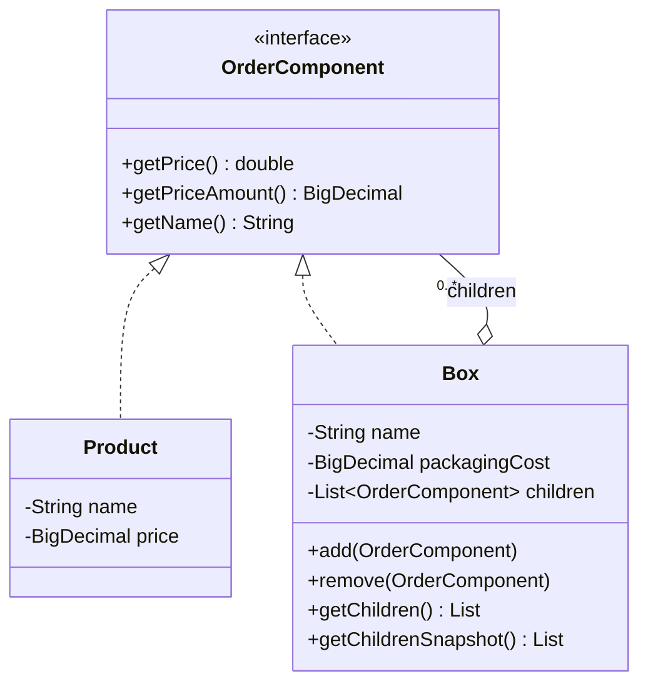
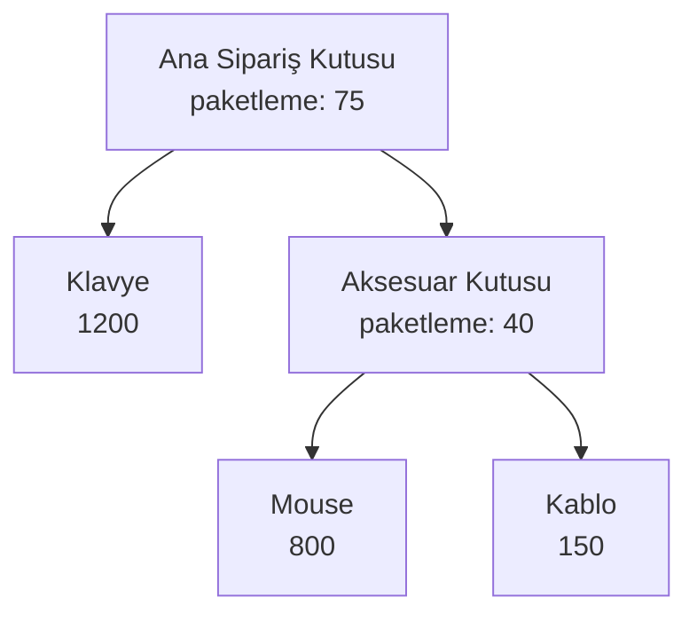

# Composite Pattern — Tek Bir Parça ile Bütün Ağacı Aynı Dilde Kullanmak

> Sipariş ağacı temel Composite'i korurken parasal doğruluk, açık snapshot API'si ve cycle invariant'larıyla gerçek kullanıma bir adım yaklaştırılmıştır.

## 30 saniyelik kart

| Soru | Kısa cevap |
|---|---|
| Niyet | Tek nesne ile nesne grubunu ortak bir kontrattan kullanmak |
| Değişen eksen | Ağacın derinliği ve leaf/composite çeşitleri |
| Ana araç | Ortak Component, polimorfizm ve özyinelemeli delegasyon |
| Korunan şey | Client düğümün Product mı Box mı olduğunu bilmez |
| Bedel | Ağaç bütünlüğü, cycle, sahiplik ve ortak API kararları |
| Repo cümlesi | `getPriceAmount()` hem üründe hem iç içe kutuda exact para toplamıdır |

**Hafıza kancası:** Composite, “bir yaprağa ne soruyorsan dala da onu sor” der.

## Örnek haritası: temel → güçlendirilmiş → production

| Katman | Repodaki karşılığı | Öğrettiği şey |
|---|---|---|
| Temel örnek | `OrderComponent`, `Product`, `Box` | Leaf ve Composite'e aynı `getPrice()` / `getName()` sorusunu sormak |
| Güçlendirilmiş örnek | `BigDecimal getPriceAmount()`, cycle kontrolü, `getChildrenSnapshot()` | Parasal toplamı exact tutmak, invariant'ları korumak ve eski canlı görünümden açık snapshot'ı ayırmak |
| Bilinçli production sınırı | Çoklu parent ve aynı child'ın tekrarı hâlâ domain kararıdır | Ownership, kalıcılık, maksimum derinlik ve eşzamanlı mutation uygulamaya göre ayrıca çözülür |

## Akılda kalıcı analoji: klasör ve dosya

Dosyanın boyutu kendi boyutudur. Klasörün boyutuysa içindeki dosya ve alt klasörlerin toplamıdır.

Kullanıcı iki durumda da “boyut nedir?” diye sorar. Klasör, soruyu çocuklarına iletir ve cevapları toplar. Composite'in gücü, istemcinin ağacı açıp her concrete tipe göre dallanmak zorunda kalmamasıdır.

Bu repoda dosyanın karşılığı `Product`, klasörün karşılığı `Box`, ortak soruysa `getPrice()`dır.

## Pattern olmadan problem

Bir siparişte ürünler, kutular ve kutu içinde kutular olabilir. Ortak kontrat yoksa client şuna dönüşür:

```java
if (item instanceof Product product) {
    total += product.getPrice();
} else if (item instanceof Box box) {
    for (Object child : box.getItems()) {
        // aynı ayrım her seviyede tekrar
    }
}
```

Sorunlar:

- Client bütün concrete tipleri bilir.
- Her yeni düğüm tipi yeni `instanceof` dalları üretir.
- Recursion farklı yerlerde kopyalanır.
- Paketleme maliyetinin hangi seviyede eklendiği belirsizleşir.
- Aynı ağaç üzerinde yeni operasyonlar yazmak zorlaşır.

Doğal ağaç örnekleri yalnız dosya sistemi değildir: organizasyon şeması, UI component ağacı, menü, yorum zinciri, ürün paketi ve ifade ağacı da aynı probleme sahiptir.

## Çözüm ve çözümün sınırı

Tüm düğümler ortak `OrderComponent` arayüzünü uygular:

```java
public interface OrderComponent {
    double getPrice();
    default BigDecimal getPriceAmount() { ... }
    String getName();
}
```

`Product` bir **Leaf**tir; alt elemanı yoktur ve kendi fiyatını döndürür.

`Box` bir **Composite**tir; `List<OrderComponent>` tutar:

```java
public BigDecimal getPriceAmount() {
    BigDecimal total = packagingCost;
    for (OrderComponent child : children) {
        total = total.add(child.getPriceAmount());
    }
    return total;
}
```

Bir child başka `Box` ise aynı çağrı tekrar çalışır. Recursion, explicit type kontrolünden değil polimorfik delegasyondan doğar.

Bu çözümün sınırı:

- Ortak operasyonlar uniformdur; çocuk yönetimi uniform değildir.
- `add/remove` yalnız `Box` üzerindedir. Bu, “safe composite” yaklaşımıdır.
- Ortak interface'e `add/remove` koymak daha şeffaf ama Leaf için anlamsız olabilir.
- `Box.add`, self-cycle ve dolaylı ancestor cycle'ını reddeder.
- Aynı child'ın tekrar eklenmesi veya iki parent tarafından paylaşılması özellikle
  yasaklanmamıştır; bunun ağaç mı DAG mı olduğu domain kararıdır.

## Repodaki roller

Çalıştırılabilir örnek `com.can.demo.structural.composite.CompositePatternDemo`
FQCN'indedir. Sınıf, örnek sipariş ağacını kuran ve kök operasyona çağrı yapan
**composition root / example driver**'dır; `Component`, `Leaf` veya `Composite`
rollerinden biri değildir. Ağaç modeli `com.can.structural.composite` paketinde
sunum kodundan bağımsız kalır.

| Pattern rolü | Tip | Sorumluluk |
|---|---|---|
| Composition root / example driver | `com.can.demo.structural.composite.CompositePatternDemo` | Örnek ağacı kurup client çağrısını görünür kılar |
| Component | `OrderComponent` | Geriye uyumlu `getPrice()`, exact `getPriceAmount()` ve `getName()` kontratı |
| Leaf | `Product` | `BigDecimal` fiyatını ve adını döndürür |
| Composite | `Box` | Çocukları yönetir, exact fiyatları ve packaging cost'u toplar |

Geriye uyumluluk için `getChildren()` dışarıdan değiştirilemeyen **canlı görünüm**
vermeye devam eder; `Box` değişince daha önce alınan görünüm de yeni içeriği gösterir.
Zamanda sabit bir sonuç isteyen client açıkça `getChildrenSnapshot()` çağırır; bu
metot `List.copyOf` ile değiştirilemeyen ve sonraki mutation'lardan etkilenmeyen
bir kopya verir.

## Yapı diyagramı



Demo nesne ağacı:



## Kodun execution trace'i

`mainOrderBox.getPriceAmount()` çağrısında:

1. Ana kutu total'i kendi `75` paketleme maliyetiyle başlatır.
2. Klavye `1200` döndürür; ara toplam `1275` olur.
3. Aksesuar kutusuna aynı `getPriceAmount()` çağrısı yapılır.
4. Aksesuar kutusu `40 + 800 + 150 = 990` döndürür.
5. Kök kutu `1275 + 990 = 2265` sonucuna ulaşır.

Client tek bir kök çağrısı yapar. Ağacın dolaşım bilgisi Composite içinde kalır.

## Test kontratları neyi öğretiyor?

`CompositePatternDemoTest` dört `@Nested` hikâyeden oluşur.

### `LeafAndEmptyComposite`

- `Product` değerlerini Component kontratından sunar.
- Çocuksuz `Box` yalnız kendi packaging cost'unu döndürür.

### `RecursivePriceAggregation`

- Product ve Box düğümlerinin iç içe toplamını exact değerle doğrular.
- Her kutu maliyetinin yalnız kendi seviyesinde bir kez eklendiğini gösterir.

### `ChildManagement`

- Child çıkarılınca toplamın yeniden hesaplandığını gösterir.
- `getChildren()` canlı görünümünün dışarıdan değiştirilemediğini ve eski semantiği
  koruduğunu,
- `getChildrenSnapshot()` sonucunun sonraki `Box` mutation'larından etkilenmediğini
  doğrular.

### `ProductionInvariants`

- `0.10 + 0.20` parasal toplamının `BigDecimal("0.30")` olduğunu,
- doğrudan ve dolaylı cycle'ın yazma anında reddedildiğini,
- negatif maliyet, boş ad ve null child'ın graph'a giremediğini sabitler.

Arrange–Act–Assert ayrımı, ağacı kurma ile kökten operasyon istemeyi birbirinden görünür biçimde ayırır.

## Edge case, güvenlik, concurrency ve performans

### Tree bütünlüğü

`Box.add` null child'ı, self-cycle'ı ve child ağacının zaten parent'ı içerdiği
dolaylı cycle'ı reddeder. Böylece repo API'siyle oluşturulan graph'ta
`getPriceAmount()` sonsuz recursion'a girmez.

İki karar bilerek açık bırakılmıştır:

- Aynı child aynı parent'a iki kez eklenirse iki adet/iki satır gibi sayılır.
- Aynı nesne iki farklı parent altında paylaşılabilir ve iki toplamda da yer alır.

Gerçek siparişte quantity ayrı alan mı olacak, node tek parent mı taşıyacak sorusu
domain uzmanıyla kararlaştırılmalı; pattern kendi başına cevap vermez.

### Para doğruluğu

`Product` ve `Box` parayı `BigDecimal` saklar; recursive toplam da
`getPriceAmount()` üzerinden exact ilerler. Eski öğrenme API'sini bozmamak için
`double getPrice()` korunur ve yalnız uyumluluk görünümüdür. Para hesabı yapan yeni
kod exact metodu kullanmalıdır.

Negatif maliyet ve boş ad constructor sınırında reddedilir. Production'da para
birimi, scale ve rounding policy için `Money(amount, currency)` gibi daha zengin
bir value object tercih edilmelidir.

### Null ve güvenlik

Null child ve blank isim graph kurulurken reddedilir. Buna rağmen kullanıcıdan
gelen sınırsız derinlikte ağaç, stack ve CPU tüketimiyle denial-of-service riski
oluşturabilir; maksimum depth/node sayısı bu küçük modelde yoktur.

### Concurrency

`ArrayList` thread-safe değildir. Bir thread fiyat hesaplarken diğeri child ekler/çıkarırsa tutarsız sonuç veya `ConcurrentModificationException` oluşabilir. Immutable tree, snapshot veya kilit politikası seçilmelidir.

### Performans

Her `getPrice()` çağrısı erişilen düğüm sayısı kadar, yaklaşık `O(n)` çalışır. Çok derin ağaç stack'i tüketir. Cache eklenecekse her mutation'da invalidation zorunludur; aksi halde hızlı ama yanlış sonuç alınır.

## Ne zaman kullan?

- Model doğal olarak parent–child ağacıysa.
- Leaf ve composite aynı operasyonlarla kullanılacaksa.
- Client recursive yapının concrete tiplerini bilmemeliyse.
- UI, dosya, organizasyon, paket veya ifade ağacı modelleniyorsa.

## Ne zaman kullanma?

- Yapı aslında düz bir koleksiyonsa.
- Leaf ve grup neredeyse hiç ortak davranış paylaşmıyorsa.
- Ağ üzerinde güçlü ilişki sorguları gerekiyorsa graph modeli daha uygun olabilir.
- Cycle ve çoklu parent temel domain davranışıysa “tree” varsayımı yanıltıcı olabilir.

## Artılar ve bedeller

### Artılar

- Tek nesne ve nesne grubuna uniform erişim.
- Client'ta type-check zincirlerini kaldırma.
- Yeni Leaf/Composite türlerini kolay ekleme.
- Recursive davranışı verinin doğal yapısına yakın tutma.

### Bedeller

- Çok genel Component kontratı anlamsız metotlara yol açabilir.
- Cycle, ownership ve mutation politikası ayrıca gerekir.
- Derin recursion ve tekrar hesaplama maliyetlidir.
- Ağaç debug etmek düz koleksiyondan daha zordur.

## Karışan desenlerle karşılaştırma

| Desen | Composite'ten farkı |
|---|---|
| Decorator | Genellikle tek child sarar ve davranış ekler; Composite çok child ile ağaç kurar |
| Iterator | Ağacın dolaşım yöntemini dışarı çıkarır; Composite yapıyı kurar |
| Visitor | Yeni operasyonları düğümleri değiştirmeden ekler |
| Chain of Responsibility | Bir istek zincirde ilerler; bütün çocuk sonuçları toplanmak zorunda değildir |
| Facade | Alt sistemi sadeleştirir, recursive parça-bütün hiyerarşisi kurmaz |

Composite ve Decorator benzer arayüzlerle sarma yapabilir. Ayırıcı soru şudur: **Amaç parça-bütün ağacı mı, davranış katmanı mı?**

## Yaygın hatalar

1. Cycle kontrolü olmadan her düğümü her yere eklemek.
2. Para için kontrolsüz `double` kullanmak.
3. Leaf'e anlamsız child metotları zorlamak.
4. `getChildren()` görünümünü mutable sızdırmak veya canlı görünüm ile snapshot'ı
   isimlendirmeden birbirine karıştırmak.
5. Çok derin kullanıcı girdisini sınırsız recursive işlemek.
6. Aynı node'un çoklu parent semantiğini belirsiz bırakmak.

## Üç kademeli alıştırma

### Seviye 1 — Isınma

Üç katmanlı bir kutu ağacı kur. Her seviyeye farklı packaging cost ver ve toplamı önce elle, sonra testle hesapla.

### Seviye 2 — Yeni operasyon

`getItemCount()` davranışını Product için `1`, Box için çocuk toplamı olacak biçimde ekle. Component interface'inin neden değiştiğini tartış.

### Seviye 3 — Production invariant

Mevcut DFS cycle kontrolünü genişlet: aynı child'ın iki parent altında bulunup
bulunamayacağını domain kararı yap. Tek sahiplik seçersen parent bilgisini veya
ayrı bir aggregate builder'ı ekle ve duplicate/multi-parent testlerini yaz.

## Son hafıza cümlesi

> **Composite, yaprakla dalı aynı cümlede konuşturur; dal cevabı çocuklarından toplar.**
