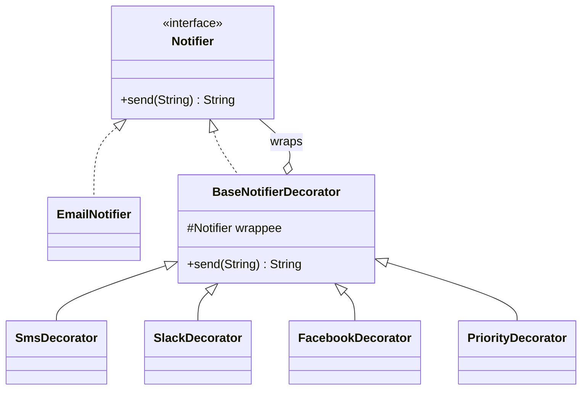
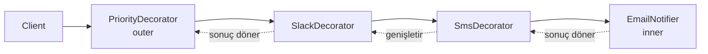

# Decorator Pattern — Davranışı Katman Katman Giydirmek

> Bu örnek gerçek kanal entegrasyonu yapmaz; gönderimleri açıklayıcı String çıktılarıyla simüle eder.

## 30 saniyelik kart

| Soru | Kısa cevap |
|---|---|
| Niyet | Bir nesneye aynı arayüzü koruyarak çalışma anında sorumluluk eklemek |
| Değişen eksen | Bildirim kanalı kombinasyonu ve katman sırası |
| Ana araç | Component'i yine Component olan bir nesneyle sarmak |
| Korunan şey | Client yalnız `Notifier` kontratını görür |
| Bedel | Nesne zinciri, sıra/failure semantiği ve wiring karmaşıklığı |
| Repo cümlesi | Email çıktısı SMS/Slack ile genişler, `PriorityDecorator` mesajı bütün iç kanallardan önce dönüştürür |

**Hafıza kancası:** Decorator nesneyi değiştirmez; üzerine çıkarılabilir görünen davranış katmanları giydirir.

## Örnek haritası: temel → güçlendirilmiş → production

| Katman | Repodaki karşılığı | Öğrettiği şey |
|---|---|---|
| Temel örnek | `EmailNotifier` + `SmsDecorator` / `SlackDecorator` / `FacebookDecorator` | Aynı `Notifier` kontratıyla çıktıyı içten dışa genişletmek |
| Güçlendirilmiş örnek | En dıştaki `PriorityDecorator` | Decorator'ın yalnız sonuç eklemekle kalmayıp isteği bütün iç katmanlara gitmeden dönüştürebilmesi |
| Bilinçli production sınırı | `String` sonuçlu, side-effect'siz kanal simülasyonu | Retry, idempotency, kısmi başarı, PII masking ve gerçek SDK lifecycle'ı ayrıca tasarlanır |

## Akılda kalıcı analoji: kat kat giyinmek

Bir tişörtün üzerine kazak, onun üzerine yağmurluk giyebilirsin.

- Altta hâlâ aynı kişisin.
- Her katman ayrı bir özellik ekler.
- Katmanların sırası sonucu etkileyebilir.
- Her kombinasyon için yeni bir “insan türü” oluşturmazsın.

Decorator da tek bir component'i başka component'lerle sarar. Kalıtımdaki her kombinasyon için subclass üretme problemini, küçük ve birleştirilebilir nesnelere dönüştürür.

Bu analojinin sınırı: repodaki wrapper alanları `final`dır. Kurulmuş bir stack'ten ortadaki katmanı gerçekten “çıkaran” API yoktur; yeni bir stack kurulur.

## Pattern olmadan problem

Başlangıçta yalnız Email bildirimi vardır. Sonra SMS, Slack ve Facebook gelir.

Kalıtımla kombinasyon çözülürse:

```text
EmailNotifier
EmailSmsNotifier
EmailSlackNotifier
EmailSmsSlackNotifier
EmailFacebookNotifier
...
```

Her yeni kanal kombinasyon sayısını büyütür. Ayrıca:

- Aynı kanal kodu birçok subclass'ta tekrar eder.
- Sıra değişimi yeni sınıf gerektirir.
- Client concrete kombinasyon adlarını bilir.
- Bir özelliğin bağımsız testi zorlaşır.

Tek sınıftaki `smsEnabled/slackEnabled/facebookEnabled` bayraklarıysa bütün kanal bağımlılıklarını ve hata politikalarını aynı yerde toplar.

## Çözüm ve çözümün sınırı

Önce ortak Component tanımlanır:

```java
public interface Notifier {
    String send(String message);
}
```

`EmailNotifier` temel davranıştır. `BaseNotifierDecorator` aynı interface'i uygular ve başka bir `Notifier` tutar:

```java
public abstract class BaseNotifierDecorator implements Notifier {
    protected final Notifier wrappee;

    public String send(String message) {
        return wrappee.send(message);
    }
}
```

Concrete decorator önce iç katmana delege eder, sonra kendi sonucunu ekler:

```java
return super.send(message)
    + System.lineSeparator()
    + "Slack -> " + channel + " | mesaj=" + message;
```

Bu yüzden:

```text
new SlackDecorator(new SmsDecorator(new EmailNotifier(...), ...), ...)
```

çıktıyı `Email → SMS → Slack` sırasıyla üretir.

`PriorityDecorator` ise farklı bir decorator tekniğini gösterir: mesajı önce
`"[P1] ..."` biçimine dönüştürür, sonra wrappee'ye yollar. En dışa konduğunda Email,
SMS ve Slack'in tamamı aynı zenginleştirilmiş mesajı görür. İçeri konursa yalnız
ondan daha içteki katmanlar prefix'i görür; dolayısıyla sıra yalnız çıktı sırası
değil **girdi semantiği** açısından da kontrattır.

Sınırlar:

- Decorator her kombinasyon için subclass ihtiyacını kaldırır; bütün subclass ihtiyacını değil.
- Aynı interface korunur ama identity/type kontrolü karmaşıklaşır.
- Failure ve transaction davranışı otomatik çözülmez.
- Katman sırası observable ise artık kontratın parçasıdır.

## Repodaki roller

Çalıştırılabilir örnek `com.can.demo.structural.decorator.DecoratorPatternDemo`
FQCN'indedir. Bu sınıf dekoratör zincirlerinin sırasını seçen **composition root /
example driver**'dır; `Notifier` hiyerarşisinin bir üyesi değildir. Component ve
Decorator tipleri `com.can.structural.decorator` paketinde sunum/CLI ayrıntısından
bağımsız kalır.

| Pattern rolü | Tip | Sorumluluk |
|---|---|---|
| Composition root / example driver | `com.can.demo.structural.decorator.DecoratorPatternDemo` | İstenen stack'leri kurar ve örnek client çağrısını sürer |
| Component | `Notifier` | Bütün bildirimlerin `send` kontratı |
| Concrete Component | `EmailNotifier` | Temel Email çıktısını üretir |
| Base Decorator | `BaseNotifierDecorator` | Aynı kontratı korur ve wrappee'ye delege eder |
| Concrete Decorator | `SmsDecorator` | SMS satırı ekler |
| Concrete Decorator | `SlackDecorator` | Slack satırı ekler |
| Concrete Decorator | `FacebookDecorator` | Facebook satırı ekler |
| Transforming Decorator | `PriorityDecorator` | Mesajı inner stack'e göndermeden önce priority prefix'iyle zenginleştirir |

`EmailNotifier`, constructor'a verilen recipient listesini doğrulayıp
`Stream#toList` ile immutable bir kopyaya dönüştürür. Böylece client daha sonra
özgün listeyi değiştirse de notifier'ın iç state'i değişmez. `Notifier.requireText`
mesaj ve hedeflerin blank olmasını tek kuralla engeller.

## Yapı diyagramı



İlk demo stack'inin gerçek yönü:



## Kodun execution trace'i

`notifier.send("Alarm")` çağrısında:

1. En dıştaki `PriorityDecorator`, mesajı `"[P1] Alarm"` yapar.
2. Priority, `SlackDecorator.send` çağrısına delege eder.
3. Slack önce `super.send` ile `SmsDecorator`a gider.
4. SMS önce `EmailNotifier`a gider.
5. Email temel satırı döndürür.
6. SMS kendi satırını sonuna ekler.
7. Slack kendi satırını en sona ekler.
8. Priority değiştirilmiş stack sonucunu client'a döndürür.

Gerçek side-effect kullanan production notifier'da da içten dışa çağrı sırası aynı olabilir. İç katman exception atarsa mevcut tasarımda dış katman çalışmaz. “Bir kanal başarısız olsa da diğerleri devam etsin” isteniyorsa açık bir orchestration/failure policy gerekir.

## Test kontratları neyi öğretiyor?

`DecoratorPatternDemoTest` üç ana `@Nested` hikâye kullanır.

### `BaseNotification`

- Email çıktısını exact metinle doğrular.
- Recipient listesinin savunmacı kopyalandığını gösterir.

### `DecoratorStack`

- Email, SMS ve Slack satırlarının exact içten-dışa sırasını sınar.
- Aynı `Notifier` kontratıyla Email + Facebook alternatifini doğrular.
- Dıştaki `PriorityDecorator`ın hem Email hem Slack'e aynı prefixed mesajı taşıdığını gösterir.
- `contains` yerine exact assertion kullanarak eksik, fazla veya yinelenen satırı yakalar.

### `NotificationBoundaries`

- Null wrappee,
- boş kanal/recipient koleksiyonu,
- blank mesaj gibi graph ve çağrı hatalarının zincirin başında reddedildiğini doğrular.

Arrange kısmında graph kurulur, Act yalnız tek `send` çağrısıdır, Assert ise bütün stack'in observable kontratını kontrol eder.

## Edge case, güvenlik, concurrency ve performans

### Null ve input kontratı

`BaseNotifierDecorator` null wrappee'yi reddeder. Email en az bir geçerli recipient,
concrete decorator'lar geçerli hedef, bütün katmanlar blank olmayan mesaj ister.
Metinler trim edilir; priority upper-case dönüşümü locale sürprizi yaşamamak için
`Locale.ROOT` kullanır. Buna rağmen email/telefon formatı yalnız non-blank
seviyesinde doğrulanır; gerçek syntax ve sahiplik doğrulaması adapter/kanal sınırına
aittir.

### Güvenlik ve gizlilik

Email adresi, telefon ve mesaj içeriğini düz log metnine yazmak PII veya secret sızdırabilir. Gerçek entegrasyonda masking, structured logging, erişim kontrolü ve retention politikası gerekir.

### Failure semantiği

Bir kanal hata verdiğinde devam, yalnız başarısız kanalı retry, duplicate gönderim ve kısmi başarı modeli açıkça kararlaştırılmalıdır. Decorator bu kararları tek başına çözmez.

### Concurrency

Mevcut decorator nesneleri yalnız immutable String alanları okur ve state değiştirmez; bu örnekte paylaşım basittir. Gerçek SDK/client thread-safe değilse wrapper onu kendiliğinden güvenli yapmaz.

### Performans

Her katman yeni String birleştirir; kısa demo için önemsizdir. Büyük payload ve çok katmanda allocation artar. Gerçek network kanallarında ana maliyet delegasyon değil I/O ve retry'dır.

## Ne zaman kullan?

- Davranış kombinasyonları çalışma anında değişiyorsa.
- Her kombinasyon için subclass açmak patlamaya yol açıyorsa.
- Sorumlulukları küçük, tek amaçlı katmanlara ayırmak istiyorsan.
- Logging, compression, encryption veya bildirim kanalı gibi zincirlenebilir işler varsa.

## Ne zaman kullanma?

- Katman sırası ve graph kurulumu iş kuralını anlaşılmaz yapıyorsa.
- Bütün kombinasyonlar sabit ve çok azsa basit composition yeterli olabilir.
- Concrete component tipine sık sık erişmek gerekiyorsa.
- Birden çok bağımsız side-effect için orchestration sonucu/transaction modeli gerekiyorsa.

## Artılar ve bedeller

### Artılar

- Her kombinasyon için subclass ihtiyacını kaldırır.
- Sorumluluklar bağımsız test edilir.
- Client aynı interface'i kullanır.
- SRP ve Open/Closed yönünde genişlemeyi destekler.

### Bedeller

- Çok sayıda küçük nesne ve wiring oluşur.
- Katman sırası ve exception davranışı kritikleşir.
- Ortadaki katmanı bulmak/çıkarmak kolay değildir.
- Aynı decorator'ın yanlışlıkla iki kez eklenmesi mümkün olabilir.

## Karışan desenlerle karşılaştırma

| Desen | Decorator'dan farkı |
|---|---|
| Adapter | Arayüzü çevirir; davranış katmanı eklemek ana niyet değildir |
| Proxy | Aynı arayüzle erişim, cache, security veya lifecycle kontrol eder |
| Composite | Çok child ile parça-bütün ağacı kurar |
| Chain of Responsibility | İstek bir sonraki handler'a geçebilir veya durabilir; hepsi aynı component'i sarmak zorunda değildir |
| Facade | Alt sisteme daha sade, çoğu zaman farklı bir yüz sunar |

Proxy ile Decorator'ın sınıf diyagramı çok benzeyebilir. Ayırıcı soru: **Nesneye sorumluluk mu ekliyorum, erişimi mi yönetiyorum?**

## Yaygın hatalar

1. Her decorator'da wrappee çağrısını unutmak veya iki kez çağırmak.
2. Katman sırasını önemsiz sanmak.
3. “Runtime” kelimesini mevcut graph'ın yerinde sökülüp takılması sanmak.
4. Hata alan bir kanalın diğer kanallara etkisini tanımlamamak.
5. Concrete decorator tiplerine client'ı bağımlı etmek.
6. PII içeriğini kontrolsüz loglamak.

## Üç kademeli alıştırma

### Seviye 1 — Isınma

Email → Facebook → Slack stack'i kur. Exact çıktı sırasını test et ve constructor nesting sırasıyla çıktı sırası arasındaki ilişkiyi açıkla.

### Seviye 2 — Yeni decorator

Mesajın başına timestamp ekleyen `TimestampDecorator` yaz. Zamanı test edebilmek için `Clock` bağımlılığı kullan.

### Seviye 3 — Production failure modeli

String yerine kanal bazlı başarı/hata taşıyan immutable `NotificationResult` tasarla. Bir kanal hata verdiğinde devam etme ve retry politikasını test doubles ile doğrula.

## Son hafıza cümlesi

> **Decorator, aynı arayüzü koruyup davranışı iç içe katmanlarla büyütür; kombinasyonu sınıfa değil nesne grafiğine taşır.**
