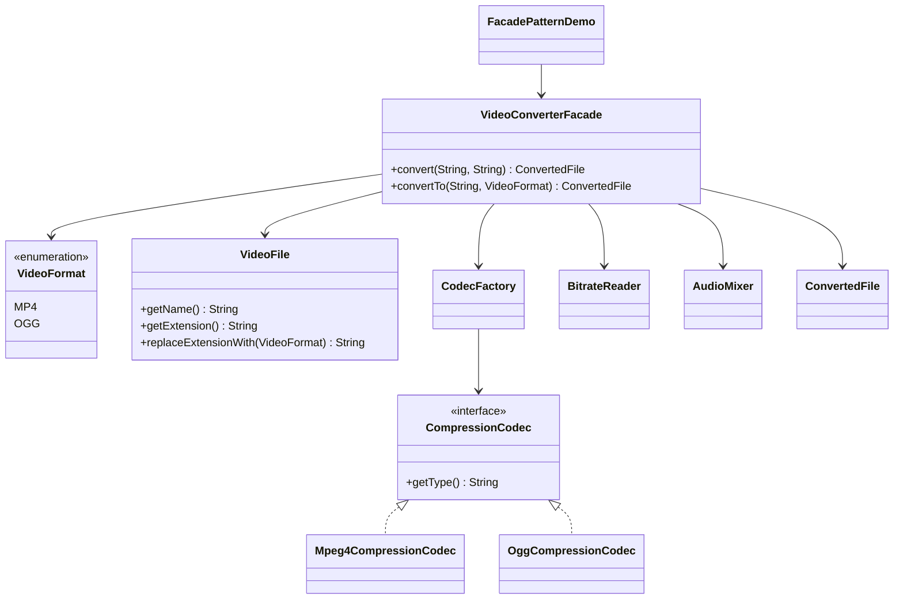
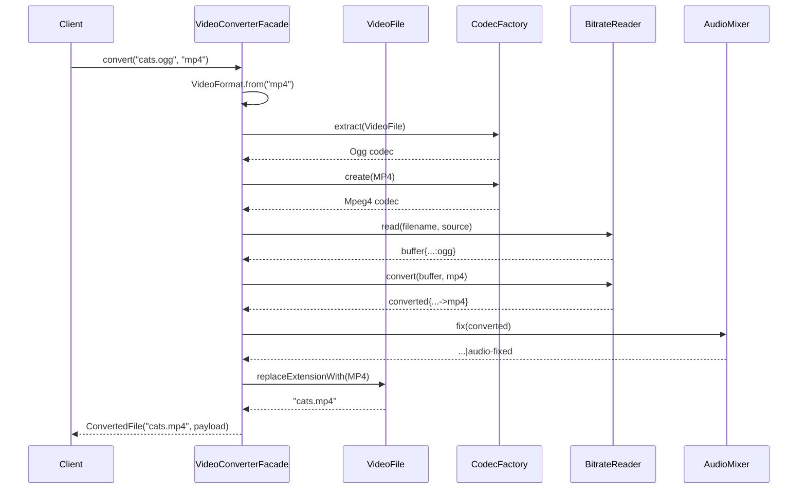

# Facade Pattern — Karmaşık Alt Sisteme Tek ve Sade Bir Kapı

> Bu örnek gerçek medya dosyası okumaz veya codec çalıştırmaz. Dönüşüm hattını String değerleriyle görünür yapan bir eğitim simülasyonudur.

## 30 saniyelik kart

| Soru | Kısa cevap |
|---|---|
| Niyet | Karmaşık alt sisteme sık kullanılan işler için sade bir üst seviye API sunmak |
| Değişen eksen | Alt sistem sınıfları, çağrı sırası ve entegrasyon ayrıntıları |
| Ana araç | Akışı tek bir giriş noktasında orkestre etmek |
| Korunan şey | Client alt sistemin kurulum ve sıra detaylarını bilmez |
| Bedel | Facade alt sisteme bağlanır; büyürse god object olabilir |
| Repo cümlesi | Client yalnız `converter.convert(file, format)` çağırır |

**Hafıza kancası:** Facade binayı küçültmez; ziyaretçinin doğru kapıdan girmesini sağlar.

## Örnek haritası: temel → güçlendirilmiş → production

| Katman | Repodaki karşılığı | Öğrettiği şey |
|---|---|---|
| Temel örnek | `VideoConverterFacade#convert(String, String)` | Kaynak analizi, codec seçimi, dönüşüm, audio ve adlandırmayı tek use-case kapısında toplamak |
| Güçlendirilmiş örnek | `VideoFormat`, `convertTo` typed operasyonu, explicit format hatası ve constructor-injected `CodecFactory` / `AudioMixer` | Sessiz fallback yerine açık input kontratı ve test edilebilir orchestration |
| Bilinçli production sınırı | `BitrateReader` ve codec'ler String simülasyonudur | Dosya güvenliği, MIME sniffing, streaming, resource kapatma, cancellation ve job yönetimi bu örneğin dışındadır |

## Akılda kalıcı analoji: otel resepsiyonu

Bir otelde temizlik, teknik servis, mutfak ve rezervasyon ekipleri vardır. Misafir her departmanın dahili numarasını ve işlem sırasını bilmek yerine resepsiyona isteğini söyler.

Resepsiyon:

- doğru birimleri bulur,
- gerekli sırayı koordine eder,
- sonucu misafirin anlayacağı biçimde sunar.

Departmanlar ortadan kalkmaz ve isterlerse doğrudan da kullanılabilir. Facade da alt sistemi yasaklamaz; yaygın senaryo için daha güvenli ve kolay bir yol sunar.

## Pattern olmadan problem

Client video dönüştürmek için şunları bilmek zorunda kalsaydı:

1. Dosyayı `VideoFile` olarak çözümle.
2. `CodecFactory` ile kaynak codec'i bul.
3. Hedef codec'i doğru koşulla seç.
4. `BitrateReader.read` çağır.
5. Buffer'ı `BitrateReader.convert` ile dönüştür.
6. `AudioMixer.fix` ile ses adımını uygula.
7. `VideoFile` üzerinden yeni çıktı adını üret.
8. Sonucu `ConvertedFile` içine koy.

Bu akış controller, CLI ve batch job içinde kopyalanırsa:

- sıra hataları oluşur,
- client bütün concrete codec tiplerine bağlanır,
- alt sistem değişikliği birçok yere yayılır,
- testler aynı setup'ı tekrarlar.

## Çözüm ve çözümün sınırı

`VideoConverterFacade` bu kullanım senaryosunu tek metotta toplar:

```java
ConvertedFile converted = converter.convert("funny-cats-video.ogg", "mp4");
```

Facade içeride:

```java
VideoFormat destinationFormat = Objects.requireNonNull(format);
VideoFile file = new VideoFile(filename);
CompressionCodec source = codecFactory.extract(file);
CompressionCodec destination = codecFactory.create(destinationFormat);
String buffer = BitrateReader.read(file.getName(), source);
String converted = BitrateReader.convert(buffer, destination);
String mixed = audioMixer.fix(converted);
String outputName = file.replaceExtensionWith(destinationFormat);
```

Eski imzayı koruyan String operasyonu, değeri önce açık enum'a çevirir:

```java
public ConvertedFile convert(String filename, String format) {
    return convertTo(filename, VideoFormat.from(format));
}
```

`avi`, `webm`, null veya blank değer artık OGG'ye sessizce düşmez; facade sınırından
anlamlı `IllegalArgumentException` çıkar.

Bu bir **imza uyumluluğu**, tam davranış uyumluluğu değildir: önceki eğitim kodu
`"mp4"` dışındaki her değeri — null ve yazım hataları dahil — OGG kabul ediyordu.
Yeni sürüm bu girdileri bilerek reddeder; böyle bir API gerçek tüketicilere
yayınlanmış olsaydı migration/release notu gerekirdi. Enum alan operasyonun adı
`convertTo(String, VideoFormat)` seçilmiştir. Aynı `convert` adı kullanılsaydı eski
`convert("clip.mp4", null)` kaynak çağrısı iki reference overload arasında
derleme zamanında belirsizleşirdi.

Bu tasarım coupling'i yok etmez. Client coupling'ini azaltır ve alt sistem coupling'ini Facade sınırında toplar.

Facade'ın sınırı:

- Alt sistemin her özelliğini sunmak zorunda değildir.
- Advanced client alt sistemi doğrudan kullanabilir.
- Domain validation ve security otomatik gelmez.
- Her yeni use case aynı sınıfa eklenirse Facade god object'e dönüşebilir.
- Facade, alt sistem sınıflarının replacement'ı değil orkestratörüdür.

## Repodaki roller

| Pattern rolü | Tip | Sorumluluk |
|---|---|---|
| Client | `FacadePatternDemo` | Tek `convert` çağrısıyla sonucu ister |
| Facade | `VideoConverterFacade` | Kaynak analizi, codec seçimi, dönüşüm, audio ve adlandırmayı koordine eder |
| Input vocabulary | `VideoFormat` | Desteklenen MP4/OGG kümesini ve normalize etmeyi açık tipte tutar |
| Subsystem | `VideoFile` | Dosya segmentinden kaynak uzantısını çıkarır ve hedef formatlı çıktı adını üretir |
| Subsystem | `CodecFactory` | Kaynak uzantısına codec seçer |
| Subsystem contract | `CompressionCodec` | Codec type bilgisini sunar |
| Concrete subsystem | `Mpeg4CompressionCodec`, `OggCompressionCodec` | MP4/OGG türlerini temsil eder |
| Subsystem | `BitrateReader` | Okuma ve dönüştürmeyi String ile simüle eder |
| Subsystem | `AudioMixer` | Audio-fix adımını String'e ekler |
| Result DTO | `ConvertedFile` | Çıktı adı ve payload'ı taşır |

## Yapı diyagramı



Akış:



## Kodun execution trace'i

`convert("funny-cats-video.ogg", "mp4")` için:

1. `VideoFile`, dosya adı segmentindeki son geçerli noktadan `ogg` uzantısını çıkarır.
2. `CodecFactory` source codec olarak OGG üretir.
3. Hedef metni `VideoFormat.from` ile locale-safe ve case-insensitive `MP4` enum'una çevrilir.
4. `CodecFactory#create(MP4)` destination codec olarak MPEG-4 üretir.
5. `BitrateReader.read` `buffer{funny-cats-video.ogg:ogg}` üretir.
6. `convert` bunu destination codec ile `converted{buffer{...}->mp4}` yapar.
7. `AudioMixer` sonuna `|audio-fixed` ekler.
8. `VideoFile#replaceExtensionWith(MP4)` kaynak adını koruyup uzantıyı `.mp4`
   yapar ve `ConvertedFile` döner. Dosya adı kuralı facade içinde tekrarlanmaz.

Bu çıktı gerçek medya içeriği değildir; akış sırasını gözle görülebilir kılan bir test fixture'ıdır.

## Test kontratları neyi öğretiyor?

`FacadePatternDemoTest` dört `@Nested` bölüm kullanır.

### `SourceFileMetadata`

- Son noktadan sonra gelen uzantının seçildiğini,
- uzantının küçük harfe normalize edildiğini,
- özgün dosya adının korunduğunu gösterir.
- Noktalı klasör adının veya `.hidden` biçiminin uzantı sanılmadığını,
- çıktı adının typed `VideoFormat` ile aynı metadata sorumluluğunda üretildiğini gösterir.

### `ConversionWorkflow`

- OGG → MP4 ve MP4 → OGG akışlarını exact payload ile doğrular.
- Audio adımının ve source/destination codec'lerin doğru sırada olduğunu kanıtlar.
- Hedef `MP4` yazımının case-insensitive işlendiğini gösterir.
- `VideoFormat.MP4` alan açık isimli `convertTo` operasyonunun aynı facade
  workflow'unu kullandığını gösterir.

### `SubsystemCollaborators`

- Factory'nin bilinen MP4/OGG kaynakları için beklenen codec türünü döndürdüğünü test eder.

### `BoundaryPolicy`

- Bilinmeyen source/target formatının sessiz OGG fallback'i olmadığını,
- blank dosya adının,
- null `CodecFactory` ve `AudioMixer` bağımlılıklarının erken reddedildiğini doğrular.

Exact assertion kullanımı, yalnız `"->mp4"` geçen ama source veya audio adımı eksik bir çıktının yanlışlıkla geçmesini engeller.

## Edge case, güvenlik, concurrency ve performans

### Açık format sözleşmesi

`VideoFormat` desteklenen kümeyi MP4 ve OGG ile sınırlar. String girişler
`trim + Locale.ROOT + valueOf` ile normalize edilir; bilinmeyen kaynak ve hedef
açık “unsupported format” hatasına dönüşür. `CodecFactory.extract` source uzantısını,
`create` hedef enum'u işler; “MP4 değilse OGG” fallback'i yoktur.

Typed kullanım `convertTo` adıyla ayrıldığı için String API'deki null literal çağrısı
kaynak uyumluluğunu bozan overload belirsizliği üretmez. String null/blank için
`IllegalArgumentException`, typed null için fail-fast `NullPointerException`
kontratı testlerde ayrı ayrı görünürdür.

Yeni format eklenince enum, codec ve switch'in birlikte değişmesi gerekir. Bu küçük
kapalı küme için bilinçli bir tercihtir; eklenti tabanlı codec dünyasında registry
ve provider discovery daha uygun olur.

### Dosya adı riski

Uzantı çözümleme ve değiştirme artık iki sınıfta tekrarlanmaz; `VideoFile` tek
sorumludur. Parser `/` ve `\` sonrasındaki dosya segmentine bakar, baştaki
`.hidden` noktasını ve trailing dot'u uzantı saymaz. Yeni çıktı adı üretilirken
trailing dot kaldırılır; böylece `clip.` girdisi `clip..mp4` yerine `clip.mp4`
olur. Çıktı uzantısı serbest bir codec String'inden değil typed `VideoFormat`
değerinden gelir.

Bu hâlâ güvenlik sağlayan bir path çözümleyici değildir. Production'da `Path`
normalizasyonu ile `../`, absolute path, symlink, platform ayracı ve izin
kontrolleri gerekir. “Doğru uzantıyı çıkardım” ile “bu dosyaya güvenle
yazabilirim” farklı garantilerdir.

### Null ve kaynak doğrulama

Null/blank filename `VideoFile` sınırında reddedilir; ad trim edilir. Dosyanın
varlığı, okunabilirliği, boyutu veya MIME içeriği yine doğrulanmaz. Uzantıya
güvenmek, saldırgan içeriği güvenilir codec sanmak için yeterli değildir.

### Dependency ve test edilebilirlik

`CodecFactory` ve `AudioMixer` constructor injection ile verilebilir; no-arg
constructor mevcut demo kolaylığını korur. `BitrateReader` hâlâ statiktir. Gerçek
production sınırında reader/encoder port'u da inject edilmeli, kapatılabilir
resource lifecycle'ı açıkça yönetilmelidir.

### Concurrency ve performans

Facade'ın kendi state'i yoktur; örnek çağrılar bağımsızdır. Gerçek codec/mixer thread-safe olmayabilir. Video dönüşümü CPU, disk ve bellek açısından pahalıdır; timeout, cancellation, streaming, back-pressure ve job queue gerekebilir. Facade bunları saklarken operasyonel görünürlüğü kaybetmemelidir.

## Ne zaman kullan?

- Bir alt sistemin yaygın senaryosu çok adımlıysa.
- Client'ları concrete framework sınıflarından korumak istiyorsan.
- Katmanlar arasında açık bir giriş noktası gerekiyorsa.
- Legacy/third-party workflow'u tek yerde koordine etmek istiyorsan.

## Ne zaman kullanma?

- Alt sistem zaten küçük ve anlaşılırsa.
- Client'ların çoğu farklı advanced özelliklere ihtiyaç duyuyorsa.
- Sınıf yalnız metotları yeniden adlandırıyor, anlamlı bir workflow sunmuyorsa.
- Facade bütün domain'i yutan tek god service'e dönüşüyorsa.

## Artılar ve bedeller

### Artılar

- Client kodu ve setup sadeleşir.
- Entegrasyon sırası tek yerde korunur.
- Alt sistem değişikliği çoğunlukla tek sınıra toplanır.
- Yaygın kullanım için daha güvenli “pit of success” oluşturur.

### Bedeller

- Facade alt sistem concrete tiplerine sıkı bağlanabilir.
- Fazla sorumluluk god object yaratır.
- Aşırı sade API önemli seçenekleri gizleyebilir.

## Karışan desenlerle karşılaştırma

| Desen | Facade'dan farkı |
|---|---|
| Adapter | Tek bir uyumsuz arayüzü hedef kontrata çevirir |
| Proxy | Gerçek subject ile aynı arayüzü koruyarak erişimi yönetir |
| Decorator | Aynı interface üzerinde davranış katmanları birleştirir |
| Mediator | Eş bileşenlerin birbirleriyle iletişimini merkezileştirir |
| Service Layer | Uygulama use-case sınırıdır; Facade herhangi bir alt sistem üzerinde olabilir |

Facade çoğu zaman alt sistemden daha küçük ve farklı bir API sunar. Proxy ise genellikle gerçek servisle aynı API'yi korur.

## Yaygın hatalar

1. Alt sistemin bütün metotlarını birebir geçirip sahte bir facade oluşturmak.
2. Validation hatalarını sessiz fallback'e çevirmek.
3. Facade'a ilgisiz bütün use-case'leri doldurmak.
4. Gerçek I/O simülasyonu ile production garantisini karıştırmak.
5. Path ve formatı yalnız uzantıya bakarak güvenilir saymak.
6. Resource kapatma, cancellation ve hata ayrıntısını kaybetmek.

## Üç kademeli alıştırma

### Seviye 1 — Isınma

`sample.OGG` dosyasını `MP4` hedefiyle dönüştür ve exact output name/payload testini yaz.

### Seviye 2 — Açık format kontratı

`VideoFormat.WEBM` ve karşılık gelen codec'i ekle. Enum, factory ve facade akışının
hangi derleme noktalarında seni yönlendirdiğini; bilinmeyen string'in neden hâlâ
reddedildiğini test et.

### Seviye 3 — Production orchestration

Statik `BitrateReader` yerine inject edilen `MediaPipeline` port'u çıkar. Recording
fake ile çağrı sırasını test et; cancellation ve geçici codec hatası için retry
edilip edilmeyeceğini tasarla.

## Son hafıza cümlesi

> **Facade karmaşık sistemi yok etmez; client'ın güvenle kullanacağı tek bir kapıda düzenler.**
