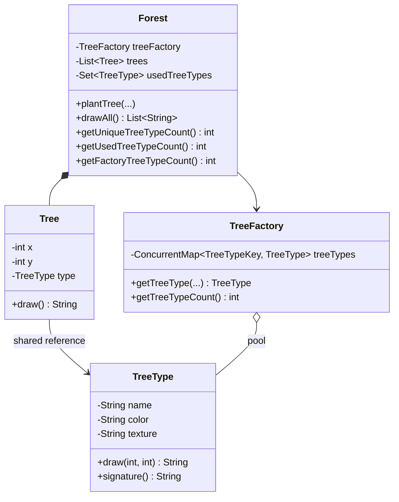
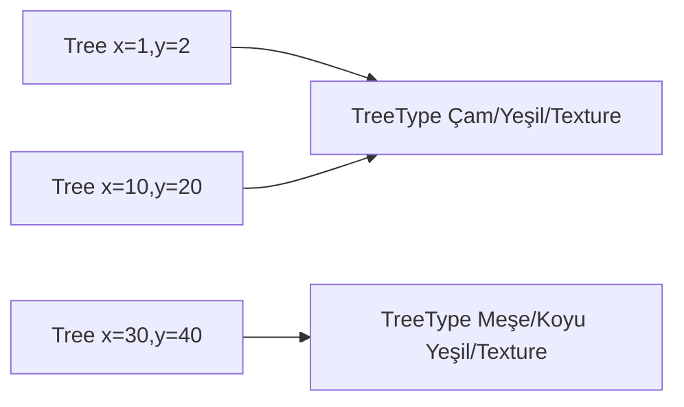

# Flyweight Pattern — Tekrarlanan Ağır Durumu Paylaşmak

> Bu örnek bellek kazancını ölçmez; String alanlarıyla intrinsic/extrinsic state ayrımını görünür kılan bir eğitim modelidir.

## 30 saniyelik kart

| Soru | Kısa cevap |
|---|---|
| Niyet | Çok sayıdaki benzer nesnenin ortak, immutable durumunu paylaşmak |
| Değişen eksen | Context sayısı ve ortak intrinsic state kombinasyonları |
| Ana araç | Flyweight havuzu/factory ve dışarıda tutulan extrinsic state |
| Korunan şey | Her context kendi konumunu korurken pahalı ortak veri tekrarlanmaz |
| Bedel | State ayrımı, lookup, identity, lifecycle ve concurrency karmaşıklığı |
| Repo cümlesi | 200 `Tree`, yalnız 2 ortak `TreeType` kullanabilir |

**Hafıza kancası:** Flyweight her ağaca ayrı tür kitabı basmaz; aynı tür kitabına referans verir.

## Örnek haritası: temel → güçlendirilmiş → production

| Katman | Repodaki karşılığı | Öğrettiği şey |
|---|---|---|
| Temel örnek | `Tree` context'i + immutable `TreeType` flyweight'i | Koordinatı extrinsic, ad/renk/texture'ı intrinsic state olarak ayırmak |
| Güçlendirilmiş örnek | `TreeTypeKey` record'u, `ConcurrentHashMap` factory ve `getUsedTreeTypeCount()` | Güvenli identity anahtarı, atomik reuse ve geriye uyumlu factory/local ölçümünü ayırmak |
| Bilinçli production sınırı | Pool bounded değildir; `Forest` mutable ve thread-safe değildir | Cardinality/eviction, texture resource lifecycle, ölçülmüş bellek kazancı ve container concurrency ayrıca tasarlanır |

## Akılda kalıcı analoji: harf kalıpları

Bir kitapta milyonlarca harf görünür. Her “a” için font dosyasını, glyph eğrisini ve stil bilgisini yeniden saklamak yerine ortak bir “a glyph” tanımı paylaşılabilir.

Her görünümün:

- sayfadaki x/y konumu farklıdır,
- fakat font/glyph biçimi ortak olabilir.

Ortak glyph bilgisi **intrinsic state**, konum ve bağlam **extrinsic state**tir.

“Cache” ile ilişkilidir ama eş anlamlı değildir. Cache çoğunlukla daha önce hesaplanan/indirilen sonucu hız için tutar; Flyweight'in ayırt edici niyeti ortak nesne state'ini paylaşarak temsil maliyetini azaltmaktır.

## Pattern olmadan problem

Her `Tree` ayrı ayrı `x, y, name, color, texture` taşısaydı aynı türden milyonlarca ağaçta `name`, `color` ve özellikle büyük texture tekrar ederdi.

Basit çözüm her şeyi nesnede tutmaktır; fakat şu koşullarda pahalılaşır:

- context sayısı çok yüksek,
- tekrar oranı yüksek,
- ortak veri büyük,
- intrinsic kombinasyon sayısı context sayısından çok düşük.

Flyweight gereksiz kullanılırsa tersine map, key ve referans overhead'i yaratabilir. On beş küçük String nesnesinde “büyük RAM tasarrufu” varsaymak doğru değildir; kazanç ölçülmelidir.

## Çözüm ve çözümün sınırı

State ikiye ayrılır:

| State türü | Bu örnekte | Özellik |
|---|---|---|
| Intrinsic | `name`, `color`, `texture` | Paylaşılabilir, context'ten bağımsız, immutable olmalı |
| Extrinsic | `x`, `y` | Her Tree'ye özel, operasyon sırasında flyweight'e verilir |

`TreeType` yalnız intrinsic state'i tutar:

```java
public String draw(int x, int y) {
    return "%s ... x=%d, y=%d".formatted(name, x, y);
}
```

`Tree` context'tir:

```java
final int x;
final int y;
final TreeType type;
```

`TreeFactory`, üç metni bir String'e yapıştırmak yerine private
`TreeTypeKey(name, color, texture)` record'unu anahtar kullanır. Aynı intrinsic üçlü
için aynı identity'yi `ConcurrentHashMap.computeIfAbsent` ile döndürür. `Forest`,
yeni bir Tree ekerken type'ı doğrudan oluşturmaz; factory'den ister ve kendi
kullandığı identity'leri ayrıca sayar.

Sınırlar:

- Intrinsic state sonradan değişirse onu paylaşan bütün context'ler etkilenir.
- Çok fazla benzersiz key varsa havuz tasarruf sağlamaz.
- Identity reuse davranışı factory scope'una bağlıdır.
- Flyweight, context nesnelerini ortadan kaldırmaz.

## Repodaki roller

Çalıştırılabilir örnek `com.can.demo.structural.flyweight.FlyweightPatternDemo`
FQCN'indedir. Sınıf yalnız `TreeFactory` ile `Forest` graph'ını kuran ve paylaşım
oranını gösteren **composition root / example driver**'dır; Flyweight rolü değildir.
Intrinsic/extrinsic state modeli `com.can.structural.flyweight` paketinde sunum
kodundan bağımsız kalır.

| Pattern rolü | Tip | Sorumluluk |
|---|---|---|
| Client / container | `Forest` | Context oluşturur ve flyweight factory'yi kullanır |
| Context | `Tree` | `x`, `y` ve `TreeType` referansını taşır |
| Flyweight | `TreeType` | Ortak name/color/texture verisini ve draw davranışını taşır |
| Flyweight Factory | `TreeFactory` | Anahtara göre `TreeType` üretir veya reuse eder |
| Composition root / example driver | `com.can.demo.structural.flyweight.FlyweightPatternDemo` | 15 context ve 3 unique type örneğini gösterir |

`TreeType` `final`, alanları `final` ve Stringler immutable olduğu için örnekte
paylaşılabilir durumdadır. `signature()` yalnız okunabilir gösterimdir; delimiter
içerebildiği için factory key'i olarak kullanılmaz.

## Yapı diyagramı



State ayrımı:



## Kodun execution trace'i

İlk iki aynı tür ağacın ekildiğini düşün:

1. `Forest.plantTree(1, 2, "Çam", ...)` çağrılır.
2. Factory `TreeTypeKey("Çam", "Yeşil", "needle-texture")` yapısal anahtarını üretir.
3. Map boş olduğu için bir `TreeType` oluşturur.
4. Type hem Forest'ın `usedTreeTypes` set'ine hem `Tree(1, 2, sharedType)` context'ine eklenir.
5. Aynı intrinsic bilgilerle ikinci `plantTree` çağrılır.
6. `computeIfAbsent` mevcut `TreeType` identity'sini döndürür.
7. İkinci `Tree` farklı x/y ama aynı type referansıyla oluşturulur.
8. `draw`, context koordinatlarını ortak type davranışına parametre olarak verir.

## Test kontratları neyi öğretiyor?

`FlyweightPatternDemoTest` dört `@Nested` hikâye içerir.

### `FactoryIdentityReuse`

- Aynı intrinsic state için `assertSame` kullanır.
- Farklı state için `assertNotSame` kullanır.
- İki unique type üretildiğini ve signature'ı doğrular.
- Alanlarında `|` bulunan iki farklı üçlünün artık aynı key sanılmadığını gösterir.
- Başlangıç bariyerinde buluşan `16` paralel aynı-key isteğinin tek identity ve tek
  factory entry'si ürettiğini deterministik biçimde sınar.

`equals` değil `same` önemlidir; desen ortak değerden daha güçlü biçimde ortak **nesne kimliği** gösterir.

### `ContextSeparation`

- İki Tree aynı `TreeType` referansını paylaşır.
- Farklı x/y değerleri exact ve farklı draw çıktıları üretir.

### `ForestAccounting`

- 200 context'in 2 flyweight ile temsil edildiğini doğrular.
- `drawAll()` sırasını ve dönen listenin değiştirilemez olduğunu gösterir.
- Paylaşılan factory iki Forest tarafından kullanıldığında local `1`, pool genelinde
  `2` sayılmasını doğrular.

### `FlyweightBoundaries`

- Blank intrinsic state'i,
- null `TreeType`,
- null factory gibi eksik graph parçalarını oluşturma sınırında reddeder.

Bu test RAM miktarını kanıtlamaz; paylaşım mekanizmasının doğru kurulduğunu kanıtlar.

## Edge case, güvenlik, concurrency ve performans

### Yapısal anahtar ve display signature ayrımı

Naif delimiter anahtarı şu çakışmayı üretirdi:

```text
("a|b", "c", "d")  -> a|b|c|d
("a", "b|c", "d")  -> a|b|c|d
```

Repo factory'si artık private `TreeTypeKey` record'u kullandığı için bu iki üçlü
farklı `equals/hashCode` değerine sahiptir. Null/blank alanlar key oluşmadan
reddedilir. `TreeType.signature()` okunabilir log/test çıktısı olarak kalır fakat
identity anahtarı değildir.

### Factory scope riski

Geriye uyumluluk için `Forest#getUniqueTreeTypeCount()` eski davranışını korur ve
paylaşılan factory havuzunun toplamını verir. Daha açık isimli
`getFactoryTreeTypeCount()` aynı değerin alias'ıdır. Yalnız o Forest'ın kullandığı
`TreeType` identity'lerini yeni `getUsedTreeTypeCount()` sayar. Böylece iki farklı
scope isimde ve testte ayrıdır; eski client'ın sonucu sessizce değişmez.

### Null ve immutability

Null factory/type ve blank intrinsic metinler constructor/factory sınırında
reddedilir. Intrinsic alanlar mutable object olsaydı defensive copy gerekirdi.
Paylaşılan flyweight state'ine context'e özel veri yazmak bütün ağaçları bozardı.

### Güvenlik

Kontrolsüz kullanıcı key'leri havuzu sınırsız büyütüp bellek tüketebilir. Cardinality limiti, eviction veya bounded scope gerekebilir. Büyük texture gibi kaynakların lifecycle'ı da açıkça kapatılmalıdır.

### Concurrency

`TreeFactory`, paralel aynı-key reuse için `ConcurrentHashMap.computeIfAbsent`
kullanır ve factory function yan etkisizdir. Bu yalnız pool'u güvenli yapar:
`Forest` içindeki `ArrayList` ve `HashSet` thread-safe değildir; eşzamanlı ekim/çizim
için confinement, lock veya immutable batch yaklaşımı gerekir.

### Performans

Her lookup küçük bir `TreeTypeKey` allocation'ı yapar. Tasarruf; context sayısı,
intrinsic boyut, unique key oranı ve map overhead'i birlikte ölçülerek
değerlendirilmelidir. JOL/profiler veya kontrollü benchmark kullanmadan “yüzde X
bellek kazancı” denmemelidir.

## Ne zaman kullan?

- Milyonlarca benzer nesne varsa.
- Büyük ve tekrar eden state ayrıştırılabiliyorsa.
- Paylaşılan state immutable/context bağımsızsa.
- Unique kombinasyon sayısı toplam context sayısından çok düşükse.

## Ne zaman kullanma?

- Nesne sayısı azsa.
- State'in çoğu context'e özelse.
- Intrinsic state sık değişiyorsa.
- Key cardinality'si kontrolsüzse.
- Tasarruf ölçülmeden yalnız pattern kullanmak için ekleniyorsa.

## Artılar ve bedeller

### Artılar

- Büyük tekrar eden state için ciddi bellek azaltımı sağlayabilir.
- Ortak immutable veriyi merkezi yönetir.
- Çok sayıda context oluşturmayı ucuzlatabilir.

### Bedeller

- Intrinsic/extrinsic ayrımı zihinsel yük getirir.
- Factory lookup ve key allocation maliyeti vardır.
- Havuz lifecycle, eviction ve concurrency politikası ister.
- Context verisi operasyonlara taşınır.
- Debug sırasında paylaşılmış state'i izlemek zorlaşabilir.

## Karışan desenlerle karşılaştırma

| Desen | Flyweight'ten farkı |
|---|---|
| Cache | Sonuç/erişim hızını hedefler; ortak nesne temsilini hedeflemek zorunda değildir |
| Singleton | Bir sınıftan tek global instance amaçlar; Flyweight key başına çok instance tutabilir |
| Object Pool | Kullanım için sınırlı mutable nesneleri ödünç verip geri alır |
| Prototype | Yeni bağımsız nesneyi kopyalayarak üretir; paylaşım ana amaç değildir |
| Proxy | Gerçek servise erişimi yönetir; intrinsic state bölmez |

## Yaygın hatalar

1. Mutable context state'ini flyweight içine koymak.
2. Delimiter birleştirmesiyle güvenilmez key üretmek.
3. Havuzu sınırsız global cache yapmak.
4. `equals` doğrulayıp ortak identity'yi test etmemek.
5. Küçük örnekte ölçmeden büyük bellek kazancı iddia etmek.
6. Factory scope'unu forest-local sanmak.
7. Thread safety'yi `computeIfAbsent` adına bakarak varsaymak.

## Üç kademeli alıştırma

### Seviye 1 — Isınma

Aynı türden üç Tree'yi farklı koordinatlarda oluştur. Type referanslarının aynı, draw sonuçlarının farklı olduğunu test et.

### Seviye 2 — Güvenli key

`TreeTypeKey` canonical constructor'ında büyük/küçük harf ve boşluk normalizasyonu
kararı ver. `" Çam "` ile `"çam"` aynı tür mü olmalı? Domain kararını identity
testleriyle açıkla.

### Seviye 3 — Ölç ve sınırla

Bounded, thread-safe bir flyweight factory tasarla. Unique key saldırısını, eviction politikasını ve paralel aynı key isteğinde identity garantisini test et; sonra bellek ölçümü yap.

## Son hafıza cümlesi

> **Flyweight, değişmeyen ağır ortak kısmı paylaşır; her context yalnız kendine özgü küçük kısmı taşır.**
