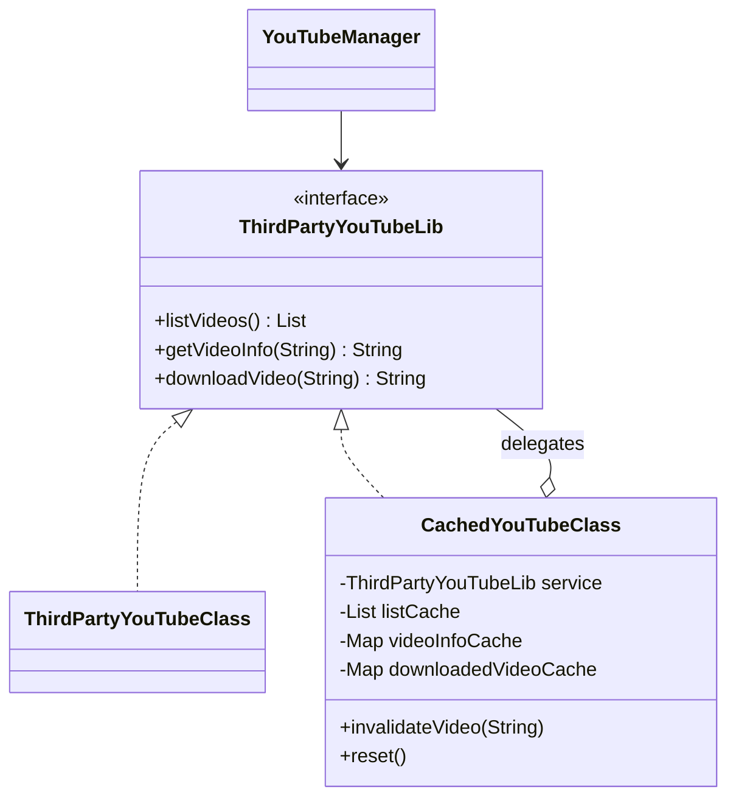
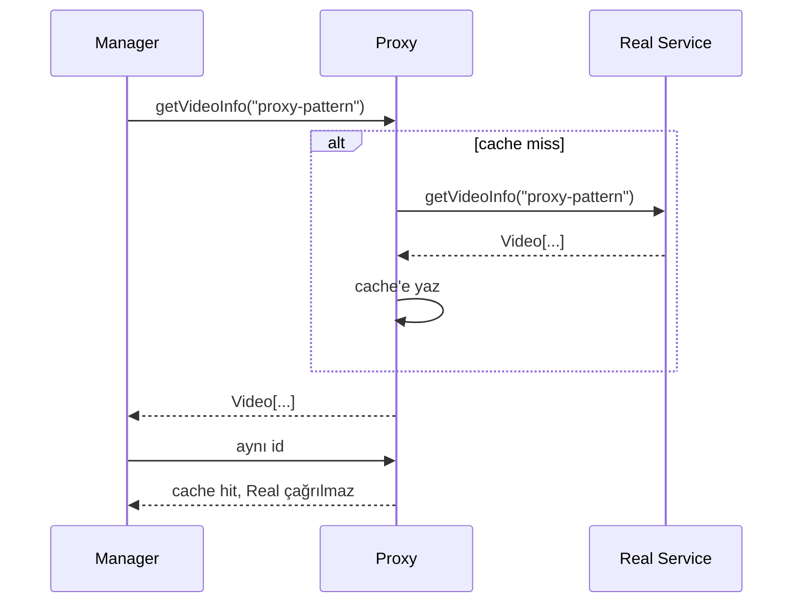

# Proxy Pattern — Gerçek Nesneye Giden Yolda Kontrollü Temsilci

> Bu örnekte uzak YouTube servisi ve download işlemi String/sayaçlarla simüle edilir; gerçek ağ, depolama veya YouTube API çağrısı yoktur.

## 30 saniyelik kart

| Soru | Kısa cevap |
|---|---|
| Niyet | Gerçek nesneyle aynı kontratı koruyarak ona erişimi yönetmek |
| Değişen eksen | Cache, yetki, lazy creation, remote iletişim veya logging politikası |
| Ana araç | Subject interface'ini uygulayan ve Real Subject'e delege eden temsilci |
| Korunan şey | Client gerçek servis ile proxy arasında değiştirilmez |
| Bedel | Gizli gecikme/state, invalidation, concurrency ve lifecycle karmaşıklığı |
| Repo cümlesi | Aynı video isteği backend'e bir kez gider, sonra cache'den döner |

**Hafıza kancası:** Proxy kapının kendisi değildir; kapıya kim, ne zaman ve nasıl ulaşır onu yöneten görevli gibidir.

## Örnek haritası: temel → güçlendirilmiş → production

| Katman | Repodaki karşılığı | Öğrettiği şey |
|---|---|---|
| Temel örnek | `ThirdPartyYouTubeLib`, `ThirdPartyYouTubeClass`, `CachedYouTubeClass` | Client'ı değiştirmeden liste, metadata ve download erişimine cache policy eklemek |
| Güçlendirilmiş örnek | Immutable liste snapshot'ı, `ConcurrentHashMap`, exact-id kontratı ve `invalidateVideo(id)` | Cache poisoning'i önlemek, Subject semantiğini korumak, aynı-key reuse'u güvenli kılmak ve hedefli invalidation yapmak |
| Bilinçli production sınırı | TTL/kapasite/tenant key yok; download String'dir | Dağıtık stampede, eviction, stale toleransı, CDN/object storage ve authorization ayrıca tasarlanır |

## Akılda kalıcı analoji: güvenlik turnikesi

Ofisteki turnike geçiş kartını kontrol eder, denetim kaydı tutabilir ve yetkisiz isteği toplantı odasına ulaşmadan durdurur.
Oda işini değiştirmez; aynı hedefe giden erişim yolu kontrol edilir.

Caching Proxy'de görevli daha önce istenen bilgiye sahipse gerçek servise tekrar gitmez. Bu repodaki `CachedYouTubeClass` yalnız caching proxy çeşidini gösterir; lazy initialization, authorization ve remote transport kodda uygulanmış değildir.

## Pattern olmadan problem

`YouTubeManager` doğrudan uzak servise bağlanırsa her ekran çiziminde:

- video listesi tekrar indirilebilir,
- aynı video metadata'sı tekrar istenebilir,
- aynı download tekrar başlatılabilir,
- latency ve kota maliyeti client koduna yayılır.

Cache için `containsKey/get/remote call` akışını manager içine koymak da erişim politikasını UI sorumluluğuna karıştırır.

Bu durumda UI/client:

- remote erişim politikasını bilir,
- birden çok manager aynı cache kodunu tekrarlar,
- gerçek servis yerine farklı policy vermek zorlaşır,
- Single Responsibility ihlal edilir.

## Çözüm ve çözümün sınırı

Gerçek servis ve Proxy aynı Subject interface'ini uygular:

```java
public interface ThirdPartyYouTubeLib {
    List<String> listVideos();
    String getVideoInfo(String id);
    String downloadVideo(String id);
}
```

Proxy gerçek servisi içeride tutar:

```java
public String getVideoInfo(String id) {
    String exactId = Objects.requireNonNull(id, "video id cannot be null");
    return videoInfoCache.computeIfAbsent(exactId, service::getVideoInfo);
}
```

Client yalnız interface görür:

```java
ThirdPartyYouTubeLib service = new CachedYouTubeClass(realService);
YouTubeManager manager = new YouTubeManager(service);
```

Proxy'nin sınırı:

- Aynı interface şeffaflığı, aynı non-functional davranış anlamına gelmez.
- Cache freshness ve invalidation kendiliğinden çözülmez.
- Proxy gerçek servisin domain hatalarını gizlememelidir.
- Caching Proxy cache key üretirken Subject girdisini trim/normalize ederek
  fonksiyonel sonucu değiştirmemelidir.
- Dağıtık sistemde “aynı çağrı” idempotent olmayabilir.
- Cache her operasyona uygun değildir; download sonucu büyük olabilir.

Liste cache'i özel olarak immutable snapshot üretir:

```java
listCache = List.copyOf(service.listVideos());
```

Bu hem kaynağın sonradan değişmesini cache'ten ayırır hem client'ın `add/set` ile
gelecekteki hit'leri zehirlemesini engeller. `invalidateVideo(id)` yalnız ilgili
metadata ve download entry'sini siler; `reset()` bütün bölgeleri temizler.

## Repodaki roller

| Pattern rolü | Tip | Sorumluluk |
|---|---|---|
| Subject | `ThirdPartyYouTubeLib` | Client ve iki servis için ortak kontrat |
| Real Subject | `ThirdPartyYouTubeClass` | Sonuç üretir ve gerçek çağrı sayısını simüle eder |
| Proxy | `CachedYouTubeClass` | Liste, bilgi ve download sonuçlarını cache'ler; hedefli/tam invalidation sunar |
| Client | `YouTubeManager` | Yalnız Subject üzerinden panel/page/download üretir |
| Composition root | `ProxyPatternDemo` | Real Subject, Proxy ve Client graph'ını kurar |

Real service içindeki sayaçlar öğretici test gözlem noktalarıdır. Production remote client'ın ana sorumluluğuna test sayacı eklemek yerine metrics veya fake kullanılmalıdır.

## Yapı diyagramı



Cache hit/miss akışı:



## Kodun execution trace'i

`renderVideoPage("proxy-pattern")` iki kez çağrıldığında:

1. Manager Subject'ten `getVideoInfo(id)` ister.
2. Proxy map'te id'yi bulamaz.
3. `computeIfAbsent` Real Subject metodunu çağırır.
4. Real Subject id sayacını `1` yapar ve String döndürür.
5. Proxy sonucu map'e koyar.
6. Manager `"VideoPage => ..."` çıktısını üretir.
7. İkinci çağrıda map sonucu bulunur.
8. Real Subject sayacı `1` kalır.

`invalidateVideo(id)` yalnız o id'nin info/download kayıtlarını siler. `reset()`
liste alanını synchronized blokta null yapar ve iki map'i temizler. Sonraki ilk
çağrı yeniden miss olur.

## Test kontratları neyi öğretiyor?

`ProxyPatternDemoTest` altı `@Nested` hikâye kullanır.

### `SubjectContract`

- Aynı parametreli kontrat testini hem Real Subject hem Caching Proxy üzerinde
  çalıştırır.
- Başında/sonunda boşluk olan ve blank id'nin iki implementasyonda da exact
  korunduğunu gösterir.
- Null id'nin iki tarafta da aynı hata ailesiyle reddedildiğini doğrular.

### `ListCaching`

- Manager'ın görünür panel çıktısını exact doğrular.
- İki client çağrısına rağmen Real Subject'in bir kez çağrıldığını kanıtlar.
- Mutable service listesinin immutable ve defensive snapshot'a dönüştüğünü gösterir.

### `VideoInfoCaching`

- Cache'in id bazında çalıştığını,
- aynı id'nin reuse edildiğini,
- farklı id'nin bağımsız miss oluşturduğunu gösterir.

### `DownloadCachingAndReset`

- Aynı download sonucunun tekrar kullanıldığını doğrular.
- Reset sonrası backend sayacının arttığını gösterir.
- Reset'in list, info ve download bölgelerinin tamamını temizlediğini sınar.
- Tek video invalidation'ının başka id'nin sıcak cache entry'sini koruduğunu kanıtlar.

### `ConcurrentCacheCoordination`

- Başlangıç bariyerinde buluşan `16` paralel liste miss'inin tek backend çağrısı ve
  tek immutable snapshot identity'si ürettiğini,
- `16` paralel aynı-id metadata miss'inin tek cached value ve tek backend çağrısına
  birleştiğini deterministik executor testiyle kanıtlar.

### `ProxyBoundaries`

- Null servis/manager bağımlılığını,
- null video id'sini ve null invalidation hedefini fail-fast reddeder.

Bu testlerde görünür sonuç ile backend çağrı sayısı birlikte assert edilir. Yalnız eşit String kontrolü, Proxy gerçekten cache kullanmadan da geçebilirdi.

## Edge case, güvenlik, concurrency ve performans

### Immutable liste cache'i

`listVideos()` real service sonucunu `List.copyOf` ile bir kez snapshot'a çevirir.
`volatile` referans ve synchronized miss bölümü aynı proxy instance'ında listenin
güvenli publication'ını sağlar. Client mutation denemesi
`UnsupportedOperationException` üretir; kaynağın sonraki mutation'ı snapshot'ı
değiştirmez.

### Null ve failure semantiği

Null service constructor'da, null video id hem Real Subject hem Proxy'de gerçek
işlemden önce reddedilir. Blank ve whitespace içeren id ise mevcut Subject
kontratında geçerlidir ve **aynen** korunur; caching katmanı trim ederek görünür
sonucu veya cache-key eşitliğini değiştirmez. Gerçek domain blank id'yi yasaklayacaksa
bu kural ortak bir `VideoId` value object veya bütün Subject implementasyonlarında
aynı contract ile uygulanmalıdır.

`Map.computeIfAbsent` mapping function null döndürürse değer saklanmaz; aynı id her
seferinde backend'e gider. Exception da cache'lenmez ve sonraki çağrı yeniden dener.
Bunun doğru olup olmadığı açık negatif-cache/retry politikası olmalıdır.

### Freshness, kapasite ve invalidation

Cache'te hedefli `invalidateVideo(id)` ve bütün bölgeleri temizleyen `reset()` vardır;
fakat TTL ve maksimum entry yoktur. Veri explicit invalidation'a kadar stale
kalabilir ve farklı id'ler belleği sınırsız büyütebilir. Caffeine gibi
battle-tested cache çoğu production senaryosunda daha güvenlidir.

### Güvenlik

Protection Proxy yazılıyorsa authentication kadar authorization, tenant isolation ve audit gerekir. Cache key tenant/rol bilgisini içermiyorsa bir kullanıcının sonucu diğerine sızabilir. Hassas video metadata'sı cache ve loglarda şifreleme/retention gerektirebilir.

### Concurrency

Info/download bölgeleri `ConcurrentHashMap.computeIfAbsent`, liste bölgesi
volatile + synchronized miss kullanır. Real service'in eğitim sayaçları da atomik
hale getirilmiştir. Bu, tek JVM'deki aynı proxy instance'ının temel reuse'unu
iyileştirir; başlangıç bariyerli paralel testler aynı instance'ta tek backend çağrısı
olduğunu görünür kılar. `reset/invalidate` ile devam eden request yarışı ve birden
çok instance/JVM arasındaki distributed stampede hâlâ çözülmüş değildir.

### Performans

Cache latency ve remote çağrı sayısını azaltabilir; fakat serialization, memory, eviction ve invalidation maliyeti getirir. Hit ratio, backend latency, entry size ve stale-data bedeli ölçülmelidir. Download payload'ını bellekte cache'lemek yerine object storage/CDN gerekebilir.

## Ne zaman kullan?

- Pahalı/uzak nesneye erişimi geciktirmek veya azaltmak istiyorsan.
- Yetkilendirmeyi Subject sınırında uygulayacaksan.
- Remote nesneyi yerel interface gibi sunacaksan.
- Logging, rate limit veya metrics'i client'tan ayıracaksan.
- Client'ın gerçek ve temsilci arasında değişmeden kalması önemliyse.

## Ne zaman kullanma?

- Cache doğruluğu freshness gereksinimini karşılamıyorsa.
- Operasyon yan etkili ve tekrar kullanılamazsa.
- Ek katman yalnızca çağrıyı geçiriyor, policy sunmuyorsa.
- Client'ın gelişmiş backend özelliklerine doğrudan ihtiyacı varsa.
- Dağıtık cache karmaşıklığı kazançtan büyükse.

## Artılar ve bedeller

### Artılar

- Client'ı değiştirmeden erişim policy'si ekler.
- Remote çağrı ve latency'yi azaltabilir.
- Gerçek servisi security/lifecycle detayından ayırır.
- Interface sayesinde fake ve farklı proxy'ler kolay bağlanır.

### Bedeller

- Gizli state ve gecikme davranışı ekler.
- Stale data ve invalidation zordur.
- Memory/capacity ve concurrency yönetimi gerekir.
- Hata, retry ve observability bir kat daha karmaşıklaşır.

## Karışan desenlerle karşılaştırma

| Desen | Proxy'den farkı |
|---|---|
| Adapter | Farklı interface'i hedef interface'e çevirir |
| Decorator | Asıl niyet davranış/sorumluluk eklemektir |
| Facade | Alt sisteme daha sade ve çoğu zaman farklı bir API sunar |
| Flyweight | Ortak intrinsic nesne state'ini paylaşır |
| Gateway | Uzak sisteme uygulama-özel sınır sunabilir; Proxy aynı Subject şeffaflığını hedefler |

Proxy ve Decorator yapısal olarak benzerdir. Ayrım niyettedir: **erişim kontrolü mü, davranış zenginleştirme mi?**

## Yaygın hatalar

1. Mutable sonucu doğrudan cache'ten dışarı vermek.
2. TTL ve invalidation olmadan cache'i sonsuz doğru sanmak.
3. Null/exception sonucunun cache politikasını belirsiz bırakmak.
4. Thread-safe olmayan map'i paylaşılan proxy'de kullanmak.
5. Tenant/user bilgisini cache key'den çıkarmak.
6. Her download veya side-effect'i güvenle cache'lenebilir sanmak.
7. Proxy'nin lazy olduğunu söyleyip gerçek servisi eager oluşturmak.

## Üç kademeli alıştırma

### Seviye 1 — Isınma

İki farklı video id'sini ikişer kez iste. Her id için görünür sonuç dört kez üretilirken backend sayacının bir olduğunu test et.

### Seviye 2 — Güvenli liste cache'i

Liste cache'ine ayrı `invalidateList()` ekle. Yalnız listeyi soğutup info/download
entry'lerini koruduğunu ve sonraki iki paralel liste isteğinin tek backend çağrısıyla
sonuçlandığını test et.

### Seviye 3 — Production cache policy

`Clock`, TTL, maksimum boyut ve id bazlı invalidation ekleyen bir proxy tasarla. Paralel aynı-key miss, backend exception, null cevap ve tenant isolation senaryolarını test doubles ile sınayarak trade-off'ları yaz.

## Son hafıza cümlesi

> **Proxy gerçek nesnenin maskesi değil, ona giden yolun politikasını taşıyan aynı yüzlü temsilcidir.**
